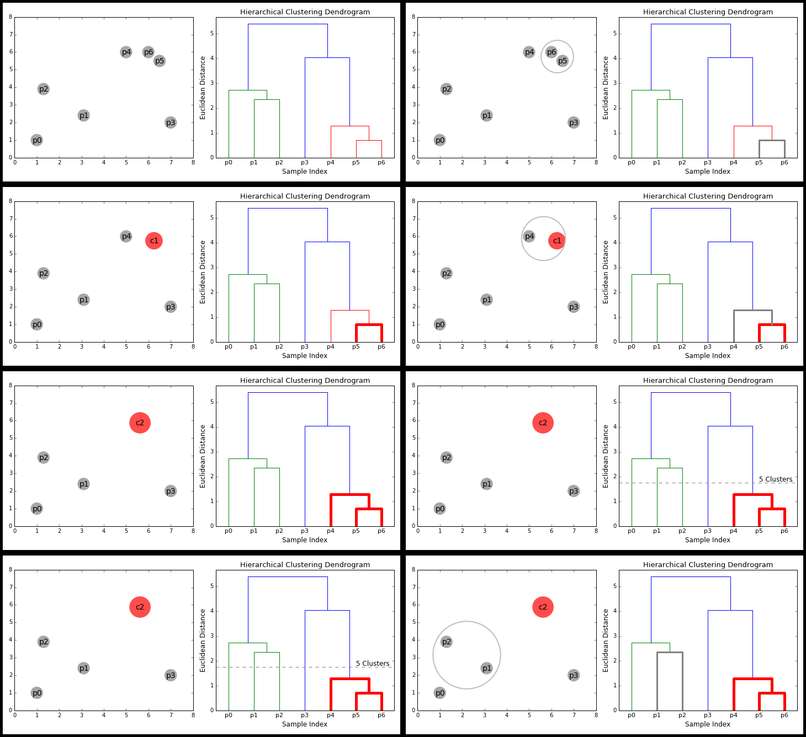

# Méthodes de classification non supervisée {#chap13}

Dans le cadre de ce chapitre, nous présentons les méthodes les plus utilisées en sciences sociales pour explorer la présence de groupes homogènes au sein d'un jeu de données, soit les méthodes de classification non supervisée. Le qualificatif *non supervisée* signifie que ces classes / groupes ne sont pas connues a priori et doivent être identifiées à partir des données. Autrement dit, nous cherchons à regrouper les observations partageant des caractéristiques similaires sur la base de plusieurs variables. Ces méthodes descriptives et exploratoires multivariées peuvent être vues comme une façon de réduire le nombre d'observations d'un jeu de données à un ensemble d'observations synthétiques, représentant le mieux possible la population à l’étude.

::: {.bloc_package data-latex=""}
Dans ce chapitre, nous utilisons principalement les *packages* suivants&nbsp; 

* Pour créer des graphiques&nbsp;
  - `ggplot2`, le seul, l'unique!
  - `ggpubr` pour combiner des graphiques et réaliser des diagrammes.

* Outils généraux pour faciliter les classifications.
  - `clusterCrit` pour calculer des indicateurs de qualités de classification.
  - `NbClust` pour trouver le bon nombre de groupe dans une classification.
  - `cluster` pour appliquer la méthode GAP.
  - `proxy` pour calculer plusieurs types de distances.
  - `Gmedian`, pour calculer le k-medians.
  - `geocmeans` pour investiguer les résultats de classifications floues.
:::


::: {.bloc_objectif data-latex=""}
**Pourquoi recourir à des méthodes de classification non supervisée en sciences sociales?**
Les méthodes de classification sont très utilisées en sciences sociales. Elles visent à d'identifier des groupes cohérents au sein d'un ensemble d'observations sur la base de plusieurs variables. Ces groupes peuvent ensuite être analysés et nous renseigner sur les caractéristiques communes partagées par les individus qui les composent. 

Un exemple classique est l'identification de profils d'individus ayant répondu à un sondage, en fonction de plusieurs caractéristiques (par exemple l'âge, le sexe, la situation de famille, le revenu, etc.). En identifiant ces groupes homogènes, il est ensuite possible d'explorer les associations entre ces profils et d'autres variables.

Un second exemple serait de regrouper les secteurs d'une ville selon leurs caractéristiques environnementales (présence de végétation, niveau de bruit, pollution atmosphérique, etc.) et socioéconomiques (revenu médian des ménages, pourcentages d’immigrants, de personnes à faible scolarité, taux de chômage, etc.).
:::

## Une multitude des méthodes de classication&nbsp; un aperçu {#sect131}

Il existe une multitude de méthodes de classification généralement regroupées dans plusieurs familles imbriquées à partir de deux distinctions importantes.

La première distinction vise à séparer les méthodes **supervisées** et **non supervisées**. Pour les premières, les catégories / groupes / classes des observations sont connues à l'avance. L'enjeu n'est pas de trouver les catégories puisqu’elles sont connues, mais **de déterminer des règles ou un modèle permettant d'attribuer des observations à ces catégories**. Parmi les méthodes de classification supervisée, les plus connues sont les forêts d’arbres décisionnels, les réseaux de neurones artificiels ou encore l’analyse factorielle discriminante. Nous n'abordons pas ces méthodes dans ce chapitre dédié uniquement aux méthodes de classification non supervisée. Pour ces dernières, les catégories ne sont pas connues à l'avance et l'enjeu est de **faire ressortir des structures des groupes propres aux données**. Ainsi, les méthodes de classification non supervisée « relèvent de la statistique exploratoire multidimensionnelle et permettent de classifier automatiquement les observations sans connaissance a priori sur la nature des classes présentes dans le jeu de données; les plus connues sont sans conteste les algorithmes de classification ascendante hiérarchique (CAH) et k-means (k-moyennes) » [@gelb2021apport, p.1]. Notez également qu'à la frontière entre ces deux familles se situent les méthodes de classification semi-supervisée. Il s'agit de cas spécifiques où des informations partielles sont connues sur les groupes à détecter&nbsp; seulement le groupe final de certaines observations est connu, certaines observations sont supposées appartenir à un même groupe même s'il est indéfini en lui-même [@bair2013semi].


La seconde distinction vise à séparer les méthodes **strictes** et **floues**. Les premières ont pour objectif d'assigner chaque observation à une et une seule catégorie, alors que les secondes décrivent le degré d’appartenance de chaque observation à chaque catégorie. Autrement dit, «&nbsp;dans une classification stricte, chaque observation appartient à une seule classe&nbsp; mathématiquement parlant, l’appartenance à une classe donnée est binaire (0 ou 1) tandis que dans une classification floue, chaque observation a une probabilité d’appartenance variant de 0 à 1 à chacune des classes&nbsp;» [@gelb2021apport, p.1]. Bien entendu, pour chaque observation, la somme des degrés d’appartenance à chacune des classes sera égale à 1 (figure \@ref(fig:floueVSstrict)). En termes de données, cela signifie que pour les méthodes strictes, le groupe d'appartenance d'une observation sera contenu dans une seule variable nominale (une colonne d'un *dataframe*). Pour les méthodes floues, il est nécessaire de disposer d’autant de variables continues (plusieurs colonnes numériques d'un *dataframe*), soit une par groupe, dans lequel sera enregistré le degré d'appartenance de chaque observation à chacun des groupes.

```{r floueVSstrict, echo=FALSE, fig.align='center', fig.cap="Classifications stricte et floue", message=FALSE, warning=FALSE, auto_pdf=TRUE, out.width='40%'}
library(dplyr)
library(ggplot2)
knitr::include_graphics('images/classification/floueVSstricte.png', dpi = NA)
```


En résumé, le croisement de ces deux distinctions permet de ainsi de différencier les méthodes **supervisées strictes**, **supervisées floues**, **non supervisées strictes** et **non supervisées floues**(figure \@ref(fig:methoClassif)), auxquelles s'ajoutent les méthodes semi-supervisées discutées brièvement.

```{r methoClassif, echo=FALSE, fig.align='center', fig.cap="Synthèse des principales méthodes de classification (Gelb et Apparicio 2021)", message=FALSE, warning=FALSE, auto_pdf=TRUE, out.width='60%'}
knitr::include_graphics('images/classification/syntheseClassif.png', dpi = NA)
```

Parmi les méthodes de classification supervisée floue, notez que nous avons déjà abordé la régression logistique multinomiale dans le chapitre sur les GLM (section \@ref(sect0824)).

Dans ce chapitre, nous décrirons les trois méthodes les plus classiques et les plus faciles à mettre en œuvre soit&nbsp; la classification ascendante hiérarchique, les nuées dynamiques strictes (k-means et k-median) et nuées dynamiques floues (c-means et c-median). **a supprimer! Ces méthodes de classification non supervisées peuvent être appliquées avec deux approches théoriques différentes&nbsp; exploratoire ou confirmatoire.** JE PENSE QU'UNE MÉTHODE NON SUPERVISÉE EST TOUJOURS EXPLORATOIRE. JE SAIS QUE TU PARLES DE DÉMARCHES THÉORIQUES, JE SUPPRIMERAI DONC LES 2 PARAGRAPHES QUI RISQUENT DE MÉLER LE LECTEUR. A DISCUTER ENSEMBLE. 

* exploratoire&nbsp; les groupes sont inconnus à l'avance à la fois dans les données et sur le plan théorique. L'objectif de la classification est alors de "faire parler les données", d'identifier des groupes et d'ensuite construire une réflexion autours des résultats obtenus. Il est possible de faire des parallèles entre cette approche et la théorie ancrée (*grounded-theory*), inductive, visant à construire des théories à partir des données plutôt que de tester des théories établies à priori avec des données. Attention cependant à bien noter qu'une approche exploratoire ne permet pas de tester et de valider la théorie construite. En effet, il est nécessaire de collecter de nouvelles données dans une démarche cette fois-ci confirmatoire pour vérifier que la théorie établie précédemment est valide. Le risque en approche exploratoire est de construire des théories qui ne seraient pas supportées par de nouvelles données, notamment du fait de corrélations illusoires où du simple hasard. En étudiant un échantillon suffisamment grand, il est certains que des relations apparaîtront, mais se pose alors la question de la pertinence de ces relations. C'est pourquoi nous recommandons d'éviter autant que possible d'étudier des données sans cadre théorique.

* confirmatoire&nbsp; les groupes sont inconnus dans les données, mais le cadre théorique de la recherche prévoit d'observer certains groupes du fait par exemple de travaux antérieur. Dans ce contexte, l'objectif est de vérifier si le cadre théorique utilisé est valide, soit que les résultats de la classification vont dans le sens de la théorie. 


## Notions essentielles en classification {#sectclassFond}

Avant de décrire différentes méthodes de classification non supervisées, il convient de définir deux notions centrales, soit la **distance** et l'**inertie**.

### Distance

La distance en analyse de données est définie comme une fonction (*d*) permettant de déterminer à quel point deux observations sont semblables ou différentes l'une de l'autre. Elle doit respecter les conditions suivantes&nbsp;

* **la non négativité**&nbsp; la distance minimale entre deux objets est égale à 0; $d(x,y) \geq 0$.
* **le principe d'identité des indiscernables**&nbsp; la distance entre deux objets $x$ et $y$ est égale à 0, si $x = y$; $d(x,y)=0\text{ si et seulement si }x=y$.
* **la symétrie**&nbsp; la distance entre $x$ et $y$ est la même qu'entre $y$ et $x$; $d(x,y) = d(y,x)$.
* **le triangle d'inégalité**&nbsp; passer d'un point $x$ à un point $z$ est toujours plus court ou égal que de passer par $y$ entre $x$ et $z$; $d(x,z)\leq d(x,y)+d(y,z)$.

Il existe un grand nombre de types de distance que l'on peut utiliser pour déterminer le degré de (dis)similarité entre les observations. Nous présentons ici les six types les plus fréquemment utilisées en sciences sociales, mais retenez qu’il en existe bien d'autres.

#### La distance euclidienne

Il s'agit vraisemblablement de la distance la plus couramment utilisée, soit la longueur de la ligne droite la plus courte entre les deux objets considérés. Pour la représenter, admettons que nous nous intéressons à trois classes d'étudiant·e·s A, B et C pour lesquelles nous avons calculé la moyenne de leurs notes dans les cours de méthodes quantitatives et qualitatives. Ces deux variables sont mesurées dans la même unité et varient de 0 à 100. Le nuage de points à la figure \@ref(fig:dist0) illustre cette situation avec des données fictives.

```{r dist0, echo=FALSE, fig.align='center', fig.cap="Situation de base pour le calcul de distance", message=FALSE, warning=FALSE, auto_pdf=TRUE, out.width='60%'}

df <- data.frame(
  "classe" = c("A","B","C"),
  "quantitative" = c(85,80,83),
  "qualitative" = c(80,79,77)
)

ggplot(df) + 
  geom_point(aes(x = quantitative, y = qualitative, color = classe), size = 3) + 
  scale_color_manual(values = c("A" = "#E73D3D", "B" = "#3CE73C", "C" = "#3C3CE7")) + 
  labs(x = "Moyenne des notes en méthodes quantitatives",
       y = "Moyenne des notes en méthode qualitatives")

```

Les distances euclidiennes entre les classes B et C et les classes C et A sont représentées par les lignes noires à la figure \@ref(fig:dist1). On peut constater que la distance entre les classes C et B est plus petite que celle entre les classes A et C, ce qui signale que les deux premières se ressemblent davantage.


```{r dist1, echo=FALSE, fig.align='center', fig.cap="Représentation de la distance euclidienne", message=FALSE, warning=FALSE, auto_pdf=TRUE, out.width='60%'}

df2 <- data.frame(
  xstart = c(80,83),
  xend = c(83,85),
  ystart = c(79,77),
  yend = c(77,80)
)

ggplot(df) + 
  geom_segment(data = df2, mapping = aes(x = xstart, y = ystart, 
                                         xend = xend, yend = yend))+
  geom_point(aes(x = quantitative, y = qualitative, color = classe), size = 3) + 
  scale_color_manual(values = c("A" = "#E73D3D", "B" = "#3CE73C", "C" = "#3C3CE7")) + 
  labs(x = "Moyenne des notes en méthodes quantitatives",
       y = "Moyenne des notes en méthode qualitatives")

```


La formule de la distance euclidienne (équation \@ref(eq:euclideandist)) est simplement la racine carrée de la somme des écarts au carré pour chacune des variables décrivant les observations *a* et *b*.

POURQUOI C DANS LA FIGURE c POUR LE NOMBRE DE VARIABLES. A VOIR ENSEMBLE. MEME CHOSE POUR LES AUTRES ÉQUATIONS.

\footnotesize
\begin{equation}  
d(a,b) = \sqrt{\sum{}^c_{i=1}(a_i-b_i)^2}
(\#eq:euclideandist)
\end{equation}
\normalsize


Nous pouvons facilement calculer la distance euclidienne pour notre jeu de données&nbsp; 

* $d(A,B)=\sqrt{(85-80)^2+(80-77)^2} = 5.83$
* $d(B,C)=\sqrt{(80-83)^2+(79-77)^2} = 3,60$

::: {.bloc_attention data-latex=""}
**Distance et unité de mesure&nbsp; ** Il est très important de garder à l'esprit que la distance entre deux observations dépend directement des unités de mesure utilisées. Ceci est très souvent problématique, car il est rare que toutes les variables utilisées pour décrire des observations utilisent la même unité de mesure. Ainsi, une variable dont les valeurs numériques seraient plus grandes risquerait de déséquilibrer les calculs de distance. À titre d'exemple, une variable mesurée en mètres plutôt qu'en kilomètres produirait des distances euclidiennes 1000 fois plus grandes.

Il est donc nécessaire de standardiser les variables utilisées avant de calculer des distances. Cette opération permet de transformer les variables originales vers une échelle commune. Plusieurs types de transformations peuvent être utilisés tels que décrit à la section \@ref(sect02552)&nbsp;

* **Le centrage et la réduction** qui consistent à soustraire à chaque valeur sa moyenne, puis à la diviser par son écart-type. La nouvelle variable obtenue s'exprime alors en écart-type (appelé aussi score-Z). La formule de la transformation est $f(x) = \frac{x - \bar{x}}{\sigma_x}$, avec $\bar{x}$ la moyenne de $x$ et $\sigma_x$ l'écart-type de $x$.
* **La transformation sur une mise à l'échelle de 0 à 1** qui permet de modifier l'étendue d'une variable afin que sa valeur maximale soit de 1 et sa valeur minimale soit de 0. La formule de cette transformation est $f(x) = \frac{x-min(x)}{max(x)-min(x)}$.
* **La transformation en rangs** qui consiste à remplacer les valeurs d'une variable par leurs rangs. La valeur la plus faible est remplacée par 1, et la plus forte par *n* (nombre d'observations). Notez que cette transformation modifie la distribution de la variable originale contrairement aux deux transformations précédentes. Cette propriété peut être désirable si les écarts absolus entre les valeurs ont peu d'importance, si la variable n'a pas été mesurée avec précision ou encore si des valeurs extrêmes sont présentes.
* **La transformation en percentiles** qui consiste à remplacer les valeurs d'une variable par leur percentile correspondant. Elle peut être vue comme une standardisation de la transformation en rangs, car elle ne dépend pas du nombre d'observations.

La figure \@ref(fig:impactTransform) montre l'impact de ces transformation sur l'histogramme d'une variable.

```{r impactTransform, echo=FALSE, fig.align='center', fig.cap="Impacts de différentes transformations sur la distribution d'une variable", fig.pos="H", message=FALSE, warning=FALSE, auto_pdf=TRUE, out.width='80%'}

x <- rgamma(10000, 0.95,0.1)
dfx <- data.frame(
  x = x,
  xstd = (x - mean(x)) / sd(x),
  x_01 = (x-min(x)) / (max(x) - min(x)),
  x_rang = rank(x,ties.method = "min"),
  x_prt = trunc(rank(x,ties.method = "average"))/length(x)
)

x2 <- reshape2::melt(dfx)

x2$variable <- case_when(x2$variable == "x" ~ "1-originale",
                         x2$variable == "xstd" ~ "2-centrée-réduite",
                         x2$variable == "x_01" ~ "3-mise à l'échelle 0-1",
                         x2$variable == "x_rang" ~ "4-rangs",
                         x2$variable == "x_prt" ~ "5-percentiles",
                         )

ggplot(x2) + 
  geom_histogram(aes(x = value), bins = 50, color = "white") + 
  facet_wrap(vars(variable), ncol=2, scales = "free")

```
:::

#### La distance de Manhattan

Cette seconde distance est également couramment utilisée. Elle doit son nom au réseau de rue de l'île de Manhattan qui suit un plan quadrillé. La distance de Manhattan correspond à la somme des écarts absolus entre les valeurs des différentes variables décrivant les observations (équation \@ref(eq:manhattandist)). La figure \@ref(fig:dist2) illustre que la distance Manhattan (lignes noires) représente les deux côtés opposés de l'hypoténuse d’un triangle rectangle; l'hypoténuse représentant quant à lui la distance euclidienne.

\footnotesize
\begin{equation}  
d(a,b) = \sum{}^c_{i=1}(|a_i-b_i|)
(\#eq:manhattandist)
\end{equation}
\normalsize


```{r dist2, echo=FALSE, fig.align='center', fig.cap="Représentation de la distance de Manhattan", message=FALSE, warning=FALSE, auto_pdf=TRUE, out.width='60%'}

df2 <- data.frame(
  xstart = c(85,83,80,80),
  xend = c(83,83,80,83),
  ystart = c(80,80,79,77),
  yend = c(80,77,77,77)
)

ggplot(df) + 
  geom_segment(data = df2, mapping = aes(x = xstart, y = ystart, 
                                         xend = xend, yend = yend))+
  geom_point(aes(x = quantitative, y = qualitative, color = classe), size = 3) + 
  scale_color_manual(values = c("A" = "#E73D3D", "B" = "#3CE73C", "C" = "#3C3CE7")) + 
  labs(x = "Moyenne des notes en méthodes quantitatives",
       y = "Moyenne des notes en méthode qualitatives")

```

La distance de Manhattan doit être privilégiée à la distance euclidienne lorsque les données considérées ont un très grand nombre de dimensions (variables). En effet, lorsque le nombre de variables est important (supérieur à 30), la distance euclidienne tend à être grande pour toutes les PAIRES D’observations et à moins bien discriminer les observations proches et lointaines les unes des autres. Du fait de sa nature additive, la distance de Manhattan est moins sujette à ce problème [@aggarwal2001surprising].

Calculons la distance de Manhattan pour nos deux paires d'observations&nbsp;

* $d(A,B)=|85-80|+|80-77| = 8$
* $d(B,C)=|80-83|+|79-77| = 5$

#### La distance du Chi^2^

La distance du $\chi^2$ est basée sur le test du $\chi^2$ et est généralement utilisée pour calculer la distance entre deux histogrammes, deux images ou deux ensembles de mots. Plus précisemment, elle permet de mesure la distance entre deux observations A et B, pour lesquels nous disposons d'un ensemble de variables étant toutes des variables de comptage.

Prenons un exemple concret en générant trois histogrammes A, B et C sur l'intervalle [0,50] à partir d'une distribution normale, log-normale et gamma et comptons le nombre de valeur tombant de chaque unité (1,2,3,4, ect.). Ces histogrammes sont représentés à la figure \@ref(fig:dist3).

```{r dist3, echo=FALSE, fig.align='center', fig.cap="Représentation de la distance du chi2", message=FALSE, warning=FALSE, auto_pdf=TRUE, out.width='75%'}

set.seed(123)
x1 <- rnorm(500, mean = 25, sd = 5)
x2 <- rlnorm(500, meanlog = 2.75, sdlog = 0.25)
x3 <- rgamma(500, 2,0.2)

df <- data.frame(
  normal = x1,
  lognormal = x2,
  gamma = x3
)

df2 <- reshape2::melt(df)
df2$distribution <- case_when(
  df2$variable == "normal" ~ "Normale",
  df2$variable == "lognormal" ~ "log Normale",
  df2$variable == "gamma" ~ "Gamma",
)
df2$distribution <- as.factor(df2$distribution)

ggplot(df2) + 
  geom_histogram(aes(x = value), breaks = 0:50) +
  facet_wrap(vars(distribution), ncol=2) + 
  labs(x = "", y = "")
  

```

Nous pouvons calculer la distance du $\chi^2$ entre chaque paire d'histogramme et la représenter dans le tableau \@ref(tab:tableRevMoyMed).

```{r tabdist3, echo=FALSE, message=FALSE, warning=FALSE, auto_pdf=TRUE, out.width='50%'}

chi2dist <- function(x,y){
  vec1 <- (x-y)**2
  vec2 <- x+y
  sum(vec1[vec2!=0] / vec2[vec2!=0])/2
}

A <- hist(df$normal, breaks = 0:50, plot = FALSE)$counts
B <- hist(df$lognormal, breaks = 0:50, plot = FALSE)$counts
C <- hist(df$gamma, breaks = 0:50, plot = FALSE)$counts

tableau <- data.frame(
  pair = c("A-B","A-C","B-C"),
  distances = c(chi2dist(A,B), chi2dist(A,C), chi2dist(B,C))
)

show_table(tableau,
           col.names = c("Histogrammes","Distance du chi^2^"),
            caption = "Distance du chi-carré entre trois histogrammes"
           )

```

On peut ainsi constater que les histogrammes B et C sont les plus semblables.

La formule de cette distance est la suivante&nbsp; 

\footnotesize
\begin{equation}  
d_{\chi^2}(a,b) = \frac{1}{2}*\sum^n_{i=1}\frac{(a_i-b_i)^2}{(a_i+b_i)}
(\#eq:chi2dist)
\end{equation}
\normalsize

Avec $a_i$ et $b_i$ les comptages pour les histogrammes. Notez que si $a_i$ et $b_i$ valent tous les deux 0, il faut retirer ces valeurs avant le calcul car cela provoquerait une division par 0.

À première vue, cette distance peut paraître moins utile que les deux précédentes. Pourtant, de nombreuses données sont collectées comme des histogrammes. Un premier exemple serait des images que l'on peut représenter sous forme de trois histogrammes, un pour chaque cannal de couleur (rouge, vert et bleu). Un second exemple serait des données sonores, souvent synthétisées sous formes d'histogrammes des fréquences sonores enregistrées (octaves ou tiers d'octaves). Un dernier exemple pourrait être le nombre d'accidents de la route enregistré à diverses intersections d'une ville à chaque heures. Dans ce contexte, un histogramme serait formé par intersection avec les heures de la journées comme limites de bandes et le nombre d'accident comme hauteur de bande.

#### La distance de Mahalanobis

Introduite originalement par @chandra1936generalised, la distance de Mahalanobis se base sur la matrice de covariance des variables analysées. Plus spécifiquement, elle est utilisée pour calculer la distance entre un point et une distribution normale multivariée. Elle permet notamment de tenir compte du fait que certaines variables sont corrélées, soit éviter de sur-estimer les distances entre des observations dans des jeux de données comprenant des variables corrélées entre-elles.

La formule permettant de calculer cette distance est la suivante&nbsp; 

\footnotesize
\begin{equation}  
d(a,b) = \sqrt{(a-b)^TS^{-1}(a-b)}
(\#eq:mahalanobis)
\end{equation}
\normalsize

#### La distance de Hamming

Cette dernière distance est utilisée quand les écarts entre les variables de deux observations sont uniquement binaires. Un bon exemple serait un jeu de données ne comprenant que des variables qualitatives, pouvant avoir une valeur identique pour deux observations (distance = 0) ou différente (distance = 1). La distance de Hamming est la simple addition de ces écarts.

Prenons un exemple très simple en prenant trois maisons pour lesquelles nous connaissons cinq caractéristiques&nbsp; 

```{r tabdist4, echo=FALSE, message=FALSE, warning=FALSE, auto_pdf=TRUE, out.width='50%'}

tableau <- data.frame(
  couleur = c("blanc", "blanc", "rouge"),
  jardins = c("non", "non", "oui"),
  garrage = c("oui","non","oui"),
  cheminee = c("oui","oui","non"),
  cave = c("non", "non", "oui")
)

show_table(tableau,
            caption = "Example de données pour la distance de Hamming"
           )

```

Nous pouvons utiliser la distance de Hamming pour estimer le niveau de dissimilarité entre ces différentes maisons et l'organiser dans une matrice de distances.

```{r tabdist5, echo=FALSE, message=FALSE, warning=FALSE, auto_pdf=TRUE, out.width='50%'}

house_dists <- apply(tableau,1, function(x){
  dists <- apply(tableau, 1, function(y){
    sum(x != y)
  })
 return(dists) 
})

row.names(house_dists) <- c("maison 1","maison 2","maison 3")


show_table(house_dists,
          row.names = TRUE,
          col.names = c("maison 1","maison 2","maison 3"),
          caption = "Distance de Hamming entre les maisons"
           )

```

Nous pouvons ainsi constater au tableau tableau \@ref(tab:tabdist5)) que les maisons 2 et 3 sont les plus dissimilaires (distance de Hamming = 5), et les maisons 1 et 2 les plus similaires (distance de Hamming = 1).


#### La distance de Gower

La distance de Gower [@gower1971general] peut être utilisées pour mesurer la distance entre deux observations lorsque les données sont à la fois qualitatives et quantitatives. Cette distance est comprise dans un intervalle de 0 à 1, 0 signifiant que les deux observations sont identiques et 1 que les observations sont radicalement différentes.

Elle se calcule de la façon suivante&nbsp; 

\footnotesize
\begin{equation}
\begin{aligned}
&d(a,b) = 1-\frac{1}{p}\sum^p_{j=1}s_{12j}\\
&\left\{\begin{array}{c}
s_{xyj} = 1 \text{ si } x_j = y_j \text{, 0 autrement pour une variable qualitative} \\
s_{xyj} =  1 - \frac{|x_j-y_j|}{max(j)-min(j)} \text{ pour une variable quantitative}
\end{array}\right.
\end{aligned}
(\#eq:gower)
\end{equation}
\normalsize

avec&nbsp; 

* *p* le nombre de variables
* *x* et *y* deux observations
* *j* une variable

Autrement dit, si la valeur d'une variable qualitative diffère entre deux observations, la distance entre ces deux observations augmente de $1/p$. Pour une variable quantitative, la distance augmente selon la différence absolue entre les valeurs de la variable divisée par l'étendue totale de la variable, le tout à nouveau divisé par *p*.

Si cette mesure semble intéressante du fait qu'elle permets de combiner des variables quantitatives et qualitatives, elle souffre de deux limites importantes&nbsp; 
* Elle ne prends pas en compte le fait que certaines modalités des variables qualitatives sont moins fréquentes, ni que certaines combinaisons sont également moins fréquentes.
* Les variables qualitatives tendent à affecter bien plus la distance que les variables quantitatives. En effet, pour obtenur un écart de 1 sur une variable quantitative, il faut que les deux valeurs soient respectivement le maximum et le minimum de cette variable.

::: {.bloc_aller_loin data-latex=""}
**D'autres distances pour des données mixtes**&nbsp; Il existe bien d'autres distances qui peuvent être utilisées dans le cas de données mixtes. Le *package* `kmed` en implémente pas moins de 5 en plus de la distance de Gower dans sa fonction `distmix`&nbsp; les distances de Wishart, Podani, Huang, Harikumar et Ahmad. Ces différentes distances ont toutes leurs avantages et défauts respectifs, pour plus d'information, référez vous à la documentation de la fonction `distmix`
:::

#### Distance du Phi^2^

La distance du $\Phi^2$ (Phi^2^) est une variante de la distance du $\Phi^2$, notamment utilisée dans les analyses de correspondances multiples (ACM) vues dans le chapitre précédent. Il s'agit donc d'une distance à utiliser lorsque les données à analyser sont uniquement qualitatives. Elle calcule la distance entre deux observations en additionnant les différences entre les valeurs de chaque variable (1 si différentes, 0 si identiques, pour chaque variable), divisées respectivement par la fréquence totale d'occurence de chaque modalité dans le jeu de données. En d'autres termes, cette distance tient compte du fait que certaines valeurs pour des variables qualitatives peuvent être observées plus fréquemment que d'autres et qu'une distance plus grande devrait être obtenue entre deux observations si l'une des deux présente des modalités rares comparativement au reste du jeu de données.

Elle peut être calculée de la façon suivante&nbsp; 

\footnotesize
\begin{equation}
d_{\Phi^2}(i,j) = \frac{1}{Q}\sum_k\frac{(\delta_{ik} - \delta_{jk})^2}{f_k}
(\#eq:phidist)
\end{equation}
\normalsize

avec&nbsp; 

* *i* et *j* deux observations
* *k* une modalité d'une variable qualitative
* *Q* le nombre total de modalités des variables qualitatives
* $\delta_{ik} = 1$ si l'observation i a la modalité *k*, 0 sinon
* $f_k$ la fréquence de la modalité *k* dans le jeu de données

La distance du \Phi^2^ est très utilisée pour analyser les résultats de questionnaires.

### Inertie

Un concept important à saisir dans le cadre des méthodes de classification non-supervisées et le concept d'**inertie** d'un jeu de données. Il est proche du concept de variance qui a été présenté dans le chapitre sur la statistique univariée (REF).

L'inertie est une quantité permettant de décrire la dispersion des observations d'un jeu de données. Cette mesure dépend à la fois des données (nombres d'observations, nombre de variables, échelle des variables) et de la mesure de distance retenu entre deux observations. Plus spécifiquement, l'inertie correspond à la somme des distances entre chaque observation et le centre du jeu de données. 

\footnotesize
\begin{equation}  
inertie= \sum{}^n_{i=1} d(c,x_i)
(\#eq:inertia)
\end{equation}
\normalsize

avec *c* le centre du jeu de données, *n* le nombre d'observations, *x* une observation et *d* la fonction calculant la distance entre deux observations.

L'enjeu est de définir *c*, dans un contexte où la distance euclidienne est utilisée, il peut simplement s'agir d'une observation fictive dont les coordonnées sont les moyennes des différentes variables du jeu de données. Dans le cas d'autres distances, il peut s'agir de l'observation minimisant la distance à toutes les autres observations.

Pour bien visualiser la notion d'inertie, prenons une fois encore du jeu de données IRIS comme exemple. Admettons que nous ne nous intéressons qu'à deux variables de ce jeu de données&nbsp; `sepal.Length` et `sepal.Width`. Nous pouvons représenter l'inertie totale du jeu de données avec la figure \@ref(fig:dist6).


```{r dist6, echo=FALSE, fig.align='center', fig.cap="Représentation de l'inertie du jeu de données IRIS", message=FALSE, warning=FALSE, auto_pdf=TRUE, out.width='75%'}

data(iris)

ggplot(iris) + 
  geom_segment(aes(x = Sepal.Length, y = Sepal.Width,
                   xend = mean(iris$Sepal.Length),
                   yend = mean(Sepal.Width)),
               color = "blue") +
  geom_point(aes(x = Sepal.Length, y = Sepal.Width)) +
  geom_point(aes(x = mean(iris$Sepal.Length), y = mean(iris$Sepal.Width)), color = "red", size = 3)

```

Chaque ligne bleue représente la contribution de chaque point à l'inertie totale du jeu de données. Pour chaque IRIS, nous connaissons son espèce (Setosa, Versicolor ou Virginica). Nous pouvons donc attribuer chaque point de ce jeu de données à un groupe (une espèce dans notre cas). Il devient alors possible de calculer l'inertie de chacun des sous-groupes de notre jeu de données. Pour cela, nous devons calculer le centre de chaque groupe (généralement les moyennes des variables des observations au sein d'un groupe) et ensuite calculer l'inertie entre chaque observation et le centre de son groupe. Nous réprésentons cette situation à la figure \@ref(fig:dist7).

```{r dist7, echo=FALSE, fig.align='center', fig.cap="Représentation de l'inertie par groupe pour le jeu de données IRIS", message=FALSE, warning=FALSE, auto_pdf=TRUE, out.width='75%'}
library(gganimate)

spec_means <- iris %>% 
  group_by(Species) %>% 
  summarise_all(mean)

names(spec_means)[2:ncol(spec_means)] <- paste(names(spec_means)[2:ncol(spec_means)],".end",sep = "")

iris2 <- merge(iris, spec_means, by = "Species")

ggplot(iris2) + 
  geom_segment(aes(x = Sepal.Length, y = Sepal.Width,
                   xend = Sepal.Length.end,
                   yend = Sepal.Width.end,
                   color = Species)) +
  geom_point(aes(x = Sepal.Length, y = Sepal.Width)) +
  geom_point(data = spec_means,
             mapping = aes(x = Sepal.Length.end, y = Sepal.Width.end, fill = Species),
             size = 3, colour = "black", pch = 21)

```

Cette inertie propre aux groupes est toujours inférieure ou égale à l'inertie totale du jeu de données. Il s'agit en réalité de l'inertie que la structure de groupe n'est pas en mesure d'expliquer. En utilisant ces concepts, il est possible de calculer la part de l'inertie totale expliquée par les groupes (équation \@ref(eq:explainedinertia))&nbsp; 

\footnotesize
\begin{equation}  
\text{inertie expliquée} = 1-\frac{\text{inertie totale}}{\text{inertie restante}}
(\#eq:explainedinertia)
\end{equation}
\normalsize

Cette valeur nous renseigne sur la capacité d'une classification à bien réduire l'inertie totale d'un jeu de données. Elle est comprise entre 0 et 1. Si l'inertie expliquée est à 0, c'est que la classification n'explique absolument aucune part de l'inertie totale. Si l'inertie expliquées est à 1, c'est que la classification utilisée explique l'intégralité de l'inertie, ce qui en pratique n'est atteignable que si le nombre de groupes de la classification est égal au nombre d'observations. En d'autre termes, chaque observation est attribuée à un groupe dont elle est la seule représentante. Un tel extrème apporte peu d'information car l'objectif d'une classification est bien de réduire la complexité d'un jeu de données en regroupant les observations.

## Combinaisons méthodes factorielles et méthodes de classications {#sect132}

On raconte quoi ici?

## Classification ascendante hiérachique {#sect133}

La Classification Ascendante Hiérarchique (CAH) est un aglrotihme de classification non supervisé dont l'objectif est de créer un arbre de classification des observations. Cet arbre est ensuite utilisé pour déterminer le nombre de groupes à former et à quel groupe appartient chaque observation.

### Fonctionnement de l'algorithme

La classification ascendante hiérarchique est un algorithme permettant de regouper les observations d'un jeu de données de façon itérative. À chaque itération, deux observations similaires sont aggrégées en un groupe représenté par le point central entre les deux observations. Le processus est ensuite répété en considérant le nouveau point comme une observation jusqu'à ce que toutes les observations soient fusionnées en un seul groupe.

Ces regroupements successifs créés un arbre de classification appelé dendrogramme. La racine de cet arbre est le groupe unique fusionnant toutes les observations, et ses branches correspondent aux différentes aggrégrations effectuées jusqu'aux observations individuelles. Cet arbre peut être vu comme une hiérarchie de classification. Chaque niveau de l'arbre est un regroupement de plus en plus généraliste au fur et à mesure que l'on se rapproche de sa racine.

Pour applique cette méthode, il est nécessaire de sélectionner une fonction de distance pour mesurer la dissimilarité ou la ressemblance entre deux observations. L'algorithme fonctionne avec n'importe quelle fonction de distance ce qui permet de l'appliquer aussi bien à des données qualitatives que quantitatives. En effet, l'opération de regroupement des observations se base sur une matrice de distance, soit un tableau de taille *n x n* indiquant pour chaque paire d'observation leur degré de dissimilarité. La figure \@ref(fig:tablvsmat)) illustre cette transformation en appliquant la distance du $\Phi^2$ à un jeu de données comprenant cinq observations et 5 variables qualitatives.

```{r tablvsmat, echo=FALSE, fig.align='center', fig.cap="Du tableau de données à la matrice de distance", message=FALSE, warning=FALSE, auto_pdf=TRUE, out.width='100%'}

library(gridExtra)
library(grid)
source("code_complementaire/classif_helper.R")


df1 <- data.frame(
  couleur = c("blanc", "blanc", "rouge", "bleu", "rouge"),
  jardins = c("non", "non", "non", "oui", "non"),
  garrage = c("oui","non","oui", "oui", "oui"),
  cheminee = c("oui","oui","non", "non", "non"),
  cave = c("non", "non", "non", "oui", "non")
)

df2 <- df1

for(col in names(df2)){
  df2[[col]] <- paste(col,df2[[col]], sep = "_")
}

dist_mat <- round(Phi2dist(df2),2)
dist_mat <- ifelse(is.na(dist_mat),0,dist_mat)
rownames(df1) <- paste("maison ", 1:nrow(df1), sep = "")
rownames(dist_mat) <- paste("maison ", 1:nrow(df1), sep = "")
colnames(dist_mat) <- paste("maison ", 1:nrow(df1), sep = "")

theme_table <- ttheme_default()
theme_table$colhead$fg_params$fontface <- 3
theme_table$colhead$bg_params$fill <- "white"

g1 <- tableGrob(df1)
g2 <- tableGrob(dist_mat, theme = theme_table)

grid.arrange(rectGrob(), rectGrob(), nrow=2, ncol = 1)
grid.arrange(g1, g2, nrow=2, newpage = FALSE)
```


En plus de la fonction de distance, il est également nécessaire de sélectionner un critère d'aggrégation, soit la règle permettant de décider à chaque itération quelles observations doivent être regroupées. Les méthodes les plus courantes sont&nbsp; 

* Le minimum de Ward&nbsp; cette méthode consiste à aggréger à chaque itération les deux observations permettant de minimiser la variance (ou inertie) intra groupe. Ceci revient également à maximiser l'inertie inter groupe. En d'autres termes, l'enjeu est de fusionner les deux observations permettant d'avoir les groupes les plus dissimilaires possibles après fusion.
* Le lien complet&nbsp; à chaque itération, les deux groupes d'observations associés sont ceux pour lesquels la distance maximum entre les observations les composants est la plus petite parmis tous les groupes.
* Le lien simple&nbsp; à chaque itération, les deux groupes d'observations associés sont ceux pour lesquels la distance minimum entre les observations les composants est la plus petite parmis tous les groupes.

La plus utilisée est de loin la méthode de Ward. La méthode du lien complet produit généralement des résultats similaires. En revanche, la méthode du lien simple peut produire des groupes non-sphériques (non centrés sur leur moyenne) plus difficles à interpréter.

Prenons un instant pour visualiser cet algorithme.

```{r animhclust, fig.align='center', echo=FALSE, auto_pdf = TRUE, fig.cap="Principe de fonctionnement de la classification ascendante hiérarchique (auteur&nbsp; David Sheehan)",  out.width='75%', message=FALSE, warning=FALSE}

library(magick)

if(knitr::is_latex_output() == FALSE){
  knitr::include_graphics('images/classification/CAH.gif')
}else{
  ids <- lapply(1:4, function(i){return (c(i*2-1,(i*2)))})
  imgs <- sapply(ids, function(id){
    im1 <- image_read(paste0("images/classification/cah_frame",id[[1]],".gif"))
    im2 <- image_read(paste0("images/classification/cah_frame",id[[2]],".gif"))
    im <- image_append(c(
      image_border(im1,"black","5x5"),
      image_border(im2,"black","5x5")
      ))
  })
  tot_img <- image_append(do.call(c,imgs), stack = TRUE)
  image_write(tot_img, path = "images/classification/cah_frames.png", format = "png")
  
}

```

Cette animation a été réalisée par David Sheehan et est également accessible sur son [blog](https://dashee87.github.io/data%20science/general/Clustering-with-Scikit-with-GIFs/). Elle présente bien le processus d'agglomération de la classification ascendante hiérarchique et la construction progressive du dendrogramme.

### Choisir le bon nombre de groupes

Une fois que l'algorithme a été appliqué aux données et le dendrogramme obtenu, il faut encore choisir le nombre adéquat de groupes pour la classification finale. Chaque embranchement du dendrogramme constitue une classification possible, allant de la plus complexe (chaque observation appartient à un groupe formé d'elle seule) à la plus simple (toutes les observations appartiennent au même groupe). Si le nombre de groupes n'est pas connu à l'avance et qu'aucune forte justification théorique n'existe, il est possible d'utiliser plusieurs techniques pour déterminer un nombre de groupes judicieux à partir des données. Nous en présentons ici trois, mais il convient de ne pas s'en tenir uniquement à ses critères arbitraires. Il est important d'explorer les résultats de sa classification pour plusieurs valeurs de *k* candidates et de tenir compte de la qualité des informations qu'elles donnent. Au final, il est pertinente de retenir la classification dont les résultats offrent l'inreprétation la plus claire, la plus vraisemblable, avec un nombre de groupes réduit (principe de parcimonie).

#### La méthode du coude

Cette première approche est la plus simple à mettre en oeuvre. Il s'agit simplement de produire plusieurs classification à partir du dendrogramme avec différentes valeurs de *k* (nombre de groupes) et de calculer à chaque fois la part de l'inertie expliquée. Chaque groupe supplémentaire ne peut qu'améliorer l'inertie expliquée car pour rappel, si $k=n$, alors on explique 100% de l'inertie totale. L'objectif est de déterminer à quel moment l'ajout d'un groupe supplémentaire ne contribue que de façon marginale à améliorer l'inertie expliquée. Si l'on représente les valeurs d'inerties expliquées pour les différentes valeurs de *k* dans un graphique, une rupture (un coude) indiquerait ce point au delà duquel les groupes supplémentaires ne captent finalement que du bruit et plus de l'information.

Si l'on reprend l'exemple du jeu de données iris, nous pouvons créer ce graphique avec k allant de 2 à 10.

```{r kmeans2, echo=FALSE, fig.align='center', fig.cap="Méthode du coude", message=FALSE, warning=FALSE, auto_pdf=TRUE, out.width='75%', message = FALSE}

ks <- 1:10
data(iris)
X <- as.matrix(iris[,1:4])
D <- dist(X)

clust <- hclust(D)

## calcul de l'inertie totale
center <- apply(X,MARGIN = 2, mean)

inert_tot <- sum((t(X) - as.numeric(center))**2)

rows <- t(sapply(ks, function(k){
  classif <- cutree(clust,k)
  
  ## calcul du centre des groupes
  X2 <- as.data.frame(X)
  X2$gp <- as.character(classif)
  centers <- X2 %>% 
    group_by(gp) %>%
    summarize_all(mean)
  
  ## calcul de l'inertie intra-classe
  inert_intra <- sapply(unique(X2$gp), function(g){
    elems <- subset(X2,X2$gp == g)
    elems$gp <- NULL
    x <- as.matrix(elems)
    center <- subset(centers, centers$gp == g)
    center$gp <- NULL
    y <- as.numeric(center)
    sum((t(x) - y)**2)
  })
  
    
  exp_inertia <- 1-(sum(inert_intra)/inert_tot)
  return(c(k,exp_inertia))
}))

rows <- as.data.frame(rows)
names(rows) <- c("k","exp_inertia")

ggplot(rows) + 
  geom_path(aes(x = k, y = exp_inertia)) + 
  geom_point(aes(x = k, y = exp_inertia), color = "red") + 
  scale_x_continuous(breaks = 2:10)+
  labs(x = "nombre de groupes", 
       y = "inertie expliquée")


```
Un premier coude très net est observable pour $k = 3$ et un second plus faible mais tout de même marqué pour $k = 4$. 

::: {.bloc_notes  data-latex=""}
**Inertie expliquée et centre de groupe**: Pour calculer l'inertie expliquée, il est nécessaire de pouvoir déterminer pour chaque groupe son centre (ou centroïd). Lorsque la distance Euclidienne est utilisée, il s'agit simplement de calculer pour chaque groupe la valeur moyenne des différentes colonnes des observations de ce groupe. Cependant, lorsque d'autre distances sont utilisées, il peut être plus difficile de déterminer le centre d'un groupe. Avec la distance de Manhattan, il est par exemple recommander d'utiliser la médianne des colonnes plutôt que la moyenne. Pour la distance de Hamming, la moyenne peut aussi être utilisée car elle représente pour cette distance la fréquence d'occurence des différentes modalités des variables qualitatives. Pour d'autres distances plus complexes, il est préférable de définir le centre d'un groupe comme le point de ce groupe minimisant les distances à tous les autres points du groupe. Il s'agit médioïde du groupe.
:::


#### L'indicateur de silhouette

Si un coude nette ne s'observe pas pour la méthode précédente, il est possible de se tourner vers l'indicateur de silhouette. Il permet de mesurer pour une classification à quel point une observation est similaires à celles dans son propre groupe (cohésion) comparativement aux observations des autres groupes. Elle se calcule de la façon suivante&nbsp; 

\footnotesize
\begin{equation}  
\begin{aligned}
s(i) &= \frac{b(i)-a(i)}{\max \{a(i), b(i)\}} \\
a(i) &= \frac{1}{|C_i|-1}\sum_{j \in C_i,i \neq j}d(i,j) \\
b(i) &= min_{i \neq j}\frac{1}{|C_j|}\sum_{j \in C_j}d(i,j)
\end{aligned}
(\#eq:silhouetteidx)
\end{equation}
\normalsize

avec&nbsp; 
* $s(i)$ la valeur de l'indice de silhouette pour l'observation *i*,
* $a(i)$ la distance moyenne entre l'observation *i* et son groupe $C_i$,
* $b(i)$ la distance minimum entre l'observation *i* et le centre de chaque autre groupe $C_j$


La valeur totale de l'indice est simplement la moyenne des valeurs moyennes des indices de silhouette au sein de chaque groupe. Une valeur plus élevée indique une meilleure classification.

Il est nécessaire de déterminer le centre des groupes pour calculer cet indicateur ce qui peut être un exercice difficile quand une distance autre que la distance Euclidienne est utilisée, référez-vous à la note de la section précédentes pour plus d'informations.

```{r kmeans3, echo=FALSE, fig.align='center', fig.cap="Méthode de l'indice de silhouette", message=FALSE, warning=FALSE, auto_pdf=TRUE, out.width='75%', message = FALSE}

library(clusterCrit)
ks <- 2:10

rows <- t(sapply(ks, function(k){
  classif <- cutree(clust,k)
  sil <- intCriteria(X, classif, crit = "Silhouette")$silhouette
  return(c(k,sil))
}))

rows <- as.data.frame(rows)
names(rows) <- c("k","silhouette")

ggplot(rows) + 
  geom_path(aes(x = k, y = silhouette)) + 
  geom_point(aes(x = k, y = silhouette), color = "red") + 
  labs(x = "nombre de groupes", 
       y = "Indice de Silhouette")


```
L'indice de silhouette semble indiquer que seulement trois groupes serait un choix optimal (valeur la plus haute).


#### La méthode GAP

Cette méthode a été proposée par @tibshirani2001estimating, elle consiste à comparer l'inertie intra groupe (inexpliquée) avec l'inertie observée pour un jeu de données généré aléatoirement (distribution uniforme des valeurs entre le minimum et le maximum de chaque variable) pour différentes valeurs successives de *k*. Une fois ces calculs effectués, l'objectif est de trouver la valeur de *k* tel que la valeur de GAP à *k+1* n'est pas plus grande qu'un écart type pour GAP à *k+1*.

La statistique GAP est calculée ainsi&nbsp; 

\footnotesize
\begin{equation}  
\begin{aligned}
GAP(k) = \frac{1}{\text{nsim}} \sum^{\text{nsim}}_{\text{sim} = 1} log(W_{ksim}) - log(W_k)
\end{aligned}
(\#eq:gapidx)
\end{equation}
\normalsize

avec&nbsp; 
* $W_k$ l'inertie non expliquée (intra-groupe)
* $W_{ksim}$ l'inertie non expliquée (intragroupe) obtenue pour un jeu de données simulé
* *k* le nombre de groupes

L'idée est qu'une bonne classification doit produire des résultats plus structurés que ce que l'on pourrait observer du hasard. Chaque groupe supplémentaire permet de réduire l'inertie, mais lorsque l'ajout d'un groupe ne permet pas un gain significatif comparativement au hasard, alors l'ajout de ce groupe ne se justifie pas.

À nouveau, il est possible de visualiser la situation avec une simple figure&nbsp; 

```{r kmeans4, echo=FALSE, fig.align='center', fig.cap="Méthode GAP", message=FALSE, warning=FALSE, auto_pdf=TRUE, out.width='75%', message = FALSE}

library(NbClust)
library(cluster)

hclustfun <- function(x,k){
  D <- dist(x)
  clust <- hclust(D)
  classif <- cutree(clust,k)
  return(list(
    "cluster" = classif
  ))
}

vals <- clusGap(X, hclustfun, K.max = 10)
tab <- data.frame(vals$Tab)
tab$k <- 1:nrow(tab)

is_valid <- sapply(2:nrow(tab), function(i){
  tab[i-1,"gap"] >= (tab[i,"gap"] - tab[i,"SE.sim"])
})

valids <- subset(tab,is_valid)[1,]
valids2 <- subset(tab,is_valid)[2,]

ggplot(tab) + 
  geom_line(aes(x = k, y = gap)) + 
  geom_segment(x = valids$k, xend = valids$k, y = min(tab$gap), yend = valids$gap, 
               linetype = "dashed") +
  geom_segment(x = valids2$k, xend = valids2$k, y = min(tab$gap), yend = valids2$gap, 
               linetype = "dashed") +
  geom_point(aes(x = k, y = gap), color = 'red') + 
  scale_x_continuous(breaks = 1:10) + 
  labs(x = "nombre de groupes", y = "GAP")

```
Selon cette méthode, il faudrait sélectionner 4 comme nombre de groupes car il s'agit de la première valeur de *k* validant le critère de cette méthode. La seconde valeur retenue par cette méthode serait 6.

### Limites de la Classification Ascendante Hiérarchique

Bien que très flexible (choix de la fonction de distance et du critère d'aggrégation), la CAH fait face à un enjeu majeur&nbsp; la vitesse d'exécution et la consommation de mémoire lorsque des grands jeux de données sont utilisés. En effet, il est nécessaire de calculer à chaque étape une matrice de distance entre les groupes. Si un jeu de données comprends 1000 observations, cette matrice comprends donc 1000 x 1000 cases soit un million de distances. Même en divisant ce nombre par deux (les éléments de la matrice sont symétriques, donc $d(ij) = d(ji)$) ce nombre augmente avec le carré du nombre d'observations. Pour de grands jeux de données elle peut donc échouer à cause des limites de l'ordinateur utilisé. Il existe des versions plus performante de l'algorithme réduisant cette limite, mais il convient de la garder en mémoire. Quand un très grand jeu de données doit être analysé, les méthodes des nuées dynamiques doivent être considérées.

### Mise en oeuvre dans R

Nous proposons ici un exemple issu d'un article portant sur les parcs urbains de Montréal [@apparicio2010accessibilite]. Il proposait notamment de classifier ces parcs en fonction des équipements présents dans ces parcs ainsi que leur superficie en utilisant une classification ascendante hiérarchique. L'objectif final de l'article était de déterminer les niveaux d'accessibilité aux parcs en tenant compte de leur niveau d'équipement et de leur superficie dans une perspective d'équité environnementale. Nous proposons ici de reproduire l'étape de classification effectuée dans cet article. La base de données comporte 653 parcs pour lesquels la présence de 18 équipements est codée comme un ensemble de variables binaires (0 signifiant absence et 1 présence). Nous disposons également de la taille de ces parcs, recodée en cinq catégories&nbsp; moins de 1 hectare, de 1 à 5 hectares, de 5 à 10 hectares, de 10 à 20 hectares et 20 hectares et plus. Le tableau \@ref(tab:exampleHclust1DF) indique le nombre d'équipement recensé de chaque type.

```{r exampleHclust1DF, echo = FALSE, out.align='center', message=FALSE, warning=FALSE, auto_pdf=TRUE, out.width='75%', message = FALSE}
df <- data.frame(
  equipement = c("Équipements pour les 0 à 4 ans", "Aire de jeux,", "Pataugeoire", "Jeux d’eau",
                 "Terrains de sport", "Baseball", "Football (soccer)", "Basketball", "Tennis"," Football américain", "Volleyball", "Athlétisme",
                 "Équipements d'hivers", "Patinoire extérieure", "Glissade", "Piste de ski de fond", "Piste de raquette",
                 "Équipements spécialisés", "Parc de planches à roulettes", "Patins à roues alignées",
                 "Autres équipements", "Piscine intérieure", "Randonnée"),
  N = c(NA,601,161,28,NA,188,169,144,125,36,24,20,NA,241,30,14,9,NA,18,8,NA,92,15)
)

show_table(df,
           col.names = c("Équipements","N"), caption = "équipements recensés dans les différents parcs de Montréal")

```

Puisque notre jeu de données ne comporte que des variables qualitative, nous allons utiliser la distance du $\Phi^2$ pour construire notre matrice de distance entre les parcs. Notons que dans l'article original la distance Euclidienne au carrée avait été utilisée, nous n'obtiendrons probablement pas les mêmes résultats car la distance du $\Phi^2$ tient compte des fréquences d'occurence des modalités des variables qualitatives.

#### Calcul de la matrice de distance

La première étape consiste donc à charger notre jeu de données et à calculer la matrice de distance.

```{r exampleHclust1, fig.align='center', message=FALSE, warning=FALSE, auto_pdf=TRUE, out.width='75%', message = FALSE}
# chargement du jeu de données et sélection des colonnes pour l'analyse
parcs <- read.csv("data/classification/Parcs.txt", header = TRUE, stringsAsFactors = FALSE)
X <- parcs[c(5:22, 27)]
```

Pour calculer la distance du $\Phi^2$, nous utilisons la fonction `dist` du *package* `proxy` avec le paramètre `method = "Phi-squared"`. Elle requiert que l'ensemble des variables catégorielles soient converties en variables binaires. Pour cela, nous pouvons utiliser la fonction `dummy_cols` du *package* `fastDummies`

```{r exampleHclust2, fig.align='center', message=FALSE, warning=FALSE, auto_pdf=TRUE, out.width='75%', message = FALSE}
library(fastDummies)
library(proxy)

X <- dummy_cols(X,select_columns = "HaTypo",remove_selected_columns = TRUE)

parc_distances <- dist(as.matrix(X), method = "Phi-squared")
```

#### Application de l'algorithme de classification ascendante hiérarchique

Une fois la matrice obtenue, il ne reste plus qu'à appliquer la fonction `hclust` disponible de base dans R pour obtenir le dendrogramme. Comme dans l'article original, nous utilisons le critère d'aggrégation de Ward pour la création des groupes.

```{r exampleHclust3, fig.align='center', message=FALSE, warning=FALSE, auto_pdf=TRUE, out.width='75%', message = FALSE}
dendogramme_parcs <- hclust(parc_distances, method = "ward.D")
```

Puisque nous utilisons une distance non-Euclidienne entre nos observations, nous utilisons ici l'indice de silhouette pour déterminer le nombre adéquat de groupes à former. Nous testons toutes les valeurs comprises entre 2 et 10.

```{r exampleHclust4, fig.align='center', message=FALSE, warning=FALSE, auto_pdf=TRUE, out.width='75%', message = FALSE, fig.cap="Valeur de l'indice de silhouette pour différents nombres de groupes"}
library(cluster)
ks <- 2:10

# calcul des indices de Silhouette pour les différentes valeurs de k
values <- sapply(ks, function(k){
  # decoupage du dendrogramme
  groupes <- cutree(dendogramme_parcs, k = k)
  # calcul des valeurs de silhouette
  sil <- silhouette(groupes, dist = parc_distances)
  # extraction de l'indice global (moyenne des moyennes)
  idx <- mean(summary(sil)$clus.avg.widths)
  return(idx)
})

# création d'un graphique avec les résultats

df <- data.frame(
  k = ks,
  silhouette = values
)

ggplot(df) + 
  geom_line(aes(x = k, y = silhouette)) + 
  geom_point(aes(x = k, y = silhouette), color = "red") + 
  labs(x = "nombre de groupes", y="indice global de silhouette")
```
Si l'on écarte d'emblée les résultats pour k = 2 et k = 3 (trop peu de groupes pour l'interprétation), on constate que la solution optimale selon ce critère serait k = 5. Dans l'article original, la solution k = 6 avait été retenue, bien que le critère de choix du nombre de groupes ne soit pas mentionné dans l'article.

Comparons les résultats pour k = 5 et k = 6.

```{r exampleHclust5, fig.align='center', message=FALSE, warning=FALSE, auto_pdf=TRUE, out.width='75%', message = FALSE}

resk5 <- cutree(dendogramme_parcs, k = 5)
resk6 <- cutree(dendogramme_parcs, k = 6)

sil5 <- silhouette(resk5, dist = parc_distances)
sil6 <- silhouette(resk6, dist = parc_distances)

# résumé pour l'indice de Silhouette pour k = 5
summary(sil5)

# résumé pour l'indice de Silhouette pour k = 6
summary(sil6)
  
```
On constate que le groupe supplémentaire vient couper le groupe numéros trois comprenant 246 parcs dans la solution avec k = 5. Ce dernier ne comprends plus que 197 parcs pour la solution k = 6 et le nouveau groupe en compte 49. Ce nouveau groupe à un indice de silhouette moyen relativement faible (0,079), et le fait de découper le groupe trois améliore très peu sa propre valeure (passant de -0,12 à -0,10).

Nous retenons pour l'exemple ici la solution avec k = 6 afin de tenter de reproduire les résultats de l'article.

#### Interprétation des résultats

La dernière étape consiste à identifier les groupes obtenus et leur attribuer un label en fonction de leurs caractéristiques. Dans notre cas, la classification ne comporte que des variables binaires, nous pouvons donc calculer le pourcentage de valeurs à 1 (présende d'un équipement) dans chacun des groupes.

```{r exampleHclust6, fig.align='center', message=FALSE, warning=FALSE, auto_pdf=TRUE, out.width='75%', message = FALSE}

# calcul du nombre de fois ou chaque modalité est observée dans un groupe
X$groupe <- resk6
df_groupes <- X %>% 
  group_by(groupe) %>% summarise_all(.funs = sum)

# calcul du nombre d'observation par groupe
nb_gp <- table(resk6)

groupe_ratios <- round(100 * as.matrix(df_groupes)[,2:ncol(df_groupes)] / as.vector(nb_gp),1)
groupe_ratios <- as.data.frame(t(groupe_ratios))
names(groupe_ratios) <- paste0("groupe ", 1:ncol(groupe_ratios))

# calcul du nombre d'équipement moyen par catégorie par parc
equip_class <- list(
  c("AIRE_JEUX", "JEUX_EAU", "PATAUGEOIRE"),
  c("ATHLETISME", "BASEBALL_S", "BASKETBALL", "FOOTBALL", "SOCCER", "TENNIS", "VOLLEY_BALL"),
  c("TOBBOGAN_G", "PATINOIRE_E", "RAQUETTES", "SKI_FOND"),
  c("PATIN_ROUE", "ROULI_ROUL"),
  c("PISC_EXT", "RANDONNEE")
)

class_compte <- data.frame(sapply(equip_class, function(equip){
  rowSums(X[equip])
}))
names(class_compte) <- c("enfants", "terrain_sport", "hivers", "specialise", "autre")
class_compte$groupe <- resk6
df_class_equip <- class_compte %>% 
  group_by(groupe) %>% 
  summarise_all(mean)

df_class_equip <- t(df_class_equip[2:ncol(df_class_equip)])
colnames(df_class_equip) <- paste0("groupe ", 1:ncol(df_class_equip))

# comptage du nombre moyen total d'equipement
df_equip_tot <- data.frame(
  nb = rowSums(X[1:18]),
  groupe = resk6
)
df_equip_tot_mean <- df_equip_tot %>% 
  group_by(groupe) %>% 
  summarize_all(mean)


# mise dans l'ordre de la première partie du tableau
all_types <- do.call(c,equip_class)
idxs <- match(all_types,row.names(groupe_ratios[1:length(all_types),]))
groupe_ratios <- rbind(groupe_ratios[idxs,],groupe_ratios[(length(all_types)+1):nrow(groupe_ratios),])

# combinaison des deux tableaux
groupe_ratios <- rbind(groupe_ratios, df_class_equip, df_equip_tot_mean$nb, as.integer(nb_gp))

```

Il est ensuite possible d'afficher le tableau obtenu pour l'interpréter. Les résultats sont ici rapportés au tableau \@ref(tab:exampleHclust7).

```{r exampleHclust7, echo=FALSE, fig.align='center', message=FALSE, warning=FALSE, auto_pdf=TRUE, out.width='75%'}
library(kableExtra)
row.names(groupe_ratios) <- c(
  "Aire de jeux", "Jeux d'eau", "Pataugeoire", "Athlétisme", "Baseball", "Basketball", "Football américain", "Football (soccer)",
  "Tennis", "Volleyball", "Glissade", "Patinoire", "Piste de ski de fond", "Raquettes", "Parc de planches à roulettes",
  "Patins à roues alignées", "Piscine extérieure", "Randonnée", "Moins d'un hectare", "1 à 5 hectares", "5 à 10 hectares",
  "10 à 20 hectares", "20 hectares et plus", "Équipements pour les 0 à 4 ans", "Terrains de sport", "Équipements d'hiver", 
  "Équipements spécialisés", "Autres équipements", "Tous les équipements", ""
)
my_table <- show_table(round(groupe_ratios,1), row.names = TRUE, 
                       col.names = paste0("groupe ",1:6),
                       caption = "Caractéristiques des groupes obtenus lors de la CAH")
group_rows(my_table,
           index = c(
             "Équipements pour les 0 à 4 ans (%)" = 3,
             "Terrains de sport (%)" = 7,
             "Équipements d'hiver (%)" = 4,
             "Équipements spécialisés (%)" = 2,
             "Autres équipements (%)" = 2,
             "Superficie (%)" = 5,
             "Nombre moyen d'équipement du type" = 6,
             "Nombre d'observations par groupe"
             )
  )

```

* Le premier groupe correspond à de grands parcs (superficie généralement comprise entre 5 et plus de 20 hectares), il comporte 104 observations. Ces grands parcs sont en moyenne équipés de deux terrains de sport et d'un équipement d'hiver. Il s'agit vraisemblablement des grands parcs identifié dans l'article original, dans lesquels se retrouvent également les parcs à vocation métropolitaines.
* Le second groupe (225 parcs) correspond à de très petits parcs (moins d'un hectare) comportant chacun une aire de jeu, mais presque aucun autre équipement. Il s'agit clairement de la classe A (Très petit parc (moins d’un hectare) avec une aire de jeux) identifiée dans l'article original.
* Le troisième groupe (141 parcs) correspond à des petits parcs (entre 1 et 5 hectares), souvent équipés d'une piscine extérieure (28,4% des cas), et en moyenne de deux terrains de sports (essentiellement des terrains de tennis et de soccer). Ces parcs comprennent en moyenne plus de 4 équipements et doivent donc correspondre à la classe D dans l'article original (Petit parc (1 à 5 ha) avec en moyenne six équipements, dont une patinoire et une piscine).
* Le quatrième groupe (71 parcs) correspond à de très petits parcs (moins de 1 hectares) avec en moyenne plus de trois équipements dont une pataugeoire et une aire de jeux. Il s'agit vraisemblablement d'un sous groupe au sein de la classe A identifiée dans l'article original.
* Le cinquième groupe (81 parcs) correspond à des petits parcs et quelques grandes parcs, il est caractérisé par une présence plus marquée de pataugeoires (84%) et a le plus haut taux d'infrastructure de patins à routes alignées. Il comprends en moyenne plus de trois équipements.
* Le dernier groupe (71 parcs) comprends des petits parcs (entre 1 et 5 hectares) et ressemblent aux parcs du groupe 2 mais tendent à disposer en plus d'un terrain de sport (Baseball ou basketball).

Considérant les différences minimes entre certains des groupes que nous avons obtenu, il est clair que retenir seulement trois ou cinq groupes aurait été préférable. Notez également l'importance du choix de la distance car nous obtenons des résultats sensiblement différents de ceux de l'article original en ayant opté pour la distance du $\Phi^2$ plutôt que la distance Euclidienne au carré.

#### Utilisation de la matrice de distance Eucidienne au carré

Pour obtenir des résultats plus proches de deux de l'article original, nous pouvons reprendre notre analyse et utiliser cette fois-ci une distance Euclidienne au carré.

```{r exampleHclust8, fig.align='center', message=FALSE, warning=FALSE, auto_pdf=TRUE, out.width='75%', message = FALSE, fig.cap="Valeur de l'indice de silhouette pour différents nombres de groupes (distance Euclidienne au carré)"}
X$groupe <- NULL
# calcule de la matrice de distance
parc_distances_euc <- dist(as.matrix(X), method = "Euclidean")**2

# Application de la CAH
dendogramme_parcs_euc <- hclust(parc_distances_euc, method = "ward.D")

# calcul de l'indice de Silhouette
ks <- 2:10
values <- sapply(ks, function(k){
  # decoupage du dendrogramme
  groupes <- cutree(dendogramme_parcs_euc, k = k)
  # calcul des valeurs de silhouette
  sil <- silhouette(groupes, dist = parc_distances_euc)
  # extraction de l'indice global (moyenne des moyennes)
  idx <- mean(summary(sil)$clus.avg.widths)
  return(idx)
})

# création d'un graphique avec les résultats

df <- data.frame(
  k = ks,
  silhouette = values
)

ggplot(df) + 
  geom_line(aes(x = k, y = silhouette)) + 
  geom_point(aes(x = k, y = silhouette), color = "red") + 
  labs(x = "nombre de groupes", y="indice global de silhouette")
```

On peut constater cette fois-ci que quatre groupes serait probablement le meilleur choix et qu'au delà de ce nombre, l'indice global de silhouette ne faire que diminuer. Tentons cependant de reprorduire les résultats de l'article avec k = 6.

```{r exampleHclust9, fig.align='center', message=FALSE, warning=FALSE, auto_pdf=TRUE, out.width='75%', message = FALSE}
resk6 <- cutree(dendogramme_parcs_euc, k = 6)

# calcul du nombre de fois ou chaque modalité est observée dans un groupe
X$groupe <- resk6
df_groupes <- X %>% 
  group_by(groupe) %>% summarise_all(.funs = sum)

# calcul du nombre d'observation par groupe
nb_gp <- table(resk6)

groupe_ratios <- round(100 * as.matrix(df_groupes)[,2:ncol(df_groupes)] / as.vector(nb_gp),1)
groupe_ratios <- as.data.frame(t(groupe_ratios))
names(groupe_ratios) <- paste0("groupe ", 1:ncol(groupe_ratios))

# calcul du nombre d'équipement moyen par catégorie par parc
equip_class <- list(
  c("AIRE_JEUX", "JEUX_EAU", "PATAUGEOIRE"),
  c("ATHLETISME", "BASEBALL_S", "BASKETBALL", "FOOTBALL", "SOCCER", "TENNIS", "VOLLEY_BALL"),
  c("TOBBOGAN_G", "PATINOIRE_E", "RAQUETTES", "SKI_FOND"),
  c("PATIN_ROUE", "ROULI_ROUL"),
  c("PISC_EXT", "RANDONNEE")
)

class_compte <- data.frame(sapply(equip_class, function(equip){
  rowSums(X[equip])
}))
names(class_compte) <- c("enfants", "terrain_sport", "hivers", "specialise", "autre")
class_compte$groupe <- resk6
df_class_equip <- class_compte %>% 
  group_by(groupe) %>% 
  summarise_all(mean)

df_class_equip <- t(df_class_equip[2:ncol(df_class_equip)])
colnames(df_class_equip) <- paste0("groupe ", 1:ncol(df_class_equip))

# comptage du nombre moyen total d'equipement
df_equip_tot <- data.frame(
  nb = rowSums(X[1:18]),
  groupe = resk6
)
df_equip_tot_mean <- df_equip_tot %>% 
  group_by(groupe) %>% 
  summarize_all(mean)


# mise dans l'ordre de la première partie du tableau
all_types <- do.call(c,equip_class)
idxs <- match(all_types,row.names(groupe_ratios[1:length(all_types),]))
groupe_ratios <- rbind(groupe_ratios[idxs,],groupe_ratios[(length(all_types)+1):nrow(groupe_ratios),])

# combinaison des deux tableaux
groupe_ratios <- rbind(groupe_ratios, df_class_equip, df_equip_tot_mean$nb, as.integer(nb_gp))

```

Recréons le tableau final des résultats au tableau \@ref(tab:exampleHclust10).

```{r exampleHclust10, echo=FALSE, fig.align='center', message=FALSE, warning=FALSE, auto_pdf=TRUE, out.width='75%'}
library(kableExtra)
row.names(groupe_ratios) <- c(
  "Aire de jeux", "Jeux d'eau", "Pataugeoire", "Athlétisme", "Baseball", "Basketball", "Football américain", "Football (soccer)",
  "Tennis", "Volleyball", "Glissade", "Patinoire", "Piste de ski de fond", "Raquettes", "Parc de planches à roulettes",
  "Patins à roues alignées", "Piscine extérieure", "Randonnée", "Moins d'un hectare", "1 à 5 hectares", "5 à 10 hectares",
  "10 à 20 hectares", "20 hectares et plus", "Équipements pour les 0 à 4 ans", "Terrains de sport", "Équipements d'hiver", 
  "Équipements spécialisés", "Autres équipements", "Tous les équipements", ""
)
my_table <- show_table(round(groupe_ratios,1), row.names = TRUE, 
                       col.names = paste0("groupe ",1:6),
                       caption = "Caractéristiques des groupes obtenus lors de la CAH (distance Euclidienne au carrè)")
group_rows(my_table,
           index = c(
             "Équipements pour les 0 à 4 ans (%)" = 3,
             "Terrains de sport (%)" = 7,
             "Équipements d'hiver (%)" = 4,
             "Équipements spécialisés (%)" = 2,
             "Autres équipements (%)" = 2,
             "Superficie (%)" = 5,
             "Nombre moyen d'équipement du type" = 6,
             "Nombre d'observations par groupe"
             )
  )

```

Si vous comparez ce tableau avec celui de l'article original, vous verez que notre groupe 3 correspond exactement à la classe A et que notre groupe 5 correspond exactement à la classe F. Pour les autres groupes, on peut observer de légères variations, ce qui correspond vraisemblablement à des divergences d'implémentation des algorithmes entre le logiciel utilisé pour l'article (SPSS) et R.

## Nuées dynamiques  {#sect134}

Les méthodes des nuées dynamiques regroupent plusieurs algorithmes tous plus ou moins liés avec l'algorithme le plus connu&nbsp; *k-means* originallement proposé par @macqueen1967some. Nous présentons également ici plusieurs variantes du *k-means*, soit le *k-medians*, le *k-medioids*, le *c-means* et le *c-medians*.

### k-means  {#sect1341}

#### Fonctionnement de l'algorithme

Nous commençons ici par détailler le fonctionnement de cet algorithme afin de mieux le cerner. Au préalable l'algorithme suppose que certains éléments soit connus d'avance&nbsp; 

* une matrice de données *X* comportant *n* lignes (nombre d'observations) et *p* colonnes (nombre de variables). Chaque variable de cette matrice doit être de type quantitative et continue et de préférence dans une échelle standardisée.
* le nombre de groupes à identifier *k* doit être choisi par l'utilisateur. 
* la distance *d* à utiliser entre les observations.

Le fonctionnement classique du kmeans est le suivant&nbsp; 

1. définir *k* centres de groupes de façon aléatoire,
2. déterminer pour chaque observation le centre de son groupe le plus proche en utilisant la fonction de distance,
3. pour chacun des groupes ainsi formés, recalculer le centre du groupe en calculant le centroids (moyennes le plus souvent) des observations appartenant à ce groupe,
4. répéter l'opération 2 avec les nouveaux centres,
5. calculer l'inertie expliquée par la nouvelle classification,
6. comparer cette inertie expliquée avec celle obtenue lors de l'itération précédente,
7. si la variation entre les deux valeurs est supérieure à une certaine limite, reprendre à l'étape 2
8. sinon, l'algorithme prend fin

Ainsi, l'algorithme *k-means* part d'une première classification obtenue aléatoirement et va ensuite la raffiner jusqu'au point où l'amélioration de la classification devient négligeable. Du fait de ce point de départ aléatoire, cet algorithme est dit heuristique car deux exécutions risquent de ne pas donner exactement le même résultat. Par conséquent, en relaçant l'agorithme, vous pourriez obtenir des résultats légèrement différents, avec par exemple des groupes similaires mais obtenus dans un autre ordre, le groupe 1 étant devenu le groupe 3 et vice-versa. Il est aussi possible d'obtenir des résultats radicalement différents d'une tentative à l'autre, ce qui signifie que les groupes formés sont très instables et ne sont pas représentatifs de la population étudiée.

::: {.bloc_astuce data-latex=""}
**Réplicabilité des résultats dans R**: Lorsqu'une méthode heuristique ou faisant appel au hasard est utilisée dans R, il est nécessaire de s'assurer que les résultats sont reproductibles. Cela permettra notamment de relancer le même code et de réobtenir exactement les mêmes résultats. L'idée étant de figer le hasard.

Ultimement, un programme informatique est incapable de générer un résultat véritablement aléatoire car il ne fait que suivre une suite d'opérations prédéterminées. Pour générer des résultats ressemblant au hasard, des algorithmes ont été proposés, partant d'une configuration initiale et appliquant une série d'opérations complexes permettant de générer des nombres semblant se distribuer aléatoirement. Si l'on connait le point de départ de la suite d'opération et que l'on réapplique ces dernières, alors on est certains d'obtenir le même résultat. Il est possible dans R de définir un *état initial de hasard* à l'aide de la fonction `set.seed`. Avec ce point de départ défini, nous sommes certains d'obtenir les mêmes résultats en relançant les mêmes opérations. 

Prenons un exemple concret en sélectionnant aléatoire 3 chiffres dans un vecteur allant de 1 à 10.

```{r  warning=FALSE, message = FALSE}
vec <- 1:10

# prenons un premier échantillon
sample(vec, size = 3)

# et un second échantillon 
sample(vec, size = 3)
```
Nous obtenons bien deux échantillons différents. Recommençons en utilisant la fonction `set.seed` pour obtenir cette fois-ci des résultats identiques.

```{r  warning=FALSE, message = FALSE}
vec <- 1:10

# prenons un premier échantillon
set.seed(123)
sample(vec, size = 3)

# et un second échantillon 
set.seed(123)
sample(vec, size = 3)

# prenons un troisème échantillon
set.seed(4568997)
sample(vec, size = 3)

# et un quatrième échantillon 
set.seed(4568997)
sample(vec, size = 3)
```

Vous pourrez constater que nous utilisons cette fonction plusieurs fois au cours de cette section. Cela nous permet de nous assurer que les résultats obtenus ne changent pas entre le moment où nous écrivons le livre et le moment où nous le formattons. Sinon, le texte pourrait ne plus être en phase avec les images ou les tableaux.

:::

Pour mieux comprendre le fonctionnement du k-means, nous proposons ici une visualisation de ses différentes itérations.

```{r kmeansA, echo=FALSE, fig.align='center', fig.cap="Itérations de l'algorithme kmeans", message=FALSE, warning=FALSE, auto_pdf=TRUE, out.width='75%', message = FALSE}

X <- data.frame(
  x = c(rnorm(50,0,0.5),rnorm(50,5,1.5), rnorm(50,7,1), rnorm(50,6,1), rnorm(50,2.75,1.5)),
  y = c(rnorm(50,0,0.5),rnorm(50,2.5,1), rnorm(50,0,0.5), rnorm(50,2,1), rnorm(50,1,0.5))
)

X$oid <- 1:nrow(X)
  
centers <- data.frame(
  x = c(1,7.5,4,7),
  y = c(2,2.5,5,3)
)

gp <- apply(X,1, function(r){
  dists <- sqrt((r[[1]] - centers$x)**2 + (r[[2]] - centers$y)**2)
  (1:length(dists))[dists == min(dists)]
})
X$gp <- as.factor(gp)
centers$gp <- as.factor(1:nrow(centers))

# CAS 1 : SORTIE HTML, ON SE FAIT UN CHOUETTE GIF
if(knitr::is_latex_output() == FALSE){
  X$iter <- 1
  centers$iter <- 1
  
  Xtot <- X
  centerstot <- centers
  
  for (i in 2:4){
    rez <- kmeans(X[,c(1,2)],centers = centers[,c(1,2)], iter.max = 1)
    X$gp <- as.factor(rez$cluster)
    centers <<- data.frame(rez$centers)
    centers$gp <- as.factor(1:nrow(centers))
    X$iter <- i
    centers$iter <- i
    
    Xtot <- rbind(Xtot, X)
    centerstot <- rbind(centerstot, centers)
  }
  d
  
  ggplot(Xtot) + 
      geom_point(aes(x = x, y = y, color = gp, group = oid)) + 
      geom_point(data = centerstot, mapping = aes(x = x, y = y, fill = gp),
                 pch = 21, colour = "black", size = 3) + 
      transition_states(iter, transition_length = 2,
                      state_length = 1) + 
    ggtitle('Iteration numéros : {closest_state}')  

}else{
  X2 <- X
  # CAS 2 : SORTIE PDF, ON SE FAIT UNE SIMPLE FIGURE MOCHE

  plot1 <- ggplot(X2) + 
      geom_point(aes(x = x, y = y, color = gp)) + 
      geom_point(data = centers, mapping = aes(x = x, y = y, fill = gp),
                 pch = 21, colour = "black", size = 3) + 
    ggtitle("Itération 1")
  
  plots <- list(plot1)
  for(i in 2:4){
    centers$gp <- NULL
    rez <- kmeans(X[,c(1,2)],centers = centers[,c(1,2)], iter.max = 1)
    
    X2$gp <- as.factor(rez$cluster)
    
    centers <- data.frame(rez$centers)
    centers$gp <- as.factor(1:nrow(centers))
    
    new_plot <- ggplot(X2) + 
      geom_point(aes(x = x, y = y, color = gp)) + 
      geom_point(data = centers, mapping = aes(x = x, y = y, fill = gp),
                 pch = 21, colour = "black", size = 3)+ 
    ggtitle(paste0("Itération ",i))
    plots[[i]] <- new_plot
    
  }

  ggarrange(plotlist = plots, common.legend = TRUE, ncol = 2, nrow = 2, legend = "none")
  
}
```

On peut constater que pour ce jeu de données relativement simple, l'algorithme converge très rapidement et que sa solution varie peu au delà de la 3ème itération. Si vous utilisez la verison html du livre, la figure \@ref(fig:kmeansA)) devrait être animée et bien illustrer pourquoi le *k-means* est aussi appelé algorithme de nuées dynamiques.

::: {.bloc_notes  data-latex=""}
**Centre de groupe et kmeans**: À nouveau, puisque chaqe itération du *k-means* nécessite de recalculer les centres des groupes formés, des problèmes peuvent être rencontrés avec certain type de distances. C'est pourquoi il est recommandé d'utiliser la distance Euclidienne avec le *k-means* original. Si des distances plus complexes doivent être utilisées, il est préférable d'utiliser la classification ascendante hiérarchique.
:::

#### Choisir le bon nombre de groupes

Comme pour la CAH, le principal enjeu avec le *k-means* est de déterminer le nombre idéal de groupes pour effectuer la classification. Si ce nombre n'est pas connu à l'avance et qu'aucune forte justification théorique n'existe, il est possible d'utiliser les mêmes techniques que pour la CAH soit la méthode du coude, l'indicateur de silhouette ou la méthode GAP.


### k-médiane  {#sect1342}

Le *k-medians* est une version alternative du *k-means*. Contrairement au *k-means* privilégiant la distance Euclidienne, le *k-medians* est à utiliser en priorité avec une distance de Manhattan. En effet, le centre d'un groupe n'est pas déterminé comme la moyenne des variables des observations appartenant à ce groupe (*k-means*), mais comme la médiane pour chaque variable (*k-medians*). En dehors de ces deux spécificité, il reprend le fonctionnement décrit plus haut pour le *k-means*. Il est particulièrement pertinent de l'utiliser quand un jeu de données comprends un très grand nombre de colonnes car dans ce contexte, la distance Euclidienne peine à représenter les différences entre les observations. De plus, l'utilisation de la médiane le rend moins sensbible aux valeurs extrèmes.


### k-médioïde  {#sect1343}

Le *k-médioïde* est également une version alternative du *k-mean*. Le *k-means* créé des groupes en cherchant les centres de ces groupes dans l'espace multidimensionnel des données. Ces centres de groupes peuvent très bien ne pas correspondre à un point du jeu de données, au même titre que la moyenne d'une variable ne coincide que rarement avec une observation réelle de cette variable. Pour le *k-médioïde*, les groupe sont formés en cherchant les centres de ces groupes **parmi** les observations du jeu de données. Ainsi, chaque groupe est centré sur une observation réelle, la plus similaire à l'ensemble des observations du groupe.

L'algorithme effectue les opérations suivantes&nbsp; 

1. sélectionner aléatoirement k observations du jeu de données, elles constituent les centres des groupes initiaux,
2. attribuer chaque observation au centre du groupe le plus proche,
3. tant que la nouvelle solution est plus efficace, effectuer les opération suivantes&nbsp; 
  * pour chaque centre *m* et pour chaque observation *o*,
    * considérer l'inverstion de *m* et *o*
    * si cette permutation est meilleure que les précédentes, la conserver en mémoire
  * effecter la meilleure permutation retenue si elle améliore la classification, sinon l'algorithme prend fin.
  
Le *k-médioïde* est moins utilisé que le *k-mean*, mais est plus performant quand des distances autres que la distance Euclidienne doivent être utilisées ou encore que des valeurs aberrantes / extrèmes sont présentes dans les données.

### Mise en oeuvre dans R

Pour cet exemple, nous proposons d'utiliser le jeu de données `LyonIris` du *package* `geocmeans`. Il s'agit d'un jeu de données donnant pour les IRIS (unité de découpage statistique en France) de la ville de Lyon (France) un ensemble de caractéristiques socio-environnementales. Parmi celles-ci se trouvent les concentrations annuelles moyenne de NO<sub>2</sub> et de PM<sub>2,5</sub>, les niveaux de bruit moyen journalier (Lden), le pourcentage de canopée, le pourcentage de personne de moins de 15 ans, de plus de 65 ans, d'immigrants, ayant obtenu le brevet des collèges, le niveau de vie médian et le taux de chômage des 15-64 ans. Nous proposons de réaliser une analyse similaire à celle de l'article de @gelb2021apport, soit de classer les IRIS de Lyon selon ces caractéristiques pour déterminer si certains groupes d'IRIS combinent des situations désavantageuses sur les plans sociaux et environnementaux, dans une perspective d'équité envirnnementale.

#### Préparation des données

La première étape consite donc à charger les données et à les préparer pour l'analyse. Toutes les variables que nous utilisons sont des variables continues. Cependant, elles ne sont pas exprimées dans la même échelle, nous proposons donc de les standardiser ici en les centrant (retirer la moyenne) et en les réduisant. Cette opération peut être effectuée simplement dans R en utilisant la fonction `scale`.

```{r kmeansB, message=FALSE, warning=FALSE, auto_pdf=TRUE, out.width='75%', message = FALSE}
# Chargement des données
library(geocmeans)
data(LyonIris)

# NB : LyonIris est un objet spatial, il faut donc extraire uniquement son dataframe
X <- LyonIris@data[c("Lden","NO2","PM25","VegHautPrt","Pct0_14","Pct_65","Pct_Img",
                     "TxChom1564","Pct_brevet","NivVieMed")]

# Centrage et réduction de chaque colonne du dataframe
for (col in names(X)){
  X[[col]] <- scale(X[[col]], center = TRUE, scale = TRUE)
}

```

#### Choisir le bon nombre de groupes

La second étape consiste à déterminer le bon nombre de groupes. Pour cela, nous allons comparer les résultats des trois méthodes proposées soit&nbsp; la méthode du coude, l'indice de silhouette et la méthode GAP. Nous testons pour chaque méthode les nombres de groupes allant de 2 à 10.

##### Méthode du coude

Commençons par appliquer la méthode du coude. Nous calculons donc l'inertie expliquée par la classification pour différentes valeurs de *k* (nombre de groupes) avant de construire la figure \@ref(fig:kmeansC).

```{r kmeansC, message=FALSE, warning=FALSE, auto_pdf=TRUE, out.width='75%', message = FALSE, fig.cap="Inertie expliquée pour différents nombres de groupes pour le k-means"}
ks <- 2:10

## ---- Méthode du coude ---- ##
inertie_exps <- sapply(ks, function(k){
  # calcul du kmeans avec k
  resultat <- kmeans(X, centers = k)
  # calcul de l'inertie expliquée (1 - inertie intragroupe / inertie totale)
  inertie_exp <- 1-(sum(resultat$withinss) / resultat$totss)
  return(inertie_exp)
})

df <- data.frame(
  k = ks,
  inertie_exp = inertie_exps
)

ggplot(df) + 
  geom_line(aes(x = k, y = inertie_exp)) + 
  geom_point(aes(x = k, y = inertie_exp), color = "red") + 
  labs(x = "nombre de groupes", y = "inertie expliquée (%)")


```
Dans l'article original, quatre groupes avaient été retenus. On peut constater ici qu'un coude fort se situe à k = 3 et qu'au delà de cette limite, l'ajout d'un groupe supplémentaire contribue à expliquer une plus petite partie de l'inertie que le précédent.

##### Indice de silhouette

Poursuivons avec l'indice de silhouette que nous calculons encore une fois pour des valeurs de *k* allant de 2 à 10. Notez que nous devons au préalable créer une matrice de distances entre les observations du jeu de données pour construire notre indice de silhouette. Puisque nous utilisons l'algorithme *k-means*, nous utilisons la distance Euclidienne.

```{r kmeansD, message=FALSE, warning=FALSE, auto_pdf=TRUE, out.width='75%', message = FALSE, fig.cap="Indice de silhouette pour différents nombres de groupes pour le k-means"}
ks <- 2:10

# calcul d'une matrice de distance Euclidienne entre les observations
dist_mat <- dist(X, method = "euclidean")

## ---- indice de silhouette ---- ##
values <- sapply(ks, function(k){
  resultat <- kmeans(X,centers = k)
  groupes <- resultat$cluster
  # calcul des valeurs de silhouette
  sil <- silhouette(groupes, dist = dist_mat)
  # extraction de l'indice global (moyenne des moyennes)
  idx <- mean(summary(sil)$clus.avg.widths)
  return(idx)
})

df <- data.frame(
  k = ks,
  silhouette = values
)

ggplot(df) + 
  geom_line(aes(x = k, y = silhouette)) + 
  geom_point(aes(x = k, y = silhouette), color = "red") + 
  labs(x = "nombre de groupes", y = "Indice de silhouette")


```

À nouveau, la figure \@ref(fig:kmeansD) que le nombre de groupes optimal serait trois selon l'indice de Silhouette.

##### Méthode GAP

Pour appliquer la méthode GAP, nous proposons d'utiliser la fonction `clusGap` du *package* `NbClust`. Pour l'utiliser, il est nécessaire de définir une fonction renvoyant pour le nombre de groupes *k* et le jeu de données *x* une liste comprenant un vecteur attribuant chaque observation à chaque groupe. On peut considérer ce type de fonction comme un "adaptateur".

```{r kmeansE, fig.align='center', fig.cap="Méthode GAP pour différents nombres de groupes pour le k-means", message=FALSE, warning=FALSE, auto_pdf=TRUE, out.width='75%', message = FALSE}
library(NbClust)

# définition de la fonction adaptateur
adaptor <- function(x,k){
  clust <- kmeans(x,k)
  return(list(
    "cluster" = clust$cluster
  ))
}

# calcul de la méthode GAP
vals <- clusGap(X, adaptor, K.max = 10, verbose = FALSE)
tab <- data.frame(vals$Tab)
tab$k <- 1:nrow(tab)

# détermination des valeurs de k retenues par la méthode (1ere et 2e)
is_valid <- sapply(2:nrow(tab), function(i){
  tab[i-1,"gap"] >= (tab[i,"gap"] - tab[i,"SE.sim"])
})
valids <- subset(tab,is_valid)[1,]
valids2 <- subset(tab,is_valid)[2,]

# réalisation du graphique
ggplot(tab) + 
  geom_line(aes(x = k, y = gap)) + 
  geom_segment(x = valids$k, xend = valids$k, y = min(tab$gap), yend = valids$gap, 
               linetype = "dashed") +
  geom_segment(x = valids2$k, xend = valids2$k, y = min(tab$gap), yend = valids2$gap, 
               linetype = "dashed") +
  geom_point(aes(x = k, y = gap), color = 'red') + 
  scale_x_continuous(breaks = 1:10) + 
  labs(x = "nombre de groupes", y = "GAP")
  

```
La figure \@ref(fig:kmeansE) indique également que le nombre de groupes à retenir serait trois. Nous retenons cependant quatre groupes pour pouvoir plus facilement comparer nos résultats avec ceux de l'article original.

#### Appliquer l'agorithme k-means

Maintenant que nous avons choisi le nombre de groupes à former, nous pouvons simplement appliquer la fonction `kmeans` présente de base dans R.

```{r kmeansF, fig.align='center', message=FALSE, warning=FALSE, auto_pdf=TRUE, out.width='75%', message = FALSE}
set.seed(145)
resultats <- kmeans(X, centers = 4)
```

#### Interpréter les résultats

Une fois les groupes obtenus, l'étape la plus importante est de parvenir à interpréter ces groupes. Pour cela, il est nécessaire d'explorer en profondeur ces groupes au travers des variables utilisées pour les constituer. Dans notre cas, le jeu de données `LyonIris` est spatialisé, nous pouvons donc commencer par cartograhier les groupes.

```{r kmeansG, fig.cap = "Cartes des groupes obtenus avec la méthode du k-means", fig.align='center', message=FALSE, warning=FALSE, auto_pdf=TRUE, out.width='75%', message = FALSE}
library(tmap)
LyonIris$groupes <- paste("groupe", resultats$cluster, sep = " ")

tm_shape(LyonIris) + 
  tm_polygons(col = "groupes", palette =
                c("#EFBE89", "#4A6A9F", "#7DB47C", "#FAF29C"),lty = 1, lwd = 0.1)

```

Il est ainsi possible de constater que le groupe 3 forme un ensemble assez compact d'IRIS au centre de Lyon. Le groupe 4 correspond quant à lui à des IRIS situés en périphérie plutôt éloignée, essentiellement à l'Ouest. le groupe 1 correspond à une périphérie proche du groupe 2 apparaît comme un ensemble d'enclaves dispersées.

Pour distinguer rapidemment les profils des différents groupes, il est possible d'utiliser un graphique en radar. La construction d'un tel graphique peut être un peu fastidieuse dans R, cependant le *package* `geocmeans` propose une fonction assez pratique&nbsp; `spiderPlots`.

```{r kmeansH, fig.cap = "Graphique en radar pour les groupes issus du k-means", fig.align='center', message=FALSE, warning=FALSE, auto_pdf=TRUE, out.width='90%', message = FALSE}
library(geocmeans)

# création d'une matrice d'appartenance binaire des groupes
matrice_gp <- fastDummies::dummy_cols(resultats$cluster, remove_selected_columns = TRUE)

# réalisation du graphique
par(mfrow=c(3,2), mai = c(0.1,0.1,0.1,0.1))
plots <- spiderPlots(X, matrice_gp, 
                     chartcolors = c("#EFBE89", "#4A6A9F", "#7DB47C", "#FAF29C"))

```
Il est ainsi possible de constater à la figure \@ref(fig:kmeansH) que le groupe 3 est caractérisé par un niveau de vie élevé mais par des niveaux de concentration de pollution atmosphérique plus élevés également. Le groupe 4 en revanche est caractérisé par un important couvert végétal, un niveau de vie médian élevé et une plus fort proportion de personne de plus de 65 ans. le groupe 1 est quant à lui marqué par des niveaux sonores plus élevés. Enfin, le groupe 2 se caractérise par une plus grande proportion de population ayant obtenu comme diplôme le plus élevé le brevet des collèges, d'immigrant, de jeune de moins de 15 ans et un taux de chômage plus élevé.

Notez que ces graphiques nous permettent rapidement de nous faire une idée des caractéristiques des groupes, mais uniquement sur une échelle relative. En effet, ils ne nous indiquent à aucun moment la taille des écarts entre les groupes. Pour cela, il est nécessaire de réaliser des graphiques en violon pour chaque variable. Pour ce type de graphique, il est préférable d'utiliser les données originales non transformées pour pouvoir mieux appréhender si les différences entre les groupes sont importantes ou négligeables.

```{r kmeansI, fig.cap = "Graphique en violon pour les groupes issus du k-means", fig.align='center', message=FALSE, warning=FALSE, auto_pdf=TRUE, out.width='100%', message = FALSE}
X2 <- LyonIris@data[c("Lden","NO2","PM25","VegHautPrt","Pct0_14","Pct_65","Pct_Img",
                      "TxChom1564","Pct_brevet","NivVieMed")]

plots <- violinPlots(X2, as.character(resultats$cluster))
ggarrange(plotlist = plots, ncol = 2, nrow = 5)
```
Il est également recommandé de calculer des statistiques descriptives par groupes et de les rapporter dans un tableau.

```{r kmeansJ, fig.align='center', message=FALSE, warning=FALSE, auto_pdf=TRUE, out.width='100%', message = FALSE}
# obtention d'un tableau par groupe
tableaux <- summarizeClusters(X2, matrice_gp, dec = 1, silent = TRUE)

# concaténation des tableaux
tableau_tot <- do.call(rbind, tableaux)
```

```{r kmeansK, echo = FALSE, fig.align='center', message=FALSE, warning=FALSE, auto_pdf=TRUE, out.width='100%', message = FALSE}
library(fastDummies)
tableau_tot <- data.frame(tableau_tot)
tableau_tot$stat <- rep(row.names(tableaux[[1]]),4)
tableau_tot <- tableau_tot[,c("stat", names(X2))]

ok_col_names <- gsub("_","",names(X2),fixed = TRUE)

my_table <- show_table(tableau_tot, row.names = FALSE, 
                       col.names = c("", ok_col_names), 
                       caption = "statistiques descriptives de quatre groupes obtenus")

my_table2 <- group_rows(my_table,
           index = c(
             "groupe 1" = 9,
             "groupe 2" = 9,
             "groupe 3" = 9,
             "groupe 4" = 9
             )
  )

my_table2 <- gsub(pattern = "NApadding", replacement = "padding",x = my_table2, fixed = T)
my_table2 <- gsub(pattern = "<th>", replacement = '<th style = "padding : 0.2em"; font-size = "14px">',x = my_table2, fixed = T)
my_table2
```

Les constats que nous avions fait précédemment sont confirmés par la figure \@ref(fig:kmeansI) et le tableau \@ref(tab:kmeansK). Nous retrouvons ici les groupes originaux décris dans l'article de @gelb2021apport&nbsp; 

* groupe 1&nbsp; les espaces intersticiels, formant une périphérie proche du centre et relativement hétérogènes sur les variables étudiées, mais caractérisés par des niveaux de bruits important.
* groupe 2&nbsp; les banlieues jeunes et défavoriées, avec des niveaux d'exposition aux pollutions atmosphérique et sonore relativement élevés comparartivement à l'ensemble de la région.
* groupe 3&nbsp; Les quartiers centraux, aisés mais marqués par les plus hauts niveaux de pollution atmosphérique.
* groupe 4&nbsp; les communes rurales, aisées et viellissantes.

::: {.bloc_astuce data-latex=""}
**Interprétation interactive**
Si comme dans notre exemple, vos données comportent une dimension spatiale, le *package* `geocmeans` propose une fonction intéressante appelée `sp_clust_explorer` démarrant une application permettant d'explorer les résultats de votre classification. Le seul enjeu est de créer un objet de la classe `FCMres`. Voici un court exemple&nbsp; 

```{r kmeansK2, fig.align='center', message=FALSE, warning=FALSE, auto_pdf=TRUE, out.width='100%', message = FALSE, eval = FALSE}

# création d'une matrice binaire d'appartenance
kmeans_mat <- dummy_cols(resultats$cluster, remove_selected_columns = TRUE)

# extraction des centres de notre classification
centres <- resultats$centers

# création de l'objet FCMres
kmeansres <- FCMres(list(
  "Centers" = centres,
  "Belongings" = kmeans_mat,
  "Data" = X2,
  "m" = 1,
  "algo" = "kmeans"
))

# démarrage de l'application shiny
sp_clust_explorer(object = kmeansres, spatial = LyonIris)

```

:::

#### K-médiane et K-médioide

Nous présentons simplement ici comment effectuer la même analyse en utilisant les variantes du *k-means*, soit le *k-medians* et le *k-mediods*.

Il existe relativement peu d'implémentation du *k-medians* dans R, nous optons donc ici pour la fonction `kGmedian` du *package* `Gmedian`. Pour le *k-mediods*, nous avons retenu la fonction `pam` du *package* `cluster`.

```{r kmeansL, fig.align='center', message=FALSE, warning=FALSE, auto_pdf=TRUE, out.width='100%', message = FALSE}
library(Gmedian)
k_median_res <- kGmedian(X, 4)

library(cluster)
k_mediods_res <- pam(X,4)

```

Juste pour le plaisir des yeux, nous pouvons cartographier les trois classifications obtenues en nous assurant au préalable de faire coincider les groupes les plus similaires de nos trois classifications.

```{r kmeansM, fig.cap = "Comparaison géographique des résultats obtenus pour le k-means, k-medians et k-medoids", fig.align='center', message=FALSE, warning=FALSE, auto_pdf=TRUE, out.width='100%', message = FALSE}

matrice_gp_kmeans <- dummy_cols(resultats$cluster,
                                remove_selected_columns = TRUE)
matrice_gp_kmedians <- dummy_cols(as.vector(k_median_res$cluster),
                                  remove_selected_columns = TRUE)
matrice_gp_kmedioids <- dummy_cols(k_mediods_res$cluster,
                                   remove_selected_columns = TRUE)

# apparaillement des groupes du k-medians avec ceux du kmeans
matrice_gp_kmedians <- geocmeans::groups_matching(as.matrix(matrice_gp_kmeans),
                                                  as.matrix(matrice_gp_kmedians))

# apparaillement des groupes du k-medioids avec ceux du kmeans
matrice_gp_kmedioids <- geocmeans::groups_matching(as.matrix(matrice_gp_kmeans),
                                                  as.matrix(matrice_gp_kmedioids))

# ajouts des colonnes nécessaires à LyonIris
colnames(matrice_gp_kmeans) <- paste0("groupe_", 1:4)
colnames(matrice_gp_kmedians) <- paste0("groupe_", 1:4)
colnames(matrice_gp_kmedioids) <- paste0("groupe_", 1:4)

LyonIris$kmeans <- colnames(matrice_gp_kmeans)[max.col(matrice_gp_kmeans)]
LyonIris$kmedians <- colnames(matrice_gp_kmedians)[max.col(matrice_gp_kmedians)]
LyonIris$kmedioids <- colnames(matrice_gp_kmedioids)[max.col(matrice_gp_kmedioids)]

# construction de la figure
couleurs <- c("#EFBE89", "#4A6A9F", "#7DB47C", "#FAF29C")

map1 <- tm_shape(LyonIris) + 
  tm_polygons(col = "kmeans",palette = couleurs,lty = 1, lwd = 0.1)
map2 <- tm_shape(LyonIris) + 
  tm_polygons(col = "kmedians",palette = couleurs,lty = 1, lwd = 0.1)
map3 <- tm_shape(LyonIris) + 
  tm_polygons(col = "kmedioids",palette = couleurs,lty = 1, lwd = 0.1)

tmap_arrange(map1, map2, map3, 
             ncol = 2, nrow = 2)

```

Les trois cartes sont très similaires (figure \@ref(fig:kmeansM)), ce qui signifie que les trois algorithmes tendent à attribuer les observations aux mêmes groupes. Cependant, on peut noter des différences, notamment au Nord avec des observations alternant entre les groupes 2 et 3 selon la méthode employée. Ceci peut notamment signifier que ces observations sont "indécises", qu'il est difficile de les attribuer définitivement à une catégorie en particulier. Pour prendre en compte cette forme d'incertitude, il est possible d'opter pour des méthodes de classication en logique floue.

### Les extensions en logique floue&nbsp; c-means, c-medoids  {#sect1344}

Comme nous l'avions mentionné en introduction de cette section, les méthodes de classification floues ont pour objectif d'évaluer le degré d'appartenance de chaque observation à chaque groupe plutôt que d'attribuer chaque observation à un seul groupe. Il est ainsi possible de repérer des observations incertaines, à cheval entre plusieurs groupes. Nous présentons ici deux algorithmes appartenant à cette famille&nbsp; le *c-means* et le *c-medoids*. Il s'agit dans les deux cas d'extensions des *k-means* et *k-medoids* vus précédemment.

Pour ces deux méthodes, comme pour l *k-means*, le nombre de groupes *k* doit être spécifié. Elles comprennent cependant un paramètre supplémentaire *m* appelé parmètre de floutage. Il contrôle à quel point le résultat obtenu sera flou ou strict. Une valeur de 1 produit une classification stricte (chaque observation appartient à un seul groupe) et une valeur plus grande conduit à des classification de plus en plus floue, jusqu'à ce que chaque observation appartiennent avec un degré identique à chacun des groupes. Il est recommandé de sélectionner *m* en même temps que *k* car ces deux valeurs impactent simultanément la qualité de la classification. La meilleur approche consiste à tester un ensemble de combinaisons de *m* et de *k* et comparer les valeurs obtenues pour différents indicateurs de qualité de classification floue. Parmi ces indicateurs il est notamment recommandé d'utiliser le pourcentage de l'inertie expliquée, l'indice de silhouette pour classification floue, l'indice de Xie et Beni, et de Fukuyama et Sugeno.

#### Mise en oeuvre du c-means dans R

Le *package* `fclust` comprend un très grand nombre de méthodes pour effectuer des classifications floues, nous l'utilisons donc en priorité ici en combiniaison avec des fonctions d'interprétation du *package* `geocmeans`.

##### Préparation des données

Comme pour le *k-means*, cette méthode nécessite de disposer d'un jeu de données ne comprenant que des variables quantitatives dans la même échelle. Nous commençons donc à nouveau par standardiser nos données. Pour varier les plaisirs, nous optons cette fois-ci pour une transformation des variables dans une échelle allant de 0 à 100.

```{r cmeansA, fig.align='center', message=FALSE, warning=FALSE, auto_pdf=TRUE, out.width='75%', message = FALSE}
library(fclust)

data(LyonIris)

# NB : LyonIris est un objet spatial, il faut donc extraire uniquement son dataframe
X <- LyonIris@data[c("Lden","NO2","PM25","VegHautPrt","Pct0_14","Pct_65","Pct_Img",
                     "TxChom1564","Pct_brevet","NivVieMed")]

# changement d'échelle des données (0 à 100)
to_0_100 <- function(x){
  return((x-min(x)) / (max(x) - min(x)) * 100)
}

for (col in names(X)){
  X[[col]] <- to_0_100(X[[col]])
}

```

##### Sélection de *k* et de *m*

La seconde étape consiste à sélectionner les valeurs idéales pour *k* et *m*. Nous testons ici toutes les valeurs de k entre 2 et 7, et les valeurs de *m* entre 1,5 et 2,5 (avec des bons de 0.1).

```{r cmeansB, fig.align='center', message=FALSE, warning=FALSE, auto_pdf=TRUE, out.width='75%', message = FALSE, fig.cap = "Sélection des paramètres k et m pour l'agorithme c-means"}
library(e1071)
set.seed(123)
ms <- seq(1.5,2.5,by = 0.1)
ks <- 2:7


# calcul de toutes les combinaisons
combinaisons <- expand.grid(ms,ks)

eval_indices <- c("Explained.inertia", "Silhouette.index", "FukuyamaSugeno.index")

values <- apply(combinaisons, MARGIN = 1, FUN = function(row){
  m <- row[[1]]
  k <- row[[2]]
  resultats <- FKM(X, k, m)
  idx <- geocmeans::calcqualityIndexes(as.matrix(X),
                                       as.matrix(resultats$U), 
                                       m = m,
                                       indices = eval_indices)
  return(c(k,m,unlist(idx)))
})

df_scores <- data.frame(t(values))
names(df_scores) <- c("k", "m", "inertie", "silhouette", "FukuyamaSugeno")

# changer l'échelle de l'indice pour un graphique plus joli
df_scores$FukuyamaSugeno <- round(df_scores$FukuyamaSugeno/10000,2)

# création de trois figures pour représenter les trois indicateurs
library(viridis)

plot1 <- ggplot(df_scores) + 
  geom_raster(aes(x = k, y = m, fill = inertie)) + 
  scale_fill_viridis() + 
  scale_x_continuous(breaks = c(2,3,4,5,6,7)) +
  coord_fixed(ratio=4) + 
  guides(fill = guide_colourbar(barwidth = 5, barheight = 0.5)) +
  labs(fill = "inertie expliquée") + 
  theme(legend.position = "bottom", legend.box = "horizontal",
        legend.title = element_text( size=9), legend.text=element_text(size=8))

plot2 <- ggplot(df_scores) + 
  geom_raster(aes(x = k, y = m, fill = silhouette)) + 
  scale_fill_viridis() + 
  scale_x_continuous(breaks = c(2,3,4,5,6,7)) +
  coord_fixed(ratio=4) + 
  guides(fill = guide_colourbar(barwidth = 5, barheight = 0.5)) +
  labs(fill = "indice de silhouette") + 
  theme(legend.position = "bottom", legend.box = "horizontal",
        legend.title = element_text( size=9), legend.text=element_text(size=8))

plot3 <- ggplot(df_scores) + 
  geom_raster(aes(x = k, y = m, fill = FukuyamaSugeno)) + 
  scale_fill_viridis() + 
  scale_x_continuous(breaks = c(2,3,4,5,6,7)) +
  coord_fixed(ratio=4) + 
  guides(fill = guide_colourbar(barwidth = 5, barheight = 0.5)) +
  labs(fill = "indice de Fukuyama et Sugeno") + 
  theme(legend.position = "bottom", legend.box = "horizontal",
        legend.title = element_text( size=9), legend.text=element_text(size=8))

ggarrange(plot1, plot2, plot3, ncol = 2, nrow = 2)
```
Ces trois graphiques à la figure (figure \@ref(fig:cmeansB)) semblent indiquer des solutions différentes. Sans surprise, augmenter le niveau de flou réduit l'inertie expliquée alors qu'augmenter le nombre de groupes augmente l'inertie expliquée. L'indice de Silhouette indique assez clairement que trois groupes serait le meilleur choix, suivi par deux ou quartre groupe, si *m* est inférieur à 1,8. Cependant, ne retenir que trois groupes ne permet d'expliquer que 30% de l'inertie. Afin de se rapprocher des résultats de l'article original [@gelb2021apport], nous allons retenir `m = 1.5` et `k = 4`.

##### Appliquer l'algorithme c-means

Avec *k* et *m* définis, il ne reste plus qu'à appliquer l'algorithme à nos observations.

```{r cmeansC, fig.align='center', message=FALSE, warning=FALSE, auto_pdf=TRUE, out.width='75%', message = FALSE}
set.seed(123)
cmeans_resultats <- FKM(X, 4, 1.5)
```

L'objet obtenu `cmeans_resultats` contient les résultats de la classification. Plus spécifiquement, `cmeans_resultats$U` est la matrice d'appartenance, soit une matrice de taille *n* x *k*, dont chaque case $U_{ij}$ indique la probabilité pour l'observation *i* d'appartenir au groupe *j*. `cmeans_resultats$H` contient le centre des groupes, et `cmeans_resultats$Clus` le groupe auquel chaque observation à la plus de chance d'appartenir.

Pour comparer plus facilement nos résultats avec ceux du *k-means*, nous pouvons changer l'ordre des groupes obtenus pour les faire coincider avec les groupes les plus similaires obtenus avec la méthodes *k-means*.

```{r cmeansC2, fig.align='center', message=FALSE, warning=FALSE, auto_pdf=TRUE, out.width='75%', message = FALSE}
# changeons l'ordre des groupes
U <- cmeans_resultats$U
U2 <- geocmeans::groups_matching(as.matrix(matrice_gp_kmeans), as.matrix(U))

# mais aussi du centre des classes
idx <- as.integer(gsub("Clus ","",colnames(U2), fixed = TRUE))
H2 <- cmeans_resultats$H[idx,]

# et recalcul du groupe le plus probable
Clus2 <- data.frame(
  "Cluster" = (1:4)[max.col(U2,ties.method="first")],
  "Membership degree" = apply(U2, MARGIN = 1, max)
)

colnames(U2) <- paste("Clus",1:4, sep = " ")
rownames(H2) <- paste("Clus",1:4, sep = " ")

cmeans_resultats$U <- U2
cmeans_resultats$H <- H2
cmeans_resultats$Clus <- Clus2
```

##### Interpréter les résultats

Globalement, les approches pour interpréter les résultats issus d'une classification obtenue par *c-means* sont les mêmes que pour une classification obtenue par *k-means*.

Commençons donc par créer plusieurs cartes des probabilités d'appartenir aux différents groupes.

```{r cmeansD, fig.align='center', message=FALSE, warning=FALSE, auto_pdf=TRUE, out.width='100%', message = FALSE, fig.cap="Cartographie des probabilités d'appartenir aux quatre groupes identifiés par l'algorithme c-means"}
maps <- mapClusters(LyonIris, cmeans_resultats$U)

ggarrange(plotlist = maps$ProbaMaps, ncol = 2, nrow = 2, legend = "none")
```

Sur les cartes de la figure \@ref(fig:cmeansD), l'intensité de bleu correspond à la probabilité pour chaque IRIS d'appartenir aux différents groupes.

Nous pouvons retrouver les principales structures spatiales que nous avions identifiées avec le *k-means*, cependant, nous pouvons à présent constater que le groupe 1 est bien plus incertain que les autres.

Mous pouvons une fois encore générer un graphique en radar pour comparer les profils des quatres groupes.

```{r cmeansE, fig.align='center', message=FALSE, warning=FALSE, auto_pdf=TRUE, out.width='100%', message = FALSE, fig.cap="Graphique en radar pour les résultats du c-means"}
par(mfrow=c(3,2), mai = c(0.1,0.1,0.1,0.1))
spiderPlots(X, cmeans_resultats$U,
            chartcolors = c("#EFBE89", "#4A6A9F", "#7DB47C", "#FAF29C"))

```
Sans surprise, nous retrouvons essentiellement les profils que nous avions obtenu avec le *k-means* dans la figure \@ref(fig:cmeansE). Une différence importante peut cependant être notée&nbsp; le groupe cumulant les désavantages sociaux a cette fois-ci en plus les niveaux de pollution sonore journaliers les plus élevés.

Pour compléter la lecture des résultats, il est nécessaire de se pencher sur le tableau des statistiques descriptives des différents groupes. Une fois encore, nous proposons d'utiliser la fonction `summarizeClusters` du *package* `geocmeans`. Notez que cette fonction calcule les statistiques descriptives pondérées en fonction de l'appartenance des observations aux groupes. Ainsi, une observation ayant une faible chance d'appartenir à un groupe ne contribuer que faiblement aux statistiques descriptives de ce groupe.

```{r cmeansF, fig.align='center', message=FALSE, warning=FALSE, auto_pdf=TRUE, out.width='100%', message = FALSE}

df <-  LyonIris@data[c("Lden","NO2","PM25","VegHautPrt","Pct0_14","Pct_65","Pct_Img",
                       "TxChom1564","Pct_brevet","NivVieMed")]

tableaux <- summarizeClusters(data = df, 
                  belongmatrix = cmeans_resultats$U,
                  weighted = TRUE, dec = 1)

tableau_tot <- do.call(rbind, tableaux)
```

```{r cmeansG, echo = FALSE, fig.align='center', message=FALSE, warning=FALSE, auto_pdf=TRUE, out.width='100%', message = FALSE}
tableau_tot <- data.frame(tableau_tot)
tableau_tot$stat <- rep(row.names(tableaux[[1]]),4)
tableau_tot <- tableau_tot[,c("stat", names(X2))]

ok_col_names <- gsub("_","",names(X2),fixed = TRUE)

my_table <- show_table(tableau_tot, row.names = FALSE, 
                       col.names = c("", ok_col_names), 
                       caption = "statistiques descriptives de quatre groupes obtenus avec la méthode c-means")

my_table2 <- group_rows(my_table,
           index = c(
             "groupe 1" = 9,
             "groupe 2" = 9,
             "groupe 3" = 9,
             "groupe 4" = 9
             )
  )

my_table2 <- gsub(pattern = "NApadding", replacement = "padding",x = my_table2, fixed = T)
my_table2 <- gsub(pattern = "<th>", replacement = '<th style = "padding : 0.2em" ; font-size = "14px">',x = my_table2, fixed = T)
my_table2
```

#### Mise en oeuvre du *c-medoid* dans R

La méthode du *c-medoid* dans R peut être appliquée avec la fonction `FKM.med` du *package* `fclust`. Le processus d'analyse et de validation est identique à celui présenté ci-dessus pour le *c-means*. Nous ne donnons donc pas un exemple complet de la méthode.

::: {.bloc_aller_loin data-latex=""}
**Stabilité des groupes obtenus par les méthodes de nuées dynamiques**&nbsp;

Puisque la méthode *k-means* et ses variantes reposent sur une initialisation aléatoire de leur algorithme, les résultats peuvent varier en fonction de cet état de départ. Dans certains contextes, il est possible que les résultats obtenus varient significativement, ce qui signifie que les groupes obtenus ne sont pas représentatifs de la population étudiée. Une solution pour vérifier si ce problème ce pose est simplement de relancer l'algorithme un grand nombre de fois (généralement 1000) et comparer les résultats obtenus au cours de ces réplications.

Cette méthode est rarement implémenté directement et requiert développer sa propre fonction. `geocmeans` dispose d'une fonction déjà existante, mais ne pouvant être appliquée qu'avec l'algorithme *c-means*. Nous proposons ici une implémentation pour la méthode *k-means* qui peut facilement être adaptée aux autres méthodes de classifications heuristiques.

La démarche à suivre est la suivante&nbsp; 

1. Appliquer l'algorithme une première fois pour obtenir une classification de référence à laquelle nous comparerons toutes les réplications.
2. Effectuer 1000 itérations aucours desquelles&nbsp; 
  1. Une nouvelle classification est calculée
  2. Les groupes obtenus sont comparés à ceux de la classification de références
  3. L'indice de Jacard est calculé entre les groupes des deux classifications
  4. Les valeurs de l'indice de Jacard sont enregistrées
  5. Les centres des groupes sont enregistrés
  
Ainsi, nous obtenons 1000 valeurs de l'indice de Jacard pour chaque groupe. Cette indice permet de mesurer le degré d'accord entre deux variables (ici les probabilités d'appartenance des observations au même groupe pour deux classifications différentes.) Une valeur moyenne en dessous de 0,5 indique qu'un groupe est très instable car nous obtenons des résultats très différents lors des réplications. Une valeur entre 0,6 et 0,75 indique qu'un groupe semble bien exister dans les données, bien que marqué par une certaine incertitude. Une valeur au dessus de 0,8 indique un groupe bien identifié et stable.

Nous obtenons également les centres des groupes des 1000 classifications. Il est ainsi possible de représenter leurs histogrammes et de déterminer si les centres des groupes sont stables (unimodalité et faible variance) ou incertains (plusieurs modes et ou forte variance).

```{r kmeansStab1, fig.align='center', message=FALSE, warning=FALSE, auto_pdf=TRUE, out.width='100%', message = FALSE, fig.pos = "H", out.extra = ""}

# X sera le jeu de données pour la classification
# clust_ref sera le vecteur indiquant le groupe de chaque observation obtenu par kmeans
# nsim sera le nombre de simulations à effectuer
kmeans_stability <- function(X, clust_ref, nsim, verbose = TRUE){
  
  # définition de la matrice d'appartenance originale
  k <- length(unique(clust_ref))
  ref_mat <- dummy_cols(clust_ref, remove_selected_columns = TRUE)
  colnames(ref_mat) <- paste0("groupe_",1:k)
  
  # lancement des itérations
  sim_resultats <- lapply(1:nsim, function(i){
    
     # afficher la progression si requis
    if(verbose){
      print(paste0("iteration numeros : ",i,"/",nsim))
    }
    # calculer le kmeans
    km_res <- kmeans(X,k)
    sim_mat <- dummy_cols(km_res$cluster, remove_selected_columns = TRUE)
    
    # ajustement de l'ordre des groupes avec geocmeans
    sim_mat <- groups_matching(as.matrix(ref_mat), as.matrix(sim_mat))
    
    # calcul des indices de jacard
    jac_idx <- sapply(1:k, function(j){
      calc_jaccard_idx(sim_mat[,j], ref_mat[,j])
    })
    
    # recuperation des centres des groupes
    idx <- as.integer(gsub(".data_","",colnames(sim_mat),fixed = TRUE))
    centers <- data.frame(km_res$centers)
    centers <- centers[idx,]
    centers$groupe <- 1:k
    
    return(list(
      "jac_idx" = jac_idx,
      "centers" = centers
    ))
    
  })
  
  # les simulations sont finies, nous pouvons combiner les resultats
  all_jac_values <- do.call(rbind, lapply(sim_resultats, function(x){x$jac_idx}))
  all_centers <- do.call(rbind, lapply(sim_resultats, function(x){x$centers}))
  return(list(
    "jacard_values" = all_jac_values,
    "centers" = all_centers
  ))
}

```

Il ne nous reste plus qu'à utiliser notre nouvelle fonction pour déterminer si les groupes obtenus avec notre *k-means* sont stables.

```{r kmeansStab2, fig.align='center', message=FALSE, warning=FALSE, auto_pdf=TRUE, out.width='100%', message = FALSE, fig.pos = "H", out.extra = "",auto_pdf = TRUE}
data(LyonIris)
set.seed(123)

# NB : LyonIris est un objet spatial, il faut donc extraire uniquement son dataframe
X <- LyonIris@data[c("Lden","NO2","PM25","VegHautPrt","Pct0_14","Pct_65","Pct_Img",
                     "TxChom1564","Pct_brevet","NivVieMed")]

# Centrage et réduction de chaque colonne du dataframe
for (col in names(X)){
  X[[col]] <- scale(X[[col]], center = TRUE, scale = TRUE)
}

# calcul du kmeans de référence
kmeans_ref <- kmeans(X, 4)

# application de la fonction de stabilité
stab_results <- kmeans_stability(X, kmeans_ref$cluster, nsim = 1000, verbose = FALSE)

```

Nous pouvons à présenter vérifier la stabilité de nos quatre groupes.

```{r kmeansStab3, fig.align='center', message=FALSE, warning=FALSE, auto_pdf=TRUE, out.width='90%', message = FALSE, fig.cap = "Indices de Jacard obtenus sur 1000 réplication du k-means", fig.pos = "H", out.extra = "",auto_pdf = TRUE}

jacard_values <- data.frame(stab_results$jacard_values)
names(jacard_values) <- paste("groupe", 1:4, sep = "_")

df <- reshape2::melt(jacard_values)
df$groupes <- as.factor(df$variable)

ggplot(df) + 
  geom_histogram(aes(x = value), bins = 30) + 
  facet_wrap(vars(groupes), ncol=2) + 
  labs(x = "", y = "Indice de Jacard")

```

La figure \@ref(fig:kmeansStab3) indique clairement que les groupes 1 et 2 sont très stables car les valeurs de Jacard obtenues sont le plus souvent supérieures à 0,75. Le groupe 3 a le plus souvent des valeurs légèrement inférieures aux deux premiers groupes, mais tout de même bien supérieures à 0,5. En revanche, le groupe 4 a un grand nombre de valeur inférieures à 0,5 indiquant une tendance du groupe à se dissoudre lors des réplications.

Considérant que le dernie groupe est le plus instable, nous décidons d'observer les valeurs des centres qu'il obtient au fur et à mesure des réplications.

```{r kmeansStab4, fig.align='center', message=FALSE, warning=FALSE, auto_pdf=TRUE, out.width='90%', message = FALSE, fig.cap = "Distributions des valeurs des centres du groupe 4 sur 1000 itérations", fig.pos = "H", out.extra = "",auto_pdf = TRUE}

centers_groupe4 <- subset(stab_results$centers, stab_results$centers$groupe == 4)
centers_groupe4$groupe <- NULL

df <- reshape2::melt(centers_groupe4)
df$variable <- as.factor(df$variable)

ggplot(df) + 
  geom_histogram(aes(x = value), bins = 30) + 
  facet_wrap(vars(variable), ncol=3, scales="free") + 
  labs(x = "", y = "")

```
Les différents histogrammes de la figure \@ref(fig:kmeansStab4) indiquent clairement que pour plusieurs variables (Lden, NO2, PM25, Pct_Img, NivVieMed) les caractéristiques du groupe 4 varient grandement sur l'ensemble des réplications. Nous pouvons comparer ce graphique à celui du groupe 2 qui était bien plus stable.

```{r kmeansStab5, fig.align='center', message=FALSE, warning=FALSE, auto_pdf=TRUE, out.width='90%', message = FALSE, fig.cap = "Distributions des valeurs des centres du groupe 2 sur 1000 itérations", fig.pos = "H", out.extra = ""}

centers_groupe2 <- subset(stab_results$centers, stab_results$centers$groupe == 2)
centers_groupe2$groupe <- NULL

df <- reshape2::melt(centers_groupe2)
df$variable <- as.factor(df$variable)

ggplot(df) + 
  geom_histogram(aes(x = value), bins = 30) + 
  facet_wrap(vars(variable), ncol=3, scales="free") + 
  labs(x = "", y = "")

```

Nous pouvons constater une plus faible variance des résultats obtenus (en regardant notamment l'axe horizontale) pour les centres des groupes à la figure \@ref(fig:kmeansStab5).
:::


## Quizz final sur les méthodes de classifications non-supervisée

Voici un court quizz pour vérifier si vous avez retenu les points essentiels de ce chapitre.

```{r quizClassif, results = "asis", warning=FALSE}
quizz_classif <- quizz("quizzs/classification.yml", "quizz_classif")
render_quizz(quizz_classif)
```

