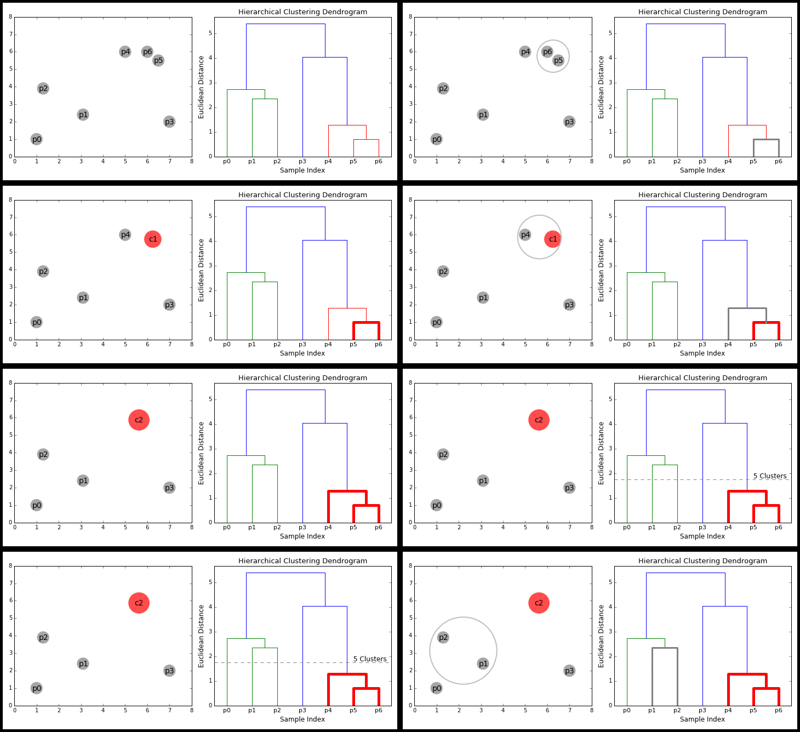

--- 
title: "Introduction aux méthodes quantitatives en sciences sociales avec R"
author: "Philippe Apparicio et Jérémy Gelb"
date: "`r Sys.Date()`"
colorlinks: yes
cover-image: images/cover.png
bibliography: book.bib
description: Ce livre propose une introduction aux méthodes quantitatives en sciences
  sociales basée sur le logiciel ouvert R. Le contenu est pensé pour être accessible
  même à ceux et celles n'ayant presque aucune base en statistique ou en programmation. Les
  personnes plus expérimentées y découvriront également des sections sur des méthodes
  poussées comme les modèles généralisés additifs à effets mixtes ou les méthodes
  factorielles mixtes. Celles cherchant à passer à R et délaisser progressivement SPSS, SAS ou STATA trouveront dans cet ouvrage les éléments pour une transition en douceur. La philosophie
  de se livre est de donner toutes les clefs de compréhension et de mise en œuvre
  des méthodes abordées afin de faciliter l'assimilation par les lecteur·trices. La présentation
  des méthodes est basée sur une approche compréhensive et intuitive plutôt que mathématique
  sans pour autant que la rigueur statistique ne soit négligée. Servez-vous votre
  boisson chaude ou froide favorite, installez-vous dans votre meilleur fauteuil et
  bonne lecture !
documentclass: book
fontsize: 11pt
github-repo: LAEQ/livre_statistique_Phil_Jere
graphics: yes
link-citations: yes
lof: yes
lot: yes
mainfont: Palatino Linotype
monofont: "Source Code Pro"
monofontoptions: "Scale=0.8"
mathfontoptions: "Scale=0.1"
site: bookdown::bookdown_site
biblio-style: apalike
url: https\://bookdown.org/yihui/rmarkdown/
geometry: "left=2cm,right=2cm,top=2cm,bottom=2cm"
toc-title: "Table des matières"
lang: fr
---


# Préface {-}

```{asis, echo=identical(knitr:::pandoc_to(), 'html')}

Ce livre propose une introduction aux méthodes quantitatives en sciences sociales basée sur le logiciel ouvert R. Il a d'ailleurs été écrit intégralement dans R avec **rmarkdown**. Le contenu est pensé pour être accessible même à ceux n'ayant presque aucune base en statistique ou en programmation. Les personnes plus expérimentées y découvriront également des sections sur des méthodes plus avancées comme les modèles généralisés additifs à effets mixtes ou les méthodes factorielles. Ceux cherchant à migrer progressivement d'un autre logiciel statistique vers R trouveront dans cet ouvrage les éléments pour une transition en douceur. La philosophie de ce livre est de donner toutes les clefs de compréhension et de mise en œuvre des méthodes abordées afin de facilité l'assimilation par le lecteur. La présentation des méthodes est basée sur une approche compréhensive et intuitive plutôt que mathématique sans pour autant que la rigueur statistique ne soit négligée. Servez-vous votre boisson chaude ou froide favorite, installez-vous dans votre meilleur fauteuil et bonne lecture !


::: {.bloc_notes data-latex=""}

**Ce livre est un projet en cours d'écriture !**

Il sert de matériel pour le cours **Méthodes quantitatives appliquées aux études urbaines** (EUR8219), offert au Centre Urbanisation Culture Société de l'INRS. Son contenu est amené à changer et des erreurs peuvent encore être présentes. À terme, nous espérons le publier. Par conséquent, **son contenu ne peut donc en aucun cas être partagé en dehors du cours**. Vos commentaires et suggestions sur le contenu et la forme sont bienvenus ! Si certains passages vous semblent peu clairs, n'hésitez pas à nous en faire part.

:::

```

## Comment lire ce livre {-}

Si vous googlez l'expression « comment lire un livre ? », vous trouverez une multitude de conseils et astuces. Pour ce livre, nous vous conseillons de le lire de gauche à droite et page par page! Plus sérieusement, le livre comprend plusieurs types de blocs de texte qui, on l'espère, faciliteront la lecture.


::: {.bloc_package data-latex=""}
**Bloc packages**: habituellement localisé en début du chapitre, il comprend la liste des *packages* R utilisés pour un chapitre.
:::

::: {.bloc_objectif data-latex=""}
**Bloc objectif**: comprend une description des objectifs d'un chapitre ou d'une section.
:::

::: {.bloc_notes  data-latex=""}
**Bloc notes**: comprend une information secondaire sur une notion, un élément, une idée abordée dans une section.
:::

::: {.bloc_aller_loin data-latex=""}
**Bloc pour aller plus loin** : peut comprendre des références ou des extensions d'une méthode statistique abordée dans une section.
:::

::: {.bloc_astuce data-latex=""}
**Bloc astuce**: décrit un élément qui vous facilera le vie : une propriété statistique, un *package*, une fonction, une syntaxe R.
:::

::: {.bloc_attention data-latex=""}
**Bloc attention**:  comprend une notion ou un élément important à bien maîtriser.
:::

## Structure du livre {-}

Le livre est organisé autour de cinq grandes parties.


**Partie 1. La découverte de R.** Dans cette première partie, nous discuterons brièvement de l’histoire et de la philosophie de R. Nous verrons ensuite comment installer R et RStudio. Les bases du langage R (particulièrement les principaux objets que sont le vecteur, la matrice, la liste et le *dataframe*) ainsi que la manipulation des données avec R sont aussi largement abordés dans le chapitre \@ref(chap01).

**Partie 2. Analyses univariées et représentations graphiques**.

**Partie 3. Analyses bivariées.** Cette troisième partie comprend trois chapitres dans lesquelles sont présentées les principales méthodes exploratoires et confirmatoires bivariées permettant d'évaluer la relation entre deux variables (figure \@ref(fig:fig1)). Plus spécifiquement, nous présenterons puis mettrons en œuvre dans R les méthodes permettant d'explorer les relations entre deux variables quantitatives (covariance, corrélation et régression linéaire simple dans le chapitre \@ref(chap04)), deux variables qualitatives (tableau de contingence et test du khi^2^ dans le chapitre \@ref(chap05)) et une variable qualitative avec deux modalités (tests de student, de Welch et de Wilcoxon) ou avec plus de deux modalités (ANOVA et test de Kruskal-Wallis dans le chapitre \@ref(chap06)).


```{r fig1, fig.align='center', echo=FALSE, auto_pdf = TRUE, fig.cap="Les principales méthodes bivariées",  out.width='65%'}
knitr::include_graphics('images/bivariee/figure1.jpg', dpi = NA)
```

**Partie 4. Modèles de régression**. Dans cette partie, sont présentées les principales méthodes de statistique inférentielle utilisées en sciences sociales : la **régression linéaire multiple** (chapitre \@ref(chap07)), les régressions linéaires généralisées (chapitre \@ref(chap08)), les régressions à effets mixtes (chapitre \@ref(chap09)), les régressions à effets mixtes (chapitre \@ref(chap10)), les régressions multiniveaux (chapitre \@ref(chap11)) et les modèles généralisés additifs (chapitre \@ref(chap12)).

**Partie 5. Analyses exploratoires multidimensionnelles**. Dans cette cinquième partie, sont abordées les méthodes de statistique exploratoire et descritive permettant de décrire des tableaux de données comprenant plusieurs variables. Nous décrirons d'abord les méthodes de réduction de données — les méthodes factorielles  (analyses de composantes principales, analyses factorielles de correspondances, analyses factorielles de correspondances multiples et analyses factorielles de correspondances mixte) dans le chapitre \@ref(chap12); puis, les méthodes de classification dans le chapitre \@ref(chap13) (classification ascendantes hiérachiques, k-means, k-median et leurs extensions en logique floue comme le c-means et c-median).


## Pourquoi faut-il programmer en sciences sociales ? {-}

Vous contrasterez rapidement que R est un véritable langage de programmation. Il est donc légitime de se questionner à savoir si l'apprentissage d'un tel langage est pertinent pour un·e étudiant·e ou un·e chercheur·e en sciences sociales. Il est vrai que la programmation n'est pas la compétence qui vient tout de suite à l'esprit lorsque l'on pense aux sciences sociales. Pourtant, cette compétence est de plus en plus importante, et ce, pour plusieurs raisons :

* Une part toujours plus grande des phénomènes sociaux se produisent ou peuvent s'observer au travers d'environnements numériques. Être capable d'exploiter efficacement ces outils permet d'extraire des données riches sur des phénomènes complexes, tels qu’en témoigne des études récentes sur la propagation de la désinformation sur les réseaux sociaux [@allcott2017social], la migration des personnes [@spyratos2019quantifying], la propagation et les risques de contamination de la COVID19 [@boulos2020geographical], etc. Le plus souvent, les interfaces (API par exemple) permettant d'accéder à ces données nécessitent une base en programmation.
* La quantité de données numériques ouvertes et accessibles en ligne croit chaque année sur des sujets très divers. La plupart des villes et des gouvernements ont maintenant leurs portails de données ouvertes auxquels s'ajoutent les données produites par des projets collaboratifs comme [OpenStreetMap](https://www.openstreetmap.org) ou [NoisePlanet](https://noise-planet.org/map_noisecapture/index.html). Récupérer ces données et les structurer pour les utiliser à des fins de recherche nécessite le plus souvent des compétences en programmation.
* Les méthodes d'analyse quantitative connaissent également un développement très important. Les logiciels propriétaires peinent à suivre la cadence de ce développement contrairement aux logiciels à code source ouvert qui permettent d'avoir accès aux dernières méthodes. Il est souvent long et coûteux de développer une interface graphique pour un logiciel, ce qui explique que la plupart de ces programmes en sont dépourvus et nécessitent alors de savoir programmer pour les utiliser.
* Savoir programmer donne une liberté considérable en recherche. Cette compétence permet notamment de ne plus être limité aux fonctionnalités proposées par des logiciels spécifiques. Il devient possible d'innover tant en matière de structuration, d'analyses que de représentations des résultats en écrivant vos propres fonctions. Cette flexibilité contribue directement à la production d'une recherche de meilleure qualité et plus diversifiée.
* Programmer permet également d'automatiser des tâches qui autrement seraient extrêmement répétitives. Déplacer et renommer une centaine de fichiers ? Retirer les lignes inutiles dans un ensemble de fichiers CSV et les compiler dans une seule base de données ? Tester parmi des milliers d'adresses lesquelles sont valides ? Récupérer chaque jour les messages postés sur un forum ? Autant de tâches faciles à automatiser si l'on sait programmer.
* Dans un logiciel avec une interface graphique, il est compliqué de conserver un historique des opérations effectuées. Programmer permet au contraire de garder une trace de l'ensemble des actions effectuées au cours d'un projet de recherche. En effet, le code utilisé reste disponible et permet de reproduire la méthode et les résultats obtenus ce qui est essentiel dans le monde de la recherche. À cela s'ajoute le fait que chaque ligne de code que vous écrivez vient s'ajouter à un capital de code que vous possédez, car elles pourront être réutilisées dans d'autres projets !


## Remerciements {-}

Ce livre est dédié au beau Cargo (chien Mira) qui nous a tant supporté dans l'écriture du livre !

Nous tenons aussi à remercier sincérement les étudiant·e·s du cours **Méthodes quantitatives appliquées aux études urbaines (EUR8219)** du programme de maîtrise en études urbaines de l'INRS. À compléter plus tard.

```{r cargo, fig.align='center', echo=FALSE, auto_pdf = TRUE, fig.cap="Cargo, le plus beau",  out.width='50%'}
knitr::include_graphics('images/Cargo.jpg', dpi = NA)
```

```{r message=FALSE, warning=FALSE, include=FALSE}
## quelques parametres generaux en fonction du type de document
library(tidyverse)
library(ggpubr)

if (knitr::is_latex_output()){
  font_size_table <- 8
}else{
  font_size_table <- 14
}

# note : il ne faut changer que les caracteres en dehors des equations
clean_text <- function(string){
  if (is.na(string)){
    return (NA)
  }
  if(string == ""){
    return("")
  }
  changes <- list(
     c("`", "", F),
      c("\\^([^\"]*?)\\^","\\\\textsuperscript{\\1}",F),
      c("\\*{2}([^\"]*)\\*{2}","\\\\textbf{\\1}", F),
      c("\\*{2}([^\"]*)\\*{2}","\\\\textbf{\\1}", F),
      c("\\%", "\\\\%", F),
      c("&", "\\\\&", F),
      #c("\\^(?=(?:[^$]*$[^$]*$)*[^$]*$)", "\\\\textasciicircum{}", F),
      c("\\*{2}", "doublestars", F),
      c("\\*([^\"]*?)\\*", "\\\\textit{\\1}", F),
      c("doublestars", "**", F),
      c("\\\\@ref\\(([^\"]*?)\\)", "\\\\ref{\\1}", F),
      c("\\(\\%\\)", "(\\\\%)", F),
      c("_", "\\_", TRUE),
      c("beta\\_", "beta_", TRUE),
      c("alpha\\_", "alpha_", TRUE)
      )
  parts <- strsplit(string, "$", fixed = T)[[1]]
  new_strings <- sapply(1:length(parts), function(i){
    thisstring <- parts[[i]]
    if (thisstring != ""){
      parts2 <- strsplit(thisstring, "`", fixed = T)[[1]]
      new_strings2 <- sapply(1:length(parts2), function(j){
        thisstring2 <- parts2[[j]]
        if (j %% 2 ==0){
          thisstring2 <- gsub("^","\\textasciicircum{}",thisstring2, fixed = T)
          return(thisstring2)
        }else{
          return(thisstring2)
        }
      })
      thisstring <- paste(new_strings2, collapse="")
    }
    
    
    if (i %% 2 ==0){
      return(paste("$",thisstring,"$",sep=""))
    }else{
      for (ch in changes){
          if(ch[[3]]){
            thisstring <- gsub(ch[[1]],ch[[2]],thisstring, fixed = T)
          }else{
            thisstring <- gsub(ch[[1]],ch[[2]],thisstring, perl = T)
          }
          
      }
      return(thisstring)
    }
  })
  fullstring <- paste(new_strings, collapse = "")
  return (fullstring)
  
}

clean_df_latex <- function(df){
  if(inherits(df, "list") == F){
    df <- list(df)
  }
  df2 <- lapply(df, function(i){
    i <- data.frame(i)
    for(col in names(i)){
      if(is.character(i[[col]])){
       i[[col]] <- sapply(i[[col]], clean_text)
      }
    }
    return(i)
  })
  return(df2)
}

show_table <- function(df, col.names = NA, caption = NULL, col.to.resize = NULL, 
                       col.width = NULL, digits = getOption("digits"),
                       align = NULL, row.names = FALSE, position = NULL, ...){
  options(knitr.kable.NA = '')
  if(is.null(position)){
    position <- "basic"
  }
  ## dans le cas d'un tableau LATEX
  if (knitr::is_latex_output()){
    #etape1 : supprimer les caracteres speciaux, echapper les gras et italic
    df2 <- clean_df_latex(df)
    if (is.null(col.names) == F){
      if(is.na(col.names)==F){
        #col.names <- gsub("\\(\\%\\)","(\\\\%)",col.names)
        col.names <- gsub("\\%","\\\\%",col.names)
        col.names <- gsub("\\^([^\"]*?)\\^","\\\\textasciicircum{\\1}",col.names,fixed = F)
      }
    }

    if(is.null(caption)==F){
      caption <- gsub("\\*{2}([^\"]*)\\*{2}","\\\\textbf{\\1}", caption)
      caption <- gsub("\\*([^\"]*?)\\*","\\\\textit{\\1}", caption)
    }
    if(length(df2) == 1){
      df2 <- df2[[1]]
    }
    table1 <- knitr::kable(
      df2, booktabs = TRUE,
      format = "latex",
      digits = digits,
      format.args = list(decimal.mark = ",", big.mark = " "),
      valign = 't', row.names = row.names,
      align = align,
      col.names = col.names,
      caption = caption,
      escape = FALSE, ...) %>% 
      kableExtra::kable_styling(font_size = 8,protect_latex = T, latex_options = position)
    if (is.null(col.to.resize) == FALSE){
      table1 <- table1 %>% 
        kableExtra::column_spec(col.to.resize, width=col.width)
    }
  ## dans le cas d'un tableau HTLM
  }else{
    
    # gerer les newline
    if(class(df) != "list"){
      df <- data.frame(df)
      for(col in names(df)){
        if(is.character(df[[col]])){
          df[[col]] <- gsub("\\newline","<br/>",df[[col]], fixed = T)
        }
      }
    }else {
      df <- lapply(df, function(i){
        i <- data.frame(i)
        i <- i %>% mutate_if(~is.character(.), funs(str_replace_all(., "\\newline", "<br/>")))
        return(i)
      })
    }
    table1 <- knitr::kable(
      df, booktabs = TRUE,
      format.args = list(decimal.mark = ",", big.mark = " "),
      col.names = col.names,
      align = align,
      valign = 't', row.names = row.names,
      digits = digits,
      caption = caption,
      escape = FALSE, ...)
    ## gerer le padding
    table1 <- gsub(pattern = "NApadding", replacement = "padding",x = table1, fixed = T)
  }
  return(table1)
}

tofr <- function(float){
  return(gsub(".",",",as.character(float),fixed = T))
}


# a simple function to show a more simple figure when a lot of details are given
show_as_png <- function(gplot, out, dpi = 250){
  invisible({capture.output({this_file <- ggsave(plot = gplot,
                      filename = out, 
                      device = "png",
                      dpi = dpi)})})
  knitr::include_graphics(out, dpi = dpi)
}


print_number <- function(x, digits = NULL){
  if(is.null(digits) == FALSE){
    x <- round(x, digits = digits)
  }
  parts <- strsplit(as.character(x), split = ".", fixed = TRUE)[[1]]
  part1 <- strsplit(parts[[1]], "")[[1]]
  i<-1
  elems <- sapply(rev(part1), function(y){
    if(i == 3){
      i <<- 1
      return(paste0(" ",y))
    }else{
      i <<- i+1
      return(y)
    }
  })
  part1 <- paste(rev(elems), collapse = "")
  x2 <- paste0(part1, ",",parts[[2]])
  cat(x2)
}

```


```{r message=FALSE, warning=FALSE, include=FALSE}
source("code_complementaire/JG_helper.R")
source("code_complementaire/QuizzFunctions.R")
```

<!--chapter:end:index.Rmd-->

# À propos des auteurs {#auteurs .unnumbered}

**Philippe Apparicio** (<http://www.inrs.ca/philippe-apparicio>) est professeur titulaire au Centre Urbanisation Culture Société de l'Institut national de la recherche scientifique (INRS, <http://www.inrs.ca/>). Il enseigne au programme de maîtrise en études urbaines (<https://inrs.ca/les-etudes/programmes-d-etudes/etudier-en-sciences-sociales/>) les cours *méthodes quantitatives appliquées aux études urbaines* et _analyses spatiales appliquées aux études urbaines_. Il a aussi créé et enseigné, il y a plusieurs années, le cours _systèmes d'information géographique appliqués aux études urbaines_. Durant les dernières années, il a offert plusieurs formations aux Écoles d'été du Centre interuniversitaire québécois de statistiques sociales (CIQSS, <https://www.ciqss.org/>). Il est le directeur du **laboratoire d'équité environnementale** (<http://laeq.ucs.inrs.ca>). Géographe de formation, ses intérêts de recherche actuels incluent la justice et l'équité environnementale, la pollution atmosphérique, le bruit et le vélo en ville. Il a publié une centaine d'articles scientifiques dans différents domaines des études urbaines et de la géographie.

**Jérémy Gelb** est candidat au doctorat en études urbaines à l’INRS (sous la supervision de Philippe Apparicio) et membre du **laboratoire d'équité environnementale** (<http://laeq.ucs.inrs.ca>). Son sujet de thèse porte sur l’exposition des cyclistes aux pollutions atmosphériques et sonores en milieu urbain. Il utilise quotidiennement des systèmes d’information géographique (SIG) et est tombé dans la marmite de l'*open source* avec le triptyque QGIS, R et Python au début de sa maîtrise. Il a récemment développé deux packages R : **geocmeans** et **spNetwork**, permettant respectivement d’effectuer des analyses de classification floue non-supervisée pondérée spatialement et des estimations de densité par kernel sur réseau.

Philippe et Jérémy travaillent étroitement ensemble depuis déjà plusieurs années. Avec d’autres collègues, ils ont copublié plusieurs articles [@2021_1; @2021_2; @2021_3; ; @2021_4;@2020_1; @2020_2; @2020_3; @2019_1; @2019_2; @2019_3; @2020_1; @2020_2; @2018_1; @2017_1; @2016_1]. Tous deux s’intéressent à l’exposition des cyclistes à la pollution atmosphérique et sonore dans plusieurs villes à travers le monde : Philippe ayant une préférence pour les collectes dans les villes des Suds (notamment indiennes, africaines et latino-américaines) et Jérémy dans les villes du Nord (européennes et nord-américaines).


```{r JerPhil, fig.align='center', include=identical(knitr:::pandoc_to(), 'html'), auto_pdf = TRUE, fig.cap="Philippe Apparicio et Jérémy Gelb lors d’une collecte de données à vélo à Delhi",  out.width='33%'}
knitr::include_graphics('images/01_about_figure01.jpg', dpi = NA)
```

<!--chapter:end:00-auteurs.Rmd-->

# (PART) Découverte de R {-} 

# Prise en main de R {#chap01}

Dans ce chapitre, nous reviendrons brièvement sur l’histoire de R et la philosophie qui entoure le logiciel. Nous donnerons quelques conseils pour son installation et la mise en place d’un environnement de développement. Nous présenterons les principaux objets qui sous-tendent le travail effectué avec R (*dataframe*, vecteur, matrice, etc.) et comment les manipuler avec des exemples appliqués. Si vous maîtrisez déjà R, nullement besoin de lire ce chapitre !

::: {.bloc_package data-latex=""}
Dans ce chapitre, nous utiliserons principalement les *packages* suivants : 

* Pour importer des fichiers externes :
  - **foreign** pour entre autres les fichiers *dbase* et ceux des logiciels. SPSS et Stata
  - **sas7bdat** pour les fichiers du logiciel SAS.
  - **xlsx** pour les fichiers Excel.
* Pour manipuler des chaînes de caractères et des dates : 
  - **stringr** pour les chaînes de caractères.
  - **lubridate** pour les dates.
* Pour manipuler des données :
  - **dplyr ** du **tidyverse** propose une grammaire pour manipuler et structurer des données.
:::

## Histoire et philosophie de R{#sect011}

R est à la fois un langage de programmation et un logiciel libre (sous la licence publique générale GNU) dédié à l'analyse statistique et soutenu par une fondation : _R foundation for Statistical computing_. Il est principalement écrit en C et Fortran.


R a été créé par Ross Ihaka et Robert Gentleman à l'Université d'Auckland en Nouvelle-Zélande. Si vous avez un jour l'occasion de passer dans le coin, une plaque est affichée dans le département de statistique de l'université, ça mérite le détour (figure \@ref(fig:fig01)). Une version expérimentale a été publiée en 1996, mais la première version stable ne date que de 2000, il s'agit donc d'un logiciel relativement récent si on le compare à ses concurrents SPSS (1968), SAS (1976) et Stata (1984).

```{r fig01, echo=FALSE, fig.align='center', fig.cap="Lieu de pélerinage de R", message=FALSE, warning=FALSE, auto_pdf=TRUE, out.width='40%'}
library(dplyr)
knitr::include_graphics('images/introduction/plaque.jpg', dpi = NA)
```

R a cependant réussi à s'imposer tant dans la milieu de la recherche que dans le secteur privé. Pour s'en convaincre, il suffit de lire l'excellent article concernant la popularité des logiciels d'analyse de données tiré du site [r4stats.com](http://r4stats.com/articles/popularity){target="_blank"} (figure \@ref(fig:fig02)). 

```{r fig02, fig.align='center', echo=FALSE, auto_pdf = TRUE, fig.cap="Nombre d'articles trouvés sur Google Scholar (Source : Robert A. Muenchen)",  out.width='50%'}
knitr::include_graphics('images/introduction/r_citations.jpg', dpi = NA)
```

Les nombreux atouts de R justifient largement sa popularité sans cesse croissante : 

* R est un logiciel à code source ouvert (*open source*) et ainsi accessible à tous gratuitement.
* Le développement du langage R est centralisé, mais la communauté peut créer et partager facilement des *packages*. Les nouvelles méthodes sont ainsi rapidement implémentées comparativement aux logiciels propriétaires.
* R est un logiciel multi-plateforme, fonctionnant sur Linux, Unix, Windows et Mac.
* Comparativement à ses concurrents, R dispose d'excellentes solutions pour manipuler des données et réaliser des graphiques.
* R dispose de nombreuses interfaces lui permettant de communiquer, notamment avec des systèmes de bases de données SQL et non SQL (MySQL, PostgresSQL, MongoDB, etc.), avec des systèmes de *big data* (Spark, Hadoop), avec des systèmes d'information géographique (QGIS, ArcGIS) et même avec des services en ligne comme Microsoft Azure ou Amazon AWS.
* R est un langage de programmation à part entière, ce qui lui donne plus de flexibilité que ses concurrents commerciaux (SPSS, SAS, STATA). Avec R, vous pouvez accomplir des tâches aussi variées que : monter un site web, créer un robot collectant des données en ligne, combiner des fichiers PDF, composer des diapositives pour une présentation ou même éditer un livre (comme celui-ci), mais aussi et surtout réaliser des analyses statistiques.

Un des principaux attrait de R est la quantité astronomique de *packages* actuellement disponibles. **Un *package* est un ensemble de nouvelles fonctionnalités développées par un·e ou plusieurs utilisateurs·trices de R et mises à disposition de l'ensemble de la communauté**. Par exemple, le *package* **ggplot2** est dédié à la réalisation de graphiques; les *packages* **data.table** et **plyr** permettent de manipuler des tableaux de données; le *package* **car** apporte de nombreux outils pour faciliter l'analyse de modèles de régressions, etc. Ce partage des *packages* rend accessible à tous des méthodes d'analyses complexes et récentes et favorise grandement la reproductibilité de la recherche. Cependant, ce fonctionnement implique quelques désavantages : 

* il existe généralement plusieurs *packages* pour effectuer le même type d'analyse, ce qui peut devenir une source de confusion;
* certains *packages* cessent d'être mis à jour au fil des années, ce qui nécessite de leur trouver d'autres alternatives (et ainsi apprendre la syntaxe des nouveaux *packages*);
* il est impératif de s'assurer de la fiabilité des *packages* que vous souhaitez utiliser, car n'importe qui peut proposer un *package*.

Il nous semble important de relativiser d'emblée la portée du dernier point. Il est rarement nécessaire de lire et analyser le code source d'un *package* pour s'assurer de sa fiabilité. Nous ne sommes pas des spécialistes de tous les sujets et il peut être extrêmement ardu de comprendre la logique d'un code écrit par une autre personne. Nous vous recommandons donc de privilégier l'utilisation de *packages* qui :

* ont fait l'objet d'une publication dans une revue à comité de lecture ou qui ont déjà été cités dans des études ayant fait l'objet d'une publication revue par les pairs;
* font partie de projets comme [ROpensci](https://ropensci.github.io/reproducibility-guide/sections/introduction/){target="_blank"} prônant la vérification  par les pairs ou subventionnés par des organisations comme [R Consortium](https://www.r-consortium.org/){target="_blank"}.
* sont disponibles sur l'un des deux principaux répertoires de *packages* R, soit [CRAN](https://cran.r-project.org/){target="_blank"} et [Bioconductor](https://www.bioconductor.org/){target="_blank"}.

Toujours pour nuancer notre propos, il convient de distinguer *package* de *package*! Certains d'entre eux sont des ensembles très complexes de fonctions permettant de réaliser des analyses poussées alors que d'autres sont des projets plus modestes dont l'objectif principal est de simplifier le travail des utilisateurs·trices. Ces derniers ressemblent à des petites boites à outils et font généralement moins l'objet d'une vérification intensive.

Pour conclure cette section, l'illustration partagée sur Twitter par Darren L Dahly résume avec humour la force du logiciel R et de sa communauté
(figure \@ref(fig:fig03)) : R apparait clairement comme une communauté hétéroclyte, mais diversifiée et adaptable.

```{r fig03, fig.align='center', echo=FALSE, auto_pdf = TRUE, fig.cap="Métaphore sur les langages et programmes d'analyse statistique",  out.width='60%'}
knitr::include_graphics('images/introduction/softwares_and_cars.jpeg', dpi = NA)
```

Dans ce livre, nous détaillerons les **packages** utilisés dans chaque section avec un encadré spécifique, accompagné de l'icône présenté à la figure \@ref(fig:fig04).

```{r fig04, fig.align='center', echo=FALSE, auto_pdf = TRUE, fig.cap="Icône des encadrés dédiés aux packages",  out.width='20%'}
knitr::include_graphics('css/images/package.png', dpi = NA)
```

## Environnement de travail{#sect012}

Dans cette section, nous vous proposons une visite de l'environnement de travail classique  R.

### Installer R {#sect0121}

La première étape pour travailler avec R est bien sûr de l'installer. Pour ce faire, il suffit de visiter le site web de [CRAN](https://cran.r-project.org/){target="_blank"} et de télécharger la dernière version de R en fonction de votre système d'exploitation : Windows, Linux ou Mac. Une fois installé, si vous démarrez R immédiatement, vous aurez alors accès à une console, plutôt rudimentaire, attendant sagement vos instructions (figure \@ref(fig:fig05)).

```{r fig05, fig.align='center', echo=FALSE, auto_pdf = TRUE, fig.cap="La console de base de R",  out.width='85%'}
knitr::include_graphics('images/introduction/r_console.jpeg', dpi = NA)
```

Notez que vous pouvez aussi télécharger des version plus anciennes de R en allant sur ce [lien](https://cran.r-project.org/bin/windows/base/old/){target="_blank"}. Ceci peut être intéressant lorsque vous voulez reproduire des résultats d'une autre étude ou que certains *packages* ne sont plus disponibles dans les nouvelles versions.

### L'environnement RStudio{#sect0122}

Rares sont les utilisateurs·trices de R qui préfèrent travailler directement avec la console classique. Nous vous recommandons vivement d'utiliser RStudio, soit un environnement de développement dédié à R, offrant une intégration très intéressante d'une console, d'un éditeur de texte, d'une fenêtre de visualisation des données, d'une autre pour les graphiques, d'un accès à la documentation, etc. En d'autres termes, si R est un vélo minimaliste, RStudio permet d'y rajouter des freins, des vitesses, un porte-bagage, des gardes-boues et une selle confortable. Vous pouvez [télécharger](https://rstudio.com/products/rstudio/download){target="_blank"} et installer RStudio sur Windows, Linux et Mac. La version de base est gratuite, mais l'entreprise qui développe ce logiciel propose aussi des versions commerciales du logiciel qui assurent essentiellement un support technique. Il existe d'autres environnements de développement pour travailler avec R (VisualStudio, Jupyter, Tinn-R, Radiant, RIDE, etc.), mais RStudio offre à ce jour la meilleure option en terme de facilité d'installation, de prise en main et de fonctionnalités proposées (voir l'interface de RStudio à la figure \@ref(fig:fig06)).

```{r fig06, fig.align='center', echo=FALSE, auto_pdf = TRUE, fig.cap="Environnement de base de RStudio",  out.width='85%'}
knitr::include_graphics('images/introduction/r_studio_01.jpeg', dpi = NA)
```

Avant d'aller plus loin, notez que : 

* La console actuellement ouverte dans RStudio vous informe de la version de R que vous utilisez. Vous pouvez en effet avoir plusieurs versions de R installées sur votre ordinateur et passer de l'une à l'autre avec RStudio. Pour cela, naviguez dans l'onglet *Tools / Global Options* et dans le volet  *General*, vous pouvez sélectionner la version de R que vous souhaitez utiliser.
* L'aspect de RStudio peut être modifié en navigant dans l'onglet *Tools / Global Options* et dans le volet *Appearance*. Nous avons une préférence pour le mode sombre avec le style *pastel on dark*, mais libre à chacun·e de choisir le style qui lui convient.

```{r fig07, fig.align='center', echo=FALSE, auto_pdf = TRUE, fig.cap="RStudio avec le style pastel on dark",  out.width='85%'}
knitr::include_graphics('images/introduction/r_studio_02.jpeg', dpi = NA)
```

Une fois ces détails réglés, vous pouvez ouvrir votre première feuille de code en allant dans l'onglet *File / New File / R Script*. Votre environnement est maintenant découpé en quatre fenêtres (figure \@ref(fig:fig08)) : 

1. L'éditeur de code, vous permettant d'écrire le script que vous voulez exécuter et permettant de garder une trace de votre travail. Ce script peut être enregistré sur votre ordinateur avec l'extension **.R**, mais ce n'est qu'un simple fichier texte.
2. La console vous permettant d'exécuter votre code R et de voir les résultats s'afficher au fur et à mesure.
3. La fenêtre d'environnement vous montrant les objets, fonctions et jeux de données actuellement disponibles dans votre session (chargés dans la mémoire vive).
4. La fenêtre de l'aide, des graphiques et de l'explorateur de fichiers. Vous pouvez accéder ici à la documentation de R et des *packages* que vous utilisez, aux sorties graphiques que vous produisez et aux dossiers de votre environnement de travail.

```{r fig08, fig.align='center', echo=FALSE, auto_pdf = TRUE, fig.cap="Les quatre fenêtres de RStudio",  out.width='85%'}
knitr::include_graphics('images/introduction/r_studio_03.jpeg', dpi = NA)
```

Prenons un bref exemple, tapez la syntaxe suivante dans l'éditeur de code (fenêtre 1 à la figure \@ref(fig:fig08)) : 

```{r ma_somme}
ma_somme <- 4+4
```

Sélectionnez ensuite cette syntaxe (mettre en surbrillance avec la souris), quand vous utilisez le raccourci *Ctrl+Enter* ou cliquez sur le bouton *Run* (avec la flèche verte), cette syntaxe est envoyée à la console qui l'exécute immédiatement. Notez que rien ne se passe tant que le code n'est pas envoyé à la console. Il s'agit donc de deux étapes distinctes : écrire son code, puis l'envoyer à la console. Vous constaterez également qu'un objet *ma_somme* est apparu dans votre environnement et que sa valeur est bien 8. Votre console se "souvient" de cette valeur, elle est actuellement stockée dans votre mémoire vive sous le nom de *ma_somme* (figure \@ref(fig:fig09)).

```{r fig09, fig.align='center', echo=FALSE, auto_pdf = TRUE, fig.cap="Les quatre fenêtres de RStudio",  out.width='90%'}
knitr::include_graphics('images/introduction/r_studio_04.jpeg', dpi = NA)
```

Pour conclure cette section, nous vous invitons à enregistrer votre première syntaxe R (*File / Save As*) dans un fichier **.R** que vous pouvez appeler par exemple "mon_premier_script.R". Fermez ensuite RStudio, redémarrez le et ouvrez (*File / Open File*) votre fichier "mon_premier_script.R". Vous pouvez constater que votre code est toujours présent, mais que votre environnement est vide tant que vous n'exécutez pas votre syntaxe. En effet, lorsque vous fermez RStudio, l'environnement est vidé pour libérer de la mémoire vive. Ceci peut poser problème lorsque certains codes sont très longs à exécuter, nous verrons donc plus tard comment enregistrer l'environnement en cours pour le recharger par la suite.


### Installer et charger un *package*{#sect0123}

Dans la section sur la Philosophie de R, nous avons souligné la place centrale jouée par les *packages*. Notez que les termes **paquet** et plus rarement *librarie* sont parfois utilisés en français. Voyons ensemble comment installer un *package* intitulé **lubridate**, qui nous permettra plus tard de manipuler des données temporelles.

#### Installer un *package* depuis CRAN{#sect01231}

Pour installer un *package*, vous devez être connecté à Internet puisque R va accéder au répertoire de *packages* *CRAN* pour télécharger le *package* et l'installer sur votre machine. Cette opération est réalisée avec la fonction `install.packages`.

```{r message=FALSE, warning=FALSE, eval=FALSE}
install.packages("lubridate")
```

Notez qu'une fois que le *package* est installé, vous n'aurez plus besoin de le refaire. Le *package* est disponible localement sur votre ordinateur, à moins de le désinstaller explicitement avec la fonction `remove.packages`.

#### Installer un *package* depuis GitHub{#sect01232}

*CRAN* est le répertoire officiel des *packages* de R. Vous pouvez cependant télécharger des *packages* provenant d'autres sources. Très souvent, les *packages* sont disponibles sur le site web [GitHub](https://github.com/){target="_blank"} et l'on peut même y trouver des versions en développement avec des fonctionnalités encore non intégrées dans la version sur *CRAN*. Reprenons le cas de **lubridate**, sur GitHub, il est disponible à la page [suivante](https://github.com/tidyverse/lubridate){target="_blank"}. Pour l'installer nous devons d'abord installer un autre *package* appelé **remotes** (depuis *CRAN*).

```{r message=FALSE, warning=FALSE, eval=FALSE}
install.packages("remotes")
```

Maintenant que nous disposons de **remotes**, nous pouvons utiliser la fonction d'installation `remotes::install_github` pour directement télécharger **lubridate** depuis GitHub.

```{r message=FALSE, warning=FALSE, eval=FALSE}
remotes::install_github("tidyverse/lubridate")
```

#### Charger un *package* {#sect01233}

Maintenant que **lubridate** est installé, nous pouvons le charger dans notre session actuelle de R et accéder aux fonctions qu'il propose. Pour cela, suffit d'utiliser la fonction `library`. Conventionnellement, l'appel des *packages* se fait au tout début du script que vous rédigez. Rien ne vous empêche de le faire au fur et à mesure de votre code, mais ce dernier perd alors en lisibilité. Notez qu'à chaque nouvelle session (redémarrage de R), il faudra recharger les *packages* dont vous avez besoin.

```{r message=FALSE, warning=FALSE}
library(lubridate)
```

Si vous obtenez un message d'erreur du type : 

<span class="error_message">Error in library(mon_package) : aucun *package* nommé ‘mon_package’ n'est trouvé.</span>

Cela signifie que le *package* que vous tentez de charger n'est pas encore installé sur votre ordinateur. Dans ce cas, réessayer de l'installer avec la fonction `install.packages`. Si le problème persiste, vérifiez que vous n'avez pas fait une faute de frappe dans le nom du *package.* Vous pouvez également redémarrer RStudio et réessayer d'installer le *package*.

### Obtenir de l'aide

Lorsque vous installez des *packages* dans R, vous téléchargez aussi leur documentation. Tous les *packages* de *CRAN* disposent d'une documentation, ce n'est pas forcément vrai pour *GitHub*. Dans RStudio, vous pouvez accéder à la documentation des *packages* dans l'onglet **Packages** (figure \@ref(fig:fig010)). Vous pouvez utiliser la barre de recherche pour retrouver rapidement un *package* installé. Si vous cliquez sur le nom du *package*, vous accédez directement à sa documentation dans cette fenêtre.

```{r fig010, fig.align='center', echo=FALSE, auto_pdf = TRUE, fig.cap="Description des packages",  out.width='45%'}
knitr::include_graphics('images/introduction/rstudio_packages.jpeg', dpi = NA)
```

Vous pouvez également accéder à ces informations en utilisant la syntaxe suivante dans votre console : 

```{r eval = FALSE}
help(package = 'lubridate')
```

Souvent, vous aurez besoin d'accéder à la documentation d'une fonction spécifique d'un *package*. Affichons la documentation de la fonction `now` de **lubridate** : 

```{r eval = FALSE}
help(now, package = 'lubridate')
```

ou plus simplement :
```{r eval = FALSE}
?lubridate::now
```


Vous pouvez aussi utiliser le raccourci suivant : 

```{r eval = FALSE}
?now
```

Si vous connaissez le nom d'une fonction, mais vous ne vous souvenez plus à quel *package* elle appartient, lancez une recherche en utilisant un double point d'interrogation : 

```{r eval = FALSE}
??now
```

Vous découvrirez ainsi que la fonction `now` n'existe pas que dans **lubridate**, ce qui souligne l'importance de bien connaître les *packages* que l'on installe et que l'on charge dans notre session ! 

Maintenant que nous avons fait le tour de l'environnement de travail, nous pouvons passer aux choses sérieuses, soit les bases du langage R.

## Les bases du langage R {#sect013}

R est un langage de programmation. Il vous permet de communiquer avec votre ordinateur pour lui donner des tâches à accomplir. Dans cette section, nous aborderons les bases du langage. Ce type de section introductive à R est présente dans tous les manuels sur R ; elle est donc incontournable. À la première lecture, elle vous semblera probablement aride, et ce, d'autant plus que nous ne réalisons pas d'analyse à proprement parler. Gardez en tête que l'analyse de données requiert au préalable une phase de structuration de ces dernières, opération qui nécessite la maîtrise des notions abordées dans cette section. Nous vous recommandons une première lecture de ce chapitre pour comprendre quelles manipulations que vous pouvez effectuer avec R, la lecture des chapitres suivants dédiés aux analyses statistiques, puis de consulter à nouveau cette section au besoin. Notez aussi que la maîtrise des différents objets et opérations de base de R ne s’acquiert qu'en pratiquant. Vous gagnerez cette expertise au fil de vos prochains codes R, période durant laquelle vous pourrez consulter ce chapitre tel un guide de référence des différents objets et notions fondamentales de R.


### Hello World ! {#sect0131}

Une introduction à un langage de programmation se doit de commencer par le rite de passage **Hello World**. Il s'agit d'une forme de tradition consistant à montrer aux nouveaux utilisateurs·trices comment afficher le message "Hello World" à l'écran avec le langage en question.

```{r}
print("Hello World")
```

Bravo ! Vous venez officiellement de faire votre premier pas dans R !

### Objets et expressions {#sect0132}

Dans R, nous passons notre temps à manipuler des **objets** à l'aide d'**expressions**. Prenons un exemple concret, si vous tapez la syntaxe `4 + 3`, vous manipulez deux objets (4 et 3) au travers d'une expression indiquant que vous souhaitez obtenir la somme des deux objets.

```{r}
4 + 3
```

Cette expression est correcte, R comprend vos indications et effectue le calcul.

Il est possible d'enregistrer le résultat d'une expression et de la conserver dans un nouvel objet. On appelle cette opération déclarer une variable.

```{r}
ma_somme <- 4 + 3
```

Concrètement, nous venons de demander à R d'enregistrer le résultat de `4 + 3` dans un espace spécifique de notre mémoire vive. Si vous regardez dans votre fenêtre **Environment**, vous verrez en effet qu'un objet appelé ma_somme est actuellement en mémoire et a pour valeur 7.

Notez ici que le nom des variables ne peut être composé que de lettres, de chiffres, de points (.) et de tiret bas (_) et doit commencer par une lettre. R est sensible à la casse; en d'autre termes, les variables `Ma_somme`, `ma_sommE`, `ma_SOMME`, et `MA_SOMME` renvoient toutes à un objet différent. Attention donc aux fautes de frappe. Si vous déclarez une variable en utilisant le nom d'une variable existante, la première est écrasée par la seconde : 

```{r}
age <- 35
age

age <- 45
age
```
Portez alors attention aux noms de variables que vous utilisez et réutilisez. Réutilisons notre objet `ma_somme` dans une nouvelle expression : 

```{r}
ma_somme2 <- ma_somme + ma_somme
```

Avec cette nouvelle expression, nous indiquons à R que nous souhaitons déclarer une nouvelle variable appelée `ma_somme2`, et que cette variable aura pour valeur `ma_somme + ma_somme`, soit `7 + 7`. Sans surprise, `ma_somme2` a pour valeur 14.

Notez que la mémoire vive (l'environnement) est vidée lorsque vous fermez R. Autrement dit, R perd complètement la mémoire lorsque vous le fermez. Vous pouvez bien sûr recréer vos objets en relançant les mêmes syntaxes. C'est pourquoi vous devez conserver vos feuilles de codes et ne pas seulement travailler dans la console. La console ne garde aucune trace de votre travail. Pensez donc à bien enregistrer votre code !

Nous verrons dans un autre chapitre comment sauvegarder des objets et les recharger dans une session ultérieure de R (LIEN SECTION). Ce type d'opération est pertinent quand le temps de calcul nécessaire à la production de certains objets est très long.

### Fonctions et arguments {#sect0_133}

Dans R, nous manipulons le plus souvent nos objets avec des **fonctions**. Une fonction est elle-même un objet, mais qui a la particularité de pouvoir effectuer des opérations sur d'autres objets. Par exemple, déclarons l'objet `taille` avec une valeur de 175.897 : 

```{r}
taille <- 175.897
```

Nous allons utiliser la fonction `round` dont l'objectif est d'arrondir un nombre à virgule pour obtenir un nombre entier.

```{r}
round(taille)
```

Pour effectuer leurs opérations, les fonctions ont généralement besoin d'**arguments**. Ici, `taille` est un argument passé à la fonction `round`. Si nous regardons la documentation de `round` avec `help(round)`, nous constatons que cette fonction prend en réalité deux argments : *x* et *digits*. Le premier est le nombre que nous souhaitons arrondir et le second le nombre de décimales à conserver. On peut lire dans la documentation que la valeur par défaut de *digits* est 0, ce qui explique que `round(taille)` a produit le résultat de 176.

```{r fig011, fig.align='center', echo=FALSE, auto_pdf = TRUE, fig.cap="Arguments de la fonction round",  out.width='45%'}
knitr::include_graphics('images/introduction/help_round.jpeg', dpi = NA)
```

Réutilisons maintenant la fonction `round` mais en gardant une décimale : 

```{r}
round(taille, digits = 1)
```
Il est aussi possible que certaines fonctions ne requièrent pas d'arguments. Par exemple, la fonction `now` va indiquer la date précise (avec l'heure) et n'a besoin d'aucun argument pour le faire : 

```{r}
now()
```

Par contre, si nous essayons de lancer la fonction `round` sans argument, nous obtiendrons une erreur : 

```{r eval = FALSE}
round()
```
<span class = "error_message">Erreur : 0 arguments passed to 'round' which requires 1 or 2 arguments</span>

Le message est très clair, `round` a besoin d'au moins un argument pour fonctionner. Si au lieu d'un nombre, nous avions donné du texte à la fonction `round`, nous aurions aussi obtenu une erreur : 

```{r eval = FALSE}
round("Hello World")
```
<span class = "error_message">Error in round("Hello World") : 
  non-numeric argument to mathematical function</span>

À nouveau le message est très explicite : nous avons passé un argument non-numérique à une fonction mathématique. Lisez toujours vos messages d'erreurs qui vous permettront de repérer les coquilles et de corriger votre code !

Une fonction essentielle est la fonction `print` qui permet d'afficher la valeur d'une variable.

```{r}
print(ma_somme)
```


### Principaux types de données {#sect0134}

Depuis le début de ce chapitre, nous avons déclaré plusieurs variables et essentiellement des données numériques. Dans R, il existe trois principaux types de données de base : 

* Les données numériques, qui peuvent être des nombres entiers (appelés *integers*), ou des nombres décimaux (appelés *floats*), par exemple `15` et `15.3`.
* Les données de type texte qui sont des chaînes de caractères (appelées *strings*) et déclarées entre guillemets `"abcdefg"`.
* Les données booléennes (*booleans*) avec deux valeurs, soit vrai (`TRUE`) ou faux (`FALSE`).

Déclarons une variable pour chacun de ces types : 

```{r}
age <- 35
taille <- 175.5
adresse <- '4225 rue de la gauchetiere'
proprietaire <- TRUE
```

Si vous avez un doute sur le type de données stockées dans une variable, vous pouvez utiliser la fonction `typeof`. Par exemple, cela permet de repérer si des données qui sont supposées être numériques sont en fait stockées sous forme de texte comme dans l'exemple ci-dessous.

```{r}
typeof(age)
typeof(taille)

tailletxt <- "175.5"
typeof(tailletxt)

```


Notez également qu'il existe des types pour représenter l'absence de données : 

* pour représenter un objet vide, on utilisera l'objet `NULL`,
* pour représenter une donnée manquante, on utilisera l'objet `NA`,
* pour représenter un texte vide, on utilisera une chaîne de caractère de longueur 0, soit `""`.

```{r}
age2 <- NULL
taille2 <- NA
adresse2 <- ''
```

### Opérateurs {#sect0135}

Nous avons vu que les fonctions permettent de manipuler des objets. Nous pouvons également effectuer un grand nombre d'opérations avec des opérateurs.

#### Opérateurs mathématiques {#sect01351}

Les opérateurs mathématiques permettent d'effectuer du calcul avec des données de type numérique.

```{r tableOperateurMath, echo=FALSE, message=FALSE, warning=FALSE}

df <- data.frame(
        Operateur = c("`+`","`-`","`*`","`/`", "`^`", "`**`",
                      "`%%`", "`%/%`"),
        Description = c("Addition", 'Soustraction', 'Multiplication',
                        'Division', 'Exponentiel', 'Exponentiel',
                        'Reste de division', 'Division entière'),
        Syntaxe = c("`4 + 4`", "`4 - 3`", "`4 * 3`", "`12 / 4`",
                    "`4 ^ 3`", '`4 ** 3`', "`15.5 %% 2`",
                    "`15.5 %/% 2`"), 
        Resultat = c(8,1,12,3,64,64,1.5,7))

show_table(df, 
           col.names = c("Opérateur","Description","Syntaxe","Résultat"),
           caption = 'Opérateurs mathématiques'
           )

```

#### Opérateurs relationnels  {#sect01352}

Les opérateurs relationnels permettent de vérifier des conditions dans R. Ils renvoient un booléen, `TRUE` si la condition est vérifiée et `FALSE` si ce n'est pas le cas.

```{r tableOperateurRela, echo=FALSE, message=FALSE, warning=FALSE}

df <- data.frame(
        Operateur = c("`==`","`!=`","`>`","`<`", "`>=`", "`<=`"),
        Description = c("Égalité", 'Différence', 'Est supérieur ', 'Est inférieur', 'Est supérieur ou égal', 'Est inférieur ou égal'),
        Syntaxe = c("`4 == 4`", "`4 != 4`", "`5 > 4`", "`5 < 4`", "`5 >= 4`", '`5 <= 4`'), 
        Resultat = c(TRUE, FALSE, TRUE, FALSE, TRUE, FALSE))

show_table(df, 
           col.names = c("Opérateur","Description","Syntaxe","Résultat"),
           caption = 'Opérateurs relationnels'
           )
```

#### Opérateurs logiques {#sect01353}

Les opérateurs logiques permettent de combiner plusieurs conditions :

* L'opérateur **ET** permet de vérifier que deux conditions (l'une ET l'autre) sont TRUE. Si l'une des deux est FALSE, il renvoie FALSE.

* L'opérateur **OU** permet de vérifier que l'une des deux conditions est TRUE (l'une OU l'autre). Si les deux sont FALSE, alors il renvoit FALSE.

* L'opérateur **NOT** permet d'inverser une condition. Ainsi NOT TRUE est FALSE et NOT FALSE est TRUE.


```{r tableOperateurLogi, echo=FALSE, message=FALSE, warning=FALSE}

df <- data.frame(
        Operateur = c("`&`","`|`","`!`"),
        Description = c("ET", "OU", "NOT"),
        Syntaxe = c("`TRUE & FALSE`", "`TRUE | FALSE`", "`! TRUE`"), 
        Resultat = c(FALSE, TRUE, FALSE))

show_table(df, 
           col.names = c("Opérateur","Description","Syntaxe","Résultat"),
           caption = 'Opérateurs logiques'
           )
```

Prenons le temps pour un rapide exemple : 

```{r}

A <- 4 
B <- 10
C <- -5

# produit TRUE car A est bien plus petit que B et C est bien plus petit que A
A < B & C < A

# produit FALSE car si A est bien plus petit que B, 
# B est en revanche plus grand que c
A < B & B < C

# produit TRUE car la seconde condition est inversée
A < B &  ! B < C

# produit TRUE car au moins une des deux conditions est juste
A < B |  B < C

```
Notez que l'opérateur **ET** est prioritaire sur l'opérateur **OU** et que les parenthèses sont prioritaires sur tous les opérateurs : 

```{r}
# produit TRUE car on commence par tester A < B puis B < C ce qui donne FALSE
# on obtient ensuite
# FALSE |  A > C
# enfin, A est bien supérieur à C, donc l'une des deux conditions est vraie
A < B & B < C |  A > C

```
Notez qu'en arrière-plan, les opérateurs sont en réalité des fonctions déguisées. Il est donc possible de définir de nouveau comportements pour les opérateurs. Il est par exemple possible d'additionner ou comparer des objets spéciaux comme des dates, des géométries, des graphes, etc.

### Structures de données {#sect0136}

Jusqu'à présent, nous avons utilisé des objets ne comprenant qu'une seule valeur. Or, des analyses statistiques nécessitent de travailler à des volumes de données bien plus grands. Pour stocker plusieurs valeurs, nous allons travailler avec plusieurs structures de données : les vecteurs, les matrices, les tableaux de données et les listes.

#### Vecteurs {#sect01361}

Les vecteurs sont la brique élémentaire de R. Ils permettent de stocker une série de valeurs du même type dans une seule variable. Pour déclarer un vecteur, on utilise la fonction *c()* : 

```{r}
ages <- c(35,45,72,56,62)
tailles <- c(175.5,180.3,168.2,172.8,167.6)
adresses <- c('4225 rue de la gauchetiere',
              '4223 rue de la gauchetiere',
              '4221 rue de la gauchetiere',
              '4219 rue de la gauchetiere',
              '4217 rue de la gauchetiere')
proprietaires <- c(TRUE,TRUE,FALSE,TRUE,TRUE)
```

Nous venons ainsi de déclarer quatre nouvelles variables étant chacune un vecteur de longueur cinq (comprenant chacun cinq valeurs). Ces vecteurs représentent, par exemple, les réponses de plusieurs répondants à un questionnaire.

::: {.bloc_attention data-latex=""}
Il existe dans R une subtilité à l'origine de nombreux malentendus : la distinction entre un vecteur de type texte et un vecteur de type facteur. Dans l'exemple précédent, le vecteur *adresses* est un vecteur de type texte. Chaque nouvelle valeur ajoutée dans le vecteur peut être n'importe quelle nouvelle adresse. Déclarons un nouveau vecteur qui contiendrait cette fois-ci la couleur des yeux de personnes ayant répondu au questionnaire.

```{r}
couleurs_yeux <- c('marron','marron','bleu','bleu','marron','vert')
```

Contrairement aux adresses, il y a un nombre limité de couleurs que nous pouvons mettre dans ce vecteur. Il serait intéressant de fixer les valeurs possibles du vecteur pour s'assurer que de nouvelles ne soient pas ajoutées par erreur. Pour cela, nous pouvons convertir ce vecteur texte en vecteur de type facteur avec la fonction `as.factor`.

```{r}
couleurs_yeux_facteur <- as.factor(couleurs_yeux)
```

Notez qu'à présent, nous pouvons ajouter une nouvelle couleur dans le premier vecteur, mais pas dans le second.

```{r}
couleurs_yeux[7] <- "rouge"
couleurs_yeux_facteur[7] <- "rouge"
```
Le message d'erreur nous informe que nous avons tenté d'introduire une valeur invalide dans le facteur.

Les facteurs peuvent sembler restrictifs et très régulièrement, on préfère travailler avec de simples vecteurs de type texte plutôt que des facteurs. Cependant, de nombreuses fonctions d'analyse nécessitent d'utiliser des facteurs car ils assurent une certaine cohérence dans les données. Il est donc essentiel de savoir passer du texte au facteur avec la fonction `as.factor`. À l'inverse, il est parfois nécessaire de revenir à une variable de type texte avec la fonction `as.character`.

Notez que des vecteurs numériques peuvent aussi être convertis en facteurs : 

```{r}
tailles_facteur <- as.factor(tailles)
```

Cependant, si vous souhaitez reconvertir ce facteur en format numérique, il faudra passer dans un premier temps par le format texte : 

```{r}
as.numeric(tailles_facteur)
```

Comme vous pouvez le voir, convertir un facteur en valeur numérique renvoie des nombres entiers. Ceci est dû au fait que les valeurs dans un facteur sont recodées sous forme de nombres entiers, chaque nombre correspondant à une des valeurs originales (appelées niveaux). Si on convertit un facteur en valeurs numériques, on obtient donc ces nombres entiers.

```{r}
as.numeric(as.character(tailles_facteur))
```
Morale de l'histoire, ne confondez pas les données de type texte et de type facteur. Dans le doute, vous pouvez demander à R quel est le type d'un vecteur avec la fonction `class`.

```{r}
class(tailles)
class(tailles_facteur)
class(couleurs_yeux)
class(couleurs_yeux_facteur)
```
:::

Quasiment toutes les fonctions utilisent des vecteurs. Par exemple, on pourrait calculer la moyenne du vecteur *ages* en utilisant la fonction *mean* présente de base dans R.

```{r}
mean(ages)
```

Cela démontre bien que le vecteur est la brique élémentaire de R ! Toutes les variables que nous avons déclarées dans les sections précédentes sont aussi des vecteurs, mais de longueur 1 !

#### Matrices {#sect01362}

Il est possible de combiner des vecteurs pour former des matrices. Une matrice est un tableau en deux dimensions (colonnes et lignes) généralement utilisé pour représenter certaines structures de données comme des images (pixels), effectuer du calcul matriciel ou plus simplement présenter des matrices de corrélations. Vous aurez rarement à travailler directement avec des matrices, mais il est bon de savoir ce qu'elles sont. Créons deux matrices à partir de nos précédents vecteurs.

```{r}
matrice1 <- cbind(ages,tailles)
# afficher la matrice 1
print(matrice1)
# afficher les dimensions de la matrice 1 (1er chiffre : lignes; 2e chiffre : colonnes)
print(dim(matrice1))

matrice2 <- rbind(ages, tailles)
# afficher la matrice 2
print(matrice2)
# afficher les dimensions de la matrice 2
print(dim(matrice2))
```
Comme vous pouvez le constater, la fonction `cbind` permet de concaténer des vecteurs comme s'ils étaient les colonnes d'une matrice, alors que `rbind` les combine comme s'ils étaient des lignes d'une matrice. La figure \@ref(fig:fig012) présente graphiquement le passage du vecteur à la matrice.

```{r fig012, fig.align='center', echo=FALSE, auto_pdf = TRUE, fig.cap="Du vecteur à la matrice",  out.width='30%'}
knitr::include_graphics('images/introduction/vecteur_to_matrix.png', dpi = NA)
```

Notez que vous pouvez transposer une matrice avec la fonction `t`. Si nous essayons maintenant de comparer la matrice 1 et la matrice 2 nous allons avoir une erreur car elles n'ont pas les mêmes dimensions.

```{r eval = FALSE}
matrice1 == matrice2
```
<span class="error_message">Error in matrice1 == matrice2 : non-conformable arrays</span>

En revanche, on pourrait transposer la matrice 1 et refaire cette comparaison : 

```{r}
t(matrice1) == matrice2
```

Le résultat souligne bien que l'on a les mêmes valeurs dans les deux matrices. Il est aussi possible de construire des matrices directement avec la fonction `matrix`, ce que nous montrons dans la prochaine section.

#### *Arrays*  {#sect01363}

S'il est rare de travailler avec des matrices, il est encore plus rare de manipuler des *arrays*. Un *array* est une matrice spéciale qui peut avoir plus que deux dimensions. Un cas simple serait un *array* en trois dimensions : lignes, colonnes, profondeur, que l'on pourrait se représenter comme un cube divisé en sous cubes. Au delà de trois dimensions, il devient difficile de se les représenter. Cette structure de données peut être utilisée pour représenter les différentes bandes spectrales d'une image satellitaire. Les lignes et les colonnes délimiteraient les pixels de l'image, la profondeur quant à elle délimiterait les différents bandes composant l'image (figure \@ref(fig:fig012)).

```{r fig013, fig.align='center', echo=FALSE, auto_pdf = TRUE, fig.cap="Un array avec trois dimension",  out.width='15%'}
knitr::include_graphics('images/introduction/array.png', dpi = NA)
```

Créons un array en combinant trois matrices avec la fonction `array`. Chacune de ces matrices sera composée respectivement de 1, de 2 et de 3 et aura une dimension de 5 x 5. L'array final aura donc des dimensions de 5 x 5 x 3.

```{r}
mat1 <- matrix(1, nrow = 5, ncol = 5)
mat2 <- matrix(2, nrow = 5, ncol = 5)
mat3 <- matrix(3, nrow = 5, ncol = 5)

mon_array <- array(c(mat1, mat2, mat3), dim = c(5,5,3))

print(mon_array)
```


#### *DataFrames* {#sect01364}

S'il est rare de manipuler des matrices et des *arrays*, le *DataFrame* (tableau de données en français) est la structure de données la plus souvent utilisée. Dans cette structure, chaque ligne du tableau représente un individu et chaque colonne représente une caractéristique de ces individus. Ces colonnes ont des noms, ce qui permet facilement d'accéder à leurs valeurs. Créons un *DataFrame* à partir de nos quatres vecteurs et de la fonction `data.frame`.

```{r}
df <- data.frame(
  "age" = ages,
  "taille" = tailles,
  "adresse" = adresses,
  "proprietaire" = proprietaires
)
```

```{r tabfirsttable, echo=FALSE, message=FALSE, warning=FALSE}
show_table(df, 
           caption = 'Un premier DataFrame')
```

Dans Rstudio, vous pouvez visualiser votre tableau de données avec la fonction `View(df)`. Comme vous pouvez le constater, chaque vecteur est devenu une colonne de votre tableau de données *df*. La figure \@ref(fig:fig014) résume ce passage d'une simple donnée à un DataFrame en passant par un vecteur.

```{r fig014, fig.align='center', echo=FALSE, auto_pdf = TRUE, fig.cap="De la donnée au DataFrame",  out.width='25%'}
knitr::include_graphics('images/introduction/vecteur_to_dataframe.png', dpi = NA)
```

Plusieurs fonctions de base de R fournissent des informations importantes sur un *DataFrame* : 

* `names` renvoie les noms des colonnes du DataFrame;
* `nrow` renvoie le nombre de lignes;
* `ncol` renvoie le nombre de colonnes.

```{r}
names(df)
nrow(df)
ncol(df)
```

Vous pouvez accéder à chaque colonne de *df* en utilisant le symbole `$` ou `[["nom_de_la_colonne"]]`. Recalculons ainsi la moyenne des âges :

```{r}
mean(df$age)
mean(df[["age"]])
```

#### Listes {#sect01365}

La dernière structure de données à connaître est la liste. Elle ressemble à un vecteur, au sens où elle permet de stocker un ensemble d'objets les uns à la suite des autres. Cependant, une liste peut contenir n'importe quel type d'objets. Vous pouvez ainsi construire des listes de matrices, des listes d'*arrays*, des listes mixant des vecteurs, des graphiques, des *DataFrames*, des listes de listes...

Créons ensemble une liste qui va contenir des vecteurs et des matrices à l'aide de la fonction `list.`

```{r}
ma_liste <- list(c(1,2,3,4),
                 matrix(1, ncol = 3, nrow = 5),
                 matrix(5, ncol = 3, nrow = 7),
                 'A'
                 )
```

Il est possible d'accéder aux éléments de la liste par leur position dans cette dernière en utilisant les doubles crochets `[[ ]]`: 

```{r}
print(ma_liste[[1]])
print(ma_liste[[4]])
```

Il est aussi possible de donner des noms aux éléments de la liste et d'utiliser le symbole `$` pour y accéder. Créons une nouvelle liste de vecteurs et donnons leurs des noms avec la fonction `names`.

```{r}
liste2 <- list(c(35,45,72,56,62), 
               c(175.5,180.3,168.2,172.8,167.6),
               c(TRUE,TRUE,FALSE,TRUE,TRUE)
)
names(liste2) <- c("age",'taille','proprietaire')

print(liste2$age)
```

Si vous avez bien suivi, vous devez avoir compris qu'un *DataFrame* n'est en fait rien d'autre qu'une liste de vecteurs avec des noms !

Bravo ! Vous venez de faire le tour des bases du langage R. Vous allez apprendre désormais à manipuler des données dans des *DataFrames* !

## Manipuler des données {#sect014}

Dans cette section, vous apprendrez à charger et manipuler des *DataFrames* en vue d'effectuer des opérations classiques de gestion de données.

### Charger un *DataFrame* depuis un fichier {#sect0141}

Il sera rarement nécessaire de créer vos *DataFrames* manuellement comme signalé dans la section précédente. Le plus souvent, vous disposerez de fichiers contenant vos données et utiliserez des fonctions pour les importer dans R sous forme d'un *DataFrame*. Les formats à importer les plus répandus sont : 

* *.csv*, soit un fichier texte dont chaque ligne représente une ligne du tableau de données et dont les colonnes sont séparées par un délimiteur (généralement une virgule ou un point-virgule).
* *.dbf*, ou fichier *dBase*, souvent associés à des fichiers d'information géographique au format *ShapeFile*.
* *.xls* et *.xlsx*, soit des fichiers générés par Excel.
* *.json*, soit un fichier texte utilisant la norme d'écriture propre au langage JavaScript.

Plus rarement, il se peut que vous ayez à charger des fichiers provenant de logiciels propriétaires :

* *.sas7bdat* (SAS),
* *.sav* (SPSS) et
* *.dta* (STATA).

Pour lire la plupart de ces fichiers, nous allons utiliser le *package* **foreign** dédié à l'importation d'une multitude de formats. Commencez donc par l'installer (`install.packages("foreign")`). Nous allons charger cinq fois le même jeu de données enregistré dans des formats différents (*csv*, *dbf*, *dta*, *sas7bdat* et *xlsx*). Aussi, nous mesurerons le temps nécessaire pour importer chacun de ces fichiers avec la fonction `Sys.time`.

#### Lire un fichier *csv* {#sect01411}

Pour le format *csv*, il n'y a pas besoin d'utiliser un *package* puisque R dispose d'une fonction de base pour lire ce format.

```{r message=FALSE, warning=FALSE}
t1 <- Sys.time()
df1 <- read.csv("data/priseenmain/SR_MTL_2016.csv", 
         header = TRUE, sep = ",", dec = ".",
         stringsAsFactors = FALSE)
t2 <- Sys.time()
d1 <- as.numeric(difftime(t2,t1,units="secs"))

cat("le dataframe df1 a ",nrow(df1),' observations',
    'et ',ncol(df1),"colonnes\n")
```

Rien de bien compliqué ! Notez tout de même que : 

* Lorsque vous chargez un fichier *csv*, vous devez connaître le **séparateur**, soit le caractère utilisé pour délimiter les colonnes. Dans le cas présent, il s'agit d'une virgule (spécifiez avec l'argument `sep = ","`), mais il pourrait tout aussi bien être un point virgule (`sep = ";"`) une tabulation (`sep = "    "`), etc.
* Vous devez également spécifier le caractère utilisé comme séparateur de décimales. Le plus souvent, ce sera le point (`dec = "."`), mais certains logiciels avec des paramètres régionaux de langue française (notamment Excel) exportent des fichiers *csv* avec des virgules comme séparateur de décimales (utilisez alors `dec = ","`).
* L'argument `header` indique si la première ligne (l'entête) du fichier comprend ou non les noms des colonnes du jeu de données (avec les valeurs `TRUE` ou `FALSE`). Il arrive que certains fichiers *csv* soient fournis sans entête et que les noms et descriptions des colonnes soient fournis dans un autre fichier.
* L'argument *stringsAsFactors* permet d'indiquer à R que les colonnes comportant du texte doivent être chargées comme des vecteurs de type texte et nom de type facteur.

#### Lire un fichier *dbase* {#sect01412}

Pour lire un fichier *dbase* (.dbf), nous utilisons la fonction `read.dbf` du *package* **foreign** installé précédemment : 

```{r message=FALSE, warning=FALSE}
library(foreign)

t1 <- Sys.time()
df2 <- read.dbf("data/priseenmain/SR_MTL_2016.dbf")
t2 <- Sys.time()
d2 <- as.numeric(difftime(t2,t1,units="secs"))

cat("le dataframe df2 a ",nrow(df2)," observations",
    "et ",ncol(df2),"colonnes\n")
```
Comme vous pouvez le constater, nous obtenons les mêmes résultats qu'avec le fichier *csv*.

#### Lire un fichier *dta* (Stata) {#sect01413}

Si vous travaillez avec des collègues utilisant le logiciel Stata, il se peut que ces derniers vous partagent des fichiers *dta*. Toujours en utilisant le *package* **foreign**, vous serez en mesure de les charger directement dans R.

```{r message=FALSE, warning=FALSE}
t1 <- Sys.time()
df3 <- read.dta("data/priseenmain/SR_MTL_2016.dta")
t2 <- Sys.time()
d3 <- as.numeric(difftime(t2,t1,units="secs"))

cat("le dataframe df3 a ",nrow(df3)," observations",
    "et ",ncol(df3),"colonnes\n", sep = "")
```


#### Lire un fichier *sav* (SPSS) {#sect01414}

Pour importer un fichier *sav* provenant du logiciel statistique SPSS, utilisez la fonction `read.spss` du *package* **foreign**.

```{r message=FALSE, warning=FALSE}
t1 <- Sys.time()
df4 <- as.data.frame(read.spss("data/priseenmain/SR_MTL_2016.sav"))
t2 <- Sys.time()
d4 <- as.numeric(difftime(t2,t1,units="secs"))

cat("le dataframe df4 a ",nrow(df4)," observations",
    "et ",ncol(df4),"colonnes\n", sep = "")
```

#### Lire un fichier *sas7bdat* (SAS) {#sect01415}

Pour importer un fichier *sas7bdat* provenant du logiciel statistique SAS, utilisez la fonction `read.sas7bdat` du *package* **sas7bdat**. Installez préalablement le *package* (`install.packages("sas7bdat")`) et chargez le (`library(sas7bdat)`).

```{r message=FALSE, warning=FALSE}
library(sas7bdat)

t1 <- Sys.time()
df5 <- read.sas7bdat("data/priseenmain/SR_MTL_2016.sas7bdat")
t2 <- Sys.time()
d5 <- as.numeric(difftime(t2,t1,units="secs"))

cat("le dataframe df5 a ",nrow(df5)," observations",
    "et ",ncol(df5),"colonnes\n", sep ="")
```


#### Lire un fichier *xlsx* (Excel) {#sect01416}

Lire un fichier Excel dans R n'est pas toujours une tâche facile. Généralement, nous recommandons d'exporter les fichiers en question au format *csv* dans un premier temps, puis de le lire avec la fonction `read.csv` dans un second temps (section \@ref(sect01411)). 
Il est néanmoins possible de lire directement un fichier *xlsx* avec le *package* **xlsx**. Ce dernier requiert que le logiciel JAVA soit installé sur votre ordinateur (Windows, Mac ou Linux). Si vous utilisez la version 64 bit de R, vous devrez télécharger et installer la version 64 bit de JAVA. Une fois que ce logiciel tiers est installé, il ne vous restera plus qu'à installer (`install.packages("xlsx")`) et charger (`library(xlsx)`) le *package* **xlsx**.

```{r message=FALSE, warning=FALSE}
library(xlsx)

t1 <- Sys.time()
df6 <- read.xlsx(file="data/priseenmain/SR_MTL_2016.xlsx",
                 sheetIndex = 1,
                 as.data.frame = TRUE)
t2 <- Sys.time()
d6 <- as.numeric(difftime(t2,t1,units="secs"))

cat("le dataframe df6 a ",nrow(df6)," observations",
    "et ",ncol(df6),"colonnes\n", sep = "")
```

Il est possible d'accélérer significativement la vitesse de lecture d'un fichier *xlsx* en utilisant la fonction `read.xlsx2`. Il faut cependant indiquer à cette dernière le type de données de chaque colonne. Dans le cas présent, les cinq premières colonnes contiennent des données de type texte (`character`), alors que les 43 autres sont des données numériques (`numeric`). Nous utilisons la fonction `rep` afin de ne pas avoir à écrire plusieurs fois *character* et *numeric*.

```{r echo=TRUE, message=FALSE, warning=FALSE}
library(xlsx)

t1 <- Sys.time()
df7 <- read.xlsx2(file="data/priseenmain/SR_MTL_2016.xlsx",
                  sheetIndex = 1, 
                  as.data.frame = TRUE,
                  colClasses = c(rep("character",5),rep("numeric",43))
                  )
t2 <- Sys.time()
d7 <- as.numeric(difftime(t2,t1,units="secs"))

cat("le dataframe df6 a ",nrow(df7)," observations",
    "et ",ncol(df7),"colonnes\n", sep = "")
```

Si l'on compare les temps d'exécution (tableau \@ref(tab:tableduration)), on constate que la lecture des fichiers *xlsx* peut être extrêmement longue si l'on ne spécifie pas le type des colonnes, ce qui peut devenir problématique pour des fichiers volumineux. Notez également que la lecture des fichiers *csv* devient de plus en plus laborieuse à mesure que la taille du fichier *csv* augmente. Si vous devez un jour charger des fichiers *csv* de plusieurs gigaoctets, nous vous recommandons vivement d'utiliser la fonction `fread` du *package* **data.table** qui est beaucoup plus rapide.

```{r tableduration, echo=FALSE, message=FALSE, warning=FALSE}

DureeImportation <- data.frame(
  "duree" = c(d1,d2,d3,d4,d5,d6,d7),
  "fonction" = c("read.csv","read.dbf","read.spss","read.dta",
                 'read.sas7bdat',"read.xlsx","read.xlsx2")
)

show_table(DureeImportation, 
           digits = 2, 
           col.names = c("Durée (s)","fonction"),
           caption = 'Temps nécessaire pour lire les données en fonction du type de fichiers')
```

### Manipuler un *DataFrame* {#sect0142}

Une fois le *DataFrame* chargé, voyons comment il est possible de le manipuler.

#### Un petit mot sur le **tidyverse** {#sect01421}

**Tidyverse** est un ensemble de *packages* conçus pour faciliter la structuration et la manipulation des données dans R. Avant d'aller plus loin, il est important d'aborder brièvement un débat actuel dans la Communauté R. Entre 2010 et 2020, l'utilisation du **tidyverse** s'est peu à peu répandue. Développé et maintenu par Hadley Wickham, **tidyverse** introduit une philosophie et une grammaire spécifiques qui diffèrent du langage R traditionnel. Une partie de la communauté a pour ainsi dire complètement embrassé le **tidyverse** et de nombreux *packages* en dehors du **tidyverse** ont adopté sa grammaire et sa philosophie. À l'inverse, une autre partie de la communauté est contre cette évolution ([voir l'article du blogue suivant](https://blog.ephorie.de/why-i-dont-use-the-tidyverse){target="_blank"}). Les arguments pour et contre **tidyverse** sont résumés dans le tableau suivant. 


```{r tableTidyverse, echo=FALSE, message=FALSE, warning=FALSE}

df <- data.frame(
          Pour = c("Simplicité d'écriture et d'apprentissage",
  "Ajout de l'opérateur `%>%` permettant d'enchaîner les traitements",
  "La meilleure librairie pour réaliser des graphiques : **ggplot2**",
  "Crée un écosystème cohérent",
  "Package en développement et de plus en plus utilisé"),
          Contre = c("Nouvelle syntaxe à apprendre",
  "Perte de lisibilité avec l'opérateur `->`",
  "Certaines fonctions de base sont remplacées par **tidyverse** lors de son chargement, pouvant créer des erreurs.",
  "Ajoute une dépendance dans le code",
  "Philosophie d'évolution agressive, aucune assurance de rétro-compatibilité")
)

show_table(df, 
      col.names = c("Avantage du tidyverse",
                  "Problème posé par le tidyverse"),
      caption = 'Avantages et inconvénients du tidyverse', 
      col.to.resize = c(1,2), 
      col.width = "7cm")
```


Le dernier point est probablement le plus problématique. Dans sa volonté d'évoluer au mieux et sans restriction, le *package* **tidyverse** n'offre aucune garantie de rétro-comptatibilité. En d'autre termes, des changements importants peuvent être introduits d'une version à l'autre rendant potentiellement obsolète votre propre code. Nous n'avons pas d'opinion tranchée sur le sujet : **tidyverse** est un outil très intéressant dans de nombreux cas; nous évitons simplement de l'utiliser systématiquement et préférons charger directement des sous-packages (comme **dplyr** ou **ggplot2**) du **tidyverse**. Notez que le *package* **data.table** offre une alternative au **tidyverse** dans la manipulation de données. Au prix d'une syntaxe généralement un peu plus complexe, le package **data.table** offre une vitesse de calcul bien supérieure au **tidyverse** et assure une bonne rétro-compatibilité.


#### Gérer les colonnes d'un *DataFrame* {#sect01422}

Repartons du *DataFrame* que nous avions chargé précédemment en important un fichier *csv*.

```{r message=FALSE, warning=FALSE}
df <- read.csv(file="data/priseenmain/SR_MTL_2016.csv", 
               header = TRUE, sep = ",", dec = ".",
               stringsAsFactors = FALSE)
```

##### Sélectionner une colonne {#sect014221}

Pour rappel, il est possible d'accéder aux colonnes dans ce *DataFrame* en utilisant le symbole dollar `$ma_colonne` ou les doubles crochets `[["ma_colonne"]]`.

```{r message=FALSE, warning=FALSE}
# Calcul de la superficie totale de l'Île de Montréal
sum(df$KM2)
sum(df[["KM2"]])
```

##### Sélectionner plusieurs colonnes {#sect014222}

Il est possible de sélectionner plusieurs colonnes d'un *DataFrame* et filtrer ainsi les colonnes inutiles. Pour cela, on peut utiliser un vecteur contenant soit les positions des colonnes (1 pour la première colonne, 2 pour la seconde et ainsi de suite), soit les noms des colonnes.

```{r message=FALSE, warning=FALSE}
# Conserver les 5 premières colonnes
df2 <- df[1:5]

# Conserver les colonnes 1, 5, 10 et 15
df3 <- df[c(1,5,10,15)]

# Cela peut aussi être utilisé pour changer l'ordre des champs
df3 <- df[c(10,15,1,5)]

# Conserver les colonnes 1 à 5, 7 à 12, 17 et 22
df4 <- df[c(1:5,7:12,17,22)]

# Conserver les colonnes avec leurs noms
df5 <- df[c("SRIDU","KM2","Pop2016","MaisonIndi","LoyerMed")]
```

##### Supprimer des colonnes {#sect014223}

Il est parfois plus intéressant et rapide de  supprimer directement des colonnes plutôt que de recréer un nouveau *DataFrame*. Pour ce faire, on attribue la valeur `NULL` à ces colonnes.

```{r message=FALSE, warning=FALSE}
# Supprimer le colonnes 2, 3 et 5
df3[c(2,3,5)] <- list(NULL)

# Supprimer une colonne avec son nom
df4$OID <- NULL

# Supprimer plusieurs colonnes par leur nom
df5[c("SRIDU","LoyerMed")] <- list(NULL)
```
Notez que si vous supprimez une colonne, vous ne pouvez pas revenir en arrière. Il faudra recharger votre jeu de données ou éventuellement relancer les calculs qui avaient produit cette colonne.

##### Renommer des colonnes {#sect014224}

Il est possible de changer le nom d'une colonne. Cette opération est importante pour faciliter la lecture du *DataFrame* ou encore s'assurer que l'exportation du *DataFrame* dans un format ne posera pas de problème.

```{r message=FALSE, warning=FALSE}
# Voici les noms des colonnes
names(df5)

# Renommer toutes les colonnes
names(df5) <- c('superficie_km2','population_2016', 'maison_individuelle_prt')
names(df5)

# Renommer avec dplyr
library(dplyr)
df4 <- rename(df4, "population_2016" = "Pop2016",
              "prs_moins_14ans_prt" = "A014",
              "prs_15_64_ans_prt" = "A1564",
              "prs_65plus_ans_prt" = "A65plus"
              )
```


#### Calculer de nouvelles variables {#sect01423}

Il est possible d'utiliser les colonnes de type numérique pour calculer de nouvelles colonnes en utilisant les opérateurs mathématiques vus dans la section \@ref(sect0135). Prenons un exemple concret : calculons la densité de population par secteur de recensement dans notre *DataFrame*, puis affichons un résumé de cette nouvelle variable.

```{r message=FALSE, warning=FALSE}
# Calcul de la densité
df$pop_density_2016 <- df$Pop2016 / df$KM2

# Statistiques descriptives
summary(df$pop_density_2016)
```

Nous pouvons aussi calculer le ratio entre le nombre de maisons et le nombre d'appartements.

```{r message=FALSE, warning=FALSE}

# Calcul du ratio
df$total_maison <- (df$MaisonIndi + df$MaisJumule + df$MaisRangee + df$AutreMais)
df$total_apt <- (df$AppDuplex + df$App5Moins + df$App5Plus)
df$ratio_maison_apt <- df$total_maison / df$total_apt
```

Retenez ici que R va appliquer le calcul à chaque ligne de votre jeu de données et stocker le résultat dans une nouvelle colonne. Cette opération est du calcul vectoriel : toute la colonne est calculée en une seule fois. R est d'ailleurs optimisé pour le calcul vectoriel.

#### Fonctions mathématiques {#sect01424}

R propose un ensemble de fonctions de base pour effectuer du calcul. Voici une liste non-exhaustive des principales fonctions : 

* `abs` calcule les valeurs absolues des valeurs d'un vecteur
* `sqrt` calcule les racines carrées des valeurs d'un vecteur
* `log` calcule les logarithmes des valeurs d'un vecteur
* `exp` calcule les exponentielles des valeurs d'un vecteur
* `factorial` calcule la factorielle des valeurs d'un vecteur
* `round` arrondit les valeurs d'un vecteur
* `ceiling`, `floor` arrondit à l'unité supérieure ou inférieure les valeurs d'un vecteur
* `sin`, `asin`, `cos`, `acos`, `tan`, `atan` sont des fonctions de trigonométrie
* `cumsum` calcule la somme cumulative des valeurs d'un vecteur.

Ces fonctions sont des fonctions vectorielles puisqu'elles s'appliquent à tous les éléments d'un vecteur. Si votre vecteur en entrée comprend cinq valeurs, le vecteur en sortie comprendra aussi cinq valeurs.

À l'inverse, les fonctions suivantes s'appliquent directement à l'ensemble d'un vecteur et ne vont renvoyer qu'une seule valeur :

* `sum` calcule la somme des valeurs d'un vecteur
* `prod` calcule le produit des valeurs d'un vecteur
* `min`, `max` renvoient les valeurs maximale et minimale d'un vecteur
* `mean`, `median` renvoient la moyenne et la médiane d'un vecteur
* `quantile` renvoit les percentiles d'un vecteur.

#### Fonctions pour manipuler des chaînes de caractères {#sect01425}

Outre les données numériques, vous aurez à travailler avec des données de type texte (`string`). Le **tidyverse** avec le *package* **stringr** offre des fonctions très intéressantes pour manipuler ce type de données. Pour un aperçu de toutes les fonctions offertes par **stringr**, référer-vous à sa [*Cheat Sheet*](https://github.com/rstudio/cheatsheets/blob/master/strings.pdf){target="_blank"}. Commençons avec un *DataFrame* assez simple comprenant des adresses et des noms de personnes.

```{r message=FALSE, warning=FALSE}
library(stringr)

df <- data.frame(
  noms = c("Jérémy Toutanplace","constant Tinople","dino Resto","Luce tancil"),
  adresses = c('15 rue Levy', '413 Blvd Saint-Laurent', '3606 rue Duké', '2457 route St Marys')
)
```

##### Majuscules et minuscules {#sect014251}

Pour harmoniser ce *dataframe*, nous allons dans un premier temps mettre des majuscules au premier caractère des prénoms et noms des individus avec la fonction `str_to_title`.

```{r message=FALSE, warning=FALSE}
df$noms_corr <- str_to_title(df$noms)
print(df$noms_corr)
```

On pourrait également tout mettre en minuscules ou tout en majuscules.
```{r message=FALSE, warning=FALSE}
df$noms_min <- tolower(df$noms)
df$noms_maj <- toupper(df$noms)
print(df$noms_min)
print(df$noms_maj)
```

##### Remplacer du texte {#sect014252}

Les adresses comprennent des caractères accentués. Ce type de caractères pose régulièrement des problèmes d'encodage. Nous pourrions alors décider de les remplacer par des caractères simples avec la fonction `str_replace_all`.

```{r message=FALSE, warning=FALSE}
df$adresses_1 <- str_replace_all(df$adresses,'é','e')
print(df$adresses_1)
```

La même fonction peut être utilisée pour remplacer les *St* par Saint et les *Blvd* par Boulevard.

```{r message=FALSE, warning=FALSE}
df$adresses_2 <- str_replace_all(df$adresses_1,' St ',' Saint ')
df$adresses_3 <- str_replace_all(df$adresses_2,' Blvd ',' Boulevard ')
print(df$adresses_3)
```

##### Découper du texte {#sect014253}

Il est parfois nécessaire de découper du texte pour en extraire des éléments. On doit alors choisir un caractère de découpage. Dans notre exemple, on pourrait vouloir extraire les numéros civiques des adresses, en utilisant le premier espace comme caractère de découpage, en utilisant la fonction `str_split_fixed`.

```{r message=FALSE, warning=FALSE}
df$num_civique <- str_split_fixed(df$adresses_3, ' ',n=2)[,1]
print(df$num_civique)
```

Pour être exact, sachez que pour notre exemple, la fonction `str_split_fixed` renvoie deux colonnes de texte : une avec le texte avant le premier espace, soit le numéro civique, et une avec le reste du texte. Le nombre de colonnes est contrôlé par l'argument `n`. Si `n = 1`, la fonction ne fait aucun découpage, avec `n = 2` la fonction va découper en deux parties le texte avec la première occurence du délimiteur, et ainsi de suite.  En ajoutant `[,1]` à la fin, nous indiquons que l'on souhaite garder seulement la première des deux colonnes.

Il est également possible d'extraire des parties de texte et de ne garder par exemple que les *N* premiers caractères ou les *N* derniers caractères : 

```{r message=FALSE, warning=FALSE}

# ne garder que les 5 premiers caractères
substr(df$adresses_3,start = 1, stop = 5)

# ne garder que les 5 derniers caractères
n_caract <- nchar(df$adresses_3)
substr(df$adresses_3, start = n_caract-4, stop = n_caract)
```
Notez que les paramètres `start` et `stop` de la fonction `substr` peuvent accepter un vecteur de valeurs. Il est ainsi possible d'appliquer une sélection de texte différente à chaque chaîne de caractères dans notre vecteur en entrée. On pourrait par exemple vouloir récupérer tout le texte avant le second espace pour garder uniquement le numéro civique et le type de rue.

```{r message=FALSE, warning=FALSE}
# étape 1 : récupérer les positions des espaces pour chaque adresses
positions <- str_locate_all(df$adresses_3, " ")

# étape 2 : récupérer les positions des seconds espaces
sec_positions <- sapply(positions, function(i){
  i[2,1]
})

# étape 3 : appliquer le découpage
substr(df$adresses_3, start = 1, stop = sec_positions-1)

```


##### Coller du texte {#sect014254}

À l'inverse du découpage, il est parfois nécessaire de concaténer des éléments de texte, ce qu'il est possible de réaliser avec la fonction `paste`.

```{r message=FALSE, warning=FALSE}
df$texte_complet <- paste(df$noms_corr, df$adresses_3, sep = " : ")
print(df$texte_complet)
```

Le paramètre `sep` permet d'indiquer le ou les caractères à intercaler entre les éléments à concaténer. Notez qu'il est possible de concaténer plus que deux éléments.

```{r message=FALSE, warning=FALSE}
df$ville <- c('Montreal','Montreal','Montreal','Montreal')
paste(df$noms_corr, df$adresses_3, df$ville, sep = ", ")
```

#### Manipuler des colonnes de type date {#sect01426}

Nous avons vu que les principaux types de données dans R sont le numérique, le texte, le booléen et le facteur. Il existe d'autres types introduits par différents *packages*. Nous abordons ici les types date et heure (*date* and *time*). Pour les manipuler, nous privilégions l'utilisation du *package* **lubridate** du **tidyverse**. Pour illuster le tout, nous l'appliquerons avec un jeu de données ouvertes de la Ville de Montréal représentant les collisions routières impliquant au moins un cycliste survenues après le 1^er^ janvier 2017.

```{r message=FALSE, warning=FALSE}
accidents_df <- read.csv(file="data/priseenmain/accidents.csv", sep = ",")
names(accidents_df)
```

Nous disposons de trois colonnes représentant respectivement l'heure, la date et le nombre de victimes impliquées dans la collision.

##### Du texte à la date {#sect014261}

Actuellement, les colonnes *HEURE_ACCDN* et *DT_ACCDN* sont au format texte. Nous pouvons afficher quelques lignes du jeu de données avec la fonction `head` pour visualiser comment elles ont été saisies.

```{r message=FALSE, warning=FALSE}
head(accidents_df, n = 5)
```

Un peu de ménage s'impose : les heures sont indiquées comme des périodes d'une heure. Nous utilisons la fonction `str_split_fixed` du *package* **stringr** pour ne garder que la première partie de l'heure (avant le tiret). Nous allons ensuite concaténer l'heure et la date avec la fonction `paste`, puis nous convertirons ce résultat en un objet *date-time*.

```{r message=FALSE, warning=FALSE}
library(lubridate)

# Étape 1 : découper la colonne Heure_ACCDN
accidents_df$heure <- str_split_fixed(accidents_df$HEURE_ACCDN, "-", n=2)[,1]

# Étape 2 : concaténer l'heure et la date
accidents_df$date_heure <- paste(accidents_df$DT_ACCDN, 
                                 accidents_df$heure,
                                 sep = ' ')

# Étape 3 : convertir au format datetime
accidents_df$datetime <- as_datetime(accidents_df$date_heure,
                                     format = "%Y/%m/%d %H:%M:%S")
```

Pour effectuer la conversion, nous avons utilisé la fonction `as_datetime` du package **lubridate**. Elle prend comme paramètre un vecteur de texte et une indication du format de ce vecteur de texte. Il existe de nombreuses façons de spécifier une date et une heure et l'argument *format* permet d'indiquer celle à utiliser. Dans cet exemple, la date est structurée comme suit : 
`année/mois/jour heure:minute:seconde`, ce qui se traduit par le format `%Y/%m/%d %H:%M:%S`.

* %Y signifie une année indiquée avec quatre caractères : 2017
* %m signifie un mois, indiqué avec deux caractères : 01, 02, 03, ... 12
* %d signifie un jour, indiqué avec deux caractères : 01, 02, 03, ... 31
* %H signifie une heure, au format 24 heures avec deux caractères : 00, 02, ... 23
* %M signifie des minutes indiquées avec deux caractères : 00, 02, ... 59
* %S signifie des secondes, indiquées avec deux caractères : 00, 02, ... 59

Notez que les caractères séparant les années, jours, heures, etc. sont aussi à indiquer dans le format. Dans notre exemple, nous utilisons des `/` pour séparer les éléments de la date et des `:` pour l'heure, et un espace pour séparer la date et l'heure.

Il existe d'autres nomenclatures pour spécifier un format *datetime* : par exemple, des mois renseignés par leur nom, l'indication AM-PM, etc. Vous pouvez vous référez à la documentation de la fonction `strptime` (`help(strptime)`) pour explorer les différentes nomenclatures et choisir celle qui vous convient. Bien évidemment, il est **nécessaire** que toutes les dates de votre colonne soient renseignées dans le même format. Sinon, la fonction renverra des valeurs `NA` aux endroits où elle a échoué à lire le format. Après toutes ces opérations, rejettons un oeil à notre *DataFrame*.

```{r message=FALSE, warning=FALSE}
head(accidents_df, n = 5)
```
##### Extraire des informations d'une date {#sect014262}

À partir de la nouvelle colonne `datetime`, nous sommes en mesure d'extraire des informations intéressantes comme : 

* le nom du jour de la semaine avec la fonction `weekdays`
```{r message=FALSE, warning=FALSE}
accidents_df$jour <- weekdays(accidents_df$datetime)
```

* la période de la journée avec les fonctions `am` et `pm` 
```{r message=FALSE, warning=FALSE}
accidents_df$AM <- am(accidents_df$datetime)
accidents_df$PM <- pm(accidents_df$datetime)
head(accidents_df[c("jour", "AM", "PM")], n=5)
```

Il est aussi possible d'accéder aux sous-éléments d'un *datetime* comme l'année, le mois, le jour, l'heure, la minute, la seconde avec les fonctions `year()`, `month()`,`day()`, `hour()`,  `minute()` et `second()`.

##### Calculer une durée entre deux *datetime* {#sect014263}

Une autre utilisation intéressante du format *datetime* est de calculer des différences de temps. Par exemple, nous pourrions utiliser le nombre de minutes écoulées depuis 7h00 le matin comme une variable dans une analyse visant à déterminer le moment critique des collisions routières durant l'heure de pointe du matin. 
Pour cela, nous devons créer un *datetime* de référence en concaténant la date de chaque observation, et le temps `07:00:00` qui sera notre point de départ.

```{r message=FALSE, warning=FALSE}
accidents_df$date_heure_07 <- paste(accidents_df$DT_ACCDN, 
                                 '07:00:00',
                                 sep = ' ')
accidents_df$ref_datetime <- as_datetime(accidents_df$date_heure_07,
                                     format = "%Y/%m/%d %H:%M:%S")
```
Il ne nous reste plus qu'à calculer la différence de temps entre la colonne *datetime* et notre temps de référence *ref_datetime*.

```{r message=FALSE, warning=FALSE}
accidents_df$diff_time <- difftime(accidents_df$datetime,
                                   accidents_df$ref_datetime,
                                   units = 'min')
```

Notez qu'ici la colonne *diff_time* est d'un type spécial : une différence temporelle (*difftime*). Il faut encore la convertir au format numérique pour pourvoir l'utiliser avec la fonction `as.numeric`. Par curiosité, réalisons rapidement un histogramme avec la fonction `hist` pour analyser rapidement cette variable d'écart de temps !

```{r fig015, fig.align='center', auto_pdf = TRUE, fig.cap="Répartition temporelle des accidents à vélo",  out.width='65%'}

accidents_df$diff_time_num <- as.numeric(accidents_df$diff_time)
hist(accidents_df$diff_time_num, breaks = 50)

```

On observe clairement deux pics, un premier entre 0 et 100 ( entre 07h00 08h30 environ) et un second plus important entre 550 et 650 (entre 16h00 et 17h30 environ), ce qui correspond sans surprise aux heures de pointe. Il est intéressant de noter que plus d'accidents se produisent à l'heure de pointe du soir qu'à celle du matin.

##### Tenir compte du fuseau horaire {#sect014264}

Lorsque l'on travaille avec des données provenant de différents endroits dans le monde ou que l'on doive tenir compte des heures d'été et d'hiver, il convient de tenir compte du fuseau horaire. Pour créer une date avec un fuseau horaire, il est possible d'utiliser le paramètre `tz` dans la fonction `as_datetime` et d'utiliser l’identifiant du fuseau approprié. Dans notre cas, les données d'accident ont été collectées à Montréal qui a un décalage de -5 heures par rapport au temps de référence UTC (+1 heure en été). Le code spécifique de ce fuseau horaire est *EDT*, il est facile de trouver ces codes avec le site web [timeanddate.com](https://www.timeanddate.com/time/map/).

```{r message=FALSE, warning=FALSE}
accidents_df$datetime <- as_datetime(accidents_df$date_heure,
                                     format = "%Y/%m/%d %H:%M:%S",
                                     tz = "EDT")
```

#### Recoder des variables {#sect01427}

Recoder des variables signifie changer la valeur d'une variable selon une condition afin d'obtenir une nouvelle variable. Si nous reprenons le jeu de données précédent sur les accidents à vélo, nous pourrions vouloir créer une nouvelle colonne nous indiquant si la collision a eu lieu en heures de pointe ou non. On obtiendrait ainsi une nouvelle variable avec seulement deux catégories plutôt que la variable numérique originale. Nous pourrions aussi définir quatre catégories avec l'heure de pointe du matin, l'heure de pointe du soir, le reste de la journée et la nuit.

##### Le cas binaire avec ifelse {#sect014271}

Si l'on ne souhaite créer que deux catégories, le plus simple est d'utiliser la fonction `ifelse`. Cette fonction va évaluer une condition (section \@ref(sect0135)) pour chaque ligne d'un *DataFrame* et produire un nouveau vecteur. Créons donc une variable binaire indiquant si une collision a eu lieu durant les heures de pointe ou hors heures de pointe. Nous devons alors évaluer les conditions suivantes : 

Est-ce que l'accident a eu lieu entre 07h00 (0) **ET** 09h00 (120), **OU** est ce que la collision a eu lieu entre 16h30 (570) **ET** 18h30 (690)?

```{r message=FALSE, warning=FALSE}
table(is.na(accidents_df$diff_time_num))
```
Notons dans un premier temps que nous avons 40 observations sans valeur pour la colonne `diff_time_num`. Il s'agit d'observations pour lesquelles nous ne disposions pas de dates au départ.

```{r message=FALSE, warning=FALSE}
Cond1 <- accidents_df$diff_time_num >= 0 & accidents_df$diff_time_num <= 120
Cond2 <- accidents_df$diff_time_num >= 570 & accidents_df$diff_time_num <= 690

accidents_df$moment_bin <- ifelse(Cond1 | Cond2,
                                  "en heures de pointe",
                                  "hors heures de pointe")
```

Comme vous pouvez le constater, la fonction `ifelse` nécessite trois arguments : 

* Une condition, pouvant être `TRUE` ou `FALSE`,
* La valeur à renvoyer si la condition est `FALSE`

Avec la fonction `table`, nous pouvons rapidement visualisuer les effectifs des deux  catégories ainsi créées : 

```{r message=FALSE, warning=FALSE}
table(accidents_df$moment_bin)

# vérifier si on a toujours seulement 40 NA
table(is.na(accidents_df$moment_bin))
```
Les heures de pointe représentent quatre heures de la journée, ce qui nous laisse neuf heures hors heures de pointe entre 07h00 et 20h00.

```{r message=FALSE, warning=FALSE}
# Ratio de collisions routières en heures de pointe
(841 / 2414) / (4 / 13)

# Ratio de collisions routières hors heure de pointe
(1573 / 2414) / (9 / 13)
```
En rapportant les collisions aux durées des deux périodes, on observe une nette surreprésentation des collisions impliquant un vélo pendant les heures de pointe d'environ 13% comparativement à la période hors des heures de pointe.

##### Le cas multiple avec la fonction *case_when* {#sect014272}

Lorsque l'on souhaite créer plus que deux catégories, il est possible soit d'enchaîner plusieurs fonctions `ifelse` (ce qui produit un code plus long et moins lisible), soit d'utiliser la fonction `case_when` du *package* **dplyr** du **tidyverse**. Reprenons notre exemple et créons quatre catégories : 

* En heures de pointe du matin
* En heures de pointe du soir
* Le reste de la journée (entre 07:00 et 20:00)
* La nuit (entre 21:00 et 07:00)

```{r message=FALSE, warning=FALSE}
library(dplyr)

accidents_df$moment_multi <- case_when(
  accidents_df$diff_time_num >= 0 & accidents_df$diff_time_num <= 120 ~ "pointe matin",
  accidents_df$diff_time_num >= 570 & accidents_df$diff_time_num <= 690 ~ "pointe soir",
  accidents_df$diff_time_num > 690 & accidents_df$diff_time_num < 780 ~ "journee",
  accidents_df$diff_time_num > 120 & accidents_df$diff_time_num < 570 ~ "journee",
  accidents_df$diff_time_num < 0 | accidents_df$diff_time_num >= 780 ~ "nuit"
)

table(accidents_df$moment_multi)

#vérifions encore les NA
table(is.na(accidents_df$moment_multi))
```
La syntaxe de cette fonction est un peu particulière. Elle accepte un nombre illimité d'arguments. Chaque argument est composé d'une condition et d'une valeur à renvoyer si la condition est vraie; ces deux éléments étant reliés par le symbole `~`. Notez que toutes les évaluations sont effectuées dans l'ordre des arguments. En d'autres termes, la fonction va d'abord tester la première condition et assigner ces valeurs, puis recommencer pour les prochaines conditions. Ainsi, si une observation (ligne du tableau de données) obtient `TRUE` à plusieurs conditions, elle obtiendra la valeur de la dernière condition qu'elle a validée.

#### Sous-sélection d'un *DataFrame* {#sect01428}

Dans cette section, nous verrons comment extraire des sous-parties d'un *DataFrame*. Il est possible de sous-sélectionner des lignes et des colonnes en se basant sur des conditions ou leurs index. Pour cela, nous allons utiliser un jeu de données fourni avec R : le jeu de données **iris** décrivant des fleurs du même nom.

```{r message=FALSE, warning=FALSE}
data("iris")

# Nombre de lignes et de colonnes
dim(iris)
```
##### Sous-sélection des lignes {#sect014281}

Sous-sélectionner des lignes par index est relativement simple. Admettons que nous souhaitons sélectionner les lignes 1 à 5, 10 à 25, 37 et 58.

```{r message=FALSE, warning=FALSE}
sub_iris <- iris[c(1:5, 10:25, 37, 58),]
nrow(sub_iris)
```
Sous-sélectionner des lignes avec une condition peut être effectué soit avec une syntaxe similaire, soit en utilisant la fonction `subset`. Sélectionnons toutes les fleurs de l'espèce Virginica.

```{r message=FALSE, warning=FALSE}
iris_virginica1 <- iris[iris$Species == "virginica",]
iris_virginica2 <- subset(iris, iris$Species == "virginica")

# Vérifions que les deux dataframes ont le même nombre de lignes
nrow(iris_virginica1) == nrow(iris_virginica2)
```

Vous pouvez utiliser dans les deux cas tous les opérateurs vus dans les sections \@ref(sect01352) et \@ref(sect01353). L'enjeu est d'arriver à un vecteur booléen final permettant d'identifier les observations à conserver.

##### Sous-sélectionner des colonnes {#sect014282}

Nous avons déjà vu comment sélectionner des colonnes en utilisant leur nom ou leur index dans la section \@ref(sect014221). Ajoutons ici un cas particulier où nous souhaiterions sélectionner des colonnes selon une condition. Par exemple, nous pourrions vouloir conserver que les colonnes comprenant le mot *Length*. Pour cela, nous utiliserons la fonction `grepl`, permettant de déterminer si des caractères sont présents dans une chaîne de caractères.

```{r message=FALSE, warning=FALSE}
nom_cols <- names(iris)
print(nom_cols)

test_nom <- grepl("Length",nom_cols, fixed = TRUE)
ok_nom <- nom_cols[test_nom]

iris_2 <- iris[ok_nom]
print(names(iris_2))
```
Il est possible d'obtenir ce résultat en une seule ligne de code, mais elle est un peu moins lisible.

```{r message=FALSE, warning=FALSE}
iris2 <- iris[names(iris)[grepl("Length",names(iris), fixed = TRUE)]]
```

##### Sélectionner des colonnes et des lignes {#sect014283}

Nous avons vu qu'avec les crochets, nous pouvons extraire les colonnes et les lignes d'un *DataFrame*. Il est possible de combiner les deux opérations simultanément. Pour ce faire, il faut indiquer en premier les indices ou la condition permettant de sélectionner une ligne, puis les indices ou la condition pour sélectionner les colonnes : `[index_lignes , index_colonnes]`. Sélectionnons cinq premières lignes et les les trois premières colonnes du jeu de données iris : 

```{r message=FALSE, warning=FALSE}
iris_5x3 <- iris[c(1,2,3,4,5),c(1,2,3)]
print(iris_5x3)
```

Combinons nos deux exemples précédents pour sélectionner uniquement les lignes avec des fleurs de l'espèce virginica, et les colonnes avec le mot Length.

```{r message=FALSE, warning=FALSE}
iris_virginica3 <- iris[iris$Species == "virginica",
                       names(iris)[grepl("Length",names(iris), fixed = TRUE)]]
head(iris_virginica3, n=5)
```

#### Fusionner des *DataFrames* {#sect01429}

Terminons cette section avec la fusion de *DataFrames* qu'il est possible de réaliser de deux façons, soit par ajout, soit par jointure.

##### Fusionner des *DataFrame* par ajout {#sect014291}

Ajouter deux *DataFrames* peut se faire en fonction de leurs colonnes, ou en fonction de leurs lignes. Dans ces deux cas, on utilisera respectivement les fonction `cbind` et `rbind`. La figure \@ref(fig:fig016) résume graphiquement le fonctionnement des deux fonctions.

```{r fig016, fig.align='center', echo=FALSE, auto_pdf = TRUE, fig.cap="Fusion de DataFrames",  out.width='30%'}
knitr::include_graphics('images/introduction/rbind_cbind.png', dpi = NA)
```

Pour que `cbind` fonctionne, il faut que les deux *DataFrames* aient le même nombre de lignes. Pour `rbind`, les deux *DataFrames* doivent avoir le même nombre de colonnes. Prenons à nouveau comme exemple le jeu de données iris. Nous allons commencer par le séparer en trois sous-jeux de données comprenant chacun une espèce d'iris. Puis, nous fusionnerons deux d'entre eux avec la fonction `rbind`.

```{r message=FALSE, warning=FALSE}
iris1 <- subset(iris, iris$Species == "virginica")
iris2 <- subset(iris, iris$Species == "versicolor")
iris3 <- subset(iris, iris$Species == "setosa")

iris_comb <- rbind(iris2,iris3)
```

Nous pourrions aussi extraire dans les deux *DataFrames* les colonnes comprenant le mot *Length* et le mot *Width*, puis les fusionner.

```{r message=FALSE, warning=FALSE}
iris_l <- iris[names(iris)[grepl("Length",names(iris), fixed = TRUE)]]
iris_w <- iris[names(iris)[grepl("Width",names(iris), fixed = TRUE)]]

iris_comb <- cbind(iris_l,iris_w)
names(iris_comb)
```
##### Joindre des *DataFrame* {#sect014292}

Une jointure est une opération un peu plus complexe qu'un simple ajout. L'idée est d'associer des informations de plusieurs *DataFrames* en utilisant une colonne (appelée une clef) présente dans les deux jeux de données. On distingue plusieurs types de jointure : 

* Les jointures internes permettant de combiner les éléments communs entre deux *DataFrames* A et B
* La jointure complète permettant de combiner les éléments présents dans A ou B
* La jointure à gauche, permettant de ne conserver que les éléments présents dans A même s'ils ne trouvent pas leur correspondance dans B.

Ces trois jointures sont présentées à la figure \@ref(fig:fig016); pour ces trois cas, la colonne commune se nomme *id*.

```{r fig017, fig.align='center', echo=FALSE, auto_pdf = TRUE, fig.cap="Jointure de DataFrames",  out.width='30%'}
knitr::include_graphics('images/introduction/merging.png', dpi = NA)
```

Vous retiendrez que les deux dernières jointures peuvent produire des valeurs manquantes. Pour réaliser ces opérations, on utilise la fonction `merge`. Prenons un exemple simple à partir d'un petit jeu de données.

```{r message=FALSE, warning=FALSE}
auteurs <- data.frame(
    name = c("Tukey", "Venables", "Tierney", "Ripley", "McNeil", "Apparicio"),
    nationality = c("US", "Australia", "US", "UK", "Australia", "Canada"),
    retired = c("yes", rep("no", 5)))
livres <- data.frame(
    aut = c("Tukey", "Venables", "Tierney", "Ripley", "Ripley", "McNeil","Wickham"),
    title = c("Exploratory Data Analysis",
              "Modern Applied Statistics ...",
              "LISP-STAT",
              "Spatial Statistics", "Stochastic Simulation",
               "Interactive Data Analysis", "R for Data Science"))
```

Nous avons donc deux *DataFrames*, le premier décrivant des auteurs et le second des livres. Effectuons une première jointure interne afin de savoir pour chaque livre la nationnalité de son auteur et si ce dernier est à la retraite.

```{r message=FALSE, warning=FALSE}
df1 <- merge(livres, auteurs, #les deux DataFrames 
             by.x = "aut", by.y = 'name', #les noms des colonnes de jointures
             all.x = FALSE, all.y = FALSE)

print(df1)
```
Cette jointure est interne car les deux paramètres *all.x* et *all.y* ont pour valeur `FALSE`. Ainsi, nous indiquons à la fonction que nous ne souhaitons ni garder tous les éléments du premier *DataFrame* ni tous les éléments du second, mais uniquement les éléments présents dans les deux. Vous noterez ainsi que le livre "R for Data Science" n'est pas présent dans le jeu de données final car son auteur "Wickham" ne fait pas partie du *DataFrame* auteurs. De même, l'auteur "Apparicio" n'apparaît pas dans la jointure, car aucun livre dans le *DataFrame* books n'a été écrit par cet auteur.

Pour conserver tous les livres, nous pouvons effectuer une jointure à gauche en renseignant `all.x = TRUE`. Nous allons ainsi forcer la fonction à garder tous les livres et mettre des valeurs vides aux informations manquantes des auteurs.

```{r message=FALSE, warning=FALSE}
df2 <- merge(livres, auteurs, #les deux DataFrames 
             by.x = "aut", by.y = 'name', #les noms des colonnes de jointures
             all.x = TRUE, all.y = FALSE)

print(df2)
```

Et pour garder tous les livres et tous les auteurs, nous pouvons faire une jointure complète en indiquant `all.x = TRUE` et `all.y = TRUE`.

```{r message=FALSE, warning=FALSE}
df3 <- merge(livres, auteurs, #les deux DataFrames 
             by.x = "aut", by.y = 'name', #les noms des colonnes de jointures
             all.x = TRUE, all.y = TRUE)

print(df3)
```


## Bien structurer un code R {#sect016}

Terminons ici avec quelques conseils sur la rédaction d’un code R. Bien rédiger son code est essentiel pour trois raisons :

1. pouvoir relire et réutiliser son code dans le futur.
2. permettre à d'autres personnes de bien lire et réutiliser votre code.
3. minimiser les risques d'erreurs.

Ne négligez pas l'importance d'un code bien rédigé et bien documenté, vous vous éviterez ainsi des migraines lorsque vous devrez exhumer du code écrit il y a plusieurs mois.

Voici quelques lignes directrices peu contraignantes, mais qui devraient vous être utiles : 

1. **Privilégier la clarté à la concision** : il vaut mieux parfois scinder une ligne de code en plusieurs sous-étapes afin de faciliter la lecture de l’opération réalisée. Par exemple, si l'on reprend une ligne de code d’une section précédente où nous sélectionnions l'ensemble des colonnes du jeu de données `iris` comprenant le mot `Length` : 
```{r message=FALSE, warning=FALSE}
iris_l <- iris[names(iris)[grepl("Length",names(iris), fixed = TRUE)]]
```
Il serait possible de simplifier la lecture de ce code en détaillant les différentes étapes comme suit : 
```{r message=FALSE, warning=FALSE}
noms_cols <- names(iris)
sel_noms <- noms_cols[grepl("Length",noms_cols, fixed = TRUE)]
iris_l <- iris[sel_noms]
```

2. **Documenter et commenter son code le plus possible** : il est possible de rajouter du texte dans un code R qui ne sera pas exécuté, ce qu’on appelle des commentaires. Typiquement, une ligne commençant par un `#` ne sera pas interprétée par le logiciel. Utilisez des commentaires le plus souvent possible pour décrire les actions que vous souhaitez effectuer avec votre code. Il sera ainsi plus facile de le relire, de naviguer dans votre code, mais également de repérer d'éventuelles erreurs. Si l'on reprend l'exemple précédent : 
```{r message=FALSE, warning=FALSE}
# récupération du nom des colonnes dans le dataframe iris
noms_cols <- names(iris)

# sélection des colonnes avec les caractères "Length"
sel_noms <- noms_cols[grepl("Length",noms_cols, fixed = TRUE)]

# extraction des colonnes sélectionnées dans un nouveau dataframe
iris_l <- iris[sel_noms]
```

3. **Éviter le code à rallonge…** : typiquement, essayez de vous limiter à des lignes de code d'une longueur maximale de 80 caractères. Au-delà de ce seuil, il est judicieux de découper votre code en plusieurs lignes.

4. **Adopter une convention d'écriture** : une convention d'écriture est un ensemble de règles strictes définissant comment un code doit être rédigé. À titre d'exemple, il est parfois recommandé d'utiliser le *lowerCamelCase*, le *UpperCamelCase*, ou encore de séparer les mots par des tirets bas *upper_camel_case*. Un mélange de ces différentes conventions peut être utilisé pour distinguer les variables, les fonctions et les classes. Il peut être difficile de réellement arrêter une telle convention, car les différents packages dans R utilisent des conventions différentes. Dans vos propres codes, il est surtout important d'avoir une certaine cohérence et ne pas changer de convention au fil de votre code.

5. **Indenter son code** : l'indentation du code permet de le rendre beaucoup plus lisible. Indenter son code signifie insérer au début de chaque ligne de code un certain nombre d'espaces permettant d'indiquer à quel niveau de profondeur on se situe. Typiquement, lorsque des accolades ou des parenthèses sont ouvertes dans une fonction, une boucle ou une condition, on rajoute deux ou quatre espaces en début de ligne. Prenons un exemple très concret, admettons que nous écrivons une fonction affichant un résumé statistique à chaque colonne d'un jeu de données si cette colonne est de type numérique. L'indentation dans cette fonction va jouer un rôle crucial dans sa lisibilité. 
Sans indentation et sans respecter la règle des 80 caractères, on obtient ceci : 

```{r message=FALSE, warning=FALSE}
summary_all_num_cols <- function(dataset){for(col in names(dataset)){if(class(dataset[[col]] == "numeric")){print(summary(dataset[[col]]))}}}
```

Avec de l'indentation et des commentaires, la syntaxe est beaucoup plus lisible puisqu’elle permet de repérer facilement trois niveaux / paliers dans le code :

```{r message=FALSE, warning=FALSE}
#définition d'une fonction
summary_all_num_cols <- function(dataset){
  #Itération sur chaque colonne de la fonction
  for(col in names(dataset)){
    # A chaque itération, testons si la colonne est de type numérique
    if(class(dataset[[col]] == "numeric")){
      # Si oui, on affiche un résumé statistique pour cette colonne
      print(summary(dataset[[col]]))
    } # ici on sort de la condition (niveau 3)
  } # ici on sort de la boucle (niveau 2)
}# ici on sort de la fonction (niveau 1)
```

6. **Adopter une structure globale pour vos scripts** : un code R peut être comparé à une recette de cuisine. Si tous les éléments sont dans le désordre et sans structure globale, la recette risque d'être très difficile à suivre. Cette structure risque de changer quelque peu en fonction de la recette ou de l'auteur·e, mais les principaux éléments restent les mêmes. Dans un code R, on peut distinguer plusieurs éléments récurrents que nous vous recommandons d'organiser de la façon suivante :
  a. Charger les différents packages **utilisés** par le script. Cela permet dès le début du code de savoir quelles sont les fonctions et méthodes qui seront employées dans le script. On limite aussi les risques d'oublier des packages qui seraient chargés plus loin dans le code.
  b. Définir les fonctions dont vous aurez besoin en plus de celles présentes dans les packages. Idem, placer ses fonctions en début de code évite d'oublier de les charger ou de les chercher quand on en a besoin.
  c. Définir le répertoire de travail avec la fonction `setwd` et charger les données nécessaires.
  d. Effectuer au besoin les opérations de manipulations sur les données.
  e. Effectuer les analyses nécessaires en scindant si possibles les différentes étapes.

Notez également que l'étape de définition des fonctions complémentaires peut être effectuée dans une feuille de code séparée, et l'ensemble de ces fonctions chargées à l'aide de la fonction `source`. De même, si la manipulation des données est conséquente, il est recommandé de l'effectuer avec un code à part, d'enregistrer les données structurées, puis de le charger directement au début de votre code dédié à l'analyse.

7. **Exploiter les commentaires délimitant les sections dans Rstudio** : il est possible d'écrire des commentaires d'une certaine façon pour que l'IDE les détecte comme des délimiteurs de sections. L'intérêt principal est que l'on peut ensuite facilement naviguer entre ces sections en utilisant Rstudio comme montré à la figure \@ref(fig:sectionsRstudio), mais aussi masquer des sections afin de faciliter la lecture du reste du code. Pour délimiter une section, il suffit d'ajouter une ligne de commentaire comprenant quatre fois les caractères `-`, `=` ou `#` à la suite : 


```{r

# Voici ma section 1 ----------------------------------

# Voici ma section 2 ==================================

# Voici ma section 3 ##################################

# Autre exemple pour mieux marquer la rupture dans un code : 

#%%%%%%%%%%%%%%%%%%%%%%%%%%%%%%%%%%%%%%%%%%%%%%%%%%%%%%
#### Titre de ma section 4 ####
#%%%%%%%%%%%%%%%%%%%%%%%%%%%%%%%%%%%%%%%%%%%%%%%%%%%%%%
```
```{r sectionsRstudio, fig.align='center', echo=FALSE, include=identical(knitr:::pandoc_to(), 'html'), auto_pdf = TRUE, fig.cap='Naviguer dans des sections de codes avec Rstudio',  out.width='50%'}
knitr::include_graphics('images/introduction/sections_rstudio.png', dpi = NA)
```

8. **Adopter une structure globale pour vos projets** : au-delà du script, il est nécessaire de bien structurer vos projets. Le plus important étant d'utiliser une structure commune à chaque projet pour vous faciliter le travail. Nous proposons ci-dessous un exemple de structure assez général pouvant être utilisé dans la plupart des cas. Elle sépare notamment les données originales des données structurées, ainsi que les fonctions complémentaires et la structuration des données du principal bloc d'analyse.

```{r structFolder, fig.align='center', echo=FALSE, include=identical(knitr:::pandoc_to(), 'html'), auto_pdf = TRUE, fig.cap="Structure de dossier recommandée pour un projet avec R",  out.width='50%'}
knitr::include_graphics('images/introduction/structuration projet.png', dpi = NA)
```

**Ne négligez jamais l'importance d'un code bien écrit et documenté !**

## Conclusion et ressources pertinentes  {#sect017}
Voilà qui conclut ce chapitre sur les bases du langage R. Vous avez maintenant les connaissances nécessaires pour commencer à travailler. N'hésitez pas à revenir sur les différentes sous-sections au besoin ! Pour aller plus loin dans l'apprentissage du langage, vous pouvez également vous plonger dans le chapitre R AVANCÉ. Cependant, nous vous recommandons de faire vos premiers pas avec cette base avant de vous lancer dans cette partie davantage orientée programmation. Quelques ressources pertinentes qui pourraient vous être utiles sont aussi reportées au tableau ci-dessous. 


```{r tableRessources, echo=FALSE, message=FALSE, warning=FALSE}
if(knitr::is_latex_output()){
  df <- data.frame(
        Ressource = c("Rbloggers","CRAN packages by date", "Introduction à R et au TidyVerse", "Numyard", "Cheasheets"),
        Description = c("Un recueil de nombreux blogues sur R : parfait pour être tenu au courant des nouveautés et faire des découvertes.", "Les derniers packages publiés sur CRAN : cela permet de garder un oeil sur les nouvelles fonctionnalités de ses packages préférés.", "Une excellente ressource en français pour en apprendre plus sur le tidyverse.", "Une chaîne YouTube pour revoir les bases de R en vidéo.", "Des feuilles de triche résumant les fonctionnalités de nombreux packages."),
        Url = c("https://www.r-bloggers.com", "https://cran.r-project.org/web/packages","https://juba.github.io/tidyverse","https://www.youtube.com/user/TheLearnR","https://rstudio.com/resources/cheatsheets"))

  show_table(df,
             col.names = c("Ressource","Description","Url"),
             caption = 'Ressources pertinente pour en apprendre plus sur R',
             col.to.resize = c(2,3),
             col.width = "6cm")
}else{
  df <- data.frame(
        Ressource = c("[Rbloggers](https://www.r-bloggers.com){target='_blank'}","[CRAN packages by date](https://cran.r-project.org/web/packages/available_packages_by_date.html){target='_blank'}", "[Introduction à R et au TidyVerse](https://juba.github.io/tidyverse/index.html){target='_blank'}", "[Numyard](https://www.youtube.com/user/TheLearnR/featured){target='_blank'}", "[Cheasheets](https://rstudio.com/resources/cheatsheets){target='_blank'}"), 
        Description = c("Un recueil de nombreux blogues sur R : parfait pour être tenu au courant des nouveautés et faire des découvertes.", "Les derniers *packages* publiés sur CRAN : cela permet de garder un oeil sur les nouvelles fonctionnalités de ses *packages* préférés.", "Une excellente ressource en français pour en apprendre plus sur le tidyverse.", "Une chaîne YouTube pour revoir les bases de R en vidéo.", "Des feuilles de triche résumant les fonctionnalités de nombreux *packages*."))

  show_table(df,
             col.names = c("Ressource","Description"),
             caption = 'Ressources pertinente pour en apprendre plus sur R')
}
```


<!--chapter:end:01-priseenmainR.Rmd-->

---
output:
  pdf_document: default
  html_document: default
---
# (PART) Analyses univariées et graphiques dans R {-} 

# Statistiques descriptives univariées {#chap02}

Dans ce chapitre, nous décrirons la notion de variable, permettant l’opérationnalisation d’un concept. Comprendre les différents types de variables est essentiel en statistiques. En effet, en fonction du type de variable à l'étude, les tests d’hypothèse et les méthodes de statistique inférentielle que l’on pourra appliquer seront différents. Nous distinguerons ainsi cinq types de variables : nominale, ordinale, discrète, continue et semi-quantitative. Aussi, nous abordons un concept central de la statistique : les distributions. Nous présenterons ensuite les différentes statistiques descriptives univariées qui peuvent s’appliquer à ces types de variables.

::: {.bloc_package data-latex=""}
Dans ce chapitre, nous utiliserons principalement les packages suivants : 

* Pour créer des graphiques :
  - **ggplot2**, le seul, l'unique
  - **ggpubr** pour combiner des graphiques et réaliser des diagrammes
  
* Pour créer des distributions :
  - **fitdistrplus** pour générer différentes distributions
  - **actuar** pour la fonction de densité de Pareto
  - **gamlss.dist** pour des distributions de Poisson

* Pour les statistiques descriptives :
  - **stats**, **moments** pour les statistiques descriptives
  - **nortest** pour le test de Kolmogorov-Smirnov
  - **DescTools** pour les tests de Lilliefors, Shapiro-Wilk, Anderson-Darling et Jarque-Bera

* Autres *packages* :
  - **Hmisc** et **Weighted.Desc.Stat** pour les statistiques descriptives pondérées
  - **foreign** pour importer des fichiers externes
:::

## Notion de variable {#sect021}

### La variable : l'opérationnalisation d'un concept {#sect0211}

Une variable permet d'opérationnaliser un concept, soit une « idée générale et abstraite que se fait l'esprit humain d'un objet de pensée concret ou abstrait, et qui lui permet de rattacher à ce même objet les diverses perceptions qu'il en a, et d'en organiser les connaissances » ([Larousse](https://www.larousse.fr/dictionnaires/francais/concept/17875?q=concept#17749){target="_blank"}). Pour valider un modèle théorique, il convient alors d'opérationnaliser ses différentes concepts et d'établir les relations qu'ils partagent. L'opérationnalisation d'un concept nécessite soit de mesurer (dans un intervalle de valeurs, c'est-à-dire de manière quantitative), soit de qualifier (avec plusieurs catégories, c'est-à-dire de manière qualitative) un phénomène. 

Selon [Statistique Canada](https://www.statcan.gc.ca/fra/concepts/variable){target="_blank"}, « une variable est une caractéristique d'une unité statistique que l'on observe et pour laquelle une valeur numérique ou une catégorie d'une classification peut être attribuée ». Il convient alors de bien saisir à quelle unité statistique (ou unité d'observation) s'applique les valeurs d'une variable : des personnes, des ménages, des municipalités, etc. 

Prenons deux exemples concrets tirées du Recensement de 2016 de Statistique Canada :

* Le concept **famille de recensement** est défini comme étant « un couple marié et les enfants, le cas échéant, du couple et/ou de l'un ou l'autre des conjoints; un couple en union libre et les enfants, le cas échéant, du couple et/ou de l'un ou l'autre des partenaires; ou un parent seul, peu importe son état matrimonial, habitant avec au moins un enfant dans le même logement et cet ou ces enfants. Tous les membres d'une famille de recensement particulière habitent le même logement. Un couple peut être de sexe opposé ou de même sexe. Les enfants peuvent être des enfants naturels, par le mariage, par l'union libre ou par adoption, peu importe leur âge ou leur état matrimonial, du moment qu'ils habitent dans le logement sans leur propre conjoint marié, partenaire en union libre ou enfant. Les petits-enfants habitant avec leurs grands-parents, alors qu'aucun des parents n'est présent, constituent également une famille de recensement » ([Statistique Canada](https://www12.statcan.gc.ca/census-recensement/2016/ref/dict/fam004-fra.cfm){target="_blank"}). À partir de cette définition, les familles de recensement peuvent être qualifiées selon plusieurs modalités : couples mariés sans enfant, couples mariés avec enfants, couples en union libre sans enfant, couples en union libre avec enfant, famille monoparentale (avec un parent de sexe féminin), famille monoparentale (avec un parent de sexe masculin).
* Le concept de **revenu d'emploi** est défini comme étant « tous les revenus reçus sous forme de traitements, salaires et commissions d'un travail rémunéré ou le revenu net d'un travail autonome dans une entreprise agricole ou non agricole non constituée en société et/ou dans l'exercice d'une profession au cours de la période de référence. Pour le Recensement de 2016, la période de référence est l'année civile 2015 pour toutes les variables de revenu » ([Statistique Canada](https://www12.statcan.gc.ca/census-recensement/2016/ref/dict/pop027-fra.cfm){target="_blank"}). Il est donc mesurée en dollars pour chaque individu de 15 ans et plus. Pour l'ensemble de la population de 15 ans et plus, il peut ensuite être classé en déciles de revenu d'emploi, soit en dix groupes ([Statistique Canada](https://www12.statcan.gc.ca/census-recensement/2016/ref/dict/pop204-fra.cfm"}){target="_blank"}).

::: {.bloc_attention data-latex=""}
**Maîtriser la définition des variables que vous utilisez : un enjeu crucial ! **

Nous avons vu qu'une variable est l'opérationnalisation d'un concept. Par conséquent, ne pas maîtriser la définition d'une variable revient à ne pas bien saisir le concept sous-jacent qu'elle tente de mesurer. Si vous exploitez des données secondaires – par exemple, issues d'un recensement de population ou d'une enquête longitudinale ou transversale –, il faut impérativement lire les définitions des variables que vous souhaiteriez utiliser. Ne pas le faire risque d'aboutir à :

* Une mauvaise opérationnalisation de votre modèle théorique, même si votre analyse est bien menée statistiquement parlant. Autrement dit, vous risquez de ne pas sélectionner les bonnes variables. Prenons un exemple concret. Vous avez construit un modèle théorique dans lequel vous souhaitez inclure un concept sur la langue des personnes. Dans le recensement canadien de 2016, plusieurs variables relatives à la langue sont disponibles : [connaissance des langues officielles](https://www12.statcan.gc.ca/census-recensement/2016/ref/dict/pop055-fra.cfm){target="_blank"},
[langue parlée à la maison](https://www12.statcan.gc.ca/census-recensement/2016/ref/dict/pop042-fra.cfm){target="_blank"}, [langue maternelle](https://www12.statcan.gc.ca/census-recensement/2016/ref/dict/pop095-fra.cfm){target="_blank"}, [première langue officielle parlée](https://www12.statcan.gc.ca/census-recensement/2016/ref/dict/pop034-fra.cfm){target="_blank"},  [connaissance des langues non officielles](https://www12.statcan.gc.ca/census-recensement/2016/ref/dict/pop054-fra.cfm){target="_blank"} et [langue de travail](https://www12.statcan.gc.ca/census-recensement/2016/ref/dict/pop059-fra.cfm){target="_blank"} ([Statistique Canada, 2019](https://www12.statcan.gc.ca/census-recensement/2016/ref/guides/003/98-500-x2016003-fra.cfm){target="_blank"}). La sélection de l'une de ces variables doit être faite de manière rigoureuse, c'est-à-dire en lien avec votre cadre théorique et suite à une bonne compréhension des définitions des variables. Dans une étude sur le marché du travail, on sélectionnerait probablement la variable *sur la connaissance des langues officielles du Canada*, afin d'évaluer son effet sur l'employabilité, toutes choses étant égales par ailleurs. Dans une autre étude portant sur la réussite ou la performance scolaire, il est probable qu'on utilise plutôt la *langue maternelle*.

* Une mauvaise interprétation et discussion de vos résultats en lien avec votre cadre théorique.
* Une mauvaise identification des pistes de recherche.

Finalement, la définition d'une variable peut évoluer à travers plusieurs recensements de population : la société évolue, les variables aussi ! Par conséquent, si vous comptez utiliser plusieurs années de recensement dans une même étude, assurez-vous que les définitions des variables soient similaires d'un jeu de données à l'autre et qu'elles mesurent ainsi la même chose. 

**Comprendre les variables utilisées dans un article scientifique : un exercice indispensable dans l'élaboration d'une revue de littérature**

Une lecture rigoureuse d'un article scientifique suppose, entre autres, de bien comprendre les concepts et variables mobilisés. Il convient alors de lire attentivement la section méthodologique (pas uniquement la section des résultats ou pire le résumé), sans quoi vous risquez d'aboutir à une revue de littérature approximative. 
Ayez aussi un **regard critique** sur les variables visant à opérationnaliser les  concepts clés de l'étude. Certains concepts sont très difficiles à traduire en variables; leurs opérationalisations (mesures) peuvent ainsi faire l'objet de vifs débats parmi les chercheurs. Très succinctement, c'est notamment le cas du concept de capital social. D'une part, les définitions et ancrages sont biens différents selon Bourdieu (sociologue, ancrage au niveau des individus) et Putman (politologue, ancrage au niveau des collectivités); d'autre part, aucun consensus ne semble clairement se dégager quant à la définition de variables permettant de le mesurer efficacement (de manière quantitative).   

**Variable de substitution (*proxy variable* en anglais)**

On fait la moins pire des recherches ! En effet, les données disponibles sont parfois imparfaites pour répondre avec précision à une question de recherche; on peut toujours les exploiter, tout en signalant honnêtemment leurs faiblesses et limites, et ce, tant pour les données que les variables utilisées.

* Des bases de données peuvent être en effet imparfaites. Par exemple, en criminologie, des chercheur·e·s exploitant des données policières signalent habituellement la limite du **chiffre noir** : les données policières comprennent uniquement les crimes et délits découverts par la police et occultent ainsi les crimes non-découverts; ils ne peuvent ainsi refléter la criminalité réelle sur un territoire donné.

* Des variables peuvent aussi être imparfaites. Dans un jeu de données, il est fréquent qu'une variable opérationnalisant un concept précis ne soit pas disponible ou qu'elle n'ait tout simplement pas été  mesurée. On cherchera alors une variable de substitution (*proxy*) pour la remplacer. Prenons un exemple concret portant sur l'exposition des cyclistes à la pollution atmosphérique ou au bruit environnemental. L'un des principaux facteurs d'exposition à ces pollutions est le trafic routier : plus ce dernier est élevé, plus les cyclistes risquent de rouler dans un environnement bruyant et pollué. Toutefois, il est rare de disposer de mesures du trafic en temps réel qui nécessitent des comptages de véhicules pendant le trajet des cyclistes (par exemple, à partir de vidéos captées par une caméra fixée sur le guidon). Pour pallier à l'absence de mesures directes, plusieurs auteurs utilisent des variables de substitution de la densité du trafic, comme la typologie des types d'axes (primaire, secondaire, tertiaire, rue locale, etc.), supposant ainsi qu'un axe primaire supporte un volume de véhicules supérieur à un axe secondaire.
:::

### Les types de variables {#sect0212}
On distingue habituellement les variables qualitatives (nominale ou ordinale) des variables quantitatives (discrète ou continue). Tel qu'illustré à la figure \@ref(fig:figunivarie1), l'opérationnalisation du concept en variable est réalisée par différents mécanismes visant à qualifier, classer, compter ou mesurer afin de caractériser les unités statistiques (observations) d'une population ou d'un échantillon.

```{r figunivarie1, fig.align='center', echo=FALSE, auto_pdf = TRUE, fig.cap="Les types de variables",  out.width='70%'}
knitr::include_graphics('images/univariee/figure1.jpg', dpi = NA)
```

#### Les variables qualitatives {#sect02121}

**Une variable nominale** permet de **qualifier** des observations (individus) à partir de plusieurs catégories dénommées modalités. Par exemple, la variable _couleur des yeux_ pourrait comprendre les modalités _bleu_, _marron_, _vert_, _noir_ tandis que les *types de familles* compendrait les modalités _couple marié_, _couple en union libre_ et _famille monoparentale_.

**Une variable ordinale** permet de **classer** des observations à partir de plusieurs modalités hiérarchisées. L'exemple le plus connu est certainement l'échelle de Likert, très utilisée dans les sondages évaluant le degré d'accord d'une personne à une affirmation avec les modalités suivantes : _tout à fait d'accord_, _d'accord_, _ni en désaccord ni d'accord_, _pas d'accord_ et _pas du tout d'accord_. Une multitude de variantes sont toutefois possibles pour classer la fréquence d'un phénomène (_Très souvent_, _souvent_, _parfois_, _rarement_, _jamais_), l'importance accordée à un phénomène (_Pas du tout important_, _peu important_, _plus ou moins important_, _important_, _très important_) ou la proximité perçue d'un lieu (_très éloigné_, _loin_, _plus ou moins proche_, _proche_, _très proche_).

En fonction du nombre de modalités qu'elle comprend, une variable qualitative (nominale ou ordinale) est soit **dichtomique (binaire)** (deux modalités), soit **polytomique** (plus de deux modalités). Par exemple, dans le recensement canadien, le *sexe* est une variable binaire (avec les modalités *sexe masculin*, *sexe féminin*), tandis que le *genre* est une variable polytomique (avec les modalités *genre masculin*, *genre féminin* et *diverses identités de genre*).

::: {.bloc_attention data-latex=""}
Les variables nominales et ordinales sont habituellement encodées avec des valeurs numériques entières (par exemple, 1 pour _couple marié_, 2 pour _couple en union libre_ et 3 pour _famille monoparentale_). Toutefois, aucune opération arithmétique (moyenne ou écart-type par exemple) n'est possible sur ces valeurs. Dans R, on utilisera un facteur pour attribuer un intitulé à chacune des valeurs numériques de la variable qualitative :

`df$Famille <- factor(df$Famille, c(1,2,3), labels = c("couple marié","couple en union libre", "famille monoparentale"))`

On calculera toutefois les fréquences des différentes modalités pour une variable nominale ou ordinale. Il est aussi possible de calculer la médiane sur une variable ordinale.
:::

#### Les variables quantitatives {#sect02122}

**Une variable discrète** permet de **compter** un phénomène dans un ensemble fini de valeurs, comme le nombre d'accidents impliquant un·e cycliste à une intersection sur une période de cinq ans ou encore le nombre de vélos en libre service disponibles à une station. Il existe ainsi une variable binaire sous-jacente : la présence ou non d'un accident à l'intersection ou d'un vélo ou non à la station pour laquelle on opère un comptage. Habituellement, une variable discrète ne peut prendre que des valeurs entières (sans décimales), comme le nombre de personnes fréquentant un parc.

**Une variable continue** permet de **mesurer** un phénomène avec un nombre infini de valeurs réelles (avec décimales) dans un intervalle donné. Par exemple, une variable relative à la distance de dépassement d'un·e cycliste par un véhicule motorisé pourrait varier de 0 à 5 mètres ($X \in \left[0,5\right]$); toutefois cette distance peut être de 0,759421 ou de 4,785612 mètres. Le nombre de décimales de la valeur réelle dépendra de la précision et de la fiabilité de la mesure. Pour un capteur de distance de dépassement, le nombre de décimales dépendra de la précision du lidar ou du sonar de l'appareil; aussi, l'utilisation de trois décimales – soit une précision au millimètre – est largement suffisant pour mesurer la distance de dépassement. Une variable continue est soit une variable d'intervalle, soit une variable de rapport. Les **variables d'intervalle** ont une échelle relative, c'est-à-dire que les intervalles entre les valeurs de la variables ne sont pas constants; elles n'ont pas de vrai zéro. Autrement dit, ce type de variable a une échelle relative avec un zéro arbitaire. Ces valeurs peuvent être manipulées uniquement par addition et soustraction et non par multiplication et division. La variable d'intervalle la plus connue est certainement celle de la température. S'il fait 10 degrés Celsius à Montréal et 30°C à Mumbai (soit 50 et 86 degrés en Fahrenheit), on peut affirmer qu'il y a 20°C ou 36°F d'écart entre les deux villes, mais on ne peut pas affirmer qu'il fait trois fois plus chaud à Mumbai. Presque toutes les mesures statistiques sur une variable d'intervalle peuvent être calculées, exceptés le coefficient de variation et la moyenne géométrique puisqu'il n'y a pas de vrai zéro et d'intervalles constants entre les valeurs.  À l'inverse, les **variables de rapport** ont une échelle absolue, c'est-à-dire que les intervalles entre les valeurs sont constants et elles ont un vrai zéro. Elles peuvent ainsi être manipulées par addition, soustraction, multiplication et division. Par exemple, le prix d'un produit exprimé dans une unité monétaire ou la distance exprimée dans le système métrique sont des variables de rapport. Un vélo dont le prix affiché est de 1000$ est bien deux fois plus cher qu'un autre à 500$, une piste cyclable hors rue à 25 mètres du tronçon routier le plus proche est bien quatre fois plus proche qu'une autre à 100 mètres.

**Une variable semi-quantitative**, appelée aussi variable quantitative ordonnée, est une variable discrète ou continue dont les valeurs ont été regroupées en classes hiérarchisées. Par exemple, l'âge est une variable continue pouvant être transformée avec les groupes d'âge ordonnés suivants : *moins 25 ans*, *25 à 44 ans*, *45 à 64 ans* et *65 ans et plus*.


## Les types de données {#sect022}

Différents types de données sont utilisés en sciences sociales. L'objectif ici n'est pas de les décrire en détail, mais plutôt de donner quelques courtes définitions. En fonction de votre question de recherche et des bases des données disponibles ou non, il s'agira de sélectionner le ou les types de données les plus appropriés à votre sujet.

### Données secondaires *versus* données primaires {#sect0221}

Les **données secondaires** sont des données qui existent déjà au début de votre projet de recherche : pas besoin de les collecter, il suffit de les exploiter! Une multitude de données de recensements ou d'enquêtes de Statistique Canada sont disponibles et largement exploitées en sciences sociales (par exemple, l'enquête nationale auprès des ménages – ENM, l'enquête sur la dynamique du marché du travail et du revenu – EDTR, l'enquête longitudinale auprès des immigrants – ELIC, etc.). 
  
::: {.bloc_notes data-latex=""}
Au Canada, les chercheurs (étudiant·e·s et professeur·e·s) ont accès aux microdonnées des enquêtes de Statistique Canada dans les Centres de données de recherche (CDR). Vous pouvez consulter le moteur de recherche du ([RCCDR](https://crdcn.org/fr/donn%C3%A9es){target="_blank"}) afin d'explorer les différentes enquêtes disponibles.

Au Québec, l'accès à ces enquêtes est possible dans les différentes antennes du Centre interuniversitaire québécois de statistiques sociales de Statistique Canada ([CIQSS](https://www.ciqss.org/){target="_blank"}).
:::

Par opposition, les **données primaires** n'existent pas quand vous démarrez votre projet : vous devez les collecter spécifiquement pour votre étude! Par exemple, un·e chercheur·e souhaitant analyser l'exposition des cyclistes au bruit et à la pollution dans une ville donnée devra réaliser une collecte de données avec idéalement plusieurs participants (équipés de différents capteurs), et ce, sur plusieurs jours. 
Une collecte de données primaires peut aussi être réalisée avec une enquête par sondage. Brièvement, réaliser une collecte de données primaires nécessite différentes phases complexes comme la définition de la méthode de collecte, de la population à l'étude, l’estimation de la taille de l'échantillon, la validation des outils de collecte avec une phase de test, la réalisation de la collecte, la structuration, la gestion et l'exploitation de données collectées. Finalement, dans le milieu académique, une collecte de données primaires auprès d'individus doit être approuvée par le comité d'éthique de la recherche de l'université à laquelle est affilié·e le ou la responsable du projet de recherche (qu'il soit professeur·e, chercheur·e ou étudiant·e).

###  Données transversales *versus* données longitudinales {#sect0222}
Les **données transversales** sont des mesures pour une période relativement courte. L’exemple classique est un jeu de données constitué des variables extraites d’un recensement de population pour une année donnée (comme celui 2016 de Statistique Canada). 

Les **données longitudinales**, appelées aussi données par panel, sont des mesures répétées pour plusieurs observations au cours du temps (*N* observations pour *T* dates). Par exemple, des observations pourraient être des pays, les dates pourraient être différentes années (de 1990 à 2019) pour lesquelles différentes variables seraient disponibles (population totale, taux d’urbanisation, produit intérieur brut par habitant, émissions de gaz à effet de serre par habitant, etc).

### Données spatiales versus données aspatiales {#sect0223}

Les observations des **données spatiales** sont des unités spatiales géoréférencées (points, lignes, polygones ou encore pixels d’une image). Elles peuvent être par exemple :

* des points *(x,y)* ou *(lat-long)* représentant des entreprises avec plusieurs variables (adresse, date de création, nombre d'employés, secteurs d'activité, etc.);
*  les lignes représentant des tronçons de rues pour lesquels plusieurs variables sont disponibles (types d’axe, longueur en mètres, nombre de voies, débit journalier moyen annuel, etc.);
 * des polygones délimitant des régions ou des arrondissements pour lesquels une multitude de variables sociodémographiques et socioéconomiques sont disponibles.

À l’inverse, aucune information spatiale n’est disponible pour des **données aspatiales**. 


### Données individuelles *versus* données agrégées {#sect0224}

Comme son nom l'indique, pour des **données individuelles**, chaque observation correspond à un individu. Les microdonnées de recensement ou d'enquêtes, par exemple, sont des données individuelles pour lesquelles toute une série de variables est disponible. Une étude analysant les caractéristiques de chaque arbre d'un quartier nécessite aussi des données individuelles : l'information doit être disponible pour chaque arbre. Pour les microdonnées des recensements canadiens, « chaque enregistrement au niveau de la personne comprend des identifiants (comme les identifiants du ménage et de la famille), des variables géographiques et des variables directes et dérivées tirées du questionnaire » ([Statistique Canada](https://www150.statcan.gc.ca/n1/pub/12-002-x/2012001/article/11642-fra.htm){target="_blank"}). Comme signalé plus haut, ces microdonnées de recensement ou d'enquêtes sont uniquement accessibles dans les Centres de données de recherche (CDR).

Les données individuelles peuvent être **agrégées** à un niveau supérieur. Prenons le cas de microdonnées d'un recensement. Les informations disponibles pour chaque individu sont agrégées par territoire géographique (province, région économique, division de recensement, subdivision de recensement, région et agglomération de recensement, secteurs de recensement, aires de diffusion, etc.) en fonction du lieu de résidence des individus. Des sommaires statistiques – basés sur la moyenne, la médiane, la somme ou la proportion de chacune des variables mesurées au niveau individuel (âge, sexe, situation familiale, revenu, etc.) – sont alors construits pour ces différents découpages géographiques ([Statistique Canada](https://www.statcan.gc.ca/fra/idd/trousse/section5#a4){target="_blank"}).

L'agrégation n'est pas nécessairement géographique. En éducation, il est fréquent de travailler avec des données concernant les élèves, mais agrégées au niveau des écoles. La figure \@ref(fig:figunivarie1b) donne un exemple simple d'agrégation de données individuelles.

```{r figunivarie1b, echo=FALSE, fig.align='center', fig.cap="Exemple d'agrégation de données individuelles", auto_pdf=TRUE, out.width='65%'}
  knitr::include_graphics('images/univariee/aggregation.png', dpi = NA)
```


::: {.bloc_attention data-latex=""}
**Erreur écologique et erreur atomiste**: attention aux interprétations abusives.

Il convient d'être prudent dans l'analyse des données agrégées. Très fréquente en géographie, l'**erreur écologique** (*ecological fallacy*) est une mauvaise interprétation des résultats. Elle consiste à attribuer des constats obtenus à partir de données agrégées pour un territoire aux individus qui forment la population de ce territoire. À l'inverse, attribuer des résultats à partir de données individuelles à des territoires est une **erreur atomiste**.

Prenons un exemple concret tiré d'une étude récente sur la localisation des écoles primaires et le bruit aérien dans la région métropolitaine de Toronto [@audrin2021localisation]. Un des objectifs de cette étude est de vérifier si les écoles primaires (n=1420) avec des niveaux de bruit aérien élevés présentent des niveaux de réussite scolaire plus faibles. Les auteur·e·s concluent que les enfants scolarisés dans les écoles primaires exposées à des niveaux élevés de bruit aérien sont issus de milieux plus défavorisés et ont plus souvent une langue maternelle autre que la langue d’enseignement. Aussi, les écoles avec des niveaux bruit aérien élevé présentent des niveaux de réussite scolaire plus faibles. 

Toutefois, étant donné que les variables sur la réussite scolaire sont mesurées au niveau de l'école (soit les pourcentages d’élèves ayant atteint ou dépassé la norme provinciale en lecture, en écriture et en mathématique, respectivement pour la 3^e^ année et la 6^e^ année) et non au niveau individuel, les auteur·e·s ne peuvent conclure que le bruit aérien à un impact significatif sur la réussite scolaire des élèves :

« Nous avons pu démontrer que les écoles primaires localisées dans la zone NEF 25 présentent des taux de réussite plus faibles. Rappelons toutefois qu’une association obtenue avec des données agrégées ne peut pas nous permettre de conclure à une influence directe au niveau individuel, car l’agrégation des données entraîne une perte d’information. Cette erreur d’interprétation dite erreur écologique (ecological fallacy) tend à laisser penser que les associations entre les groupes s’appliquent à chaque individu (Robinson, 1950). Nos résultats gagneraient à être corroborés à partir d’analyses reposant sur des données individuelles »
:::

Pour le cas de l'agrégation géographique, il convient alors de bien comprendre la hiérarchie des régions géographiques délimitées par l’organisme ou l’agence ayant la responsabilité de produire, gérer et diffuser les données des recensements et des enquêtes, puis de sélectionner le découpage géographique qui répond le mieux à votre question de recherche.

::: {.bloc_astuce data-latex=""}
Pour le recensement de 2016 de Statistique Canada vous pourrez consulter :

* la [hiérarchie des régions géographiques normalisées pour la diffusion](https://www12.statcan.gc.ca/census-recensement/2016/ref/dict/figures/f1_1-fra.cfm){target="_blank"}
* le [glossaire illustré](https://www150.statcan.gc.ca/n1/pub/92-195-x/92-195-x2016001-fra.htm){target="_blank"} des régions géographiques

* les différents [profils du recensement de 2016](https://www12.statcan.gc.ca/census-recensement/2016/dp-pd/prof/details/download-telecharger/comp/page_dl-tc.cfm?Lang=F){target="_blank"} à télécharger pour les différentes régions géographiques.
:::

::: {.bloc_notes data-latex=""}
Bien entendu, les différents types de données abordés ci-dessus ne sont pas exclusifs. Par exemple, des données pour des régions administratives extraites de plusieurs recensements sont en fait des données secondaires, spatiales, agrégées et longitudinales. 

Une collecte de données sur la pollution atmosphérique et sonore réalisée à vélo (avec différents capteurs et un GPS) sont des données spatiales primaires.
:::

## Statistique descriptive et statistique inférentielle {#sect023}

### Population, échantillon et inférence {#sect0231}

Les notions de **population** et d'**échantillon** sont essentielles en statistique puisqu'elles sont le socle de l'inférence statistique.
Un échantillon est un **sous-ensemble représentatif** d'une population donnée. Prenons un exemple concret. Une chercheure veut comprendre la mobilité des étudiant·e·s d'une université. Bien entendu, elle ne pourra interroger l’ensemble des étudiant·e·s de son université.  Elle devra alors s’assurer d'obtenir un échantillon de taille suffisante et représentatif de la population étudiante. Une fois les données collectées (avec un sondage par exemple), elle pourra utiliser des techniques inférentielles pour analyser la mobilité des étudiant·e·s interrogé·e·s. Si son échantillon est représentatif, les résultats obtenus pourront être inférés – c'est-à-dire généralisés, extrapolés – à l’ensemble de la population.

::: {.bloc_aller_loin data-latex=""}
**Les méthodes d’échantillonnage**

Nous n’abordons pas ici les méthodes d’échantillonnage. Sachez toutefois qu’il existe plusieurs méthodes probabilistes pour constituer un échantillon, notamment de manière aléatoire, systématique, stratifiée, par grappes ([voir par exemple cette publication de Statistique Canada](https://www150.statcan.gc.ca/n1/edu/power-pouvoir/ch13/prob/5214899-fra.htm){target="_blank"}).
:::

Autre exemple, une autre chercheure souhaite comprendre les facteurs influençant le sentiment de sécurité des cyclistes dans un quartier. De nouveau, elle ne pourra pas enquêter tous·tes les cyclistes du quartier et devra constituer un échantillon représentatif. Par la suite, la mise en œuvre de techniques inférentielles lui permettra d'identifier les caractéristiques individuelles (âge, sexe, habiletés à vélo, etc.) et de l'environnement urbain (types de voies empruntés, niveaux de trafic, de pollution, de bruit, etc.) ayant des effets significatifs sur le sentiment de sécurité. Si l'échantillon est représentatif, les résultats pourront être généralisés à l'ensemble des cyclistes du quartier.


### Deux grandes familles de méthodes statistiques {#sect0232}

On distingue habituellement deux grandes familles de méthodes statistiques : la statistique descriptive et exploratoire et la statistiques inférentielle et confirmatoire. Il existe de nombreuses définitions de ces deux branches de la statistique, celles proposées de Lebart et al. [-@lebart1995statistique] étant parmi les plus abouties :

* « **La statistique descriptive et exploratoire** : elle permet, par des résumés et des graphiques plus ou moins élaborés, de décrire des ensembles de données statistiques, d’établir des relations entre les variables sans faire jouer de rôle privilégié à une variable particulière. Les conclusions ne portent dans cette phase de travail que sur les données étudiées, sans être inférées à une population plus large. L’analyse exploratoire s’appuie essentiellement sur des notions élémentaires telles que des indicateurs de moyenne et de dispersion, sur des représentations graphiques. [...]
* **La statistique inférentielle et confirmatoire** : elle permet de valider ou d’infirmer, à partir de tests statistiques ou de modèles probabilistes, des hypothèses formulées a priori (ou après une phase exploratoire), et d’extrapoler, c’est-à-dire d’étendre certaines propriétés d’un échantillon à une population plus large. Les conclusions obtenues à partir des données vont au-delà de ces données. La statistique confirmatoire fait surtout appel aux méthodes dites explicatives et prévisionnelles, destinées comme leurs noms l’indiquent, à expliquer puis à prévoir, suivant des règles de décision, une variable privilégiée à l’aide d’une ou plusieurs variables explicatives (régressions multiples et logistiques, analyse de variance, analyse discriminante, segmentation, etc.) » [@lebart1995statistique, p. 209].

## Notion de distribution {#sect024}

::: {.bloc_objectif data-latex=""}
Dans cette section, nous abordons un concept central de la statistique : les distributions. Prenez le temps de lire cette section à tête reposée et assurez-vous de bien comprendre chaque idée avant de passer à la suivante. N’hésitez pas à y revenir plusieurs fois si nécessaire, car la compréhension de ces concepts est essentielle pour utiliser adéquatement les méthodes que nous abordons dans ce livre.
:::

### Définitions générales

En statistique, on s’intéresse aux résultats d’expériences. Lancer un dé, mesurer la pollution atmosphérique, compter le nombre de collisions à une intersection, demander à une personne d’évaluer son sentiment de sécurité sur une échelle de 1 à 10 sont autant d’expériences pouvant produire des résultats.

**Une distribution est une fonction permettant d’associer pour chaque résultat possible d’une expérience la probabilité d’obtenir ce résultat**. En d’autres termes, il s’agit d’une fonction indiquant par exemple que pour l’expérience : « mesurer la concentration d’ozone à Montréal à 13h en été », la probabilité de mesurer une valeur inférieure à 15 μg/m<sup>3</sup> est de seulement 2%.

Les distributions sont toujours définies dans un intervalle en dehors duquel elles sont indéfinies; les valeurs dans cet intervalle sont appelées **l’espace d’échantillonnage**. Il s’agit donc des valeurs possibles que peut produire l’expérience. La somme des probabilités de l’ensemble des valeurs de l’espace d’échantillonnage est 1 (100%). Intuitivement, cela signifie que si l’on réalise l’expérience, on est obligé d’obtenir un résultat, et que cette probabilité totale est répartie entre tous les résultats possibles de l’expérience. En langage mathématique, on dit que l’intégrale des fonctions de distribution est 1 dans leur intervalle de définition.

Prenons un exemple concret avec l’expérience suivante : tirer à pile ou face avec une pièce de monnaie non truquée. Si l’on souhaite décrire la probabilité d’obtenir pile ou face, on peut utiliser une distribution qui aura comme espace d’échantillonnage [pile ; face] et ces deux valeurs auront chacune comme probabilité 0,5. Il est facile d’étendre cet exemple au cas d’un dé à six faces. La distribution de probabilité décrivant l’expérience « lancer le dé » a pour espace d’échantillonnage [1,2,3,4,5,6], chacune de ces valeurs étant associée à la probabilité 1/6.

Les deux distributions précédentes appartiennent à la famille des distributions **discrètes**. Elles servent à décrire des expériences dont le nombre de valeurs possibles est fini. Par opposition, la seconde famille de distributions regroupe les distributions **continues**, décrivant des expériences dont le nombre de résultats possibles est infini. Par exemple, mesurer la taille d’une personne adulte sélectionnée au hasard peut produire un nombre infini de valeurs comprises entre 50 cm et 280 cm. Les distributions sont utiles pour décrire les résultats attendus d’une expérience. Reprenons notre exemple du dé. Nous savons que chaque face a une chance sur six d’être tirée au hasard. Nous pouvons représenter cette distribution avec un graphique (figure \@ref(fig:fig251)). 

```{r fig251, echo=FALSE, fig.align='center', fig.cap="Distribution théorique d'un lancé de dé", message=FALSE, warning=FALSE, auto_pdf=TRUE, out.width='50%'}
library(ggplot2)
df <- data.frame(
  face = 1:6,
  prob_theorique = 1/6
)
ggplot(mapping = aes(x = face, weight = prob_theorique), data = df) + 
  geom_bar()+
  geom_bar()+
  labs(x = "face du dé",
       y = "probabilité")+
  scale_x_continuous(breaks = c(1,2,3,4,5,6))+
  ylim(c(0,0.5))
```
Nous avons donc sous les yeux un modèle statistique décrivant le comportement attendu d’un dé, nous l’appelons la distribution **théorique**. Cependant, si nous effectuons l’expérience 10 fois (nous collectons donc un échantillon), nous obtiendrons une distribution différente de cette distribution théorique (figure \@ref(fig:fig252)).

```{r fig252, echo=FALSE, fig.align='center', fig.cap="Distribution empirique d'un lancé de dé (n=10)", message=FALSE, warning=FALSE, auto_pdf=TRUE, out.width='50%'}
n <- 10
results <- sample(c(1,2,3,4,5,6),size = n,replace = T)
counts <- table(results) / n
df2 <- data.frame(face = as.numeric(names(counts)),
                prob_exp10 = as.vector(counts))
df <- merge(df, df2, by = "face", all.x=T)
ggplot(mapping = aes(x = face, weight = prob_exp10), data = df) + 
  geom_bar()+
  geom_bar()+
  labs(x = "face du dé",
       y = "probabilité")+
  scale_x_continuous(breaks = c(1,2,3,4,5,6))+
  ylim(c(0,0.5))
```
Nous appelons cette distribution la distribution **empirique**. Chaque échantillon aura sa propre distribution empirique. Cependant, comme le prédit la loi des grands nombres (ou théorème de Bernoulli) : si une expérience est répétée un grand nombre de fois, la probabilité empirique d’un résultat se rapproche de la probabilité théorique à mesure que le nombre de répétitions augmente. Pour nous en convaincre, collectons trois échantillons de lancer de dé de respectivement 30, 100 et 1000 observations (figure \@ref(fig:fig253)).

```{r fig253, echo=FALSE, fig.align='center', fig.cap="Distribution empirique d'un lancé de dé (n=10)", message=FALSE, warning=FALSE, auto_pdf=TRUE, out.width='70%'}
library(reshape2)
library(dplyr)
#### empirical, 30 replications
n <- 30
results <- sample(c(1,2,3,4,5,6),size = n,replace = T)
counts <- table(results) / n
df3 <- data.frame(face = as.numeric(names(counts)),
                  prob_exp30 = as.vector(counts))
df <- merge(df, df3, by = "face", all.x=T)
#### empirical, 100 replications
n <- 100
results <- sample(c(1,2,3,4,5,6),size = n,replace = T)
counts <- table(results) / n
df4 <- data.frame(face = as.numeric(names(counts)),
                  prob_exp100 = as.vector(counts))
df <- merge(df, df4, by = "face", all.x=T)
#### empirical, 10000 replications
n <- 10000
results <- sample(c(1,2,3,4,5,6),size = n,replace = T)
counts <- table(results) / n
df5 <- data.frame(face = as.numeric(names(counts)),
                  prob_exp10000 = as.vector(counts))
df <- merge(df, df5, by = "face", all.x=T)
df$prob_theorique <- NULL
# ploting the resul
df_melt <- melt(df,id.vars = c('face'))
df_melt$variable <- case_when(
  df_melt$variable == 'prob_theorique' ~ "distribution théorique",
  df_melt$variable == 'prob_exp10' ~ "distribution empirique (n=10)",
  df_melt$variable == 'prob_exp30' ~ "distribution empirique (n=30)",
  df_melt$variable == 'prob_exp100' ~ "distribution empirique (n=100)",
  df_melt$variable == 'prob_exp10000' ~ "distribution empirique (n=10000)"
)
df_melt$f_exp <- factor(df_melt$variable,
                           levels = c("distribution théorique",
                                      "distribution empirique (n=10)",
                                      "distribution empirique (n=30)",
                                      "distribution empirique (n=100)",
                                      "distribution empirique (n=10000)"))
ggplot(mapping = aes(x = face, weight = value), data = df_melt)+
  geom_bar()+
  labs(x = "face du dé",
       y = "probabilité")+
  scale_x_continuous(breaks = c(1,2,3,4,5,6))+
  facet_wrap(vars(f_exp), ncol=2)
```
On constate bien qu’au fur et à mesure que la taille de l’échantillon augmente, on tend vers la distribution théorique. Ces dernières sont donc utilisées pour modéliser des phénomènes réels et sont à la base de presque tous les tests statistiques d'inférence fréquentiste ou bayésienne.

En pratique, la question que l’on se pose le plus souvent est : quelle distribution théorique peut le mieux décrire le phénomène empirique à l’étude ? Pour répondre à cette question, deux approches sont possibles :

* Considérant la littérature existante sur le sujet, les connaissances accumulées et la nature de la variable étudiée, il est possible de sélectionner des distributions théoriques pouvant vraisemblablement correspondre à la variable.
* Comparer visuellement ou à l’aide de tests statistiques la distribution empirique de la variable et diverses distributions théoriques pour trouver la plus adaptée.

Idéalement, le choix d’une distribution théorique devrait reposer sur ces deux méthodes combinées.

### Anatomie d'une distribution

Puisqu’une distribution est une fonction, il est possible de la représenter à l’aide d’une formule mathématique (appelée **fonction de masse** pour les distributions discrètes et **fonction de densité** pour les distributions continues). Prenons un premier exemple concret avec la distribution théorique associée au lancer de pièce de monnaie : la distribution de **Bernoulli**. Sa formule est la suivante :

\footnotesize
\begin{equation} f(x ; p)=\left\{\begin{array}{ll}
q=1-p & \text { si } x=0 \\
p & \text { si } x=1
\end{array}\right.
(\#eq:Bernoulli)
\end{equation}
\normalsize

avec *p* la probabilité d’obtenir $x = 1$ (pile), et $1 – p$ la probabilité d’avoir $x = 0$ (face). La distribution de Bernoulli ne dépend que d’un paramètre : *p*. Avec différentes valeurs de *p*, on peut obtenir différentes formes pour la distribution de Bernoulli. Si *p* = 1/2, la distribution de Bernoulli décrit parfaitement l’expérience : obtenir pile à un lancer de pièce de monnaie. Si *p* = 1/6, elle décrit alors l’expérience : obtenir 4 (tout comme n’importe quelle valeur de 1 à 6) à un lancer de dé. Pour un exemple plus appliqué, la distribution de Bernoulli est utilisée en analyse spatiale pour étudier la concentration d’accidents de la route ou de crimes en milieu urbain. En chaque endroit du territoire, il est possible de calculer la probabilité qu’un tel évènement ait lieu ou non en se basant sur les données observées et cette distribution.
La distribution continue la plus simple à décrire est certainement la distribution **uniforme**. Il s’agit d’une distribution un peu spéciale puisqu’elle attribue la même probabilité à toutes ses valeurs dans son espace d’échantillonnage. Elle est définie sur l’intervalle [-Inf ; +Inf] et a la fonction de densité suivante : 

\footnotesize
\begin{equation} f(x ; \mathrm{a} ; \mathrm{b})=\left\{\begin{array}{cc}
\frac{1}{a-b} & \text { si } a \geq x \geq b \\
0 & \text { sinon }
\end{array}\right.
(\#eq:Uniforme)
\end{equation}
\normalsize

La fonction uniforme a donc deux paramètres, *a* et *b*, représentant respectivement les valeurs maximale et minimale au-delà desquelles les valeurs ont une probabilité 0 d’être obtenues. Pour avoir une meilleure intuition de ce que décrit une fonction de densité, il est intéressant de la représenter avec un graphique (figure \@ref(fig:fig254)). Notez que sur ce graphique, l'axe des ordonnées n'indique pas précisément la probabilité associée à chaque valeur car celle-ci serait infinidécimale. Il sert uniquement à représenter la densité de la fonction de distribution.

```{r fig254, echo=FALSE, fig.align='center', fig.cap="Distributions uniformes continues", auto_pdf=TRUE, out.width='60%'}
ggplot()+
  xlim(-18,18)+
  stat_function(aes(color = '#d90429'),fun = dunif, 
                args = list(min = -15, max = 15), size = 1)+
  stat_function(aes(color = '#8d99ae'),fun = dunif, 
                args = list(min = -10, max = 10), size = 1)+
  stat_function(aes(color = '#2b2d42'), fun = dunif, 
                args = list(min = 1, max = 11), size = 1)+
  labs(y = 'densité',
       x = "x",
       title = 'distribution uniforme')+
  scale_color_identity(name = "Paramètres",
                      breaks = c('#d90429', '#8d99ae', '#2b2d42'),
                      labels = c("a = 15 ; b = -15", "a = 10 ; b = -10",
                                 "a = 1 ; b = 11"),
                      guide = "legend")
```

On observe clairement que toutes les valeurs de *x* entre *a* et *b* ont la même probabilité pour chacune de trois distributions uniformes présentées dans le graphique. Plus l’étendue est grande ($a-b$), plus l’espace d’échantillonnage est grand et plus la probabilité totale est répartie dans cet espace. Cette distribution serait donc idéale pour décrire un phénomène pour lequel chaque valeur a autant de chance de se produire qu’une autre.  Prenons pour exemple un cas fictif avec un jeu de hasard qui vous proposerait la situation suivante : en tirant sur la manette d’une machine à sous, un nombre est tiré aléatoirement entre -60 et +50. Si le nombre est négatif, vous perdez de l’argent et inversement si le nombre est positif. Nous pouvons représenter cette situation avec une distribution uniforme continue et l’utiliser pour calculer quelques informations essentielles : 

1. Selon cette distribution, quelle est la probabilité de gagner de l’argent lors d’un tirage (x > 0)? 
2. Quelle est la probabilité de perdre de l’argent ? (x < 0)?
3. Si je perds moins de 30$ au premier tirage, quelle est la probabilité que ai-je d’au moins récupérer ma mise au second tirage (x > 30)?

Il est assez facile de calculer ces probabilités en utilisant la fonction `punif` dans R. Concrètement, cela permet de calculer l’intégrale de la fonction de masse sur un intervalle donné.

```{r}
# Probabilité d'obtenir une valeur supérieure ou égale à 0
punif(0,min = -60, max = 50)
# Probabilité d'obtenir une valeur inférieure à 0
punif(0,min = -60, max = 50, lower.tail = F)
# Probabilité d'obtenir une valeur supérieure à 30
punif(30, min = -60, max = 50,lower.tail = F)
```

Les paramètres permettent donc d’ajuster la fonction de masse ou de densité d’une distribution afin de lui permettre de prendre des formes différentes. Certains paramètres vont changer la localisation de la distribution (la déplacer vers la droite ou la gauche de l’axe des X), d’autres son degré de dispersion (distribution pointue ou aplatie) ou encore sa forme (symétrie). Les différents paramètres d’une distribution correspondent donc à sa carte d’identité et donnent une idée précise sur sa nature.

### Principales distributions

Il existe un très grand nombre de distributions théoriques et parmi elles, de nombreuses sont en fait des cas spéciaux d’autres distributions. Pour un petit aperçu du bestiaire, vous pouvez faire un saut à la page [Univariate Distribution Relationships](http://www.math.wm.edu/~leemis/chart/UDR/UDR.html){target='_blank'}, qui liste près de 80 distributions. 

Nous nous concentrons ici sur une sélection de 18 distributions très répandues en sciences sociales. La figure \@ref(fig:figdistribs) présente graphiquement leurs fonctions de masse et de densité présentées dans cette section. Notez que ces graphiques correspondent tous à une forme possible de chaque distribution. En modifiant leurs paramètres, il serait possible de produire une figure très différente. Les distributions discrètes sont représentées avec des graphiques en barres, et les distributions continues avec des graphiques de densité.

(ref:figdistribs) 18 distributions essentielles, design inspiré de @SeanOwendist

```{r figdistribs, echo=FALSE, fig.align='center', fig.cap='(ref:figdistribs)', auto_pdf=TRUE, out.width='95%'}
knitr::include_graphics('images/distributions/all_distributions.png', dpi = NA)
```

#### La distribution uniforme discrète
Nous avons déjà abordé cette distribution dans les exemples précédents. Elle permet de décrire un phénomène dont tous les résultats possibles ont exactement la même probabilité de se produire. L’exemple classique est bien sûr un lancer de dé.

#### La distribution de Bernoulli
La distribution de Bernoulli permet de décrire une expérience pour laquelle deux résultats sont possibles. Son espace d’échantillonnage est donc $[0 ; 1]$. Sa fonction de masse est la suivante : 

\footnotesize
\begin{equation} f(x ; p)=\left\{\begin{array}{ll}
q=1-p & \text { si } x=0 \\
p & \text { si } x=1
\end{array}\right.
(\#eq:BernoulliB)
\end{equation}
\normalsize

avec *p*, la probabilité d’obtenir $x = 1$ (réussite) et donc $1 – p$, la probabilité d’avoir $x = 0$ (échec). La distribution de Bernoulli ne dépend que d’un paramètre : *p* contrôlant la probabilité de réussite de l’expérience. Notez que si $p = 1/2$, alors la distribution de Bernoulli est également une distribution uniforme.  Un exemple d’application de la distribution de Bernoulli en études urbaines serait la modélisation de la survie d’un·e cycliste (1 pour survie, 0 pour décès) lors d’une collision avec une voiture selon une vitesse donnée.

#### La distribution binomiale
La distribution binomiale est utilisée pour caractériser une somme de distributions de Bernoulli. Un exemple simple serait l’accumulation des lancers d’une pièce de monnaie. Si l’on compte le nombre de fois où l’on fait pile, cette expérience est décrite par une distribution binomiale. Son espace d’échantillonnage est donc $[0 ; +\infty[$ (limité aux nombres entiers). Sa fonction de masse est la suivante : 

\footnotesize
\begin{equation} 
    f(x ; n )=\binom{n}{x}p^x(1-p)^{n-x}
(\#eq:Binomial)
\end{equation}
\normalsize

avec *x* le nombre de tirages réussis sur *n* essais avec une probabilité *p* de réussite à chaque tirage. Pour reprendre l’exemple précédent concernant les accidents de la route, une distribution binomiale permettrait de représenter la distribution du nombre de cyclistes survivant·e·s sur dix accidents impliquant une voiture à une intersection.  

```{r fig256, echo=FALSE, fig.align='center', fig.cap="La distribution binomiale", auto_pdf=TRUE, out.width='95%'}
data <- data.frame(y1 = dbinom(1:15, size=15, prob=.10),
                   y2 = dbinom(1:15, size=15, prob=.25),
                   y3 = dbinom(1:15, size=15, prob=.5),
                   y4 = dbinom(1:15, size=15, prob=.75),
                   x = 1:15)
df <- melt(data, id.vars = "x")
df$f_prob <- case_when(
  df$variable == "y1" ~ "p = 0.1",
  df$variable == "y2" ~ "p = 0.25",
  df$variable == "y3" ~ "p = 0.5",
  df$variable == "y4" ~ "p = 0.75",
)
df$f_prob <- factor(as.character(df$f_prob),
                           levels = c("p = 0.1",
                                      "p = 0.25",
                                      "p = 0.5",
                                      "p = 0.75"))
 
ggplot(df) +
  geom_bar(aes(x=x, weight = value), width = 0.2, fill = '#99ccff')+
  ylim(0,0.4)+
  labs(x = "Nombre de tirages réussis pour 15 tirages",
       y = "Probabilité")+
   facet_wrap(vars(f_prob), ncol=2)
```

#### La distribution géométrique
La distribution géométrique permet de représenter le nombre de tirages nécessaires avec une distribution de Bernoulli avant d’obtenir une réussite. Par exemple, avec un lancer de dé, l’idée serait de compter le nombre de lancers nécessaires avant de tomber sur un 6. Son espace d’échantillonnage est donc $[1 ; +\infty[$ (limité aux nombres entiers). Sa distribution de masse est la suivante : 

\footnotesize
\begin{equation} f(x ; p)= (1-p)^xp
(\#eq:geometrique)
\end{equation}
\normalsize

avec *x* le nombre de tentatives avant d’obtenir une réussite, $f(x)$ la probabilité que le premier succès n’arrive qu’après *x* tentatives et *p* la probabilité de réussite à chaque tentative. Cette distribution est notamment utilisée en marketing pour modéliser le nombre d’appels nécessaires avant de réussir une vente.

```{r fig257, echo=FALSE, fig.align='center', fig.cap="La distribution géométrique", auto_pdf=TRUE, out.width='95%'}
data <- data.frame(y1 = dgeom(1:15, prob=.10),
                   y2 = dgeom(1:15, prob=.25),
                   y3 = dgeom(1:15, prob=.5),
                   y4 = dgeom(1:15, prob=.75),
                   x = 1:15)
df <- melt(data, id.vars = "x")
df$f_prob <- case_when(
  df$variable == "y1" ~ "p = 0.1",
  df$variable == "y2" ~ "p = 0.25",
  df$variable == "y3" ~ "p = 0.5",
  df$variable == "y4" ~ "p = 0.75",
)
df$f_prob <- factor(as.character(df$f_prob),
                           levels = c("p = 0.1",
                                      "p = 0.25",
                                      "p = 0.5",
                                      "p = 0.75"))
 
ggplot(df) +
  geom_bar(aes(x=x, weight = value), width = 0.2, fill = '#99ccff')+
  ylim(0,0.3)+
  scale_x_continuous(breaks = seq(1,15,by = 2))+
  labs(x = "Nombre de tirages avant d'obtenir une réussite",
       y = "Probabilité")+
   facet_wrap(vars(f_prob), ncol=2)
```

#### La distribution binomiale négative
La distribution binomiale négative est proche de la distribution géométrique. Elle permet de représenter le nombre de tentatives nécessaires afin d’obtenir un nombre *n* de réussites $[1 ; +\infty[$ (limité aux nombres entiers positifs). Sa formule est la suivante : 

\footnotesize
\begin{equation} f(x ; n ; p)=\left(\begin{array}{c}
x+n-1 \\
n
\end{array}\right) p^{n}(1-p)^{x}
(\#eq:binomialnegative)
\end{equation}
\normalsize

avec *x* le nombre de tentatives avant d’obtenir *n* réussites et *p* la probabilité d’obtenir une réussite à chaque tentative. Cette distribution pourrait être utilisée pour modéliser le nombre de questionnaires *x* à envoyer pour une enquête si l’on espère au moins *n* réponses, sachant que la probabilité d’une réponse est *p*.

```{r fig258, echo=FALSE, fig.align='center', fig.cap="La distribution binomiale négative", auto_pdf=TRUE, out.width='95%'}
data <- data.frame(y1 = dnbinom(1:15, size = 5, prob=.10),
                   y2 = dnbinom(1:15, size = 5, prob=.25),
                   y3 = dnbinom(1:15, size = 5, prob=.5),
                   y4 = dnbinom(1:15, size = 5, prob=.75),
                   x = 1:15)
df <- melt(data, id.vars = "x")
df$f_prob <- case_when(
  df$variable == "y1" ~ "p = 0.1",
  df$variable == "y2" ~ "p = 0.25",
  df$variable == "y3" ~ "p = 0.5",
  df$variable == "y4" ~ "p = 0.75",
)
df$f_prob <- factor(as.character(df$f_prob),
                           levels = c("p = 0.1",
                                      "p = 0.25",
                                      "p = 0.5",
                                      "p = 0.75"))
 
ggplot(df) +
  geom_bar(aes(x=x, weight = value), width = 0.2, fill = '#99ccff')+
  ylim(0,0.3)+
  scale_x_continuous(breaks = seq(1,15,by = 2))+
  labs(x = "Nombre de tirages avant d'obtenir cinq réussites",
       y = "Probabilité")+
   facet_wrap(vars(f_prob), ncol=2)
```

#### La distribution de poisson
La distribution de poisson est utilisée pour modéliser des comptages. Son espace d’échantillonnage est donc $[0 ; +\infty[$ (limité aux nombres entiers positifs). Par exemple, il est possible de compter à une intersection le nombre de collisions entre des automobilistes et des cyclistes sur une période donnée. Cet exemple devrait vous faire penser à la distribution binomiale vue plus haut. En effet, il serait possible de noter chaque rencontre entre une voiture et un·e cycliste et de considérer que leur collision est une « réussite » (0 : pas d’accidents, 1 : accident). Cependant, ce type de données serait fastidieux à collecter comparativement au simple comptage des accidents. La distribution de poisson à une fonction de densité avec un seul paramètre $\lambda$ (lambda) et est décrite par la formule suivante : 

\footnotesize
\begin{equation} f(x ; \lambda)=\frac{\lambda^{x}}{x !} e^{-\lambda}
(\#eq:poisson)
\end{equation}
\normalsize

avec *x* le nombre de cas, *f(x)* la probabilité d’obtenir *x* sachant $\lambda$. $\lambda$ peut être vue comme le taux moyen d’occurrences (nombre d’évènements divisé par la durée totale de l’expérience). Il permet à la fois de caractériser le centre et la dispersion de la distribution. Notez également que plus le paramètre \lambda augmente, plus la distribution de poisson tend vers une distribution normale.

```{r fig259, echo=FALSE, fig.align='center', fig.cap="La distribution de poisson", auto_pdf=TRUE, out.width='95%'}
data <- data.frame(y1 = dpois(1:20, lambda = 1),
                   y2 = dpois(1:20, lambda = 3),
                   y3 = dpois(1:20, lambda = 5),
                   y4 = dpois(1:20, lambda = 10),
                   x = 1:20)
df <- melt(data, id.vars = "x")
df$f_prob <- case_when(
  df$variable == "y1" ~ "lambda = 1",
  df$variable == "y2" ~ "lambda = 3",
  df$variable == "y3" ~ "lambda = 5",
  df$variable == "y4" ~ "lambda = 10",
)
df$f_prob <- factor(as.character(df$f_prob),
                           levels = c("lambda = 1",
                                      "lambda = 3",
                                      "lambda = 5",
                                      "lambda = 10"))
 
ggplot(df) +
  geom_bar(aes(x=x, weight = value), width = 0.2, fill = '#99ccff')+
  scale_x_continuous(breaks = seq(1,20,by = 2))+
  labs(x = "Nombre de cas",
       y = "Probabilité")+
   facet_wrap(vars(f_prob), ncol=2)
```

#### La distribution de poisson avec excès de zéros {#sectpoissonzero}
Il arrive régulièrement qu’une variable de comptage mesurée produise un très grand nombre de zéros. Prenons pour exemple le nombre de seringues de drogue injectable par tronçon de rue ramassées sur une période d’un mois. À l’échelle de toute une ville, un très grand nombre de tronçons n’auront tout simplement aucune seringue et dans ce contexte, la distribution classique de poisson n’est pas adaptée. On lui préfère alors sa version avec une inflation de zéros qui inclut un paramètre contrôlant la forte présence de zéros. Sa fonction de densité est la suivante : 

\footnotesize
\begin{equation} f(x ; \lambda; p)=(1-p)\frac{\lambda^{x}}{x !} e^{-\lambda}
(\#eq:poissonzi)
\end{equation}
\normalsize

Plus exactement, la distribution de poisson avec excès de zéro (zero-inflated en anglais) est une combinaison de deux processus générant des zéros. En effet, un zéro peut être produit par la distribution de poisson originale (aussi appelé vrai zéro) ou alors par le processus menant à la surreprésentation des 0 dans le jeu de données, capturée par la probabilité *p* (faux zéro). *p* est donc le paramètre contrôlant la probabilité d’obtenir un zéro, indépendamment du phénomène étudié.

```{r fig259b, echo=FALSE, fig.align='center', fig.cap="La distribution de poisson avec excès de zéros", auto_pdf=TRUE, out.width='95%'}
library(VGAM)
data <- data.frame(y1 = dzipois(0:20, lambda = 1, pstr0 = 0.2),
                   y2 = dzipois(0:20, lambda = 3, pstr0 = 0.4),
                   y3 = dzipois(0:20, lambda = 5, pstr0 = 0.1),
                   y4 = dzipois(0:20, lambda = 10, pstr0 = 0.5),
                   x = 0:20)

df <- melt(data, id.vars = "x")
df$f_prob <- case_when(
  df$variable == "y1" ~ "lambda = 1 & p = 0.2",
  df$variable == "y2" ~ "lambda = 3 & p = 0.4",
  df$variable == "y3" ~ "lambda = 5 & p = 0.1",
  df$variable == "y4" ~ "lambda = 10 & p = 0.5",
)


df$f_prob <- factor(as.character(df$f_prob),
                           levels = c("lambda = 1 & p = 0.2",
                                      "lambda = 3 & p = 0.4",
                                      "lambda = 5 & p = 0.1",
                                      "lambda = 10 & p = 0.5"))
 

ggplot(df) +
  geom_bar(aes(x=x, weight = value), width = 0.2, fill = '#99ccff')+
  scale_x_continuous(breaks = seq(0,20,by = 2))+
  labs(x = "Nombre de cas",
       y = "Probabilité")+
   facet_wrap(vars(f_prob), ncol=2)

```

#### La distribution gaussienne
Plus communément appelée la distribution normale, la distribution gaussienne est utilisée pour représenter des variables continues centrées sur leur moyenne. Son espace d’échantillonnage est ]-$\infty$ ; +$\infty$[. Cette distribution joue un rôle central en statistique. Le théorème central limite stipule que la somme d’un grand nombre de distributions tend généralement vers une distribution normale. Autrement dit, lorsque nous répétons une même expérience et que nous conservons les résultats de ces expériences, la distribution du résultat de ces expériences tend vers la normalité. Ceci s’explique par le fait qu’en moyenne, chaque répétition de l’expérience produit le même résultat, mais qu’un ensemble de petits facteurs aléatoires viennent rajouter de la variabilité dans les données collectées. Prenons un exemple concret, si l’on plante une centaine d’arbres simultanément dans un parc avec un degré d’ensoleillement identique et qu’on leur apporte les mêmes soins pendant dix ans, la distribution de leurs tailles suivra une distribution normale. Un ensemble de facteurs aléatoires (composition du sol, exposition au vent, aléas génétiques, passage de nuages, etc.) auront affecté différemment chaque arbre, ajoutant ainsi un peu de hasard dans leurs tailles finales. Ces dernières seront cependant davantage affectées par des paramètres centraux (espèces, ensoleillement, arrosage, etc.), et seront donc centrées autour d’une moyenne.
La fonction de densité de la distribution normale est la suivante :

\footnotesize
\begin{equation} f(x ; \mu ; \sigma)=\frac{1}{\sigma \sqrt{2 \pi}} e^{-\frac{1}{2}\left(\frac{x-\mu}{\sigma}\right)^{2}}
(\#eq:gaussien)
\end{equation}
\normalsize

avec *x* une valeur dont on souhaite connaître la probabilité, *f(x)* sa probabilité, $\mu$ (mu) la moyenne de la distribution normale (paramètre de localisation) et $\sigma$ (sigma) son écart-type (paramètre de dispersion). La courbe normale suit une forme de cloche. Notez que :

* 68,2% de la masse de la distribution normale est comprise dans l’intervalle $[\mu- \sigma≤x≤ \mu+ \sigma]$ 
* 95,4% dans l’intervalle $[\mu- 2\sigma≤x≤ \mu+ 2\sigma]$
* 99,7% dans l’intervalle $[\mu- 3\sigma≤x≤ \mu+ 3\sigma]$

Autrement dit, dans le cas d’une distribution normale, il est très invraisemblable d’observer des données situées à plus de trois écarts types de la moyenne.
Notez ici que lorsque $\mu = 0$ et $\sigma = 1$, on obtient la loi normale générale (ou centrée-réduite) (section \@ref(sect02552)).

```{r fig260, echo=FALSE, fig.align='center', fig.cap="La distribution Gaussienne", auto_pdf=TRUE, out.width='70%'}
library(VGAM)
generate_plot <- function(fun,params, real_names, xlim, colors){
  params_names <- names(params)
  ## creating vectors with the parameters
  layers_labs <- lapply(1:length(params[[1]]), function(i){
    val <- (lapply(params_names, function(n){
      return(params[[n]][[i]])
    }))
    names(val) <- params_names
    label_params <- paste(paste(real_names,val, sep =" = "),collapse = " & ")
    layer <- stat_function(aes(color = colors[[i]]), size = 1,
                           fun = fun, args = val)
    return(list(layer,label_params))
  })
  
  final_plot <- ggplot()
  all_labels <- sapply(layers_labs, function(i){i[[2]]})
  all_layers <- lapply(layers_labs, function(i){i[[1]]})
  for(layer in all_layers){
    final_plot <- final_plot + layer
  }
  final_plot <- final_plot + scale_color_identity(name = "Paramètres",
                      breaks = colors,
                      labels = all_labels,
                      guide = "legend") + theme(
                        axis.title.y = element_blank(),
                        axis.ticks.y = element_blank(),
                        axis.text.y = element_blank(),
                        panel.background = element_blank(),
                        panel.grid = element_blank()
                      ) + xlim(xlim)
  return(final_plot)
  
}
parametres <- list(mean = c(-5,0,5),
                   sd = c(1.5,1,3))
real_names <- c("mu","sigma")
colors <- c("#ee6c4d","#98c1d9","#293241")
xlim <- c(-15,15)
generate_plot(dnorm,parametres,real_names,xlim,colors)
```

#### La distribution gaussienne asymétrique
La distribution normale asymétrique (skew-normal) est une extension de la distribution gaussienne permettant de modifier la forme de la distribution normale pour qu’elle ne soit plus symétrique. Son espace d’échantillonnage est donc ]-$\infty$ ; +$\infty$[. Sa fonction de densité est la suivante :

\footnotesize
\begin{equation} f(x;\xi;\omega;\alpha) = \frac{2}{\omega \sqrt{2 \pi}} e^{-\frac{(x-\xi)^{2}}{2 \omega^{2}}} \int_{-\infty}^{\alpha\left(\frac{x-\xi}{\omega}\right)} \frac{1}{\sqrt{2 \pi}} e^{-\frac{t^{2}}{2}} d t
(\#eq:skewgaussien)
\end{equation}
\normalsize

avec $\xi$ (xi) le paramètre de localisation, $\omega$ (omega) le paramètre de dispersion (ou d’échelle) et $\alpha$ (alpha) le paramètre de forme (contrôlant le degré de symétrie). Si  $\alpha = 0$, alors la distribution skew-normal est une simple distribution normale. Ce type de distribution est très utile lorsque que l’on souhaite modéliser une variable pour laquelle on sait que des valeurs plus extrêmes s’observeront d’un côté ou de l’autre de la distribution. Les revenus totaux annuels des personnes ou des ménages sont de très bons exemples puisqu’ils sont distribués généralement avec une asymétrie positive : bien qu’une moyenne existe, il y a généralement plus de personnes ou de ménages avec des revenus très faibles, que de personnes ou de ménages avec des revenus très élevés.

```{r fig261, echo=FALSE, fig.align='center', fig.cap="La distribution skew-Gaussienne", auto_pdf=TRUE, out.width='70%'}
parametres <- list(location = c(-10,-5,10),
                   scale = c(2,2,5),
                   shape = c(0,4,-4))
real_names <- c("xi","omega","alpha")
colors <- c("#ee6c4d","#98c1d9","#293241")
xlim <- c(-20,20)
generate_plot(dskewnorm,parametres,real_names,xlim,colors)
```

#### La distribution log-normale
Au même titre que la distribution skew-normal, la distribution log-normal est une version asymétrique de la distribution normale. Son espace d’échantillonnage est ]0 ; +$\infty$[. Cela signifie que cette distribution ne peut décrire que des données continues et positives. Sa fonction de densité est la suivante : 
\footnotesize
\begin{equation} f(x ; \mu ; \sigma)=\frac{1}{x \sigma \sqrt{2 \pi}} e^{-\left(\frac{(\ln x-\mu)^{2}}{2 \sigma^{2}}\right)}
(\#eq:loggaussien)
\end{equation}
\normalsize

À la différence la distribution skew-normal, la distribution log-normal ne peut avoir qu’une asymétrie positive (étirée vers la droite). Elle est cependant intéressante puisqu’elle ne compte que deux paramètres ($\mu$ et $\sigma$) ce qui la rend plus facile à ajuster. À nouveau, une distribution log-normal pourrait être utilisée pour décrire les revenus totaux annuels des individus ou des ménages ou les revenus d’emploi. Elle est aussi utilisée en économie sur les marchés financiers pour représenter les cours des actions et des biens (ces derniers ne pouvant pas être inférieurs à 0).

```{r fig262, echo=FALSE, fig.align='center', fig.cap="La distribution log-gaussienne", auto_pdf=TRUE, out.width='70%'}
parametres <- list(meanlog = c(1,2,3),
                   sdlog = c(1,1.5,1))
real_names <- c("mu","sigma")
colors <- c("#ee6c4d","#98c1d9","#293241")
xlim <- c(0,30)
generate_plot(dlnorm,parametres,real_names,xlim,colors)
```

#### La distribution de Student {#sect024311}
La distribution de Student joue un rôle important en statistique, elle est par exemple utilisée lors du test *t* pour calculer le degré de significativité du test. Comme la distribution gaussienne, la distribution de Student a une forme de cloche, est centrée sur sa moyenne et définie sur ]-$\infty$ ; +$\infty$[. Elle a cependant des « queues plus lourdes » (*heavy tails* en anglais). Entendez par-là que les valeurs extrêmes ont une plus grande probabilité d’occurrence dans une distribution de Student que dans une distribution gaussienne. Sa fonction de densité est la suivante : 

\footnotesize
\begin{equation} p(x ; \nu ; \hat{\mu} ; \hat{\sigma})=\frac{\Gamma\left(\frac{\nu+1}{2}\right)}{\Gamma\left(\frac{\nu}{2}\right) \sqrt{\pi \nu} \hat{\sigma}}\left(1+\frac{1}{\nu}\left(\frac{x-\hat{\mu}}{\hat{\sigma}}\right)^{2}\right)^{-\frac{\nu+1}{2}}
(\#eq:student)
\end{equation}
\normalsize

avec $\mu$ le paramètre de localisation, $\sigma$ le paramètre de dispersion (qui n’est cependant pas un écart-type comme pour la distribution normale) et $\nu$ le nombre de degré de liberté. Plus $\nu$ est grand, plus la distribution de Student tend vers une distribution normale. $\Gamma$ représente la fonction mathématique gamma (à ne pas confondre avec la distribution de Gamma). Un exemple d’application en études urbaines serait l’exposition au bruit environnemental de cyclistes. Cette distribution s’approcherait certainement d’une distribution normale, mais les cyclistes croisent régulièrement des secteurs peu bruyants (parcs, rues résidentielles, etc.) et des secteurs très bruyants (artères majeures, zones industrielles, etc.), ce qui conduit vers une distribution de Student.

```{r fig263, echo=FALSE, fig.align='center', fig.cap="La distribution de Student", message=FALSE, warning=FALSE, auto_pdf=TRUE, out.width='70%'}
library(LaplacesDemon)
parametres <- list(mu = c(-10,0,10),
                   sigma = c(1,3,6),
                   nu = c(2,10,30)
                   )
real_names <- c("mu","sigma", "nu")
colors <- c("#ee6c4d","#98c1d9","#293241")
xlim <- c(-25,25)
generate_plot(dst,parametres,real_names,xlim,colors)
```

#### La distribution de Cauchy
La distribution de Cauchy est également une distribution symétrique définie sur l’intervalle ]-$\infty$ ; +$\infty$[. Elle a comme particularité d’avoir des queues potentiellement plus lourdes que la distribution de Student. Elle est notamment utilisée pour modéliser des phénomènes extrêmes comme les précipitations maximales annuelles, les niveaux d’inondations maximaux annuels ou les *values at risk* pour les portefeuilles financiers. Il est également intéressant de noter que le quotient de deux variables indépendantes normalement distribuées suit une distribution de Cauchy. Sa fonction de densité est la suivante : 

\footnotesize
\begin{equation} \frac{1}{\pi \gamma}\left[\frac{\gamma^{2}}{\left(x-x_{0}\right)^{2}+\gamma^{2}}\right]
(\#eq:cauchy)
\end{equation}
\normalsize

Elle dépend donc de deux paramètres : $x_0$, le paramètre de localisation indiquant le pic de la distribution et $\gamma$, un paramètre de dispersion.

```{r fig264, echo=FALSE, fig.align='center', fig.cap="La distribution de Cauchy", message=FALSE, warning=FALSE, auto_pdf=TRUE, out.width='70%'}
parametres <- list(location = c(-10,0,10),
                   scale = c(1,3,6)
                   )
real_names <- c("x0","gamma")
colors <- c("#ee6c4d","#98c1d9","#293241")
xlim <- c(-25,25)
generate_plot(dcauchy,parametres,real_names,xlim,colors)
```

#### La distribution du Chi-carré

La distribution du Chi<sup>2</sup> est utilisée dans de nombreux tests statistiques. Spécifiquement, le test du Chi<sup>2</sup> de Pearson est utilisé pour comparer les écarts au carré entre des fréquences attendues et observées de deux variables qualitatives. La distribution du Chi<sup>2</sup> décrit donc les sommes des carrés d’un nombre *k* de variables indépendantes normalement distribuées. Il est assez rare de modéliser un phénomène à l’aide d’une distribution du Chi<sup>2</sup>, mais son omniprésence dans les tests statistiques justifie qu’elle soit mentionnée ici. Cette distribution est définie sur l’intervalle [0 ; +$\infty$[ et a pour fonction de densité : 

\footnotesize
\begin{equation} f(x;k) = \frac{1}{2^{k / 2} \Gamma(k / 2)} x^{k / 2-1} e^{-x / 2}
(\#eq:chi2)
\end{equation}
\normalsize

Cette fonction n’a qu’un paramètre *k*, représentant donc le nombre de variables au carré sommées pour obtenir la distribution du Chi<sup>2</sup>

```{r fig265, echo=FALSE, fig.align='center', fig.cap="La distribution du Chi<sup>2</sup>", message=FALSE, warning=FALSE, auto_pdf=TRUE, out.width='70%'}
parametres <- list(df = c(2,5,10))
real_names <- c("k")
colors <- c("#ee6c4d","#98c1d9","#293241")
xlim <- c(0,25)
generate_plot(dchisq,parametres,real_names,xlim,colors)
```

#### La distribution exponentielle
La distribution exponentielle est une version continue de la distribution géométrique. Pour cette dernière, on s’intéresserait au nombre de tentatives nécessaires pour obtenir un résultat positif, soit une dimension discrète. Pour la distribution exponentielle, cette dimension discrète est remplacée par une dimension continue. L’exemple le plus intuitif est sûrement le cas du temps. Dans ce cas, la distribution exponentielle servirait à décrire le temps d’attente nécessaire pour qu’un évènement se produise. Il pourrait aussi s’agir d’une force que l’on applique jusqu’à ce qu’un matériau cède. Cette distribution est donc définie sur l’intervalle [0 ; +$\infty$[ et a pour fonction de densité :

\footnotesize
\begin{equation} f(x;\lambda) = \lambda e^{-\lambda x}
(\#eq:exponentiel)
\end{equation}
\normalsize


```{r fig266, echo=FALSE, fig.align='center', fig.cap="La distribution exponentielle", message=FALSE, warning=FALSE, auto_pdf=TRUE, out.width='70%'}
parametres <- list(rate = c(1/2,1/5,1/10))
real_names <- c("lambda")
colors <- c("#ee6c4d","#98c1d9","#293241")
xlim <- c(0,25)
generate_plot(dexp,parametres,real_names,xlim,colors)
```

#### La distribution de Gamma {#sect024315}
La distribution de Gamma est une généralisation d’un grand nombre de distributions. Elle regroupe ainsi la distribution exponentielle et du Chi<sup>2</sup>. En d’autres termes, les distributions du chi<sup>2</sup> et exponentielles sont des cas particuliers de la distribution de Gamma. Cette distribution est définie sur l’intervalle ]0 ; +$\infty$[ (notez que le 0 est exclu) et sa fonction de densité est la suivante : 

\footnotesize
\begin{equation} f(x ; \alpha; \beta)=\frac{\beta^{\alpha} x^{\alpha-1} e^{-\beta x}}{\Gamma(\alpha)}
(\#eq:gamma)
\end{equation}
\normalsize

Elle comprend donc deux paramètres : $\alpha$ et $\beta$. Le premier est le paramètre de forme et le second un paramètre d’échelle (à l’inverse d’un paramètre de dispersion, plus sa valeur est petite, plus la distribution sera dispersée). Notez que cette distribution ne dispose pas d’un paramètre de localisation. Du fait de sa flexibilité, cette distribution est largement utilisée, que ce soit dans la modélisation des temps d’attente avant un évènement, la taille des réclamations d’assurance, les quantités de précipitations, etc.

```{r fig267, echo=FALSE, fig.align='center', fig.cap="La distribution de Gamma", message=FALSE, warning=FALSE, auto_pdf=TRUE, out.width='70%'}
parametres <- list(shape = c(1,2,6),
                  rate = c(1,0.4,0.8))
real_names <- c("alpha","beta")
colors <- c("#ee6c4d","#98c1d9","#293241")
xlim <- c(0,25)
generate_plot(dgamma,parametres,real_names,xlim,colors)
```

#### La distribution de Beta {#sect024316}
La distribution de Beta est définie sur l’intervalle [0 ; 1], elle est donc énormément utilisée pour représenter des variables étant des proportions ou des probabilités. Elle a aussi une utilité pratique en statistique, car en combinaison avec d’autres distributions, elle permet de modéliser leurs paramètres de probabilité (distribution beta-binomial, beta-negative-binomial, etc.). Un autre usage plus rare, mais intéressant est la modélisation de la fraction du temps représentée par une tâche dans le temps nécessaire à la réalisation de deux tâches de façon séquentielle. Ceci est dû au fait que la distribution d’une distribution gamma *g1* divisée par la somme de *g1* et d’une autre distribution gamma *g2*, suit une distribution beta. Un exemple concret serait par exemple la fraction du temps effectué à pied dans un déplacement multimodal. La distribution de beta a la fonction de densité suivante : 

\footnotesize
\begin{equation} f(x;\alpha;\beta) = \frac{1}{\mathrm{B}(\alpha, \beta)} x^{\alpha-1}(1-x)^{\beta-1}
(\#eq:beta)
\end{equation}
\normalsize

Elle a donc deux paramètres $\alpha$ et $\beta$ contrôlant tous les deux la forme de la distribution. Cette caractéristique lui permet d’avoir une très grande flexibilité et même d’adopter des formes bimodales. $B$ correspondant à la fonction mathématique Beta, à ne pas confondre avec la distribution de Beta et le paramètre Beta ($\beta$) de cette même distribution.

```{r fig268, echo=FALSE, fig.align='center', fig.cap="La distribution de Beta", message=FALSE, warning=FALSE, auto_pdf=TRUE, out.width='70%'}
parametres <- list(shape1 = c(0.5,5,2,2),
                  shape2 = c(0.5,1,2,5))
real_names <- c("alpha","beta")
colors <- c("#ee6c4d","#98c1d9","#293241","#8C4F47")
xlim <- c(0,1)
generate_plot(dbeta,parametres,real_names,xlim,colors)
```

#### La distribution de Weibull
La distribution de Weibull est directement liée à la distribution exponentielle, cette dernière étant en fait un cas particulier de distribution de Weibull. Elle sert donc à représenter une quantité *x* (souvent le temps) à accumuler pour qu’un évènement se produise. La distribution de Weibull est définie sur l’intervalle [0 ; +$\infty$[ et a la fonction de densité suivante : 

\footnotesize
\begin{equation} f(x;\lambda) = \frac{k}{\lambda} (\frac{x}{\lambda})^{k-1} e^{-(\frac{x}{\lambda})^k}
(\#eq:weibull)
\end{equation}
\normalsize

$\lambda$ est le paramètre de dispersion (analogue a celui d’une distribution exponentielle classique) et *k* le paramètre de forme. Pour bien comprendre le rôle de *k*, prenons un exemple : la propagation d’un champignon d’un arbre à son voisin. Si $k<1$, cela signifie que la probabilité que l’évènement modélisé se produise diminue avec le temps. En d’autres termes, dans de nombreux cas la contamination se fait rapidement. Si $k=1$, alors la probabilité que l’évènement se produise reste stable dans le temps. Si $k > 1$, alors la probabilité que l’évènement se produisent augmente avec le temps, ce qui signifie une augmentation des risques de contamination à mesure que les deux arbres restent à proximité. La distribution de Weibull est très utilisée en analyse de survie, en météorologie, en ingénierie des matériaux et dans la théorie des valeurs extrêmes.

```{r fig269, echo=FALSE, fig.align='center', fig.cap="La distribution de Weibull", message=FALSE, warning=FALSE, auto_pdf=TRUE, out.width='70%'}
parametres <- list(shape = c(1,0.5,5),
                  scale = c(1,3,10))
real_names <- c("k","lambda")
colors <- c("#ee6c4d","#98c1d9","#293241")
xlim <- c(0,15)
generate_plot(dweibull,parametres,real_names,xlim,colors)
```

#### La distribution de Pareto
La distribution de Pareto est à la distribution exponentielle ce que la distribution log-normal est à la distribution gaussienne : la distribution de l’exponentiel (e) de cette distribution originale. Elle est définie sur l’intervalle  $[x_m ; +\infty[$ avec la fonction de densité suivante : 

\footnotesize
\begin{equation} f(x;x_m;k) = (\frac{x_m}{x})^k
(\#eq:pareto)
\end{equation}
\normalsize

Elle comprend donc deux paramètres, $x_m$ étant un paramètre de localisation (décalant la distribution vers la droite ou vers la gauche) et $k$ un paramètre de forme. Plus $k$ augmente, plus la probabilité prédite par la distribution décroît rapidement.

```{r fig270, echo=FALSE, fig.align='center', fig.cap="La distribution de Pareto", message=FALSE, warning=FALSE, auto_pdf=TRUE, out.width='70%'}
parametres <- list(scale = c(4,3,1),
                  shape = c(5,3,1))
real_names <- c("mx","k")
colors <- c("#ee6c4d","#98c1d9","#293241")
xlim <- c(0,15)
generate_plot(VGAM::dpareto,parametres,real_names,xlim,colors)
```

Originalement, le mathématicien Pareto a utilisé cette fonction pour décrire la répartition du capital parmi la population puisqu’une large partie du capital est détenue par une petite fraction de la population. Elle peut également être utilisée pour décrire la répartition de la taille des villes [@William_pareto_ville], [la popularité des hommes sur tinder](https://medium.com/@worstonlinedater/tinder-experiments-ii-guys-unless-you-are-really-hot-you-are-probably-better-off-not-wasting-your-2ddf370a6e9a){target="_blank"} ou la taille des fichiers échangés sur internet [@William_pareto]. Pour ces trois exemples, nous avons une situation avec : de nombreuses petites villes, profils peu attractifs, petits fichiers échangés et à l'inverse très peu de grandes villes, profils très attractifs, gros fichiers échangés.

#### Cas particuliers
Sachez également qu’il existe des formes « plus exotiques » de distributions que nous n’abordons pas ici, mais auxquelles vous pourriez être confrontés un jour :

* Les distributions sphériques, servant à décrire des données dont le 0 est équivalent à la valeur maximale. Par exemple, des angles puisque 0 et 360 degrés sont identiques.
* Les mixtures de distributions, décrivant des combinaisons de distributions. Par exemple, la distribution de la taille de tous les humains est en réalité un mixte entre deux distributions gaussiennes, une pour chaque sexe, puisque ces deux sous-distributions n’ont pas la même moyenne ni le même écart-type.
* Les distributions multivariées, permettant de décrire des phénomènes multidimensionnels. Par exemple, la réussite des élèves en français et en mathématique pourrait être modélisée comme une distribution gaussienne bivariée plutôt que deux distributions distinctes.
* Les distributions censurées décrivant des variables pour lesquels des valeurs sont possibles au-delà d’une certaine limite mais que l’on est incapable de mesurer. Un bon exemple serait la mesure de la pollution sonore avec un capteur incapable de détecter des niveaux sonores en dessous de 55 décibels. Il arrive parfois en ville que les niveaux sonores soient si faibles, mais les données collectées ne le montrent pas. Dans ce contexte, il est important d’utiliser des versions censurées des distributions présentées précédemment. Les observations au-delà de la limite sont conservées dans l’analyse, mais nous ne disposons que d’une information partielle à leur égard.
* Les distributions tronquées, souvent confondues avec les distributions censurées, décrivent des situations ou des données qui au-delà d’une certaine limite sont retirées simplement de l’analyse.

### Conclusion sur les distributions

Voilà qui conclut cette exploration des principales distributions à connaître. L’idée n’est bien sûr pas de toutes les retenir par cœur (et encore moins les formules mathématiques), mais plutôt de se rappeler dans quels contextes elles peuvent être utiles; et de revenir au besoin sur ce chapitre. Vous aurez certainement besoin de le relire avant d’aborder le chapitre portant sur les modèles linéaires généralisés (GLM).
Wikipédia dispose d’informations très détaillées sur chaque distribution si vous avez besoin d’informations complémentaires. Pour un tour d’horizon plus exhaustif des distributions, vous pouvez aussi faire un tour sur les projets [probonto](https://sites.google.com/site/probonto/screenshots){target="_blank"} et [the ultimate probability distribution explorer](https://blog.wolfram.com/2013/02/01/the-ultimate-univariate-probability-distribution-explorer/){target="_blank"}. 


## Statistiques descriptives sur des variables quantitatives {#sect025}

### Les paramètres de tendance centrale {#sect0251}

Trois mesures de tendance centrale permettent de résumer rapidement une variable quantitative :

* la **moyenne arithmétique** est simplement la somme des données d'une variable divisée par le nombre d'observations ($n$), soit $\frac{\sum_{i=1}^n x_i}{n}$ notée $\mu$ (prononcez *mu*) pour des données pour une population et $\bar{x}$ (prononcez *x barre*) pour un échantillon.
* la **médiane** est la valeur qui coupe la distribution d'une variable d'une population ou d'un échantillon en deux parties égales. Autrement dit, 50% des valeurs des observations lui sont supérieures et 50% lui sont inférieures.
* le **mode** est la valeur la plus fréquente parmi un ensemble d'observations pour une variable. Il s'applique ainsi à des variables discrètes (avec un nombre fini de valeurs discrètes dans un intervalle donné) et non à des variables continues (avec un nombre infini de valeurs réelles dans un intervalle donné). Prenons deux variables, l'une discrète relative au nombre d'accidents par intersection (avec $X \in \left[0,20\right]$) et l'autre continue relative à la distance de dépassement (en mètres) d'un·e cycliste par un véhicule motorisé (avec $X \in \left[0,5\right]$). Pour la première, le mode – la valeur la plus fréquente – est certainement 0. Pour la seconde, identifier le mode n'est pas pertinent puisqu'il peut y avoir un nombre infini de valeurs entre 0 et 5 mètres.

Il convient de ne pas confondre moyenne et médiane ! Dans le tableau \@ref(tab:tableRevMoyMed), nous avons reporté les valeurs moyennes et médianes des revenus des ménages pour les municipalités de l'île de Montréal en 2015. Par exemple, les 8685 ménages résidant à Wesmount disposaient en moyenne d'un revenu de 295099\$; la moitié de ces 8685 ménages avaient un revenu inférieur à 100153\$  et l'autre moitié un revenu supérieur à cette valeur (médiane). Cela démontre clairement que la moyenne peut être grandement affectée par des valeurs extrêmes (faibles ou fortes); autrement dit, plus l'écart entre les valeurs de la moyenne et la médiane est importante, plus les données de la variable sont inégalement réparties. À Westmount, soit la municipalité la plus nantie de l'île de Montréal, les valeurs extrêmes sont des ménages avec des revenus très élevés tirant fortement la moyenne vers le haut. À l'inverse, le faible écart entre les valeurs moyenne et médiane dans la municipalité de Montréal-Est (58594\$ versus 50318\$) soulignent que les revenus des ménages sont plus également répartis. Cela explique que pour comparer les revenus totaux ou d'emploi entre différents groupes (selon le sexe, le groupe d'âge, le niveau d'éducation, la municipalité ou région métropolitaine, etc.), on prévilégie habituellement l'utilisation des revenus médians.

```{r tableRevMoyMed, echo=FALSE, message=FALSE, warning=FALSE}
df <-  read.csv("data/univariee/revenu.csv")
df2 <- df[, c("Muni","NMenages","RevMoyM","RevMedM")]

show_table(df2,
           col.names = c("Municipalité","Nombre de ménages", "Revenu moyen","Revenu médian"),
            caption = "Revenus moyens et médians des ménages en dollars, municipalités de l'île de Montréal, 2015"
           )
```

### Les paramètres de position {#sect0252}

Les paramètres de position permettent de diviser une distribution en _n_ parties égales.

* Les **quartiles** qui divisent une distribution en quatre parties (25%) :
  + Q1 (25%), soit le quartile inférieur ou premier quartile;
  + Q2 (50%), soit la médiane;
  + Q3 (75%), soit le quartile supérieur ou troisième quartile.
* Les **quintiles** qui divisent une distribution en cinq parties égales (20%).
* Les **déciles** (de D1 à D9) qui divisent une distribution en dix parties égales (10%).
* Les **centiles** (de C1 à C99) qui divisent une distribution en cent parties égales (1%).

En cartographie, les quartiles et les quintiles sont souvent utilisés pour discrétiser une variable quantitative (continue ou discrète) en quatre ou cinq classes et plus rarement, en huit ou dix classes. Avec les quartiles, les bornes des classes qui comprendront chacune 25% des unités spatiales seront ainsi définies comme suit : [Min à Q1], [Q1 à Q2], [Q2 à Q3] et [Q3 à Max]. La méthode de discrétisation selon les quartiles ou quintiles permet alors de repérer, en un coup d'œil, à quelle tranche de 25% ou 20% des données appartient chacune des unités spatiales. Cette méthode de discrétisation est aussi utile pour comparer plusieurs cartes et vérifier si deux phénomènes sont ou non colocalisés [@pumain1994]. En guise d'exemple, les pourcentages de personnes à faible revenu et de locataires par secteur de recensement ont clairement des distributions spatiales très semblables dans la région métropolitaine de Montréal en 2016 (figure \@ref(fig:figunivarie2)).


```{r figunivarie2, fig.align='center', echo=FALSE, auto_pdf = TRUE, fig.cap="Exemples de cartographie avec une discrétisation selon les quantiles",  out.width='85%'}
knitr::include_graphics('images/univariee/figure2.jpg', dpi = NA)
```

Une lecture attentive des valeurs des centiles permet de repérer la présence de valeurs extrêmes voire aberrantes dans un jeu de données. Il n'est donc pas rare de les voir reportées dans un tableau de statistiques descriptives d'un article scientifique, et ce, afin de décrire succinctement les variables à l'étude. Par exemple, dans une étude récente comparant les niveaux d'exposition au bruit des cyclistes dans trois villes  [@2020_1], les auteurs reportent à la fois les valeurs moyennes et celles de plusieurs centiles. Globalement, la lecture des valeurs moyennes permet de constater que, sur la base des données collectées, les cyclistes sont plus exposés au bruit à Paris qu'à Montréal et Copenhague (73,4 dB(A) contre 70,7 et 68,4, tableau \@ref(tab:tableCentiles)). Compte tenu de l'échelle logarithmique du bruit, la différence de 5 dB(A) entre les valeurs moyennes du bruit de Copenhague et de Paris peut être considérée comme une multiplication de l'énergie sonore par plus de 3. Pour Paris, l'analyse des quartiles montre que durant 25% du temps des trajets à vélo (plus de 63 heures de collecte), les participants ont été exposés à des niveaux de bruit soit inférieurs à 69,1 dB(A) (premier quartile), soit supérieurs à 74 dB(A). Quant à l'analyse des centiles, elle permet de constater que durant 5% et 10% du temps, les participants étaient exposés à des niveaux de bruit très élevés, dépassant 77 dB(A) (C90=76 et C90=77,2).

```{r tableCentiles, echo=FALSE, message=FALSE, warning=FALSE}
options(knitr.kable.NA = '')
df <- data.frame(
  Centiles = c("N","Moyenne de bruit","Centiles","1","5","10", "25 (premier quartile)", "50 (médiane)", "75 (troisième quartile)", "90", "95", "99"),
  C = c(6212,68.4,NA,57.5,59.1,60.3,62.7,66.0,69.2,71.9,73.3,76.5),
  M = c(4723,70.7,NA,59.2,61.1,62.3,64.5,67.7,71.0,73.7,75.2,78.9),
  P = c(3793,73.4,NA,62.3,65.0,66.5,69.1,71.6,74.0,76.0,77.2,81.0))

show_table(df, 
           col.names = c("Statistiques","Copenhague", "Montréal","Paris"),
            caption = "Stastistiques descriptives de l'exposition au bruit des cyclistes par minute dans trois villes (dB(A), Laeq 1min)")
```


### Les paramètres de dispersion {#sect0253}
Cinq principales mesures de dispersion permettent d'évaluer la variabilité des valeurs d'une variable quantitative : l'étendue, l'écart interquartile, la variance, l'écart-type et le coefficient de variation. Notez d'emblée que cette dernière mesure ne s'applique pas à des variables d'intervalle (section \@ref(sect02122)).

* **L'étendue** est la différence entre les valeurs minimale et maximale d'une variable, soit l'intervalle des valeurs dans lequel elle a été mesurée. Il convient d'analyser avec prudence cette mesure puisqu'elle inclut dans son calcul des valeurs potentiellement extrêmes voire aberrantes (faibles ou fortes).

* **L'intervalle ou écart interquartile** est la différence entre les troisième et premier quartiles ($Q3 − Q1$). Il représente ainsi une mesure de la dispersion des valeurs de 50% des observations centrales de la distribution. Plus la valeur de l'écart interquartile est élevée, plus la dispersion des 50% des observations centrales est forte. Contrairement à l'étendue, cette mesure élimine l'influence des valeurs extrêmes puisqu'elle ne tient pas compte des 25% des observations les plus faibles [Min à Q1] et des 25% des observations les plus fortes [Q3 à Max]. Graphiquement, l'intervalle interquartile est représenté à l'aide d'une boîte à moustaches (*boxplot* en anglais) : plus l'intervalle interquartile sera grand, plus la boîte sera allongée (figure \@ref(fig:figunivarie3))

```{r figunivarie3, fig.align='center', echo=FALSE, auto_pdf = TRUE, fig.cap="Graphique en violon, boîte à moustaches et intervalle interquartile",  out.width='30%'}
knitr::include_graphics('images/univariee/figure3.jpg', dpi = NA)
```

* **La variance** est la somme des déviations à la moyenne au carré (numérateur) divisée par le nombre d'observations pour une population ($\sigma^2$) ou divisée par le nombre d'observations moins une ($s^2$) pour un échantillon (eq. \@ref(eq:variance)). Puisque les déviations à la moyenne sont mises au carré, la valeur de la variance (tout comme celle de l'écart-type) sera toujours positive. Plus sa valeur est élevée, plus les observations sont dispersées autour de la moyenne. La variance représente ainsi l'écart au carré moyen des observations à la moyenne. 

\footnotesize
\begin{equation}  
\sigma^2=\frac{\sum_{i=1}^n (x_{i}-\mu)^2}{n} \text{ ou } s^2=\frac{\sum_{i=1}^n (x_{i}-\bar{x})^2}{n-1}
(\#eq:variance)
\end{equation}
\normalsize

* **L'écart-type** est la racine carrée de la variance (eq. \@ref(eq:ecartype)). Rappelez-vous que la variance est calculée à partir des déviations à la moyenne mises au carré. Étant donné que l'écart-type est la racine carrée de la variance, il est donc évalué dans les mêmes unités que la variable, contrairement à la variance. Bien entendu, comme pour la variance, plus la valeur de l'écart-type est élevée, plus la distribution des observations autour de la moyenne est dispersée.

\footnotesize
\begin{equation}  
\sigma=\sqrt{\sigma^2}=\sqrt{\frac{\sum_{i=1}^n (x_{i}-\mu)^2}{n}} \text{ ou } s=\sqrt{s^2}=\sqrt{\frac{\sum_{i=1}^n (x_{i}-\bar{x})^2}{n-1}}
(\#eq:ecartype)
\end{equation}
\normalsize

::: {.bloc_notes data-latex=""}
Les formules des variances et des écart-types pour une population et un échantillon sont très similaires : seul le dénominateur change avec $n$ *versus* $n-1$ observations. Par conséquent, plus le nombre d'observations de votre jeu de données sera important, plus l'écart entre ces deux mesures de dispersion pour une population et un échantillon sera minime.

Comme dans la plupart des logiciels de statistique, les fonctions de base `var` et `sd` de R calculent la variance et l'écart-type pour un échantillon ($n-1$ au dénominateur). Si vous souhaitez les calculer pour une population, adaptez la syntaxe ci-dessous dans laquelle `df$var1` représente la variable intitulée `var1` présente dans un *dataframe* nommé `df`.

`var.p <- mean((df$var1 - mean(df$var1))^2)` 

`sd.p <- sqrt(mean((df$var1 - mean(df$var1))^2))` 
:::


* **Le coefficient de variation (CV)** est le rapport entre l'écart-type et la moyenne, représentant ainsi une standardisation de l'écart-type ou, en d'autres termes, une mesure de dispersion relative (eq. \@ref(eq:cv)). L'écart-type étant exprimé dans l'unité de mesure de la variable, il ne peut pas être utilisé pour comparer les dispersions de variables exprimées des unités de mesure différentes (par exemple, en pourcentage, en kilomètres, en dollars, etc.). Pour y remédier, on utilisera le coefficient de variation : une variable est plus dispersée qu'une autre si la valeur de son CV est plus élevée. Certains préfèreront multiplier la valeur du CV par 100 : l'écart-type est alors exprimé en pourcentage de la moyenne.


\footnotesize
\begin{equation}  
CV=\frac{\sigma}{\mu} \text{ ou } CV=\frac{s^2}{\bar{x}}
(\#eq:cv)
\end{equation}
\normalsize


Illustrons comment calculer les cinq mesures de dispersion précédemment décrites à partir de valeurs fictives pour huit observations (colonne intitulée $x_i$ au tableau \@ref(tab:datavar)). Les différentes statistiques reportées dans ce tableau sont calculées comme suit :

* La **moyenne** est la somme divisée par le nombre d'observations, soit $248/8=31$.
* L'**étendue** est la différence entre les valeurs maximale et minimale, soit $40-22=30$.
* Les quartiles coupent la distribution en quatre parties égales. Avec huit observations triées par ordre croissant, **le premier quartile** est égale à la valeur de la 2^e^ observation (soit 25), la **médiane** à celle de la 4^e^ (30), le **troisième quartile** à celle de la 6^e^ (35).
* **L'écart interquartile** est la différence entre Q3 et Q1, soit $35-25=10$.

* La seconde colonne du tableau est l'écart à la moyenne ($x_i-\bar{x}$), soit $22 - 31 = -9$ pour l'observation *1*; la somme de ces écarts est toujours égale à 0. La troisième colonne est cette déviation mise au carré ($(x_i-\bar{x})^2$), soit $-9^2 = 81$, toujours pour l'observation *1*. La somme de ces déviations à la moyenne au carré ($268$) représente le numérateur de la variance (eq. \@ref(eq:variance)). En divisant cette somme par le nombre d'observations, on obtient la **variance pour une population** ($268/8=33,5$) tandis que la **variance d'un échantillon** est égale à $268/(8-1)=38,29$.

* L'écart-type est la racine carrée de la variance (eq. \@ref(eq:ecartype)), soit $\sigma=\sqrt{33,5}=5,79$ et $s=\sqrt{38,29}=6,19$.

* Finalement, les valeurs des coefficients de variation (eq. \@ref(eq:cv)) sont de $5,79/31=0,19$ pour une population et $6,19/31=0,20$ pour un échantillon. 


```{r datavar, echo=FALSE, message=FALSE, warning=FALSE}
a <- c(22,25,27,30,32,35,37,40)
a <- sort(a)
n <- length(a)
df <- data.frame(
    id = as.character(c(1:n)),
    x = round(a,2),
    xi_mean = a - mean(a),
    numer = (a - mean(a))^2
)
df[n+1,1] <- "**Statistique**"
n <- n+1
df[n+1,1] <- "N"
df[n+2,1] <- "Somme"
df[n+3,1] <- "Moyenne ($\\bar{x}$ ou $\\mu$)"
df[n+1,2] <- length(a)
df[n+2,2] <- sum(a)
df[n+2,4] <- sum(df$numer, na.rm = TRUE)
df[n+2,3] <- sum(df$xi_mean, na.rm = TRUE)
df[n+3,2] <- mean(a)
df[n+3,3] <- sum(df$xi_mean, na.rm = TRUE)/n
df[n+3,4] <- round(mean((a - mean(a))^2),2)
df[n+4,1] <- "Étendue"
df[n+4,2] <- max(a)-min(a)
df[n+5,1] <- "Premier quartile"
df[n+6,1] <- "Troisième quartile"
df[n+5,2] <- quantile(a, type = 1)[2]
df[n+6,2] <- quantile(a, type = 1)[4]
df[n+7,1] <- "Intervalle interquartile"
df[n+7,2] <- quantile(a, type = 1)[4]-quantile(a, type = 1)[2]
df[n+8,1] <- "Variance (population, $\\sigma^2$)"
df[n+9,1] <- "Écart-type (population, $\\sigma$)"
df[n+10,1] <- "Variance (échantillon, $s^2$)"
df[n+11,1] <- "Écart-type (échantillon, $s$)"
df[n+8,2] <- round(mean((a - mean(a))^2),2)
df[n+9,2] <- round(sqrt(mean((a - mean(a))^2)),2)
df[n+10,2] <- round(var(a),2)
df[n+11,2] <- round(sd(a),2)
df[n+12,1] <- "Coefficient de variation ($\\sigma / \\mu$)"
df[n+13,1] <- "Coefficient de variation ($s / \\bar{x}$)"
df[n+12,2] <- round(sqrt(mean((a - mean(a))^2))/mean(a),2)
df[n+13,2] <- round(sd(a)/mean(a),2)
opts <- options(knitr.kable.NA = "")

show_table(df,
           col.names = c("Observation","$x_i$","$x_i-\\bar{x}$","$(x_i-\\bar{x})^2$"),
            caption = "Calcul des mesures de dispersion sur des données fictives"
           )
``` 

Le tableau \@ref(tab:datavar2) vise à démontrer à partir de trois variables comment certaines mesures de dispersion sont sensibles à l'unité de mesure et/ou aux valeurs extrêmes. 

Concernant **l'unité de mesure**, nous avons créé deux variables *A* et *B*, avec *B* étant simplement *A* multiplié par 10. Pour *A*, les valeurs de la moyenne, l'étendue et l'intervalle interquartile sont respectivement de 31, 18 et 10. Sans surprise, celles de B sont multipliées par 10 (310, 180, 100). La variance étant la moyenne des déviations à la moyenne au carré, elle est égale à 33,50 pour *A* et donc à $33,50\times10^2=3350$ pour *B*; l'écart-type de *B* est égal à celui de *A* multiplié par 10. Cela démontre que l'étendue, l'intervalle interquartile, la variance et l'écart-type sont des mesures de dispersion dépendantes de l'unité de mesure. Par contre, le coefficient de variation (CV) étant le rapport de l'écart-type avec la moyenne, il a la même valeur pour *A* et *B*, ce qui démontre que CV est bien une mesure de dispersion relative permettant de comparer des variables exprimées dans des unités de mesure différentes.

Concernant **la sensibilité aux valeurs extrêmes**, nous avons créé la variable *C* pour laquelle seule la huitième observation a une valeur différente (40 pour *A* et *105* pour B). Cette valeur de 105 pourrait être soit une valeur extrême positive mesurée, soit une valeur aberrante (par exemple, si l'unité de mesure était un pourcentage variant de 0 à 100%). Cette valeur a un impact important sur la moyenne (31 contre 39,12) et l'étendue (18 contre 83) et corollairement sur la variance (33,50 contre 641,86), l'écart-type (5,79 contre 25,33) et le coefficient de variation (0,19 contre 0,65). Par contre, l'intervalle interquartile étant calculé sur 50% des observations centrales ($Q3-Q1$), il n'est pas affecté par cette valeur extrême.


```{r datavar2, echo=FALSE, message=FALSE, warning=FALSE}
a1 <- c(22,25,27,30,32,35,37,40)
c1 <- c(22,25,27,30,32,35,37,105)
b1 <- a*10
var.a <- round(mean((a1 - mean(a1))^2),2)
var.b <- round(mean((b1 - mean(b1))^2),2)
var.c <- round(mean((c1 - mean(c1))^2),2)
sd.a <- round(sqrt(mean((a1 - mean(a1))^2)),2)
sd.b <- round(sqrt(mean((b1 - mean(b1))^2)),2)
sd.c <- round(sqrt(mean((c1 - mean(c1))^2)),2)
a1 <- sort(a1)
b1 <- sort(b1)
c1 <- sort(c1)
n <- length(a1)
df <- data.frame(
  id = as.character(c(1:n)),
  A = round(a1,2),
  B = round(b1,2),
  C = round(c1,2)
)
df[n+1,1] <- "**Statistique**"
n <- n+1
df[n+1,1] <- "Moyenne ($\\mu$)"
df[n+2,1] <- "Étendue"
df[n+3,1] <- "Intervalle interquartile"
df[n+4,1] <- "Variance (population, $\\sigma^2$)"
df[n+5,1] <- "Écart-type (population, $\\sigma$)"
df[n+6,1] <- "Coefficient de variation ($\\sigma / \\mu$)"
df[n+1,2] <- mean(a1)
df[n+2,2] <- max(a1)-min(a1)
df[n+3,2] <- quantile(a1, type = 1)[4]-quantile(a1, type = 1)[2]
df[n+4,2] <- round(var.a,2)
df[n+5,2] <- round(sd.a,2)
df[n+6,2] <- round(sd.a/mean(a1),2)
df[n+1,3] <- mean(b1)
df[n+2,3] <- max(b1)-min(b1)
df[n+3,3] <- quantile(b1, type = 1)[4]-quantile(b1, type = 1)[2]
df[n+4,3] <- round(var.b,2)
df[n+5,3] <- round(sd.b,2)
df[n+6,3] <- round(sd.b/mean(b1),2)
df[n+1,4] <- round(mean(c1),2)
df[n+2,4] <- max(c1)-min(c1)
df[n+3,4] <- quantile(c1, type = 1)[4]-quantile(c1, type = 1)[2]
df[n+4,4] <- round(var.c,2)
df[n+5,4] <- round(sd.c,2)
df[n+6,4] <- round(sd.c/mean(c1),2)
opts <- options(knitr.kable.NA = "")

show_table(df, 
           col.names = c("Observation","A","B","C"), 
           caption = "Illustration de la sensibilité des mesures de dispersion à l'unité de mesure et aux valeurs extrêmes")
```


```{r resume, echo=FALSE, message=FALSE, warning=FALSE}
a1 <- c("Moyenne", "Étendue",
       "Intervalle interquartile",
       "Variance", "Écart-type", "Coefficient de variation")
b1 <- c("X","X","X","X","X","")
c1 <- c("X","X","","X","X","X")
df <- data.frame(
  Stat = a1,
  Unite = b1,
  Outlier = c1
)
opts <- options(knitr.kable.NA = "")

show_table(df, 
          col.names = c("Statistique","Unité de mesure","Valeurs extrêmes"),
          caption = "Résumé de la sensibilité de la moyenne et des mesures de dispersion")
```


### Les paramètres de forme {#sect0254}

#### Vérifier la normalité d'une variable quantitative

::: {.bloc_objectif data-latex=""}
De nombreuses méthodes statistiques qui seront abordées dans les chapitres suivants – entre autres, la corrélation de Pearson, les test *t* et l'analyse de variance, les régressions simple et multiple – requièrent que la variable quantitative suive une **distribution normale** (nommée aussi **distribution gaussienne**).

Dans cette sous-section, nous décrirons trois démarches pour vérifier si la distribution d'une variable est normale : les coefficients d'asymétrie et d'applatissement (*skewness* et *kurtosis* en anglais), les graphiques (histogramme avec courbe normale, diagramme quantile-quantile), les tests de normalité (tests de Shapiro-Wilk, Kolmogorov-Smirnov, Lilliefors, Anderson-Darling et Jarque-Bera).

**Il est vivement recommandé de réaliser les trois démarches !**
:::

Une distribution est normale quand elle est symétrique et mésokurtique (figure \@ref(fig:figFormeDistr)).

```{r figFormeDistr, fig.align='center', echo=FALSE, auto_pdf = TRUE, fig.cap="Formes d'une distribution et les coefficients d'asymétrie et d'aplatissement",  out.width='70%'}
knitr::include_graphics('images/univariee/FormeDistribution.jpg', dpi = NA)
```

##### Vérifier la normalité avec les coefficients d'asymétrie et d'applatissement

**Une distribution est dite symétrique** quand la moyenne arithmétique est au centre de la distribution, c'est-à-dire que les observations sont bien réparties de part et d'autre de la moyenne qui sera alors égale à la médiane et au mode (on utilisera uniquement le mode pour une variable discrète et non pour une variable continue). Pour évaluer l'asymétrie, on utilise habituellement le coefficient d'asymétrie (*skewness* en anglais). 

Sachez toutefois qu'il existe trois façons (formules) pour le calculer [@joanes1998comparing] : $g_1$ est la formule classique (eq. \@ref(eq:SkewType1), disponible dans R avec la fonction `skewness` du *package* **moments**), $G_1$ est une version ajustée (eq. \@ref(eq:SkewType2), utilisée dans les logiciels SAS et SPSS notamment) et $b_1$ est une autre version ajustée (eq. \@ref(eq:SkewType3), utilisée par les logiciels MINITAB et BMDP). Nous verrons qu'avec les *packages* **DescTools** ou **e1071**, il possible de calculer ces trois méthodes. Aussi, pour des grands échantillons ($n>100$), il y a très peu de différences entre les résultats produits par ces trois formules [@joanes1998comparing]. Quelle que soit la formule utilisée, le coefficient d'assymétrie s'interprète comme suit (figure \@ref(fig:asymetrie)) :

* quand la valeur du *skewness* est négative, la **distribution est asymétrique négative**. La distribution est alors tirée à gauche par des valeurs extrêmes faibles, mais peu nombreuses. On emploie souvent l'expression *la queue de distribution* est étirée vers la gauche. La moyenne est alors inférieure à la médiane.
* quand la valeur du *skewness* est égale à 0, **la distribution est symétrique** (la médiane sera égale à la moyenne). Pour une variable discrète, les valeurs du mode, de la moyenne et de la médiane seront égales.
* quand la valeur du *skewness* est positive, la **distribution est symétrique positive**. La distribution est alors tirée à droite par des valeurs extrêmes fortes, mais peu nombreuses. La queue de distribution est alors étirée vers la droite. La moyenne est alors supérieure à la médiane. En sciences sociales, les variables de revenu (totaux ou d'emploi, des individus ou des ménages) ont souvent des distributions asymétriques positives : la moyenne est affectée par quelques observations avec des valeurs de revenu très élevées et est ainsi supérieure à la médiane. En études urbaines, la densité de population pour des unités géographiques d'une métropole donnée (secteur de recensement par exemple) a aussi souvent une distribution asymétrique positive : quelques secteurs de recensement au centre de la métropole sont caractérisés par des valeurs de densité très élevées qui tirent la distribution vers la droite.

\footnotesize
\begin{equation}  
g_1=\frac{ \frac{1}{n} \sum_{i=1}^n(x_i-\bar{x})^3} { \left[\frac{1}{n}\sum_{i=1}^n(x_i-\bar{x})^2\right] ^\frac{3}{2}}
(\#eq:SkewType1)
\end{equation}
\normalsize

\footnotesize
\begin{equation}  
G_1= \frac{\sqrt{n(n-1)}}{n-2} g_1
(\#eq:SkewType2)
\end{equation}
\normalsize

\footnotesize
\begin{equation}  
b_1= \left( \frac{n-1}{n} \right) ^\frac{3}{2} g_1
(\#eq:SkewType3)
\end{equation}
\normalsize


```{r asymetrie, echo=FALSE, message=FALSE, warning=FALSE, fig.align='center', fig.cap="Asymétrie d'une distribution", out.width='100%'}
library(DescTools)
library(ggplot2)
library(ggpubr)
library(SimDesign)
# Générer des distributions asymétriques
df <- data.frame(
  Normale  = rnorm(1500,0,1),
  Skewed_L = rValeMaurelli(1500, mean=0, sigma=1, skew=-1.4, kurt=3),
  Skewed_R = rValeMaurelli(1500, mean=0, sigma=1, skew=1.4, kurt=3),
  L = rValeMaurelli(1500, mean=0, sigma=1, skew=0, kurt=7),
  P = rValeMaurelli(1500, mean=0, sigma=1, skew=0, kurt=-1)
)
statsL <- c(mean(df$Skewed_L),median(df$Skewed_L),Skew(df$Skewed_L),Kurt(df$Skewed_L))
statsR <- c(mean(df$Skewed_R),median(df$Skewed_R),Skew(df$Skewed_R),Kurt(df$Skewed_R))
statsN <- c(mean(df$Normale),median(df$Normale),Skew(df$Normale),Kurt(df$Normale))
CaptionL <- paste("Moyenne = ",  round(statsL[1],2), 
                  "\nMédiane = ",  round(statsL[2],2),  
                  "\nSkewness = ",  round(statsL[3],2), 
                  sep="")
CaptionR <- paste("Moyenne = ",  round(statsR[1],2), 
                  "\nMédiane = ",  round(statsR[2],2),  
                  "\nSkewness = ",  round(statsR[3],2), 
                  sep="")
CaptionN <- paste("Moyenne = ",  round(statsN[1],2), 
                  "\nMédiane = ",  round(statsN[2],2),  
                  "\nSkewness = ",  round(statsN[3],2), 
                  sep="")
Gl <- ggplot(data = df, mapping = aes(x=Skewed_L))+
      geom_histogram(color="white",fill="bisque3",aes(y=..density..))+
      stat_function(fun = dnorm, args = list(mean = mean(df$Skewed_L), sd = sd(df$Skewed_L)), color="black",size=1)+
      labs(title ="a. Asymétrie négative",
           subtitle = "Moyenne < Médiane",
           x="", 
           y="Densité",
           caption = CaptionL)+
      geom_vline(xintercept = statsL[1],color="cadetblue4", size=.8)+
      geom_vline(xintercept = statsL[2],color="coral4", size=.8)+
      theme(
      plot.title = element_text(hjust = 0.5,  size = 9, face = "bold"),
      plot.subtitle = element_text(hjust = 0.5,  size = 8, face = "plain"),
      plot.caption = element_text(hjust = 0.5,   size = 8, face = "plain")
      )
  
Gr <- ggplot(data = df, mapping = aes(x=Skewed_R))+
      geom_histogram(color="white",fill="bisque3",aes(y=..density..))+
      stat_function(fun = dnorm, args = list(mean = mean(df$Skewed_R), sd = sd(df$Skewed_R)), color="black",size=1)+
      labs(title ="b. Asymétrie positive",
           subtitle = "Moyenne > Médiane",
           x="", y="",
           caption = CaptionR)+
      geom_vline(xintercept = statsR[1],color="cadetblue4", size=.8)+
      geom_vline(xintercept = statsR[2],color="coral4", size=.8)+
      theme(
      plot.title = element_text(hjust = 0.5,  size = 9, face = "bold"),
      plot.subtitle = element_text(hjust = 0.5,  size = 8, face = "plain"),
      plot.caption = element_text(hjust = 0.5,   size = 8, face = "plain")
      )
Gn <- ggplot(data = df, mapping = aes(x=Normale))+
      geom_histogram(color="white",fill="bisque3",aes(y=..density..))+
      stat_function(fun = dnorm, args = list(mean = mean(df$Normale), sd = sd(df$Normale)), color="black",size=1)+
      labs(title ="c. Asymétrie nulle", 
           subtitle = "Moy. et méd. très semblables",
           x="", y="",
           caption = CaptionN)+
      geom_vline(xintercept = statsN[1],color="cadetblue4", size=.8)+
      geom_vline(xintercept = statsN[2],color="coral4", size=.8)+
      theme(
      plot.title = element_text(hjust = 0.5,  size = 9, face = "bold"),
      plot.subtitle = element_text(hjust = 0.5,  size = 8, face = "plain"),
      plot.caption = element_text(hjust = 0.5,   size = 8, face = "plain")
      )
ggarrange(Gl, Gn, Gr, ncol = 2, nrow=2)
```


**Pour évaluer l'applatissement d'une distribution**, on utilisera le coefficient d’aplatissement (*kurtosis* en anglais). Là encore, il existe trois formules pour le calculer (eq. \@ref(eq:KurtType1), \@ref(eq:KurtType2), \@ref(eq:KurtType3)) qui renverront des valeurs très sembables pour de grands échantillons [@joanes1998comparing]. Cette mesure s'interprète comme suit (figure \@ref(fig:asymetrie)) :

* quand la valeur du *kurtosis* est négative, la **distribution est platikurtique**. La distribution est dite plate, c'est-à-dire que la valeur de l'écart-type est importante (comparativement à une distribution normale), signalant une grande dispersion des valeurs de part et d'autre la moyenne.
* quand la valeur du *kurtosis* est égale à 0, **la distribution est mésokurtique**, ce qui est typique d'une distribution normale.
* quand la valeur du *kurtosis* est positive, la **distribution est leptokurtique**, signalant que l'écart-type (la dispersion des valeurs) est plutôt faible. Autrement dit, la dispersion des valeurs autour de la moyenne est faible.

\footnotesize
\begin{equation}  
g_2=\frac{\frac{1}{n}\sum_{i=1}^n(x_i-\bar{x})^4} {\left( \frac{1}{n}\sum_{i=1}^n(x_i-\bar{x})^2\right)^2}-3
(\#eq:KurtType1)
\end{equation}
\normalsize

\footnotesize
\begin{equation}  
G_2 = \frac{n-1}{(n-2)(n-3)} \{(n+1) g_2 + 6\}
(\#eq:KurtType2)
\end{equation}
\normalsize

\footnotesize
\begin{equation}  
b_2 = (g_2 + 3) (1 - 1/n)^2 - 3
(\#eq:KurtType3)
\end{equation}
\normalsize

```{r kurtosis, echo=FALSE, message=FALSE, warning=FALSE, fig.align='center', fig.cap="Applatissement d'une distribution", out.width='100%'}
library(DescTools)
library(ggplot2)
library(ggpubr)
library(SimDesign)
# Générer des distributions asymétriques
statsM <- c(mean(df$Normale),median(df$Normale),Skew(df$M),Kurt(df$Normale))
statsL <- c(mean(df$L),median(df$L),Skew(df$L),Kurt(df$L))
statsP <- c(mean(df$P),median(df$P),Skew(df$P),Kurt(df$P))
CaptionN <- paste("\nKurtosis = ",  as.character(round(Kurt(df$Normale),2)), sep="")
CaptionL <- paste("\nKurtosis = ",  as.character(round(Kurt(df$L),2)), sep="")
CaptionP <- paste("\nKurtosis = ",  as.character(round(Kurt(df$P),2)), sep="")
Gl <- ggplot(data = df, mapping = aes(x=L))+
  geom_histogram(color="white",fill="bisque3",aes(y=..density..))+
  stat_function(fun = dnorm, args = list(mean = mean(df$L), sd = sd(df$L)), color="black",size=1)+
  labs(title ="a. Distribution leptokurtique",
       x="",
       y="Densité",
       subtitle = CaptionL)+
  geom_vline(xintercept = statsL[1],color="cadetblue4", size=.8)+
  theme(
    plot.title = element_text(hjust = 0.5,  size = 9, face = "bold"),
    plot.subtitle = element_text(hjust = 0.5,  size = 8, face = "plain"),
    plot.caption = element_text(hjust = 0.5,   size = 8, face = "plain")
  )
Gm <- ggplot(data = df, mapping = aes(x=Normale))+
  geom_histogram(color="white",fill="bisque3",aes(y=..density..))+
  stat_function(fun = dnorm, args = list(mean = mean(df$Normale), sd = sd(df$Normale)), color="black",size=1)+
  labs(title ="b. Distribution mésokurtique",
       x="", y="",
       subtitle = CaptionN)+
  geom_vline(xintercept = statsM[1],color="cadetblue4", size=.8)+
  theme(
    plot.title = element_text(hjust = 0.5,  size = 9, face = "bold"),
    plot.subtitle = element_text(hjust = 0.5,  size = 8, face = "plain"),
    plot.caption = element_text(hjust = 0.5,   size = 8, face = "plain")
  )
Gp <- ggplot(data = df, mapping = aes(x=P))+
  geom_histogram(color="white",fill="bisque3",aes(y=..density..))+
  stat_function(fun = dnorm, args = list(mean = mean(df$P), sd = sd(df$P)), color="black",size=1)+
  labs(title ="c. Distribution platikurtique",
       x="", y="",
       subtitle = CaptionP)+
  geom_vline(xintercept = statsN[1],color="cadetblue4", size=.8)+
  theme(
    plot.title = element_text(hjust = 0.5,  size = 9, face = "bold"),
    plot.subtitle = element_text(hjust = 0.5,  size = 8, face = "plain"),
    plot.caption = element_text(hjust = 0.5,   size = 8, face = "plain")
  )
ggarrange(Gp, Gm, Gl, ncol = 2, nrow=2)
```

::: {.bloc_attention data-latex=""}
Regardez attentivement les équations \@ref(eq:KurtType1), \@ref(eq:KurtType2), \@ref(eq:KurtType3); vous remarquez que pour $g_2$ et $b_2$, il y a une soustraction de $-3$ et une addition $+6$ pour $G_2$. On parle alors de *kurtosis* normalisé (*excess kurtosis* en anglais). Pour une distribution normale, il prendra la valeur de 0, comparativement à la valeur de 3 pour un *kurtosis* non normalisé. Par conséquent, avant de calculer du *kurtosis*, il convient de s'assurer que la fonction que vous utilisez implémente une méthode de calcul normalisée (donnant une valeur de 0 pour une distribution normale). Par exemple, la fonction `Kurt` du *package* **DescTools** calcule les trois formules normalisées tandis que la fonction `kurtosis` du *package* **moments** renvoie un *kurtosis* non normalisé.

```{r, echo=TRUE, message=FALSE, warning=FALSE}
library(DescTools)
library(moments)
#Générer une variable normalement distribuée avec 1000 observations
Normale <- rnorm(1500,0,1)
round(DescTools::Kurt(Normale),3)
round(moments::kurtosis(Normale),3)
```

:::

##### Vérifier la normalité avec des graphiques

Les graphiques sont un excellent moyen de vérifier visuellement si une distribution est normale ou pas. Bien entendu, les histogrammes, que nous avons déjà largement utilisés, sont un incontournable; à titre de rappel, ils permettent de représenter la forme de la distribution des données (figure \@ref(fig:CourbeNormale)). Un autre type de graphique intéressant est le **diagramme  quantile-quantile** (*Q-Q plot* en anglais) qui permet de comparer la distribution d'une variable avec une distribution gaussienne (normale). Trois éléments composent ce graphique tel qu'illustré à la figure \@ref(fig:qqplot) :

* les points, représentant les observations de la variable
* la distribution gaussienne (normale), représentée par une ligne
* l'intervalle de confiance à 5% de la distribution normale (en orange sur la figure).

Quand la variable est normale distribuée, les points seront situés le long de la ligne. Plus les points localisés en dehors de l'intervalle de confiance (bande orange) seront nombreux, plus la variable sera alors anormalement distribuée.


```{r CourbeNormale, echo=FALSE, message=FALSE, warning=FALSE, fig.align='center', fig.cap="Distributions et courbe normale", out.width='90%'}
library(ggplot2)
library(reshape2)
library(qqplotr)
melted_dist <- melt(df,
                    distributions = c("Normale", "Skewed_L",
                                      "Skewed_R","student", "L", "P"))
names(melted_dist) <- c("distribution", "valeur")
melted_dist$distribution <- factor(melted_dist$distribution,
                          levels = c("Normale","Skewed_L","Skewed_R","L","P"),
                          labels = c("Normale",
                                     "Asymétrie négative",
                                     "Asymétrie positive",
                                     "Leptokurtique",
                                     "Platikurtique"))
ggplot(data = melted_dist, mapping = aes(x=valeur))+
  labs(caption = paste0("Skewness", "Kurtosis", sep=""))+
  geom_histogram(color="white",fill="bisque3",aes(y=..density..))+
  stat_function(fun = dnorm, args = list(mean = mean(melted_dist$valeur), sd = sd(melted_dist$valeur)), color="black",size=1)+
  geom_vline(xintercept = mean(melted_dist$valeur),color="cadetblue4", size=.8)+
  labs(y="Densité", x="", title="", caption="")+
  facet_wrap(vars(distribution), ncol=2, scales = "free")
```

```{r qqplot, echo=FALSE, message=FALSE, warning=FALSE, fig.align='center', fig.cap="Diagrammes quantile-quantile", out.width='90%'}
ggplot(data = melted_dist, aes(sample=valeur))+
    stat_qq_band(fill="bisque3")+
    stat_qq_line(color="black", size=.3) +
    stat_qq(color="black", size=1)+
    labs(y="Échantillon", x="théorique", title="", caption="")+
  facet_wrap(vars(distribution), ncol=2, scales = "free")
```

##### Vérifier la normalité avec des tests de normalité {#sect025413}

Cinq principaux tests d'hypothèse permettent de vérifier la normalité d'une variable : les tests de **Kolmogorov-Smirnov** (KS), **Lilliefors** (LF), **Shapiro-Wilk** (SW), **Anderson-Darling**, et de **Jarque-Bera** (JB); sachez toutefois qu'il y en a d'autres non discutés ici (tests de D’Agostino–Pearson, Cramer–von Mises, de Ryan-Joiner, Shapiro–Francia, etc.). Pour les formules et une description détaillée de ces tests, vous pouvez consulter Razali et al. [-@razali2011power] ou Yap et Sim [-@yap2011comparisons]. **Quel test choisir ?** Plusieurs auteurs ont comparé ces différents tests à partir de plusieurs échantillons, et ce, en faisant varier la forme de la distribution et le nombre d'observations [@razali2011power;@yap2011comparisons]. Selon Razali et al. [-@razali2011power], le meilleur test semble être celui de Shapiro-Wilk, puis ceux de Anderson-Darling, Lilliefors et Kolmogorov-Smirnov. Yap et Sim [-@yap2011comparisons] concluent aussi que le Shapiro-Wilk semble être le plus performant.

Quoi qu'il en soit, ces cinq tests postulent que la variable suit une distribution gaussienne (hypothèse nulle, h<sub>0</sub>). Cela signifie que si la valeur de P associée à la valeur de chacun des tests est supérieure au seuil alpha choisi (habituellement $\alpha=0,05$), la distribution est normale. À l'inverse, si $P<0,05$, on choisit l'hypothèse alternative (h<sub>1</sub>), c'est-à-dire que la distribution est anormale.

```{r testnormalites, echo=FALSE, message=FALSE, warning=FALSE}
options(knitr.kable.NA = '')

df <- data.frame(
  Test = c("Kolmogorov-Smirnov",
           "Lilliefors",
           "Shapiro-Wilk",
           "Anderson-Darling",
           "Jarque-Bera"),
  Interpretation =
          c("Plus sa valeur est proche de zéro, plus la distribution est normale.  L'avantage de ce test est qu'il peut être utilisé pour vérifier si une variable suit la distribution de n'importe quelle loi (autre que la loi normale).",
           "Ce test est une adaptation du test de Kolmogorov-Smirnov. Plus sa valeur est proche de zéro, plus la distribution est normale.",
           "Si la valeur de la statistique de Shapiro-Wilk est proche de 1, alors la distribution est normale; et anormale quand elle est inférieure à 1.",
           "Ce test est une modification du test de Cramer-von Mises (CVM). Il peut être aussi utilisé pour tester d'autres distributions (uniforme, log-normale, exponentielle, Weibull, distribution de pareto généralisée, logistique, etc.).",
           "Basé sur un test du type multiplicateur de Lagrange, il utilise dans son calcul les valeurs du *Skewness* et du *Kurtosis*. Plus sa valeur s'approche de 0, plus la distribution est normale. Ce test est surtout utilisé pour vérifier si les résidus d'un modèle de régression linéaire sont normalement distribués, nous y reviendrons dans le chapitre sur la régression multiple. Il s'écrit $JB=\\frac{1}{6} \\left({g_1}^2+\\frac{{g_1}^2}{4} \\right)$ avec $g_1$ et $g_2$ qui sont respectivement les valeurs du *skewness* et du *kurtosis* de la variable (voir plus haut les équations \\@ref(eq:SkewType1) et \\@ref(eq:KurtType1))."),
  Fonction= c("`ks.test` du *package* **stats**",
           "`lillie.test` du *package* **nortest**",
           "`shapiro.test` du *package* **stats**",
           "`ad.test` du *package* **stats**",
           "`JarqueBeraTest` du *package* **DescTools**")
  )

show_table(
   df,
   col.names = c("Test","Propriétés et interprétation", "Fonction R"),
   caption = "Les différents tests d'hypothèse pour la normalité",
   col.to.resize = c(2,3),
   col.width = "6cm"
)
```

Dans le tableau ci-dessous sont reportées les valeurs des différents tests pour les cinq types de distribution générées à la figure \@ref(fig:CourbeNormale). Sans surprise, pour l'ensemble des tests, la valeur de *P* est inférieur à 0,05 pour la distribution normale.

```{r calcultestnormalites, echo=FALSE, message=FALSE, warning=FALSE}
library(DescTools)
library(nortest)
df <- data.frame(
  Normale  = rnorm(500,0,1),
  Skewed_L = rValeMaurelli(500, mean=0, sigma=1, skew=1.4, kurt=3),
  Skewed_R = rValeMaurelli(500, mean=0, sigma=1, skew=-1.4, kurt=3),
  L = rValeMaurelli(500, mean=0, sigma=1, skew=0, kurt=7),
  P = rValeMaurelli(500, mean=0, sigma=1, skew=0, kurt=-1)
)
vars <- names(df)
S <- c()
K <- c()
KS <- c()
KS.p <- c()
LF <- c()
LF.p <- c()
SW <- c()
SW.p <- c()
AD <- c()
AD.p <- c()
JB <- c()
JB.p <- c()
i <- 1
for (e in vars){
  ksmirnov <- ks.test(df[[e]], "pnorm", mean=mean(df[[e]]), sd=sd(df[[e]]))
  lillie <- lillie.test(df[[e]])
  shapiro <- shapiro.test(df[[e]])
  AndDarling <- ad.test(df[[e]])
  JarqueB <- JarqueBeraTest(df[[e]], robust = TRUE)
  
  S[i] <- Skew(df[[e]])
  K[i] <- Kurt(df[[e]])
  
  KS[i] <- ksmirnov$statistic
  KS.p[i] <- ksmirnov$p.value 
  
  LF[i] <- lillie$statistic
  LF.p[i] <- lillie$p.value  
  
  SW[i] <- shapiro$statistic
  SW.p[i] <- shapiro$p.value
  AD[i] <- AndDarling$statistic
  AD.p[i] <- AndDarling$p.value
  
  JB[i] <- JarqueB$statistic
  JB.p[i] <- JarqueB$p.value
  i <- i+1
}
Tests <- data.frame(
  "S" = round(S,3),
  "K" = round(K,3),
  "KS" = round(KS,3),
  "LF" = round(LF,3),
  "SW" = round(SW,3),
  "AD" = round(AD,3),
  "JB" = round(JB,3),
 "KS.p" = round(KS.p,3),
 "LF.p" = round(LF.p,3),
 "SW.p" = round(SW.p,3),
 "AD.p" = round(AD.p,3),
 "JB.p" = round(JB.p,3)
)
Tests <- rbind(c("Skewness","Kurtosis",
                      "Kolmogorov-Smirnov (KS)",
                      "Lilliefors (LF)",
                      "Shapiro-Wilk (SW)",
                      "Anderson-Darling (AD)",
                      "Jarque-Bera (JB)",
                      "KS (valeur p)",
                      "LF (valeur p)",
                      "SW (valeur p)",
                      "AD (valeur p)",
                      "JB (valeur p)"),
               Tests)
Tests <- data.frame(t(Tests))

show_table(Tests,
           col.names = c("","Normale","Asymétrie négative",
                           "Asymétrie positive","Leptokurtique", "Platikurtique"),
           caption = "Calculs des tests de normalité pour différentes distributions")
```

::: {.bloc_attention data-latex=""}
**Attention** ! La plupart des auteurs s'entendent sur le fait que ces tests sont très restrictifs : plus la taille de votre échantillon ($n$) est importante, plus les tests risquent de vous signaler que vos distributions sont anormales (à la lecture des valeurs de P).

Certains conseillent même de ne pas les utiliser quand $n>200$ et de vous fier uniquement aux graphiques (histogramme et diagramme Q-Q) !
:::

::: {.bloc_astuce data-latex=""}
Bref, vérifier la normalité d'une variable n'est pas une tâche si simple. De nouveau, nous vous conseillons vivement de :

* construire les graphiques pour analyser visuellement la forme de la distribution (histogramme avec courbe normale et diagramme Q-Q)
* calculer le *skewness* et le *kurtosis*, 
* calculer plusieurs tests (minimalement Shapiro-Wilk et Kolmogorov-Smirnov)
* accorder une importance particulière aux graphiques lorsque vous traitez des grands échantillons ($n>200$).
:::


#### Vérifier d'autres formes de distributions{#sect02adjdistrib}

Comme nous l'avons vu, la distribution normale n'est que l'une des multiples distributions existantes. Dans de nombreuses situations, elle ne sera pas adaptée pour décrire vos variables. La démarche à adopter pour trouver une distribution adaptée est la suivante : 

1. Définissez la nature de votre variable, identifier si elle est discrète ou continue et l'intervalle dans lequel elle est définie. Une variable dont les valeurs sont positives ou négatives ne pourra pas être décrite avec une distribution Gamma par exemple (à moins de la décaler).
2. Explorez votre variable, affichez son histogramme et son graphique de densité pour avoir une vue générale de sa morphologie.
3. Présélectionnez un ensemble de distributions candidates compte tenu des observations précédentes. Vous pouvez également vous reporter à la littérature existante sur votre sujet d'étude pour inclure d'autres distributions. Soyez flexible ! Une variable strictement positive pourrait tout de même avoir une forme normale. De même, une variable décrivant des comptages suffisamment grands pourrait être mieux décrite par une distribution normale qu'une distribution de poisson.
4. Tentez d'ajuster chacune des distributions retenues à vos données et comparez les qualités d'ajustements pour retenir la plus adaptée.

Pour ajuster une distribution à un jeu de données, il faut trouver les valeurs des paramètres de cette distribution qui lui permettront d'adopter une forme la plus proche possible des données. On appelle cette opération **ajuster un modèle**, puisque la distribution théorique est utilisée pour modéliser les données. L'ajustement des paramètres est un problème d'optimisation que plusieurs algorithmes sont capables de résoudre (*gradient descent*, *Newton-Raphson method*, *Fisher scoring*, etc.). Dans R, le *package* **fitdistrplus** permet d'ajuster pratiquement n'importe quelle distribution à des données en offrant plusieurs stratégies d'optimisation grâce à la fonction `fitdist`. Il suffit de disposer d'une fonction représentant la distribution de densité ou de masse de la distribution en question, généralement noté `dnomdeladistribution` (`dnorm`, `dgamma`, `dpoisson`, etc.) dans R. Notez que certains *packages* comme **VGAM** ou **gamlss.dist** ajoutent un grand nombre de fonctions de densité et de masse à celles déjà disponibles de base dans R.

Pour comparer l'ajustement de plusieurs distributions théoriques à des données, trois approches doivent être combinées : 

* Observer graphiquement l'ajustement de la courbe théorique à l'histogramme des données. Cela permet d'éliminer au premier coup d'œil les distributions qui ne correspondent pas.
* Comparer les *loglikelihood*. Le *loglikelihood* est un score d'ajustement des distributions aux données. Pour faire simple, plus le *loglikelihood* est grand, plus la distribution théorique est proche des données. Référez-vous à l'encadré suivant pour une description plus en profondeur du *loglikelihood*.
* Utiliser le test de Kolmogorov-Smirnov pour déterminer si une distribution particulière est mieux ajustée pour les données.

::: {.bloc_aller_loin data-latex=""}
**Qu'est-ce-que le loglikelihood** ? 

Le *loglikelihood* est une mesure de l'ajustement d'un modèle à des données. Il est utilisé à peu près partout en statistique. Comprendre sa signification est donc un exercice important pour développer une meilleure intuition du fonctionnement général de nombreuses méthodes. Si les concepts de fonction de densité et de fonction de masse vous semblent encore flous, reportez-vous à la section \@ref(sect024) sur les distributions dans un premier temps.

Admettons que nous disposons d'une variable continue *v* que nous avons tenté de modéliser avec une distribution *d* (il peut s'agir de n'importe quelle distribution). *d* a une fonction de densité avec laquelle il est possible de calculer pour chacune des valeurs de *v* sa probabilité d'être observée selon le modèle *d*.

Prenons un exemple concret dans R. Admettons que nous avons une variable comprenant 10 valeurs (oui, c'est un petit échantillon, mais c'est pour faire un exemple simple).

```{r}
v <- c(5,8,7,8,10,4,7,6,9,7)
moyenne <- mean(v)
ecart_type <- sd(v)
```

En calculant sa moyenne et son écart type, nous obtenons les paramètres d'une distribution normale que nous pouvons utiliser pour représenter les données observées. En utilisant la fonction `dnorm` (la fonction de densité de la distribution normale), nous pouvons calculer la probabilité d'observer chacune des valeurs de *v* selon cette distribution normale.

```{r}
probas <- dnorm(v, moyenne, ecart_type)
df <- data.frame(valeur = v,
                 proba = probas)
print(df)
```
On observe ainsi que les valeurs 7 et 8 sont très probables selon le modèle alors que la valeur 10 est très improbable.

Le *likelihood* est simplement le produit de toutes ces probabilités. Il s'agit donc de **la probabilité conjointe** d'avoir observé toutes les valeurs de *v* **sous l'hypothèse** que *d* est la distribution produisant ces valeurs. Si *d* décrit efficacement *v*, alors le *likelihood* est plus grand que si *d* ne décrit pas efficacement *v*. Il s'agit d'une forme de raisonnement par l'absurde : après avoir observé *v*, on calcule la probabilité d'avoir observé *v* (*likelihood*) si notre modèle *d* était vrai. Si cette probabilité est très basse, alors c'est que notre modèle est mauvais puisqu'on a bien observé *v*.

```{r}
likelihood_norm <- prod(probas)
print(likelihood_norm)
```
Cependant, multiplier un grand nombre de valeurs inférieures à zéro tend à produire des chiffres infiniment petits et donc à complexifier grandement le calcul. On préfère donc utiliser le *loglikelihood*. L'idée étant  transformer les probabilités obtenues avec la fonction *log* puis d'additionner leurs résultats, puisque $log(xy) = log(x)+log(y)$. 

```{r}
loglikelihood_norm <- sum(log(probas))
print(loglikelihood_norm)
```
Comparons ce *loglikelihood* a celui d'un second modèle dans lequel nous utilisons toujours la distribution normale, mais avec une moyenne différente (faussée en rajoutant +3) : 

```{r}
probas2 <- dnorm(v, moyenne+3, ecart_type)
loglikelihood_norm2 <- sum(log(probas2))
print(loglikelihood_norm2)
```
Ce second *loglikehood* est plus faible, indiquant clairement que le premier modèle est plus adapté aux données.
:::

Passons à la pratique avec deux exemples.

##### Temps de retard des bus de la ville de Toronto

Analysons les temps de retard pris par les bus de la ville de Toronto lorsqu'un évènement perturbe la circulation. Ce jeu de données est disponible sur le [site des données ouverte de la ville de Torontos](https://open.toronto.ca/catalogue/?search=bus%20delay&sort=score%20desc){target="_blank"}. Compte tenu de la grande quantité d'observations, nous avons fait le choix de nous concentrer sur les évènements ayant eu lieu durant le mois de janvier 2019. Puisque la variable étudiée est une durée exprimée en minutes, elle est strictement positive (supérieure à 0), car un bus avec zéro minute de retard est à l'heure. Nous considérons également qu'un bus ayant plus de 150 minutes de retard (2h30) n'est tout simplement pas passé (personne ne risque d'attendre 2h30 pour prendre son bus). Commençons par charger les données et observer leur distribution empirique.

```{r figbustrt, fig.align='center', fig.cap="Distribution empirique des temps de retard des bus à Toronto en janvier 2019", message=FALSE, warning=FALSE, auto_pdf=TRUE, out.width='65%'}
library(ggplot2)
# charger le jeu de données
data_trt_bus <- read.csv('data/univariee/bus-delay-2019_janv.csv', sep =';')
# retirer les observations aberrantes
data_trt_bus <- subset(data_trt_bus, data_trt_bus$Min.Delay > 0 &
                         data_trt_bus$Min.Delay < 150)
# représenter la distribution empirique du jeu de données
ggplot(data = data_trt_bus) + 
  geom_histogram(aes(x=Min.Delay, y = ..density..), bins = 40)+
  geom_density(aes(x=Min.Delay), color = 'blue', bw = 2, size = 0.8)+
  labs(x = 'temps de retard (min)',
       y = '')
```

Compte tenu de la forme de la distribution empirique et de sa nature, quatre distributions sont envisageables : 

* La distribution Gamma, strictement positive et asymétrique, elle est aussi une généralisation de la distribution exponentielle utilisée pour modéliser des temps d'attente. Pour des raisons similaires, on peut aussi retenir la distribution de Weibull et la distribution log-normale. Nous écartons ici la distribution skew-normale puisque le jeu de données n'a clairement pas une forme normale au départ.
* La distribution de Pareto, strictement positive et permettant de représenter ici le fait que la plupart des retards durent moins de 10 minutes, mais que quelques retards sont également beaucoup plus longs.

Commençons par ajuster les quatre distributions avec la fonction `fitdist` du *package* **fitdistrplus** et représentons-les graphiquements pour éliminer les moins bons candidats. Nous utilisons également le *package* **actuar** pour la fonction de densité de Pareto (`dpareto`).

```{r figbustrt2, fig.align='center', fig.cap="Comparaison des distributions ajustées aux données de retard des bus", message=FALSE, warning=FALSE, auto_pdf=TRUE, out.width='65%'}
library(fitdistrplus)
library(actuar)
library(ggpubr)
# ajustement des modèles
model_gamma <- fitdist(data_trt_bus$Min.Delay, distr = "gamma")
model_weibull <- fitdist(data_trt_bus$Min.Delay, distr = "weibull")
model_lognorm <- fitdist(data_trt_bus$Min.Delay, distr = "lnorm")
model_pareto <- fitdist(data_trt_bus$Min.Delay, distr = "pareto", 
                        start = list(shape = 1, scale = 1),
                        method = "mse") # différentes méthodes d'optimisations
# réalisation des graphiques
plot1 <- ggplot(data = data_trt_bus) + 
  geom_histogram(aes(x=Min.Delay, y = ..density..), bins = 40)+
  stat_function(fun = dgamma, color = 'red', size = 0.8, 
                args = as.list(model_gamma$estimate))+
  labs(x = 'temps de retard (min)',
       y = '',
       subtitle = "modèle Gamma")
plot2 <- ggplot(data = data_trt_bus) + 
  geom_histogram(aes(x=Min.Delay, y = ..density..), bins = 40)+
  stat_function(fun = dweibull, color = 'red', size = 0.8, 
                args = as.list(model_weibull$estimate))+
  labs(x = 'temps de retard (min)',
       y = '',
       subtitle = "modèle Weibull")
plot3 <- ggplot(data = data_trt_bus) + 
  geom_histogram(aes(x=Min.Delay, y = ..density..), bins = 40)+
  stat_function(fun = dlnorm, color = 'red', size = 0.8, 
                args = as.list(model_lognorm$estimate))+
  labs(x = 'temps de retard (min)',
       y = '',
       subtitle = "modèle log-normal")
plot4 <- ggplot(data = data_trt_bus) + 
  geom_histogram(aes(x=Min.Delay, y = ..density..), bins = 40)+
  stat_function(fun = dpareto, color = 'red', size = 0.8, 
                args = as.list(model_pareto$estimate))+
  labs(x = 'temps de retard (min)',
       y = '',
       subtitle = "Modèle Pareto")
ggarrange(plotlist = list(plot1, plot2, plot3, plot4),
          ncol = 2, nrow = 2)
```

Visuellement, on constate que la distribution de Pareto est un mauvais choix. Pour les trois autres distributions, la comparaison des *loglikelihood* s'impose.

```{r tabledistribs, message=FALSE, warning=FALSE, out.width='50%'}
df <- data.frame(model = c("Gamma","Weibull",
                           "log-normal"), 
                 loglikelihood = c(model_gamma$loglik, 
                 model_weibull$loglik,
                 model_lognorm$loglik))
show_table(df, 
      col.names = c("Distributon","LogLikelihood"),
      caption = 'Comparaison des LogLikekelihood des trois distributions',
           )
```
Le plus grand *logLikelihood* est obtenu par la distribution de Gamma qui s'ajuste donc le mieux à nos données. Pour finir, nous pouvons tester formellement avec le test de Kolmogorov-Smirnov si nos données proviennent bien de cette distribution de Gamma.

```{r message=FALSE, warning=FALSE}
params <- as.list(model_gamma$estimate)
ks.test(data_trt_bus$Min.Delay,
        y = pgamma, shape = params$shape, rate = params$rate)
```

La valeur de *p* est inférieure à 0,05, on ne peut donc pas accepter l'hypothèse que notre jeu de données suit effectivement un loi de Gamma. Considérant le nombre d'observations et le fait que de nombreux temps d'attente sont identiques (ce à quoi le test est très sensible), ce résultat n'est pas surprenant. La distribution de Gamma reste cependant la distribution qui représente le mieux nos données. Nous pouvons estimer grâce à cette distribution la probabilité qu'un bus ait un retard de plus de 10 minutes de la façon suivante : 

```{r message=FALSE, warning=FALSE}
pgamma(10, shape = params$shape, rate = params$rate, lower.tail = F)
```

ce qui correspond à 54% de chance. 

Pour moins de 10 minutes : 
```{r message=FALSE, warning=FALSE}
pgamma(10, shape = params$shape, rate = params$rate, lower.tail = T)
```

soit 46%.

Uun dernier exemple avec la probabilité qu'un retard dépasse 45 minutes : 

```{r message=FALSE, warning=FALSE}
pgamma(45, shape = params$shape, rate = params$rate, lower.tail = F)
```
Soit seulement 1,3%. 

Par conséquent, si un matin à Toronto votre bus a plus de 45 minutes de retard, bravo vous êtes tombé sur une des très rares occasions où un tel retard se produit

##### Les accidents de vélo à Montréal

Le second jeu de données représente le nombre d'accidents de la route impliquant un vélo sur les intersections dans les quartiers centraux de Montréal. Le jeu de données complet est disponible sur le site des [données ouvertes](http://donnees.ville.montreal.qc.ca/dataset/collisions-routieres){target="_blank"} de la ville de Montréal. Puisque ces données correspondent à des comptages, la première distribution à envisager est la distribution de poisson. Cependant, puisque nous aurons également un grand nombre d'intersections sans accident, il serait judicieux de tester la distribution de poisson avec excès de zéro.

```{r figaccmtl, fig.align='center', auto_pdf = TRUE, fig.cap="Distribution empirique du nombre d'accidents par intersection impliquant un·e cycliste à Montréal en 2017 dans les quartiers centraux",  out.width='65%'}
library(ggplot2)
# charger le jeu de données
data_accidents <- read.csv('data/univariee/accidents_mtl.csv', sep =',')
counts <- data.frame(table(data_accidents$nb_accident))
names(counts) <- c("nb_accident",'frequence')
counts$nb_accident <- as.numeric(as.character(counts$nb_accident))
counts$prop <- counts$frequence / sum(counts$frequence)
# représenter la distribution empirique du jeu de donnée
ggplot(data = counts) + 
  geom_bar(aes(x=nb_accident, weight = frequence), width = 0.5)+
  labs(x = "nombre d'accidents",
      y = 'fréquence')
```
Nous avons effectivement de nombreux zéros ici, essayons d'ajuster nos deux distributions à ce jeu de données. Dans le graphique suivant, les barres grises représentent la distribution empirique du jeu de données et les barres rouges les distributions théoriques ajustées. Nous utilisons ici le *package* **gamlss.dist** pour avoir la fonction de masse d'une distribution de poisson avec excès de zéros.

```{r figaccmtldist, fig.align='center', fig.cap="Ajustement des distributions de poisson et poisson avec excès de zéros", message=FALSE, warning=FALSE, auto_pdf=TRUE, out.width='65%'}
library(gamlss.dist)
#ajuster le modèle de poisson
model_poisson <- fitdist(data_accidents$nb_accident, distr = "pois")
#ajuster le modèle de poisson avec excès de zéros
model_poissonzi <- fitdist(data_accidents$nb_accident, "ZIP",
    start = list(mu = 4, sigma = 0.15), # valeurs pour faciliter la convergence
    optim.method = "L-BFGS-B", # méthode d'optimisation recommandée dans la doc
    lower = c(0.00001, 0.00001),# valeurs minimales des deux paramètres
    upper = c(Inf, 1)# valeurs maximales des deux paramètres
    )
dfpoisson <- data.frame(x=c(0:10),
                        y=dpois(0:10, model_poisson$estimate)
                        )
plot1 <- ggplot() + 
  geom_bar(aes(x=nb_accident, weight = prop), width = 0.6, data = counts)+
  geom_bar(aes(x=x, weight = y), width = 0.15, data = dfpoisson, fill = "red")+
  scale_x_continuous(limits = c(-0.5,7), breaks = c(0:7))+
  labs(subtitle = "modèle poisson",
       x = "nombre d'accidents",
       y = "")
dfpoissonzi <- data.frame(x=c(0:10),
                        y=dZIP(0:10, model_poissonzi$estimate[[1]],
                               model_poissonzi$estimate[[2]])
                        )
plot2 <- ggplot() + 
  geom_bar(aes(x=nb_accident, weight = prop), width = 0.6, data = counts)+
  geom_bar(aes(x=x, weight = y), width = 0.15, data = dfpoissonzi, fill = "red")+
  scale_x_continuous(limits = c(-0.5,7), breaks = c(0:7))+
  labs(subtitle = "modèle poisson avec excès de zéro",
       x = "nombre d'accident",
       y = "")
ggarrange(plotlist = list(plot1,plot2), ncol = 2)
```

Visuellement, le modèle avec excès de zéro semble s'imposer. Nous pouvons vérifier cette impression avec la comparaison des *loglikelihood*.
```{r}
print(model_poisson$loglik)
print(model_poissonzi$loglik)
#afficher les paramètres ajustés
model_poissonzi$estimate
```
Nous avons donc la confirmation que le modèle de poisson avec excès de zéros est mieux ajusté. Nous apprenons donc que 70% (sigma = 0,70) des intersections sont en fait exclues du phénomène étudié (probablement parce que très peu de cyclistes les utilisent ou parce qu'elles sont très peu accidentogènes) et que pour les autres, le taux d'accidents par année en 2017 était de 0,67 (mu = 0,669, mu signifiant $\lambda$ pour le *package* **gamlss**). À nouveau, nous pouvons effectuer un test formel avec le fonction `ks.test`.

```{r message=FALSE, warning=FALSE}
params <- as.list(model_poissonzi$estimate)
ks.test(data_accidents$nb_accident,
        y = pZIP, mu = params$mu, sigma = params$sigma)
```

Encore une fois, on doit rejeter l'hypothèse selon laquelle le test suit une distribution de poisson avec excès de zéros. Ces deux exemples montrent à quel point ce test est restrictif.

### La transformation des variables {#sect0255}

#### Les transformations visant à atteindre la normalité  {#sect02551}

Comme énoncé au début de cette section, plusieurs méthodes statistiques nécessitent que la variable quantitative soit normalement distribuée. C'est notamment le cas de l'analyse de variance et des tests *t* (abordés dans les chapitres suivants) qui fourniront des résultats plus robustes lorsque la variable est normalement distribuée. Plusieurs transformations sont possibles, les plus courantes étant la racine carrée, le logarithme et l'inverse de la variable. Selon plusieurs auteurs (notamment, Tabacknick et *et al.* [-@tabachnick2007, p. 89]), en fonction du type (positive ou négative) et du degré d'asymétrie, les transformations suivantes sont possibles afin d'améliorer la normalité de la variable :

* Asymétrie positive modérée : la racine carrée de la variable *X* avec la fonction `sqrt(df$x)`. 
* Asymétrie positive importante : le logarithme de la variable avec `log10(df$x)`
* Asymétrie positive sévère : l'inverse de la variable avec `1/(df$x)`

::: {.bloc_astuce data-latex=""}
Attention, pour une valeur égale ou inférieure à 0, on ne peut pas calculer une racine carrée ou un logarithme. Par conséquent, il convient de décaler simplement la distribution vers la droite afin de s'assurer qu'il n'y ait plus de valeurs négative ou égale à 0 :

* `sqrt(df$x - min(df$x+1))`avec pour une asymétrie positive avec des valeurs négatives ou égales à 0
* `log(df$x - min(df$x+1))`pour une asymétrie positive avec des valeurs négatives ou égales à 0

Par exemple, si la valeur minimale de la variable est égale à -10, la valeur minimale de variable décalée sera ainsi de 11.


* Asymétrie négative modérée : `sqrt(max(df$x+1) - df$x)`. 
* Asymétrie négative importante :`log(max(df$x+1) - df$x)`
* Asymétrie négative sévère : `1/(max(df$x+1) - df$x)`
::: 

::: {.bloc_attention data-latex=""}

**Transformation des variables pour atteindre la normalité : ce n'est pas toujours la panacée !**

La transformation des données fait et fera encore longtemps débat à la fois parmi les statisticiens, les débutants et utilisateurs avancés des méthodes quantitatives. Field et al. [-@field2012discovering, pp. 193] résument le tout avec humour : « To transform or not transform, that is the question ».

**Avantages de la transformation**

* L'obtention de *résultats plus robustes*.
* Dans une régression linéaire multiple, la transformation de la variable dépendante peut *remédier au non-respect des hypothèses de base liées à la régression* (linéarité et homoscédasticité des erreurs, absence des valeurs aberrantes, etc.).

**Inconvénients de la transformation**

* *Une variable transformée est plus difficile à interpréter* puisque cela change l'unité de mesure de la variable. Prenons un exemple concret : vous souhaitez comparer les moyennes de revenu de deux groupes *A* et *B*. Vous obtenez une différence de 15000$, soit une valeur facile à interpréter. Par contre, si la variable a été préalablement transformée en logarithme, il est possible que vous obteniez une différence de 9, ce qui est beaucoup moins parlant. Aussi, en transformant la variable en *log*, vous ne comparez plus les moyennes arithmétiques des deux groupes, mais plutôt leurs moyennes géométriques [@field2012discovering, pp. 193].

* *Pourquoi perdre la forme initiale de la distribution du phénomène à expliquer ?* Il est possible pour de nombreuses méthodes de choisir la distribution que l'on souhaite utiliser, il n'est donc pas nécessaire de toujours se limiter à la distribution normale. Par exemple, dans les modèles de régression généralisés (GLM), on pourrait indiquer que notre variable indépendante suit une distribution de *Student* plutôt que de vouloir à tout prix la rendre normale. De même, certains tests non-paramétriques permettent d'analyser des variables ne suivant pas une distribution normale.

**Démarche à suivre avant et après la transformation**

* *La transformation est-elle nécessaire ?* Ne transformez jamais une variable sans avoir analyser rigoureusement sa forme (histogramme avec courbe normale, *skewness* et *kurtosis*, tests de normalité).

* *D'autres options à la transformation d'une variable dépendante (VD) sont-elles envisageables ?* Identifiez la forme de la distribution de la VD et utilisez au besoin un modèle GLM adapté à cette distribution. Autrement dit, ne transformez pas automatiquement votre VD pour simplement pouvoir l'introduire dans une régression linéaire multiple.

* *La transformation a-t-elle un apport significatif ?* Premièrement, vérifiez si la transformation utilisée (logarithme, racine carrée, inverse, etc.) améliore la normalité de la variable. Ce n'est toujours le cas, pourquoi c'est pire ! Prenez soin de comparer les histogrammes, les valeurs de *skewness*, *kurtosis* et des différents tests de normalité avant et après la transformation. Deuxièmement, comparez les résultats de vos analyses statistiques sans et avec transformation, et ce, dans une démarche coût-avantage. Vos résultats sont-ils bien plus robustes? Par exemple, un R^2^ qui passe de 0,597 à 0,602 avant et après la transformation des variables avec des associations significatives similaires, mais plus difficiles à interpréter (du fait des transformations), n'est pas forcément un gain significatif. La modélisation en sciences sociales ne vise pas à prédire la trajectoire d'un satellite ou l'atterrissage d'un engin sur Mars ! La précision à la quatrième décimale n'est pas une condition ! Par conséquent, un modèle un peu moins robuste, mais plus facile à interpréter est parfois préférable.
:::

#### Autres types de transformations  {#sect02552}

Les trois transformations les plus couramment utilisées sont :

* **La côte $z$** (*z score* en anglais) qui consiste à soustraire à chaque valeur sa moyenne (soit un centrage), puis à la diviser par son écart-type (soit une réduction) (eq. \@ref(eq:scorez)). Par conséquent, on parle aussi de variable centrée-réduite qui a comme propriétés intéressantes une moyenne égale à 0 et un écart-type égale à 1 (la variance est aussi égale à 1 puisque $1^2=1$). Nous verrons que cette transformation est largement utilisée dans les méthodes de classification (chapitre \@ref(chap13)) et les méthodes factorielles (chapitre \@ref(chap12)).

\footnotesize
\begin{equation}  
z= \frac{x_i-\mu}{\sigma}
(\#eq:scorez)
\end{equation}
\normalsize

* **La transformation en rangs** qui consiste simplement à trier une variable en ordre croissant, puis à affecter le rang de chaque observation de 1 à $n$. Cette transformation est très utilisée quand la variable est très anormalement distribuée, notamment pour calculer le coefficient de corrélation de Spearman (section \@ref(sect0433)) et certains tests non-paramétriques (sections \@ref(sect0612) et \@ref(sect0622)). 

* **La transformation sur une échelle de 0 à 1** (ou de 0 à 100) qui consiste à soustraite à chaque observation la valeur minimale et à diviser le tout par l'étendue (eq. \@ref(eq:t01)). 

\footnotesize
\begin{equation}  
X_{\in\lbrack0-1\rbrack}= \frac{x_i-max}{max-min} \text{ ou } X_{\in\lbrack0-100\rbrack}= \frac{x_i-min}{max-min}\times100
(\#eq:t01)
\end{equation}
\normalsize


```{r AutresTransformation, echo=FALSE, message=FALSE, warning=FALSE}
a <- c(22,27,25,30,37,32,35,40)
b <- (a-mean(a))/sd(a)
d <- (a-min(a))/(max(a)-min(a))

df <- data.frame(
  id = as.character(c(1:length(a))),
  A = round(a,2),
  B = round(b,2),
  C = rank(a),
  D = round(d,2)
)
df[9,1] <- "Moyenne"
df[10,1] <- "Écart-type"
df[9,2] <- round(mean(a),2)
df[10,2] <- round(sd(a),2)
df[9,3] <- round(mean(b),2)
df[10,3] <- round(sd(b),2)
opts <- options(knitr.kable.NA = "")

show_table(df, 
  col.names = c("Observation","$x_i$","Côte $z$","Rang","0 à 1"),
  caption = "Illustration des trois tranformations",
           )
```

Pour un *dataframe* nommé *df* comprenant une variable *x*, la syntaxe ci-dessous illustre comment obtenir quatre transformations (côte $z$, rangs, 0 à 1 et 0 à 100).

```{r AutresTransformation2, echo=TRUE, message=FALSE, warning=FALSE}
df2 <- data.frame(x = c(22,27,25,30,37,32,35,40))

# Transformation centrée-réduite : côte Z
df2$zx <- (df2$x-mean(df2$x))/sd(df2$x)

# Transformation en rangs avec la fonction rank
df2$rz <- rank(df2$x)

# Transformation en rangs de 0 à 1
df2$x01 <- (df2$x-min(df2$x))/(max(df2$x)-min(df2$x))

# Transformation en rangs de 0 à 100
df2$x0100 <- (df2$x-min(df2$x))/(max(df2$x)-min(df2$x))*100
```

::: {.bloc_aller_loin data-latex=""}
Ces trois transformations sont parfois utilisées pour générer un indice composite à partir de plusieurs variables ou encore dans une analyse de sensibilité avec les indices de Sobol [-@Sobol1993].
:::


### Mise en œuvre dans R {#sect0256}
Il existe une multitude de *packages* dédiés au calcul des statistiques descriptives univariées. Par parcimonie, nous en utiliserons uniquement trois : `DescTools`, `nortest` et `stats`. Libre à vous de faire vos recherches sur Internet pour utiliser d'autres *packages* au besoin. Les principales fonctions que nous utilisons ici sont :

* `summary` : pour obtenir un résumé sommaire des statistiques descriptives (minimum, Q1, Q2 Q3, Maximum)
* `mean` : moyenne
* `min` : minimum
* `max` : maximum
* `range` : minimum et maximum
* `quantile` : quartiles
* `quantile((x, probs = seq(.0, 1, by = .2))` : quintiles
* `quantile((x, probs = seq(.0, 1, by = .1))` : déciles
* `var` : variance
* `sd` : écart-type
* `Skew` du *package* `DescTools` : coefficient d'asymétrie
* `Kurt` du *package* `DescTools` : coefficient d'applatissement
* `ks.test(x, "pnorm", mean=mean(x), sd=sd(x))` du *package* `nortest` : test de Kolmogorov-Smirnov
* `shapiro.test` du *package* `DescTools` : test de Shapiro-Wilk
* `lillie.test` du *package* `DescTools` : du package **nortest** : test de Lilliefors
* `ad.test` du *package* `DescTools` : test d'Anderson-Darling
* `JarqueBeraTest` du *package* `DescTools` : test de Jarque-Bera


#### Application à une seule variable {#sect02561}

Admettons que vous voulez obtenir des statistiques pour une seule variable présente dans un *dataframe* (`dataMTL$PctFRev`) :

```{r StatDesc1, echo=TRUE, message=FALSE, warning=FALSE}

library(DescTools)
library(stats)
library(nortest)

# Importation du fichier csv dans un dataframe
dataMTL <- read.csv("data/univariee/DataSR2016.csv")
# Tableau sommaire pour la variable PctFRev
summary(dataMTL$PctFRev)

# PARAMÈTRES DE TENDANCE CENTRALE
mean(dataMTL$PctFRev)   # Moyenne
median(dataMTL$PctFRev)   # Médiane


# PARAMÈTRES DE POSITION
# Quartiles
quantile(dataMTL$PctFRev)
# Quintiles
quantile(dataMTL$PctFRev, probs = seq(.0, 1, by = .2))
# Déciles
quantile(dataMTL$PctFRev, probs = seq(.0, 1, by = .1))
# Percentiles personnalisés avec apply
quantile(dataMTL$PctFRev, probs = c(0.01,.05,0.10,.25,.50,.75,.90,.95,.99))

# PARAMÈTRES DE DISPERSION
range(dataMTL$PctFRev)  # Min et Max
# Étendue
max(dataMTL$PctFRev)-min(dataMTL$PctFRev)
# Écart interquartile
quantile(dataMTL$PctFRev)[4]-quantile(dataMTL$PctFRev)[2]

var(dataMTL$PctFRev) # Variance
sd(dataMTL$PctFRev)  # Écart-type
sd(dataMTL$PctFRev) / mean(dataMTL$PctFRev) # CV

# PARAMÈTRES DE FORME
Skew(dataMTL$PctFRev)    # Skewness
Kurt(dataMTL$PctFRev)    # Kurtosis

# TESTS D'HYPOTHÈSE SUR LA NORMALITÉ
# K-Smirnov
ks.test(dataMTL$PctFRev, "pnorm", mean=mean(dataMTL$PctFRev), sd=sd(dataMTL$PctFRev))
shapiro.test(dataMTL$PctFRev) 
lillie.test(dataMTL$PctFRev) 
ad.test(dataMTL$PctFRev) 
JarqueBeraTest(dataMTL$PctFRev) 
```

Pour construire un histogramme avec la courbe normale, vous pourez consulter la section \@ref(sect03213) ou la syntaxe ci-dessous.

```{r GcourbeNormale, fig.align='center', auto_pdf = TRUE, fig.cap="Histogramme avec courbe normale",  out.width='65%'}
moyenne <- mean(dataMTL$PctFRev)
ecart_type <- sd(dataMTL$PctFRev)

ggplot(data = dataMTL) +
  geom_histogram(aes(x = PctFRev, y = ..density..),
                 bins = 30, color = "#343a40", fill = "#a8dadc") +
    labs(y = "densité")+
  stat_function(fun = dnorm, args = list(mean = moyenne, sd = ecart_type), 
                color = "#e63946", size = 1.2, linetype = "dashed")
```

#### Application à plusieurs variables {#sect02562}

Pour obtenir des sorties de statistiques descriptives pour plusieurs variables, nous vous conseillons :

* de créer un vecteur avec les noms de variables (*VarsSelect* dans la syntaxe ci-dessous)
* d'utiliser ensuite les fonctions `sapply` et `apply.`

```{r StatDesc2, echo=TRUE, message=FALSE, warning=FALSE}
# Noms des variables du dataframe
names(dataMTL)

# Vecteur pour trois variables
VarsSelect <- c("HabKm2", "TxChomage", "PctFRev" )

# Tableau sommaire pour les 3 variables
summary(dataMTL[VarsSelect])

# PARAMÈTRES DE TENDANCE CENTRALE
sapply(dataMTL[VarsSelect], mean)   # Moyenne
sapply(dataMTL[VarsSelect], median) # Médiane

# PARAMÈTRES DE POSITION
# Quartiles
sapply(dataMTL[VarsSelect], quantile)
# Quintiles
apply(dataMTL[VarsSelect], 2, function(x) quantile(x, probs = seq(.0, 1, by = .2)))
# Déciles
apply(dataMTL[VarsSelect], 2, function(x) quantile(x, probs = seq(.0, 1, by = .1)))
# Percentiles personnalisés avec apply
apply(dataMTL[VarsSelect], 2, 
      function(x) quantile(x, probs = c(0.01,.05,0.10,.25,.50,.75,.90,.95,.99)))

# PARAMÈTRES DE DISPERSION
sapply(dataMTL[VarsSelect], range)  # Min et Max
# Étendue
sapply(dataMTL[VarsSelect], max) - sapply(dataMTL[VarsSelect], min)
# Écart interquartile
sapply(dataMTL[VarsSelect], quantile)[4,] - sapply(dataMTL[VarsSelect], quantile)[2,]

sapply(dataMTL[VarsSelect], var)    # Variance
sapply(dataMTL[VarsSelect], sd)     # Écart-type
# Coefficient de variation
sapply(dataMTL[VarsSelect], sd) / sapply(dataMTL[VarsSelect], mean)

# PARAMÈTRES DE FORME
sapply(dataMTL[VarsSelect], Skew)    # Skewness
sapply(dataMTL[VarsSelect], Kurt)    # Kurtosis

# TESTS D'HYPOTHÈSE POUR LA NORMALITÉ
# K-Smirnov
apply(dataMTL[VarsSelect], 2, function(x) ks.test(x, "pnorm", mean=mean(x), sd=sd(x)))
sapply(dataMTL[VarsSelect], shapiro.test)       # Shapiro-Wilk
sapply(dataMTL[VarsSelect], lillie.test)       # Lilliefors
sapply(dataMTL[VarsSelect], ad.test)           # Anderson-Darling
sapply(dataMTL[VarsSelect], JarqueBeraTest)    # Jarque-Bera
```

#### Transformer une variable dans R {#sect02563}

La syntaxe ci-dessous illustre trois exemples de transformation (logarithme, racine carrée et inverse de la variable). Rappelez-vous qu'il faut compare les valeurs de forme (*skewness* et *kurtosis*) et de forme (tests de Shapiro-Wilk) avant et après les transformations pour identifier celle qui est la plus efficace.

```{r GTranf, fig.align='center', auto_pdf = TRUE, fig.cap="Histogramme des transformations",  out.width='75%'}

library(ggpubr)

# Importation du fichier csv dans un dataframe
dataMTL <- read.csv("data/univariee/DataSR2016.csv")

# Noms des variables du dataframe
names(dataMTL)

# Transformations
dataMTL$HabKm2_log <-  log10(dataMTL$HabKm2)
dataMTL$HabKm2_sqrt <-  sqrt(dataMTL$HabKm2)
dataMTL$HabKm2_inv <-  1/dataMTL$HabKm2

# Vecteur pour la variable et les trois transformations
VarsSelect <- c("HabKm2", "HabKm2_log", "HabKm2_sqrt", "HabKm2_inv")

# paramètres de forme
sapply(dataMTL[VarsSelect], Skew)    # Skewness
sapply(dataMTL[VarsSelect], Kurt)    # Kurtosis

# TESTS D'HYPOTHÈSE SUR LA NORMALITÉ
sapply(dataMTL[VarsSelect], shapiro.test) 

# Histogrammes avec courbe normale
Graph1 <- ggplot(data = dataMTL) +
          geom_histogram(aes(x = HabKm2, y = ..density..),
                 bins = 30, color = "#343a40", fill = "#a8dadc") +
          labs(x="Habitants au km2", y = "densité")+
          stat_function(fun = dnorm, 
                        args = list(mean = mean(dataMTL$HabKm2), 
                                    sd = sd(dataMTL$HabKm2)), 
                        color = "#e63946", size = 1.2)

Graph2 <- ggplot(data = dataMTL) +
          geom_histogram(aes(x = HabKm2_log, y = ..density..),
                         bins = 30, color = "#343a40", fill = "#a8dadc") +
          labs(x="habitants au km2 (logarithme)", y = "densité")+
          stat_function(fun = dnorm, 
                        args = list(mean = mean(dataMTL$HabKm2_log), 
                                    sd = sd(dataMTL$HabKm2_log)), 
                        color = "#e63946", size = 1.2)

Graph3 <- ggplot(data = dataMTL) +
          geom_histogram(aes(x = HabKm2_sqrt, y = ..density..),
                         bins = 30, color = "#343a40", fill = "#a8dadc") +
          labs(x="habitants au km2 (racine carrée)", y = "densité")+
          stat_function(fun = dnorm, 
                        args = list(mean = mean(dataMTL$HabKm2_sqrt), 
                                    sd = sd(dataMTL$HabKm2_sqrt)), 
                        color = "#e63946", size = 1.2)

Graph4 <- ggplot(data = dataMTL) +
          geom_histogram(aes(x = HabKm2_inv, y = ..density..),
                         bins = 30, color = "#343a40", fill = "#a8dadc") +
          labs(x="habitants au km2 (inverse)", y = "densité")+
          stat_function(fun = dnorm, 
                        args = list(mean = mean(dataMTL$HabKm2_inv), sd = sd(dataMTL$HabKm2_inv)), 
                        color = "#e63946", size = 1.2)

ggarrange(plotlist = list(Graph1, Graph2, Graph3, Graph4), ncol = 2, nrow=2)
```

La variable *HabKm2* est asymétrique positive et leptokurtique. Tant les valeurs des statistiques de forme, du test de Shapiro-Wilk que les histogrammes semblent démontrer que la transformation la plus efficace est la racine carrée. Si la variable originale est asymétrique positive, sa transformation logarithme est par contre asymétrique négative. Cela démontre que la transformation logarithmique n'est pas toujours la panacée.

## Statistiques descriptives sur des variables qualitatives et semi-qualitatives {#sect026}

### Les fréquences {#sect0261}

En guise de rappel, les variables nominales, ordinales et semi-quantitatives comprennent plusieurs modalités pour lesquelles plusieurs types de fréquences sont généralement calculées. Pour illustrer le tout, nous avons extrait du recensement de 2016 de Statistique Canada les effectifs des modalités de la variable sur le principal mode de transport utilisé pour les déplacements domicile-travail, et ce, pour la subdivision de recensement (MRC) de l'île de Montréal (tableau \@ref(tab:Frequences)). Les différents types de fréquences sont les suivantes :

* les fréquences absolues simples (**FAS**) ou fréquences observées représentent le nombre d'observations pour chacune des modalités. Par exemple, sur 857 540 navetteurs domicile-travail (ligne totale), seulement 30 645 optent pour le vélo, alors que 427 530 conduisent un véhicule motorisé (automobile, camion ou fourgonnette) comme principal mode de transport.

* les fréquences relatives simples (**FRS**) sont les proportions de chaque modalité sur le total ($30645/857540=0,036$); leur somme est égale à 1. Elles peuvent bien entendu être exprimées en pourcentage ($30645/857540 \times 100=3,57$); leur somme est alors égale à 100%. Par exemple, 3,7% des navetteurs utilisent le vélo comme mode de transport principal.

* les fréquences absolues cumulées (**FAC**) représentent la fréquence observée (FAS) de la modalité auxquelles sont additionnées celles qui la précèdent. La valeur de la FAC pour la dernière est donc égale au total.

* À partir des fréquences absolues cumulées (FAC), il est alors possible de calculer les fréquences relatives cumulées (**FRC**) en proportion ($453930 / 857540 = 0,529$) et en pourcentage ($453930 / 857540 \times 100= 52,93$). Par exemple, plus de la moitié des navetteurs utilisent l'automobile comme mode de transport principal (passager ou conducteur).

```{r Frequences, echo=FALSE, message=FALSE, warning=FALSE}
M <- c("Véhicule motorisé (conducteur)",
       "Véhicule motorisé (passager)",
       "Transport en commun",
       "À pied",
       "Bicyclette",
       "Autre moyen")
Freq <- c(427530, 26400,295860,69410,30645,7695)
df <- data.frame(
  Mode = M,
  FAS = Freq
)
# Somme des fréquences aboslues simples
sumFAS <-  sum(df$FA)
# Fréquences relatives simples
df$FRS <- round(df$FAS / sum(df$FAS),3)
sumFRS <-  sum(df$FAS / sum(df$FAS))
# Fréquences relatives simples en pourcentages
df$FRSpct <- round(df$FAS / sum(df$FAS)*100,2)
sumFRSpct <-  sum(df$FAS / sum(df$FAS)*100)
# Fréquences absolues cumulées
df$FAC <- cumsum(df$FAS)
# Fréquences relatives cumulées
df$FRC <- round(cumsum(df$FAS)/sum(df$FAS),3)
# Fréquences relatives cumulées en pourcentages
df$FRCpct <- round(cumsum(df$FAS)/sum(df$FAS)*100,2)
n <- nrow(df)
df[n+1,1] <- "Total"
df[n+1,2] <-  sumFAS
df[n+1,3] <-  sumFRS
df[n+1,4] <-  sumFRSpct
opts <- options(knitr.kable.NA = "")

show_table(df, 
           col.names = c("Mode de transport","FAS","FRS","FRS (%)","FAC", "FRC", "FRC (%)"), 
           caption = "Les différents types de fréquences sur une variable qualitative ou semi-qualitative"
           )
```


::: {.bloc_attention data-latex=""}
**Les fréquences cumulées : peu pertinentes pour les variables nomimales**

Le calcul et l'analyse des fréquences cumulées (absolues et relatives) sont très souvent inutiles pour les variables nominales.

Par exemple, au tableau \@ref(tab:Frequences), la fréquence cumulée relative (en %) est de 87,43% pour la troisième ligne. Cela signifie que 87,43% des navetteurs se déplacent en véhicule motorisé (conducteur ou passager) ou en transport en commun. Par contre, si la troisième modalité avait été *à pied*, le pourcentage aurait été de 61,02 ($52,93+8,09$). Si vous souhaitez calculer les fréquences cumulées sur une variable nominale, assurez-vous que l'ordre des modalités vous convient et de le modifier au besoin. Sinon, abstenez-vous de les calculer!


**Les fréquences cumulées : très utiles pour l'analyse pour des variables ordinales ou semi-quantitatives**

Pour des modalités hiérarchisées (variable ordinale ou semi-quantitative), l'analyse des fréquences cumulées (absolues et relatives) est par contre très intéressante. Par exemple, au tableau \@ref(tab:Frequences2), elle permet de constater rapidement que sur l'île de Montréal, un peu moins du très de la population à moins de 25 ans (35,95%) et 83,33% moins de 65 ans.
:::

```{r Frequences2, echo=FALSE, message=FALSE, warning=FALSE}
M <- c("0 à 14 ans",
       "15 à 24 ans",
       "25 à 44 ans",
       "45 à 64 ans",
       "65 à 84 ans",
       "85 ans et plus")
Freq <- c(304470,237555,582150,494205,271560,52100)
df <- data.frame(
  Mode = M,
  FAS = Freq
)
# Somme des fréquences aboslues simples
sumFAS <-  sum(df$FA)
# Fréquences relatives simples
df$FRS <- round(df$FAS / sum(df$FAS),3)
sumFRS <-  sum(df$FAS / sum(df$FAS))
# Fréquences relatives simples en pourcentages
df$FRSpct <- round(df$FAS / sum(df$FAS)*100,2)
sumFRSpct <-  sum(df$FAS / sum(df$FAS)*100)
# Fréquences absolues cumulées
df$FAC <- cumsum(df$FAS)
# Fréquences relatives cumulées
df$FRC <- round(cumsum(df$FAS)/sum(df$FAS),3)
# Fréquences relatives cumulées en pourcentages
df$FRCpct <- round(cumsum(df$FAS)/sum(df$FAS)*100,2)
n <- nrow(df)
df[n+1,1] <- "Total"
df[n+1,2] <-  sumFAS
df[n+1,3] <-  sumFRS
df[n+1,4] <-  sumFRSpct
opts <- options(knitr.kable.NA = "")
show_table(df, 
           col.names = c("Groupes d'âge","FAS","FRS","FRS (%)","FAC", "FRC", "FRC (%)"),
           caption = "Les différents types de fréquences sur une variable semi-qualitative"
           )
# knitr::kable(df, 
#   format.args = list(decimal.mark = ",", big.mark = " "),           
#   col.names = c("Groupes d'âge","FAS","FRS","FRS (%)","FAC", "FRC", "FRC (%)"),
#   caption = "Les différents types de fréquences sur une variable semi-qualitative",
#   booktabs = TRUE, valign = 't', row.names = FALSE) %>%
#   kableExtra::kable_styling(font_size = font_size_table)
```

Différents graphiques peuvent être construits pour illustrer la répartition des observations : les graphiques en barres (verticales et horizontales) avec les fréquences absolues,  les diagrammes circulaires ou en anneau pour les fréquences relatives (figure \@ref(fig:GraphiquesFreq1)). Ces graphiques seront présentés plus en détails dans le chapitre suivant.

```{r GraphiquesFreq1, echo=FALSE, message=FALSE, warning=FALSE, fig.align='center', fig.cap="Différents graphiques pour représenter les fréquences absolues et relatives", out.width='75%'}
library(dplyr)
Code <- c("A","B","C","D","E","F")
M <- c("0 à 14 ans",
       "15 à 24 ans",
       "25 à 44 ans",
       "45 à 64 ans",
       "65 à 84 ans",
       "85 ans et plus")
Freq <- c(304470,237555,582150,494205,271560,52100)
df <- data.frame(
  Groupe = M,
  FAS = Freq
)
df <- data.frame(
  Code = Code,
  Groupe = M,
  FAS = Freq
)
df$FRSpct <- round(df$FAS / sum(df$FAS),3)*100
mycols <- c("#0c2c84", "#67000d",  "#99000d", "#ef3b2c","#006d2c", "#41ab5d")
# BARRRES
options(scipen = 999)
G1 <- ggplot(data = df)+
  geom_bar(aes(x = Code, weight = FAS, fill=Groupe))+
  scale_fill_manual(values = mycols) +
  labs(x = "Groupe d'âge",
       y = 'Navetteurs')
# BARRRES
G2 <- ggplot(data = df)+
  geom_bar(aes(y = Code, weight = FAS, fill=Groupe))+
  scale_fill_manual(values = mycols) +
  labs(x = "Groupe d'âge",
       y = 'Navetteurs')
# DIAGRAMME CIRCULAIRE
# Ajouter la position de l'étiquette
df <- df %>%
  arrange(desc(Groupe)) %>%
  mutate(ypos = cumsum(FRSpct) - 0.5*FRSpct)
G3 <- ggplot(df, aes(x="", y=FRSpct, fill=Groupe)) +
  geom_bar(width = 1, stat = "identity", color = "white") +
  coord_polar("y", start=0) +
  theme_void() +
  geom_text(aes(y = ypos, label = FRSpct), color = "white", size=3) +
  scale_fill_manual(values = mycols)
# ANNEAU
df$ymax <- cumsum(df$FRSpct)
df$ymin <-  c(0, head(df$ymax, n=-1))
G4 <- ggplot(df, aes(ymax=ymax, ymin=ymin,
                        xmax=4, xmin=3,
                        y=FRSpct, fill=Groupe)) +
  geom_rect(stat="identity", color="white") +
  coord_polar("y", start=0) +
  theme_void() +
  geom_text(aes(x = 3.5,y = ypos, label = FRSpct), color = "white", size=3) +
  scale_fill_manual(values = mycols) +
  xlim(c(2,4))
list_plot <- list(G1, G2, G3, G4)
ggarrange(plotlist = list_plot, ncol = 2, nrow=2,
                      common.legend = TRUE, legend = "bottom")
options(scipen = 0)
```

### Mise en œuvre dans R {#sect0262}

La syntaxe ci-dessous permet de calculer les différentes fréquences présentées au tableau \@ref(tab:Frequences2). Notez que pour les fréquences cumulées, nous utilisons la fonction `cumsum`.

```{r echo=TRUE, message=FALSE, warning=FALSE}
# Vecteur pour les noms des modalités
Modalite <- c("0 à 14 ans",
             "15 à 24 ans",
             "25 à 44 ans",
             "45 à 64 ans",
             "65 à 84 ans",
             "85 ans et plus")
# Vecteur pour les fréquences absolues simples (FAS)
Navetteurs <- c(304470,237555,582150,494205,271560,52100)
# Somme des FAS
sumFAS <-  sum(Navetteurs)
# Construction du dataframe avec les deux vecteurs
df <- data.frame(
  GroupeAge = Modalite, 
  FAS = Navetteurs,
  FRS = Navetteurs / sumFAS, 
  FRSpct = Navetteurs / sumFAS * 100,
  FAC = cumsum(Navetteurs),
  FRC = cumsum(Navetteurs) / sumFAS,
  FRCpct = cumsum(Navetteurs) / sumFAS * 100
  )
df
```

## Pour aller un peu plus loin : les statistiques descriptives pondérées {#sect027}

Dans la section \@ref(sect025), les différentes statistiques descriptives sur des variables quantitatives – paramètres de tendance centrale, de position, de dispersion et de forme – ont été largement abordées. Il est possible de calculer ces différentes statistiques en tenant compte d’une pondération. La statistique descriptive pondérée la plus connue est certainement la moyenne arithmétique pondérée. Son calcul est très simple; pour chaque observation, deux valeurs sont disponibles : 

* $x_i$, soit la valeur de la variable $X$ pour l'observation $i$
* $w_i$, soit la valeur de la pondération pour $i$.

Prenez soin de comparer les deux équations ci-dessous (à gauche, la moyenne arithmétique; à droite, la moyenne arithmétique pondérée). Vous constaterez rapidement qu'il suffit simplement de multiplier chaque observation par sa pondération (numérateur) et de diviser ce produit par la somme des pondérations (dénominateur; et non par $n$, soit le nombre d’observations comme pour la moyenne arithmétique non pondérée). 

\footnotesize
\begin{equation}  
\bar{x}=\frac{\sum_{i=1}^n x_i}{n} \text { versus } \bar{m}=\frac{\sum_{i=1}^n  w_ix_i}{\sum_{i=1}^nw_i}
(\#eq:moypond)
\end{equation}
\normalsize 


```{r MoyPondCalcul, echo=FALSE, message=FALSE, warning=FALSE}
x <- c(200,225,275,300)
w <- c(20,80,50,200)

df <- data.frame(
  id = as.character(c(1:length(x))),
  x = round(x,0),
  w = round(w,0),
  wx = x*w
)
df[5,1] <- "Somme"
df[6,1] <- "Moyenne"
df[7,1] <- "Moyenne pondérée"

df[5,2] <- sum(x)
df[5,3] <- sum(w)
df[5,4] <- sum(x*w)
df[6,2] <- round(mean(x),0)
df[7,4] <- round(sum(x*w)/sum(w),0)

opts <- options(knitr.kable.NA = "")
show_table(df,
           col.names = c("Observation","$x_i$","$w_i$","$x_i \\times w_i$"),
           caption = "Calcul de la moyenne pondérée"
           )
```

::: {.bloc_notes data-latex=""}
**Calcul d’autres statistiques descriptives pondérées**

Nous n’allons pas reporter ici les formules des versions pondérées de toutes les statistiques descriptives. Retenez toutefois le principe suivant permettant de les calculer à partir de l’exemple du tableau \@ref(tab:MoyPondCalcul). Pour la variable *X*, dupliquons respectivement 20, 80, 50, 200 fois les observations 1 à 4. Si nous calculons la moyenne arithmétique sur ces valeurs dupliquées, alors cette valeur sera identique à la celle de la moyenne arithmétique pondérée. Le même principe reposant sur la duplication des valeurs s'applique à l'ensemble des statistiques descriptives.
:::

Dans un article récent, Alvarenga et al. [-@de2018accessibilite] évaluent l'accessibilité aux aires de jeux dans les parcs de la Communauté métropolitaine de Montréal (CMM). Pour les 881 secteurs de recensement de la CMM, ils ont calculé la distance à l'aire de jeux la plus proche à travers le réseau de rues. Ce résultat, cartographié à la figure \@ref(fig:FigParcCMM), permet d'avancer le constat suivant : « la quasi-totalité des secteurs de recensement de l’agglomération de Montréal présente des distances de l’aire de jeux la plus proche inférieures à 500 m, alors que les secteurs situés à plus d’un kilomètre d’une aire de jeux sont très majoritairement localisés dans les couronnes
nord et sud de la CMM » [@de2018accessibilite, p. 238].

Pour chaque secteur de recensement, Alvarenga et al. [-@de2018accessibilite] disposent des données suivantes  :

* $x_i$, soit la distance à l'aire de jeux la plus proche pour le secteur de recensement *i* et
* $w_i$, la pondération, soit le nombre d'enfants de moins de dix ans.

Il est alors possible de calculer les statistiques descriptives de la proximité à l'aire de jeux la plus proche en tenant compte du nombre d'enfants résidant dans chaque secteur de recensement (tableau \@ref(tab:MoyPondParc)). Cet exercice permet de conclure que : « [...] globalement, les enfants ont une bonne accessibilité aux aires de jeux sur le territoire de la CMM. [...] Les enfants sont en moyenne à un peu plus de 500 m de l’aire de jeux la plus proche (moyenne = 559 ; médiane = 512). Toutefois, les valeurs percentiles extrêmes signalent que respectivement 10% et 5% des enfants résident à près de 800 m et à plus de 1000 m de l’aire de jeux la plus proche » [-@de2018accessibilite, p. 236].

```{r FigParcCMM, fig.align='center', echo=FALSE, auto_pdf = TRUE, fig.cap="Accessibilité aux aires de jeux par secteur de recensement, Communauté métropolitaine de Montréal, 2016",  out.width='85%'}
knitr::include_graphics('images/bivariee/BivarieeFigureParc.jpg', dpi = NA)
```

```{r MoyPondParc, echo=FALSE, message=FALSE, warning=FALSE}
parc <- c(881,559,282,327,408,512,640,799,1006)
stat <- c("N","Moyenne","P5","P10","Q1","Médiane","Q3","P90","P95")

df <- data.frame(
  "Parc" = parc
)
df <- data.frame(t(df))

opts <- options(knitr.kable.NA = "")
show_table(df, 
           caption = "Statistiques de l'aire de jeux la plus proche par secteur de recensement pondérées par la population de moins de 10 ans",
           col.names = stat
           )
```

De nombreux *packages* sont disponibles pour calculer des statistiques pondérées, dont notamment `Weighted.Desc.Stat` et `Hmisc` utilisés dans la syntaxe ci-dessous.

```{r CalculStatPond2, echo=TRUE, message=FALSE, warning=FALSE}
library(foreign)
library(Hmisc)
library(Weighted.Desc.Stat)

df <- read.dbf("data/bivariee/SR_AireJeux_PopMoins10.dbf")

head(df, n = 5)

# xi (variable) et wi (pondération)
x <- df$AireJeux
w <- df$PopMoins10

# Calcul des paramètres de position
# Moyenne
Hmisc::wtd.mean(x, w)
Weighted.Desc.Stat::w.mean(x, w)
# Quartiles et percentile
Hmisc::wtd.quantile(x, weights=w, probs=c(.05, .10, .25, .50, .75, .90, .95))

# Paramètres de dispersion avec le package Weighted.Desc.Stat
# Variance, écart-type et coefficient de variation
w.var(x,w)
w.sd(x,w)
w.cv(x,w)

# Paramètres de forme avec le package Weighted.Desc.Stat
# Skewness et kurtosis 
w.skewness(x, w)
w.kurtosis(x, w)
```


<!--chapter:end:02-univarie.Rmd-->

# La magie des graphiques {#chap03}

Dans ce chapitre, nous allons découvrir les incroyables capacités graphiques de R. Pour ce faire, nous couvrirons en profondeur les fonctionnalités du *package* **ggplot2** du **tidyverse**. Selon nous, il s'agit de loin du meilleur *package* pour réaliser des graphiques.

::: {.bloc_package data-latex=""}
Dans ce chapitre, nous utiliserons les *packages* suivants&nbsp;: 

* Pour créer des graphiques&nbsp;:
  - **ggplot2**, le seul, l'unique!
  - **ggpubr** pour combiner des graphiques.
  - **ggthemes** pour utiliser des thèmes complémentaires pour les graphiques. 
* Pour les couleurs&nbsp;: 
  - **RColorBrewer** pour accéder à des palettes de couleurs.
* Pour les graphiques spéciaux&nbsp;: 
  - **chorddiag** pour construire des graphiques d'accord.
  - **fmsb** pour construire des graphiques en radar.
  - **treemap** pour construire une carte proportionnelle.
  - **wordcloud2** et **textrank** pour construire un nuage de mots.
* Pour les cartes&nbsp;: 
  - **classInt** pour calculer les intervalles des classes.
  - **ggsn** pour afficher une échelle.
  - **tmap** pour la cartographie.
* Autres *packages*&nbsp;: 
  - **dplyr** et **reshape2** pour manipuler des données.
  - **pdftools** pour extraire les textes des fichiers pdf.
  - **udpipe** pour obtenir des dictionnaires linguistiques.
  - **sf** pour manipuler des *simple feature collections*.
:::

::: {.bloc_notes data-latex=""}
**Qu'est-ce que la visualisation de données?**

La représentation visuelle de données consiste à transposer des informations en une représentation graphique facilitant la lecture de ces dernières. Il s'agit autant d'un ensemble de méthodes, d'un art que d'un moyen de communication. Voici deux exemples marquants avant de détailler ce propos.

Cette première illustration permet de visualiser le volume de plastique que représente la consommation d'eau en bouteille&nbsp;: 480 milliards de bouteilles vendues en 10 ans! Ce chiffre astronomique est inimaginable. En revanche, une [montagne de plastique](https://graphics.reuters.com/ENVIRONMENT-PLASTIC/0100B275155/index.html){target='_blank'} de 2400 mètres surplombant Manhattan marque davantage les esprits.

```{r fig3A, echo=FALSE, fig.align='center', fig.cap="Noyer dans le plastique selon Reuters Graphics", fig.pos="H", message=FALSE, warning=FALSE, auto_pdf=TRUE, out.width='90%'}
library(dplyr)
knitr::include_graphics('images/magie_graphiques/Drowning-in-Plastic.jpg', dpi = NA)
```

Ce [second graphique](https://www.maplecroft.com/insights/analysis/84-of-worlds-fastest-growing-cities-face-extreme-climate-change-risks/){target='_blank'} représente quatre informations pour 234 villes à travers le monde&nbsp;: 

* la croissance démographique (axe des abscisses),
* la vulnérabilité au changement climatique (axe des ordonnées),
* la taille des villes (taille des cercles),
* le continent sur lequel est localisé chaque ville (couleur des cercles).

```{r fig3B, echo=FALSE, fig.align='center', fig.cap="Changement climatique et vulnérabilité par Verisk Maplecroft", auto_pdf=TRUE, out.width='70%', fig.pos = "H"}
knitr::include_graphics('images/magie_graphiques/climate_change_exposure.png', dpi = NA)
```

Le graphique est à la fois très accrocheur et esthétique. En un coup d'œil, on constate que les villes avec une forte croissance démographique sont aussi les plus vénérables (lecture des deux axes) et qu'elles sont surtout localisées en Afrique et secondairement en Asie (en rouge et orange), quelle que soit leur taille (taille du cercle). À l'inverse, les villes européennes et américaines (en bleu) sont beaucoup moins vulnérables aux changements climatiques et avec une croissance démographique plus faible, qu'elles soient des petites, moyennes ou grandes villes.

Souvent négligée, la visualisation de données est perçue comme une tâche triviale&nbsp;: il s'agit simplement de représenter une donnée sous forme d'un graphique, car c'est l'option la plus pratique ou qui prend le moins d'espace. Pourtant, les avantages de la visualisation des données sont nombreux. Par exemple, la visualisation de données intègre aujourd'hui des supports dynamiques comme des animations, des figures interactives ou des applications webs. R offre d'ailleurs des possibilités très intéressantes en la matière avec des *packages* comme **shiny**, **plotly** ou **leaflet**. Toutefois, nous ne couvrirons pas ici ces méthodes plus récentes en visualisation des données qui devraient faire l'objet d'un autre livre.

**Les principaux avantages de la visualisation des données**&nbsp;: 

* **Analyse exploratoire des données** (*exploratory data analysis - EDA* en anglais). Visualiser des données est crucial pour détecter des problèmes en tout genre (données manquantes, valeurs extrêmes ou aberrantes, non-respect de conditions d'application de tests statistiques, etc.), mais aussi pour repérer de nouvelles associations entre les variables.
* **Communication de vos résultats**. La raison d'être d'un graphique est de délivrer un message clair relatif à un résultat obtenu suite à une analyse rigoureuse de vos données. Si votre graphique n'apporte aucune information claire, il vaut mieux ne pas le présenter, le diffuser. Les représentations ne sont pas neutres. Les couleurs et les formes ont des significations particulières en fonction de la culture et du contexte. Posez-vous donc toujours la question&nbsp;: à quel public est destiné le message? Évitez de surcharger vos visualisations de données, sinon l'essence du message sera perdue.
* **Aide à la décision**. Une illustration (graphique ou carte) peut être un outil facilitant la prise de décisions. 
:::

## Philosophie du ggplot2 {#sect031}

Le *package* **ggplot2** fait partie du **tidyverse** et dispose d'une logique de fonctionnement particulière. Cette dernière se nomme *The Grammar of Graphics* (les deux G sont d'ailleurs à l'origine du nom **ggplot2**), proposée par Hadley Wickham (le créateur du **tidyverse**!) dans un article intitulé *A layered grammar of graphics* [@wickham2010layered]. Nous proposons de synthétiser ici les concepts et principes centraux qui sous-tendent la production de graphiques avec **ggplot2**.

### Une grammaire {#sect0311}

Hadley Wickham propose une grammaire pour unifier la création de graphiques. L'idée est donc de dépasser les simples dénominations comme un nuage de points, un diagramme en boîte, un graphique en ligne, etc., pour comprendre ce qui relie tous ces graphiques. Ces éléments communs et centraux sont les géométries, les échelles et systèmes de coordonnées, et les annotations (figure \@ref(fig:fig30))&nbsp;: 

```{r fig30, fig.align='center', echo=FALSE, auto_pdf = TRUE, fig.cap="Trois composantes d'un graphique, adapté de @wickham2010layered",  out.width='70%'}
knitr::include_graphics('images/magie_graphiques/composantes.png', dpi = NA)
```

* Les **géométries** sont les formes utilisées pour représenter les données. Il peut s'agir de points, lignes, cercles, rectangles, arcs de cercle, etc. 
* Les **échelles et systèmes de coordonnées** permettent de contrôler la localisation des éléments dans un graphique en convertissant les données depuis leur échelle originale (dollars, kilomètres, pourcentages, etc.) vers l'échelle du graphique (pixels).
* Les **annotations** recoupent l'ensemble des informations complémentaires ajoutées au graphique comme son titre et sous-titre, la source des données, la mention sur les droits d'auteurs, etc.

En plus de ces trois éléments, il est bien sûr nécessaire de disposer de **données**. Ces dernières sont assignées à des dimensions du graphique pour être représentées (notamment les axes *X* et *Y* et la couleur). Cette étape est appelée **aesthetics mapping** dans **ggplot2**.

Lorsque l'on combine des données, leur assignation a des dimensions, un type de géométries, des échelles et un système de coordonnées, on obtient un **calque** (*layer* en anglais). Un graphique peut comprendre plusieurs calques comme nous le verrons dans les prochaines sections.

Prenons un premier exemple très simple et construisons un nuage de points à partir du jeu de données *iris* fourni de base dans R. Nous allons représenter la relation qui existe entre la longueur et la largeur des sépales de ces fleurs. Pour commencer, nous devons charger le *package* **ggplot2** et instancier un graphique avec la fonction `ggplot`.

```{r fig31, fig.align='center', auto_pdf = TRUE, fig.cap="Base d'un graphique",  out.width='65%'}
library(ggplot2)
data(iris)
names(iris)

ggplot()
```

Pour le moment, le graphique est vide (figure \@ref(fig:fig31)). La seconde étape consiste à lui ajouter des données (au travers du paramètre `data`) et à définir les dimensions à associer aux données (avec le paramètre `mapping` et la fonction `aes()`). Dans notre cas, nous voulons utiliser les coodonnées *X* pour représenter la largeur des sépales, et les coordonnées *Y* pour représenter la longueur des sépales. Enfin, nous souhaitons représenter les observations par des points, nous utiliserons donc la géométrie `geom_point`.

```{r fig32, fig.align='center', auto_pdf = TRUE, fig.cap="Ajout des dimensions au graphique",  out.width='65%'}
ggplot(mapping = aes(x = Sepal.Length, y = Sepal.Width), data = iris) +
  geom_point()
```

Ce graphique ne comprend qu'un seul calque avec une géométrie de type point (figure \@ref(fig:fig32)). Chaque calque est ajouté avec l'opérateur `+` qui permet de superposer des calques, le dernier apparaissant au-dessus des autres. Les arguments `mapping` et `data` sont définis ici dans la fonction `ggplot` et sont donc appliqués à tous les calques qui composeraient le graphique. Il est aussi possible de définir `mapping` et `data` au sein des fonctions des géométries&nbsp;: 

```{r fig33, fig.align='center', auto_pdf = TRUE, fig.cap="Autre spécification des arguments mapping et data",  out.width='65%'}
ggplot() +
  geom_point(mapping = aes(x = Sepal.Length, y = Sepal.Width), data = iris)
```

La troisième étape consiste à ajouter au graphique des annotations. Pour notre cas, il faudrait ajouter un titre, un sous-titre et des intitulés plus clairs pour les axes *X* et *Y*, ce qu'il est possible de faire avec la fonction `labs` (figure \@ref(fig:fig34)).

```{r fig34, fig.align='center', auto_pdf = TRUE, fig.cap="Ajout de titres",  out.width='65%'}
ggplot() +
  geom_point(mapping = aes(x = Sepal.Length, y = Sepal.Width), data = iris) +
  labs(title = "Morphologie des sépales des iris", subtitle = "n = 150",
       x = "Longueur des sépales", 
       y = "Largeur des sépales")
```

### Les types de géométries {#sect0312}

Le *package* **ggplot2** permet d'utiliser un très grand nombre de géométries différentes. Dans le tableau \@ref(tab:tablegeometries), nous avons reporté les principales géométries disponibles afin que vous puissiez vous faire une idée du bestiaire existant. Il ne s'agit que d'un extrait des principales fonctions. Sachez qu'il existe aussi des *packages* proposant des géométries supplémentaires pour compléter **ggplot2**.

```{r tablegeometries, echo=FALSE, message=FALSE, warning=FALSE}

df <- data.frame(
    noms = c("point", "ligne", "chemin", "boîte à moustaches", "diagramme violon", "histogramme", "barre", "densité", "texte", "barre d'erreur", "surface"),
    fonctions = c("`geom_point`", "`geom_line`", "`geom_path`", "`geom_boxplot`", "`geom_violin`", "`geom_histogram`", "`geom_bar`", "`geom_density`", "`geom_label`", "`geom_errorbar`", "`geom_ribbon`")
  )

show_table(df,
           col.names = c("Géométrie","Fonction"),
           caption = 'Principales géométries proposées par **ggplot2**',
           )
```


### L'habillage {#sect0313}

Dans le premier exemple, nous avons montré comment rajouter le titre, le sous-titre et les titres des axes sur un graphique. Il est aussi possible d'ajouter du texte sous le graphique (généralement la source des données avec l'argument `caption`) et des annotations textuelles (`annotate`). Pour ces dernières, il convient de spécifier leur localisation (coordonnées `x` et `y`) et le texte à intégrer (`label`); elles sont ensuite ajoutées au graphique avec l'opérateur `+`. Ajoutons deux annotations pour identifier deux fleurs spécifiques.

```{r fig35, fig.align='center', auto_pdf = TRUE, fig.cap="Ajouter des annotations textuelles",  out.width='65%'}
ggplot() +
  geom_point(mapping = aes(x = Sepal.Length, y = Sepal.Width), data = iris) +
  labs(title = "Morphologie des sépales des iris", subtitle = "n = 150",
       x = "Longueur des sépales", 
       y = "Largeur des sépales",
       caption = "Source : jeu de données Iris") +
  annotate("text", x = 6.7, y = 2.5, # position de la note
           label = "une virginica",  # texte de la note
           hjust = "left", vjust = "top", # ajustement
           size = 3, fontface = "italic") + 
  annotate("text", x = 5.7, y = 4.4, # position de la note
           label = "une setosa",  # texte de la note
           hjust = "left", vjust = "top", # ajustement
           size = 3, fontface = "italic") 
```

Comme vous pouvez le constater, de nombreux paramètres permettent de contrôler le style des annotations. Pour avoir la liste des arguments disponibles, n'hésitez pas à afficher l'aide de la fonction&nbsp;: `help(annotate)`.

En plus des annotations de type texte, il est possible d'ajouter des annotations de type géométrique. Nous pourrions ainsi délimiter une boîte encadrant les fleurs de l'espère setosa.

```{r fig36, fig.align='center', auto_pdf = TRUE, fig.cap="Ajouter des annotations géométriques",  out.width='65%'}

setosas <- subset(iris, iris$Species == "setosa")
sepal.length_extent <- c(min(setosas$Sepal.Length),max(setosas$Sepal.Length))
sepal.width_extent <- c(min(setosas$Sepal.Width),max(setosas$Sepal.Width))

ggplot() +
  geom_point(mapping = aes(x = Sepal.Length, y = Sepal.Width), data = iris) +
  labs(title = "Morphologie des sépales des iris", subtitle = "n = 150",
       x = "Longueur des sépales", 
       y = "Largeur des sépales",
       caption = "Source : jeu de données Iris") +
  annotate("text", x = 6.7, y = 2.5, # position de la note
           label = "une virginica",  # texte de la note
           hjust = "left", vjust = "top", # ajustement
           size = 3, fontface = "italic") + 
  annotate("text", x = 5.7, y = 4.4, # position de la note
           label = "une setosa",  # texte de la note
           hjust = "left", vjust = "top", # ajustement
           size = 3, fontface = "italic") +
  annotate("rect", 
           ymin = sepal.width_extent[[1]],
           ymax = sepal.width_extent[[2]],
           xmin = sepal.length_extent[[1]],
           xmax = sepal.length_extent[[2]],
           fill = rgb(0.7,0.7,0.7,.5), # remplissage transparent à 50%
           color = "black") # contour de couleur verte
```

Vous noterez que comme le dernier calque ajouté au graphique est le rectangle, il recouvre tous les calques existant, y compris les précédentes annotations. Pour corriger cela, il suffit de changer l'ordre des calques.

```{r fig37, fig.align='center', auto_pdf = TRUE, fig.cap="Gérer l'ordre des annotations",  out.width='65%'}
ggplot() +
  annotate("rect", 
           ymin = sepal.width_extent[[1]],
           ymax = sepal.width_extent[[2]],
           xmin = sepal.length_extent[[1]],
           xmax = sepal.length_extent[[2]],
           fill = rgb(0.7,0.7,0.7,.5), # remplissage transparent à 50%
           color = "green") + # contour de couleur verte
  geom_point(mapping = aes(x = Sepal.Length, y = Sepal.Width), data = iris) +
  labs(title = "Morphologie des sépales des iris", subtitle = "n = 150",
       x = "Longueur des sépales", 
       y = "Largeur des sépales",
       caption = "Source : jeu de données Iris") +

  annotate("text", x = 6.7, y = 2.5, # position de la note
           label = "une virginica",  # texte de la note
           hjust = "left", vjust = "top", # ajustement
           size = 3, fontface = "italic") + 
  annotate("text", x = 5.7, y = 4.4, # position de la note
           label = "une setosa",  # texte de la note
           hjust = "left", vjust = "top", # ajustement
           size = 3, fontface = "italic")
```

### Utiliser des thèmes

De nombreux autres éléments peuvent être modifiés dans un graphique comme les paramètres des polices, l'arrière-plan, la grille de repères, etc. Il peut être fastidieux de paramétrer tous ces éléments. Une alternative intéressante est d'utiliser des thèmes déjà préconstruits. Le *package* **ggplot2** propose une dizaine de thèmes, constatons leur impact sur le graphique précédent.

* Le thème classique
```{r fig38, fig.align='center', auto_pdf = TRUE, fig.cap="Thème classique",  out.width='65%'}
ggplot() +
  geom_point(mapping = aes(x = Sepal.Length, y = Sepal.Width), data = iris) +
  labs(title = "Morphologie des sépales des iris", subtitle = "n = 150",
       x = "Longueur des sépales", 
       y = "Largeur des sépales",
       caption = "Source : jeu de données Iris") + 
  theme_classic()
```

* Le thème gris (figure \@ref(fig:fig39))
```{r fig39, fig.align='center', auto_pdf = TRUE, fig.cap="Thème gris",  out.width='65%'}
ggplot() +
  geom_point(mapping = aes(x = Sepal.Length, y = Sepal.Width), data = iris) +
  labs(title = "Morphologie des sépales des iris", subtitle = "n = 150",
       x = "Longueur des sépales", 
       y = "Largeur des sépales",
       caption = "Source : jeu de données Iris") + 
  theme_gray()
```

* Le thème noir et blanc (figure \@ref(fig:fig310))
```{r fig310, fig.align='center', auto_pdf = TRUE, fig.cap="Thème noir et blanc",  out.width='65%'}
ggplot() +
  geom_point(mapping = aes(x = Sepal.Length, y = Sepal.Width), data = iris) +
  labs(title = "Morphologie des sépales des iris", subtitle = "n = 150",
       x = "Longueur des sépales", 
       y = "Largeur des sépales",
       caption = "Source : jeu de données Iris") + 
  theme_bw()
```

* Le thème minimal (figure \@ref(fig:fig3311))
```{r fig311, fig.align='center', auto_pdf = TRUE, fig.cap="Thème minimal",  out.width='65%'}
ggplot() +
  geom_point(mapping = aes(x = Sepal.Length, y = Sepal.Width), data = iris) +
  labs(title = "Morphologie des sépales des iris", subtitle = "n = 150",
       x = "Longueur des sépales", 
       y = "Largeur des sépales",
       caption = "Source : jeu de données Iris") + 
  theme_minimal()
```

Il est aussi possible d'utiliser le *package* **ggthemes** qui apporte des thèmes complémentaires intéressants dont&nbsp;: 

* Le thème `tufte` (à l'ancienne...) (figure \@ref(fig:fig312))
```{r fig312, fig.align='center', auto_pdf = TRUE, fig.cap="Thème tufte",  out.width='65%'}
library(ggthemes)

ggplot() +
  geom_point(mapping = aes(x = Sepal.Length, y = Sepal.Width), data = iris) +
  labs(title = "Morphologie des sépales des iris", subtitle = "n = 150",
       x = "Longueur des sépales", 
       y = "Largeur des sépales",
       caption = "Source : jeu de données Iris") + 
  theme_tufte()
```

* Le thème `economist` (inspiré de la revue du même nom) (figure \@ref(fig:fig313))
```{r fig313, fig.align='center', auto_pdf = TRUE, fig.cap="Thème economist",  out.width='65%'}
ggplot() +
  geom_point(mapping = aes(x = Sepal.Length, y = Sepal.Width), data = iris) +
  labs(title = "Morphologie des sépales des iris", subtitle = "n = 150",
       x = "Longueur des sépales", 
       y = "Largeur des sépales",
       caption = "Source : jeu de données Iris") + 
  theme_economist()
```

* Le thème `solarized` (plus original) (figure \@ref(fig:fig314))
```{r fig314, fig.align='center', auto_pdf = TRUE, fig.cap="Thème solarized",  out.width='65%'}
ggplot() +
  geom_point(mapping = aes(x = Sepal.Length, y = Sepal.Width), data = iris) +
  labs(title = "Morphologie des sépales des iris", subtitle = "n = 150",
       x = "Longueur des sépales", 
       y = "Largeur des sépales",
       caption = "Source : jeu de données Iris") + 
  theme_solarized()
```

Il en existe bien d'autres et vous pouvez composer vos propres thèmes. N'hésitez pas à explorer la documentation de **ggplot2** et **ggthemes** pour en apprendre plus!

### Composer une figure avec plusieurs graphiques {#sect0314}

Il est très fréquent de vouloir combiner plusieurs graphiques dans une même figure. Deux cas se distinguent&nbsp;: 

1. Les données pour les différents graphiques proviennent du même *DataFrame* et peuvent être distinguées selon une variable catégorielle. L'objectif est alors de dupliquer le même graphique, mais pour des sous-groupes de données. Dans ce cas, nous recommandons d'utiliser la fonction `facet_wrap` de **ggplot2**.

2. Les graphiques sont complètement indépendants. Dans ce cas, nous recommandons d'utiliser la fonction `ggarrange` du *package* **ggpubr**.

#### **ggplot2** et ses facettes {#sect03141}

Nous pourrions souhaiter réaliser une figure composite avec le jeu de données Iris et séparer notre nuage de points en trois graphiques distincts selon les espèces des iris (figure \@ref(fig:fig315)). Pour cela, il faut au préalable convertir la variable espèce en facteur.

```{r fig315, fig.align='center', auto_pdf = TRUE, fig.cap="Graphique à facettes",  out.width='65%'}
iris$Species_fac <- as.factor(iris$Species)

ggplot() +
  geom_point(mapping = aes(x = Sepal.Length, y = Sepal.Width), data = iris) +
  labs(title = "Morphologie des sépales des iris", subtitle = "n = 150",
       x = "Longueur des sépales", 
       y = "Largeur des sépales",
       caption = "Source : jeu de données Iris") +
  facet_wrap(vars(Species_fac), ncol=2)

```
Notez que le nom de la variable (ici `Species_fac`) doit être spécifié au sein d'une sous-fonction `vars`&nbsp;: `vars(Species_fac)`. Nous aurions aussi pu réaliser le graphique sur une seule ligne en spécifiant `ncol = 3` (figure \@ref(fig:fig316)).

```{r fig316, fig.align='center', auto_pdf = TRUE, fig.cap="Graphique à facette en une ligne",  out.width='65%'}
ggplot() +
  geom_point(mapping = aes(x = Sepal.Length, y = Sepal.Width), data = iris) +
  labs(title = "Morphologie des sépales des iris", subtitle = "n = 150",
       x = "Longueur des sépales", 
       y = "Largeur des sépales",
       caption = "Source : jeu de données Iris") +
  facet_wrap(vars(Species_fac), ncol=3)
```

#### Arranger des graphiques {#sect03142}

La solution avec les facettes est très pratique, mais également très limitée puisqu'elle ne permet pas de créer une figure avec des graphiques combinant plusieurs types de géométries. `ggarrange` du *package* **ggpubr** permet tout simplement de combiner des graphiques déjà existant. Créons deux nuages de points comparant plusieurs variables en fonction de l'espèce des iris, puis combinons-les (figure \@ref(fig:fig317)). Nous allons également attribuer aux points une couleur en fonction de l'espèce des fleurs, afin de mieux les distinguer en associant la variable `Species` au paramètre `color`.

```{r fig317, fig.align='center', auto_pdf = TRUE, fig.cap="Figure avec plusieurs graphiques avec ggarrange",  out.width='65%'}
library(ggpubr)

plot1 <- ggplot(data = iris) +
  geom_point(aes(x = Sepal.Length, y = Sepal.Width, color = Species)) +
  labs(subtitle = "Caractéristiques des sépales",
       x = "Longueur", 
       y = "Largeur",
       color = "Espèce")

plot2 <- ggplot(data = iris) +
  geom_point(aes(x = Petal.Length, y = Petal.Width, color = Species)) +
  labs(subtitle = "Caractéristiques des pétales",
       x = "Longueur", 
       y = "Largeur",
       color = "Espèce")

liste_plots <- list(plot1, plot2)
comp_plot <- ggarrange(plotlist = liste_plots, ncol = 2, nrow = 1,
          common.legend = TRUE, legend = "bottom") #gérer la légende

annotate_figure(comp_plot,
                top = text_grob("Morphologie des sépales et pétales des iris",
                                face = "bold", size = 12, just = "center"),
                bottom = text_grob("Source : jeu de données Iris",
                                face = "italic", size = 8, just = "left")
                )
```

Vous constaterez que quatre étapes sont nécessaires&nbsp;: 

1. Créer les graphiques et les enregistrer dans des objets (ici *plot1* et *plot2*).
2. Encapsuler ces objets dans une liste (ici *liste_plots*).
3. Composer la figure finale avec la fonction `ggarrange`.
4. Ajouter les annotations à la figure composite.

L'argument `common.legend` permet d'indiquer à la fonction `ggarrange` de regrouper les légendes des deux graphiques. Dans notre cas, les deux graphiques ont les mêmes légendes, il est donc judicieux de les regrouper. L'argument `legend` contrôle la position de la légende, et peut prendre les valeurs&nbsp;: *top*, *bottom*, *left*, *right* ou *none* (absence de légende). La fonction `annotate_figure` permet d'ajouter des éléments de texte au-dessus, au-dessous et sur les cotés de la figure composite.

### La couleur {#sect0315}

Dans un graphique, la couleur peut être utilisée à la fois pour représenter une variable quantitative (dégradé de couleur ou mise en classes), ou une variable qualitative (couleur par catégorie). Dans **ggplot2**, il est possible d'attribuer une couleur au contour des géométries avec l'argument `color` et au remplissage avec l'argument `fill`. Il est possible de spécifier une couleur de trois façons dans R&nbsp;: 

* En utilisant le nom de la couleur dans une chaîne de caractère&nbsp;: `"chartreuse4"`. R dispose 657&nbsp;noms de couleurs prédéfinis. Pour tous les afficher, utilisez la fonction `colors()` qui permet de les visualiser (figure \@ref(fig:figcolors)).

```{r figcolors, echo=FALSE, fig.align='center', fig.cap="Couleurs de base", auto_pdf=TRUE, out.width='85%'}
knitr::include_graphics('images/magie_graphiques/all_colors.png', dpi = NA)
```

* En indiquant le code hexadécimal de la couleur. Il s'agit d'une suite de six lettres et de chiffres précédée par un dièse&nbsp;: `"#99ff33"`.

* En utilisant une notation RGB (rouge, vert, bleu, transparence). Cette notation doit contenir quatre nombres entre 0 et 1 (0&nbsp;% et 100&nbsp;%), le premier indiquant la quantité de rouge, le second de vert, le troisième de bleu, et le quatrième la transparence. Ces quatre nombres sont donnés comme argument à la fonction `rgb`&nbsp;: `rgb(0.6, 1, 0.2, 0)`.

Le choix des couleurs est un problème plus complexe que la manière de les spécifier. Il existe d'ailleurs tout un pan de la sémiologie graphique dédié à la question du choix et de l'association des couleurs. Une première ressource intéressante est  [ColorBrewer](https://colorbrewer2.org/#type=sequential&scheme=BuGn&n=3){target="_blank"}. Il s'agit d'une sélection de palettes de couleurs particulièrement efficaces et dont certaines sont même adaptées pour les personnes daltoniennes (figure \@ref(fig:figcolorBrewer)). Il est possible d'accéder directement aux palettes dans R grâce au *package* **RColorBrewer** et la fonction `brewer.pal`&nbsp;: 

```{r figcolorBrewer, fig.align='center', auto_pdf = TRUE, fig.cap="Palette de couleurs de ColorBrewer",  out.width='85%'}
library(RColorBrewer)

display.brewer.all()
```

Une autre ressource pertinente est le site web [coolors.co](https://coolors.co/palettes/trending){target="_blank"} qui propose de nombreuses palettes à portée de clic.

## Principaux graphiques {#sect032}

::: {.bloc_objectif data-latex=""}
Puisque vous êtes désormais initié(e) aux bases de la grammaire des graphiques implémentées par **ggplot2**, vous apprendrez dans les sous-sections suivantes à construire les principaux graphiques que vous utiliserez régulièrement ou que vous présenterez dans un article scientifique.
:::

### Histogramme {#sect0321}

L'histogramme permet de décrire graphiquement la forme de la distribution d'une variable. Pour le réaliser, on utilise la fonction `geom_histogram`. Le paramètre le plus important est le nombre de barres (`bins`) qui composent l'histogramme. Plus ce nombre est grand, plus l'histogramme est précis et, à l'inverse, plus il est petit, plus l'histogramme est simplifié. En revanche, il faut éviter d'utiliser un nombre de barres trop élevé comparativement au nombre d'observations disponibles dans le jeu de données, sinon l'histogramme risque d'avoir plein de trous.

#### Histogrammes simples {#sect03211}

Générons quatre variables ayant respectivement une distribution gaussienne, Student, Gamma et Beta, puis réalisons un histogramme pour chacune de ces variables et combinons les avec la fonction `ggarrange` (figure \@ref(fig:fig318)).

```{r fig318, fig.align='center', fig.cap="Histogrammes", message=FALSE, auto_pdf=TRUE, out.width='65%'}

distribs <- data.frame(
  gaussien = rnorm(1000, mean = 5, sd = 1.5),
  gamma = rgamma(1000, shape = 2, rate = 12),
  beta = rbeta(1000,shape1 = 5, shape2 = 1, ncp = 2),
  student = rt(1000,ncp = 20, df = 5)
)

plot1 <- ggplot(data = distribs) +
  geom_histogram(aes(x = gaussien), bins = 50, color = "#343a40", fill = "#e63946")+
  labs(y="fréquences")+ylim(c(0,130))

plot2 <- ggplot(data = distribs) +
  geom_histogram(aes(x = gamma), bins = 50, color = "#343a40", fill = "#f1faee")+
  labs(y="fréquences")+ylim(c(0,130))

plot3 <- ggplot(data = distribs) +
  geom_histogram(aes(x = beta), bins = 50, color = "#343a40", fill = "#a8dadc")+
  labs(y="fréquences")+ylim(c(0,130))

plot4 <- ggplot(data = distribs) +
  geom_histogram(aes(x = student), bins = 50, color = "#343a40", fill = "#1d3557")+
  labs(y="fréquences")+ylim(c(0,130))

histogrammes <- list(plot1, plot2, plot3, plot4)

ggarrange(plotlist = histogrammes, ncol = 2, nrow = 2)

```

Notez que cette syntaxe est très lourde. Dans le cas présent, il serait plus judicieux d'utiliser la fonction `facet_wrap`. Pour cela, nous devons au préalable empiler nos données, ce qui signifie changer la forme du *dataframe* actuel qui comprend quatre colonnes (gaussien, gamma, beta et student) et 1000 observations, pour qu'il n'ait plus que deux colonnes (la valeur originale et le nom de l'ancienne colonne) et 4000 observations. La figure \@ref(fig:fig319) décrit graphiquement ce processus qui peut être effectué avec la fonction `melt` du *package* **reshape2**.

```{r fig319, fig.align='center', echo=FALSE, auto_pdf = TRUE, fig.cap="Empiler les données d'un dataframe",  out.width='30%'}
knitr::include_graphics('images/magie_graphiques/melting.png', dpi = NA)
```

```{r fig320, fig.align='center', fig.cap="Histogrammes en facettes", message=FALSE, warning=FALSE, auto_pdf=TRUE, out.width='65%'}
library(reshape2)

#faire fondre le jeu de données
melted_distribs <- melt(distribs, measure.vars = c("gaussien", "gamma",
                                                   "beta","student"))
#renommer les colonnes du nouveau dataframe
names(melted_distribs) <- c("distribution", "valeur")
#convertir la variable catégorielle en facteur
melted_distribs$distribution <- as.factor(melted_distribs$distribution)

ggplot(data = melted_distribs)+
  geom_histogram(aes(x = valeur, fill = distribution), bins = 50, color = "#343a40") +
  ylim(c(0,130)) + 
  labs(x = "valeur", 
       y = "fréquences")+
  scale_fill_manual(values = c("#e63946","#f1faee","#a8dadc","#1d3557"))+
  facet_wrap(vars(distribution), ncol=2, scales = "free")+
  theme(legend.position = "none")
```

#### Histogrammes de densité {#sect03212}

Les histogrammes que nous venons de construire utilisent les fréquences des observations pour délimiter la hauteur des barres. Il est possible de changer ce comportement pour plutôt utiliser la densité. L'intérêt est notamment de se rapprocher encore de la définition d'une distribution puisqu'avec cette configuration la somme totale de la surface de l'histogramme est égale à 1. La hauteur de chaque barre représente alors la probabilité d'obtenir l'étendue de valeurs représentées par cette barre. Prenons pour exemple la variable avec la distribution normale que nous venons de voir.

```{r fig321, fig.align='center', auto_pdf = TRUE, fig.cap="Histogrammes de densité",  out.width='65%'}
plot1 <- ggplot(data = distribs) +
  geom_histogram(aes(x = gaussien, y = ..density..),
                 bins = 30, color = "#343a40", fill = "#1d3557")+
      labs(x = "gaussien", y = "densité")

plot2 <- ggplot(data = distribs) +
  geom_histogram(aes(x = gaussien, y = ..count..),
                 bins = 30, color = "#343a40", fill = "#a8dadc")+
        labs(x = "gaussien", y = "fréquences")

ggarrange(plotlist = list(plot1, plot2), ncol = 2)
```

Le graphique de droite (fréquence) nous indique donc que plus de 100 observations ont une valeur d'environ&nbsp;5 (entre 4,76 et 5,34, compte tenu de la largeur de la barre), ce qui se traduit par une probabilité de presque 30&nbsp;% d'obtenir cette valeur en tirant une observation au hasard dans le jeu de données.

#### Histogramme avec courbe de distribution {#sect03213}

Les histogrammes sont souvent utilisés pour vérifier graphiquement si une distribution empirique s'approche d'une courbe normale. Pour cela, on rajoute sur l'histogramme de la variable empirique la forme qu'aurait une distribution normale parfaite en utilisant la moyenne et l'écart type de la distribution empirique. Pour créer cette figure dans **ggplot2**, il suffit d'utiliser la fonction `stat_function` pour créer un nouveau calque. Il est aussi possible d'ajouter une ligne verticale (`geom_vline`) pour indiquer la moyenne de la distribution.

```{r fig322, fig.align='center', auto_pdf = TRUE, fig.cap="Histogramme et courbe normale",  out.width='65%'}
moyenne <- mean(distribs$gaussien)
ecart_type <- sd(distribs$gaussien)

ggplot(data = distribs) +
  geom_histogram(aes(x = gaussien, y = ..density..),
                 bins = 30, color = "#343a40", fill = "#a8dadc") +
    labs(x = "gaussien", 
       y = "densité")+
  stat_function(fun = dnorm, args = list(mean = moyenne, sd = ecart_type), 
                color = "#e63946", size = 1.2, linetype = "dashed") +
  geom_vline(xintercept = moyenne, color = 'red', size = 1)+
  annotate("text", x = round(moyenne,2)+0.5, y = 0.31, hjust = 'left',
           label = paste('moyenne : ',round(moyenne,2),sep=''))
```

Dans notre cas, nous savons que notre variable est normalement distribuée (car produite avec la fonction `rnorm`), et l'on peut constater la grande proximité entre l'histogramme et la courbe normale.

#### Histogramme avec coloration des valeurs extrêmes {#sect03214}

Il peut être nécessaire d'attirer le regard sur certaines parties de l'histogramme, comme par exemple des valeurs extrêmes. Si nous reprenons notre distribution de Student, nous pouvons clairement distinguer un ensemble de valeurs fortes à droite de la distribution. On pourrait dans notre cas considérer que des valeurs au delà de&nbsp;50 constituent des cas extrêmes que nous souhaitons représenter dans une autre couleur. Pour cela, nous devons créer une variable catégorielle nous permettant de distinguer ces cas particuliers.

```{r fig323, fig.align='center', auto_pdf = TRUE, fig.cap="Histogramme coloré",  out.width='65%'}
distribs$cas_extreme <- ifelse(distribs$student >=50, "extrême", "normale")

ggplot(data = distribs) +
  geom_histogram(aes(x = student, y = ..count.., fill = cas_extreme),
                 bins = 30, color = "#343a40")+
  scale_fill_manual("", values = c("#a8dadc","#e63946"))+
  labs(title = 'Distribution de Student',x = "valeur", y = "fréquence")

```

### Graphique de densité {#sect0322}

L'histogramme est utilisé pour approximer graphiquement la distribution d'une variable. Sa principale limite est de représenter la variable de façon discontinue. Une alternative intéressante est d'utiliser une version lissée de l'histogramme, soit le graphique de densité. Cette opération de lissage est réalisée le plus souvent à partir de fonctions *kernel*. Reconstruisons notre figure avec les quatre distributions, mais en utilisant cette fois-ci des graphiques de densité.

```{r fig324, fig.align='center', auto_pdf = TRUE, fig.cap="Graphiques de densité en facette",  out.width='65%'}
ggplot(data = melted_distribs)+
  geom_density(aes(x = valeur, fill = distribution), color = "#343a40") +
  scale_fill_manual(values = c("#e63946","#f1faee","#a8dadc","#1d3557"))+
  facet_wrap(vars(distribution), ncol=2, scales = "free")+
  theme(legend.position = "none")
```

Les graphiques de densité sont souvent utilisés pour comparer la distribution d'une variable pour plusieurs sous-groupes d'une population. Si nous reprenons le jeu de données Iris, nous pouvons comparer les longueurs de sépales en fonction des espèces. On constate ainsi que les setosas ont une nette tendance à avoir des sépales plus courts et qu'à l'inverse, les virginicas ont les sépales généralement les plus longs.

```{r fig325, fig.align='center', auto_pdf = TRUE, fig.cap="Graphiques de densité superposés",  out.width='65%'}
ggplot(data = iris)+
  geom_density(aes(x = Sepal.Length, fill = Species), 
               color = "#343a40", alpha = 0.4)+
  labs(x = 'Longueur de sépales',
       y = '',
       fill = 'Espèce')
```


### Nuage de points {#sect0323}

Un nuage de points est un outil très intéressant pour visualiser la relation existante entre deux variables. Prenons un exemple concret et analysons le volume de CO~2~ produit annuellement par habitant en comparaison avec le niveau d'urbanisation dans l'ensemble des pays à travers le monde. Nous avons extrait ces données sur le site web de la [Banque Mondiale](https://donnees.banquemondiale.org/indicateur){target="_blank"}, puis nous les avons structurés dans un fichier *csv*.

```{r}
data_co2 <- read.csv("data/graphique/world_urb_co2.csv", encoding = "UTF-8")
names(data_co2)
```

#### Nuage de points simple {#sect03231}

Commençons par un nuage de points simple avec l'ensemble des données.

```{r echo=TRUE, eval=FALSE}
ggplot(data = data_co2)+
  geom_point(aes(x = Urbanisation, y = CO2t_hab))+
  labs(x = "Niveau d'urbanisation (%)",
       y = 'Tonnes de CO2 annuelle / habitant',
       title = 'Relation entre urbanisation et production de CO2 par habitant')
```


```{r fig326, echo=FALSE, fig.align='center', fig.cap="Nuage de points simple", message=FALSE, warning=FALSE, auto_pdf=TRUE, out.width='65%'}
graphique <- ggplot(data = data_co2)+
  geom_point(aes(x = Urbanisation, y = CO2t_hab))+
  labs(x = "Niveau d'urbanisation (%)",
       y = 'Tonnes de CO2 annuelle / habitant',
       title = 'Relation entre urbanisation et production de CO2 par habitant')

show_as_png(graphique, out = "images/magie_graphiques/fig326.png", dpi = 300)
```

À la première lecture de ce graphique, on observe immédiatement un ensemble de points étranges dont le volume de CO~2~ par habitant annuel est au-dessus de 150 tonnes et dont le niveau d'urbanisation est proche de 50&nbsp;%. Isolons ces données pour observer de quoi il s'agit.

```{r}
cas_etrange <- subset(data_co2, data_co2$CO2t_hab >= 150)
print(cas_etrange$Country.Name)
```

Il s'agit d'une petite île néerlandaise des Caraïbes nommée Aruba disposant d'une faible population, mais avec des activités très polluantes (raffinerie et extraction d'or). Nous faisons ici le choix de retirer ces observations puisqu'elles sont assez peu représentatives de la tendance mondiale. Cette démarche si simple relève ainsi de l'analyse exploratoire des données! Sans ce graphique, nous n'aurions probablement jamais identifié ces cas problématiques.


```{r}
data_co2 <- subset(data_co2, data_co2$CO2t_hab <= 150)
```

Reconstruisons le nuage de points maintenant que ces données aberrantes ont été retirées.

```{r eval=FALSE}
ggplot(data = data_co2)+
  geom_point(aes(x = Urbanisation, y = CO2t_hab))+
  labs(x = "Niveau d'urbanisation (%)",
       y = 'Tonnes de CO2 annuelle / habitant',
       title = 'Relation entre urbanisation et production de CO2 par habitant')
```

```{r fig327, echo=FALSE, fig.align='center', fig.cap="Nuage de points simple sans données aberrantes", warning=FALSE, auto_pdf=TRUE, out.width='65%'}
graphique <-  ggplot(data = data_co2)+
  geom_point(aes(x = Urbanisation, y = CO2t_hab))+
  labs(x = "Niveau d'urbanisation (%)",
       y = 'Tonnes de CO2 annuelle / habitant',
       title = 'Relation entre urbanisation et production de CO2 par habitant')

show_as_png(graphique, out = "images/magie_graphiques/fig327.png", dpi = 300)
```

Voilà qui est mieux! Cependant, le grand nombre de points restant rend la lecture du graphique assez difficile puisqu'ils se superposent. Une première option à envisager, dans ce cas, est à la fois d'ajouter de la transparence aux points et de réduire leur taille&nbsp;: 

```{r eval = FALSE}
ggplot(data = data_co2)+
  geom_point(aes(x = Urbanisation, y = CO2t_hab), alpha = 0.2, size = 0.5)+
  labs(x = "Niveau d'urbanisation (%)",
       y = 'Tonnes de CO2 annuelle / habitant',
       title = 'Relation entre urbanisation et production de CO2 par habitant')
```

```{r fig328, echo=FALSE, fig.align='center', fig.cap="Nuage de points simple avec transparence", message=FALSE, warning=FALSE, auto_pdf=TRUE, out.width='65%'}
graphique <- ggplot(data = data_co2)+
  geom_point(aes(x = Urbanisation, y = CO2t_hab), alpha = 0.2, size = 0.5)+
  labs(x = "Niveau d'urbanisation (%)",
       y = 'Tonnes de CO2 annuelle / habitant',
       title = 'Relation entre urbanisation et production de CO2 par habitant')

show_as_png(graphique, out = "images/magie_graphiques/fig328.png")
```


#### Nuage de points avec densité {#sect03232}

Bien que la transparence nous aide un peu à distinguer les secteurs du graphique avec le plus de points, il serait plus efficace d'abandonner la géométrie des points pour la remplacer par une géométrie de densité en deux dimensions. Une première approche consiste à diviser l'espace du graphique en petits carrés et à compter le nombre de points tombant dans chaque carré (en somme, un histogramme en deux dimensions).

```{r , eval=FALSE}
ggplot(data = data_co2)+
  geom_bin2d(aes(x = Urbanisation, y = CO2t_hab), bins = 50) +
  scale_fill_continuous(type = "viridis") +
  labs(x = "Niveau d'urbanisation (%)",
       y = 'Tonnes de CO2 annuelle / habitant',
       fill = "Effectif",
       title = 'Relation entre urbanisation et production de CO2 par habitant')
```


```{r fig329, echo=FALSE, fig.align='center', fig.cap="Nuage de points simple", message=FALSE, warning=FALSE, auto_pdf=TRUE, out.width='65%'}
graphique <- ggplot(data = data_co2)+
  geom_bin2d(aes(x = Urbanisation, y = CO2t_hab), bins = 50) +
  scale_fill_continuous(type = "viridis") +
  labs(x = "Niveau d'urbanisation (%)",
       y = 'Tonnes de CO2 annuelle / habitant',
       fill = "Effectif",
       title = 'Relation entre urbanisation et production de CO2 par habitant')

show_as_png(graphique, out = "images/magie_graphiques/fig329.png", dpi = 300)
```

On observe ainsi une forte concentration dans le bas du graphique, les pays avec des rejets annuels de CO~2~  supérieurs à 15 tonnes par habitant sont relativement rares. Pour les personnes préférant les représentations plus élaborées, il est aussi possible de diviser l'espace du graphique avec des hexagones en utilisant le *package* **hexbin**.

```{r fig330, fig.align='center', fig.cap="Densité en deux dimensions par hexagones", warning=FALSE, auto_pdf=TRUE, out.width='65%'}
ggplot(data = data_co2)+
  geom_hex(aes(x = Urbanisation, y = CO2t_hab), bins = 50) +
  scale_fill_continuous(type = "viridis") +
  labs(x = "Niveau d'urbanisation (%)",
       y = 'Tonnes de CO2 annuelle / habitant',
       fill = "Effectif",
       title = 'Relation entre urbanisation et production de CO2 par habitant')
```

Enfin, il est aussi possible de réaliser une version lissée de ces graphiques avec une fonction *kernel* en deux dimensions (`stat_density_2d`)&nbsp;: 

```{r fig331, fig.align='center', fig.cap="Densité en deux dimensions lissée", warning=FALSE, auto_pdf=TRUE, out.width='65%'}
ggplot(data = data_co2)+
  stat_density_2d(aes(x = Urbanisation, y = CO2t_hab, fill = ..density..), 
                  geom = "raster", n = 50, contour = FALSE) +
  scale_fill_continuous(type = "viridis") +
  labs(x = "Niveau d'urbanisation (%)",
       y = 'Tonnes de CO2 annuelle / habitant',
       fill = "densité",
       title = 'Relation entre urbanisation et production de CO2 par habitant')+
  ylim(0,25)
```

#### Nuage de points et droite de régression {#sect03233}

Afin de faire ressortir une éventuelle relation entre les variables représentées sur les deux axes, il est possible d'afficher la droite de régression sur le graphique entre X et Y. Cette opération s'effectue avec la fonction `geom_smooth`.

```{r eval = FALSE}
ggplot(data = data_co2)+
  geom_point(aes(x = Urbanisation, y = CO2t_hab), alpha = 0.2, size = 0.5)+
  geom_smooth(aes(x = Urbanisation, y = CO2t_hab), method = lm, color = "red")+
  labs(x = "Niveau d'urbanisation (%)",
       y = 'Tonnes de CO2 annuelle / habitant',
       title = 'Relation entre urbanisation et production de CO2 par habitant')
```

```{r fig332, echo=FALSE, fig.align='center', fig.cap="Nuage de points avec droite de régression", message=FALSE, warning=FALSE, auto_pdf=TRUE, out.width='65%'}
graphique <- ggplot(data = data_co2)+
  geom_point(aes(x = Urbanisation, y = CO2t_hab), alpha = 0.2, size = 0.5)+
  geom_smooth(aes(x = Urbanisation, y = CO2t_hab), method = lm, color = "red")+
  labs(x = "Niveau d'urbanisation (%)",
       y = 'Tonnes de CO2 annuelle / habitant',
       title = 'Relation entre urbanisation et production de CO2 par habitant')
show_as_png(graphique, out = "images/magie_graphiques/fig332.png")
```

Notez que l'argument `method = lm` permet d'indiquer que nous souhaitons utiliser une régression linéaire (*linear model*) pour tracer la géométrie (une droite de régression). La droite semble bien indiquer une relation positive entre les deux variables&nbsp;: une augmentation de l'urbanisation serait associée avec une augmentation de la production annuelle de CO~2~ par habitant. On pourrait également vérifier si une relation non linéaire serait plus adaptée au jeu de données. Dans notre cas, une relation quadratique pourrait produire un meilleur ajustement.

```{r eval = FALSE}
ggplot(data = data_co2)+
  geom_point(aes(x = Urbanisation, y = CO2t_hab), alpha = 0.2, size = 0.7)+
  geom_smooth(aes(x = Urbanisation, y = CO2t_hab), method = lm, 
              color = "red", formula = y ~ I(x**2))+
  labs(x = "Niveau d'urbanisation (%)",
       y = 'Tonnes de CO2 annuelle / habitant',
       title = 'Relation entre urbanisation et production de CO2 par habitant')
```

```{r fig333, echo=FALSE, fig.align='center', fig.cap="Nuage de points avec droite de régression quadratique", message=FALSE, warning=FALSE, auto_pdf=TRUE, out.width='65%'}
graphique <- ggplot(data = data_co2)+
  geom_point(aes(x = Urbanisation, y = CO2t_hab), alpha = 0.2, size = 0.7)+
  geom_smooth(aes(x = Urbanisation, y = CO2t_hab), method = lm, 
              color = "red", formula = y ~ I(x**2))+
  labs(x = "Niveau d'urbanisation (%)",
       y = 'Tonnes de CO2 annuelle / habitant',
       title = 'Relation entre urbanisation et production de CO2 par habitant')
show_as_png(graphique, out = "images/magie_graphiques/fig333.png")
```

La régression quadratique (avec *x* au carré) nous indique ainsi que l'impact du niveau d'urbanisation est plus important à mesure que le niveau d'urbanisation augmente. Vous pouvez également constater que la courbe ne prédit pas de valeurs négatives comparativement à la droite précédente. Il est égalemment possible d'ajuster une courbe sans choisir au préalable sa forme (dans le cas précédent $x^2$) en utilisant une méthode d'ajustement local appelée *loess*.

```{r eval = FALSE}
ggplot(data = data_co2)+
  geom_point(aes(x = Urbanisation, y = CO2t_hab), alpha = 0.2, size = 0.5)+
  geom_smooth(aes(x = Urbanisation, y = CO2t_hab), method = loess, 
              color = "red")+
  labs(x = "Niveau d'urbanisation (%)",
       y = 'Tonnes de CO2 annuelle / habitant',
       title = 'Relation entre urbanisation et production de CO2 par habitant')
```

```{r fig334, echo=FALSE, fig.align='center', fig.cap="Nuage de points avec droite de régression non linéaire", message=FALSE, warning=FALSE, auto_pdf=TRUE, out.width='65%'}
graphique <- ggplot(data = data_co2)+
  geom_point(aes(x = Urbanisation, y = CO2t_hab), alpha = 0.2, size = 0.5)+
  geom_smooth(aes(x = Urbanisation, y = CO2t_hab), method = loess, 
              color = "red")+
  labs(x = "Niveau d'urbanisation (%)",
       y = 'Tonnes de CO2 annuelle / habitant',
       title = 'Relation entre urbanisation et production de CO2 par habitant')
show_as_png(graphique, out = "images/magie_graphiques/fig334.png")
```

La relation non linéaire révèle davantage d'informations&nbsp;: l'augmentation de l'urbanisation est associée à une augmentation de l'émission de CO~2~ par habitant uniquement jusqu'à 75% d'urbanisation; au-delà de ce seuil, la relation ne tient plus. Ces résultats semblent cohérents avec l'évolution classique de l'économie d'un pays passant progressivement d'une économie agricole, à une économie industrialisée et finalement une économie de services.

### Graphique en lignes {#sect0324}

Un graphique en ligne permet de représenter l'évolution d'une variable, généralement dans le temps. Dans le jeu de données précédent, nous disposons des émissions de CO~2~ par habitant de nombreux pays sur plusieurs années. Nous pouvons ainsi représenter l'évolution des émissions pour chaque pays avec un graphique en ligne. Pour éviter de le surcharger, cet exercice est réalisé uniquement sur les pays de l'Europe de l'Ouest.

```{r fig335, fig.align='center', auto_pdf = TRUE, fig.cap="Graphique en ligne",  out.width='65%'}
# conversion de la variable year textuelle en variable numérique
data_co2$an <- as.numeric(data_co2$year)
# extraction des données d'Europe de l'Ouest
data_europe <- subset(data_co2, data_co2$region23 == "Western Europe")
# choix des valeurs pour l'axe des x
x_ticks <- seq(1960,2020,10)

ggplot(data = data_europe)+
  geom_path(aes(x = an, y = CO2t_hab, color = Country.Name))+
  labs(x = "Années",
       y = 'Tonnes de CO2 annuelle / habitant',
       color = "Pays",
       title = 'Évolution de la production de CO2 par habitant') +
  scale_x_continuous(breaks = x_ticks, labels = x_ticks)+
  theme_tufte()

```

On remarque notamment qu'aucune donnée avant 2005 n'est disponible pour le Liechtenstein.

#### Barre d'erreur et en bande {#sect03241}

Sur un graphique, il est souvent pertinent de représenter l'incertitude que nous avons sur nos données. Cela peut être fait à l'aide de barres d'erreur ou à l'aide de polygones délimitant les marges d'incertitude. En guise d'exemple, admettons que les données précédentes sont fiables à plus ou moins 10&nbsp;%. En d'autres termes, la valeur d'émission de CO~2~ annuelle serait relativement incertaine et pourrait se situer dans un intervalle de 10&nbsp;% autour de la valeur fournie par la Banque Mondiale. Nous obtenons ainsi une borne inférieure (valeur donnée - 10&nbsp;%) et une borne supérieure (valeur donnée + 10&nbsp;%). Nous pouvons facilement calculer ces bornes et les faire apparaître dans notre graphique précédent.

```{r fig336, fig.align='center', auto_pdf = TRUE, fig.cap="Graphique en ligne avec barres d'erreur",  out.width='65%'}

data_europe$borne_basse <- data_europe$CO2t_hab - 0.1 * data_europe$CO2t_hab
data_europe$borne_haute <- data_europe$CO2t_hab + 0.1 * data_europe$CO2t_hab

ggplot(data = data_europe)+
  geom_point(aes(x = an, y = CO2t_hab, color = Country.Name), size = 0.7)+
  geom_errorbar(aes(x = an, ymin = borne_basse, ymax = borne_haute, color = Country.Name))+
  labs(x = "Années",
       y = 'Tonnes de CO2 annuelle / habitant',
       color = "Pays",
       title = 'Évolution de la production de CO2 par habitant') +
  scale_x_continuous(breaks = x_ticks, labels = x_ticks)+
  theme_tufte()
```

Ces barres d'erreurs indiquent notamment qu'il n'y a finalement aucun écart significatif entre la Belgique, les Pays-Bas et l'Allemagne à partir des années 1990. Une autre option de représentation est d'utiliser des polygones avec la fonction `geom_ribbon`.

```{r fig337, fig.align='center', auto_pdf = TRUE, fig.cap="Graphique en ligne avec marge d'erreur",  out.width='65%'}
ggplot(data = data_europe)+
  geom_path(aes(x = an, y = CO2t_hab, color = Country.Name), size = 0.7)+
  geom_ribbon(aes(x = an, ymin = borne_basse, ymax = borne_haute, fill = Country.Name), alpha = 0.4)+
  labs(x = "Années",
       y = 'Tonnes de CO2 annuelle / habitant',
       color = "Pays",
       title = 'Évolution de la production de CO2 par habitant') +
  scale_x_continuous(breaks = x_ticks, labels = x_ticks)+
  theme_tufte()+
  guides( fill = FALSE)
```

Le message du graphique est le même. Notez que nous avons utilisé ici la fonction `guides` pour retirer de la légende les couleurs associées au remplissage des marges d'erreur. Ces couleurs sont les mêmes que celles des lignes et il n'est pas utile de dédoubler la légende. De nombreuses méthodes statistiques produisent des résultats accompagnés d'une mesure de l'incertitude associée à ces résultats. Représenter cette incertitude est crucial pour que le lecteur puisse délimiter la portée des conclusions de vos analyses.

### Boîtes à moustaches {#sect0325}

Les boîtes à moustaches (*box plot* en anglais) sont des graphiques permettant de comparer les moyennes et les intervalles interquartiles d'une variable continue selon plusieurs groupes d'une population. Si l'on reprend notre exemple précédent, nous pourrions comparer, en fonction de la région du monde, la moyenne de production annuelle de CO~2~ par habitant. Pour cela, il suffit d'utiliser la fonction `geom_boxplot`.

```{r fig338, fig.align='center', auto_pdf = TRUE, fig.cap="Boîtes à moustaches",  out.width='65%'}
#retirer les observations n'étant pas associées à une région
data_co2_comp <- subset(data_co2, is.na(data_co2$region7) == F)

ggplot(data = data_co2_comp)+
  geom_boxplot(aes(y = region7, x = CO2t_hab))+
  labs(x="Tonnes de CO2 par an et habitant", y="Région")
```

La barre centrale d'une boîte représente la moyenne. Les extrémités de la boîte représentent le premier et le troisième quartile. Plus une boîte est allongée, plus les situations sont diversifiées pour les observations appartenant au groupe représenté par la boîte. Au contraire, une boîte étroite indique un groupe homogène. Notez qu'en inversant les variables dans les axes *X* et *Y*, on obtiendrait des boîtes à moustaches verticales. Cependant, les noms des régions étant assez longs, cela nécessiterait d'avoir un graphique très large. Améliorons quelque peu le rendu de ce graphique en ajoutant des titres.

```{r fig339, fig.align='center', fig.cap="Boîtes à moustaches améliorées", warning=FALSE, auto_pdf=TRUE, out.width='65%'}
ggplot(data = data_co2_comp)+
  geom_boxplot(aes(y = region7, x = CO2t_hab))+
  xlim(c(0,50))+
  labs(x = "Tonnes de CO2 par an et habitant",
       y = 'Région')
```

Les points noirs sur le graphique représentent des valeurs extrêmes, soit des observations situées à plus de 1,5 intervalle interquartile d'une extrémité de la boîte. Pour mieux rendre compte de la densité d'observations le long de chaque boîte à moustaches, il est possible de les représenter directement avec la fonction `geom_jitter`.

```{r eval = FALSE}
ggplot(data = data_co2_comp)+
  geom_boxplot(aes(y = region7, x = CO2t_hab), outlier.shape = NA)+
  geom_jitter(aes(y = region7, x = CO2t_hab), size = 0.2, alpha = 0.2)+
  xlim(c(0,50))+
  labs(x = "Tonnes de CO2 annuelle par habitant",
       y = 'Région')
```

```{r fig340, echo=FALSE, fig.align='center', fig.cap="Boîtes à moustaches avec observations", message=FALSE, warning=FALSE, auto_pdf=TRUE, out.width='65%'}
graphique <- ggplot(data = data_co2_comp)+
  geom_boxplot(aes(y = region7, x = CO2t_hab), outlier.shape = NA)+
  geom_jitter(aes(y = region7, x = CO2t_hab), size = 0.2, alpha = 0.2)+
  xlim(c(0,50))+
  labs(x = "Tonnes de CO2 annuelle par habitant",
       y = 'Région')

show_as_png(graphique, out = "images/magie_graphiques/fig340.png")
```
Notez que pour éviter que les valeurs extrêmes identifiées par la fonction `geom_boxplot` se superposent avec les points représentant les observations, nous les avons supprimées avec l'argument `outlier.shape = NA`.

### Graphique en violons {#sect0326}

Les boîtes à moustaches donnent des informations pertinentes sur le centre et la dispersion d'une variable en fonction de sous groupes de la population. Cependant, une grande partie de l'information reste masquée par la représentation sous forme de boîte. Une alternative est de  remplacer la simple boîte par la distribution de la variable étudiée. On obtient ainsi des graphiques en violon (`geom_violin`). Considérant les très grands écarts entre les régions que nous avons observés avec les boîtes à moustaches, il est préférable de tracer les graphiques en violon en excluant les régions Afrique Sub-Saharienne et Asie du Sud.

```{r fig341, fig.align='center', fig.cap="Graphiques en violon", warning=FALSE, auto_pdf=TRUE, out.width='65%'}
# retirons les observations de régions que nous ne souhaitons par garder
data_co2_comp <- subset(data_co2, (! data_co2$region7 %in% c("Sub-Saharan Africa", "South Asia")) 
                        & is.na(data_co2$region7)==FALSE)

ggplot(data = data_co2_comp)+
  geom_violin(aes(y = region7,x = CO2t_hab))+
  xlim(c(0,50))+
  labs(x = "Tonnes de CO2 annuelle / habitant",
       y = '')+
  geom_vline(xintercept = 12, linetype = 'dashed', color = 'blue')
```

Ces distributions permettent notamment de souligner que deux groupes distincts se retrouvent en Amérique du Nord. L'un dont les émissions annuelles de CO~2~ par habitant sont inférieures à 12 tonnes (ligne bleue) et un autre groupe pour lequel elles sont supérieures. En explorant les données, on constate que les Bermudes appartiennent au groupe Amérique du Nord, mais ont des niveaux d'émission inférieurs à ceux du Canada et des États-Unis, ce qui explique cette distribution bimodale. Cette information était masquée avec les boîtes à moustaches. Finalement, il est aussi possible de superposer graphique en violon et boîte à moustaches pour bénéficier des avantages des deux.

```{r fig342, fig.align='center', fig.cap="Graphiques en violon et boîtes à moustaches", warning=FALSE, auto_pdf=TRUE, out.width='65%'}
ggplot(data = data_co2_comp)+
  geom_violin(aes(y = region7,x = CO2t_hab))+
  geom_boxplot(aes(y = region7,x = CO2t_hab), width = 0.15)+
  xlim(c(0,50))+
  labs(x = "Tonnes de CO2 annuelle / habitant",
       y = '')
```

### Graphique en barres {#sect0327}

Les graphiques en barres permettent de représenter des quantités (hauteur des barres) réparties dans des catégories (une barre par catégorie). Nous proposons ici un exemple avec des données de déplacements issues de l'*enquête origine destination de Québec de 2017* au niveau des grands secteurs (figure \@ref(fig:fig342)).

```{r fig343, fig.align='center', echo=FALSE, auto_pdf = TRUE, fig.cap="Grands secteurs de Québec",  out.width='60%'}
knitr::include_graphics('images/magie_graphiques/carte_secteurs.jpg', dpi = NA)
```

Nous représentons pour chaque secteur le nombre déplacements moyen entrant et sortant un jour de semaine en heures de pointe. Les données sont présentées sous forme d'une matrice carrée (avec autant de lignes que de colonnes). L'intersection de la ligne A et de la colonne C indique le nombre de personnes partant du secteur A pour se rendre dans le secteur C. À l'inverse, l'intersection de la ligne C et de la colonne A indique le nombre de personnes partant du secteur C pour se rendre dans le secteur A. En sommant les valeurs de chaque ligne, on obtient le nombre total de départs par secteur tandis que le nombre d'arrivées est la somme de chaque colonne. Ces opérations peuvent simplement être effectuées avec les fonctions `rowSums` et `colSums`.

```{r fig344, fig.align='center', auto_pdf = TRUE, fig.cap="Graphiques en barres simples",  out.width='75%'}

# chargement des donneées
matriceOD <- read.csv('data/graphique/Quebec_2017_OD_MJ.csv',
                 header = FALSE, sep = ';') # fichier csv sans entête

# calcul des sommes en lignes et en colonnes
tot_depart <- rowSums(matriceOD)
tot_arrivee <- colSums(matriceOD)

# création d'un DataFrame avec les valeurs et les noms des secteurs
df <- data.frame(depart = tot_depart,
                 arrivee = tot_arrivee, 
                 secteur = c('Arr. de Beauport (Québec)',
                            'Arr. de Charlesbourg (Québec)',
                            'Arr. des Rivières (Québec)',
                            'Arr. de la Cité-Limoilou (Québec)',
                            'Arr. de la Haute-St-Charles (Québec)',
                            'Arr. de Sainte-Foy-Sillery-Cap-Rouge (Québec)',
                            'Arr.de Desjardins (Lévis)',
                            'Arr. des Chutes–de-la-Chaudière-Est (Lévis)',
                            'Arr. Les Chutes de la Chaudière-Ouest (Lévis)',
                            'Ceinture Nord',
                            'Ceinture Sud',
                            'Hors Territoire'),
                 code = c('A','B','C','D','E','F','G','H','I','J','K','X'))

# création des deux graphiques en barres
plot1 <- ggplot(data = df)+
  geom_bar(aes(x = code, weight = depart))+
  labs(subtitle = 'Départs',
       x = 'total',
       y = '')

plot2 <- ggplot(data = df)+
  geom_bar(aes(x = code, weight = arrivee))+
  labs(subtitle = 'Arrivées',
       x = 'total',
       y = '')

# stocker les graphiques dans une liste et composer une figure
list_plot <- list(plot1, plot2)
tot_plot <- ggarrange(plotlist = list_plot, ncol = 1)

# création d'une légende pour associer le code de chaque secteur 
# à son nom. Pour cela on concatène en premier les lettres et les noms, 
# on fusionne ensuite le tout en les séparant par le symbole \n représentant 
# un saut de ligne.
nom_secteurs <- paste(df$code, df$secteur, sep= ' : ')
string_names <- paste(nom_secteurs, collapse = '\n')

titre <- "Déplacements journaliers moyens en heures de pointe de la région de Québec"
# production finale de la figure
annotate_figure(tot_plot,
                top = text_grob(titre, face = "bold", size = 11, just = "left"),
                right = text_grob(string_names, face = "italic", size = 8,
                                  just = "left", x = 0.05) # position du texte
                )

```

Plutôt que de représenter les arrivées et les départs dans deux graphiques séparés, il est possible de les empiler dans un même graphique en barres. Nous devons au préalable «&nbsp;faire fondre nos données&nbsp;» avec la fonction `melt`.

```{r fig345, fig.align='center', auto_pdf = TRUE, fig.cap="Graphique en barres empilées",  out.width='65%'}
# faire fondre le jeu de données (empiler les colonnes depart et arrivee)
melted_df <- melt(df, id.vars = c('code'), measure.vars = c('depart','arrivee'))
names(melted_df) <- c('code','deplacement','effectif')
# ajouter les accents dans la colonne déplacement
melted_df$deplacement <- ifelse(melted_df$deplacement == 'depart', 'départs', 'arrivées')

# comparaison du format original et du format "fondu"
head(df)
head(melted_df)

# réalisation du graphique
plot1 <- ggplot(data = melted_df)+
  geom_bar(aes(x = code,weight = effectif, fill = deplacement),color = '#e3e3e3')+
  scale_fill_manual(values = c("#e63946","#1d3557"))+
  labs(title = titre,
       y = 'Effectifs',
       x = '',
       fill = 'Déplacements')

annotate_figure(plot1,right = text_grob(string_names, face = "italic", size = 7,
                                  just = "left", x = 0.05)) # position du texte)
```

### Graphique circulaire {#sect0328}

Une alternative directe au graphique en barre est le graphique ou diagramme circulaire, appelé aussi graphique en pointes de tarte (pour les personnes à la dent sucrée) ou en camembert (pour celles amatrices de fromage). Il est suffissamment connu et utilisé pour qu'aucune présentation ne s'impose. Pour être exact, un graphique en pointes de tarte n'est rien d'autre qu'un graphique en barres dont le système de coordonnées a été modifié. Cela impose cependant de calculer à l'avance la position des étiquettes que l'on souhaite ajouter sur le graphique. Reprenons les données de production mondiale de CO~2~ et calculons les productions totales par région géographique en 2015.

```{r fig346, fig.align='center', fig.cap="Graphique en pointes de tarte", message=FALSE, warning=FALSE, auto_pdf=TRUE, out.width='65%'}
library(dplyr)

# extraire les données de 2018 pour lesquelles on connait la région
data_co2_2015 <- subset(data_co2,data_co2$year == "2015" & ! is.na(data_co2$region7))

# effectuer la somme du CO2 par région
co2_2015 <- data_co2_2015 %>% 
  group_by(region7) %>% 
  summarise(total_co2 = sum(CO2_kt,na.rm = TRUE))

# attribuer un code à chaque région pour faciliter la lecture
co2_2015$code <- c("A","B","C","D","E","F","G")

# modifier l'ordre des données, calculer les proportions et la position des labels
df <- co2_2015 %>% 
  arrange(desc(code)) %>%
  mutate(prop = total_co2 / sum(co2_2015$total_co2) *100) %>%
  mutate(ypos = cumsum(prop)- 0.5*prop )

# préparer la légende (pourcentages et vrais noms)
nom_region <- rev(paste(df$code, " : ", df$region7, "(", round(df$prop,1),"%)"))
string_region <- paste(nom_region, collapse = '\n')

# construire le graphique
plot1 <- ggplot(df, aes(x="", y=prop, fill=code)) +
  geom_bar(stat="identity", width=1, color="white") +
  coord_polar("y", start=0) +
  theme_void() + 
  theme(legend.position="none") +
  geom_text(aes(y = ypos, label = code), color = "white", size=3) +
  scale_fill_grey()+
  labs(title = "Proportion du CO2 émis en 2015")

# ajouter la légende
annotate_figure(plot1,right = text_grob(string_region, face = "italic", size = 9,
                                  just = "left", x = 0.05)) # position du texte)

```

Si à la place de la géométrie `geom_bar`, vous utilisez `geom_rect`, vous pouvez convertir votre graphique en pointes de tarte en graphique en anneau (ou en beigne, pour les personnes à la dent sucrée)&nbsp;: 

```{r fig347, fig.align='center', auto_pdf = TRUE, fig.cap="Graphique en anneau",  out.width='65%'}
# calculer la limite inférieure et supérieure du beigne
df$ymax <- cumsum(df$prop)
df$ymin <-  c(0, head(df$ymax, n=-1))

# construire le graphique
plot1 <- ggplot(df, aes(ymax=ymax, ymin=ymin, 
                        xmax=4, xmin=3,
                        y=prop, fill=code)) +
  geom_rect(stat="identity", color="white") +
  coord_polar("y", start=0) +
  theme_void() + 
  theme(legend.position="none") +
  geom_text(aes(x = 3.5,y = ypos, label = code), color = "white", size=3) +
  scale_fill_grey()+
  xlim(c(2,4))+
  labs(title = "Proportion du CO2 émis en 2015")

# ajouter la légende
annotate_figure(plot1,right = text_grob(string_region, face = "italic", size = 8,
                                  just = "left", x = 0.05)) # position du texte)

```

## Graphiques spéciaux {#sect033}

Dans cette dernière section, nous allons aborder des graphiques plus rarement utilisés. Ils sont toutefois très utiles dans certains contextes du fait de leur capacité à synthétiser des informations complexes.

### Graphique en radar {#sect0331}

Les graphiques en radar (ou en toile d'araignée) sont utilisés pour comparer une série de variables continues pour plusieurs observations ou groupes d'observations. Chaque variable est associée à un axe et chaque observation est représentée avec un polygone. Prenons l'exemple de données relatives aux logements par secteur de recensement dans la région métropolitaine de Montréal en 2016. On pourrait souhaiter comparer la moyenne des pourcentages des différents types de logements pour les régions des Laurentides, de la Montérégie, de Laval, de Longueuil et de Montréal. Malheureusement, **ggplot2** ne permet pas de dessiner des graphiques en radar satisfaisants, nous devrons donc utiliser le *package* **fmsb**.

```{r fig348, fig.align='center', auto_pdf = TRUE, fig.cap="Graphique en anneau",  out.width='65%'}
library(fmsb)

data <- read.csv('data/bivariee/sr_rmr_mtl_2016.csv', header = T, encoding = 'UTF-8')

# agréger les données au niveau des régions en calculant la moyenne des pourcentages
variables <- c("MaisonIndi","App5Plus","MaisRangee","AppDuplex","Proprio","Locataire")

data_region <- data[c("Region",variables)] %>% 
  group_by(Region) %>%
  summarise_all(.funs = list(mean))

# gérer le nom des colonnes pour ajuster les données aux besoins de 
# la fonction radachart
new_names <- c("Region",paste(variables,"_mean",sep=""))
names(data_region) <- new_names
data_region <- data.frame(data_region)
rownames(data_region) <- data_region$Region
data_region$Region <- NULL

# ajouter deux lignes aux données avec les valeurs maximales et minimales 
# de chaque colonne. Ces informations aideront la fonction radachart à
# dessiner chacun des axes du radar
data_chart <- rbind(apply(data_region,MARGIN = 2, FUN = max),
                    apply(data_region,MARGIN = 2, FUN = min),
                    data_region
                    )

# choisir les couleurs pour l'intérieur des polygones (avec transparence)
couleurs <- c(
  rgb(0.94, 0.28, 0.44, 0.25),
  rgb(1.00, 0.82, 0.40, 0.25),
  rgb(0.02, 0.84, 0.63, 0.25),
  rgb(0.07, 0.54, 0.70, 0.25),
  rgb(0.03, 0.23, 0.30, 0.25)
)

# choisir les couleurs pour l'intérieur des polygones (sans transparence)
couleurs_contour <- c(
  rgb(0.94, 0.28, 0.44),
  rgb(1.00, 0.82, 0.40),
  rgb(0.02, 0.84, 0.63),
  rgb(0.07, 0.54, 0.70),
  rgb(0.03, 0.23, 0.30)
)

# dessiner du graphique
radarchart(data_chart,
           title = "Comparaison des types de logements dans la RMR",
           pcol = couleurs_contour, pfcol = couleurs,
           plwd = 2, plty=1,
           cglcol="grey", cglty=1, axislabcol="grey", cglwd=0.8,
           vlcex=0.8,
           vlabels = c("maison individuelle", "immeuble d'appartements",
                       "maison \nen rangée", "duplex",
                       "propriétaire", "locataire")
           )

# ajouter une légende
legend(x=1.3, y=1, legend = rownames(data_chart[-c(1,2),]), bty = "n", 
       pch=20 , col=couleurs , text.col = "black", cex=0.9, pt.cex=1.5)
```

À la lecture du graphique, on constate rapidement que l'île de Montréal a une situation très différente des trois autres régions. Laval se distingue également avec une part importante de logements dans des immeubles d'appartements. Ce type de graphique a pour objectif d'orienter le regard sur de potentielles différences dans un contexte multidimensionnel, mais il présente quelques inconvénients&nbsp;: 

* Les échelles de chaque axe sont différentes. Il est donc essentiel de se rapporter aux valeurs exactes pour estimer si les écarts sont importants en termes absolus.
* La superposition de plusieurs polygones peut rendre la lecture difficile. Une alternative envisageable est de réaliser un graphique par polygone, mais cela prend beaucoup de place dans un document.
* L'utilisation de polygones donne parfois de fausses impressions d'écarts. Dans le précédent graphique, l'œil est attiré en bas à gauche par le polygone de Montréal très différent des autres. Cependant, les écarts sur l'axe *maison en rangée* sont relativement petit comparativement à l'axe *locataire* situé à l'opposé.

### Diagramme d'accord {#sect0332}

Les diagrammes d'accord (*chord diagram* en anglais) sont utilisés pour représenter des échanges ou des connexions entre des entités. Il peut s'agir par exemple de marchandises importées / exportées entre pays, des messages envoyés entre personnes via un réseau social, de flux de population, etc. Reprenons nos données de l'*enquête origine destination de la région de Québec en 2017* pour illustrer le tout. Nous utiliserons le *package* **chorddiag**, très facile d'utilisation et produisant des graphiques interactifs, facilitant grandement la lecture de ce type de graphique. Cependant ce *package* ne fait pas partie du répertoire *CRAN*, nous devrons l'installer directement depuis *github* avec la fonction `devtools::install_github`.

```{r eval = FALSE}
devtools::install_github('mattflor/chorddiag')
```

```{r fig349, fig.align='center', fig.cap="Diagramme d'accord", message=FALSE, warning=FALSE, auto_pdf=TRUE, out.width='100%'}
library(chorddiag)

# chargement des données
matriceOD <- read.csv('data/graphique/Quebec_2017_OD_MJ.csv',
                 header = FALSE, sep = ';') # fichier csv sans entête

# transformation du dataframe en matrice
matriceOD <- as.matrix(matriceOD)
codes <- c('A','B','C','D','E','F','G','H','I','J','K','X')
secteurs <- c('Arr. de Beauport',
            'Arr. de Charlesbourg',
            'Arr. des Rivières',
            'Arr. de la Cité-Limoilou',
            'Arr. de la Haute-St-Charles',
            'Arr. de Sainte-Foy-Sillery-Cap-Rouge',
            'Arr.de Desjardins',
            'Arr. des Chutes–de-la-Chaudière-Est',
            'Arr. Les Chutes de la-Chaudière-Ouest',
            'Ceinture Nord',
            'Ceinture Sud',
            'Hors Territoire')

# ajout de noms aux colonnes et aux lignes de la matrice
rownames(matriceOD) <- secteurs
colnames(matriceOD) <- secteurs

#on supprime les trois secteurs Ceinture Nord, Sud et Hors territoire 
#qui comprennent de toute façon peu de déplacements
mat <- matriceOD[1:8,1:8]

# choix aléatoire de couleurs pour les lignes
# col <- sample(colors(),nrow(mat),replace = F)

# choix de couleurs 
col <- c("#a491d3", "#818aa3", "#C5DCA0", "#F5F2B8",
         "#F9DAD0", "#F45B69", "#22181C", "#5A0001")

# réalisation du graphique : sortie HTLM
if(knitr::is_html_output()){
  chorddiag(mat, groupColors = col, showTicks = F,
        type = 'bipartite', chordedgeColor = 'white',
        groupnameFontsize = 12, groupnamePadding = 5)
}

# pour la sortie PDF
if(knitr::is_latex_output()){
  knitr::include_graphics('images/magie_graphiques/chord_diagramme.png', dpi = NA)
}

```
Le graphique permet de remarquer que la plupart des flux s’effectuent au sein d’un même secteur. La majorité des déplacements se font au sein du secteur Sainte-Foy (segment rouge central). On peut cependant constater que les secteurs des Rivières, la cité Limoilou et Haute-Saint-Charle attirent une plus grande quantité et diversité de flux. Si vous lisez ce livre dans un navigateur web (et pas au format *pdf*), le graphique est interactif! En plaçant votre souris sur un lien, vous verrez s'afficher le nombre de déplacements qu'il représente.

### Nuage de mots {#sect0333}

Un nuage de mots est un graphique utilisé en analyse de texte pour représenter les mots les plus importants d'un document. Mesurer l'importance des termes dans un document est une discipline à part entière (*Natural Language Processing*), nous proposons un simple exemple ici avec la méthode *TextRank* (basée sur la théorie des graphes) proposée par @mihalcea2004textrank et implémentée dans le *package* **textrank**. Nous aurons également besoin des *packages* **udpipe** (fournissant des dictionnaires linguistiques), **RColorBrewer** (pour sélectionner une palette de couleurs) et **wordcloud2** (pour générer le graphique). En guise d'exemple, nous avons choisi d'extraire les textes de deux Schémas d'Aménagement et de Développement (SAD), ceux des agglomérations de Québec et Montréal en vigueur en 2020. Il s'agit de deux documents de planification définissant les lignes directrices de l'organisation physique du territoire des municipalités régionales de comté (MRC) ou des agglomérations. Pour ces deux documents, nous nous concentrons sur le chapitre portant sur les grandes orientations d'aménagement et de développement, soit les pages 30 à 135 pour Québec et 30 à 97 pour Montréal. Pour extraire les textes des fichiers pdf, nous utilisons le *package* **pdftools**.

Nous devons donc réaliser les étapes suivantes pour produire le nuage de mots&nbsp;: 

1. Extraire les sections qui nous intéressent des fichiers *pdf*.
2. Extraire le texte de ces sections.
3. Retirer les caractères représentant les sauts de lignes et les sauts de paragraphes (`\n` et `\r`).
4. Concaténer tout le texte en une seule longue chaîne de caractère.
5. Utiliser un dictionnaire pour déterminer la nature des mots du texte (noms, adjectifs, verbes, etc.).
6. Utiliser l'algorithme *TextRank* pour identifier les mots clefs.
7. Nettoyer les erreurs potentielles parmi les mots clefs.
8. Construire le nuage de mots.

Notez que toutes ces étapes de nettoyage ne seraient pas nécessaires si nous utilisions un simple fichier texte comme point de départ. Cependant, il est plus courant de rencontrer des fichiers *pdf*, cet exercice est donc davantage révélateur de la difficulté réelle de la réalisation d'un nuage de mots.

```{r echo=TRUE, message=FALSE, warning=FALSE, eval = FALSE}
library(wordcloud2)
library(udpipe)
library(RColorBrewer)
library(pdftools)
library(textrank)

# Étape 1 : extraire les sections pertinentes des fichiers pdf
extrait_qc <- pdf_subset("data/graphique/SAD_quebec.pdf", pages = c(30:135),
                         output = "data/graphique/SAD_quebec_ext.pdf")
extrait_mtl <- pdf_subset("data/graphique/SAD_montreal.pdf", pages = c(30:97),
                          output = "data/graphique/SAD_montral_ext.pdf")

# Étape 2 : extraire le texte des fichiers pdf sous forme de vecteur de texte
file_qc <- pdf_text(extrait_qc)
file_mtl <- pdf_text(extrait_mtl)

# Étape 3 : retirer les sauts de lignes et les paragraphes
file_qc <- gsub("\r","",x = file_qc)
file_qc <- gsub("\n","",x = file_qc)

file_mtl <- gsub("\r","",x = file_mtl)
file_mtl <- gsub("\n","",x = file_mtl)

# Étape 4 : créer une seule longue chaîne de caractères
# à partir des vecteurs de texte
text_qc <- paste(file_qc, collapse = " ")
text_mtl <- paste(file_mtl, collapse = " ")

# charger le modèle linguistique français
model <- udpipe_load_model('data/graphique/french-sequoia-ud-2.4-190531.udpipe')

# pour télécharger le modèle si ce n'est pas encore fait : 
# model <- udpipe_download_model("french-sequoia")
# model <- udpipe_load_model(model)

# Étape 5 : analyse de la nature des mots du texte avec le dictionnaire fr
# On obtient des dataframes décrivant les mots des textes
annote_qc <- udpipe_annotate(model, text_qc)
df_qc <- data.frame(annote_qc)

annote_mtl <- udpipe_annotate(model, text_mtl)
df_mtl <- data.frame(annote_mtl)

# Étape 6 : utilisation de la méthode TextRank
stats_qc <- textrank_keywords(df_qc$lemma,
                  relevant = df_qc$upos %in% c("NOUN", "ADJ"), ngram_max=2)

stats_mtl <- textrank_keywords(df_mtl$lemma,
                  relevant = df_mtl$upos %in% c("NOUN","ADJ"), ngram_max=2)

# Étape 7 : nettoyer les coquilles dans les mots clefs 
# Note : nous faisons ici le choix de garder des mots clefs uniques (ngram == 1)
# il serait aussi possible de garder des associations de plusieurs mots
dfstats_qc <- subset(stats_qc$keywords, stats_qc$keywords$ngram == 1 &
                       nchar(stats_qc$keywords$keyword)>2)
dfstats_qc$keyword <- gsub("d’","",dfstats_qc$keyword,fixed = T)
dfstats_qc$keyword <- gsub("l’","",dfstats_qc$keyword,fixed = T)

dfstats_mtl <- subset(stats_mtl$keywords, stats_mtl$keywords$ngram == 1 &
                        nchar(stats_mtl$keywords$keyword)>2)
dfstats_mtl$keyword <- gsub("d’","",dfstats_mtl$keyword,fixed = T)
dfstats_mtl$keyword <- gsub("l’","",dfstats_mtl$keyword,fixed = T)

# Étape 8 : réaliser les nuages de mots
couleurs <- sample(brewer.pal(12, "Paired")) # mise en désordre des couleurs

wordcloud2(data = dfstats_mtl[c("keyword", "freq")],
           color = couleurs, size = 0.5, shuffle = F)

wordcloud2(data = dfstats_qc[c("keyword", "freq")],
           color = couleurs, size = 0.6, shuffle = F)
```


```{r fig350, echo=FALSE, fig.align='center', fig.cap="Nuage de mots pour le SAD de Montréal", auto_pdf=TRUE, out.width='85%'}
knitr::include_graphics('images/magie_graphiques/nuage_mtl.png', dpi = NA)
```

```{r fig351, echo=FALSE, fig.align='center', fig.cap="Nuage de mots pour le SAD de Québec", auto_pdf=TRUE, out.width='85%'}
knitr::include_graphics('images/magie_graphiques/nuage_qc.png', dpi = NA)
```

Notez qu'à chaque génération du nuage de mots, vous obtiendrez une disposition différente. N'hésitez pas à en essayer plusieurs jusqu'à trouver celle qui vous semble optimale.

### Carte proportionnelle {#sect0334}

Une carte proportionnelle ou carte à cases (*treemap* en anglais) est un graphique permettant de représenter une quantité partagée entre plusieurs observations structurées dans une hiérarchie de groupe. Le jeu de données portant sur les émissions de CO~2~ se prête tout à fait à une représentation par *treemaps*. La variable de quantité est bien sûr les émissions de CO~2~ par pays; ces pays sont regroupés dans un premier ensemble de régions (découpage en 23 régions), qui elles-mêmes sont regroupées dans des régions plus larges (découpage en sept régions). Pour construire un *treemap*, nous allons utiliser le *package* **treemap**.

```{r fig352, fig.align='center', fig.cap="Treemap", message=FALSE, warning=FALSE, auto_pdf=TRUE, out.width='90%'}
library(treemap)
library(RColorBrewer)

# extraire les données de CO2 en 2015
data_co2_2015 <- subset(data_co2,data_co2$year == "2015" & ! is.na(data_co2$region7))

# construire le treemap

treemap(data_co2_2015, index=c("region7","region23"),
    vSize="CO2_kt", type="index",
    title = "CO2 rejetés par pays en 2015",
    fontsize.labels=c(12,8), # taille des étiquettes              
    fontcolor.labels=c("white","black"), # couleur des étiquettes
    fontface.labels=c(2,1), # style des polices
    bg.labels=c("transparent"), # arrière-plan des étiquettes
    align.labels=list(
        c("center", "center"), 
        c("right", "bottom")
        ),  # localisation des étiquettes dans les boîtes
    overlap.labels=0.5, # tolérance de superposition
    inflate.labels=F, # agrandir la taille des étiquettes ou non
    palette = brewer.pal(7,'Paired')
)

```

## Les cartes {#sect034}

Toute comme un graphique, une carte est aussi une illustration visuelle, avec la généralisation des données géographiques, il peut être utile de savoir représenter ce type de données. Si R n'est pas un logiciel de cartographie, il est possible de réaliser des cartes assez facilement, directement avec **ggplot2**. Nous avons cependant une préférence pour le *package* **tmap** qui propose de nombreuses fonctionnalités. Pour tracer des cartes, **tmap** et **ggplot2** ont besoin d'utiliser un format de données comprenant la géométrie (polyones, lignes ou points), la localisation et le système de projection des entités spatiales étudiées. Le format de fichier le plus courant pour ce type de données est le *shapefile* (*.shp*), mais vous pourrez parfois croiser des fichiers *geojson* (*.js*), ou encore *geopackages* (*.gpkg*). Pour lire ces fichiers, il est possible d'utiliser la fonction *readOGR* du *package* **rgdal**, ou la fonction *st_read* du *package* **sf**. Notez ici que ces deux fonctions ne produisent pas des *DataFrame*, mais respectivement un *SpatialDataFrame* et un objet *sf* (*simple feature collection*). Sans rentrer dans les détails, sachez que deux *packages* permettent de manipuler des objets spatiaux dans R&nbsp;: le traditionnel **sp** (avec les *SpatialDataFrame*) et le plus récent **sf** (avec les *spatial feature collections*). Il est assez facile de convertir un objet de **sp** vers **sf** (et inversement) et cette opération est souvent nécessaire car de nombreux *packages* dédiés à l'analyse spatiale utilisent l'un ou l'autre des formats. Dans le cas de **tmap**, des objets de **sp** et de **sf** peuvent être utilisés sans distinction. En revanche, pour cartographier directement avec **ggplot2**, il est plus facile d'utiliser un objet de type *sf*. Toutefois, nous vous recommandons fortement d'utiliser le *package* **sf**, puisque **sp** (et son format *SpatialDataFrame*) sont progressivement délaissés dans R.

Une carte thématique permet de représenter la répartition spatiale de variables qualitatives ou quantitatives. On les distingue des cartes topographiques dont l'objectif est de représenter la localisation d'objets spécifiques (route, habitation, rivière, lac, etc.). Les premières sont relativement faciles à construire dans R car elles se limitent à quelques symboles relativement peu complexes. Pour les secondes, on préferera généralement un logiciel comme [QGis](https://qgis.org/en/site/){target="_blank"}.

Créons une carte thématique à partir des données de densité de végétation sur l'île de Montréal avec les *packages* **ggplot2** puis **tmap**.

Avec **ggplot2**, nous aurons aussi besoin des *packages* **classInt** pour calculer les intervalles des classes et de **ggsn** pour afficher une échelle.

```{r fig353, fig.align='center', fig.cap="Carte thématique avec ggplot2", message=FALSE, warning=FALSE, auto_pdf=TRUE, out.width='85%'}
library(sf)
library(classInt)
library(ggsn)

# chargement des données
spatialdf <- st_read("data/bivariee/IlotsVeg2006.shp")

# création d'une discrétisation en 7 classes égales
values <- c(max(spatialdf$ArbPct)+0.01,spatialdf$ArbPct)

quant <- classIntervals(values, n = 7,
                        style = "quantile",
                        intervalClosure = 'right')

spatialdf$class_col <- cut(spatialdf$ArbPct, breaks = quant$brks, right = F)

# cartographie avec ggplot2
ggplot(data = spatialdf) + 
  geom_sf(aes(fill = class_col), color = rgb(0,0,0,0))+
  scale_fill_brewer(palette = "Greens")+
  labs(title = "Végétation dans les îlos de recensement",
       'fill' = 'Densité de la canopée (%)')+
  theme(axis.line=element_blank(),axis.text.x=element_blank(),
        axis.text.y=element_blank(),axis.ticks=element_blank(),
        axis.title.x=element_blank(), axis.title.y=element_blank(),
        panel.background=element_blank(),
        panel.border=element_blank(),panel.grid.major=element_blank(),
        panel.grid.minor=element_blank(),plot.background=element_blank(),
        legend.key.size = unit(0.5, "cm"))+
  scalebar(spatialdf, dist = 5, st.size=3, height=0.01, model = 'WGS84', 
           dist_unit = "km", transform = F, location = 'bottomright')

```

Il est possible d'arriver à un résultat similaire avec **tmap** avec moins de code! 

```{r fig354, fig.align='center', fig.cap="Carte thématique avec tmap", message=FALSE, warning=FALSE, auto_pdf=TRUE, out.width='85%'}
library(tmap)

colors <- brewer.pal(7,"Greens")

tm_shape(spatialdf) +
  tm_polygons("ArbPct", palette = colors, border.alpha = 0,
            n = 7, style = 'quantile',
            title = 'Densité de la canopée (%)')+
  tm_scale_bar(breaks = c(0,5,10)) + 
  tm_layout(title = "Végétation dans les îlos de recensement",
            attr.outside = TRUE, frame = FALSE)
```

Les graphiques créés par **tmap** ne peuvent malheureusement pas être combinés avec la fonction `ggarrange`, mais **tmap** dispose de sa propre fonction `tmap_arrange` si vous souhaitez combiner plusieurs cartes.

```{r fig355, fig.align='center', fig.cap="Combiner des cartes avec tmap", message=FALSE, warning=FALSE, auto_pdf=TRUE, out.width='85%'}
library(tmap)

colors <- brewer.pal(7,"Greens")

colors2 <- brewer.pal(7,"Reds")

carte1 <- tm_shape(spatialdf) +
  tm_polygons("ArbPct", palette = colors, border.alpha = 0,
            n = 7, style = 'quantile',
            title = 'Densité de la canopée (%)') +
  tm_scale_bar(breaks = c(0,5,10)) + 
  tm_layout(attr.outside = TRUE, frame = FALSE)

carte2 <- tm_shape(spatialdf) +
  tm_polygons("LogDens", palette = colors2, border.alpha = 0,
            n = 7, style = 'quantile',
            title = 'Densité de logement') + 
  tm_scale_bar(breaks = c(0,5,10)) + 
  tm_layout(attr.outside = TRUE, frame = FALSE)

tmap_arrange(carte1, carte2, ncol = 2)
```

## Exporter des graphiques {#sect035}

Tous les graphiques que nous avons construits dans ce chapitre peuvent être exportés assez facilement. Dans RStudio, vous pouvez directement cliquer sur le bouton *export* (figure \@ref(fig:fig356)) pour enregistrer votre figure au format image (raster) ou au format PDF (vecteur). Notez qu'avec la seconde option, vous pourrez retoucher votre graphique avec un logiciel externe comme *Inkscape* ou *Illustrator*.

```{r fig356, fig.align='center', echo=FALSE, auto_pdf = TRUE, fig.cap="Exporter un graphique dans RStudio",  out.width='40%'}
knitr::include_graphics('images/magie_graphiques/export.JPG', dpi = NA)
```

Lorsque vous créez un graphique avec **ggplot2**, il est aussi possible de l'exporter avec la fonction `ggsave`. Cette fonctionnalité est très pratique lorsque vous souhaitez automatiser la production de graphiques et ne pas avoir à tous les exporter à la main.

```{r warning=FALSE, eval = FALSE}
data(iris)

plot1 <- ggplot() +
  geom_point(mapping = aes(x = Sepal.Length, y = Sepal.Width), data = iris)

ggsave(filename = 'graphique.pdf',
       path = 'mon/dossier',
       plot = plot1,
       width = 10, height = 10, units = "cm")
```
Pour les graphiques n'étant pas réalisés avec **ggplot2**, l'alternative à la fonction `ggsave` est l'ensemble de fonctions `png`, `bmp`, `jpeg`, `tiff` et `pdf`, qui permettent d'exporter n'importe quel graphique dans ces différents formats. Le processus comprend trois étapes&nbsp;: 

1. Ouvrir une connexion vers le fichier dans lequel le graphique sera exporté avec une des fonctions `png`, `bmp`, `jpeg`, `tiff` et `pdf`.
2. Réaliser son graphique comme si on souhaitait l'afficher dans RSudio. Il n'apparaitra cependant pas, car il sera écrit dans le fichier en question à la place.
3. Fermer la connexion au fichier avec la fonction `dev.off` pour définitivement enregistrer le graphique.

```{r warning=FALSE, eval = FALSE}
data(iris)

# 1. Ouvrir la connexion
png(filename = 'mon/dossier/graphique.png')

# 2. Afficher le graphique
ggplot() +
  geom_point(mapping = aes(x = Sepal.Length, y = Sepal.Width), data = iris)

# 3. fermer la connexion
dev.off()

```

## Conclusion sur les graphiques {#sect036}

Vous avez pu constater que les capacités de représentation graphique de R sont vastes et pourtant nous n'avons fait qu'observer la partie émergée de l'iceberg dans ce chapitre. Il est également possible de réaliser de la visualisation en 3D dans R (**plot3D**, **rgl**), d'animer des graphiques pour en faire des *GIF* ou des vidéos (**gganimate**), de rendre des graphiques interactifs, ou même de construire des plateformes de visualisation de données disponibles en ligne (**shiny**). Vous continuerez à découvrir de nouvelles formes de représentations au fur et à mesure de votre pratique, en apprenant de nouvelles méthodes nécessitant des visualisations spécifiques.

Voici également deux références trés utiles qui nous ont notamment aidé à construire ce chapitre&nbsp;: 

* [The R Graph Gallery](https://www.r-graph-gallery.com/){target="_blank"}, probablement **LE** site web proposant le plus de matériel sur la réalisation des grahiques dans R.
* [Data to viz](https://www.data-to-viz.com/){target="_blank"}, si vous ne savez pas quel graphique pourrait le mieux correspondre à vos données, Data to viz est là pour vous aider. Vous y trouverez un arbre de décision pour vous indiquer quel graphique utiliser dans quelle situation, ainsi que de nombreux conseils sur la visualisation de données.


<!--chapter:end:03-magiedesgraphiques.Rmd-->

# (PART) Analyses bivariées {-} 

# Relation linéaire entre deux variables quantitatives {#chap04}

Dans le cadre de ce chapitre, nous présenterons les trois principales méthodes permettant d'explorer la relation linéaire entre deux variables quantitatives, soit la covariance, la corrélation et la régression linéaire simple.


::: {.bloc_package data-latex=""}
Dans ce chapitre, nous utiliserons les *packages* suivants&nbsp;: 

* Pour créer des graphiques&nbsp;:
  - **ggplot2**, le seul, l'unique!
  - **ggpubr** pour combiner des graphiques et réaliser des diagrammes quantiles-quantiles.
* Pour manipuler des données&nbsp;: 
  - **dplyr** notamment pour les fonctions *group_by*, *summarize* et les pipes *%>%*.
* Pour les corrélations&nbsp;: 
  - **boot** pour réaliser des corrélations avec *bootstrap*.
  - **correlation**, de l'ensemble de packages **easy_stats**, offrant une large panoplie de mesures de corrélation.
  - **corrplot** pour créer des graphiques de matrices de corrélation.
  - **Hmisc** pour calculer des corrélations de Pearson et Spearman.
  - **ppcor** pour calculer des corrélations partielles.
  - **psych** pour obtenir une matrice de  corrélation (Pearson, Spearman et Kendall), les intervalles de confiance et les valeurs de p.
  - **stargazer** pour créer des beaux tableaux d’une matrice de corrélation en HTML ou en LaTeX ou en ASCII.
* Autres *packages*&nbsp;:
  - **foreign** pour importer des fichiers externes.
  - **MASS** pour générer des échantillons normalement distribués.
  - **stargazer** pour imprimer des tableaux.

:::

::: {.bloc_objectif data-latex=""}
**Deux variables continues varient-elles dans le même sens ou bien en sens contraire?** Répondre à cette question est une démarche exploratoire classique en sciences sociales puisque les données socioéconomiques sont souvent associées linéairement. En d'autres termes, lorsque l'une des deux variables tant à augmenter, la seconde augmente également ou diminue systématiquement.

En études urbaines, on pourrait vouloir vérifier si certaines variables socioéconomiques sont associées positivement ou négativement à des variables environnementales jugées positives (comme la couverture végétale ou des mesures d’accessibilité spatiale aux parcs) ou négatives (pollutions atmosphériques et sonores). 

Par exemple, au niveau des secteurs de recensement d’une ville canadienne, on pourrait vouloir vérifier si le revenu médian des ménages et le coût moyen du loyer varient dans le même sens que la couverture végétale ; ou encore s'ils varient en sens inverse des niveaux moyens de dioxyde d’azote ou de bruit routier.

Pour évaluer la linéarité entre deux variables continues, deux statistiques descriptives sont utilisées&nbsp;: la **covariance**\index{covariance} (section \@ref(sect042)) et la **corrélation**\index{corrélation} (section \@ref(sect043)).
:::


## Bref retour sur le postulat de la relation linéaire {#sect041}

Vérifier le postulat de la linéarité consiste à évaluer si deux variables quantitatives varient dans le même sens ou bien en sens contraire. Toutefois, la relation entre deux variables quantitatives n’est pas forcément linéaire. En guise d'illustration, la figure \@ref(fig:fig2) permet de distinguer quatre types de relations&nbsp;:

* Le cas **a** illustre une relation linéaire positive entre les deux variables puisqu’elles vont dans le même sens. Autrement dit, quand les valeurs de *X* augmentent, celles de *Y* augmentent aussi. En guise d'exemple, pour les secteurs de recensement d'une métropole donnée, il est fort probable que le coût moyen du loyer soit associé positivement avec le revenu médian des ménages. Graphiquement parlant, il est clair qu'une droite dans ce nuage de points résumerait efficacement la relation entre ces deux variables.

* Le cas **b** illustre une relation linéaire négative entre les deux variables puisqu’elles vont en sens inverse. Autrement dit, quand les valeurs de *X* augmentent, celles de *Y* diminuent, et inversement. En guise d'exemple, pour les secteurs de recensement d'une métropole donnée, il est fort probable que le revenu médian des ménages soit associé négativement avec le taux de chômage. De nouveau, une droite résumerait efficacement cette relation.

* Pour le cas **c**, il y a une relation entre les deux variables, mais qui n’est pas linéaire. Le nuage de points entre les deux variables prend d’ailleurs une forme parabolique qui traduit une relation curvilinéaire. Concrètement, on observe une relation positive jusqu'à un certain seuil, puis une relation négative. 
 
* Pour le cas **d**,  la relation entre les deux variables est aussi curvilinéaire; d'abord négative, puis positive.


```{r fig2, fig.align='center', echo=FALSE, auto_pdf = TRUE, fig.cap="Relations linéaires et curvilinéaires entre deux variables continues",  out.width='85%'}
knitr::include_graphics('images/bivariee/figure2.jpg', dpi = NA)
```

Prenons un exemple concret pour illuster le cas **c**. Dans une étude portant sur l'équité environnementale et la végétation à Montréal, Pham *et al.* [-@PhamApparicioSeguin2012] ont montré qu'il existe une relation curvilinéaire entre l'âge médian des bâtiments résidentiels (axe des abscisses) et les couvertures végétales (axes des ordonnées)&nbsp;:

* la couverture de la végétation totale et celle des arbres augmentent quand l'âge médian des bâtiments croît jusqu'à atteindre un pic autour de 60 ans (autour de 1950). On peut supposer que les secteurs récemment construits, surtout ceux dans les banlieues, présentent des niveaux de végétation plus faibles. Au fur et à mesure que le quartier vieillit, les arbres plantés lors du développement résidentiel deviennent matures — canopée plus importante –, d'où l'augmentation des valeurs de la couverture végétale totale et de celle des arbres.
*  Par contre, dans les secteurs développés avant les années 1950, la densité du bâti est plus forte, laissant ainsi moins de place pour la végétation, ce qui explique une diminution des variables relatives à la couverture végétale (figure \@ref(fig:fig3)).

```{r fig3, fig.align='center', echo=FALSE, auto_pdf = TRUE, fig.cap="Exemples de relations curvilinéaires",  out.width='65%'}
knitr::include_graphics('images/bivariee/figure3.jpg', dpi = NA)
```

Dans les sous-sections suivantes, nous décrirons deux statistiques descriptives et exploratoires – la covariance (section \@ref(sect042)) et la corrélation (section \@ref(sect043)) – utilisées pour évaluer la **relation linéaire** entre deux variables continues (cas **a** et **b** à la figure \@ref(fig:fig2)). Ces deux mesures permettent de mesurer le degré d'association entre deux variables, sans que l'une soit la variable dépendante (variable à expliquer) et l'autre, la variable indépendante (variable explicative). Puis, nous décrirons la régression linéaire simple (section \@ref(sect044))  qui permet justement de prédire une variable dépendante (_Y_) à partir d'une variable indépendante (_X_).

## Covariance {#sect042}

### Formulation {#sect0421} 

La covariance\index{covariance} (eq. \@ref(eq:cov)), écrite $cov(x,y)$, est égale à la moyenne du produit des écarts des valeurs des deux variables par rapport à leurs moyennes respectives&nbsp;:


\footnotesize
\begin{equation}
cov(x,y) = \frac{\sum_{i=1}^n (x_{i}-\bar{x})(y_{i}-\bar{y})}{n-1} = \frac{covariation}{n-1}
(\#eq:cov)
\end{equation}
\normalsize 

avec $n$ étant le nombre d’observations; $\bar{x}$ et $\bar{y}$ (prononcez x et y barre) étant les moyennes respectives des variables *X* et *Y*.

### Interprétation {#sect0422} 

Le numérateur de l'équation \@ref(eq:cov) représente la covariation\index{covariance}, soit la somme du produit des déviations des valeurs $x_{i}$ et $y_{i}$ par rapport à leurs moyennes respectives ($\bar{x}$ et $\bar{y}$). La covariance est donc la covariation divisée par le nombre d’observations, soit la moyenne de la covariation. Sa valeur peut être positive ou négative&nbsp;:  

* positive quand les deux variables varient dans le même sens, c'est-à-dire lorsque les valeurs de la variable _X_ s'éloignent de la moyenne, les valeurs de _Y_ s'éloignent aussi dans le même sens; et négative pour une situation inverse. 
 * Quand la covariance est égale à 0, il n’y a pas de relation entre les variables _X_ et _Y_. Plus sa valeur absolue est élevée, plus la relation entre les deux variables *X* et *Y* est importante. 
 
Ainsi, la covariance\index{covariance} correspond à un centrage des variables, c’est-à-dire à soustraire à chaque valeur de la variable sa moyenne correspondante. L'inconvénient majeur de l'utilisation de la covariance est qu'elle est tributaire des unités de mesure des deux variables. Par exemple, si nous calculons la covariance entre le pourcentage de personnes à faible revenu et la densité de population (habitants au km^2^) au niveau des secteurs de recensement de la région métropolitaine de Montréal, nous obtenons une valeur de covariance de 33625. En revanche, si la densité de population est exprimée en milliers d'habitants au km^2^, la valeur de la covariance sera de 33,625, alors que la relation linéaire entre les deux variables reste la même comme illustré à la figure \@ref(fig:fig4). Pour remédier à ce problème, on privilégie l'utilisation du coefficient de corrélation.

```{r fig4, echo=FALSE, message=FALSE, warning=FALSE, fig.align='center', fig.cap='Covariance et unités de mesure', out.width='75%'}
library("ggplot2")
library("ggpubr")
df <- read.csv("data/bivariee/sr_rmr_mtl_2016.csv")
cov1 <- round(cov(df$FaibleRev,df$HabKm2),0)
cor1 <- round(cor(df$FaibleRev,df$HabKm2),3)
cov2 <- round(cov(df$FaibleRev,df$Hab1000Km2),3)
cor2 <- round(cor(df$FaibleRev,df$Hab1000Km2),3)
plot1 <- ggplot(data = df, mapping = aes(x=FaibleRev,y=HabKm2))+
  geom_point(colour="red")+
  labs(title=paste0("covariance = ", cov1), 
       subtitle = paste0("corrélation = ", cor1),
       caption = "Les traits pointillés indiquent les moyennes.")+
  xlab("Personnes à faible revenu (%)")+
  ylab(expression("Densité de population : habitants au"~km^{2}))+
  geom_vline(xintercept = mean(df$FaibleRev), colour="black", linetype="dashed", size=.5) +
  geom_hline(yintercept = mean(df$HabKm2), colour="black", linetype="dashed", size=.5) +
  stat_smooth(method="lm", se=FALSE)
plot2 <- ggplot(data = df, mapping = aes(x=FaibleRev,y=Hab1000Km2))+
  geom_point(colour="red")+
  labs(title=paste0("covariance = ", cov2), 
       subtitle = paste0("corrélation = ", cor2),
       caption = "Les traits pointillés indiquent les moyennes.")+
  xlab("Personnes à faible revenu (%)")+
  ylab(expression("Densité de population : 1000 habitants au"~km^{2}))+
  geom_vline(xintercept = mean(df$FaibleRev), colour="black", linetype="dashed", size=.5) +
  geom_hline(yintercept = mean(df$Hab1000Km2), colour="black", linetype="dashed", size=.5) +
  stat_smooth(method="lm", se=FALSE)
ggarrange(plot1, plot2, ncol = 2, nrow = 1)
```


## Corrélation {#sect043}

### Formulation {#sect0431} 
Le coefficient de corrélation de Pearson ($r$) est égal à la covariance (numérateur) divisée par le produit des écarts-types des deux variables *X* et *Y* (dénominateur). Il représente une standardisation de la covariance. Autrement dit, le coefficient de corrélation repose sur un centrage (moyenne = 0) et une réduction (variance = 1) des deux variables, c’est-à-dire à soustraire à chaque valeur sa moyenne correspondante et à la diviser par son écart-type. Il correspond ainsi à la moyenne du produit des deux variables centrées réduites. Il s'écrit alors&nbsp;:

\footnotesize
\begin{equation}
r_{xy} = \frac{\sum_{i=1}^n (x_{i}-\bar{x})(y_{i}-\bar{y})}{(n-1)\sqrt{\sum_{i=1}^n(x_i - \bar{x})^2(y_i - \bar{y})^2}}=\sum_{i=1}^n\frac{Zx_iZy_i}{n-1}
(\#eq:cor)
\end{equation}
\normalsize

La syntaxe ci-dessous démontre que le coefficient de corrélation de Pearson est bien égal à la moyenne du produit de deux variables centrées réduites.

```{r message=FALSE, warning=FALSE}
library("MASS")
N <- 1000      # nombre d'observations
moy_x <- 50   # moyenne de x
moy_y <- 40   # moyenne de y
sd_x <- 10    # écart-type de x
sd_y <- 8     # écart-type de y
rxy <- .80 # corrélation entre X et Y
## création de deux variables fictives normalement distribuées et corrélées entre elles
# Création d'une matrice de covariance
cov <- matrix(c(sd_x^2,  rxy*sd_x*sd_y, rxy*sd_x*sd_y, sd_y^2), nrow=2)
# Création du tableau de données avec deux variables
df1 <- as.data.frame(mvrnorm(N, c(moy_x, moy_y), cov))
# Centrage et réduction des deux variables
df1$zV1 <- scale(df1$V1, center = TRUE, scale = TRUE)
df1$zV2 <- scale(df1$V2, center = TRUE, scale = TRUE)
# Corrélation de Pearson
cor1 <- cor(df1$V1, df1$V2)
cor2 <- sum(df1$zV1*df1$zV2) / (nrow(df1)-1)
cat("Corrélation de Pearson = ",round(cor1,5),
    "\nMoyenne du produit des variables centrées-réduites =", round(cor2,5))
```


### Interprétation {#sect0432} 

Le coefficient de corrélation $r$ varie de −1 à 1 avec&nbsp;:

* 0 quand il n’y a pas de relation linéaire entre les variables _X_ et _Y_;
* −1 quand il y a relation linéaire négative parfaite;
* et 1 quand il y a une relation linéaire positive parfaite. 


```{r fig5, echo=FALSE, message=FALSE, warning=FALSE, fig.align='center', fig.cap='Relations entre deux variables continues et coefficients de corrélation de Pearson', out.width='75%'}
library("MASS")
library("ggplot2")
library("ggpubr")
N <- 1000      # nombre d'observations
moy_x <- 50   # moyenne de x
moy_y <- 40   # moyenne de y
sd_x <- 10    # écart-type de x
sd_y <- 8     # écart-type de y
rxy <- c(.90,-.85,0.01) # corrélation entre X et Y
 # Matrice de covariance
cov1 <- matrix(c(sd_x^2,  rxy[1]*sd_x*sd_y, rxy[1]*sd_x*sd_y, sd_y^2), nrow=2)
cov2 <- matrix(c(sd_x^2,  rxy[2]*sd_x*sd_y, rxy[2]*sd_x*sd_y, sd_y^2), nrow=2) 
cov3 <- matrix(c(sd_x^2,  rxy[3]*sd_x*sd_y, rxy[3]*sd_x*sd_y, sd_y^2), nrow=2) 
data1 <- mvrnorm(N, c(moy_x, moy_y), cov1)
data2 <- mvrnorm(N, c(moy_x, moy_y), cov2)
data3 <- mvrnorm(N, c(moy_x, moy_y), cov3)
plot1 <- ggplot(mapping = aes(x=data1[,1],y=data1[,2]))+
  geom_point(colour="red")+
  ggtitle("a. Relation linéaire positive", subtitle = paste0("Corrélation = ",round(cor(data1)[1,2],3)))+
  xlab("Variable X")+ylab("Variable Y")+
  stat_smooth(method="lm", se=FALSE)
plot2 <- ggplot(mapping = aes(x=data2[,1],y=data2[,2]))+
  geom_point(colour="red")+
  ggtitle("b. Relation linéaire négative", subtitle = paste0("Corrélation = ",round(cor(data2)[1,2],3)))+
  xlab("Variable X")+ylab("Variable Y")+
  stat_smooth(method="lm", se=FALSE)
plot3 <- ggplot(mapping = aes(x=data3[,1],y=data3[,2]))+
  geom_point(colour="red")+
  ggtitle("c. Absence de relation linéaire", subtitle = paste0("Corrélation = ",round(cor(data3)[1,2],3)))+
  xlab("Variable X")+ylab("Variable Y")+
  stat_smooth(method="lm", se=FALSE)
ggarrange(plot1, plot2, plot3, ncol = 2, nrow = 2)
```

Concrètement, le signe du coefficient de corrélation indique si la relation est positive ou négative et la valeur absolue du coefficient indique le degré d’association entre les deux variables. Reste à savoir comment déterminer qu’une valeur de corrélation est faible, moyenne ou forte. En sciences sociales, on utilise habituellement les intervalles de valeurs reportées au tableau \@ref(tab:tableIntervallesCorrelation). Toutefois, ces seuils sont tout à fait arbitraires. En effet, dépendamment de la discipline de recherche (sciences sociales, sciences de la santé, sciences physiques, etc.) et des variables à l’étude, l’interprétation d’une valeur de corrélation peut varier. Par exemple, en sciences sociales, une valeur de corrélation de 0,2 sera considérée comme très faible alors qu’en sciences de la santé, elle pourrait être considérée comme intéressante. À l’opposé, une valeur de 0,9 en sciences physiques pourrait être considérée comme faible. Il convient alors d’utiliser ces intervalles avec précaution.

```{r tableIntervallesCorrelation, echo=FALSE, message=FALSE, warning=FALSE}
df <- data.frame(
        Correlation = c("Faible","Moyenne", "Forte"), 
        Negative = c("de −0,3 à 0,0","de −0,5 à −0,3", "de −1,0 à −0,5"), 
        Positive = c("de 0,0 à 0,3","de 0,3 à 0,5", "de 0,5 à 1,0"))

show_table(df, 
           caption = "Intervalles pour l’interprétation du coefficient de corrélation habituellement utilisés en sciences sociales",
           col.names = c("Corrélation","Négative","Positive"))
```

Le coefficient de corrélation mis au carré représente le coefficient de détermination et indique la proportion de la variance de la variable _Y_ expliquée par la variable _X_ et inversement. Par exemple, un coefficient de corrélation de −0,70 signale que 49&nbsp;% de la variance de la variable de _Y_ est expliquée par _X_ (figure \@ref(fig:fig6)).

```{r fig6, echo=FALSE, message=FALSE, warning=FALSE, fig.align='center', fig.cap='Coefficient de corrélation et proportion de la variance expliquée', out.width='75%'}
library("ggplot2")
R <- seq(-1, 1, by=0.01)
R2 <- R^2
 ggplot(mapping = aes(y=R2,x=R)) +
   geom_rect(xmin=-1,xmax=-.5, ymin=0,ymax=1, size=0, fill="#91bfdb")+
   geom_rect(xmin=-.5,xmax=-.3, ymin=0,ymax=1, size=0, fill="#e0f3f8")+ 
   geom_rect(xmin=-.3,xmax=.3, ymin=0,ymax=1, size=0, fill="#ffffbf")+
   geom_rect(xmin=.3,xmax=.5, ymin=0,ymax=1, size=0, fill="#fee090")+  
   geom_rect(xmin=.5,xmax=1, ymin=0,ymax=1, size=0, fill="#fc8d59")+
   geom_point() +
   ggtitle("Corrélation et coefficient de détermination")+
   xlab("Corrélation de Pearson – R")+
   ylab(expression("Coefficient de détermination –"~ R^{2}))+
   geom_vline(xintercept = -1, colour="black", linetype="dashed", size=.5)+
   geom_vline(xintercept = -0.5, colour="black", linetype="dashed", size=.5)+
   geom_vline(xintercept = -0.3, colour="black", linetype="dashed", size=.5)+
   geom_vline(xintercept = 0.0, colour="black", linetype="dashed", size=.5)+
   geom_vline(xintercept = 0.3, colour="black", linetype="dashed", size=.5)+
   geom_vline(xintercept = 0.5, colour="black", linetype="dashed", size=.5)+
   geom_vline(xintercept = 1, colour="black", linetype="dashed", size=.5) +
   
   annotate(geom="text", x =-.75, y=0.8, label="Forte et \nnégative", color="black", hjust = 0.5, size = 3.5)+
   annotate(geom="text", x =.75, y=0.8, label="Forte et \npositive", color="black", hjust = 0.5, size = 3.5)+
   annotate(geom="text", x =-.4, y=0.8, label="Modérée \n et négative", color="black", hjust = 0.5, size = 3.5)+  
   annotate(geom="text", x =.4, y=0.8, label="Modérée \n et positive", color="black", hjust = 0.5, size = 3.5)+   
   annotate(geom="text", x =-.15, y=0.8, label="Faible et \n négative", color="black", hjust = 0.5, size = 3.5)+   
   annotate(geom="text", x =.15, y=0.8, label="Faible et \n positive", color="black", hjust = 0.5, size = 3.5)
```

**Condition d'application.** L'utilisation du coefficient de corrélation de Pearson nécessite que les deux variables continues soient normalement distribuées et qu'elles ne comprennent pas de valeurs aberrantes ou extrêmes. D’ailleurs, plus le nombre d’observations sera réduit, plus la présence de valeurs extrêmes aura un impact important sur le résultat du coefficient de corrélation de Pearson. En guise d’exemple, dans le nuage de points à gauche de la figure \@ref(fig:fig7), il est possible d’identifier des valeurs extrêmes qui se démarquent nettement dans le jeu de données&nbsp;: six observations avec une densité de population supérieure à 20 000 habitants au km^2^ et deux observations avec un pourcentage de 65 ans et plus supérieur à 55&nbsp;%. Si l'on supprime ces observations (ce qui est défendable dans ce contexte) – soit moins d'un pour cent des observations du jeu de données initial –, la valeur du coefficient de corrélation passe de −0,158 à −0,194, signalant une augmentation du degré d'association entre les deux variables.

```{r fig7, echo=FALSE, message=FALSE, warning=FALSE, fig.align='center', fig.cap='Illustation de l’effet des valeurs extrêmes sur le coefficient de Pearson', out.width='75%'}
library("ggplot2")
library("ggpubr")
library("moments")
df1 <- read.csv("data/bivariee/sr_rmr_mtl_2016.csv")
cor1 <- cor(df1$HabKm2, df1$A65plus, method = "pearson")
df2 <- subset(df1, HabKm2 < 20000 & A65plus < 50)
cor2 <- cor(df2$HabKm2, df2$A65plus, method = "pearson")
plot1 <- ggplot(data=df1, mapping = aes(x=A65plus,HabKm2))+
  geom_point(colour="red")+
  ggtitle(paste0("N = ", nrow(df1)), subtitle = paste0("Corrélation = ",round(cor1,3)))+
  xlab("65 ans et plus (%)")+
  ylab(expression("Densité de population : 1000 habitants au"~km^{2}))+
  stat_smooth(method="lm", se=FALSE)+
  annotate(geom="text", x =60, y=50000, label=paste0("Skewness = ", round(skewness(df1$HabKm2),3)), color="black", hjust = 1, size = 3.5)+
  annotate(geom="text", x =60, y=48000, label=paste0("Kurtosis = ", round(kurtosis(df1$HabKm2),3)), color="black", hjust = 1, size = 3.5)+
  annotate(geom="text", x =60, y=46000, label=paste0("Shapiro = ", round(shapiro.test(df1$HabKm2)$statistic,3)), color="black", hjust = 1, size = 3.5)
plot2 <- ggplot(data=df2, mapping = aes(x=A65plus,HabKm2))+
  geom_point(colour="red")+
  xlim(0, 50)+
  ggtitle(paste0("N = ", nrow(df2)), subtitle = paste0("Corrélation = ",round(cor2,3)))+
  xlab("65 ans et plus (%)")+
  ylab(expression("Densité de population : 1000 habitants au"~km^{2}))+
  stat_smooth(method="lm", se=FALSE)+
  annotate(geom="text", x =50, y=20000, label=paste0("Skewness = ", round(skewness(df2$HabKm2),3)), color="black", hjust = 1, size = 3.5)+
  annotate(geom="text", x =50, y=19200, label=paste0("Kurtosis = ", round(kurtosis(df2$HabKm2),3)), color="black", hjust = 1, size = 3.5)+
  annotate(geom="text", x =50, y=18400, label=paste0("Shapiro = ", round(shapiro.test(df2$HabKm2)$statistic,3)), color="black", hjust = 1, size = 3.5)
ggarrange(plot1, plot2, ncol = 2, nrow = 1)
```


### Corrélations pour des variables anormalement distribuées (coefficient de Spearman, tau de Kendall) {#sect0433} 

Lorsque les variables sont fortement anormalement distribuées, le coefficient de corrélation de Pearson est peu adapté pour analyser leurs relations linéaires. Il est alors conseillé d'utiliser deux statistiques non-paramétriques&nbsp;: principalement, le coefficient de corrélation de Spearman (_rho_) et secondairement, le tau ($\tau$) de Kendall, qui varient aussi tous deux de −1 à 1. 
Calculé sur les rangs des deux variables, **le coefficient de Spearman** est le rapport entre la covariance des deux variables de rangs sur les écarts-types des variables de rangs. En d'autres termes, il représente simplement le coefficient de Pearson calculé sur les rangs des deux variables&nbsp;:

\footnotesize
\begin{equation}
r_{xy} = \frac{cov(rg_{x},rg_{y})}{\sigma_{rg_{x}}\sigma_{rg_{y}}}
(\#eq:spearman)
\end{equation}
\normalsize

La syntaxe  ci-dessous démontre clairement que le coefficient de Spearman est bien le coefficient de Pearson calculé sur les rangs (\@ref(sect0431)).

```{r echo=TRUE, message=FALSE, warning=FALSE}
df <- read.csv("data/bivariee/sr_rmr_mtl_2016.csv")
# Transformation des deux variables en rangs
df$HabKm2_rang <- rank(df$HabKm2)
df$A65plus_rang <- rank(df$A65plus)
# Coefficient de Spearman avec la fonction cor et la méthode spearman
cat("Coefficient de Spearman = ", 
    round(cor(df$HabKm2, df$A65plus, method = "spearman"),5))
# Coefficient de Pearson sur les variables transformées en rangs
cat("Coefficient de Pearson calculé sur les variables transformées en rangs = ", 
    round(cor(df$HabKm2_rang, df$A65plus_rang, method = "pearson"),5))
# Vérification avec l'équation
cat("Covariance divisée par le produit des écarts-types sur les rangs :",
    round(cov(df$HabKm2_rang, df$A65plus_rang) / (sd(df$HabKm2_rang)*sd(df$A65plus_rang)),5))
```

Le **tau de Kendall** est une autre mesure non paramétrique calculée comme suit&nbsp;:

\footnotesize
\begin{equation}
\tau = \frac{n_{c}-n_{d}}{\frac{1}{2}n(n-1)}
(\#eq:tau)
\end{equation}
\normalsize

avec $n_{c}$ et $n_{d}$ qui sont respectivement les nombres de paires d'observations **c**oncordantes et **d**iscordantes; et le dénominateur étant le nombre total de paires d'observations. Des paires sont dites concordantes quand les valeurs des deux observations vont dans le même sens pour les deux variables ($x_{i}>x_{j}$ et $y_{i}>y_{j}$ ou  $x_{i}<x_{j}$ et $y_{i}<y_{j}$), et discordantes quand elles vont en sens contraire ($x_{i}>x_{j}$ et $y_{i}<y_{j}$ ou $x_{i}<x_{j}$ et $y_{i}>y_{j}$). Contrairement au calcul du coefficient de Spearman, celui du tau Kendall peut être chronophage&nbsp;: plus le nombre d'observations sera élevé, plus les temps de calcul et la mémoire utilisée sont importants. En effet, avec _n_=1000, le nombre de paires d'observations (${0.5\times n(n-1)}$) sera de 499500, contre près de 50 millions avec _n_=10000 (49 995 000).

```{r fig8, echo=FALSE, message=FALSE, warning=FALSE, fig.align='center', fig.cap='Comparaison des coefficients de Pearson, Spearman et Kendall sur deux variables anormalement distribuées', out.width='75%'}
library("moments")
library("ggpubr")
df <- read.csv("data/bivariee/sr_rmr_mtl_2016.csv")
df$HabKm2 <- df$HabKm2 / 1000
p <- round(cor(df$HabKm2, df$A65plus, method = "pearson"),3)
s <- round(cor(df$HabKm2, df$A65plus, method = "spearman"),3)
k <- round(cor(df$HabKm2, df$A65plus, method = "kendall"),3)
Plot1 <- ggplot(data =df, mapping = aes(x=HabKm2))+
  geom_histogram(color="white",fill="#B22222", aes(y=..density..))+
  stat_function(fun = dnorm, args = list(mean = mean(df$HabKm2), sd = sd(df$HabKm2)), color="blue",size=1.2)+
  labs(title="Histogramme")+
  xlab(expression("1000 habitants au"~km^{2}))+
  ylab("Densité")+
  annotate(geom="text", x =60, y=0.130, label=paste0("Skewness = ", round(skewness(df$HabKm2,na.rm=TRUE),3)), color="black", hjust = 1, size = 3.5)+
  annotate(geom="text", x =60, y=0.124, label=paste0("Kurtosis = ", round(kurtosis(df$HabKm2,na.rm=TRUE),3)), color="black", hjust = 1, size = 3.5)+
  annotate(geom="text", x =60, y=0.118, label=paste0("Shapiro = ", round(shapiro.test(df$HabKm2)$statistic,3)), color="black", hjust = 1, size = 3.5)
Plot2 <- ggplot(data = df, mapping = aes(x=A65plus))+
  geom_histogram(color="white",fill="#B22222", aes(y=..density..))+
  stat_function(fun = dnorm, args = list(mean = mean(df$A65plus), sd = sd(df$A65plus)), color="blue",size=1.2)+
  labs(title="Histogramme")+
  xlab("65 ans et plus (%)")+
  ylab("Densité")+
  annotate(geom="text", x =60, y=0.072, label=paste0("Skewness = ", round(skewness(df$A65plus,na.rm=TRUE),3)), color="black", hjust = 1, size = 3.5)+
  annotate(geom="text", x =60, y=0.069, label=paste0("Kurtosis = ", round(kurtosis(df$A65plus,na.rm=TRUE),3)), color="black", hjust = 1, size = 3.5)+
  annotate(geom="text", x =60, y=0.066, label=paste0("Shapiro = ", round(shapiro.test(df$A65plus)$statistic,3)), color="black", hjust = 1, size = 3.5)
Plot3 <- ggplot(data=df, mapping = aes(x=A65plus,HabKm2))+
  geom_point(colour="red")+
  labs(title="Nuage de points")+
  xlab("65 ans et plus (%)")+
  ylab(expression("1000 habitants au"~km^{2}))+
  stat_smooth(method="lm", se=FALSE, cor.coef = TRUE, cor.method = "pearson")+
  annotate(geom="text", x =60, y=50, label=paste0("Pearson = ", p), color="black", hjust = 1, size = 3.5)+
  annotate(geom="text", x =60, y=48, label=paste0("Spearman = ", s), color="black", hjust = 1, size = 3.5)+
  annotate(geom="text", x =60, y=46, label=paste0("Kendall = ", k), color="black", hjust = 1, size = 3.5)  
ggarrange(Plot1, Plot2, Plot3, ncol=3,nrow=1)
```

À la lecture des deux histogrammes ci-dessus, il est clair que les deux variables *densité de population* et *pourcentage de personnes ayant 65 ou plus* sont très anormalement distribuées. Dans ce contexte, l'utilisation du coefficient de Pearson peut nous amener à mésestimer la relation existant entre les deux variables. Notez que les coefficients de Spearman et de Kendall sont tous les deux plus faibles.

### Corrélations robustes (*Biweight midcorrelation*, *Percentage bend correlation* et la corrélation *pi* de Shepherd) {#sect0434}

Dans l'exemple donné à la figure \@ref(fig:fig7), nous avions identifié des valeurs extrêmes que nous avons retirées du jeu de données. Cette pratique peut tout à fait se justifier quand les données sont erronées (un capteur de pollution renvoyant une valeur négative, un questionnaire rempli par un mauvais plaisantin, etc.), mais parfois les cas extrêmes font partie du phénomène à analyser. Dans ce contexte, les identifier et les retirer peut paraître arbitraire. Une solution plus élégante est d'utiliser des méthodes dites **robustes**, c'est à dire moins sensibles aux valeurs extrêmes. Pour les corrélations, la *Biweight midcorrelation* [@wilcox1994percentage] est au coefficient de Pearson ce que la médiane est à la moyenne. Il est donc pertinent de l'utiliser pour des jeux de données présentant potentiellement des valeurs extrêmes. Elle est calculée comme suit&nbsp;: 

\footnotesize
\begin{equation}
\begin{aligned}
&u_{i} = \frac{x_{i} - med(x)}{9 \times (med(|x_{i} - med(x)|))} \text{ et } v_{i} = \frac{y_{i} - med(y)}{9 \times (med(|y_{i} - med(y)|))}\\
&w_{i}^{(x)} = (1 - u_{i}^2)^2 I(1 - |u_{i}|) \text{ et } w_{i}^{(y)} = (1 - v_{i}^2)^2 I(1 - |v_{i}|)\\
&I(x) = 
\begin{cases}
1, \text{si } x = 1\\
0, \text{sinon}
\end{cases}\\
&\tilde{x}_{i} = \frac{(x_{i} - med(x))w_{i}^{(x)}}{\sqrt{(\sum_{j=1}^m)[(x_{j} - med(x))w_{j}^{(x)}]^2}} \text{ et } \tilde{y}_{i} = \frac{(y_{i} - med(y))w_{i}^{(y)}}{\sqrt{(\sum_{j=1}^m)[(y_{j} - med(y))w_{j}^{(y)}]^2}}\\
&bicor(x,y) = \sum_{i=1}^m \tilde{x_i}\tilde{y_i}
\end{aligned}
(\#eq:bicor)
\end{equation}
\normalsize

Comme le souligne l'équation \@ref(eq:bicor), la *Biweight midcorrelation* est basée sur les écarts à la médiane, plutôt que sur les écarts à la moyenne.

Assez proche de la *Biweight midcorrelation*, la *Percentage bend correlation* se base également sur la médiane des variables *X* et *Y*. Le principe général est de donner un poids plus faible dans le calcul de cette corrélation à un certain pourcentage des observations (20&nbsp;% sont généralement recommandés) dont la valeur est éloignée de la médiane. Pour une description complète de la méthode, vous pourrez lire l'article de @wilcox1994percentage.

Enfin, une autre option est l'utilisation de la corrélation $pi$ de Sherphred [@Schwarzkopf2012]. Il s'agit simplement d'une méthode en deux étapes. Premièrement, les valeurs extrêmes sont identifiées à l'aide d'une approche par *bootstrap* utilisant la distance de Mahalanobis (calculant les écarts multivariés entre les observations). Deuxièmement, le coefficient de *Spearman* est calculé sur les observations restantes.

Appliquons ces corrélations aux données précédentes. Notez que ce simple code d'une dizaine de lignes permet d'explorer rapidement la corrélation entre deux variables selon six mesures de corrélation.

```{r echo=TRUE, message=FALSE, warning=FALSE, results='hide'}
library("correlation")
df1 <- read.csv("data/bivariee/sr_rmr_mtl_2016.csv")
methods <- c("pearson","spearman","biweight","percentage","shepherd")
rs <- lapply(methods,function(m){
  test <- correlation::cor_test(data = df1, x="Hab1000Km2",y="A65plus",method = m, ci=0.95)
  return(c(test$r,test$CI_low, test$CI_high))
  })
dfCorr <- data.frame(do.call(rbind,rs))
names(dfCorr) <- c("r","IC_2.5","IC_97.5")
dfCorr$method <- methods

# Impression du tableau avec le package stargazer
library(stargazer)
stargazer(dfCorr, type="text", summary=FALSE, rownames=FALSE, align = FALSE, digits = 3,
          title="Comparaison de différentes corrélations pour les deux variables")

```

```{r robcorr, echo=FALSE, message=FALSE, warning=FALSE}
show_table(dfCorr,
           digits = 3,
            caption = 'Comparaison de différentes corrélations pour les deux variables',
           col.names=c("r","IC 2,5 %","IC 97,5 %", "Méthode")
           )

```

Il est intéressant de mentionner que ces trois corrélations sont rarement utilisées malgré leur pertinence dans de nombreux cas d'application. Nous faisons face ici à un cercle vicieux dans la recherche&nbsp;: les méthodes les plus connues sont les plus utilisées, car elles sont plus facilement acceptées par la communauté scientifique. Des méthodes plus élaborées nécessitent davantage de justification et de discussion, ce qui peut conduire à de multiples sessions de corrections/resoumissions pour qu'un article soit accepté, malgré le fait qu'elles puissent être plus adaptées au jeu de données à l'étude.

### Significativité des coefficients de corrélation {#sect0435} 

Quelle que soit la méthode utilisée, il convient de vérifier si le coefficient de corrélation est ou non statistiquement différent de 0. En effet, nous travaillons la plupart du temps avec des données d'échantillonnage, et très rarement avec des populations complètes. En collectant un nouvel échantillon, aurions-nous obtenu des résultats différents? Le calcul de ce degré de significativité permet de quantifier le niveau de certitude quant à l'existence d'une corrélation entre les deux variables, positive ou négative. Cet objectif est réalisé en calculant la valeur de _t_ et le nombre de degrés de liberté&nbsp;: $t=\sqrt{\frac{n-2}{1-r^2}}$ et $dl = n-2$ avec $r$ et $n$ étant le coefficient de corrélation et le nombre d'observations. De manière classique, on utilisera la table des valeurs critiques de la distribution de $t$&nbsp;: si la valeur de $t$ est supérieure à la valeur critique (avec  _p_ = 0,05 et le nombre de degrés de liberté), alors le coefficient est significatif à 5&nbsp;%. En d'autres termes, si la vraie corrélation entre les deux variables (calculable uniquement à partir des populations complètes) était 0, alors la probabilité de collecter notre échantillon aurait été inférieure à 5&nbsp;%. Dans ce contexte, on peut raisonnablement rejeter l'hypothèse nulle (corrélation de 0). 

La courte syntaxe ci-dessous illustre comment calculer la valeur de $t$, le nombre de degrés de liberté et la valeur de _p_ pour une corrélation donnée.

```{r echo=TRUE, message=FALSE, warning=FALSE}
df <- read.csv("data/bivariee/sr_rmr_mtl_2016.csv")
r <- cor(df$A65plus, df$LogTailInc)     # Corrélation
n <- nrow(df)                           # Nombre d'observations
dl <- nrow(df)-2                        # degrés de liberté
t <-  r*sqrt((n-2)/(1-r^2))             # Valeur de T
p <- 2*(1-pt(abs(t),dl))                # Valeur de p
cat("\nCorrélation =", round(r, 4),       
    "\nValeur de t =", round(t, 4),
    "\nDegrés de liberté =", dl,
    "\np=", round(p, 4))        
```

Plus simplement, la fonction `cor.test` permet d'obtenir en une seule ligne de code le coefficient de corrélation, l'intervalle de confiance à 95&nbsp;% et les valeurs de _t_ et de _p_, comme illustré dans la syntaxe  ci-dessous. Si l'intervalle de confiance est à cheval sur 0, c'est-à-dire que la borne inférieure est négative et la borne supérieure positive, alors le coefficient de corrélation n'est pas significatif au seuil choisi (95&nbsp;% habituellement). Dans l'exemple ci-dessous, la relation linéaire entre les deux variables est significativement négative avec une corrélation de Pearson de −0,158 (P=0,000) et un intervalle de confiance à 95&nbsp;% de [−0,219 −0,095].

```{r echo=TRUE, message=FALSE, warning=FALSE}
# Intervalle de confiance à 95 %
cor.test(df$HabKm2, df$A65plus, conf.level = .95)
# Vous pouvez accéder à chaque sortie de la fonction cor.test comme suit :
p <- cor.test(df$HabKm2, df$A65plus)
cat("Valeur de corrélation = ", round(p$estimate,3), "\n",
    "Intervalle à 95 % = [", round(p$conf.int[1],3), " ", round(p$conf.int[2],3), "]", "\n",
    "Valeur de t = ", round(p$statistic,3), "\n",
    "Valeur de p = ", round(p$p.value,3),"\n", sep="")
# Corrélation de Spearman
cor.test(df$HabKm2, df$A65plus, method = "spearman")
# Corrélation de Kendall
cor.test(df$HabKm2, df$A65plus, method="kendall")
```

On pourra aussi modifier l'intervalle de confiance, par exemple à 90&nbsp;% ou 99&nbsp;%. Le choix de l'intervalle de confiance et du seuil de significativité doivent être définis avant l'étude. Il doit s'appuyer sur les standards de la littérature du domaine étudié, du niveau de preuve attendu et de la quantité de données.
```{r echo=TRUE, message=FALSE, warning=FALSE}
# Intervalle à 90 %
cor.test(df$HabKm2, df$A65plus, method ="pearson", conf.level = .90)
# Intervalle à 99 %
cor.test(df$HabKm2, df$A65plus, method ="pearson", conf.level = .99)
```

**Corrélation et _bootstrap_.** Il est possible d'estimer la corrélation en mobilisant la notion de _bootstrap_, soit des méthodes d'inférence statistique basées sur des réplications des données initiales par rééchantillonnage. Concrètement, la méthode du _bootstrap_ permet une mesure de la corrélation avec un intervalle de confiance à partir de _r_ réplications, comme illustré à partir de la syntaxe ci-dessous.


```{r fig9, echo=TRUE, message=FALSE, warning=FALSE, fig.align='center', fig.cap='Histogramme pour les valeurs de corrélation issues du Bootstrap', out.width='75%'}
library("boot")
df <- read.csv("data/bivariee/sr_rmr_mtl_2016.csv")
# Fonction pour la corrélation
correlation <- function(df, i, X, Y, cor.type="pearson"){
  # Paramètres de la fonction :
  # data : dataframe
  # X et Y : noms des variables X et Y
  # cor.type : type de corrélation : c("pearson","spearman","kendall")
  # i : indice qui sera utilisé par les réplications (à ne pas modifier)
  cor(df[[X]][i], df[[Y]][i], method=cor.type)
}
# Calcul du Bootstrap avec 5000 réplications
corBootstraped <- boot(data=df, # nom du tableau
                     statistic = correlation, # appel de la fonction à répliquer 
                     R=5000, # nombre de réplications
                     X = "A65plus",
                     Y ="HabKm2", 
                     cor.type="pearson")
# Histogramme pour les valeurs de corrélation issues du Bootstrap
plot(corBootstraped)
# Corrélation "bootstrapée"
corBootstraped
# Intervalle de confiance du bootstrap à 95 %
boot.ci(boot.out = corBootstraped, conf = 0.95, type = "all")
# Comparaison de l'intervalle classique basé sur la valeur de T
p <- cor.test(df$HabKm2, df$A65plus)
cat(round(p$estimate,5), " [", round(p$conf.int[1],4), " ",round(p$conf.int[2],4), "]", sep="")
```

Le _bootstrap_ renvoie un coefficient de corrélation de Pearson de −0,158. Les intervalles de confiance obtenus à partir des différentes méthodes d'estimation (normale, basique, pourcentage et BCa) ne sont pas à cheval sur 0, indiquant que le coefficient est significatif à 5&nbsp;%.

### Corrélation partielle {#sect0436} 

::: {.bloc_objectif data-latex=""}

**Quelle est la relation entre deux variables continues une fois prise en compte une autre variable dite de contrôle?** En études urbaines, on pourrait vouloir vérifier si deux variables sont ou non associées après avoir contrôlé la densité de population ou encore la distance au centre-ville.

La corrélation partielle\index{corrélation partielle} permet d'évaluer la relation linéaire entre deux variables quantitatives continues, une fois contrôlées une ou plusieurs autres variables quantitatives (dites variables de contrôle).


:::

Le coefficient de corrélation partielle peut être calculé pour plusieurs mesures de corrélation (notamment, Pearson, Spearman et Kendall). Variant aussi de −1 à 1, il est calculé comme suit&nbsp;:

\footnotesize
\begin{equation}
r_{ABC} = \frac{r_{AB}-r_{AC}r_{BC}}{\sqrt{(1-r_{AC}^2)(1-r_{BC}^2)}}
(\#eq:corpartielle)
\end{equation}
\normalsize

avec _A_ et _B_ étant les deux variables pour lesquelles on souhaite évaluer la relation linéaire, une fois contrôlée la variable _C_; $r$ étant le coefficient de corrélation (Pearson, Spearman ou Kendall) entre deux variables.

Dans l'exemple ci-dessous, nous voulons estimer la relation linéaire entre le pourcentage de personnes à faible revenu et la couverture végétale au niveau des îlots de l'île de Montréal, une fois contrôlée la densité de population. En effet, plus cette dernière sera forte, plus la couverture végétale sera faible ($r$ de Pearson = −0,563). La valeur du $r$ de Pearson s'élève à −0,513 entre le pourcentage de personnes à faible revenu dans la population totale de l'îlot et la couverture végétale. Une fois la densité de population contrôlée, elle chute à −0,316. Pour calculer la corrélation partielle, on pourra utiliser la fonction `pcor.test` du package **ppcor**.

```{r echo=TRUE, message=FALSE, warning=FALSE}
library("foreign")
library("ppcor")
dfveg <- read.dbf("data/bivariee/IlotsVeg2006.dbf")
# Corrélation entre les trois variables
round(cor(dfveg[, c("VegPct", "Pct_FR","LogDens")], method="p"), 3)
# Corrélation partielle avec la fonction pcor.test entre :
# la couverture végétale de l'îlot (%) et
# le pourcentage de personnes à faible revenu
# une fois contrôlée la densité de population
pcor.test(dfveg$Pct_FR, dfveg$VegPct, dfveg$LogDens, method="p")
# Calcul de la corrélation partielle avec la formule
corAB <- cor(dfveg$VegPct, dfveg$Pct_FR, method = "p")
corAC <- cor(dfveg$VegPct, dfveg$LogDens, method = "p")
corBC <- cor(dfveg$Pct_FR, dfveg$LogDens, method = "p")
CorP  <- (corAB - (corAC*corBC)) / sqrt((1-corAC^2)*(1-corBC^2))
cat("Corr. partielle avec ppcor  = ", 
    round(pcor.test(dfveg$Pct_FR,  dfveg$VegPct, dfveg$LogDens, method="p")$estimate,5),
    "\nCorr. partielle (formule)  = ", round(CorP, 5))
```

### Mise en œuvre dans R {#sect0437}

Comme vous l'aurez compris, il est possible d'arriver au même résultat par différents moyens. Pour calculer les corrélations, nous avons utilisé jusqu'à présent les fonctions de base `cor` et `cor.test`. Il est aussi possible de recourir à des fonctions d'autres _packages_, dont notamment&nbsp;:

* **Hmisc** dont la fonction `rcorr` permet de calculer des corrélations de Pearson et Spearman (mais non celle de Kendall) avec les valeurs de _p_;
* **psych** dont la fonction `corr.test` permet d'obtenir une matrice de corrélation (Pearson, Spearman et Kendall), les intervalles de confiance et les valeurs de _p_;
* **stargazer** pour créer des beaux tableaux d'une matrice de corrélation en *HTML* ou en *LaTeX* ou en ASCII;
* **apaTables**  pour créer un tableau avec une matrice de corrélation dans un fichier Word;
* **correlation** pour aller plus loin et explorer les corrélations bayésiennes, robustes, non linéaires ou multiniveaux.

```{r echo=TRUE, message=FALSE, warning=FALSE}
df1 <- read.csv("data/bivariee/sr_rmr_mtl_2016.csv")
library("Hmisc")
library("stargazer")
library("apaTables")
library("dplyr")
# Corrélations de Pearson et Spearman et valeurs de p 
# avec la fonction rcorr de Hmisc pour deux variables
Hmisc::rcorr(df1$RevMedMen, df1$Locataire, type="pearson")
Hmisc::rcorr(df1$RevMedMen, df1$Locataire, type="spearman")
# Matrice de corrélation avec la fonction rcorr de Hmisc pour plus de variables
# On crée au préalable un vecteur avec les noms des variables à sélectionner
Vars <- c("RevMedMen","Locataire", "LogTailInc","A65plus","ImgRec", "HabKm2", "FaibleRev")
Hmisc::rcorr(df1[, Vars] %>% as.matrix())
# # Avec la fonction corr.test du package psych pour avoir la matrice de corrélation
# # (Pearson, Spearman et Kendall), les intervalles de confiance et les valeurs de p
# print(psych::corr.test(df[, Vars], 
#              method = "kendall", 
#              ci=TRUE, alpha = 0.05), short=FALSE) 
# Création d'un tableau pour une matrice de corrélation
# changer le paramètre type pour 'html' or 'LaTex' si souhaité
p <- cor(df1[, Vars], method="pearson")
stargazer(p, title="Correlation Matrix", type = "text")
# Créer un tableau avec la matrice de corrélation 
# dans un fichier Word (.doc)
apaTables::apa.cor.table(df1[, c("RevMedMen","Locataire","LogTailInc")], 
                         filename = "data/bivariee/TitiLaMatrice.doc",
                         show.conf.interval = TRUE,
                         landscape = TRUE)
```


::: {.bloc_astuce data-latex=""}
**Une image vaut mille mots, surtout pour une matrice de corrélation !** Le package **corrplot** vous permet justement de construire de belles figures avec une matrice de corrélation (figures \@ref(fig:figcorrplot1) et \@ref(fig:figcorrplot2)). L'intérêt de ce type de figure est de repérer rapidement des associations intéressantes lorsque l'on calcule les corrélations entre un grand nombre de variables.
:::

```{r figcorrplot1, echo=TRUE, message=FALSE, warning=FALSE, fig.align='center', fig.cap='Matrice de corrélation avec corrplot (chiffres)', out.width='60%'}
library("corrplot")
library("ggpubr")
df1 <- read.csv("data/bivariee/sr_rmr_mtl_2016.csv")
Vars <- c("RevMedMen","Locataire", "LogTailInc","A65plus","ImgRec", "HabKm2", "FaibleRev")
p <- cor(df1[, Vars], method="pearson")
couleurs <- colorRampPalette(c("#053061", "#2166AC","#4393C3", "#92C5DE",
                               "#D1E5F0", "#FFFFFF", "#FDDBC7", "#F4A582",
                               "#D6604D", "#B2182B", "#67001F"))
corrplot(p, addrect = 3, method="number", diag=FALSE, col=couleurs(100))
```

```{r figcorrplot2, echo=TRUE, message=FALSE, warning=FALSE, fig.align='center', fig.cap='Matrice de corrélation avec corrplot (chiffres et ellipses)', out.width='60%'}
fig2 <- corrplot.mixed(p, lower="number", lower.col = "black", 
                      upper = "ellipse", upper.col=couleurs(100))
```


### Comment rapporter des valeurs de corrélations? {#sect0438}

Bien qu'il n'y ait pas qu'une seule manière de reporter des corrélations, voici quelques lignes directrices pour vous guider&nbsp;: 

* Signaler si la corrélation est faible, modérée ou forte.
* Indiquer si la corrélation est positive ou négative. Toutefois, ce n'est pas une obligation, car l'on peut rapidement le constater avec le signe du coefficient.
* Mettre le *r* et le *p* en italique et en minuscules.
* Deux décimales uniquement pour le $r$ (sauf si une plus grande précision se justifie dans le domaine d'étude).
* Trois décimales pour la valeur de *p*. Si elle est inférieure à 0,001, écrire plutôt *p* < 0,001.
* Indiquer éventuellement le nombre de degrés de liberté, soit $r(dl)=...$

Voici des exemples&nbsp;:

* La corrélation entre les variables revenu médian des ménages et pourcentage de locataires est fortement négative (*r* = −0,78, *p* < 0,001).
* La corrélation entre les variables revenu médian des ménages et pourcentage de locataires est forte (*r*(949) = −0,78, *p* < 0,001).
* La corrélation entre les variables densité de population et pourcentage de logements de taille est modérée (*r* = 0,48, *p* < 0,001).
* La corrélation entre les variables densité de population et pourcentage de 65 ans et plus n'est pas significative (*r* = −0,08, *p* = 0,07).

Pour un texte en anglais, référez-vous à&nbsp;: [https://www.socscistatistics.com/tutorials/correlation/default.aspx](https://www.socscistatistics.com/tutorials/correlation/default.aspx){target="_blank"}.

## Régression linéaire simple  {#sect044}

::: {.bloc_objectif data-latex=""}
**Comment expliquer et prédire une variable continue en fonction d'une autre variable?** Répondre à cette question relève de la statistique inférentielle. Il s'agit en effet d'établir une équation simple du type $Y = a + bX$, pour expliquer et prédire les valeurs d'une variable dépendante (*Y*) à partir d'une variable indépendante (*X*). L'équation de la régression est construite grâce à un jeu de données (un échantillon). À partir de cette équation, il est possible de prédire la valeur attendue de *Y* pour n'importe quelle valeur de *X*. On appelle cette équation un modèle, car elle cherche à représenter la réalité de façon simplifiée.

La régression linéaire simple se distingue ainsi de la **covariance** (section \@ref(sect042)) et de la **corrélation** (section \@ref(sect043)), relevant de la statistique bivariée descriptive et exploratoire. 

Par exemple, la régression linéaire simple pourrait être utilisée pour expliquer les notes d'un groupe d'étudiant(e)s à un examen (variable dépendante *Y*) en fonction du nombre d'heures consacrées à la révision des notes de cours (variable indépendante *X*). Une fois l'équation de régression déterminée et si le modèle est efficace, nous pourrons prédire les notes des étudiant(e)s inscrit(e)s au cours la session suivante en fonction du temps qu'ils ou qu'elles prévoient de passer à étudier, et ce, avant l'examen. 

Formulons un exemple d'application de la régression linéaire simple en études urbaines. Dans le cadre d'une étude sur les îlots de chaleur urbains, la température de surface (variable dépendante) pourrait être expliquée par la proportion de la superficie de l'îlot couverte par de la végétation (variable indépendante). On supposerait alors que plus cette proportion est importante, plus la température est faible et inversement, soit une relation linéaire négative. Si le modèle est efficace, nous pourrions prédire la température moyenne des îlots d'une autre municipalité pour laquelle nous ne disposons pas d'une carte de température, et repérer ainsi les îlots de chaleur potentiels. Bien entendu, il est peu probable que nous arrivions à prédire efficacement la température moyenne des îlots avec uniquement la couverture végétale comme variable explicative. En effet, bien d'autres caractéristiques de la forme urbaine peuvent influencer ce phénomène comme la densité du bâti, la couleur des toits, les occupations du sol présentes, l'effet des canyons urbains, etc. Il faudrait alors inclure non pas une, mais plusieurs variables explicatives (indépendantes).

Ainsi, on distinguera la **régression linéaire simple** (une seule variable indépendante) de la **régression linéaire multiple** (plusieurs variables indépendantes); cette dernière sera largement abordée au chapitre \@ref(chap07).
:::

Dans cette section, nous décrirons succinctement la régression linéaire simple. Concrètement, nous verrons comment déterminer la droite de régression, interpréter ses différents paramètres du modèle et comment évaluer la qualité d'ajustement du modèle. Nous n'aborderons ni les hypothèses liées au modèle de régression linéaire des moindres carrés ordinaires (MCO) ni les conditions d'application. Ces éléments seront expliqués au chapitre \@ref(chap07), consacré à la régression linéaire multiple.

::: {.bloc_attention data-latex=""}
**Corrélation, régression simple et causalité&nbsp;: attention aux raccourcis !**

Si une variable *X* explique et prédit efficacement une variable *Y*, cela ne veut pas dire pour autant qu'*X* cause *Y*. Autrement dit, la corrélation, l'association entre deux variables, ne signifie pas qu'il existe un lien de causalité entre elles.

Premièrement, la variable explicative (*X*, indépendante) doit absolument précéder la variable à expliquer (*Y*, dépendante). Par exemple, l'âge (*X*) peut influencer le sentiment de sécurité (*Y*). Mais, le sentiment de sécurité ne peut en aucun cas influencer l'âge. Par conséquent, l'âge ne peut conceptuellement pas être la variable dépendante dans cette relation.

Deuxièmement, bien qu'une variable puisse expliquer efficacement une autre variable, elle peut être un **facteur confondant**. Prenons deux exemples bien connus&nbsp;:

* Avoir les doigts jaunes est associé au cancer du poumon. Bien entendu, les doigts jaunes ne causent pas le cancer&nbsp;: c'est un facteur confondant puisque fumer augmente les risques du cancer du poumon et jaunit aussi les doigts.

* Dans un article intitulé *Chocolate Consumption, Cognitive Function, and Nobel Laureates*, Messerli [-@Messerli] a trouvé une corrélation positive entre la consommation de chocolat par habitant et le nombre de prix Nobel pour dix millions d'habitants pour 23 pays. Ce résultat a d'ailleurs été rapporté par de nombreux médias([Radio Canada](https://ici.radio-canada.ca/nouvelle/582457/chocolat-consommateurs-nobels){target="_blank"}, [La Presse](https://www.lapresse.ca/vivre/sante/nutrition/201210/11/01-4582347-etude-plus-un-pays-mange-de-chocolat-plus-il-a-de-prix-nobel.php){target="_blank"}, [Le Point](https://www.lepoint.fr/insolite/le-chocolat-dope-aussi-l-obtention-de-prix-nobel-12-10-2012-1516159_48.php){target="_blank"}, etc.), sans pour autant que Messerli [-@Messerli] et les journalistes concluent à un lien de causalité entre les deux variables. Les chercheur(e)s savent bien que la consommation de chocolat ne permet pas d'obtenir des résultats intéressants et de les publier dans des revues prestigieuses; c'est plutôt le café ! Plus sérieusement, il est probable que les pays les plus riches investissent davantage dans la recherche et obtiennent ainsi plus de prix Nobel. Dans les pays les plus riches, il est aussi probable que l'on consomme plus de chocolat, considéré comme un produit de luxe dans les pays les plus pauvres.

Pour approfondir le sujet sur la confusion entre *corrélation, régression simple et causalité*, vous pouvez visionner cette courte [vidéo ludique](https://www.youtube.com/embed/A-_naeATJ6o){target="_blank"} de vulgarisation.

L'association entre deux variables peut aussi être simplement le fruit du hasard. Si l'on explore de très grandes quantités de données (avec un nombre impressionnant d'observations et de variables), soit une démarche relevant du forage ou de la fouille de données (*data mining* en anglais), le hasard fera que l'on risque d'obtenir des corrélations surprenantes entre certaines variables. Prenons un exemple concret, admettons que l'on ait collecté 100 variables et que l'on calcule les corrélations entre chaque paire de variables. On obtient une matrice de corrélation de 100 x 100, à laquelle on peut enlever la diagonale et une moitié de la matrice, ce qui nous laisse un total de 4950 corrélations différentes. Admettons que l'on choisisse un seuil de significativité de 5&nbsp;%, on doit alors s'attendre à ce que le hasard produise des résultats significatifs dans 5&nbsp;% des cas. Sur 4950 corrélations, cela signifie qu'environ 247 corrélations seront significatives, et ce, indépendamment de la nature des données. Nous pouvons aisément l'illustrer avec la syntaxe  suivante&nbsp;:

```{r corraleatoire, message=FALSE, warning=FALSE, out.width='60%', eval = FALSE}
library("Hmisc")
nbVars <- 100 # nous utilisons 100 variables générées aléatoirement pour l'expérience
nbExperiment <- 1000 # nous reproduirons 1000 fois l'expérience avec les 100 variables
# Le nombre de variables significatives par expérience est enregistré dans Results
Results <- c()
# iterons pour chaque expérimentation (1000 fois)
for(i in 1:nbExperiment){
  Datas <- list()
  # générons 100 variables aléatoires normalement distribuées
  for (j in 1:nbVars){
    Datas[[j]] <- rnorm(150)
  }
  DF <- do.call("cbind",Datas)
  # calculons la matrice de corrélation pour les 100 variables
  cor_mat <- rcorr(DF)
  # comptons combien de fois les corrélations étaient significatives
  Sign <- table(cor_mat$P<0.05)
  NbPairs <- Sign[["TRUE"]]/2
  # ajoutons les résultats dans Results
  Results <- c(Results,NbPairs)
}
# transformons Results en un dataframe
df <- data.frame(Values = Results)
# affichons le résultat
ggplot(df, aes(x = Values)) + 
  geom_histogram(aes(y =..density..), 
                 colour = "black", 
                 fill = "white") +
  stat_function(fun = dnorm, args = list(mean = mean(df$Values), 
                sd = sd(df$Values)),color="blue")+
  geom_vline(xintercept = mean(df$Values),color="red", size=1.2)+
  annotate("text", x=250, y = 0.028, 
           label = paste("Nombre moyen de corrélations significatives\n 
                         sur 1000 replications :",
           round(mean(df$Values),0),sep=""), hjust="left")+
  xlab("Nombre de corrélations significatives")+
  ylab("densité")
```

```{r replicationhist, fig.align='center', echo=FALSE, auto_pdf = TRUE, fig.cap="Corrélations significatives obtenues aléatoirement",  out.width='80%', fig.pos = "H", out.extra = ""}
knitr::include_graphics('images/bivariee/replication_hist.PNG', dpi = NA)
```

:::

### Principe de base de la régression linéaire simple {#sect0441}
La régression linéaire simple vise à déterminer une droite (une fonction linéaire) qui résume le mieux la relation linéaire entre une variable dépendante (*Y*) et une variable indépendante (*X*)&nbsp;:
\footnotesize
\begin{equation}
\widehat{y_i} = \beta_{0} + \beta_{1}x_{i}
(\#eq:regsimple)
\end{equation}
\normalsize

avec $\widehat{y_i}$ et $x_{i}$ qui sont respectivement la valeur prédite de la variable dépendante et la valeur de la variable indépendante pour l'observation $i$. $\beta_{0}$ est la constante (*intercept* en anglais) et représente la valeur prédite de la variable *Y* quand *X* est égale à 0. $\beta_{1}$ est le coefficient de régression pour la variable *X*, soit la pente de la droite. Ce coefficient nous informe sur la relation entre les deux variables&nbsp;: s’il est positif, la relation est positive; s’il est négatif, la relation est négative; s'il est proche de 0, la relation est nulle (la droite sera alors horizontale). Plus la valeur absolue de $\beta_{1}$ est élevée, plus la pente est forte et plus la variable *Y* varie à chaque changement d’une unité de la variable *X*.

Considérons un exemple fictif de dix municipalités d'une région métropolitaine pour lesquelles nous disposons de deux variables&nbsp;: le pourcentage de personnes occupées se rendant au travail principalement à vélo et la distance de la municipalité au centre-ville (tableau \@ref(tab:regfictives)).


```{r regfictives, echo=FALSE, message=FALSE, warning=FALSE, out.width='85%'}
df <- read.csv("data/bivariee/Reg.csv", stringsAsFactors = F)
df1 <- df[1:5,]
df2 <- df[6:10,]

show_table(list(df1, df2),
           col.names = c("Municipalité","Vélo","KMCV"),
           caption = "Données fictives sur l'utilisation du vélo par municipalité"
           )
```

D'emblée, à la lecture du nuage de points (figure \@ref(fig:figreg)), on décèle une forte relation linéaire négative entre les deux variables&nbsp;: plus la distance au centre-ville augmente, plus le pourcentage de cyclistes est faible, ce qui est confirmé par le coefficient de corrélation (*r* = −0,90). La droite de régression (en rouge à la figure \@ref(fig:figreg)) qui résume le mieux la relation entre `Vélo` (variable dépendante) et `KmCV` (variable indépendante) s'écrit alors&nbsp;: **Vélo = 30,603 − 1,448 x KmCV**.

La valeur du coefficient de régression ($\beta_{1}$) est de −1,448. Le signe de ce coefficient décrit une relation négative entre les deux variables. Ainsi, à chaque ajout d'une unité de la distance au centre-ville (exprimée en kilomètres), le pourcentage de cyclistes diminue de 1,448. Retenez que l'unité de mesure de la variable dépendante est très importante pour bien interpréter le coefficient de régression. En effet, si la distance au centre-ville n'était pas exprimée en kilomètres, mais plutôt en mètres, $\beta_1$ sera égal à −0,001448. Dans la même optique, l'ajout de 10 km de distance entre une municipalité et le centre-ville fait diminuer le pourcentage de cyclistes de −14,48 points de pourcentage.

Avec, cette équation de régression, il est possible de prédire le pourcentage de cyclistes pour n'importe quelle municipalité de la région métropolitaine. Par exemple, pour des distances de 5, 10 ou 20 kilomètres, les pourcentages de cyclistes seraient de&nbsp;:

* $\widehat{y_i} = 30,603 + (-1,448 \times \text{5 km}) = 23,363$
* $\widehat{y_i} = 30,603 + (-1,448 \times \text{10 km}) = 8,883$
* $\widehat{y_i} = 30,603 + (-1,448 \times \text{20 km}) = 1,643$

```{r figreg, echo=FALSE, message=FALSE, warning=FALSE, fig.align='center', fig.cap="Relation linéaire entre l'utilisation du vélo et la distance au centre-ville", out.width='65%'}
library("ggplot2")
modele <- lm(Velo~KmCV, df)
b0 <- round(modele$coefficients[1],3)
b1 <- round(modele$coefficients[2],3)
eq <- paste0("Vélo = ", b0, " ", b1, " x KmCV")
r2 <- round(summary(modele)$r.squared,3)
pearson <- round(cor(df$Velo, df$KmCV),3)
ggplot(df, aes(x=KmCV, y=Velo)) +
  stat_smooth(method="lm", se=FALSE, col="red")+
  labs(title= eq,
     subtitle = paste0("r2 = ", r2, ", r =", pearson), sep="")+
  xlab("Distance au centre-ville (km)")+
  ylab("Vélo (%)")+
  geom_point(colour="black", size=5)
```  


### Formulation de la droite de régression des moindres carrés ordinaires {#sect0442}
Reste à savoir comment sont estimés les différents paramètres de l'équation, soit $\beta_0$ et $\beta_1$. À la figure \@ref(fig:figreg2), les points noirs représentent les valeurs observées ($y_i$) et les points bleus les valeurs prédites ($\widehat{y_i}$) par l'équation du modèle. Les traits noirs verticaux représentent pour chaque observation $i$, l'écart entre la valeur observée et la valeur prédite, dénommé résidu ($\epsilon_i$, prononcez epsilon de _i_ ou plus simplement le résidu pour _i_, ou encore le terme d'erreur de _i_). Si un point est au-dessus de la droite de régression, la valeur observée sera alors supérieure à la valeur prédite ($y_i > \widehat{y_i}$) et inversement, si le point est au-dessous de la droite ($y_i < \widehat{y_i}$). Plus cet écart ($\epsilon_i$) est important, plus l'observation s'éloigne de la prédiction du modèle, et par extension moins bon est le modèle. Au tableau \@ref(tab:regfictives2), vous constaterez que la somme des résidus est égale à zéro. La méthode des moindres carrés ordinaires (MCO) vise à minimiser les écarts au carré entre les valeurs observées ($y_i$) et prédites ($\beta_0+\beta_1 x_i$, soit $\widehat{y_i}$)&nbsp;:

\footnotesize
\begin{equation}
min\sum_{i=1}^n{(y_i-(\beta_0+\beta_1 x_i))^2}
(\#eq:mco)
\end{equation}
\normalsize

Pour minimiser ces écarts, le coefficient de régression $\beta_1$ représente le rapport entre la covariance entre *X* et *Y* et la variance de *Y* (équation \@ref(eq:b1)), tandis que la constante $\beta_0$ est la moyenne de la variable *Y* moins le produit de la moyenne de *X* et de son coefficient de régression (équation \@ref(eq:b0)).

\footnotesize
\begin{equation}
\beta_1 = \frac{\sum_{i=1}^n (x_{i}-\bar{x})(y_{i}-\bar{y})}{\sum_{i=1}^n (x_i-\bar{x})^2} = \frac{cov(X,Y)}{var(X)}
(\#eq:b1)
\end{equation}
\normalsize

\footnotesize
\begin{equation}
\beta_0 = \widehat{Y}-\beta_1 \widehat{X}
(\#eq:b0)
\end{equation}
\normalsize

```{r figreg2, echo=FALSE, message=FALSE, warning=FALSE, fig.align='center', fig.cap="Droite de régression, valeurs observées, prédites et résidus", out.width='65%'}
df <- read.csv("data/bivariee/Reg.csv", stringsAsFactors = F)
modele <- lm(Velo~KmCV, df)
df$ypredit <- round(modele$fitted.values,3)
df$residus <- round(residuals(modele),3)
df$sqrtRes <- round(residuals(modele),3)^2
b0 <- round(modele$coefficients[1],3)
b1 <- round(modele$coefficients[2],3)
eq <- paste0("Vélo = ", b0, " ", b1, " x KmCV")
r2 <- round(summary(modele)$r.squared,3)
pearson <- round(cor(df$Velo, df$KmCV),3)
seg <- data.frame(x1 = df[3,3], x2 = 12, y1 = df[2,3], y2 = df[2,3]+5)
ggplot(df) +
  aes(
    x = KmCV,
    y = Velo,
    ymin = Velo,
    ymax = ypredit
  ) +
  stat_smooth(method="lm", se=FALSE, col="red")+
  labs(title= eq,
       subtitle = paste0("r2 = ", r2, ", r =", pearson), sep="")+
  xlab("Distance au centre-ville (km)")+
  ylab("Vélo (%)")+
  geom_segment(aes(xend = df[9,3]+.2, x = df[9,3]+2,
                   yend = df[9,2], y = df[9,2]+3),
                   size=1.2, linetype="solid", colour="brown4",
                   arrow = arrow(length = unit(0.2, "inches")))+
  geom_segment(aes(xend = df[9,3]+.05, x = df[9,3]+2,
                   yend = df[9,2]-abs(df[9,5]/2),
                   y = df[9,2]-abs(df[9,5]/2)),
                   size=1.2, linetype="solid", colour="brown4",
                   arrow = arrow(length = unit(0.2, "inches")))+
  geom_segment(aes(xend = df[9,3], x =df[9,3]-.5,
                   yend = df[9,4]-.5, y = df[9,4]-9),
                   size=1.2, linetype="solid", colour="brown4",
                   arrow = arrow(length = unit(0.2, "inches")))+
  annotate(geom="text", x =df[9,3]+2.2, y= df[9,2]+4,
           label="Valeurs observées pour la municipalité I", color="black", hjust = 0, size = 5)+
  annotate(geom="text", x =df[9,3]+2.2, y=df[9,2]+3,
           label="y = 25,3 % et x = 5,225 km", color="black", hjust = 0, size = 5)+
  annotate(geom="text", x =df[9,3]+2.2, df[9,2]-abs(df[9,5]/2)+.2,
           label="résidu = 25,3 - 23,038 = 2,262", color="black", hjust = 0, size = 5)+
  annotate(geom="text", x =df[9,3], y= df[9,4]-9.5,
           label="Valeur prédite pour I", color="black", hjust = 0.5, size = 5)+
  
    annotate(geom="text", x =df[9,3], y= df[9,4]-10.5,
           label="30,603 - 1,448 x 5,225 = 23,038", color="black", hjust = 0.5, size = 5)+
  geom_pointrange(colour="black", size=.8, linetype="solid", shape=16)+
  geom_point(colour="blue", size=3, aes(x=KmCV, y=ypredit))
```  

```{r regfictives2, echo=FALSE, message=FALSE, warning=FALSE}
df$sqrtRes <- round(df$residus^2,3)
sqrtres <- round(sum(df$sqrtRes),3)
df[11,1] <- "Somme"
df[11,5] <- 0
df[11,6] <- sqrtres
df1 <- rbind(df[1:5,],df[11,])
df2 <- rbind(df[6:10,],df[11,])
opts <- options(knitr.kable.NA = "--")

show_table(df,
           col.names = c("Municipalité","Vélo","KMCV","Valeur prédite","Résidu", "Résidu au carré"),
           caption = "Valeurs observées, prédites et résidus"
           )
``` 

### Mesurer la qualité d'ajustement du modèle {#sect0443}
Les trois mesures les plus courantes pour évaluer la qualité d'ajustement d'un modèle de régression linéaire simple sont l'erreur quadratique moyenne (*root-mean-square error* en anglais, *RMSE*), le coefficient de détermination ($R^2$) et la statistique *F* de Fisher. Pour mieux appréhender le calcul de ces trois mesures, rappelons que l'équation de régression s'écrit&nbsp;: 

\footnotesize
\begin{equation}
y_i = \beta_0 + \beta_1 x_1+ \epsilon_i \Rightarrow Y= \beta_0 + \beta_1 X + \epsilon
(\#eq:reg2)
\end{equation}
\normalsize

Elle comprend ainsi une partie de *Y* qui est expliquée par le modèle et une autre partie non expliquée, soit $\epsilon$ appelé habituellement le terme d'erreur. Ce terme d'erreur pourrait représenter d'autres variables explicatives qui n'ont pas été prises en compte pour prédire la variable indépendante ou une forme de variation aléatoire inexplicable présente lors de la mesure.

\footnotesize
\begin{equation}
Y  = \underbrace{\beta_0 + \beta_1 X}_{\mbox{partie expliquée par le modèle}}+ \underbrace{\epsilon}_{\mbox{partie non expliquée}}
(\#eq:reg3)
\end{equation}
\normalsize

Par exemple, pour la municipalité *A* au tableau \@ref(tab:regfictives2), nous avons&nbsp;: $y_A = \widehat{y}_A - \epsilon_A \Rightarrow 12.5 = 10.138+2.362$. Souvenez-vous que la variance d'une variable est la somme des écarts à la moyenne, divisée par le nombre d'observations. Par extension, il est alors possible de décomposer la variance de *Y* comme suit&nbsp;:

\footnotesize
\begin{equation}
\underbrace{\sum_{i=1}^n (y_{i}-\bar{y})^2}_{\mbox{variance de Y}} = \underbrace{\sum_{i=1}^n (\widehat{y}_i-\bar{y})^2}_{\mbox{var. expliquée}} + \underbrace{\sum_{i=1}^n (y_{i}-\widehat{y})^2}_{\mbox{var. non expliquée}} \Rightarrow 
SCT = SCE + SCR
(\#eq:reg4)
\end{equation}
\normalsize

avec&nbsp;:

* *SCT* est la somme des écarts au carré des valeurs observées à la moyenne (_total sum of squares_ en anglais)
* *SCE* est la somme des écarts au carré des valeurs prédites à la moyenne (_regression sum of squares_ en anglais)
* *SCR* est la somme des carrés des résidus (_sum of squared errors_ en anglais).

Autrement dit, la variance totale est égale à la variance expliquée plus la variance non expliquée. Au tableau \@ref(tab:computeR), vous pouvez repérer les valeurs de *SCT*, *SCE* et *SCR* et constater que 279,30 = 227,04 + 52,26 et 27,93 = 22,70 + 5,23.

```{r computeR, echo=FALSE, message=FALSE, warning=FALSE, out.width='85%'}
data <- read.csv("data/bivariee/Reg.csv", stringsAsFactors = F)
modele <- lm(Velo~KmCV, data)
data$yi <- data$Velo
data$ypredit <- modele$fitted.values
data$ei <- modele$residuals
data$Velo <- NULL
data$KmCV <- NULL
n <- nrow(data)
moy_y <- mean(data$yi)
sumy <- sum(data$yi)
data$yi_ymean2 <- (data$yi - moy_y)^2
data$ypredit_ymean2 <- (data$ypredit - moy_y)^2
data$ei2 <- (data$ei)^2
df <- data
df[11,1] <- "N"
df[11,2] <- n
df[12,1] <- "Somme"
df[13,1] <- "Moyenne"
for (i in c(2,4:7))
{
  df[12,i] <- sum(df[1:10,i])
  df[13,i] <- mean(df[1:10,i])
  df[i] <- round(df[i], 2)
}
df[3] <- round(df[3], 2)
opts <- options(knitr.kable.NA = "--")

show_table(df, 
           caption = "Calcul du coefficient de détermination",
           col.names = c("Municipalité", "$y_i$", "$\\widehat{y}_i$", "$\\epsilon_i$","$(y_i-\\bar{y})^2$","$(\\widehat{y}_i-y_i)^2$", "$\\epsilon_i^2$")
           )
```


**Calcul de l'erreur quadratique moyenne**

La somme des résidus au carré (*SCR*) divisée par le nombre d'observations représente donc le carré moyen des erreurs (en anglais, *mean square error - MSE*), soit la variance résiduelle du modèle ($52,26 / 10 = 5,23$). Plus sa valeur sera faible, plus le modèle sera efficace pour prédire la variable indépendante. L'erreur quadratique moyenne (en anglais, *root-mean-square error - RMSE*) est simplement la racine carrée de la somme des résidus au carré divisée par le nombre d'observations ($n$)&nbsp;:

\footnotesize
\begin{equation}
RMSE = \sqrt{\frac{\sum_{i=1}^n (y_{i}-\widehat{y})^2}{n}}
(\#eq:reg5)
\end{equation}
\normalsize

Elle représente ainsi une **mesure absolue des erreurs** qui est exprimée dans l'unité de mesure de la variable dépendante. Dans le cas présent, on a&nbsp;: $\sqrt{5,23}=2,29$. Cela signifie qu'en moyenne, l'écart absolu (ou erreur absolue) entre les valeurs observées et prédites est de 2,29 points de pourcentage. De nouveau, une plus faible valeur de **RMSE** indique un meilleur ajustement du modèle. Mais surtout, le RMSE permet d'évaluer avec quelle précision le modèle prédit la variable dépendante. Il est donc particulièrement important si l'objectif principal du modèle est de prédire des valeurs sur un échantillon d'observations pour lequel la variable dépendante est inconnue.

**Calcul du coefficient de détermination**

Nous avons largement démontré que la variance totale est égale à la variance expliquée plus la variance non expliquée. La qualité du modèle peut donc être évaluée avec le coefficient de détermination ($R^2$), soit le rapport entre les variances expliquée et totale&nbsp;: 

\footnotesize
\begin{equation}
R^2 = \frac{SCE}{SCT} \mbox{ avec } R^2 \in \left[0,1\right]
(\#eq:reg6)
\end{equation}
\normalsize

Comparativement au RMSE qui est une mesure absolue, le coefficient de détermination est une **mesure relative** qui varie de 0 à 1. Il exprime la proportion de la variance de *Y* qui est expliquée par la variable *X*; autrement dit, plus sa valeur est élevée, plus *X* influence / est capable de prédire *Y*. Dans le cas présent, on a&nbsp;: $R^2 = 227.04 / 279.3 = 0.8129$, ce qui signale que 81,3&nbsp;% de la variance du pourcentage de cyclistes est expliquée par la distance au centre-ville. Tel que signalé dans la section \@ref(sect0432), la racine carrée du coefficient de détermination ($R^2$) est égale au coefficient de corrélation ($r$) entre les deux variables. 

**Calcul de la statistique _F_ de Fisher**

La statistique _F_ de Fisher permet de vérifier la significativité globale du modèle.

\footnotesize
\begin{equation}
F = (n-2)\frac{R^2}{1-R^2} = (n-2)\frac{SCE}{SCR}
(\#eq:reg7)
\end{equation}
\normalsize

L'hypothèse nulle (*H~0~* avec $\beta_1=0$) est rejetée si la valeur calculée de *F* est supérieure à la valeur critique de la table *F* avec *(1, n-2)* degrés de liberté et un seuil $\alpha$ (*p*=0,05 habituellement) (voir le tableau des valeurs critiques de F, section \@ref(annexe2)). Notez qu'on utilise rarement la table *F* puisqu'avec la fonction `pf(f obtenu, 1, n-2, lower.tail = FALSE)`, l'on obtient directement la valeur de *p* associée à la valeur de *F*. Concrètement, si le test _F_ est significatif (avec *p*<0,05), plus la valeur de *F* sera élevée, plus le modèle sera efficace (et plus le $R^2$ sera également élevé).

Notez que la fonction *summary* renvoie les résultats du modèle, dont notamment le test _F_ de Fisher.

```{r echo=TRUE, message=FALSE, warning=FALSE, out.width='85%'}
# utiliser la fonction summary
summary(modele)
```

Dans le cas présent, $F = (10 - 2)\frac{0.8129}{1-0.8129} = (10-2)\frac{227.04}{52.26} = 34.75$ avec une valeur de $p < 0.001$. Par conséquent, le modèle est significatif.

### Mise en œuvre dans R {#sect0444}
Comment calculer une régression linéaire simple dans R. Rien de plus simple avec la fonction `lm(formula = y ~ x, data= dataframe)`.

```{r echo=TRUE, message=FALSE, warning=FALSE}
df1 <- read.csv("data/bivariee/Reg.csv", stringsAsFactors = F)
## Création d'un objet pour le modèle
monmodele <- lm(Velo ~ KmCV, df1)
## Résultats du modèle avec la fonction summary
summary(monmodele)
## Calcul du MSE et du RMSE
MSE <- mean(monmodele$residuals^2)
RMSE <- sqrt(MSE)
cat("MSE=", round(MSE, 2), "; RMSE=", round(RMSE,2), sep="")
```

### Comment rapporter une régression linéaire simple {#sect0445}

Nous avons calculé une régression linéaire simple pour prédire le pourcentage d'actifs occupés utilisant le vélo pour se rendre au travail en fonction de la distance au centre-ville (en kilomètres). Le modèle obtient un *F* de Fisher significatif (*F*(1,8)= 34,75, *p* < 0,001) et un $R^2$ de 0,813. Le pourcentage de cyclistes peut être prédit par l'équation suivante&nbsp;: 30,603 - 1,448 x (distance au centre-ville en km).

## Quiz de révision du chapitre

```{r quizChapitre4, echo=FALSE, warning=FALSE, results="asis"}
Chapitre4_QuantiQuanti <- quizz("quizzs/Chapitre4_QuantiQuanti.yml", "Chapitre4_QuantiQuanti")
render_quizz(Chapitre4_QuantiQuanti)
```

<!--chapter:end:04-bivarieeQuantiQuanti.Rmd-->

# Relation entre deux variables qualitatives {#chap05}

Dans le cadre de ce chapitre, nous présenterons les deux principales méthodes permettant d'explorer les associations entre deux variables qualitatives&nbsp;: la construction d'un tableau de contingence et le test du khi-deux ($\chi^2$, appelé aussi khi carré).


::: {.bloc_package data-latex=""}
Dans ce chapitre, nous utiliserons les *packages* suivants&nbsp;: 

* **gmodels** pour construire des tableaux de contingence et calculer les tests *t* et ses différentes variantes.
* **vcd** pour construire un graphique pour un tableau de contingence.
* **DescTools** pour calculer le khi-deux de Mantel-Haenszel
* **stargazer** pour imprimer des tableaux.
:::

::: {.bloc_objectif data-latex=""}
**Deux variables qualitatives sont-elles associées entre elles?** Plus spécifiquement, certaines modalités d'une variable qualitative sont-elles associées significativement à certaines modalités d'une autre variable qualitative?

Prenons l'exemple de deux variables qualitatives&nbsp;: l'une intitulée *groupe d'âge* comprenant trois modalités (15 à 29 ans, 30 à 44 ans, 45 à 64 ans); l'autre intitulée *mode de transport habituel pour se rendre au travail* comprenant quatre modalités (véhicule motorisé, transport en commun, vélo, marche). 

Comparativement aux deux autres groupes, on pourrait supposer que les jeunes se déplacent proportionnellement plus en modes de transport actif (vélo et marche) et en transport en commun. À l'inverse, il est possible que les 45 à 64 ans se déplacent majoritairement en véhicules motorisés.

Pour vérifier l'existence d'associations significatives entre les modalités de deux variables qualitatives, il est possible de construire un **tableau de contingence**\index{tableau de contingence} (section \@ref(sect051)), puis de réaliser le **test du khi-deux**\index{khi-deux} (section \@ref(sect052)).
:::


## Construction de tableau de contingence {#sect051}

Les données du tableau de contingence ci-dessous décrivent 279 projets d'habitation à loyer modique (HLM) dans l'ancienne ville de Montréal, croisant les modalités de la période de construction (en colonnes) et de la taille (en ligne) des projets HLM [@TheseApparicio]. Les différents éléments du tableau sont décrits ci-dessous.

* **Les fréquences observées** (*count* au tableau ci-dessous), nommées communément $f_{ij}$, correspondent aux observations appartenant à la fois à la *i^ème^* modalité de la variable en ligne et à la *j^ème^* modalité de la variable en colonne. À titre d’exemple, on compte 14 projets HLM construits entre 1985 et 1989 comprenant moins de 25 logements.

* **Les marges** du tableau sont les totaux pour chaque modalité en ligne ($n_{i.}$) et en colonne ($n_{j.}$). En guise d’exemple, sur les 279 projets HLM, 53 comprennent de 25 à 49 logements et 56 ont été construites entre 1968 et 1974. Bien entendu, la somme des marges en ligne ($n_{i.}$) est égale au nombre total d'observations ($n_{ij}$), tout comme la somme de marges en colonne ($n_{.j}$).

* **Trois pourcentages** sont disponibles (total, en ligne, en colonne; *Total Percent*, *Row Percent* et *Column Percent* au tableau ci-dessous). Ils sont respectivement la fréquence observée divisée par le nombre d'observations ($f_{ij}/n_{ij}\times100$), par la marge en ligne ($f_{ij}/n_{i.} \times 100$) et en colonne ($f_{ij}/n_{.j}\times100$). En guise d'exemple, 5&nbsp;% des 279 projets HLM ont été construites entre 1985 et 1989 et comprennent moins de 25 logements (pourcentage total, soit 14/279×100). Aussi, plus de la moitié des habitations de moins de 25 logements ont été construits entre 1990 et 1994 (pourcentage en ligne, 41/80×100). Finalement, près de 36&nbsp;% des logements construits avant 1975 ont 100 logements et plus (20/56×100).

* **Les fréquences théoriques** (*Expected Values* au tableau ci-dessous), représentent les valeurs que l'on devrait observer théoriquement s'il y avait indépendance entre les modalités des deux variables; autrement dit, si la répartition des deux modalités des deux variables était du au hasard. Pour le croisement de deux modalités, la fréquence théorique est égale au produit des marges divisé par le nombre total d'observations ($ft_{ij} = (n_{i.}n_{.j})/n_{ij}$). Par exemple, la fréquence théorique pour le croisement des modalités *moins de 25 logements* et *avant 1975* est égale à&nbsp;: (80×56)/279 = 16,06. Nous observons ici que la valeur théorique (16,06) est bien supérieure à la valeur réelle (6). On observe donc moins de projets HLM de moins de 25 logements avant 1975 que ce que l'on pourrait attendre du hasard.

* **La déviation** (*Residual* au tableau ci-dessous) est la différence entre la fréquence observée et la fréquence théorique ($f_{ij}-ft_{ij}$). Plus la déviation est grande, plus on s'écarte d'une situation d'indépendance entre les deux modalités *i* et *j*. La somme des déviations sur une ligne ou sur une colonne est nulle. Si la déviation *ij* est nulle, la fréquence théorique est égale à la fréquence observée, ce qui signifie qu’il y a indépendance entre les modalités *i* et *j*. Une déviation positive traduit, quant à elle, une attraction entre les modalités *i* et *j*, ou autrement dit, une surreprésentation du phénomène *ij*; tandis qu’une déviation négative renvoie à une répulsion entre les modalités *i* et *j*, soit une sous-représentation du phénomène *ij*. Dans le cas précédent, on observait 6 habitations de moins de 25 logements construits avant 1975 et une fréquence théorique de 16,06. La déviation est donc -10,06, soit une sous-représentation du phénomène.


* **La contribution au khi-deux** (*Chi-square contribution* au tableau ci-dessous) est égale à la déviation au carré divisée par la fréquence théorique&nbsp;: $\chi_{ij}^2 = (f_{ij}-ft_{ij})^2/ft_{ij}$. Plus sa valeur est forte, plus il y a association entre les deux modalités. La somme des contributions au khi-deux représente le khi-deux total pour l'ensemble du tableau de contingence (ici à 63,54) que nous aborderons dans la section suivante.


```{r tablecontingence, echo=FALSE, message=FALSE, warning=FALSE, out.width='75%'}
library("gmodels")
TabKhi2 <- read.csv("data/bivariee/hlm.csv")
# Création d'un facteur pour les modalités de la période de construction
TabKhi2$Periode <- factor(TabKhi2$Periode, 
                              levels = c(1,2,3,4,5), 
                              labels = c("Av. 1975", "1975-79", "1980-84", "1985-89", "1990-94"))
# Création d'un facteur pour les modalités de la taille
TabKhi2$Taille <- factor(TabKhi2$Taille, 
                             levels = c(1,2,3,4), 
                             labels = c("< 25 log.", "25-49", "50-99", "100 et +"))
# Tableau de contingence en utilisant la fonction CrossTable du package gmodels
CrossTable(TabKhi2$Taille, TabKhi2$Periode,
           expected=TRUE, chisq = TRUE, resid = TRUE, digits = 2, format="SPSS")
```

## Test du khi-deux {#sect052}
Avec le test du khi-deux, on postule qu'il y a indépendance entre les modalités des deux variables qualitatives, soit l'hypothèse nulle (*H~0~*). Puis, on calcule le nombre de degrés de liberté&nbsp;: $DL = (n-1)(l-1)$ avec $l$ et $n$ étant respectivement les nombres de modalités en ligne et en colonne. Pour notre tableau de contingence, nous avons 12 degrés de liberté&nbsp;: $(4-1)(5-1)=12$. 

À partir du nombre de degrés de liberté et d'un seuil critique de significativité (prenons 5&nbsp;% ici), nous pouvons trouver la valeur critique de khi-deux dans le tableau des valeurs critiques du khi-deux, soit 21,03 (voir section \@ref(annexe1)). Puisque la valeur du khi-deux calculé dans le tableau de contingence (63,54) est bien supérieure à celle obtenue dans le tableau des valeurs critiques (21,03), on peut rejeter l'hypothèse d'indépendance au seuil de 5&nbsp;%. Autrement dit, si les deux variables n'étaient pas associées, nous aurions eu moins de 5&nbsp;% de chances de collecter des données avec ce niveau d'association, ce qui nous permet de rejeter l'hypothèse nulle (absence d'association). Notez que le test reste significatif avec des seuils de 1&nbsp;% (*p*=0,01) et 0,1&nbsp;% (*p*=0,001) puisque les valeurs critiques sont de 26,22 et 32,91.

Bien entendu, une fois que l'on connaît le nombre de degrés de liberté, on peut directement calculer les valeurs critiques pour différents seuils de signification et éviter ainsi de recourir à la table ci-dessus. Dans la même veine, on peut aussi calculer la valeur de *p* d'un tableau de contingence en spécifiant le nombre de degrés de liberté et la valeur du khi-deux obtenue.

```{r echo=TRUE, message=FALSE, warning=FALSE}
cat("Valeurs critiques du khi-deux avec le nombre de degrés de liberté", "\n",
    round(qchisq(p=0.95,  df=12, lower.tail = FALSE),3), "avec p=0,05", "\n",
    round(qchisq(p=0.99,  df=12, lower.tail = FALSE),3), "avec p=0,01", "\n",
    round(qchisq(p=0.999, df=12, lower.tail = FALSE),3), "avec p=0,0001")
cat("Valeur de p du khi-deux obtenu (63.54291) avec 12 degrés de liberté :", "\n",
    pchisq(q=63.54291, df=12, lower.tail = FALSE))
```

::: {.bloc_aller_loin data-latex=""}
Outre le khi-deux, d'autres mesures d'association permettent de mesurer le degré d'association entre deux variables qualitatives. Les plus courantes sont reportées au tableau ci-dessous. À des fins de comparaison, le khi-deux décrit précédemment est aussi reporté sur la première ligne du tableau.

Statistique | Formule | Propriété et interprétation
-------- | ------- | -----------------------------
Khi-deux  | $\chi^2 = \sum \frac{(f_{ij}-ft_{ij})^2}{ft_{ij}}$ | Mesure classique du khi-deux calculée à partir des différences entre les fréquences observées et attendues. Valeur de *p* disponible.
Ratio de vraisemblance du khi-deux | $G^2 = 2 \sum f_{ij} \ln{(\frac{f_{ij}}{ft_{ij}})}$ | Calculé à partir du ratio entre les fréquences observées et attendues. Valeur de *p* disponible.
khi-deux de Mantel-Haenszel | $Q_{MH}=(N−1)r^2$ | avec $r$ étant le coefficient de corrélation entre les deux variables qualitatives; par exemple, entre les valeurs des modalités de 1 à 5 de la variable *période de construction* et celles de 1 à 4 de la variable *taille du projet* HLM. Ce coefficient est très utile quand les deux variables qualitatives ne sont pas nominales, mais **ordinales**. Valeur de *p* disponible.
Corrélation polychorique | obtenue itérativement par maximum de vraisemblance | Dans le même esprit que le khi-deux de Mantel-Haenszel, la corrélation polychorique s'applique à deux variables **ordinales**. Plus spécifiquement, elle formule le postulat que deux variables théoriques normalement distribuées ont été mesurées de façon approximative avec deux échelles ordinales. Par exemple, en psychologie, le sentiment de bien-être et le sentiment de sécurité peuvent être conceptualisés comme deux variables continues normalement distribuées. Cependant, les mesurer directement est très difficile, on a donc recours à des échelles de Likert allant de 1 à 10. Pour cet exemple, il serait pertinent d'utiliser la corrélation polychorique. Comme une corrélation de Pearson, la corrélation polychorique varie de -1 à 1, une valeur négative indiquant une relation inverse entre les deux variables théoriques et inversement. Une valeur de *p* peut être obtenue.
Coefficient Phi | $\phi=\sqrt{\frac{\chi^2}{n}}$ | Simplement le khi-deux divisé par le nombre d'observations. Si les deux variables qualitatives comprennent deux modalités chacune (tableau 2x2 dimensions) alors $\phi$ varie de −1 à 1; sinon de 0 à $min(\sqrt{c-1}, \sqrt{l-1})$ avec $c$ et $l$ étant le nombre de modalités en colonne et en ligne. Par conséquent, ce coefficient est peu utile pour les tableaux de plus de 2x2 dimensions. Pas de valeur de *p* disponible.
V de Cramer | $V=\sqrt{\frac{\chi^2/n}{min(c-1,l-1)}}$ | Il représente un ajustement du coefficient Phi et varie de 0 à 1. Plus sa valeur est forte plus les deux variables sont associées. À la lecture des deux formules, vous constaterez que pour un tableau de 2 x 2, la valeur du V de Carmer sera égale à celle du Coefficient Phi. Pas de valeur de *p* disponible.
:::

## Mise en œuvre dans R {#sect053}

Pour calculer le khi-deux entre deux variables qualitatives, on utilise la fonction de base&nbsp;: 

`chisq.test(x = ..., y = ...)` qui renvoie le nombre de degrés de liberté, les valeurs du khi-deux et de *p*.

```{r echo=TRUE, message=FALSE, warning=FALSE}
# Importation du csv
dataHLM <- read.csv("data/bivariee/hlm.csv")
# Calcul du khi-deux avec la fonction de base chisq.test
chisq.test(x = dataHLM$Taille, y = dataHLM$Periode)
```

Pour la construction du tableau de contingence, deux options sont possibles dépendamment de la structure de votre tableau de données. Premier cas de figure, votre tableau comprend une ligne par observation avec les différentes modalités dans deux colonnes (ici *Periode* et *Taille*). Dans la syntaxe ci-dessous, pour chacune des deux variables qualitatives, on crée un facteur afin de spécifier un intitulé à chaque modalité (`factor(levels =c(....), labels = c(..)`). Puis, on utilise la fonction `CrossTable` du *package* **gmodels**. Pour obtenir les fréquences théoriques, les contributions locales au khi-deux et les déviations, on spécifie les options suivantes&nbsp;: `expected=TRUE, chisq=TRUE, resid=TRUE`.

```{r echo=TRUE, message=FALSE, warning=FALSE}
library("gmodels")
# Premiers enregistrements du tableau
head(dataHLM)
# La variable Periode comprend 5 modalités (de 1 à 5)
table(dataHLM$Periode)
# La variable Taille comprend 4 modalités (de 1 à 4)
table(dataHLM$Taille)
# Création d'un facteur pour les cinq modalités de la période de construction
dataHLM$Periode <- factor(dataHLM$Periode, 
                          levels = c(1,2,3,4,5), 
                          labels = c("<1975", 
                                     "1975-1979", 
                                     "1980-1984", 
                                     "1985-1989", 
                                     "1990-1994"))
# Création d'un facteur pour les quatre modalités de la taille des habitations
dataHLM$Taille <- factor(dataHLM$Taille, 
                         levels = c(1,2,3,4), 
                         labels = c("<25 log.", 
                                    "25-49", 
                                    "50-99", 
                                    "100 et +"))
# Pour construire un tableau de contingence, on utilise la fonction CrossTable 
# (package gmodels) les deux lignes ci-dessous sont mises en commentaire 
# pour ne pas répéter le tableau
# CrossTable(x=dataHLM$Taille, y=dataHLM$Periode, digits = 2,
#           expected=TRUE, chisq = TRUE, resid = TRUE, format="SPSS")
```

Deuxième cas de figure, vous disposez déjà d'un tableau de contingence, soit les fréquences observées ($f_{ij}$). On n'utilise donc pas la fonction `CrossTable`, mais directement la fonction `chisq.test`.

```{r echo=TRUE, message=FALSE, warning=FALSE}
# Importation des données
df1 <-  read.csv("data/bivariee/data_transport.csv", stringsAsFactors = FALSE)
df1 # Visualisation du tableau
Matrice <- as.matrix(df1[, c("Homme","Femme")])
dimnames(Matrice) <- list(unique(df1$ModeTransport), Sexe=c("Homme","Femme"))
# Notez que vous pouvez saisir vos données directement si vous avez peu d'observations
Femme <- c(689400, 21315, 181435, 43715, 24295, 8395) # Vecteur de valeurs pour les femmes
Homme <- c(561830, 40010, 238330, 54360, 13765, 6970) # Vecteur de valeurs pour les hommes
Matrice <- as.table(cbind(Femme, Homme)) # Création du tableau
# Nom des deux variables et de leurs modalités respectives
dimnames(Matrice) <- list(transport=c("Automobile (conducteur)",
                                      "Automobile (passager)",
                                      "transport en commun",                            
                                      "A pied",
                                      "Bicyclette",
                                      "Autre moyen"),
                          sexe=c("Homme","Femme"))
# Test du khi-deux
test <- chisq.test(Matrice)
print(test)
# Fréquences observées (Fij)
test$observed
# Fréquences théoriques (FTij)
round(test$expected,0)
# Déviations (Fij - FTij)
round(test$observed-test$expected,0)
# Contributions au khi-deux
round((test$observed-test$expected)^2/test$expected,2)
# Marges en lignes et en colonnes
colSums(Matrice)
rowSums(Matrice)
# Grand total
sum(Matrice)
# Pourcentages
round(Matrice/sum(Matrice)*100,2)
# Pourcentages en ligne
round(Matrice/rowSums(Matrice)*100,2)
# Pourcentages en colonne
round(Matrice/colSums(Matrice)*100,2)
```

Pour obtenir les autres mesures d'association (tableau \@ref(tab:TableMesuresAssociations)), on pourra utiliser la syntaxe  suivante&nbsp;:

```{r echo=TRUE, message=FALSE, warning=FALSE, results='hide'}
df1 <- read.csv("data/bivariee/hlm.csv")
# Fonction pour calculer les autres mesures d'association
AutresMesuresKhi2 <- function(x, y){
  testChi2 <- chisq.test(x, y) # Calcul du khi-deux
  n  <- sum(testChi2$observed)  # Nombre d'observations
  nc <- ncol(testChi2$observed) # Nombre de colonnes
  l <- nrow(testChi2$observed) # Nombre de lignes
  dl <- (nc-1)*(l-1)            # Nombre de degrés de libertés
  chi2 <- testChi2$statistic   # Valeeur du khi-deux
  Pchi2 <- testChi2$p.value    # P pour le khi-deux
  
  #Ratio de vraisemblance du khi-deux
  G <- 2*sum(testChi2$observed*log(testChi2$observed/testChi2$expected)) # G2
  PG <- pchisq(G, df=dl, lower.tail = FALSE) # P pour le G22
  
  # khi-deux de Mantel-Haenszel avec le package DescTools
  MHTest <- DescTools::MHChisqTest(testChi2$observed)
  MH <- MHTest$statistic
  PMH <- MHTest$p.value
  
  # Coefficient de correlation polychorique
  df1 <- data.frame("x" = as.factor(x),
                 "y" = as.factor(y))
  polychoricCorr <- correlation::cor_test(df1,"x","y",method = "polychoric")
  polyR <- polychoricCorr$rho
  polyP <- polychoricCorr$p
  
  # Coefficient Phi et V de Cramer
  phi <- sqrt(chi2/n)
  vc <- sqrt(chi2/(n*min(nc-1,l-1)))
  
  # Tableau pour les résultats
  dfsortie <- data.frame(
        Statistique = c("Khi-deux", 
                        "Ratio de vraisemblance du  khi-deux", 
                        "Khi-deux de Mantel-Haenszel",
                        "Corrélation Polychorique",
                        "Coefficient de Phi",
                        "V de Cramer"), 
        Valeur = round(c(Pchi2, G, MH, polyR, phi, vc),3), 
        P = round(c(Pchi2, PG, PMH, polyP , NA, NA),10))
  return(dfsortie)
}

dfkhi2 <- AutresMesuresKhi2(df1$Periode, df1$Taille)

# Impression du tableau avec le package stargazer
library(stargazer)
stargazer(dfkhi2, type="text", summary=FALSE, rownames=FALSE, align = FALSE, digits = 3,
          title="Mesures d'association entre les deux variables qualitatives")

```

```{r TableMesuresAssociations, echo=FALSE, message=FALSE, warning=FALSE}
show_table(dfkhi2,
           digits = 3,
           caption="Mesures d'association entre deux variables qualitatives"
           )

```

## Interprétation d'un tableau de contingence {#sect054}

Nous vous proposons une démarche très simple pour vérifier l'association entre deux variables qualitatives avec les deux étapes suivantes&nbsp;:

* On pose l'hypothèse nulle (*H~0~*), soit l'indépendance entre les deux variables. 

* Si la valeur du khi-deux total du tableau de contingence est inférieure à la valeur critique du khi-deux avec *p*=0,05 et le nombre de degrés de liberté de la table *T*, alors il y a bien indépendance. La valeur de *p* sera alors supérieure à 0,05. **L'analyse s'arrête donc là !** Autrement dit, il n'est pas nécessaire d'analyser le contenu de votre tableau de contingence puisqu'il n'y pas d'associations significatives entre les modalités des deux variables. Vous pouvez simplement signaler que selon les résultats du test du khi-deux, il n'y a pas d'association significative entre les deux variables ($\chi$ = ... avec *p*= ...).

* S'il y a dépendance ($khi_{observé}^2 > khi_{critique}^2$), trouver les cellules *ij* où les contributions au khi-deux sont les plus fortes, c'est-à-dire où les associations entre les modalités *i* de la variable en ligne et les modalités *j* de la variable en colonne sont les plus marquées. Pour ces cellules, le phénomène *ij* est surreprésenté si la déviation est positive ou sous-représenté si la déviation est négative. Commentez ces associations et utilisez les pourcentages en lignes ou en colonnes pour appuyer vos propos.

::: {.bloc_astuce data-latex=""}
Pour repérer rapidement les cellules où les contributions au khi-deux sont les plus fortes, vous pouvez construire un graphique avec la fonction **mosaic** du *package* **vcd**. À la figure \@ref(fig:figVDC), la taille des rectangles représente les effectifs entre les deux modalités tandis que les associations sont représentées comme suit&nbsp;: 
en gris lorsqu'elles ne sont pas significatives, en rouge pour des déviations significatives et négatives et en bleu pour des déviations significatives et positives.

```{r figVDC, fig.pos="H", auto_pdf=TRUE, echo=TRUE, message=FALSE, warning=FALSE, fig.align='center', fig.cap='Figure avec la fonction mosaic du package vcd'}

library(vcd)
mosaic(~ Taille+Periode, 
         data=dataHLM,shade=TRUE, legend=TRUE,
         labeling= labeling_border(rot_labels = c(45, 90),
         just_labels = c("left", "center")))
```

:::

**Exemple d'interprétation.** «&nbsp;Les résultats du test du khi-deux signalent qu'il existe des associations entre les modalités de la taille et de la période de construction des projets d'habitation ($\chi$ =63,5, *p* < 0,001). Les fortes contributions au khi-deux et le signe positif ou négatif des déviations correspondantes permettent de repérer cinq associations majeures entre les modalités de taille et de période de construction des projets HLM&nbsp;: **1)** la répulsion entre les projets d’habitation de moins de 25 logements et la période de construction 1964-1974; **2)** l’attraction entre les projets d’habitation de 100 logements et plus et la période de construction de 1969-1974; **3)** l’attraction entre les projets d’habitation de moins de 25 logements et la période de construction de 1990-1994; **4)** la répulsion entre les projets d’habitation de 50 à 99 logements et la période de construction 1990-1994; **5)** la répulsion entre les projets d’habitation de 100 logements et plus et la période de construction 1990-1994.
On observe donc une tendance bien marquée dans l’évolution du type de construction entre 1970 et 1994&nbsp;: entre 1969 et 1974, on a construit de grandes habitations dépassant souvent 100 logements; du milieu des années 1970 à la fin des années 1980, on privilégie la construction d’habitations de taille plus modeste, entre 50 et 100 logements; tandis qu’au début des années 1990, on opte plutôt pour des habitations de taille réduite (moins de 50 logements). Quelques chiffres à l’appui&nbsp;: sur les 56 habitations réalisées entre 1969 et 1974, 20 ont plus de 100 logements, 20 comprennent entre 50 et 99 logements et seules 10 ont moins de 25 logements. Près de la moitié des habitations construites entre 1975 et 1989 regroupent 50 à 99 logements (43,8&nbsp;% pour la période 1975-1979, 45,8&nbsp;% pour 1980-1984 et 44,7&nbsp;% pour 1985-1989). Par contre, 51&nbsp;% des logements érigés à partir de 1990 disposent de moins de 25 logements&nbsp;» (@TheseApparicio, p. 117-118). Notez que cette évolution décroissante est aussi soutenue par le coefficient négatif de la corrélation polychorique.

Vous pouvez aussi construire un graphique pour appuyer vos constats, soit avec les pourcentages en ligne ou en colonne (figure \@ref(fig:fighlm) tirée de @TheseApparicio).

```{r fighlm, fig.align='center', echo=FALSE, auto_pdf = TRUE, fig.cap="Taille des projets d'habitation à loyer modique selon la période de construction",  out.width='80%'}
knitr::include_graphics('images/bivariee/figurehlm.png', dpi = NA)
```

**Comment rapporter succinctement les résultats d'un test du khi-deux?**

Le test du khi-deux a été réalisé pour examiner la relation entre la taille et la période de construction des habitations HLM. Cette relation est significative&nbsp;: $\chi^2$(12, N = 279) = 63,5, *p* < 0,001. Plus les projets ont été construits récemment, plus ils sont de taille réduite.

Pour un texte en anglais, vous pourrez consulter [https://www.socscistatistics.com/tutorials/chisquare/default.aspx](https://www.socscistatistics.com/tutorials/chisquare/default.aspx){target="_blank"}.


## Quiz de révision du chapitre

```{r quizChapitre5, echo=FALSE, warning=FALSE, results="asis"}
Chapitre5_QualiQuali <- quizz("quizzs/Chapitre5_QualiQuali.yml", "Chapitre5_QualiQuali")
render_quizz(Chapitre5_QualiQuali)
```


<!--chapter:end:05-bivarieeQualiQuali.Rmd-->

# Relation entre une variable qualitative et une variable quantitative {#chap06}

Dans le cadre de ce chapitre, nous présenterons les principales méthodes permettant d'explorer les associations entre une variable quantitative et une variable qualitative avec deux modalités (tests de Student, de Welch et de Wilcoxon) ou avec plus de deux modalités (ANOVA et test de Kruskal-Wallis).

::: {.bloc_package data-latex=""}
Dans ce chapitre, nous utiliserons les *packages* suivants&nbsp;: 

* Pour créer des graphiques&nbsp;:
  - **ggplot2**, le seul, l’unique!
  - **ggpubr** pour combiner des graphiques.
* Pour manipuler des données&nbsp;: 
  - **dplyr**, avec les fonctions *group_by*, *summarize* et les pipes *%>%*.
* Pour les test *t*&nbsp;: 
  - **sjstats** pour réaliser des test *t* pondérés.
  - **effectsize** pour calculer les tailles d'effet de tests de *t*.
* Pour la section sur les ANOVA&nbsp;: 
  - **car** pour les ANOVA classiques.
  - **lmtest** pour le test de Breusch-Pagan d'homogénéité des variances.
  - **rstatix** intégrant de nombreux tests classiques (comme le test de Shapiro) avec **tidyverse**.
* Autre *package*&nbsp;: 
  - **foreign** pour importer des fichiers externes.
:::


## Relation entre une variable quantitative et une variable qualitative à deux modalités {#sect061}

::: {.bloc_objectif data-latex=""}

**Les moyennes de deux groupes de population sont-elles significativement différentes?** On souhaite ici comparer deux groupes de population en fonction d'une variable continue. 
Par exemple, pour deux échantillons respectivement d'hommes et de femmes travaillant dans le même secteur d'activité, on pourrait souhaiter vérifier si les moyennes des salaires des hommes et des femmes sont différentes et ainsi vérifier la présence ou l'absence d'une iniquité systématique. En études urbaines, dans le cadre d'une étude sur un espace public, on pourrait vouloir vérifier si la différence des moyennes du sentiment de sécurité des femmes et des hommes est significative (c'est-à-dire différente de 0).

**Pour un même groupe, la moyenne de la différence d'un phénomène donné mesuré à deux moments est-elle ou non égale à zéro?** Autrement dit, on cherche à comparer un même groupe d'individus avant et après une expérimentation ou dans deux contextes différents. Prenons un exemple d'application en études urbaines. Dans le cadre d'une étude sur la perception des risques associés à la pratique du vélo en ville, 50 personnes utilisant habituellement l'automobile pour se rendre au travail sont recrutées. L'expérimentation pourrait consister à leur donner une formation sur la pratique du vélo en ville et à les accompagner quelques jours durant leurs déplacements domicile-travail. On évaluera la différence de leurs perceptions des risques associés à la pratique du vélo sur une échelle de 0 à 100 avant et après l'expérimentation. On pourrait supposer que la moyenne des différences est significativement négative, ce qui indiquerait que la perception du risque a diminué après l'expérimentation; autrement dit, la perception du risque serait plus faible en fin de période. 
:::


### Test *t* et ses différentes variantes {#sect0611}

Le **t de Student**, appelé aussi **test _t_** (*t-test* en anglais), est un test paramétrique permettant de comparer les moyennes de deux groupes (échantillons), qui peuvent être indépendantes ou non&nbsp;:

* **Échantillons indépendants (dits non appariés)**, les observations de deux groupes qui n'ont aucun lien entre eux. Par exemple, on souhaite vérifier si les moyennes du sentiment de sécurité des hommes et des femmes, ou encore si, les moyennes des loyers entre deux villes sont statistiquement différentes. Ainsi, les tailles des deux échantillons peuvent être différentes ($n_a \neq n_b$).

* **Échantillons dépendants (dits appariés)**, les individus des deux groupes sont les mêmes et  sont donc associés par paires. Autrement dit, on a deux séries de valeurs de taille identique $n_a = n_b$ et $n_{ai}$ est le même individu que $n_{bi}$. Ce type d'analyse est souvent utilisée en études cliniques&nbsp;: pour $n$ individus, on dispose d'une mesure quantitative de leur état de santé pour deux séries (l'une avant le traitement, l'autre une fois le traitement terminé). Cela permet de comparer les mêmes individus avant et après un traitement, une expérimentation; on parle alors d'étude, d'expérience ou d'analyse pré-post. Concrètement, on cherche à savoir si la moyenne des différences des observations avant et après est significativement différente de 0. Si c'est le cas, on peut en conclure que l'expérimentation a eu un impact sur le phénomène mesuré (variable continue). Ce type d'analyse pré-post peut aussi être utilisé pour évaluer l'impact du réaménagement d'un espace public (rue commerciale, place publique, parc, etc.). Par exemple, on pourrait questionner le même échantillon de commerçants ou d'usagers avant et après le réaménagement d'une artère commerciale.

**Condition d'application**. Pour utiliser les tests de Student et de Welch, la variable continue doit être normalement distribuée. Si elle est fortement anormale, on utilisera le test non paramétrique de Wilcoxon (section \@ref(sect0612)). Il existe trois principaux tests pour comparer les moyennes de deux groupes&nbsp;:

* Test de Student (test *t*) avec échantillons indépendants et variances similaires (méthode *pooled*).  Les variances de deux groupes sont semblables quand leur ratio varie de 0,5 à 2, soit $0,5< (S^2_{X_A}/S^2_{X_B})<2$.
* Test de Welch (appelé aussi Satterthwaite) avec échantillons indépendants quand les variances des deux groupes sont dissemblables.
* Test de Student (test *t*) avec échantillons dépendants.

Il s'agit de vérifier si les moyennes des deux groupes sont statistiquement différentes avec les étapes suivantes&nbsp;:

* On pose l'hypothèse nulle (*H~0~*), soit que les moyennes des deux groupes *A* et *B* ne sont pas différentes ($\bar{X}_{A}=\bar{X}_{B}$) ou autrement dit, la différence des deux moyennes est nulle ($\bar{X}_{A}-\bar{X}_{B}=0$). L'hypothèse alternative (*H~1~*) est donc $\bar{X}_{A}\ne\bar{X}_{B}$.
* On calcule la valeur de *t* et le nombre de degrés de liberté. La valeur de *t* sera négative quand la moyenne du groupe A est inférieure au groupe B et inversement.
* On compare la valeur absolue de *t* ($\mid t \mid$) avec celle issue de la table des valeurs critiques de T (voir section \@ref(annexe2)) avec le bon nombre de degrés de liberté et en choisissant un degré de signification (habituellement, p = 0,05). Si ($\mid t \mid$) est supérieure à la valeur *t* critique, alors les moyennes sont statistiquement différentes au degré de signification retenu.
* Si les moyennes sont statistiquement différentes, on peut calculer la taille de l'effet.


**Cas 1. Test de Student pour des échantillons indépendants avec des variances similaires (méthode *pooled*).** La valeur de *t* est le ratio entre la différence des moyennes des deux groupes (numérateur) et l'erreur type groupée des deux échantillons (dénominateur)&nbsp;:

\footnotesize
\begin{equation}
t = \frac{\bar{X}_{A}-\bar{X}_{B}}{\sqrt{\frac{S^2_p}{n_A}+\frac{S^2_p}{n_B}}}\mbox{ avec } S^2_p = \frac{(n_A-1)S^2_{X_A}+(n_B-1)S^2_{X_B}}{n_A+n_B-2}
(\#eq:cas1pooled)
\end{equation}
\normalsize


avec $n_A$,$n_B$, $S^2_{X_A}$ et $S^2_{X_B}$ étant respectivement les nombres d'observations et les variances pour les groupes *A* et *B*, $S^2_p$ étant la variance groupée des deux échantillons et $n_A+n_B-2$ étant le nombre de degrés de liberté.

**Cas 2. Test de Welch pour des échantillons indépendants (avec variances dissemblables).** Le test de Welch est très similaire au test de Student; seul le calcul de la valeur de _t_ est différent, pour tenir compte des variances respectives des groupes&nbsp;:

\footnotesize
\begin{equation}
t = \frac{\bar{X}_{A}-\bar{X}_{B}}{\sqrt{\frac{S^2_{X_A}}{n_A}+\frac{S^2_{X_B}}{n_B}}} \mbox{ et } dl = \frac{ \left( \frac{S^2_{X_A}}{n_A}+\frac{S^2_{X_B}}{n_B} \right)^2} {\frac{S^4_{X_A}}{n^2_A(n_A-1)}+\frac{S^4_{X_B}}{n^2_B(n_B-1)}}
(\#eq:cas2welch)
\end{equation}
\normalsize


Dans la syntaxe ci-dessous, nous avons écrit une fonction dénommée `test_independants` permettant de calculer les deux tests pour des échantillons indépendants. Dans cette fonction, vous pourrez repérer comment sont calculées les moyennes, nombres d'observations et variances pour les deux groupes, le nombre de degrés de liberté, les valeurs de *t* et de *p* pour les deux tests. Puis, nous avons créé aléatoirement deux jeux de données relativement à la vitesse de déplacement de cyclistes utilisant un vélo personnel ou un vélo en libre-service (généralement plus lourd)&nbsp;:

* Au cas 1, 60 cyclistes utilisant un vélo personnel roulant en moyenne à 18 km/h (écart-type de 1,5) et 50 autres utilisant un système de vélopartage avec une vitesse moyenne de 15 km/h (écart-type de 1,5).

* Au cas 2, 60 cyclistes utilisant un vélo personnel roulant en moyenne à 16 km/h (écart-type de 3) et 50 autres utilisant un système de vélopartage avec une vitesse moyenne de 15 km/h (écart-type de 1,5). Ce faible écart des moyennes, combiné à une plus forte variance va réduire la significativité de la différence entre les deux groupes.

D'emblée, l'analyse visuelle des boîtes à moustaches (figure \@ref(fig:figttest1)) signale qu'au cas 1 contrairement au cas 2, les groupes sont plus homogènes (boîtes plus compactes) et les moyennes semblent différentes (les boîtes sont centrées différemment sur l'axe des ordonnées). Cela est confirmé par les résultats des tests.

```{r figttest1, echo=TRUE, message=FALSE, warning=FALSE, fig.align='center', fig.cap='Boîtes à moustaches sur des échantillons fictifs non appariés', out.width='75%'}
library("ggplot2")
library("ggpubr")
# fonction ------------------
tstudent_independants <- function(A, B){
    x_a <- mean(A)           # Moyenne du groupe A
    x_b <- mean(B)           # Moyenne du groupe B
    var_a <- var(A)          # Variance du groupe A
    var_b <- var(B)          # Variance du groupe B
    sd_a <- sqrt(var_a)      # Écart-type du groupe A
    sd_b <- sqrt(var_b)      # Écart-type du groupe B
    ratio_v <- var_a / var_b # ratio des variances
    n_a <- length(A)         # nombre d'observation du groupe A
    n_b <- length(B)         # nombre d'observation du groupe B
    
    # T-test (variances égales)
    dl_test <- n_a+n_b-2       # degrés de liberté
    PooledVar <- (((n_a-1)*var_a)+((n_b-1)*var_b))/dl_test
    t_test <- (x_a-x_b) / sqrt(((PooledVar/n_a)+(PooledVar/n_b)))
    p_test <-  2*(1-(pt(abs(t_test), dl_test)))     
    # Test Welch-Sattherwaite (variances inégales)
    t_welch <- (x_a-x_b) / sqrt( (var_a/n_a) + (var_b/n_b))
    dl_num = ((var_a/n_a) + (var_b/n_b))^2
    dl_dem = ((var_a/n_a)^2/(n_a-1))  + ((var_b/n_b)^2/(n_b-1))
    dl_welch = dl_num / dl_dem # degrés de liberté
    p_welch <- 2*(1-(pt(abs(t_welch), dl_welch)))     
    
    cat("\n groupe A (n = ", n_a,"), moy = ", round(x_a,1),", 
           variance = ", round(var_a,1),", écart-type = ", round(sd_a,1),
        "\n groupe B (n = ", n_b,"), moy = ", round(x_b,1),", 
          variance = ", round(var_b,1),", écart-type = ", round(sd_b,1),
        "\n ratio variance = ",round(ratio_v,2),
        "\n t-test (variances égales): t(dl = ", dl_test, ") = ",round(t_test,4),
         ", p = ", round(p_test,6),
         "\n t-Welch (variances inégales): t(dl = ", round(dl_welch,3), ") = ",
        round(t_welch,4), ", p = ", round(p_welch,6),  sep="")    
  
    if (ratio_v > 0.5 && ratio_v < 2)  {
      cat("\n Variances semblables. Utilisez le test de Student !")
      p <- p_test
    } else {
      cat("\n Variances dissemblables. Utilisez le test de Welch-Satterwaithe !")
      p <- p_welch
    }
    
    if (p <=.05){
      cat("\n Les moyennes des deux groupes sont significativement différentes.")
    } else {
      cat("\n Les moyennes des deux groupes ne sont pas significativement différentes.")
    }
}
# CAS 1 : données fictives ------------------
# Création du groupe A : 60 observations avec une vitesse moyenne de 18 et un écart-type de 1,5
Velo1A <- rnorm(60,18,1.5)
# Création du groupe B : 50 observations avec une vitesse moyenne de 15 et un écart-type de 1,5
Velo1B <- rnorm(50,15,1.5)
df1 <- data.frame(
  vitesse = c(Velo1A,Velo1B), 
  type = c(rep("Vélo personnel",length(Velo1A)), rep("Vélopartage",length(Velo1B)))
)
boxplot1 <- ggplot(data=df1, mapping=aes(x=type,y=vitesse, colour=type)) +
  geom_boxplot(width=0.2)+
  ggtitle("Données fictives (cas 1)")+
  xlab("Type de vélo")+
  ylab("Vitesse de déplacement (km/h)")+
  theme(legend.position = "none")
# CAS 2 : données fictives ------------------
# Création du groupe A : 60 observations avec une vitesse moyenne de 18 et un écart-type de 3
Velo2A <- rnorm(60,16,3)
# Création du groupe B : 50 observations avec une vitesse moyenne de 15 et un écart-type de 1,5
Velo2B <- rnorm(50,15,1.5)
df2 <- data.frame(
  vitesse = c(Velo2A,Velo2B), 
  type = c(rep("Vélo personnel",length(Velo2A)), rep("Vélopartage",length(Velo2B)))
)
boxplot2 <- ggplot(data=df2, mapping=aes(x=type,y=vitesse, colour=type)) +
  geom_boxplot(width=0.2)+
  ggtitle("Données fictives (cas 2)")+
  xlab("Type de vélo")+
  ylab("Vitesse de déplacement (km/h)")+
  theme(legend.position = "none")
ggarrange(boxplot1, boxplot2, ncol = 2, nrow = 1)
# Appel de la fonction pour le cas 1
tstudent_independants(Velo1A, Velo1B)
# Appel de la fonction pour le cas 2
tstudent_independants(Velo2A, Velo2B)
```


#### Principe de base et formulation pour des échantillons dépendants (appariés) {#sect06111}

Nous disposons de plusieurs personnes pour lesquelles nous avons mesuré un phénomène (variable continue) à deux temps différents&nbsp;: généralement avant et après une expérimentation (analyse pré-post). Il s'agit de vérifier si la moyenne des différences des observations avant et après la période est différente de 0. Pour ce faire, on réalise les étapes suivantes&nbsp;:

* On pose l'hypothèse nulle (*H~0~*), soit que la moyenne des différences entre les deux séries est égale à 0 ($\bar{D} = 0$ avec $d = {x}_{t_1}- {x}_{t_2}$). L'hypothèse alternative (*H~1~*) est donc $\bar{D} \ne 0$. Notez que l'on peut tester une autre valeur que 0.
* On calcule la valeur de *t* et le nombre de degrés de liberté. La valeur de *t* sera négative quand la moyenne des différences entre ${X}_{t_1}$ et ${X}_{t_2}$ est négative et inversement.
* On compare la valeur absolue de *t* ($\mid t \mid$) avec celle issue de la table des valeurs critiques de T avec le nombre de degrés de liberté et en choisissant un degré de signification (habituellement, p = 0,05). Si ($\mid t \mid$) est supérieure à la valeur *t* critique, alors les moyennes sont statistiquement différentes au degré de signification retenu.

Pour le test de Student avec des échantillons appariés, la valeur de *t* se calcule comme suit&nbsp;:

\footnotesize
\begin{equation}
t = \frac{\bar{D}-\mu_0}{\sigma_D / \sqrt{n}}
(\#eq:ttestapparie)
\end{equation}
\normalsize


avec $\bar{D}$ étant la moyenne des différences entre les observations appariées de la série A et de la série B, $\sigma_D$ l'écart des différences, *n* le nombre d'observations, et finalement $\mu_0$ la valeur de l'hypothèse nulle que l'on veut tester (habituellement 0). Bien entendu, il est possible de fixer une autre valeur pour $\mu_0$&nbsp;: par exemple, avec $\mu_0 = 10$, on chercherait ainsi à vérifier si la moyenne des différences est significativement différente de 10. Le nombre de degrés de liberté sera égal à $n-1$.

Dans la syntaxe ci-dessous, nous avons écrit une fonction dénommée `tstudent_dependants` permettant de réaliser le test de Student pour des échantillons appariés. Dans cette fonction, vous pourrez repérer comment sont calculés la différence entre les observations pairées, la moyenne et l'écart-type de cette différence, puis le nombre de degrés de liberté, les valeurs de *t* et de *p* pour les deux tests.

Pour illustrer l'utilisation de la fonction, nous avons créé aléatoirement deux jeux de données. Imaginons que ces données décrivent 50 personnes utilisant habituellement l'automobile pour se rendre au travail. Pour ces personnes, nous avons généré des valeurs du risque perçu de l'utilisation du vélo (de 0 à 100), et ce, avant et après une période de 20 jours ouvrables durant lesquels elles devaient impérativement se rendre au travail à vélo.

* Au cas 1, les valeurs de risque ont une moyenne de 70 avant l'expérimentation et de 50 après l'expérimentation, avec des écarts-types de 5.
* Au cas 2, les valeurs de risque ont une moyenne de 70 avant et 66 après, avec des écarts-types de 5.

D'emblée, l'analyse visuelle des boîtes à moustaches (figure \@ref(fig:figttest2)) pairées montre que la perception du risque semble avoir nettement diminué après l'expérimentation pour le cas 1, mais pas pour le cas 2. Cela est confirmé par les résultats des tests.


```{r figttest2, echo=TRUE, message=FALSE, warning=FALSE, fig.align='center', fig.cap='Boites à moustaches sur des échantillons fictifs appariés', out.width='75%'}
library("ggplot2")
library("ggpubr")
tstudent_dependants <- function(A, B, mu=0){
  d <- A-B           # différences entre les observations pairées
  moy <- mean(d)     # Moyenne des différences
  e_t <- sd(d)       # Écart-type des différences
  n   <- length(A)   # nombre d'observations
  dl  <- n-1         # nombre de degrés de liberté (variances égales)
  
  t <- (moy- mu) / (e_t/sqrt(n)) # valeur de t
  p <-  2*(1-(pt(abs(t), dl)))
  
  cat("\n groupe A : moy = ", round(mean(A),1),", var = ", 
         round(var(A),1),", sd = ", round(sqrt(var(A)),1),
      "\n groupe B : moy = ", round(mean(B),1),", var = ", 
         round(var(B),1),", sd = ", round(sqrt(var(B)),1),
      "\n Moyenne des différences = ", round(mean(moy),1),
      "\n Ecart-type des différences = ", round(mean(e_t),1),
      "\n t(dl = ", dl, ") = ",round(t,2),
      ", p = ", round(p,3),  sep="")
  
  if (p <=.05){
    cat("\n La moyenne des différences entre les échantillons est significative")
  }
  else{
    cat("\n La moyenne des différences entre les échantillons n'est pas significative")
  }
}
# CAS 1 : données fictives ------------------
Avant1 <- rnorm(50,70,5)
Apres1 <- rnorm(50,50,5)
df1 <- data.frame(Avant=Avant1, Apres=Apres1)
boxplot1 <- ggpaired(df1, cond1 = "Avant", cond2 = "Apres", fill = "condition", 
                     palette = "jco", 
                     xlab="", ylab="Sentiment de sécurité", 
                     title = "Données fictives (cas 1)")
# CAS 2 : données fictives ------------------
Avant2 <- rnorm(50,70,5)
Apres2 <- rnorm(50,66,5)
df2 <- data.frame(Avant=Avant2, Apres=Apres2)
boxplot2 <- ggpaired(df2, cond1 = "Avant", cond2 = "Apres", fill = "condition",
                     palette = "jco", 
                     xlab="", ylab="Sentiment de sécurité", 
                     title = "Données fictives (cas 2)")
ggarrange(boxplot1, boxplot2, ncol = 2, nrow = 1)
# Test t : appel de la fonction tstudent_dependants
tstudent_dependants(Avant1, Apres1, mu=0)
tstudent_dependants(Avant2, Apres2, mu=0)
```


#### Mesurer la taille de l'effet {#sect06112}

La taille de l'effet permet d'évaluer la magnitude (force) de l'effet d'une variable (ici la variable qualitative à deux modalités) sur une autre (ici la variable continue). Dans le cas d'une comparaison de moyennes (avec des échantillons pairés ou non), pour mesurer la taille d'effet, on utilise habituellement le *d* de Cohen ou encore le *g* de Hedges; le second étant un ajustement du premier. Notez que nous analyserons la taille de l'effet uniquement si le test de Student ou de Welch s'est révélé significatif (p<0,05).

**Pourquoi utiliser le *d* de Cohen?** Deux propriétés en font une mesure particulièrement intéressante. Premièrement, elle est facile à calculer puisque *d* est le ratio entre la différence de deux moyennes de groupes (A, B) et l'écart-type combiné des deux groupes. Deuxièmement, *d* représente ainsi une mesure standardisée de la taille de l'effet ; elle permet ainsi l'évaluation de la taille d'effet indépendamment de l'unité de mesure de la variable continue. Concrètement, cela signifie que, quelle que soit l'unité de mesure de la variable continue *X*, elle est toujours exprimée en unité d'écart-type de *X*. Cette propriété facilite ainsi grandement les comparaisons entre des valeurs de *d* calculées sur différentes combinaisons de variables (au même titre que le coefficient de variation ou le coefficient de corrélation par exemple). Pour des échantillons indépendants de tailles différentes, il s'écrit&nbsp;: 


\footnotesize
\begin{equation}
\frac{\bar{X}_{A}-\bar{X}_{B}}{\sqrt{\frac{(n_A-1)S^2_A+(n_B-1)S^2_B}{n_A+n_B-2}}}
(\#eq:dcohen)
\end{equation}
\normalsize

avec $n_A$,$n_B$, $S^2_{X_A}$ et $S^2_{X_B}$ étant respectivement les nombres d'observations et les variances pour les groupes *A* et *B*, $S^2_p$.

Si les échantillons sont de tailles identiques ($n_A=n_B$), alors *d* peut s'écrire&nbsp;:


\footnotesize
\begin{equation}
d = \frac{\bar{X}_{A}-\bar{X}_{B}}{\sqrt{(S^2_A+\S^2_B)/2}} = \frac{\bar{X}_{A}-\bar{X}_{B}}{(\sigma_A+\sigma_B)/2}
(\#eq:dcohen2)
\end{equation}
\normalsize


avec $\sigma_A$ et $\sigma_B$ étant les écarts-types des deux groupes (rappel&nbsp;: l'écart-type est la racine carrée de la variance !).

Le *g* de Hedge est simplement une correction de *d*, particulièrement importante quand les échantillons sont de taille réduite.

\footnotesize
\begin{equation}
g = d- \left(1- \frac{3}{4(n_A+n_B)-9} \right)
(\#eq:ghedge)
\end{equation}
\normalsize


Moins utilisé en sciences sociales, mais surtout en études cliniques, le delta de Glass est simplement la différence des moyennes des deux groupes indépendants (numérateur) sur l'écart-type du deuxième groupe (démoninateur). Dans une étude clinique, on a habituellement un groupe qui subit un traitement (groupe de traitement) et un groupe qui a reçu un placebo (groupe de contrôle ou groupe témoin). L'effet de taille est ainsi évalué par rapport au groupe de contrôle&nbsp;: 

\footnotesize
\begin{equation}
\Delta = \frac{\bar{X}_{A}-\bar{X}_{B}}{\sigma_B}
(\#eq:dDelta)
\end{equation}
\normalsize

Finalement, pour des échantillons dépendants (pairés), il s'écrit simplement $d = \bar{D}/{\sigma_D}$ avec $\bar{D}$ et $\sigma_D$ étant la moyenne et l'écart-type des différences entre les observations.

**Comment interpréter le *d* de Cohen ?** Un effet sera considéré comme faible avec $\lvert d \rvert$ à 0,2, modéré à 0,50 et fort à 0,80 [@cohen1992]. Notez que ces seuils ne sont que des conventions pour vous guider à interpréter la mesure de Cohen. D'ailleurs, dans son livre intitulé *Statistical power analysis for the behavioral sciences*, il écrit&nbsp;: «&nbsp;all conventions are arbitrary. One can only demand of them that they not be unreasonable&nbsp;» [@cohen2013]. Plus récemment, Sawilowsky [-@sawilowsky2009] a ajouté d'autres seuils à ceux proposés par Cohen (tableau \@ref(tab:tableconvcohen)).


```{r tableconvcohen, echo=FALSE, message=FALSE, warning=FALSE}
df <- data.frame(
        Sawilowsky = c("0,1 : Très faible", "0,2 : Faible", "0,5 : Moyen","0,8 : Fort", "1,2 : Très fort", "2,0 : Énorme"), 
        Cohen = c("", "0,2 : Faible", "0,5 : Moyen","0,8 : Fort", "", ""))

show_table(df,
           caption = 'Conventions pour l’interprétation du *d* de Cohen'
           )
```


#### Mise en œuvre dans R {#sect06113}

Nous avons écrit précédemment les fonctions `tstudent_independants` et `tstudent_dependants` uniquement pour décomposer les différentes étapes de calcul des tests de Student et de Welch. Heureusement, il existe des fonctions de base (`t.test` et `var.test`) qui permettent de réaliser l'un ou l'autre de ces deux tests avec une seule ligne de code.

La fonction `t.test` permet ainsi de calculer les tests de Student et de Welch&nbsp;:

* `t.test(x ~ y, data=, mu = 0, paired = FALSE, var.equal = FALSE,  conf.level = 0.95)` ou `t.test(x =, y =, mu = 0, paired = FALSE, var.equal = FALSE,  conf.level = 0.95)`. 
* Le paramètre `paired` sera utilisé pour spécifier si les échantillons sont dépendants (`paired=TRUE`) ou indépendants (`paired=FALSE`).
* Le paramètre *var.equal* sera utilisé pour spécifier si les variances sont égales pour le test de Student (`var.equal=TRUE`) ou dissemblables pour le test de Welch (`var.equal=FALSE`).
* `var.test(x, y)` ou `var.test(x ~ y, data=)` pour vérifier au préalable si les variances sont égales ou non et choisir ainsi un t de Student ou un t de Welch.

Les fonctions `cohens_d` et `hedges_g` du *package* **effectsize** renvoient respectivement les mesures de *d* de Cohen et du *g* de Hedge&nbsp;:

* `cohens_d(x ~ y, data = dataframe, paired = FALSE, pooled_sd = TRUE)` ou  `cohens_d(x, y, data = dataframe, paired = FALSE, pooled_sd = TRUE)`
* `hedges_g(x ~ y, data = dataframe, paired = FALSE, pooled_sd = TRUE)` ou `hedges_g(x, y, data = dataframe, paired = FALSE, pooled_sd = TRUE)`

* `glass_delta(x ~ y, data = dataframe, paired = FALSE, pooled_sd = TRUE)` ou `glass_delta(x, y, data = dataframe, paired = FALSE, pooled_sd = TRUE)`


Notez que pour toutes ces fonctions, deux écritures sont possibles&nbsp;:

* `x ~ y, data=` avec un `dataframe` dans lequel `x` est une variable continue et `y` et un facteur binaire
* `x, y` qui sont tous deux des vecteurs numériques (variable continue).

**Exemple de test pour des échantillons indépendants**

La figure \@ref(fig:figlocataires) représente la cartographie du pourcentage de locataires par secteur de recensement (SR) pour la région métropolitaine de recensement de Montréal (RMR) en 2016, soit une variable continue. L'objectif est de vérifier si la moyenne de ce pourcentage des SR de l'agglomération de Montréal est significativement différente de celles de SR hors de l'agglomération. 

Les résultats de la syntaxe  ci-dessous signalent que le pourcentage de locataires par SR est bien supérieur dans l'agglomération (moyenne = 59,7&nbsp;%; écart-type = 21,4&nbsp;%) qu'en dehors de l'agglomération de Montréal (moyenne = 27,3&nbsp;%; écart-type = 20,1&nbsp;%); cette différence de 32,5 points de pourcentage est d'ailleurs significative et très forte (t = -23,95; p < 0,001, d de Cohen = 1,54).


```{r figlocataires, fig.align='center', echo=FALSE, auto_pdf = TRUE, fig.cap="Pourcentage de locataires par secteur de recensement, région métropolitaine de recensement de Montréal, 2016",  out.width='95%'}
knitr::include_graphics('images/bivariee/FigureLocataires.jpg', dpi = NA)
```

```{r echo=TRUE, message=FALSE, warning=FALSE}
library("foreign")
library("effectsize")
library("ggplot2")
library("dplyr")
# Importation du fichier
dfRMR <- read.dbf("data/bivariee/SRRMRMTL2016.dbf")
# Définition d'un facteur binaire                  
dfRMR$Montreal <- factor(dfRMR$Montreal, 
                           levels=  c(0,1), 
                           labels = c("Hors de Montréal","Montréal"))
# Comparaison des moyennes ------------------------
#Boite à moustaches (boxplot)
ggplot(data = dfRMR, mapping=aes(x=Montreal,y=Locataire,colour=Montreal)) +
  geom_boxplot(width=0.2)+
  theme(legend.position="none")+
  xlab("Zone")+ ylab("Pourcentage de locataires")+
  ggtitle("Locataires par secteur de recensement", 
          subtitle="région métropolitaine de recensement de Montréal, 2016")
# nombre d'observations, moyennes et écarts-types pour les deux échantillons
group_by(dfRMR, Montreal) %>%
  summarise(
    n = n(),
    moy = mean(Locataire, na.rm = TRUE),
    ecarttype = sd(Locataire, na.rm = TRUE)
  )
# On vérifie si les variances sont égales avec la fonction var.test
# quand la valeur de P est inférieure à 0,05 alors les variances diffèrent
v <- var.test(Locataire ~ Montreal, alternative='two.sided', conf.level=.95, data=dfRMR)
print(v)
```
Le test indique que nous n'avons aucune raison de rejeter l'hypothèse nulle selon laquelle les variances sont égales. Pour l'île de Montréal, l'écart-type est de 21,4 et de 20,1 hors de l'île, soit une différence négligeable.

```{r echo=TRUE, message=FALSE, warning=FALSE}
# Calcul du T de Student ou du T de Welch
p <- v$p.value
if(p >= 0.05){
  cat("\n Les variances ne diffèrent pas !",
     "\n On utilise le test de Student avec l'option var.equal=TRUE", sep="")
    t.test(Locataire ~ Montreal,  # variable continue ~ facteur binaire 
           data=dfRMR,            # nom du dataframe
           conf.level=.95,        # intervalle de confiance pour la valeur de t
           paired = FALSE,        # échantillons non pairés (indépendants)
           var.equal=TRUE)        # variances égales
} else {
  cat("\n Les variances diffèrent !",
      "\n On utilise le test de Welch avec l'option var.equal=FALSE", sep="")
  t.test(Locataire ~ Montreal,   # variable continue ~ facteur binaire 
         data=dfRMR,             # nom du dataframe
         conf.level=.95,         # intervalle de confiance pour la valeur de t
         paired = FALSE,         # échantillons non pairés (indépendants)
         var.equal=FALSE)        # variances différentes
}
# Effet de taille à analyser uniquement si le test est significatif
cohens_d(Locataire ~ Montreal, data = dfRMR, paired = FALSE)
hedges_g(Locataire ~ Montreal, data = dfRMR, paired = FALSE)
```
Notez que le *d* de Cohen et le *g* de Hedge sont très proches ici, rappelons que le second est une correction du premier pour des échantillons de taille réduite. Avec 951 observations, nous disposons d'un échantillon suffisamment grand pour que cette correction soit négligeable.

**Exemple de syntaxe  pour un test de Student pour des échantillons dépendants**

```{r echo=TRUE, message=FALSE, warning=FALSE}
library("ggpubr")
library("dplyr")
Pre <- c(79,71,81,83,77,74,76,74,79,70,66,85,69,69,82,
         69,81,70,83,68,77,76,77,70,68,80,65,65,75,84)
Post <- c(56,47,40,45,49,51,54,47,44,54,42,56,45,45,48,
          55,59,58,56,41,56,51,45,55,49,49,48,43,60,50)
# Première façon de faire un tableau : avec deux colonnes Avant et Après
df1 <- data.frame(Avant=Pre, Apres=Post)
head(df1)
ggpaired(df1, cond1 = "Avant", cond2 = "Apres", fill = "condition", palette = "jco",
         xlab="", ylab="Variable continue")
# Nombre d'observations, moyennes et écart-types
cat(nrow(df1), " observations",
    "\nPOST. moy = ", round(mean(df1$Avant),1), ", e.t. = ", round(sd(df1$Avant),1),
    "\nPRE.  moy = ", round(mean(df1$Apres),1), ", e.t. = ", round(sd(df1$Apres),1), sep="")
t.test(Pre, Post, paired = TRUE)
# Deuxième façon de faire un tableau : avec une colonne pour la variable continue
# et une autre pour la variable qualitative
n <- length(Pre)*2
df2 <- data.frame(
       id=(1:n),
       participant=(1:length(Pre)),
       risque=c(Pre,Post)
       )
df2$periode <- ifelse(df2$id <= length(Pre), "Pré", "Post")
head(df2)
# nombre d'observations, moyennes et écarts-types pour les deux échantillons
group_by(df2, periode) %>%
  summarise(
    n = n(),
    moy = mean(risque, na.rm = TRUE),
    et = sd(risque, na.rm = TRUE)
    )
ggpaired(data=df2, x= "periode", y="risque", fill = "periode",
         xlab="", ylab="Variable continue")
t.test(risque ~ periode, data=df2, paired = TRUE)
```

#### Comparer des moyennes pondérées {#sect06114}

::: {.bloc_objectif data-latex=""}
En études urbaines et en géographie, le recours aux données agrégées (non individuelles) est fréquent, par exemple au niveau des secteurs de recensement (comprenant généralement entre 2500 à 8000 habitants). Dans ce contexte, un secteur de recensement plus peuplé devrait avoir un poids plus important dans l'analyse. Il est possible d'utiliser les versions pondérées des tests présentés précédemment. Prenons deux exemples pour illustrer le tout&nbsp;:

* Pour chaque secteur de recensement des îles de Montréal et de Laval, nous avons calculé la distance au parc le plus proche à travers le réseau de rues avec un système d'information géographique (SIG). On souhaite vérifier si les personnes âgées de moins de 15 ans résidant sur l'île de Montréal bénéficient en moyenne d'une meilleure accessibilité au parc.

* Dans une étude sur la concentration de polluants atmosphériques dans l'environnement autour des écoles primaires montréalaises, Carrier *et al.* [-@carrier2014] souhaitaient vérifier si les élèves fréquentant les écoles les plus défavorisées sont plus exposé(e)s au dioxyde d'azote (NO~2~) dans leur milieu scolaire. Pour ce faire, ils ont réalisé un test _t_ sur un tableau avec comme observations les écoles primaires et trois variables&nbsp;: la moyenne de NO~2~ (variable continue), les quintiles extrêmes d'un indice de défavorisation (premier et dernier quintiles, variable qualitative) et le nombre d'élèves par école (variable pour la pondération).

Pour réaliser un test *t* pondéré, nous pouvons utiliser la fonction `weighted_ttest` du package **sjstats**.

:::

En guise d'exemple appliqué, dans la syntaxe  ci-dessous, nous avons refait le même test *t* que précédemment (`Locataire ~ Montreal`) en pondérant chaque secteur de recensement par le nombre de logements qu'il comprend.

```{r echo=TRUE, message=FALSE, warning=FALSE}
library("sjstats")
library("dplyr")
# Calcul des statistiques pondérées
group_by(dfRMR, Montreal) %>%
  summarise(
    n = sum(Logement),
    MoyPond = weighted_mean(Locataire, Logement),
    ecarttypePond = weighted_sd(Locataire, Logement)
  )
# Test t non pondéré
t.test(Locataire ~ Montreal, dfRMR, 
               paired = FALSE, var.equal = TRUE, conf.level=.95)
# Test t pondérée
weighted_ttest(Locataire ~ Montreal + Logement, dfRMR, 
               paired = FALSE, ci.lvl=.95)
               
```

#### Comment rapporter un test de Student ou de Welch? {#sect06115}

Pour les différentes versions du test, il est important de rapporter les valeurs de _*_t_ et _p_, les moyennes et écarts-types des groupes; voici quelques exemples.

**Test de Student ou de Welch pour échantillons indépendants**

* Dans la région métropolitaine de Montréal en 2005, le revenu total des femmes  (moyenne = 29117 dollars; écart-type = 258022) est bien inférieur à celui des hommes (moyenne = 44463; écart-type = 588081). La différence entre les moyennes des deux sexes (-15345) en faveur des hommes est d’ailleurs significative (t = -27,09; *p* < 0,001).
* Il y un effet significatif selon le sexe (t = -27,09; *p* < 0,001), le revenu total des hommes (moyenne= 44463; écart-type = 588081) étant bien supérieur à celui des femmes (moyenne = 29 117; écart-type = 258 022).
* 50 personnes se rendent au travail à vélo (moyenne = 33,7, écart-type = 8,5) contre 60 en automobile (moyenne = 34, écart-type = 8,7); il n'y a pas de différence significative entre les moyennes d'âge des deux groupes (t(108) = -0,79, *p* = 0,427).


**Test de Student échantillons dépendants (pairés)**

* On constate une diminution significative de la perception du risque après l'activité (moyenne = 49,9, écart-type = 5,7) comparativement à avant (moyenne = 74,8, écart-type = 6,1), avec une différence de -24,8 (t(29) = -18,7, *p* < 0,001).
* Les résultats du pré-test (moyenne = 49,9, écart-type = 5,7) et du post-test (moyenne = 74,8, écart-type = 6,1) montrent qu'il y une diminution significative de la perception du risque (t(29) = -18,7, *p* < 0,001).

Pour un texte en anglais, vous pourrez consulter
[https://www.socscistatistics.com/tutorials/ttest/default.aspx](https://www.socscistatistics.com/tutorials/ttest/default.aspx){target="_blank"}.


### Test non paramétrique de Wilcoxon {#sect0612}

::: {.bloc_objectif data-latex=""}
Si la variable continue est fortement anormalement distribuée, il est déconseillé d'utiliser les tests de Student et de Welch. On privilégiera le test des rangs signés de Wilcoxon (*Wilcoxon rank-sum test* en anglais). Attention, il est aussi appelé test U de Mann-Whitney. Ce test permet alors de vérifier si les deux groupes présentent des médianes différentes.

Pour ce faire, on utilise la fonction `wilcox.test` dans laquelle le paramètre `paired` permettra de spécifier si les échantillons sont indépendants ou non (`FALSE` ou `TRUE`).
:::

Dans l'exemple suivant, nous analysons le pourcentage de locataires dans les secteurs de recensement de la région métropolitaine de Montréal. Plus spécifiquement, nous comparons ce pourcentage entre les secteurs présents sur l'île et les secteurs hors de l'île. Il s'agit donc d'un test avec des échantillons indépendants.

```{r echo=TRUE, message=FALSE, warning=FALSE}
library("foreign")
library("dplyr")
###############################
# Échantillons indépendants
###############################
dfRMR <- read.dbf("data/bivariee/SRRMRMTL2016.dbf")
# Définition d'un facteur binaire                  
dfRMR$Montreal <- factor(dfRMR$Montreal, 
                           levels=  c(0,1), 
                           labels = c("Hors de Montréal","Montréal"))
# Calul du nombre d'observations, moyennes et écarts-types des rangs pour les deux échantillons
group_by(dfRMR, Montreal) %>%
  summarise(
    n = n(),
    moy_rang = mean(rank(Locataire), na.rm = TRUE),
    med_rang = median(rank(Locataire), na.rm = TRUE),
    ecarttype_rang = sd(rank(Locataire), na.rm = TRUE)
  )
# Test des rangs signés de Wilcoxon sur des échantillons indépendants
wilcox.test(Locataire ~ Montreal, dfRMR, paired = FALSE)
```

Nous observons bien ici une différence significative entre le pourcentage de locataires des secteurs de recensement sur l'île (rang médian = 216) et hors de l'île (rang médian = 261).

Pour le second exemple, nous générons deux jeux de données au hasard représentant une mesure d'une variable pré-traitement (*pre*) et post-traitement (*post*) pour un même échantillon.
```{r echo=TRUE, message=FALSE, warning=FALSE}
###############################
# Échantillons dépendants
###############################
pre <- sample(60:80, 50, replace=T)
post <- sample(30:65, 50, replace=T)
df1 <- data.frame(Avant=pre, Apres=post)
# Nombre d'observations, moyennes et écart-types
cat(nrow(df1), " observations",
    "\nPOST. median = ", round(median(df1$Avant),1), 
             ", moy = ", round(mean(df1$Avant),1),
    "\nPRE.  median = ", round(median(df1$Apres),1), 
             ", moy = ", round(mean(df1$Apres),1), sep="")
wilcox.test(df1$Avant, df1$Apres, paired = TRUE)
```

À nouveau, nous obtenons une différence significative entre les deux variables.

**Comment rapporter un test de Wilcoxon?**

Lorsque l'on rapporte les résultats d'un test de Wilcoxon, il est important de signaler la valeur du test (W), le degré de signification (valeur de *p*) et éventuellement la médiane des rangs ou de la variable originale pour les deux groupes. Voici quelques exemples&nbsp;:

* Les résultats du test des rangs signés de Wilcoxon signalent que les rangs de l'île de Montréal sont significativement plus élevés que ceux de l'île de Laval (W = 1223, p < 0,001).
* Les résultats du test de Wilcoxon signalent que les rangs post-tests sont significativement plus faibles que ceux du pré-test (W = 1273,5, p < 0,001).
* Les résultats du test de Wilcoxon signalent que la médiane des rangs pré-tests (médiane = 69) est significativement plus forte que celle du post-test (médiane = 50,5) (W = 1273,5, p < 0,001).


## Relation entre une variable quantitative et une variable qualitative à plus de deux modalités {#sect062}

::: {.bloc_objectif data-latex=""}

**Existe-t-il une relation entre une variable continue et une variable qualitative comprenant plus de deux modalités?** Pour répondre à cette question, on pourra recourir à deux méthodes&nbsp;: l’analyse de variance – **ANOVA**, _**AN**alysis **O**f **VA**riance_ en anglais – et le test non paramétrique de Kruskal-Wallis. La première permet de vérifier si les moyennes de plusieurs groupes d'une population donnée sont ou non significativement différentes; la seconde si leurs médianes sont différentes.
:::

### Analyse de variance {#sect0621}

L’analyse de variance (ANOVA) est largement utilisée en psychologie, médecine et pharmacologie. Prenons un exemple classique en pharmacologie pour tester l'efficacité d'un médicament. Quatre groupes de population sont constitués&nbsp;:

* un premier groupe d'individus pour lequel on administre un placebo (un médicament sans substance active), soit le groupe de contrôle ou le groupe témoin;
* un second groupe auquel l'on administre le médicament avec un faible dosage;
* un troisième avec un dosage moyen;
* un quatrième avec un dosage élevé.

La variable continue permettra d'évaluer l'évolution de l'état de santé des individus (par exemple, la variation du taux de globules rouges dans le sang avant et après le traitement). Si le traitement est efficace, on s'attendrait alors à ce que les moyennes des deuxième, troisième et quatrième groupes soient plus élevées que celle du groupe de contrôle. Les différences de moyennes entre les second, troisième et quatrième groupes permettront aussi de repérer quel dosage est le plus efficace. Si nous n'observons aucune différence significative entre les groupes, cela signifie que l'effet du médicament ne diffère pas de l'effet d'un placébo.

L'ANOVA est aussi très utilisée en études urbaines, principalement pour vérifier si un phénomène urbain varie selon plusieurs groupes d'une population donnée ou régions géographiques. En guise d'exemple, le recours à l'ANOVA permettrait de répondre aux questions suivantes&nbsp;:

* Les moyennes des niveaux d'exposition à un polluant atmosphérique (variable continue) varient-elles significativement selon le mode de transport utilisé (automobile, vélo, transport en commun) pour des trajets similaires en heures de pointe?

* Pour une métropole donnée, les moyennes des loyers (variable continue) sont-elles différentes entre les logements de la ville centre versus ceux localisés dans la première couronne et ceux de la seconde couronne?


#### Le calcul des trois variances pour l'ANOVA {#sect06211}

L'ANOVA repose sur le calcul de trois variances&nbsp;:

* **la variance totale** (*VT*) de la variable dépendante continue, soit la somme des carrés des écarts à la moyenne de l'ensemble de la population (équation \@ref(eq:anova1));

* la **variance intergroupe** (*Var~inter~*) ou variance expliquée (*VE*), soit la somme des carrés des écarts entre la moyenne de chaque groupe et la moyenne de l’ensemble du jeu de données multipliées par le nombre d’individus appartenant à chacun des groupes (équation \@ref(eq:anova2));

* la **variance intragroupe**  (*Var~intra~*) ou variance non expliquée (*VNE*), soit la somme des variances des groupes de la variable indépendante (équation \@ref(eq:anova3)).

\footnotesize
\begin{equation}
VT=\sum_{i=1}^n (y_{i}-\overline{y})^2
(\#eq:anova1)
\end{equation}
\normalsize

\footnotesize
\begin{equation}
Var_{inter} \mbox{ ou } VE=n_{g_1}\sum_{i\in{g_1}}(\overline{y_{g_1}}-\overline{y})^2 + n_{g_2}\sum_{i\in{g_2}}(\overline{y_{g_2}}-\overline{y})^2 + ... + n_{g_k}\sum_{i\in{g_n}}(\overline{y_{g_k}}-\overline{y})^2
(\#eq:anova2)
\end{equation}
\normalsize

\footnotesize
\begin{equation}
Var_{intra} \mbox{ ou } VNE=\sum_{i\in{g_1}}(y_{i}-\overline{y_{g_1}})^2 + \sum_{i\in{g_2}}(y_{i}-\overline{y_{g_2}})^2 + ... + \sum_{i\in{g_n}}(y_{i}-\overline{y_{g_k}})^2 
(\#eq:anova3)
\end{equation}
\normalsize

avec $\overline{y}$ est la moyenne de l'ensemble de la population; $\overline{y_{g_1}}$, $\overline{y_{g_2}}$, $\overline{y_{g_k}}$ sont respectivement les moyennes des groupes 1 à _k_ (_k_ étant le nombre de modalités de la variable qualitative) et $n_{g_1}$,$n_{g_2}$ et $n_{g_k}$ sont les nombres d'observations dans les groupes 1 à _k_.

La variance totale (*VT*) est égale à la somme de la variance intergroupe (expliquée) et la variance intragroupe (non expliquée) (équation \@ref(eq:anova5)). Le ratio entre la variance intergroupe (expliquée) et la variance totale est dénommé *Eta^2^* (équation \@ref(eq:anova6)). Il varie de 0 à 1 et exprime la proportion de la variance de la variable continue qui est expliquée par les différentes modalités de la variable qualitative.

\footnotesize
\begin{equation}
VT = Var_{inter} + Var_{intra} \mbox{ ou } VT = VNE + VE
(\#eq:anova5)
\end{equation}
\normalsize

\footnotesize
\begin{equation}
\eta^2= \frac{Var_{inter}}{VT} \mbox{ ou }  \eta^2= \frac{VE}{VT}
(\#eq:anova6)
\end{equation}
\normalsize


::: {.bloc_astuce data-latex=""}
**La décomposition de la variance totale** – égale à la somme des variances intragroupe et intergroupe – est fondamentale en statistique. Nous verrons qu'elle est aussi utilisée pour évaluer la qualité d'une partition d'une population en plusieurs groupes dans le chapitre sur les méthodes de classification (chapitre \@ref(chap13)). En ANOVA, on retiendra que&nbsp;:

* plus la variance intragroupe est faible, plus les différents groupes sont homogènes;
* plus la variance intergroupe est forte, plus les moyennes des groupes sont différentes et donc plus les groupes sont dissemblables. 

Autrement dit, plus la variance intergroupe (**dissimilarité** des groupes) est maximisée et corollairement plus la variance intragroupe (**homogénéité** de chacun des groupes) est minimisée, plus les groupes sont clairement distincts et plus l'ANOVA sera performante.
:::

Examinons un premier jeu de données fictives sur la vitesse de déplacements de cyclistes (variable continue exprimée en km/h) et une variable qualitative comprenant trois groupes de cyclistes utilisant soit un vélo personnel (*n~A~* = 5), soit en libre-service (*n~B~* = 7), soit électrique (*n~C~* = 6) (tableau \@ref(tab:aovfictive1)). D'emblée, on note que les moyennes de vitesse des trois groupes sont différentes&nbsp;: 17,6&nbsp;km/h pour les cyclistes avec leur vélo personnel, 12,3&nbsp;km/h celles et ceux avec des vélos en libre-service et 23,1 km/h pour les cyclistes avec un vélo électrique. Pour chaque observation, la troisième colonne du tableau représente les écarts à la moyenne globale mis au carré, tandis que les colonnes suivantes représentent la déviation au carré de chaque observation à la moyenne de son groupe d'appartenance. Ainsi, pour la première observation, on a $(16,900 - 17,339)^2 = 0,193$ et $(16,900 - 17,580)^2~ = 0,462$. Les valeurs des trois variances sont les suivantes&nbsp;:

* la variance totale (*VT*) est donc égale à la somme de la troisième colonne ($424,663$).
* la variance intergroupe (expliquée, VE), elle est égale à $5\times(17,580-17,339)^2+7\times(12,257-17,339)^2+6\times(23,067-17,339)^2 = 377,904$.
* la variance intragroupe (non expliquée, VNE) est égale à $11,228+21,537+13,993=46,758$. 

On a donc $VT = Var_{inter} + Var_{intra}$, soit $424,663 = 377,904 + 46,758$ et $\eta_2 = 377,904 / 424,663 = 0,89$. Cela signale que 89&nbsp;% de la variance de la vitesse des cyclistes est expliquée par le type de vélo utilisé.

```{r aovfictive1, echo=FALSE, message=FALSE, warning=FALSE}
VeloA <- c(16.9, 20.4, 16.1, 17.7, 16.8)
VeloB <- c(13.4, 11.3, 14.0, 12.4, 13.7, 8.5, 12.5)
VeloC <- c(22.9, 26.0, 23.6, 21.0, 22.3, 22.6)
moyA <- mean(VeloA)
moyB <- mean(VeloB)
moyC <- mean(VeloC)
grandmoy <- mean(c(VeloA,VeloB,VeloC))
nA <- length(VeloA)
nB <- length(VeloB)
nC <- length(VeloC)
n <- nA + nB + nC
VT <- sum((c(VeloA,VeloB, VeloC)-grandmoy)^2)
VNE_A <- sum((VeloA-moyA)^2)
VNE_B <- sum((VeloB-moyB)^2)
VNE_C <- sum((VeloC-moyC)^2)
VNE <- VNE_A + VNE_B + VNE_C
VE <- nA*(moyA-grandmoy)^2 + nB*(moyB-grandmoy)^2 + nC*(moyC-grandmoy)^2
Eta2 <- round(VE / VT, 4)
  
df <- data.frame(
  velo = c(rep("A. personnel",length(VeloA)), 
           rep("B. libre-service",length(VeloB)),
           rep("C. électrique",length(VeloC))),
  kmh = c(VeloA,VeloB, VeloC))
df$VT <- (df$kmh - grandmoy)^2
df$VNE_A <- ifelse(df$velo == "A. personnel", (df$kmh - moyA)^2, NA)
df$VNE_B <- ifelse(df$velo == "B. libre-service", (df$kmh - moyB)^2, NA)
df$VNE_C <- ifelse(df$velo == "C. électrique", (df$kmh - moyC)^2, NA)
df_cas1 <- df
tabl <- df
tabl$velo <- as.character(tabl$velo)
tabl[19,1] <- "grande moyenne"
tabl[20,1] <- "moyenne groupe A"
tabl[21,1] <- "moyenne groupe B"
tabl[22,1] <- "moyenne groupe C "
tabl[19,2] <- round(grandmoy,3)
tabl[20,2] <- round(moyA,3)
tabl[21,2] <- round(moyB,3)
tabl[22,2] <- round(moyC,3)
tabl[23,1] <- "Variance totale"
tabl[24,1] <- "Variance intragroupe"
tabl[23,3] <- sum(tabl$VT, na.rm = TRUE)
tabl[24,4] <- sum(tabl$VNE_A, na.rm = TRUE)
tabl[24,5] <- sum(tabl$VNE_B, na.rm = TRUE)
tabl[24,6] <- sum(tabl$VNE_C, na.rm = TRUE)
tabl$VT <- round(tabl$VT,3)
tabl$VNE_A <- round(tabl$VNE_A,3)
tabl$VNE_B <- round(tabl$VNE_B,3)
tabl$VNE_C <- round(tabl$VNE_C,3)
opts <- options(knitr.kable.NA = "--")

show_table(tabl, 
           caption = "Données fictives et calcul des trois variances (cas 1)",
             col.names = c("Type de vélo",
                "km/h",
                "$(y_{i}-\\overline{y})^2$",
                "$(y_{i}-\\overline{y_{A}})^2$",
                "$(y_{i}-\\overline{y_{B}})^2$",
                "$(y_{i}-\\overline{y_{C}})^2$"
                )
)
```

Examinons un deuxième jeu de données fictives pour lequel le type de vélo utilisé n'aurait que peu d'effet sur la vitesse des cyclistes (tableau \@ref(tab:aovfictive2)). D'emblée, les moyennes des trois groupes semblent très similaires (19,3, 17,9 et 18,7). Les valeurs des trois variances sont les suivantes&nbsp;:

* la variance totale est égale à 121,756.
* la variance intergroupe (expliquée, VE) est égale à $5\times(19,300-18,528)^2+7\times(17,871-18,528)^2+6\times(18,650-18,528)^2 = 6,087$.
* la variance intragroupe (non expliquée, VNE) est égale à $9,140+50,254+56,275 = 115,669$.

On a donc $VT = Var_{inter} + Var_{intra}$, soit $121,756 = 6,087 + 115,669$ et $\eta_2 = 6,087 / 121,756 = 0,05$. Cela signale que 5&nbsp;% de la variance de la vitesse des cyclistes est uniquement expliquée par le type de vélo utilisé.

```{r aovfictive2, echo=FALSE, message=FALSE, warning=FALSE}
VeloA <- c(17.5, 19.0, 19.7, 18.7, 21.6)
VeloB <- c(13.7, 20.8, 15.1, 18.8, 21.5, 16.5, 18.7)
VeloC <- c(16.6, 16.3, 15.6, 20.0, 24.6, 18.8)
moyA <- mean(VeloA)
moyB <- mean(VeloB)
moyC <- mean(VeloC)
grandmoy <- mean(c(VeloA,VeloB,VeloC))
nA <- length(VeloA)
nB <- length(VeloB)
nC <- length(VeloC)
n <- nA + nB + nC
VT <- sum((c(VeloA,VeloB, VeloC)-grandmoy)^2)
VNE_A <- sum((VeloA-moyA)^2)
VNE_B <- sum((VeloB-moyB)^2)
VNE_C <- sum((VeloC-moyC)^2)
VNE <- VNE_A + VNE_B + VNE_C
VE <- nA*(moyA-grandmoy)^2 + nB*(moyB-grandmoy)^2 + nC*(moyC-grandmoy)^2
Eta2 <- round(VE / VT, 4)
  
df <- data.frame(
  velo = c(rep("A. personnel",length(VeloA)), 
           rep("B. libre-service",length(VeloB)),
           rep("C. électrique",length(VeloC))),
  kmh = c(VeloA,VeloB, VeloC))
df$VT <- (df$kmh - grandmoy)^2
df$VNE_A <- ifelse(df$velo == "A. personnel", (df$kmh - moyA)^2, NA)
df$VNE_B <- ifelse(df$velo == "B. libre-service", (df$kmh - moyB)^2, NA)
df$VNE_C <- ifelse(df$velo == "C. électrique", (df$kmh - moyC)^2, NA)
df_cas2 <- df
tabl <- df
tabl$velo <- as.character(tabl$velo)
tabl[19,1] <- "grande moyenne"
tabl[20,1] <- "moyenne groupe A"
tabl[21,1] <- "moyenne groupe B"
tabl[22,1] <- "moyenne groupe C "
tabl[19,2] <- round(grandmoy,3)
tabl[20,2] <- round(moyA,3)
tabl[21,2] <- round(moyB,3)
tabl[22,2] <- round(moyC,3)
tabl[23,1] <- "Variance totale"
tabl[24,1] <- "Variance intragroupe"
tabl[23,3] <- sum(tabl$VT, na.rm = TRUE)
tabl[24,4] <- sum(tabl$VNE_A, na.rm = TRUE)
tabl[24,5] <- sum(tabl$VNE_B, na.rm = TRUE)
tabl[24,6] <- sum(tabl$VNE_C, na.rm = TRUE)
tabl$VT <- round(tabl$VT,3)
tabl$VNE_A <- round(tabl$VNE_A,3)
tabl$VNE_B <- round(tabl$VNE_B,3)
tabl$VNE_C <- round(tabl$VNE_C,3)
opts <- options(knitr.kable.NA = "--")

show_table(tabl, 
           caption = "Données fictives et calcul des trois variances (cas 2)",
            col.names = c("Type de vélo",
                "km/h",
                "$(y_{i}-\\overline{y})^2$",
                "$(y_{i}-\\overline{y_{A}})^2$",
                "$(y_{i}-\\overline{y_{B}})^2$",
                "$(y_{i}-\\overline{y_{C}})^2$"
                )
           )
```


#### Le test de Fisher {#sect06212}

Pour vérifier si les moyennes sont statistiquement différentes (autrement dit, si leur différence est significativement différente de 0), on a recours au test *F* de Fisher. Pour ce faire, on pose l'hypothèse nulle (*H~0~*), soit que les moyennes des groupes sont égales; autrement dit que la variable qualitative n'a pas d'effet sur la variable continue (indépendance entre les deux variables). L'hypothèse alternative (*H~1~*) est donc que les moyennes sont différentes. Pour nos deux jeux de données fictives ci-dessus comprenant trois groupes, *H~0~* signifie que $\overline{y_{A}}=\overline{y_{B}}=\overline{y_{C}}$. La statistique *F* se calcule comme suit&nbsp;:


\footnotesize
\begin{equation}
F = \frac{\frac{Var{inter}}{k-1}}{\frac{Var{intra}}{n-k}}\mbox{ ou } F = \frac{\frac{VE}{k-1}}{\frac{VNE}{n-k}}
(\#eq:anovaF)
\end{equation}
\normalsize

avec $n$ et $k$ étant respectivement les nombres d'observations et de modalités de la variable qualitative. L'hypothèse nulle (les moyennes sont égales) sera rejetée si la valeur du *F* calculé est supérieure à la valeur critique de la table *F* avec les degrés de liberté *(k-1, n-k)* et un seuil 
$\alpha$ (*p*=0,05 habituellement) (voir le tableau des valeurs critiques de *F*, section \@ref(annexe2)). Notez qu'on utilise rarement la table *F* puisqu'avec la fonction `aov`, on calcule directement la valeur *F* et celle de *p* qui lui est associée. Concrètement, si le test _F_ est significatif (avec *p*<0,05), plus la valeur de *F* sera élevée, plus la différence entre les moyennes sera élevée.

Appliquons rapidement la démarche du test *F* à nos deux jeux de données fictives qui comprennent 3 modalités pour la variable qualitative et 18 observations. Avec $\alpha$=0,05, 2 degrés de liberté (3-1) au numérateur et 15 au dénominateur (18-3), la valeur critique de F est de 3,68. On en conclut alors que&nbsp;:

* pour le cas A, le F calculé est égal à $F = (377,904 /2) / (46,758 / 15) = 60,62$. Il est  supérieur à la valeur F critique; les moyennes sont donc statistiquement différentes au seuil 0,05. Autrement dit, nous aurions eu moins de 5&nbsp;% de chance d'obtenir un échantillon produisant ces résultats si en réalité la différence entre les moyennes était de 0.
* pour le cas B, le F calculé est égal à $F = (6,087/2)/ (115,669 / 15) = 0,39$. Il est inférieur à la valeur F critique; les moyennes ne sont donc pas statistiquement différentes au seuil de 0,05.

#### Conditions d'application de l'ANOVA et solutions alternatives {#sect06213}

Trois conditions d'application doivent être vérifiées avant d'effectuer une analyse de variance sur un jeu de données&nbsp;:

* **Normalité des groupes.** Le test de Fisher repose sur le postulat que les échantillons (groupes) sont normalement distribués. Pour le vérifier, on a recours au test de normalité de Shapiro–Wilk (section \@ref(sect025413)). Rappelez-vous toutefois que ce test est très restrictif, surtout pour de grands échantillons.

* **Homoscédasticité**. La variance dans les échantillons doit être la même (homogénéité des variances). Pour vérifier cette condition, on utilisera les tests de Levene, de Bartlett ou de Breusch-Pagan.

* **Indépendance des observations (pseudo-réplication).** Chaque individu doit appartenir à un et un seul groupe. En d'autres termes, les observations ne sont pas indépendantes si plusieurs mesures (variable continue) sont faites sur un même individu. Si c'est le cas, on utilisera alors une analyse de variance sur des mesures répétées (voir le bloc à la fin du chapitre).

**Quelles sont les conséquences si les conditions d'application ne sont pas respectées ?** La non-vérification des conditions d'application cause deux problèmes distincts&nbsp;: elle affecte la puissance du test (sa capacité à détecter un effet, si celui-ci existe réellement) et le taux d'erreur de type 1 (la probabilité de trouver un résultat significatif alors qu'aucune relation n'existe réellement, soit un faux-positif) [@glass1972consequences; @lix1996consequences].

* Si la distribution est asymétrique plutôt que centrée (comme pour une distribution normale), la puissance et le taux d'erreur de type 1 sont tous les deux peu affectés, car le test est non orienté (la différence de moyennes peut être négative ou positive).
* Si la distribution est leptocurtique (pointue, avec des extrémités de la distribution plus importantes), le taux d'erreur de type 1 est peu affecté; en revanche, la puissance du test est réduite. L'inverse s'observe si la distribution est platicurtique (aplatie, c'est-à-dire avec des extrémités de la distribution plus réduites.
* Si les groupes ont des variances différentes, le taux d'erreur de type 1 augmente légèrement.
* Si les observations ne sont pas indépendantes, à la fois le taux d'erreur de type 1 et la puissance du test sont fortement affectés.
* Si les échantillons sont petits, les effets présentés ci-dessus sont démultipliés.
* Si plusieurs conditions ne sont pas respectées, les conséquences présentées ci-dessus s'additionnent, voire se combinent.

**Que faire quand les conditions d'application relatives à la normalité ou à l'homoscédasticité ne sont vraiment pas respectées ?** Signalons d'emblée que le non-respect de ces conditions ne change rien à la décomposition de la variance (VT=V~intra~+V~inter~). Cela signifie que vous pouvez toujours calculer Eta^2^. Par contre, le test de Fisher ne peut pas être utilisé, car il sera biaisé comme décrit précédemment. Quatre solutions sont envisageables&nbsp;:

* Lorsque les échantillons sont fortement anormalement distribués, certains auteurs vont simplement transformer leur variable en appliquant une fonction logarithme (le plus souvent) ou racine carrée, inverse ou exponentielle, et reporter le test de Fisher calculé sur cette transformation. Attention toutefois ! Transformer une variable ne va pas systématiquement la rapprocher d'une distribution normale et complique l'interprétation finale des résultats. Par conséquent, avant de recalculer votre test *F*, il convient de réaliser un test de normalité de Shapiro–Wilk et un test d'homoscédasticité (Levene, Bartlett ou Breusch-Pagan) sur la variable continue transformée.

* Détecter les observations qui contribuent le plus à l'anormalité et l'hétéroscédasticité (valeurs aberrantes ou extrêmes). Supprimez-les et refaites votre ANOVA en vous assurant que les conditions sont désormais respectées. Notez que supprimer des observations peut être une pratique éthiquement questionnable en statistique. Si vos échantillons sont bien constitués et que la mesure collectée n'est pas erronée, pourquoi donc la supprimer? Si vous optez pour cette solution, prenez soin de comparer les résultats avant et après la suppression des observations. Si les conditions sont respectées après suppression et que les résultats de l'ANOVA (Eta^2^ et test *F* de Fisher) sont très semblables, conservez donc les résultats de l'ANOVA initiale et signalez que vous avez procédé aux deux tests.

* Lorsque les variances des groupes sont dissemblables, vous pouvez utiliser le test de Welch pour l'ANOVA au lieu du test *F* de Fisher. 

* Dernière solution, lorsque les deux conditions ne sont vraiment pas respectées, utilisez le test non paramétrique de Kruskal-Wallis. Par analogie au *t* de Student, il correspond au test des rangs signés de Wilcoxon. Ce test est décrit dans la section suivante.

Vous l'aurez compris, dans de nombreux cas en statistique, les choix méthodologiques dépendent en partie de la subjectivité des chercheur(e)s. Il faut s'adapter au jeu de données et à la culture statistique en vigueur dans votre champ d'études. N'hésitez pas à réaliser plusieurs tests différents pour évaluer la robustesse de vos conclusions et fiez-vous en premier lieu à ceux pour lesquels votre jeu de données est le plus adapté.

### Test non paramétrique de Kruskal-Wallis {#sect0622}

Le test non paramétrique de Kruskal-Wallis est une alternative à l'ANOVA classique lorsque le jeu de données présente de graves problèmes de normalité et d'hétéroscédasticité. Cette méthode représente une ANOVA appliquée à une variable continue transformée préalablement en rangs. Du fait de la transformation en rangs, on ne vérifie plus si les moyennes sont différentes, mais bel et bien si les médianes de la variable continue sont différentes. Pour ce faire, on utilisera la fonction `kruskal.test`.

### Mise en œuvre dans R {#sect0623}

Dans une étude récente, Apparicio *et al.* [-@apparicio2018exposure] ont comparé les expositions au bruit et à la pollution atmosphérique aux heures de pointe à Montréal en fonction du mode de transport utilisé. Pour ce faire, trois équipes de trois personnes ont été constituées&nbsp;: une personne à vélo, une autre en automobile et une dernière se déplaçant en transport en commun, équipées de capteurs de pollution, de sonomètres, de vêtements biométriques et d’une montre GPS. Chaque matin, à huit heures précises, les membres de chaque équipe ont réalisé un trajet d'un quartier périphérique de Montréal vers un pôle d'enseignement (université) ou d'emploi localisé au centre-ville. Le trajet inverse était réalisé le soir à 17h. Au total, une centaine de trajets ont ainsi été réalisés. Des analyses de variance ont ainsi permis de comparer les trois modes (automobile, vélo et transport en commun) en fonction des temps de déplacement, des niveaux d'exposition au bruit, des niveaux d'exposition au dioxyde d'azote et de la dose totale inhalée de dioxyde d'azote. Nous vous proposons ici d'analyser une partie de ces données.


#### Première ANOVA&nbsp;: différences entre les temps de déplacement {#sect06231}
Comme première analyse de variance, nous allons vérifier si les moyennes des temps de déplacement sont différentes entre les trois modes de transport. 

Dans un premier temps, nous pouvons calculer les moyennes des différents groupes. On peut alors constater que les moyennes sont très semblables&nbsp;: 37,7&nbsp;minutes pour l'automobile versus 38,4 et 41,6 pour le vélo et le transport en commun. Aussi, les variances des trois groupes sont relativement similaires.


```{r, echo=TRUE, message=FALSE, warning=FALSE}
library("rstatix")
# chargement des dataframes
load("data/bivariee/dataPollution.RData")
# Statistiques descriptives pour les groupes (moyenne et écart-type)
df_TrajetsDuree %>%                                 # Nom du dataframe
    group_by(Mode) %>%                                # Variable qualitative
    get_summary_stats(DureeMinute, type = "mean_sd")  # Variable continue 
```

Pour visualiser la distribution des données pour les trois groupes, vous pouvez créer des graphiques de densité et en violons (figure \@ref(fig:figAnova1a)). La juxtaposition des trois distributions montre que les distributions des valeurs pour les trois groupes sont globalement similaires. Cela est corroboré par le fait que les boîtes du graphique en violons sont situées à la même hauteur. Autrement dit, à la lecture des deux graphiques, il ne semble pas y avoir de différences significatives entre les trois groupes en termes de temps de déplacement.

```{r figAnova1a, echo=TRUE, message=FALSE, warning=FALSE, fig.align='center', fig.cap='Graphiques de densité et en violons', out.width='75%'}
library("ggplot2")
library("ggpubr")
# Graphique de densité
GraphDens <- ggplot(data = df_TrajetsDuree, 
  mapping=aes(x=DureeMinute,colour=Mode,fill=Mode)) +
  geom_density(alpha=0.55,mapping=aes(y=..scaled..))+
    labs(title="a. Graphique de densité",
         x = "Densité",
         y = "Durée du trajets (en minutes)")
# Graphique en violons
GraphViolon <- ggplot(df_TrajetsDuree, aes(x=Mode, y=DureeMinute)) +
  geom_violin(fill="white") +
  geom_boxplot(width=0.1, aes(x=Mode, y=DureeMinute,fill=Mode))+
  labs(title="b. Graphique en violons",
       x = "Mode de transport",
       y = "Durée du trajets (en minutes)")+
  theme(legend.position = "none")
ggarrange(GraphDens, GraphViolon)
``` 

Nous pouvons vérifier si les échantillons sont normalement distribués avec la fonction `shapiro_test` du package **rstatix**. À titre de rappel, l'hypothèse nulle (*H~0~*) de ce test est que la distribution est normale. Par conséquent, quand la valeur de *P* associée à la statistique de Shapiro est supérieure à 0,05, alors on ne peut rejeter l'hypothèse d'une distribution normale (autrement dit, la distribution est anormale). À la lecture des résultats ci-dessous, seul le groupe utilisant le transport en commun présente une distribution proche de la normalité (p=0,0504). Ce test étant très restrictif, il est fortement conseillé de visualiser le diagramme quantile-quantile pour chaque groupe (graphique QQ plot) (figure \@ref(fig:figQqplot)). Ces graphiques sont utilisés pour déterminer visuellement si une distribution empirique (observées sur des données), s'approche d'une distribution théorique (ici la loi normale). Si effectivement les deux distributions sont proches, les points du diagramme devraient tous tomber sur une ligne droite parfaite. Un intervalle de confiance (représenté ici en gris) peut être construit pour obtenir une interprétation plus nuancée. Dans notre cas, seules deux observations pour le vélo et deux autres pour l'automobile s'éloignent vraiment de la ligne droite. On peut considérer que ces trois distributions s'approchent d'une distribution normale.

```{r figQqplot, echo=TRUE, message=FALSE, warning=FALSE, fig.align='center', fig.cap='QQ Plot pour les groupes', out.width='75%'}
library("dplyr")
library("ggpubr")
library("rstatix")
# Condition 1 : normalité des échantillons
# Test pour la normalité des échantillons (groupes) : test de Shapiro
 df_TrajetsDuree %>%          # Nom du dataframe
   group_by(Mode) %>%         # Variable qualitative
   shapiro_test(DureeMinute)  # Variable continue 
# Graphiques qqplot pour les groupes
ggqqplot(df_TrajetsDuree, "DureeMinute", facet.by = "Mode", 
         xlab="Théorique", ylab="Échantillon")

``` 

Pour vérifier l’hypothèse d’homogénéité des variances, vous pouvez utiliser les tests de Levene, de Bartlett ou de Breusch-Pagan. Les valeurs de *P*, toutes supérieures à 0,05, signalent que la condition d'homogénéité des variances est respectée.

```{r, echo=TRUE, message=FALSE, warning=FALSE}
library("rstatix")
library("lmtest")
library("car")
# Condition 2 : homogénéité des variances (homocédasticité)
leveneTest(DureeMinute ~ Mode, data = df_TrajetsDuree)
bartlett.test(DureeMinute ~ Mode, data = df_TrajetsDuree)
bptest(DureeMinute ~ Mode, data = df_TrajetsDuree)
```

Deux fonctions peuvent être utilisées pour calculer l'analyse de variance&nbsp;: la fonction de base `aov(variable continue ~ variable qualitative, data = votre dataframe)` ou bien la fonction `anova_test(variable continue ~ variable qualitative, data = votre dataframe)` du package **rstatix**. Comparativement à `aov`, l'avantage de la fonction `anova_test` est qu'elle calcule aussi le Eta^2^.

```{r, echo=TRUE, message=FALSE, warning=FALSE}
library("rstatix")
library("car")
library("effectsize")
# ANOVA avec la fonction aov
aov1 <- aov(DureeMinute ~ Mode, data = df_TrajetsDuree)
summary(aov1)
# calcul de Eta2 avec la fonction eta_squared du package effectsize
effectsize::eta_squared(aov1)
# ANOVA avec la fonction anova_test du package rstatix
anova_test(DureeMinute ~ Mode, data = df_TrajetsDuree)
```

La valeur de *P* associée à la statistique *F* (0,444) nous permet de conclure qu'il n'y a pas de différences significatives entre les moyennes des temps des déplacements des trois modes de transport.

#### Deuxième ANOVA&nbsp;: différences entre les niveaux d'exposition au bruit {#sect06232}

Dans ce second exercice, nous allons analyser les différences d'exposition au bruit. D'emblée, les statistiques descriptives révèlent que les moyennes sont dissemblables&nbsp;: 66,8 dB(A) pour l’automobile versus 68,8 et 74 pour le vélo et le transport en commun. Aussi, la variance du transport en commun est très différente des autres.

```{r, echo=TRUE, message=FALSE, warning=FALSE}
library("rstatix")
# chargement des dataframes
load("data/bivariee/dataPollution.RData")
# Statistiques descriptives pour les groupes (moyenne et écart-type)
 df_Bruit %>%                                 # Nom du dataframe
   group_by(Mode) %>%                                # Variable qualitative
   get_summary_stats(laeq, type = "mean_sd")  # Variable continue 
```

À la lecture des graphiques de densité et en violon (figure \@ref(fig:figAnova1b)), il semble clair que les niveaux d'exposition au bruit sont plus faibles pour les automobilistes et plus élevés pour les cyclistes et surtout les personnes en transport en commun. En outre, la distribution des valeurs d'exposition au bruit dans le transport en commun semble bimodale. Cela s'explique par le fait que les niveaux de bruit sont beaucoup plus élevés dans le métro que dans les autobus.

```{r figAnova1b, echo=TRUE, message=FALSE, warning=FALSE, fig.align='center', fig.cap='Graphique de densité et en violons', out.width='75%'}
library("ggplot2")
library("ggpubr")
# Graphique en densité
GraphDens <- ggplot(data = df_Bruit, 
  mapping=aes(x=laeq,colour=Mode,fill=Mode)) +
  geom_density(alpha=0.55,mapping=aes(y=..scaled..))+
  labs(title="a. graphique de densité",
       x="Exposition au bruit (dB(A))")
# Graphique en violons
GraphViolon <- ggplot(df_Bruit, aes(x=Mode, y=laeq)) +
  geom_violin(fill="white") +
  geom_boxplot(width=0.1, aes(x=Mode, y=laeq,fill=Mode))+
  labs(title="b. Graphique en violons",
       x = "Mode de transport",
       y="Exposition au bruit (dB(A))")+
  theme(legend.position = "none")
ggarrange(GraphDens, GraphViolon)
``` 


Le test de Shapiro et les graphiques QQ plot (figure \@ref(fig:figQqplot2)) révèlent que les distributions des trois groupes sont anormales. Ce résultat n'est pas surprenant si l'on tient compte de la nature logarithmique de l'échelle décibel.

```{r figQqplot2, echo=TRUE, message=FALSE, warning=FALSE, fig.align='center', fig.cap='QQ Plot pour les groupes', out.width='75%'}
library("dplyr")
library("ggpubr")
library("rstatix")
# Condition 1 : normalité des échantillons
# Test pour la normalité des échantillons (groupes) : test de Shapiro
df_Bruit %>%          # Nom du dataframe
  group_by(Mode) %>%         # Variable qualitative
  shapiro_test(laeq)  # Variable continue 
# Graphiques qqplot pour les groupes
ggqqplot(df_Bruit, "laeq", facet.by = "Mode", xlab="Théorique", ylab="Échantillon")

``` 

En outre, selon les valeurs des tests de Levene, de Bartlett ou de Breusch-Pagan, les variances ne sont pas égales.

```{r, echo=TRUE, message=FALSE, warning=FALSE}
library("rstatix")
library("lmtest")
library("car")
# Condition 2 : homogénéité des variances (homocédasticité)
leveneTest(laeq ~ Mode, data = df_Bruit)
bartlett.test(laeq ~ Mode, data = df_Bruit)
bptest(laeq ~ Mode, data = df_Bruit)
```

Étant donné que les deux conditions (normalité et homogénéité des variances) ne sont pas respectées, il serait préférable d'utiliser un test non paramétrique de Kruskal-Wallis. Calculons toutefois préalablement l'ANOVA classique et l'ANOVA de Welch puisque les variances ne sont pas égales. Les valeurs de *P* des deux tests (Fisher et Welch) signalent que les moyennes d'exposition au bruit sont statistiquement différentes entre les trois modes de transport.

```{r, echo=TRUE, message=FALSE, warning=FALSE}
library("rstatix")
# ANOVA avec la fonction anova_test du package rstatix
anova_test(laeq ~ Mode, data = df_Bruit)
# ANOVA avec le test de Welch puisque les variances ne sont pas égales
welch_anova_test(laeq ~ Mode, data = df_Bruit)
```

Une fois démontré que les moyennes sont différentes, le test de Tukey est particulièrement intéressant puisqu'il nous permet de repérer les différences de moyennes significatives deux à deux, tout en ajustant les valeurs de *P* obtenues en fonction du nombre de comparaisons effectuées. Ci-dessous, on constate que toutes les paires sont statistiquement différentes et que la différence de moyennes entre les automobilistes et les cyclistes est de 1,9 dB(A) et surtout de 7,1 dB(A) entre les automobilistes et les personnes ayant pris le transport en commun.

```{r, echo=TRUE, message=FALSE, warning=FALSE}
aov2 <- aov(laeq ~ Mode, data = df_Bruit)
# Test de Tukey pour comparer les moyennes entre elles
TukeyHSD(aov2, conf.level = 0.95)
```

Le calcul de test non paramétrique de Kruskal-Wallis avec la fonction `kruskal.test` démontre aussi que les médianes des groupes sont différentes (*p*< 0,001). De manière comparable au test de Tukey, la fonction `pairwise.wilcox.test` permet aussi de repérer les différences significatives entre les paires de groupes. Pour conclure, tant l'ANOVA que le test non paramétrique de Kruskal-Wallis indiquent que les trois modes de transport sont significativement différents quant à l'exposition au bruit, avec des valeurs plus faibles pour les automobilistes comparativement aux cyclistes et aux personnes ayant pris le transport en commun.

```{r, echo=TRUE, message=FALSE, warning=FALSE}
# Test de Kruskal-Wallis
kruskal.test(laeq ~ Mode, data = df_Bruit)
# Calcul de la moyenne des rangs pour les trois groupes
df_Bruit$laeqRank <- rank(df_Bruit$laeq)
df_Bruit %>%
  group_by(Mode) %>%
  get_summary_stats(laeqRank, type = "mean")
# Comparaison des groupes avec la fonction pairwise.wilcox.test
pairwise.wilcox.test(df_Bruit$laeq, df_Bruit$Mode, p.adjust.method = "BH")
```

### Comment rapporter les résultats d'une ANOVA et du test de Kruskal-Wallis {#sect0624}

Plusieurs éléments doivent être reportés pour détailler les résultats d'une ANOVA ou d'un test de Kruskal-Wallis&nbsp;: la valeur de *F*, de *W* (dans le cas d'une ANOVA de Welch) ou du χ2 (Kruskal-Wallis), les valeurs de *P*, les moyennes ou médianes respectives des groupes et éventuellement un tableau détaillant les écarts intergroupes obtenus avec les tests de Tukey ou Wilcoxon par paires.

* Les résultats de l'analyse de variance à un facteur démontrent que le mode de transport utilisé n'a pas d'effet significatif sur le temps de déplacement en heures de pointe à Montréal (*F*(2,96)=0,82, *p*=0,444). En effet, pour des trajets de dix kilomètres entre un quartier périphérique et le centre-ville, les cyclistes (Moy=38,4, ET=15,2) arrivent en moyenne moins d'une minute après les automobilistes (Moy=37,7, ET=12,8) et moins de quatre minutes comparativement aux personnes ayant pris le transport en commun (Moy=41,6, ET=11,4). 

* Les résultats de l'analyse de variance à un facteur démontrent que le mode de transport utilisé a un impact significatif sur le niveau d'exposition en heures de pointe à Montréal (*F*(2,96)=544, *p*<0,001 et *Welch*(2,96)=446, *p*<0,001). En effet, les personnes en transport en commun (Moy=74,0, ET=6,79) et les cyclistes (Moy=68,8, ET=4,3) ont des niveaux d'exposition au bruit significativement plus élevés que les automobilistes (Moy=66,8, ET=4,56). 

* Les résultats du test de Kruskal-Wallis démontrent qu'il existe des différences significatives d'exposition au bruit entre les trois modes de transport (χ2(2) = 784,74, p<0,001) avec des moyennes de rangs de 1094 pour l'automobile, 1124 pour le vélo et 1207 pour le transport en commun.

::: {.bloc_aller_loin data-latex=""}
Nous avons vu que l'ANOVA permet de comparer les moyennes d'une variable continue à partir d'une variable qualitative comprenant plusieurs modalités (facteur) pour des observations indépendantes. Il y a un donc une seule variable dépendante (continue) et une seule variable indépendante. Sachez qu'il existe de nombreuses extensions de l'ANOVA classique&nbsp;: 

* **une ANOVA à deux facteurs**, soit avec une variable dépendante continue et deux variables indépendantes qualitatives (_two-way ANOVA_ en anglais). On évalue ainsi les effets des deux variables (*a*, *b*) et de leur interaction (*ab*) sur une variable continue.

* **une ANOVA multifacteur** avec une variable dépendante continue et plus de deux variables indépendantes qualitatives. Par exemple, avec trois variables qualitatives pour expliquer la variable continue, on inclut les effets de chaque variable qualitative (*a*, *b*, *c*), ainsi que de leurs interactions (*ab*, *ac*, *bc*, *abc*).

* **L'analyse de covariance** (**ANCOVA**, _**AN**alysis of **COVA**riance_ en anglais) comprend une variable dépendante continue, une variable indépendante qualitative (facteur) et plusieurs variables indépendantes continues dites covariables. L'objectif est alors de vérifier si les moyennes d'une variable dépendante sont différentes pour plusieurs groupes d'une population donnée, après avoir contrôlé l'effet d'une ou plusieurs variables continues. Par exemple, pour une métropole donnée, on pourra vouloir comparer les moyennes de loyers entre la ville-centre et ceux des première et seconde couronnes (facteur), une fois contrôlée la taille de ces derniers (variable covariée continue). En effet, une partie de la variance des loyers s'explique certainement par la taille des logements.

* **L'analyse de variance multivariée** (**MANOVA**, _**M**ultivariate **AN**alysis **O**f **VA**riance_ en anglais) comprend deux variables dépendantes continues ou plus et une variable indépendante qualitative (facteur). Par exemple, on souhaiterait comparer les moyennes d'exposition au bruit et à différents polluants (dioxyde d'azote, particules fines, ozone) (variables dépendantes continues) selon le mode de transport utilisé (automobile, vélo, transport en commun), soit le facteur.

* **L'analyse de covariance multivariée** (**MANCOVA**, _**M**ultivariate **AN**alysis of **COVA**riance_ en anglais), soit une analyse qui comprend deux variables dépendantes continues ou plus (comme la MANOVA) et une variable qualitative comme variable indépendante (facteur) et une covariable continue ou plus.

Pour le test *t*, nous avons vu qu'il peut s'appliquer soit à deux échantillons indépendants (non appariés), soit à deux échantillons dépendants (appariés). Notez qu'il existe aussi des extensions de l'ANOVA pour des échantillons pairés. On parle alors d'**analyse de variance sur des mesures répétées**. Par exemple, on pourrait évaluer la perception du sentiment de sécurité relativement à la pratique du vélo d'hiver pour un échantillon de cyclistes ayant décidé de l'adopter récemment, et ce, à plusieurs moments&nbsp;: avant leur première saison, à la fin de leur premier hiver, à la fin de leur second hiver. Autre exemple, on pourrait sélectionner un échantillon d'individus (100 par exemple) pour lesquels on évaluerait leurs perceptions de l'environnement sonore dans différents lieux de la ville. Comme pour l'ANOVA classique (échantillons non appariés), il existe des extensions de l'ANOVA sur des mesures répétées permettant d'inclure plusieurs facteurs (groupes de population); on mesure alors une variable continue pour plusieurs groupes d'individus à différents moments ou conditions différentes. Il est aussi possible de réaliser une ANOVA pour des mesures répétées avec une ou plusieurs covariables continues. 

Bref, si l'ANOVA était un roman, elle serait certainement «&nbsp;un monde sans fin&nbsp;» de Ken Follett! Notez toutefois que la SUPERNOVA, la BOSSA-NOVA et le CASANOVA ne sont pas des variantes de l'ANOVA!
:::


## Quiz de révision du chapitre

```{r Chapitre6_QualiQuanti, echo=FALSE, warning=FALSE, results="asis"}
Chapitre6_QualiQuanti <- quizz("quizzs/Chapitre6_QualiQuanti.yml", "Chapitre6_QualiQuanti")
render_quizz(Chapitre6_QualiQuanti)
```

<!--chapter:end:06-bivarieeQualiQuanti.Rmd-->

# (PART) Modèles de régression {-} 
# La régression linéaire multiple  {#chap07}

Dans ce chapitre, nous présenterons la méthode de régression certainement la plus utilisée en sciences sociales&nbsp;: la régression linéaire multiple. À titre de rappel, dans la section \@ref(sect044), nous avons vu que la régression linéaire simple, basée sur la méthode des moindres carrés ordinaires (MCO), permet d’expliquer et de prédire une variable continue en fonction d’une autre variable. Toutefois, quel que soit le domaine d’étude, il est rare que le recours à une seule variable explicative (*X*) permette de prédire efficacement une variable continue (*Y*). La régression linéaire multiple est simplement une extension de la régression linéaire simple&nbsp;: elle permet ainsi de prédire et expliquer une variable dépendante (*Y*) en fonction de plusieurs variables indépendantes (explicatives).

Plus spécifiquement, nous aborderons ici les principes et hypothèses de la régression linéaire multiple, comment mesurer la qualité d’ajustement du modèle, introduire des variables explicatives particulières (variable qualitative dichotomique ou polytomique, variable d’interaction, etc.), interpréter les sorties d’un modèle de régression et finalement la mettre en oeuvre dans R.


::: {.bloc_package data-latex=""}
Dans ce chapitre, nous utiliserons les *packages* suivants&nbsp;: 

* Pour créer des graphiques&nbsp;:
  - **ggplot2**, le seul, l’unique!
  - **ggpubr**, pour combiner les graphiques
* Pour obtenir les coefficients standardisés&nbsp;: 
  - **QuantPsyc**, avec la fonction *lm.beta* (section \@ref(sect0742)).
* Pour les effets marginaux des variables indépendantes&nbsp;: 
  - **ggeffects**, avec la fonction *ggpredict* (section \@ref(sect0774)).
* Pour vérifier la normalité des résidus&nbsp;: 
  - **DescTools**, avec la fonction *Skewness* et *Kurtosis* et *JarqueBeraTest* (section \@ref(sect0762)).
* Pour vérifier l'homoscédasticité des résidus&nbsp;: 
  - **lmtest**, avec la fonction *bptest* et *Kurtosis* et *JarqueBeraTest* (section \@ref(sect07733)).
* Pour vérifier la multicolinéarité excessive&nbsp;: 
  - **car**, avec la fonction *vif* (section \@ref(sect07734)).
* Autre *package*&nbsp;: 
  - **foreign** pour importer des fichiers externes.
:::


## Objectifs de la régression linéaire multiple et construction d'un modèle de régression {#sect071}

Selon Tabachnich et Fidell [-@tabachnick2007], un modèle de régression permet de répondre à deux objectifs principaux relevant chacun d'une approche de modélisation particulière.

La première approche a pour objectif d’identifier les relations entre une variable dépendante (VD) et plusieurs variables indépendantes (VI). Il s’agit alors de déterminer si ces relations sont positives ou négatives, significatives ou non et d'évaluer leur ampleur. La construction du modèle de régression repose alors sur un cadre théorique et la formulation d’hypothèses sur les relations entre chacune des VI et la VD.

La seconde approche est exploratoire et très utilisée en forage ou fouille de données (*data mining* en anglais). Parmi un grand ensemble de variables disponibles dans un jeu de données, elle vise à identifier la ou les variables permettant de prédire le plus efficacement (précisément) une variable dépendante. Parfois, ce type de démarche ne repose ni sur un cadre théorique ni sur la formulation d’hypothèses entre les VI et la VD. Dans des cas extrêmes, on s’intéresse uniquement à la capacité de prédiction du modèle, et ce, sans analyser les associations entre les VI et la VD. L’objectif étant d’obtenir le modèle le plus efficace possible afin de prédire, à l’avenir, la valeur de la variable dépendante pour des observations pour lesquelles elle est inconnue. Pour ce faire, on a recours à des régressions séquentielles (*stepwise regressions*) dans lesquelles les variables peuvent être ajoutées (ou retirées) une à une au modèle; on conservera dans le modèle final uniquement celles qui ont un apport explicatif significatif. Signalons d’emblée que dans le reste du chapitre, comme du livre, nous ne nous étendrons pas plus sur cette approche de modélisation, et ce, pour deux raisons. D’une part, cette approche met souvent en évidence des relations significatives entre des variables sans qu’il y ait une relation de causalité entre elles. D'autre part, en sciences sociales, un modèle de régression doit être basé sur un cadre théorique et conceptuel élaboré suite à une revue de littérature rigoureuse.

::: {.bloc_attention data-latex=""}
**Cadre conceptuel et élaboration d'un modèle de régression**

Pour bien construire un modèle de régression, il convient de définir un cadre conceptuel élaboré suite à une revue de littérature sur votre sujet de recherche. Ce cadre conceptuel permettra d’identifier les dimensions et concepts clefs permettant d’expliquer le phénomène à l’étude. Par la suite, pour chacun de ces concepts ou dimensions, il sera alors possible 1) d’identifier les différentes variables indépendantes qui seront introduites dans le modèle et 2) de formuler pour chacune d’elles une hypothèse. Par exemple, pour telle ou telle variable explicative, on s’attendra à ce qu’elle fasse augmenter ou diminuer significativement la variable dépendante. De nouveau, la formulation de cette hypothèse doit s'appuyer sur une interprétation théorique de la relation entre la VI et la VD.

Prenons en guise d'exemple une étude récente portant sur la multiexposition des cyclistes au bruit et à la pollution atmosphérique [@gelb2020modelling]. Dans cet article, les auteurs s’intéressent aux caractéristiques de l’environnement urbain qui contribuent à augmenter ou réduire l’exposition des cyclistes à la pollution de l’air et au bruit routier. Pour ce faire, une collecte de données primaires a été réalisée avec trois cyclistes dans les rues de Paris du 4 au 7 septembre 2017. Au total, 64 heures et 964 kilomètres ont ainsi été parcourus à vélo afin de maximiser la couverture de la Ville de Paris et les types d'environnements urbains traversés.

Leur cadre conceptuel est schématisé à la figure \@ref(fig:figcadreconcept). Les deux variables indépendantes (à expliquer) sont l'exposition au dioxyde d'azote (NO~2~) et l'exposition au bruit (mesurée en décibel dB(A)). Avant d'identifier les caractéristiques de l'environnement urbain affectant ces deux expositions, plusieurs facteurs, dits **variables de contrôle**, sont considérés. Par exemple, la concentration de NO~2~ varie en fonction des conditions météorologiques (vent, température et humidité) et de la pollution d'arrière-plan (variant selon le moment de la journée, le jour de la semaine et la localisation géographique au sein de la ville). Ces dimensions ne sont pas le centre d'intérêt direct de l'étude. En effet, les auteurs s'intéressent aux impacts des caractéristiques locales de l'environnement urbain. Pour pouvoir les identifier sans biais, il est nécessaire de contrôler (filtrer) l'ensemble de ces autres facteurs.

Dans leur cadre conceptuel, les auteurs regroupent les caractéristiques locales de l'environnement urbain  en trois grandes dimensions&nbsp;: les caractéristiques du segment (types de rues ou de voies cyclables empruntés, intersections traversées, pente et vitesse), celles de la forme urbaine (densité résidentielle, végétation, ouverture de la rue et occupations du sol) et celles du trafic (nombre et types de véhicules croisés, congestion et zones 30 km/h). Une fois ce cadre conceptuel construit, il reste alors à identifier les variables qui permettent d'opérationnaliser chacun de concepts retenus.

```{r figcadreconcept, fig.align='center', echo=FALSE, auto_pdf = TRUE, fig.cap="Exemple de cadre conceptuel",  out.width='100%', fig.pos="H"}
knitr::include_graphics('images/lm/CadreTheorique.jpg', dpi = NA)
```

**Notion de variables de contrôle *versus* variables explicatives**

Dans un modèle de régression, on distingue habituellement trois types de variables&nbsp;: la variable dépendante (*Y*) que l'on souhaite prédire ou expliquer et les variables indépendantes (*X*) qui peuvent être soit des variables de contrôle (*covariates* en anglais), soit des variables explicatives. Les premières sont des facteurs qu'il faut prendre en compte (contrôler) avant d'évaluer nos variables d'intérêt (explicatives). 

Dans l'exemple précédent, les chercheurs voulaient évaluer l'impact des caractéristiques de l'environnement urbain (variables explicatives) sur les expositions des cyclistes au dioxyde d'azote et au bruit, et ce, une fois contrôlés les effets de facteurs reconnus comme ayant un impact significatif sur la concentration de ces polluants (conditions météorologiques et la pollution d’arrière-plan). Autrement dit, si les variables de contrôle n'avaient pas été prises en compte, l'étude des variables d'intérêt serait biaisée par les effets de ces facteurs qui n'auraient pas été contrôlés. À titre d'exemple, il serait possible que les zones de circulation limitées à 30 km/h soient concentrées dans les quartiers centraux et denses de Paris. Dans ces quartiers, la pollution d'arrière-plan a tendance à être supérieure. Si l'on ne tient pas compte de cette pollution d'arrière-plan, on pourrait arriver à la conclusion que les zones de 30 km/h sont des milieux dans lesquels les cyclistes sont plus exposés à la pollution atmosphérique.

**Construction de modèles de régression imbriqués, incrémentiels**

En lien avec le cadre conceptuel du modèle, il est fréquent de construire plusieurs modèles emboîtés. Par exemple, à partir du cadre conceptuel (figure \@ref(fig:figcadreconcept)), les auteurs auraient très bien pu construire quatre modèles&nbsp;:

* un premier avec uniquement les variables de contrôle (modèle A);
* un second incluant les variables de contrôle et les variables explicatives de la dimension des caractéristiques du segment (modèle B);
* un troisième reprenant les variables du modèle B dans lequel sont introduites les variables explicatives relatives à la forme urbaine (modèle C);
* un dernier modèle dans lequel sont ajoutées les variables explicatives relatives aux conditions du trafic (modèle D).

L’intérêt d’une telle approche est qu'elle permet d’évaluer successivement l’apport explicatif de chacune des dimensions du modèle; nous y reviendrons dans la section \@ref(sect053).

On dit alors que deux modèles sont imbriqués lorsque le modèle avec le plus de variables comprend également **toutes** les variables du modèle avec le moins de variables.
:::


## Principes de base de la régression linéaire multiple {#sect072}

### Un peu d'équations... {#sect0721}

La régression linéaire multiple vise à déterminer une équation qui résume le mieux les relations linéaires entre une variable dépendante (*Y*) et un ensemble de variables indépendantes (*X*). L'équation de régression s'écrit alors&nbsp;:

\footnotesize
\begin{equation} 
y_i = \beta_{0} + \beta_{1}x_{1i} + \beta_{2}x_{2i} +\ldots+ \beta_{k}x_{ki} + \epsilon_{i}
(\#eq:regmultiple1)
\end{equation}
\normalsize

avec&nbsp;:

* $y_i$ la valeur de la variable dépendante *Y* pour l'observation *i*
* $\beta_{0}$ la constante, soit la valeur prédite pour *Y* quand  toutes les variables indépendantes sont égales à 0
* $k$ le nombre de variables indépendantes
* $\beta_{1}$ à  $\beta_{k}$ les coefficients de régression pour les variables indépendantes de 1 à *k* ($X_1$ à $X_k$)
* $\epsilon_{i}$ le résidu pour l'observation de *i*, soit la partie de la valeur de $y_i$ qui n'est pas expliquée par le modèle de régression.

Notez qu'il existe plusieurs écritures simplifiées de cette équation. D'une part, il est possible de ne pas indiquer l'observation *i* et de remplacer les lettres grecques *bêta* et *epsilon* ($\beta$ et $\epsilon$) par les lettres *b* et *e*&nbsp;:

\footnotesize
\begin{equation}
Y = b_{0} + b_{1}X_{1} + b_{2}X_{2} +\ldots+ b_{k}X_{k} + e
(\#eq:regmultiple2)
\end{equation}
\normalsize

D'autre part, cette équation peut être présentée sous forme matricielle. Rappelez-vous que pour chacune des *n* observations de l'échantillon, une équation est formulée&nbsp;:

\footnotesize 
\begin{equation}
\left\{\begin{array}{l}
y_{1}=\beta_{0}+\beta_{1} x_{1,1}+\ldots+\beta_{p} x_{1, k}+\varepsilon_{1} \\
y_{2}=\beta_{0}+\beta_{1} x_{2,1}+\ldots+\beta_{p} x_{2, k}+\varepsilon_{2} \\
\cdots \\
y_{n}=\beta_{0}+a_{1} x_{n, 1}+\ldots+\beta_{p} x_{n, k}+\varepsilon_{n}
\end{array}\right.
(\#eq:regmultiple3)
\end{equation}
\normalsize

Par conséquent, sous forme matricielle, l'équation s'écrit&nbsp;:

\footnotesize
\begin{equation}
\left(\begin{array}{c}
y_{1} \\
\vdots \\
y_{n}
\end{array}\right)=\left(\begin{array}{cccc}
1 & x_{1,1} & \cdots & x_{1, k} \\
\vdots & \vdots & \ddots & \vdots \\
1 & x_{n, 1} & \cdots & x_{n, k}
\end{array}\right)\left(\begin{array}{c}
\beta_{0} \\
\beta_{1} \\
\vdots \\
\beta_{k}
\end{array}\right)+\left(\begin{array}{c}
\varepsilon_{1} \\
\vdots \\
\varepsilon_{n}
\end{array}\right)
(\#eq:regmultiple4)
\end{equation}
\normalsize

ou tout simplement&nbsp;:

\footnotesize
\begin{equation}
Y = X\beta + \epsilon
(\#eq:regmultiple5)
\end{equation}
\normalsize

avec&nbsp;:

* $Y$ un vecteur de dimension $n \times 1$ pour la variable dépendante, soit une colonne avec *n* observations
* $X$ une matrice de dimension $n \times (k + 1)$ pour les *k* variables indépendantes, incluant une autre colonne (avec la valeur de 1 pour les *n* observations) pour la constante d'où $k + 1$
* $\beta$ un vecteur de dimension $k + 1$, soit les coefficients de régression pour les *k* variables et la constante
* $\epsilon$ un vecteur de dimension $n \times 1$ pour les résidus.
 

::: {.bloc_attention data-latex=""}
Vous aurez compris que comme pour la régression linéaire simple (section \@ref(sect044)), l'équation de la régression linéaire multiple comprend aussi une partie expliquée et une autre non expliquée (stochastique) par le modèle&nbsp;:

\footnotesize
\begin{equation}
Y  = \underbrace{\beta_{0} + \beta_{1}X_{i} + \beta_{2}X_{i} +\ldots+ \beta_{k}X_{k}}_{\mbox{partie expliquée par le modèle}}+ \underbrace{\epsilon}_{\mbox{partie non expliquée (stochastique)}}
(\#eq:regmultiple6)
\end{equation}
\normalsize

\footnotesize
\begin{equation}
Y  = \underbrace{X\beta}_{\mbox{partie expliquée par le modèle}}+ \underbrace{\epsilon}_{\mbox{partie non expliquée (stochastique)}}
(\#eq:regmultiple8)
\end{equation}
\normalsize
:::

### Les hypothèses de la régression linéaire multiple {#sect0722}

Un modèle est bien construit s'il respecte plusieurs hypothèses liées à la régression, dont les principales étant&nbsp;:

* **Hypothèse 1**. *La variable dépendante doit être continue et non-bornée*. Quant aux variables indépendantes (VI), elles peuvent être quantitatives (discrètes ou continues) et qualitatives (nominale ou ordinale).
* **Hypothèse 2**.  *La variance de chaque VI doit être supérieure à 0*. Autrement dit, toutes les observations ne peuvent avoir la même valeur.
* **Hypothèse 3**. *Indépendance des termes d'erreur*. Les résidus des observations ($\epsilon_{1}, \epsilon_{2}, \ldots, \epsilon_{n}$) ne doivent pas être corrélés entre eux. Autrement dit, les observations doivent être indépendantes les unes des autres, ce qui n'est souvent pas le cas pour des mesures temporelles. Par exemple, l'application du cadre conceptuel sur la modélisation de l'exposition des cyclistes au bruit et à la pollution atmosphérique (figure \@ref(fig:figcadreconcept)) est basée sur des données primaires collectées lors de trajets réalisés à vélo dans une ville donnée. Par conséquent, deux observations qui se suivent ont bien plus de chances de se ressembler – du point de vue des mesures de pollution et des caractéristiques de l'environnement urbain – que deux observations tirées au hasard dans le jeu de données. Ce problème d'autocorrélation temporelle doit être contrôlé, sinon, les coefficients de régression seront biaisés.
* **Hypothèse 4**. *Normalité des résidus* avec une moyenne centrée sur zéro.
* **Hypothèse 5**. *Absence de colinéarité parfaite entre les variables explicatives*. Par exemple, dans un modèle, on ne peut pas introduire à la fois les pourcentages de locataires et de propriétaires, car pour chaque observation, la somme des deux donne 100&nbsp;%. On a donc une corrélation parfaite entre ces deux variables&nbsp;: le coefficient de corrélation de Pearson entre ces deux variables est égal à 1. Par conséquent, le modèle ne pourra pas être estimé avec ces deux variables et l'une des deux sera automatiquement ôtée.
* **Hypothèse 6**. *Homoscédasticité des erreurs (ou absence d'hétéroscédasticité)*. Les résidus doivent avoir une variance constante, c'est-à-dire qu'elle doit être la même pour chaque observation. Il y a homoscédasticité lorsqu'il y a une absence de corrélation entre les résidus et les valeurs prédites. Si cette condition n'est pas respectée, on parle alors d'hétéroscédasticité.
* **Hypothèse 7**. *Le modèle est bien spécifié*. On dira qu'un modèle est mal spécifié (construit) quand « une ou plusieurs variables non pertinentes sont incluses dans le modèle » ou « qu’une ou plusieurs variables pertinentes sont exclues du modèle » [@bressoux2010, p. 138-139]. Concrètement, l'inclusion d'une variable non pertinente ou l'omission d'une variable peut entraîner une mauvaise estimation des effets des variables explicatives du modèle.

Pour connaître les conséquences de la violation de chacune de ces hypothèses, on pourra notamment consulter l'excellent ouvrage de Bressoux [-@bressoux2010, p. 103-110]. Retenez ici que le non-respect de ces hypothèses produit des coefficients de régression biaisés.


## Mesurer la qualité d’ajustement du modèle {#sect073}

Pour illustrer la régression linéaire multiple, nous utilisons un jeu de données tiré d'un article portant sur la distribution spatiale de la végétation sur l'île de Montréal abordée sous l'angle de l'équité environnementale [@apparicio2016spatial]. Dans cette étude, les auteurs veulent vérifier si certains groupes de population (personnes à faible revenu, minorités visibles, personnes âgées et enfants de moins de 15 ans) ont ou non une accessibilité plus limitée à la végétation urbaine. En d’autres termes, cet article tente de répondre à la question suivante&nbsp;: une fois contrôlées les caractéristiques de la forme urbaine (densité de population et âge du bâti), est-ce que les quatre groupes de population résident dans des îlots urbains avec proportionnellement moins ou plus de végétation ?

Dans le tableau \@ref(tab:datareg), sont reportées les variables utilisées (calculées au niveau des îlots de l'île de Montréal) introduites dans le modèle de régression&nbsp;: 

* le pourcentage de la superficie de l'îlot couverte par de la végétation, soit la variable indépendante  (VI);
* deux variables indépendantes de contrôle (VC) relatives à la forme urbaine;
* les pourcentages des quatre groupes de population comme variables indépendantes explicatives (VE).

**Notez que ce jeu de données est utilisé tout au long du chapitre.** L'équation de départ du premier modèle de régression est donc&nbsp;:

`VegPct ~ HABHA + AgeMedian + Pct_014 + Pct_65P + Pct_MV + Pct_FR`

```{r datareg, echo=FALSE, message=FALSE, warning=FALSE, out.width='75%'}
library("foreign")
load("data/lm/DataVegetation.RData")
vars <- c("VegPct","HABHA","AgeMedian","Pct_014","Pct_65P","Pct_MV","Pct_FR")
intitule <- c("Végétation (%)","Habitants au km2","Âge médian des bâtiments","Moins de 15 ans (%)","65 ans et plus (%)","Minorités visibles (%)","Personnes à faible revenu (%)")
type <- c("VD","VC","VC","VE","VE","VE","VE")

moy <- round(sapply(DataFinal[vars], mean),1)
et <- round(sapply(DataFinal[vars], sd),1)
q1 <- round(sapply(DataFinal[vars], quantile)[2,],1)
q2 <- round(sapply(DataFinal[vars], median),1)
q3 <- round(sapply(DataFinal[vars], quantile)[4,],1)

stats <- data.frame(cbind(moy, et, q1, q2, q3))
stats <- cbind(vars, intitule, type, stats)

show_table(stats,
           digits = 1,
            caption = 'Statistiques descriptives pour les variables du modèle',
           col.names=c("Nom","Intitulé","Type", "Moy.", "E.-T.", "Q1", "Q2", "Q3"),
           align= c("l","l","c", "r", "r", "r", "r", "r")
           )
```


### Mesurer la qualité d'un modèle {#sect0731}

Comme pour la régression linéaire simple (section \@ref(sect044)), les trois mesures les plus couramment utilisées pour évaluer la qualité d'un modèle sont&nbsp;:

* Le **coefficient de détermination** (R^2^) qui indique la proportion de la variance de la variable dépendante expliquée par les variables indépendantes du modèle (équation \@ref(eq:regmR2)). Il varie ainsi de 0 à 1.

* La **statistique de Fisher** qui permet d'évaluer la significativité globale du modèle (équation \@ref(eq:regmFFisher)). Dans le cas d'une régression linéaire multiple, l'hypothèse nulle du test *F* est que toutes les valeurs des coefficients de régression des variables indépendantes sont égales à 0; autrement dit, qu'aucune des variables indépendantes n'a d'effet sur la variable dépendante. Tel que décrit à la section \@ref(sect0443), il est possible d'obtenir une valeur *P* rattachée à la statistique F avec *k* degrés de liberté au dénominateur et *n-k-1* degrés de liberté au numérateur (*k* et *n* étant respectivement le nombre de variables indépendantes et le nombre d'observations). Lorsque la valeur de P est inférieure à 0,05, on pourra en conclure que le modèle est globalement significatif, c'est-à-dire qu'au moins un coefficient de régression est significativement différent de zéro. Notez qu'il est plutôt rare qu'un modèle de régression, comprenant plusieurs variables indépendantes, soit globalement non significatif (P>0,05), et ce, surtout s'il est basé sur un cadre conceptuel et théorique solide. Le test de la statistique de Fisher est donc facile à passer et ne constitue pas une preuve absolue de la pertinence du modèle.

* **L'erreur quadratique moyenne (RMSE)** qui indique l'erreur absolue moyenne du modèle exprimée dans l'unité de mesure de la variable dépendante ou autrement dit, l'écart absolu moyen entre les valeurs observées et prédites du modèle (équation \@ref(eq:regmRMSE)). Une valeur élevée indique que le modèle se trompe largement en moyenne et inversement.

::: {.bloc_attention data-latex=""}
**Rappel sur la décomposition de la variance et calcul du $R^2$, de la statistique F et du RMSE**

Rappelez-vous que la variance totale (SCT) est égale à la somme de la variance expliquée (SCE) par le modèle et de la variance non expliquée (SCR) par le modèle.

\footnotesize 
\begin{equation}
\underbrace{\sum_{i=1}^n (y_{i}-\bar{y})^2}_{\mbox{variance de Y}} = \underbrace{\sum_{i=1}^n (\widehat{y}_i-\bar{y})^2}_{\mbox{var. expliquée}} + \underbrace{\sum_{i=1}^n (y_{i}-\widehat{y})^2}_{\mbox{var. non expliquée}} \Rightarrow 
SCT = SCE + SCR
(\#eq:regmVariances)
\end{equation}
\normalsize

avec&nbsp;:

* $y_{i}$ est la valeur observée de la variable dépendante pour *i*;
* $\bar{y}$ est la valeur moyenne de la variable dépendante;
* $\widehat{y}_i$ est la valeur prédite de la variable dépendante pour *i*.

À partir des trois variances (totale, expliquée et non expliquée), il est alors possible de calculer les trois mesures de la qualité d'ajustement du modèle.

\footnotesize 
\begin{equation}
R^2 = \frac{\sum_{i=1}^n (\widehat{y}_i-\bar{y})^2}{\sum_{i=1}^n (y_{i}-\bar{y})^2} = \frac{SCE}{SCT} \mbox{ avec } R^2 \in \left[0,1\right]
(\#eq:regmR2)
\end{equation}
\normalsize

\footnotesize
\begin{equation} 
F = \frac{\frac{\sum_{i=1}^n (\widehat{y}_i-\bar{y})^2}{k}}{\frac{\sum_{i=1}^n (y_{i}-\widehat{y})^2}{n-k-1}} = \frac{\frac{SCE}{k}}{\frac{SCR}{n-k-1}} = \frac{\frac{R^2}{k}} {\frac{1-R^2}{n-k-1}} = \frac{(n-k-1)R^2}{k(1-R^2)}
(\#eq:regmFFisher)
\end{equation}
\normalsize

\footnotesize 
\begin{equation}
RMSE = \sqrt{\frac{\sum_{i=1}^n (y_{i}-\widehat{y})^2}{n}} = \sqrt{\frac{SCR}{n}}
(\#eq:regmRMSE)
\end{equation}
\normalsize
:::

Globalement, plus un modèle de régression est efficace, plus les valeurs du R^2^ et de la statistique F sont élevées et inversement, plus celle de RMSE sera faible. En effet, remarquez qu'à l'équation \@ref(eq:regmFFisher), la statistique F peut être obtenue à partir du R^2^; par conséquent, plus la valeur du R^2^ est forte (proche de 1), plus celle de F est aussi élevée. Notez aussi que plus un modèle est performant, plus la partie expliquée par le modèle (SCE) est importante et plus celle non expliquée (SCR) est faible; ce qui signifie que plus le R^2^ est proche de 1 (équation \@ref(eq:regmR2)), plus le RMSE – calculé à partir du SCR – est faible (équation \@ref(eq:regmRMSE)).

La syntaxe R ci-dessous illustre comment calculer les différentes variances (SCT, SCE et SCR) à partir des valeurs observées et prédites par le modèle, puis les valeurs du R^2^, de F et du RMSE. Nous verrons par la suite qu'il est possible d'obtenir directement ces valeurs à partir de la fonction `summary(VotreModele)`.

```{r dataregcalculs, echo=TRUE, message=FALSE, warning=FALSE, out.width='75%'}

# Construction du modèle de régression
Modele1 <- lm(VegPct ~ HABHA+AgeMedian+Pct_014+Pct_65P+Pct_MV+Pct_FR, data = DataFinal)

# Nombre d'observations 
n <- nrow(DataFinal)

# Nombre de variables indépendantes (coefficients moins la constante)
k <- length(Modele1$coefficients)-1

# Vecteur pour les valeurs observées
Yobs <- DataFinal$VegPct

# Vecteur pour les valeurs prédites
Ypredit <- Modele1$fitted.values

# Variance totale
SCT <- sum((Yobs-mean(Yobs))^2)

# Variance expliquée
SCE <- sum((Ypredit-mean(Yobs))^2)

# Variance résidelle
SCR <- sum((Yobs-Ypredit)^2)

#  Calcul du coefficient de détermination (R2)
R2 <- SCE / SCT

#  Calcul de la valeur de F
valeurF <- (R2 / k) /((1-R2)/(n-k-1))

cat("R2 =", round(SCE / SCT,4),
    "\nF de Fisher = ", round(valeurF,0),
    "\nRMSE =", round(sqrt(SCR/ n),4)
    )
```


### Comparer des modèles incrémentiels {#sect0732}

Tel que signalé plus haut, il est fréquent de construire plusieurs modèles de régression imbriqués. Cette démarche est très utile pour évaluer l'apport de l'introduction d'un nouveau bloc de variables dans un modèle. De manière exploratoire, cela permet également de vérifier si l'introduction d'une variable indépendante supplémentaire dans un modèle a ou non un apport significatif et ainsi décider de la conserver, ou non, dans le modèle final selon le principe de parcimonie. 

::: {.bloc_notes  data-latex=""}
**Le principe de parcimonie** 

Le principe de parcimonie appliqué aux régressions correspond à l'idée qu'il est préférable de disposer d'un **modèle plus simple** qu'un **modèle compliqué** pour expliquer un phénomène si la qualité de leurs prédictions – qualité d’ajustement des deux modèles – est équivalente.

Une première justification de ce principe trouve son origine dans la philosophie des sciences avec le **rasoir d'Ockham**. Il s'agit d'un principe selon lequel il est préférable de privilégier des théories faisant appel à un plus petit nombre d'hypothèses. L'idée centrale étant d'éviter d'apporter des réponses à une question qui soulèverait davantage de nouvelles questions. Dans le cas d'une régression, on pourrait être tenté d'ajouter de nombreuses variables indépendantes pour améliorer la capacité de prédiction du modèle. Cette stratégie conduit généralement à observer des relations contraires à nos connaissances entre les variables du modèle, ce qui soulève de nouvelles questions de recherche (pas toujours judicieuses…). Dans notre quotidien, si une casserole tombe de son support, il est plus raisonnable d'imaginer que nous l'avions mal fixée que d'émettre l'hypothèse qu'un fantôme l'a volontairement fait tomber! Cette seconde hypothèse soulève d’autres questions (pas toujours judicieuses…) sur la nature d'un fantôme, son identité, la raison le poussant à agir, etc.

Une seconde justification de ce principe s'observe dans la pratique statistique&nbsp;: des modèles plus complexes ont souvent une plus faible capacité de généralisation. En effet, un modèle complexe et trop bien ajusté aux données observées est souvent incapable d'effectuer des prédictions justes pour de nouvelles données. Ce phénomène est appelé surajustement ou surinterprétation (*overfitting* en anglais). 
Le surajustement résultant de modèles trop complexes entre en conflit direct avec l'enjeu principal de l'inférence en statistique&nbsp;: pouvoir généraliser des observations faites sur un échantillon au reste d'une population.

Notez que ce principe de parcimonie ne signifie pas que vous devez systématiquement retirer toutes les variables non significatives de votre analyse. En effet, il peut y avoir un intérêt théorique à démontrer l'absence de relation entre des variables. Il s'agit plutôt d'une ligne de conduite à garder à l'esprit lors de l'élaboration du cadre théorique et de l'interprétation des résultats.
:::

Mathématiquement, plus on ajoute de variables supplémentaires dans un modèle, plus le R^2^ augmente. On ne peut donc pas utiliser directement le R^2^ pour comparer deux modèles de régression ne comprenant pas le même nombre de variables indépendantes. On privilégiera alors l'utilisation du R^2^ ajusté qui, comme illustré dans l'équation \@ref(eq:R2ajuste), tient compte à la fois des nombres d'observations et de variables indépendantes utilisées pour construire le modèle.

\footnotesize
\begin{equation} 
R^2_{\text {ajusté}}= 1 - \frac{(1-R^2)(n-1)}{n-k-1} \mbox{ avec } R^2_{\text {ajusté}} \in \left[0,1\right]
(\#eq:R2ajuste)
\end{equation}
\normalsize

Si le R^2^ ajusté du second modèle est supérieur au premier modèle, cela signifie qu'il y a un gain de la variance expliquée entre le premier et le second modèle. Ce gain est-il pour autant significatif ? Pour y répondre, il convient de comparer les valeurs des statistiques *F* des deux modèles. Pour ce faire, on calcule le *F* incrémentiel et la valeur de *P* qui lui est associé avec comme degrés de liberté, le nombre de variables indépendantes ajoutées ($k_2-k_1$) et $n-k_2-1$. Si la valeur de P<0,05, on pourra conclure que le gain de variance expliquée par le second modèle est significatif comparativement au premier modèle (au seuil de 5&nbsp;%). 

\footnotesize 
\begin{equation}
F_{\text {incrémentiel}}= \frac{\frac{R^2_2-R^2_1}{k_2-k_1}} {\frac{1-R^2_2}{n-k_2-1}}
(\#eq:Fincrementiel)
\end{equation}
\normalsize

avec $R^2_1$ et $R^2_2$ étant les coefficients de détermination des modèles 1 et 2 et $k_1$ et $k_2$ étant les nombres de variables indépendantes qu'ils comprennent ($k_2 > k_1$).

Illustrons le tout avec deux modèles. Dans la syntaxe R ci-dessous, nous avons construit un premier modèle avec uniquement les variables de contrôle (`modele1`), soit deux variables indépendantes (`HABHA` et `AgeMedian`). Puis, dans un second modèle (`modele2`), nous ajoutons comme variables indépendantes les pourcentages des quatre groupes de population (`Pct_014`, `Pct_65P`, `Pct_MV`, `Pct_FR`). Repérez comment sont calculés les R^2^ ajustés pour les modèles et le F incrémentiel.

Le R^2^ ajusté passe de 0,269 à 0,418 des modèles 1 à 2 signalant que l'ajout des quatre variables indépendantes augmente considérablement la variance expliquée. Autrement dit, le second modèle est bien plus performant. Le F incrémentiel s'élève à 653,8 et est significatif (P < 0,001). Notez que la syntaxe ci-dessous illustre comment calculer les valeurs du R^2^ ajusté et du F incrémentiel à partir des équations \@ref(eq:R2ajuste) et \@ref(eq:Fincrementiel). Sachez toutefois qu'il est possible d'obtenir directement le R^2^ ajusté avec la fonction `summary(VotreModele)` et le F incrémentiel avec la fonction `anova(modele1, modele2)`. 

```{r dataregcalculs2, echo=TRUE, message=FALSE, warning=FALSE, out.width='75%'}
modele1 <- lm(VegPct ~ HABHA+AgeMedian, data = DataFinal)
modele2 <- lm(VegPct ~ HABHA+AgeMedian+Pct_014+Pct_65P+Pct_MV+Pct_FR, data = DataFinal)

# nombre d'observations pour les deux modèles
n1 <- length(modele1$fitted.values)
n2 <- length(modele2$fitted.values)

# nombre de variables indépendantes
k1 <- length(modele1$coefficients)-1
k2 <- length(modele2$coefficients)-1

# coefficient de détermination
R2m1 <- summary(modele1)$r.squared
R2m2 <- summary(modele2)$r.squared

# coefficient de détermination ajusté
R2ajustm1 <- 1-(((n1-1)*(1-R2m1)) / (n1-k1-1))
R2ajustm2 <- 1-(((n2-1)*(1-R2m2)) / (n2-k2-1))

# Statistique F
Fm1 <- summary(modele1)$fstatistic[1]
Fm2 <- summary(modele2)$fstatistic[1]

# F incrémentiel
Fincrementiel <- ((R2m2-R2m1) / (k2 - k1)) / ( (1-R2m2)/(n2-k2-1))
pFinc <- pf(Fincrementiel, k2-k1, n2-k2-1, lower.tail = FALSE)

cat("\nR2 (modèle 1) =", round(R2m1,4), 
    "; R2 ajusté = ", round(R2ajustm1,4), 
    "; F =", round(Fm1, 1),
    "\nR2 (modèle 2) =", round(R2m2,4), 
    "; R2 ajusté = ", round(R2ajustm2,4), 
    "; F =", round(Fm2, 1),
    "\nF incrémentiel =", round(Fincrementiel,1), 
    "; P = ", round(pFinc,3)
)

# F incrémentiel avec la fonction anova
anova(modele1, modele2)
```


## Les différentes mesures pour les coefficients de régression {#sect074}

La fonction `summary(nom du modèle)` permet d'obtenir les résultats du modèle de régression. D'emblée, signalons que le modèle est globalement significatif (F(6,10203)=1123, p=0,000) avec un R^2^ de 0,4182 indiquant que les variables indépendantes du modèle expliquent 41,82&nbsp;% de la variance du pourcentage de végétation dans les îlots de l'île de Montréal.


```{r dataregmodel1, echo=TRUE, message=FALSE, warning=FALSE, out.width='75%'}
modelereg <- lm(VegPct ~ HABHA+AgeMedian+Pct_014+Pct_65P+Pct_MV+Pct_FR, data = DataFinal)
summary(modelereg)
```

### Les coefficients de régression&nbsp;: évaluer l'effet des variables indépendantes {#sect0741}

Les différents résultats pour les coefficients sont reportées au tableau \@ref(tab:dataregmodel2). 

**La constante** ($\beta_0$) est la valeur attendue de la variable dépendante (*Y*) quand les valeurs de toutes les variables indépendantes sont égales à 0. Pour ce modèle, quand les variables indépendantes sont égales à 0, plus du quart de la superficie des îlots serait en moyenne couverte par de la végétation ($\beta_0$=26,36). Notez que la constante n'a pas toujours une interprétation pratique. Il est par exemple très invraisemblable de trouver un îlot avec de la population dans lequel il n'y aurait aucune personne à faible revenu, aucune personne ne déclarant appartenir à une minorité visible, aucun enfant de moins de 15 ans et aucune personne âgée 65 ans et plus. La constante a donc avant tout un rôle mathématique dans le modèle.

**Le coefficient de régression** ($\beta_1$ à $\beta_k$) indique le changement de la variable dépendante (*Y*) lorsque la variable indépendante augmente d'une unité, toutes choses étant égales par ailleurs. Il permet ainsi d'évaluer l'effet d'une augmentation d'une unité dans laquelle est mesurée la VI sur la VD.

::: {.bloc_attention data-latex=""}
**Que signifie l'expression *toutes choses étant égales par ailleurs* pour un coefficient de régression ?**

Après l'apprentissage du grec, grâce aux nombreuses équations intégrées au livre, passons au latin ! L'expression *toutes choses étant égales par ailleurs* vient du latin *ceteris paribus* à ne pas confondre avec *c'est terrible Paris en bus* (petite blague formulée par un étudiant ayant suivi le cours *méthodes quantitatives appliquées en études urbaines* à l'INRS il y a quelques années) ! Certains auteurs emploient encore *ceteris paribus*; il est donc possible que vous la retrouviez dans un article scientifique... 

Plus sérieusement, l'expression *toutes choses étant égales par ailleurs* signifie que l'on estime l'effet de la variable indépendante sur la variable dépendante, si toutes les autres variables indépendantes restaient constantes ou autrement dit, une fois contrôlés tous les autres prédicteurs. 
:::

```{r dataregmodel2, echo=FALSE, message=FALSE, warning=FALSE, out.width='75%'}
tabreg <- build_table(modelereg, confid = T, std_digits = 3, coef_digits = 3, z_digits = 2, p_digits = 3)

show_table(data.frame(tabreg),
           caption = 'Les différentes mesures pour les coefficients',
           col.names=c("Variable","Coef.","Erreur type", "Valeur de T", "P", "coef. 2,5 %", "coef. 97,5 %", ""),
           align=c("l","r","r", "r", "r", "r", "r", "r")
           )
```


À partir des coefficients du tableau \@ref(tab:dataregmodel2), l'équation du modèle de régression s'écrit alors comme suit&nbsp;:

`VegPct = 26,356 − 0,070 HABHA  + 0,011 AgeMedian + 1,084 Pct_014 + 0,401 Pct_65P −0,031 Pct_MV − 0,348 Pct_FR + e`


**Comment interpréter un coefficient de régression pour une variable indépendante ?**

Le signe du coefficient de régression indique si la variable indépendante est associée positivement ou négativement avec la variable dépendante. Par exemple, plus la densité de population est importante à travers les îlots de l'île de Montréal, plus la couverture végétale diminue.

Quant à la valeur absolue du coefficient, elle indique la taille de l'effet du prédicteur. Par exemple, 1,084 signifie que si toutes les autres variables indépendantes restaient constantes, alors le pourcentage de végétation dans l'îlot augmenterait de 1,084 points de pourcentage pour chaque différence d’un point de pourcentage d'enfants de moins de 15 ans. Toutes choses étant égales par ailleurs, une augmentation de 10&nbsp;% d'enfants dans un îlot entraînerait alors une hausse de 10,8&nbsp;% de la couverture végétale dans l'îlot.

L'analyse des coefficients montre ainsi qu'une fois contrôlées les deux caractéristiques relatives à la forme urbaine (densité de population et âge médian des bâtiments), plus les pourcentages d'enfants et de personnes âgées sont élevés, plus la couverture végétale de l'îlot est importante (B=1,084 et 0,401), toutes choses étant égales par ailleurs. À l'inverse, de plus grands pourcentages de personnes à faible revenu et de minorités sont associés à une plus faible couverture végétale (B=−0,348 et −0,031).


**L'erreur type du coefficient de régression**

L'erreur type d'un coefficient permet d'évaluer son niveau de précision, soit le degré d'incertitude vis-à-vis du coefficient. Succinctement, elle correspond à l'écart-type de l'estimation (coefficient); elle est ainsi toujours positive. Plus la valeur de l'erreur type est faible, plus l'estimation du coefficient est précise. Notez toutefois qu'il n'est pas judicieux de comparer les erreurs types des coefficients pour des variables exprimées dans des unités de mesure différentes. 

Comme nous le verrons plus loin, l'utilité principale de l'erreur type est qu'elle permet de calculer la valeur de *T* et l'intervalle de confiance du coefficient de régression.


### Coefficients de régression standardisés&nbsp;: repérer les variables les plus importantes du modèle {#sect0742}

Un coefficient de régression est exprimé dans les unités de mesure des variables indépendante (VI) et dépendante (VD)&nbsp;: une augmentation d’une unité de la VI a un effet de $\beta$ (valeur de coefficient) unité de mesure sur la VD, toutes choses étant égales par ailleurs. Prenons l’exemple d’un modèle fictif dans lequel une variable indépendante mesurée en mètres obtiendrait un coefficient de régression de 0,000502. Si cette variable était exprimée en kilomètres et non en mètres, son coefficient serait alors de 0,502 ($0,000502 \times 1000 = 0,502$). Cela explique que pour certaines variables, il est souvent préférable de modifier son unité de mesure, particulièrement pour les variables de distance ou de revenu. Par exemple, dans un modèle de régression, on introduit habituellement une variable de revenu par tranche de mille dollars ou le loyer mensuel par tranche de cent dollars, puisque les coefficients du revenu ou de loyer exprimé en dollars risquent d'être extrêmement faibles. Concrètement, cela signifie que l'on divisera la variable *revenu* par 1000 et celle du *loyer* par 100 avant de l'introduire dans le modèle.

Du fait de leurs unités de mesure souvent différentes, vous aurez compris qu'on ne peut pas comparer directement les coefficients de régression afin de repérer la ou les variables indépendantes (*X*) qui ont les effets (impacts) les plus importants sur la variable dépendante (*Y*). Pour remédier à ce problème, on utilise les **coefficients de régression standardisés**. Ces coefficients standardisés sont simplement les valeurs de coefficients de régression qui seraient obtenus si toutes les variables du modèle (VD et VI) étaient préalablement centrées réduites (soit avec une moyenne égale à 0 et un écart-type égal à 1; voir la section \@ref(sect02552) pour un rappel). Puisque toutes les variables du modèle sont exprimées en écarts-types, les coefficients standardisés permettent ainsi d'évaluer **l'effet relatif** des VI sur la VD. Cela permet ainsi de repérer la ou les variables les plus «&nbsp;importantes&nbsp;» du modèle.

**L'interprétation d'un coefficient de régression standardisé est donc la suivante&nbsp;: il indique le changement en termes d'unités d'écart-type de la variable dépendante (Y) à chaque ajout d'un écart-type de la variable indépendante, toutes choses étant égales par ailleurs**. 


Le coefficient de régression standardisé peut être aussi facilement calculé en utilisant les écarts-types des deux variables VI et VD&nbsp;:

\footnotesize 
\begin{equation}
\beta_{z}= \beta \frac{s_x}{s_y}
(\#eq:CoefStand)
\end{equation}
\normalsize

La syntaxe R ci-dessous illustre trois façons d'obtenir les coefficients standardisés&nbsp;:

* en centrant et réduisant préalablement les variables avec la fonction `scale` avant de construire le modèle avec la fonction `lm`;
* en calculant les écarts-types de VD et VI et en appliquant l'équation \@ref(eq:CoefStand);
* avec la fonction `lm.beta` du *package* **QuantPsyc**. Cette dernière méthode est moins «&nbsp;verbeuse&nbsp;» (deux lignes de codes uniquement), mais nécessite de charger un *package* supplémentaire.


```{r CoefStand1, echo=TRUE, message=FALSE, warning=FALSE, out.width='75%'}

# Modèle de régression
Modele1 <- lm(VegPct ~ HABHA+AgeMedian+Pct_014+Pct_65P+Pct_MV+Pct_FR, data = DataFinal)

#  Méthode 1 : lm sur des variables centrées réduites
ModeleZ <- lm(scale(VegPct) ~ scale(HABHA)+scale(AgeMedian)+
                           scale(Pct_014)+scale(Pct_65P)+
                           scale(Pct_MV)+scale(Pct_FR), data = DataFinal)
coefs <- ModeleZ$coefficients
coefs[1:length(coefs)]

#  Méthode 2 : à partir de l'équation
# Écart-type de la variable dépendante
VDet <- sd(DataFinal$VegPct)
cat("Écart-type de Y =", round(VDet,3))
# Écarts-types des variables indépendantes
VI <- c("HABHA","AgeMedian","Pct_014","Pct_65P","Pct_MV","Pct_FR")
VIet <- sapply(DataFinal[VI], sd)
# Coefficients de régression du modèle sans la constante
coefs <- Modele1$coefficients[1:length(VIet)+1]
# Coefficients de régression du modèle
coefstand <- coefs * (VIet / VDet)
coefstand

#  Méthode 3 : avec la fonction lm.beta du package QuantPsyc
library(QuantPsyc)
lm.beta(lm(VegPct ~ HABHA+AgeMedian+Pct_014+Pct_65P+Pct_MV+Pct_FR, data = DataFinal))

```

```{r CoefStand2, echo=FALSE, message=FALSE, warning=FALSE, out.width='75%'}

# Construction d'un tableau pour les coefficients
TabCoef <- data.frame(cbind(VI, round(VIet,3), round(coefs,3), round(coefstand,3)))

show_table(TabCoef,
           digits = 3,
           caption = 'Calcul des coefficients standardisés',
           col.names=c("Variable dépendante", "Écart-type","Coef.","Coef. standardisé"),
           align=c("l","r","r","r")
           )
```

Par exemple, pour la variable `Pct_014`, le coefficient de régression standardisé est égal à&nbsp;: 

\footnotesize 
\begin{equation}
\beta_{z}= 1,084 \times \frac{5,295}{18,562}=0,309
(\#eq:CoefStand2)
\end{equation}
\normalsize

avec 1,084 étant le coefficient de régression de `Pct_014`, 5,295 et 18,562 étant respectivement les écarts-types de `Pct_014` (variable indépendante) et de `VegPct` (variable dépendante).

Au tableau \@ref(tab:CoefStand2), on constate que la valeur absolue du coefficient de régression pour `HABHA` est inférieure à celle de `Pct_65P` (−0,070 *versus* 0,401), ce qui n'est pas le cas pour leurs coefficients standardisés (−0,281 *versus* 0,179). Rappelez-vous aussi qu'on ne peut pas directement comparer les effets de ces deux variables à partir des coefficients de régression puisqu'elles sont exprimées dans des unités de mesure différentes&nbsp;: `HABHA` est exprimée en habitants par hectare et `Pct_65P` en pourcentage. À la lecture des coefficients standardisés, on peut en conclure que la variable `HABHA` a un effet relatif plus important que `Pct_65P` (−0,281 *versus* 0,179).

### Significativité des coefficients de régression&nbsp;: valeurs de T et de P {#sect0743}

Une fois les coefficients de régression obtenus, il convient de vérifier s'ils sont ou non significativement différents de 0. Si le coefficient de régression d'une variable indépendante est significativement différent de 0, on en conclut que la variable a un effet significatif sur la variable dépendante, toutes choses étant égales par ailleurs. Pour ce faire, il suffit de calculer la valeur de T qui est simplement le coefficient de régression divisé par son erreur type.

\footnotesize
\begin{equation} 
T=\frac{\beta_k - 0}{s(\beta_k)}  
(\#eq:ValeurT)
\end{equation}
\normalsize

avec $s(\beta_k)$ étant l'erreur type du coefficient de régression. Notez que dans l'équation \@ref(eq:ValeurT), on indique habituellement $-0$, pour signaler que l'on veut vérifier si le coefficient est différent de 0. En guise d'exemple, au tableau \@ref(tab:dataregmodel2), la valeur de *T* de la variable `HABHA` est bien égale à&nbsp;:

`−0.070401 / 0.002202 = −31.975`.

::: {.bloc_attention data-latex=""}

**Démarche pour vérifier si un coefficient est significativement différent de 0 avec un seuil de confiance**

1. Poser l'hypothèse nulle (*H~0~*) stipulant que le coefficient est égal à 0, soit $H_0 : \beta_k = 0$. L'hypothèse alternative (*H~1~*) est que le coefficient est différent de 0, soit $H_1 : B_k \neq 0$.
2. Calculer la valeur de *T*, soit le coefficient de régression divisé par son erreur type (équation \@ref(eq:ValeurT)).
3. Calculer le nombre de degrés de liberté, soit $dl = n − k - 1$, *n* et *k* étant respectivement les nombres d'observations et de variables indépendantes.
4. Choisir un seuil de signification alpha (5&nbsp;%, 1&nbsp;% ou 0,1&nbsp;%, soit *p* = 0,05, 0,01 ou 0,01).
5. Trouver la valeur critique de T dans la table T de Student (\@ref(annexe3)) avec *p* et le nombre de degrés de liberté (*dl*).
6. Valider ou réfuter l'hypothèse nulle (*H~0~*)&nbsp;:
  - si la valeur de *T* est inférieure à la valeur critique de *T* avec *dl* et le seuil choisi, on valide *H~0~*&nbsp;: le coefficient n'est pas significativement différent de 0.
  - si la valeur de *T* est supérieure à la valeur critique de *T* avec *dl* et le seuil choisi, on peut réfuter l'hypothèse nulle, et choisir l'hypothèse alternative (*H~1~*) stipulant que le coefficient est significativement différent de 0.


**Valeurs critiques de la valeur de *T* à retenir !**

Lorsque le nombre de degrés de liberté (*n − k - 1*) est très important (supérieur à 2500), et donc le nombre d'observations de votre jeu de données, on retient habituellement les valeurs critiques suivantes&nbsp;: **1,65 (p=0,10), 1,96 (p=0,05)**, **2,58 (p=0,01)** et **3,29 (p=0,001)**. Concrètement, cela signifie que&nbsp;:

* une valeur de *T* supérieure à 1,96 ou inférieure à -1,96 nous informe que la relation entre la variable indépendante et la variable dépendante est significative positivement ou négativement au seuil de 5%. Autrement dit, vous avez moins de 5&nbsp;% de chances de vous tromper en affirmant que le coefficient de régression est bien significativement différent de 0.

* une valeur de *T* supérieure à 2,58 ou inférieure à -2,58 nous informe que la relation entre la variable indépendante et la variable dépendante est significative positivement ou négativement au seuil de 5&nbsp;%. Autrement dit, vous avez moins de 1&nbsp;% de chances de vous tromper en affirmant que le coefficient de régression est bien significativement différent de 0.

* une valeur de *T* supérieure à 3,29 ou inférieure à -3,29 nous informe que la relation entre la variable indépendante et la variable dépendante est significative positivement ou négativement au seuil de 5&nbsp;%. Autrement dit, vous avez moins de 0,1&nbsp;% de chances de vous tromper en affirmant que le coefficient de régression est bien significativement différent de 0.

Concrètement, retenez et utilisez les seuils de $\pm1,96$, $\pm2,58$ et $\pm3,29$ pour repérer les variables significatives positivement ou négativement aux seuils respectifs de 0,5, 0,1 et 0,001.

**Que signifient les seuils 0,5, 0,1 et 0,001?**

L'interprétation exacte des seuils de significativité des coefficients d'une régression est quelque peu alambiquée, mais mérite que l'on s'y attarde. En effet, indiquer qu'un coefficient est significatif est souvent perçu comme un argument fort pour une théorie, il est donc nécessaire d'avoir du recul et de bien comprendre ce que l'on entend par **significatif**. 


Si un coefficient est significatif au seuil de 5&nbsp;% dans notre modèle, cela signifie que si, pour l’ensemble d’une population, la valeur du coefficient est de 0 en réalité, alors nous avions moins de 5&nbsp;% de chances de collecter un échantillon (pour cette population) ayant produit un coefficient aussi fort que celui que nous observons dans notre propre échantillon. Par conséquent, il serait très invraisemblable que le coefficient soit 0 puisque nous avons effectivement collecté un tel échantillon. Il s'agit d'une forme d'argumentation par l'absurde propre à la statistique fréquentiste. 

Notez que si 100 études étaient conduites sur le même sujet et dans les mêmes conditions, on s'attendrait à ce que 5 d'entre elles trouvent un coefficient significatif, du fait de la variation des échantillons. Ce constat souligne le fait que la recherche est un effort collectif et qu'une seule étude n'est pas suffisante pour trancher sur un sujet. Les revues systématiques de la littérature sont donc des travaux particulièrement importants pour la construction du consensus scientifique.
:::

Prenons deux variables indépendantes du tableau \@ref(tab:dataregmodel2) – `HABHA` et `AgeMedian` – et vérifions si leurs coefficients de régression respectifs (−0,070 et 0,011) sont significatifs. Appliquons la démarche décrite dans l'encadré ci-dessus&nbsp;:

1. On pose l'hypothèse nulle stipulant que les valeurs de ces deux coefficients sont égales à 0, soit $H_0 : \beta_k = 0$.
2. Leurs valeurs de *T* sont égales à `−0,070401 / 0,002202 = −31,97139` pour `HABHA` et à `0,010790 / 0,006369 = 1,694144` pour `AgeMedian`.
3. Le nombre de degrés de liberté est égal à *dl = n-k-1 = 10210 − 6 - 1 = 10203*.
4. On choisit respectivement les seuils $\alpha$ de 0,10, 0,05, 0,01 ou 0,01.
5. Avec 10210 degrés de liberté, les valeurs critiques de la table T de Student (section \@ref(annexe3)) sont de 1,65 (p=0,10), 1,96 (p=0,05), 2,58 (p=0,01), 3,29 (p=0,001).
6. Valider ou réfuter l'hypothèse nulle (*H~0~*)&nbsp;:
  - pour `HABHA`, la valeur absolue de T (−31,975) est supérieure à la valeur critique de 3,29. Son coefficient de régression est donc significativement différent de 0. Autrement dit, ce prédicteur a un effet significatif et négatif sur la variable dépendante.

  - pour `AgeMedian`, la valeur absolue de T (1,694) est supérieure à 1,65 (p=0,10), mais inférieure à 1,96 (p=0,05), 2,58 (p=0,01), 3,29 (p=0,001). Par conséquent, ce coefficient est différent de 0 uniquement au seuil de p=0,10 et non au seuil de p=0,05. Cela signifie qu'on a un peu moins de 10&nbsp;% de chances de se tromper en affirmant que cette variable a un effet significatif sur la variable dépendante.


::: {.bloc_astuce data-latex=""}

**Calculer et obtenir des valeurs de P dans R**

Il est très rare que l'on utilise directement la table T de Student pour obtenir un seuil de significativité. 

D'une part, il est possible de calculer directement la valeur de P à partir de la valeur de *T* et du nombre de degrés de liberté avec la fonction `pt` avec les paramètres suivants&nbsp;:

`pt(q= abs(valeur de T), df= nombre de degrés de liberté, lower.tail = F) *2`

```{r ValeurT, echo=TRUE, message=FALSE, warning=FALSE, out.width='75%'}

# Degrés de liberté
dl <- nrow(DataFinal) - (length(Modele1$coefficients) - 1) + 1

# Valeurs de T
ValeurT <- summary(Modele1)$coefficients[,3]

# Calcul des valeurs de P
ValeurP <- pt(q= abs(ValeurT), df= dl, lower.tail = F) *2

df_tp <- data.frame(
                ValeurT = round(ValeurT,3), 
                ValeurP = round(ValeurP,3)
)
print(df_tp)
```

D'autre part, la fonction `summary` renvoie d'emblée les valeurs de T et de P. Par convention, R, comme la plupart des logiciels d'analyses statistiques, utilise aussi des symboles pour indiquer le seuil de signification du coefficient (voir tableau \@ref(tab:CoefStand2))&nbsp;: 

 '***' p<=0,001
 
 '**'  p<=0,01 
 
 '*'  p<=0,05 
 
 '.'   p<=0,10
 
:::

### Intervalle de confiance des coefficients {#sect0744}

Finalement, il est possible de calculer l'intervalle de confiance d'un coefficient à partir d'un niveau de signification (habituellement 0,95 ou encore 0,99). Pour ce faire, la fonction `confint(nom du modèle, level=.95)` est très utile. L'intérêt de ces intervalles de confiance pour les coefficients de régression est double&nbsp;:

* il permet de vérifier si le coefficient est ou non significatif au seuil retenu. Pour cela la borne inférieure et la borne supérieure du coefficient doivent être toutes deux négatives ou positives. À l'inverse, un intervalle à cheval sur 0, soit avec une borne inférieure négative et une borne supérieure positive, n'est pas significatif.
* il permet d'estimer la précision de l'estimation; plus l'intervalle du coefficient est réduit, plus l'estimation de l'effet de la variable indépendante est précise. Inversement, un intervalle large signale que le coefficient est incertain.

Cela explique que de nombreux auteurs reportent les intervalles de confiance dans les articles scientifiques (habituellement à 95&nbsp;%). Dans le modèle ici présenté, il serait alors possible d'écrire&nbsp;: toutes choses étant égales par ailleurs, le pourcentage d'enfants de moins de 15 ans est positivement et significativement associé avec le pourcentage de la couverture végétale dans l'îlot (B=1,084; IC 95&nbsp;% = [1,021 - 1,148], p <0.001).

En guise d'exemple, à la lecture de la sortie R ci-dessous, l'estimation de l'effet de la variable indépendante `AgeMedian` sur la variable `VegPct` se situe dans l'intervalle -0,002 à 0,023 qui est à cheval sur 0. Contrairement aux autres variables, on ne peut donc pas en conclure que cet effet est significatif avec p=0,05.

```{r confintReg2, echo=TRUE, message=FALSE, warning=FALSE, out.width='75%'}

# Intervalle de confiance à 95% des coefficients
round(confint(Modele1, level=.95),3)
```

::: {.bloc_astuce data-latex=""}
**Comment est calculé un intervalle de confiance ?**

L'intervalle du coefficient est obtenu à partir de&nbsp;: 

1. la valeur du coefficient ($\beta_k$),
2. la valeur de son erreur type $s(\beta_k)$ et 
3. la valeur critique de T ($t_{\alpha/2}$) obtenue avec $n-k-1$ degrés de liberté et le niveau de significativité retenu (95&nbsp;%, 99&nbsp;% ou 99,9&nbsp;%).

\footnotesize
\begin{equation}
IC_{\beta_k}=  \left[ \beta_k - t_{\alpha/2} \times s(\beta_k) ; \beta_k + t_{\alpha/2} \times s(\beta_k)  \right]
(\#eq:ICcoef)
\end{equation}
\normalsize

Autrement dit, lorsque vous disposez d'un nombre très important d'observations, les intervalles de confiance s'écrivent simplement avec les fameuses valeurs critiques de T de 1,96, 2,58, 3,29&nbsp;:

\footnotesize
\begin{equation}
\text{Intervalle à 95\%\: } IC_{\beta_k}=  \left[ \beta_k - 1,96 \times s(\beta_k) ; \beta_k + 1,96 \times s(\beta_k)  \right]
(\#eq:IC95)
\end{equation}
\normalsize

\footnotesize
\begin{equation}
\text{Intervalle à 99\%\: } IC_{\beta_k}=  \left[ \beta_k - 2,58 \times s(\beta_k) ; \beta_k + 2,58 \times s(\beta_k)  \right]
(\#eq:IC99)
\end{equation}
\normalsize

\footnotesize
\begin{equation}
\text{Intervalle à 99,9\%\: } IC_{\beta_k}=  \left[ \beta_k - 3,29 \times s(\beta_k) ; \beta_k + 3,29 \times s(\beta_k)  \right]
(\#eq:IC999)
\end{equation}
\normalsize

La syntaxe R ci-dessous illustre comment calculer les intervalles de confiance à 95&nbsp;% à partir de l'équation \@ref(eq:ICcoef). Rappelez-vous toutefois qu'il est bien plus simple d'utiliser la fonction `confint`:

* `round(confint(Modele1, level=.95),3) `
* `round(confint(Modele1, level=.99),3)`
* `round(confint(Modele1, level=.999),3)`

```{r T, echo=TRUE, message=FALSE, warning=FALSE, out.width='75%'}
# Coeffients de régression
coefs <- Modele1$coefficients

# Erreur type des coef.
coefs_se <- summary(Modele1)$coefficients[,2]

# Nombre de degrés de liberté
n <- length(Modele1$fitted.values)
k <- length(Modele1$coefficients)-1
dl <- n-k-1

# valeurs critiques de T
t95 <-  qt(p=1 - (0.05/2),  df=dl)
t99 <-  qt(p=1 - (0.01/2),  df=dl)
t99.9 <-  qt(p=1 - (0.001/2),  df=dl)
cat("Valeurs critiques de T en fonction du niveau de confiance",
    "\n et du nombre de degrés de liberté",
    "\n95% : ", t95,
    "\n99% : ", t99,
    "\n99.9% : ", t99.9
    )

# Intervalle de confiance à 95

data.frame(
  IC2.5  = round(coefs-t95*coefs_se,3),
  IC97.5 = round(coefs+t95*coefs_se,3)
  )

# Intervalle de confiance à 99

data.frame(
  IC0.5 = round(coefs-t99*coefs_se,3),
  IC99.5 = round(coefs+t99*coefs_se,3)
)

# Intervalle de confiance à 99.9
data.frame(
  IC0.05 = round(coefs-t99.9*coefs_se,3),
  IC99.95 = round(coefs+t99.9*coefs_se,3)
  )
```
:::

## Introduction de variables explicatives particulières {#sect075}

### Explorer des relations non linéaires  {#sect0751}

#### Variable indépendante avec une fonction polynomiale {#sect07511}

Dans la section \@ref(sect041), nous avons vu que la relation entre deux variables continues n'est pas toujours linéaire; elle peut être aussi curvilinéaire. Pour explorer les relations curvilinéaires, on introduit la variable indépendante sous la forme polynomiale d'ordre 2 (voir le prochain encadré). L'équation de régression s'écrit alors&nbsp;:

\footnotesize 
\begin{equation}
Y = b_{0} + b_{1}X_{1} + b_{11}X_{1}^2 + b_{2}X_{2} +\ldots+ b_{k}X_{k} + e
(\#eq:regpolyordre2)
\end{equation}
\normalsize

Dans l'équation \@ref(eq:regpolyordre2), la première variable indépendante est introduite dans le modèle de régression à la fois dans sa forme originelle et mise au carré&nbsp;: $b_{1}X_{1} + b_{11}X_{1}^2$. Un coefficient différent est ajusté pour chacune de ces deux versions de la variable $X_{1}$.

La démographie est probablement la discipline des sciences sociales qui a le plus recours aux régressions polynomiales. En effet, la variable `âge` est souvent introduite comme variable explicative dans sa forme originale et mise au carré. L'objectif est de vérifier si l'âge partage ou non une relation curvilinéaire avec un phénomène donné&nbsp;: par exemple, il pourrait y être associé positivement jusqu'à un certain seuil (45 ans par exemple), puis négativement à partir de ce seuil.


::: {.bloc_aller_loin data-latex=""}
**Régression polynomiale et nombre d'ordres**.

Sachez qu'il est aussi possible de construire des régressions polynomiales avec plus deux ordres. Par exemple, une régression polynomiale d'ordre 3 comprend une variable dans sa forme originelle, puis mise au carré et au cube. Cela a l'inconvénient d'augmenter corollairement le nombre de coefficients. Nous verrons au chapitre \@ref(chap11) qu'il existe une solution plus élégante et efficace&nbsp;: le recours aux modèles de régressions linéaires généralisés additifs avec des *splines*. Dans le cadre de cette section, nous nous limiterons à des régressions polynomiales d'ordre 2.

\footnotesize 
\begin{equation}
\mbox{Ordre 2 : } Y = b_{0} + b_{1}X_{1} + b_{11}X_{}^2 + b_{2}X_{2} +\ldots+ b_{k}X_{k} + e
(\#eq:regpolyordre2b)
\end{equation}
\normalsize

\footnotesize 
\begin{equation}
\mbox{Ordre 3 : } Y = b_{0} + b_{1}X_{1} + b_{11}X_{}^2 + b_{111}X_{}^3 + b_{2}X_{2} +\ldots+ b_{k}X_{k} + e
(\#eq:regpolyordre3)
\end{equation}
\normalsize

\footnotesize 
\begin{equation}
\mbox{Ordre 4 : } Y = b_{0} + b_{1}X_{1} + b_{11}X_{}^2 + b_{111}X_{}^3 + b_{1111}X_{}^4 + b_{2}X_{2} +\ldots+ b_{k}X_{k} + e
(\#eq:regpolyordre4)
\end{equation}
\normalsize

:::


Pour construire une régression polynomiale dans R, il est possible d'utiliser deux fonctions de R&nbsp;:

* `I(VI^2)` avec `VI` qui est la variable indépendante sur laquelle est appliquée la mise au carré.
* `poly(VI,2)` qui utilise une forme polynomiale orthogonale pour éviter les problèmes de corrélation entre les deux termes, c'est-à-dire entre **VI** et **VI^2^**.

Ces deux méthodes produiront les mêmes résultats pour les autres variables dépendantes et pour la qualité d'ajustement du modèle (R^2^, F, etc.). On privilégie la seconde fonction pour éviter de détecter à tort des problèmes de multicolinéarité excessive.

Appliquons cette démarche à la variable `AgeMedian` (âge médian des bâtiments) afin de vérifier si elle partage ou non une relation curvilinéaire avec la couverture végétale de l'îlot. À la lecture des résultats pour les deux modèles, les constats suivants peuvent être avancés&nbsp;:

* Le R^2^ ajusté passe de 0,4179 à 0,4378 du modèle 1 au modèle 2, ce qui signale un gain de variance expliquée.
* Le F incrémentiel entre les deux modèles s'élève à 362,64 et est significatif (P<0,001). On peut donc en conclure que le second modèle est plus performant que le premier, ce qui signale que la forme curvilinéaire pour `AgeMedian` (modèle 2) est plus efficace que la forme linéaire (modèle 1).
* Dans le premier modèle, le coefficient de régression pour `AgeMedian` n'est pas significatif. L'âge médian des bâtiments n'est donc pas associé linéairement avec la variable dépendante.
* Dans le second modèle, la valeur du coefficient de `poly(AgeMedian, 2)1` est positive et celle de `poly(AgeMedian, 2)2` est négative et significative. Cela indique qu'il existe une relation linéaire en forme de U inversé. Si le premier coefficient avait été négatif et le second positif, on aurait alors conclu que la forme curvilinéaire prend la forme d'un U.


```{r calculRegPoly1, echo=TRUE, message=FALSE, warning=FALSE, out.width='75%'}

# Régression linéaire
modele1 <- lm(VegPct ~ HABHA+AgeMedian+Pct_014+Pct_65P+Pct_MV+Pct_FR, data = DataFinal)

# Régression polynomiale
modele2 <- lm(VegPct ~ HABHA+poly(AgeMedian,2)+Pct_014+Pct_65P+Pct_MV+Pct_FR, data = DataFinal)

# affichage des résultats du modèle 1
summary(modele1)

# affichage des résultats du modèle 1
summary(modele2)

# test de Fisher pour comparer les modèles
anova(modele1, modele2)
```

**Construction d'un graphique des effets marginaux**

Pour visualiser la relation linéaire et curvilinéaire, nous vous proposons de réaliser un graphique des effets marginaux à partir de la syntaxe ci-dessous.

Les graphiques des effets marginaux permettent de visualiser l'impact d'une variable indépendante sur la variable dépendante d'une régression. On se base pour cela sur les prédictions effectuées par le modèle. Admettons que nous nous intéressons à l'effet de la variable *X~1~* sur la variable *Y*. Il est possible de créer de nouvelles données fictives pour lesquelles l'ensemble des autres variables *X* sont fixées à leurs moyennes respectives, et seule *X~1~* est autorisée à varier. En utilisant l'équation de régression du modèle sur ces données fictives, on peut observer l'évolution de la valeur prédite de *Y* quand *X~1~* augmente ou diminue, et ce, toutes choses étant égales par ailleurs (puisque toutes les autres variables ont une valeur fixe). Cette approche est particulièrement intéressante pour décrire des effets non linéaires obtenus avec des polynomiales, mais aussi des interactions comme nous le verrons plus tard. Elle est également utilisée dans les modèles linéaires généralisés (GLM) et additifs (GAM) (chapitres \@ref(chap08) et \@ref(chap11)). Notez qu'il est aussi important de représenter sur ce type de graphique l'incertitude de la prédiction. Pour cela, il est possible de construire des intervalles de confiance à 95&nbsp;% autour de la prédiction en utilisant l'erreur standard de la prédiction (renvoyée par la fonction `predict`).


```{r calculRegPoly2, echo=TRUE, fig.align='center', fig.cap="Relations linéaire et curvilinéaire", message=FALSE, warning=FALSE, out.width='75%'}
library(ggplot2)
# Statistique sur la variable AgeMedian qui varie de 0 à 226 ans
summary(DataFinal$AgeMedian)

# Création d'un dataframe temporaire
# remarquez que les autres variables indépendantes sont constantes :
# nous leur avons attribué leur moyenne correspondante
df <- data.frame(
  HABHA = mean(DataFinal$HABHA),
  AgeMedian= seq(0,200, by = 2),
  AgeMedian2 = seq(0,200, by = 2)**2,
  Pct_014= mean(DataFinal$Pct_014),
  Pct_65P= mean(DataFinal$Pct_65P),
  Pct_MV= mean(DataFinal$Pct_MV),
  Pct_FR= mean(DataFinal$Pct_FR)
)

# calcul de la valeur de t pour un intervalle à 95 %
n <- length(modele1$fitted.values) 
k <- length(modele1$coefficients)-1
t95 <- qt(p=1 - (0.05/2),  df=n-k-1)

# Calcul des valeurs prédites pour le 1er modèle
# avec l'intervalle de confiance à 95 %
predsM1 <- predict(modele1,se = T, newdata = df)
df$predM1 <- predsM1$fit
df$lowerM1 <- predsM1$fit - t95*predsM1$se.fit
df$upperM1 <- predsM1$fit + t95*predsM1$se.fit

# Calcul des valeurs prédites pour le 2e modèle
# avec l'intervalle de confiance à 95 %
predsM2 <- predict(modele2,se = T, newdata = df)
df$predM2 <- predsM2$fit
df$lowerM2 <- predsM2$fit - t95*predsM2$se.fit
df$upperM2 <- predsM2$fit + t95*predsM2$se.fit

# Graphique
ggplot(data = df) + 
  geom_ribbon(aes(x = AgeMedian, ymin = lowerM1, ymax = upperM1), 
             fill = rgb(0.1,0.1,0.1,0.4)) + 
  geom_path(aes(x = AgeMedian, y = predM1), color = 'blue', size = 1)+
  
  geom_ribbon(aes(x = AgeMedian, ymin = lowerM2, ymax = upperM2), 
              fill = rgb(0.1,0.1,0.1,0.4)) + 
  geom_path(aes(x = AgeMedian, y = predM2), color = 'red', size = 1)+
  
  labs(title="Effet marginal de l'âge médian des bâtiments sur la",
       subtitle = "couverture végétale des îlots de l'île de Montréal",
       caption = "bleu : relation linéaire; rouge : curvilinéaire",
       x = "Âge médian des bâtiments",
       y = "Couverture végétale (%)")
```

La figure \@ref(fig:calculRegPoly2) démontre bien que la relation linéaire n'est pas significative&nbsp;: la pente est extrêmement faible, ce qui signale que l'effet de l'âge médian est presque nul (B=0,0108, P=0,0902). En revanche, la relation curvilinéaire est plus intéressante&nbsp;: la couverture végétale croît quand l'âge médian des bâtiments dans l'îlot augmente de 0 à 60 ans environ, puis elle décroît.

#### Variable indépendante sous forme logarithmique {#sect07512}

Une autre manière d'explorer une relation non linéaire est d'intégrer la variable sous forme logarithmique [@hanck2019introduction, p. 212-218]. L'interprétation du coefficient de régression est alors plus complexe&nbsp;: un 1&nbsp;% d'augmentation de la variable $X_k$ entraîne un changement de $0,01 \times \beta_k$ de la variable dépendante. Autrement dit, il n'est plus exprimé dans les unités de mesure originales des deux variables.

Au tableau \@ref(tab:regmodeleLog), le coefficient de `-6,855` pour la variable `logHABHA` s'interprète alors comme suit&nbsp;: un changement de 1&nbsp;% de la variable densité de population entraîne une diminution de $0,01 \times -6,855 = -0,07$ de la couverture végétale dans l'île, toutes choses étant égales par ailleurs.

```{r regmodeleLog, echo=FALSE, message=FALSE, warning=FALSE, out.width='75%'}
DataFinal$logHABHA <- log(DataFinal$HABHA)
 
modelelog <- lm(VegPct ~ logHABHA+poly(AgeMedian,2)+
              Pct_014+Pct_65P+Pct_MV+Pct_FR, data = DataFinal)

tabreglog <- build_table(modelelog, confid = T, std_digits = 3, coef_digits = 3, z_digits = 2, p_digits = 3)

show_table(data.frame(tabreglog),
            caption = 'Modèle avec une variable indépendante sous forme logarithmique',
            col.names=c("Variable","Coef.","Erreur type", "Valeur de T",
                        "P", "coef. 2,5 %", "coef. 97,5 %", ""),
            align=c("l","r","r", "r", "r", "r", "r", "r", "r", "r")
             )
```

Puisque l'interprétation du coefficient de régression de $log(\beta_k)$ est plus complexe, il convient de s'assurer que son apport au modèle soit justifié, et ce, de deux façons&nbsp;:

* **Comparez les mesures d'ajustement des deux modèles (surtout les R^2^ ajustés)**. Si le R^2^ ajusté du modèle avec $log(\beta_k)$ est plus élevé que celui avec $\beta_k$ alors la transformation logarithmique fait de votre variable indépendante un meilleur prédicteur, toutes choses étant égales par ailleurs. 
* **Construisez les graphiques des effets marginaux** de votre variable afin de vérifier si la relation qu'elle partage avec votre VD est plutôt logarithmique que linéaire (figure \@ref(fig:EffetMarginalVariableLogEtNon)). Notez que cette approche graphique peut aussi ne donner aucune indication lorsque vos données sont très dispersées ou que la relation est faible entre votre variable dépendante et indépendante.

```{r echo=TRUE, message=FALSE, warning=FALSE, results="hide", fig.show="hide"}
library(ggpubr)
library(ggplot2)
library(ggeffects)

# Modèles
modele1a <- lm(VegPct ~ HABHA+poly(AgeMedian,2)+
              Pct_014+Pct_65P+Pct_MV+Pct_FR, data = DataFinal)

modele1b <- lm(VegPct ~ log(HABHA)+poly(AgeMedian,2)+
              Pct_014+Pct_65P+Pct_MV+Pct_FR, data = DataFinal)


# Valeurs prédites
fit1a <- ggpredict(modele1a, terms = "HABHA")
fit1b <- ggpredict(modele1b, terms = "HABHA")


# Graphiques
G1a <- ggplot(fit1a, aes(x, predicted)) +
      geom_point(data = DataFinal, mapping = aes(x=HABHA, y = VegPct),
                 size = 0.2, color = rgb(0.1,0.1,0.1,0.4)) + 
      geom_ribbon(aes(ymin = conf.low, ymax = conf.high), alpha = .3, fill ="red")+
      geom_line(color = "red") +
      labs(title="Variable non transformée",
           y="VD: valeur prédite",
           x = "Habitants km2") + 
  ylim(0,100) + xlim(0,600)

G1b <- ggplot(fit1b, aes(x, predicted)) +
      geom_point(data = DataFinal, mapping = aes(x=HABHA, y = VegPct),
                 size = 0.2, color = rgb(0.1,0.1,0.1,0.4)) + 
      geom_ribbon(aes(ymin = conf.low, ymax = conf.high), alpha = .3, fill ="red")+
      geom_line(color = "red") +
      labs(title="Variable transformée (log)",
           y="VD: valeur prédite",
           x = "Habitants km2")

G1aG1b <- ggarrange(G1a, G1b, nrow = 1)
G1aG1b
```

```{r EffetMarginalVariableLogEtNon, echo=FALSE, fig.align='center', fig.cap="Effet marginal de la densité de population", message=FALSE, warning=FALSE, out.width='75%'}
show_as_png(G1aG1b, out = "images/lm/EffetMarginalVariableLogEtNon.png", dpi = 300)

```


### Variable indépendante qualitative dichotomique {#sect0752}

Il est très fréquent d'introduire une variable qualitative dichotomique comme variable explicative ou de contrôle dans un modèle. À titre de rappel, une variable dichotomique comprend deux modalités (section \@ref(sect0212)). 

Dans le modèle ci-dessous, nous voulons vérifier si un îlot situé sur le territoire de la Ville de Montréal a proportionnellement moins de végétation qu'un îlot situé dans une autre municipalité de l'île de Montréal, toutes choses étant égales par ailleurs. Pour ce faire, nous créons une variable binaire dénommée `VilleMtl` qui prend la valeur de 1 pour les îlots de la Ville de Montréal et 0 pour ceux d'autre municipalité.

Nous obtenons ainsi un coefficient de régression pour `VilleMtl` de -7,699. Cela signifie que si toutes les autres variables indépendantes du modèle étaient constantes, alors en moyenne, un îlot de la Ville de Montréal aurait une valeur de -7,7&nbsp;% de moins de végétation comparativement à un îlot situé dans une autre municipalité.

```{r regmodeleDich, echo=TRUE, message=FALSE, warning=FALSE}

# Création d'une variable muette pour Montréal (0 ou 1)
DataFinal$VilleMtl <- ifelse(DataFinal$SDRNOM == "Montréal", 1, 0)

# Modèle avec la variable dichtonomique
modele3 <- lm(VegPct ~ VilleMtl+log(HABHA)+poly(AgeMedian,2)+
              Pct_014+Pct_65P+Pct_MV+Pct_FR, data = DataFinal)
```


```{r regmodeleDich2, echo=FALSE, message=FALSE, warning=FALSE, out.width='75%'}

tabreg <- build_table(modele3, confid = T, std_digits = 3, coef_digits = 3, z_digits = 2, p_digits = 3)
 
 show_table(data.frame(tabreg),
            caption = 'Modèle avec une variable dichotomique',
            col.names=c("Variable","Coef.","Erreur type", "Valeur de T", "P", "coef. 2,5 %", "coef. 97,5 %", ""),
            align=c("l","r","r", "r", "r", "r", "r", "r", "r", "r")
             )
```

 
::: {.bloc_astuce data-latex=""}
**Bien interpréter un coefficient d'une variable dichotomique**

Nous avons vu que le coefficient de régression ($\beta_k$) indique le changement de la variable dépendante (*Y*), lorsque la variable indépendante augmente d’une unité, toutes choses étant égales par ailleurs.

Pour une variable dichotomique, le coefficient indique le changement de *Y* quand les observations appartiennent à la modalité qui a la valeur de 1 (ici la Ville de Montréal), comparativement à celle qui a la valeur de 0 (autres municipalités de l'île de Montréal), toutes choses étant égales par ailleurs.

La modalité qui a la valeur de 0 est alors appelée **modalité ou catégorie de référence**.

Autrement dit, si la variable avait été codée&nbsp;: 0 pour la Ville et de Montréal et 1 pour les autres municipalités, alors le coefficient aurait été de 7,699.

Pour éviter d'oublier quelle est la modalité de référence (valeur de 0), nous verrons plus tard (dans la section mise en œuvre des modèles de régression dans R (section \@ref(sect077)) qu'il peut être préférable de définir un facteur avec la fonction `as.factor` et d'indiquer la catégorie de référence avec la fonction `relevel(x, ref)`.
:::

Comme pour une variable indépendante introduite avec une fonction polynomiale, il peut être très intéressant d'illustrer l'effet marginal de la variable dichotomique avec un graphique qui montre l'écart entre les moyennes des deux modalités, une fois contrôlées les autres variables indépendantes (figure \@ref(fig:EffetMarginalDich)). Notez que dans ce graphique, les barres d'erreurs situées au sommet des rectangles représentent les intervalles à 95&nbsp;% des prédictions du modèle.

```{r EffetMarginalDich, echo=FALSE, fig.align='center', fig.cap="Effet marginal d'une variable dichotomique", message=FALSE, warning=FALSE, out.width='70%'}
library(ggplot2)
library(ggeffects)

# Valeurs prédites selon le modèle avec la variable dichotomique
dfPreds <- ggpredict(modele3, terms = "VilleMtl")

# Graphique
ggplot(dfPreds, aes(x=x, y=predicted)) +
  geom_bar(stat = "identity", position = position_dodge(), fill="wheat") +
  geom_errorbar(aes(ymin = conf.low, ymax = conf.high), alpha = .9,position = position_dodge(), width = 0.3)+
  labs(title="Effet marginal de la Ville de Montréal sur la végétation",
       x="Municipalités de la région de Montréal",
       y="Couverture végétale de l'îlot (%)")+
  scale_x_continuous(breaks=c(0,1),
                     labels = c("Autres municipalités", "Ville de Montréal"))
```                                
                                
### Variable indépendante qualitative polytomique {#sect0753}

Il est possible d'introduire une variable qualitative polytomique comme variable explicative ou de contrôle dans un modèle. À titre de rappel, une variable polytomique comprend plus de deux modalités, qu'elle soit nominale ou ordinale (section \@ref(sect0212)). 

En guise d'exemple, une variable qualitative pourrait être&nbsp;: différents groupes de population (groupes d'âge, minorités visibles, catégories socioprofessionnelles, etc.), différents territoires ou régions (ville centrale, première couronne, deuxième couronne, etc.), une variable continue transformée en quatre ou cinq catégories ordinales selon les quartiles ou les quintiles.

#### Comment est construit un modèle de régression avec une variable explicative qualitative polytomique? {#sect07531}

Prenons l'exemple d'un modèle de régression comprenant deux variables indépendantes&nbsp;: l'une continue (`X1`), l'autre qualitative (`X2`) avec quatre modalités (A, B, C et D). L'introduction de la variable qualitative dans le modèle revient à&nbsp;:

* Transformer chaque modalité en variable muette (binaire). On a ainsi quatre nouvelles variables binaires&nbsp;: `X2A`, `X2B`, `X2C` et `X2D`. Par exemple, pour `X2A`, les observations de la modalité *A* se verront affecter la valeur de 1 versus 0 pour les autres observations. La même démarche s'applique à `X2B`, `X2C` et `X2D` (voir tableau \@ref(tab:transfVarQMuettes)).

```{r transfVarQMuettes, echo=FALSE, message=FALSE, warning=FALSE, out.width='75%'}
df <- data.frame(
          obs = c(1:10),
          Y= round(rnorm(10, mean=50, sd=10),2),
          X1 = round(rnorm(10, mean=20, sd=5),2),
          X2 = c("A","A","A","B","B","B","C","C","D","D")
  )

df$X2A <- ifelse(df$X2 == "A", 1, 0)
df$X2B <- ifelse(df$X2 == "B", 1, 0)
df$X2C <- ifelse(df$X2 == "C", 1, 0)
df$X2D <- ifelse(df$X2 == "D", 1, 0)

show_table(df,
            caption = "Transformation d'une variable qualitative en variables muettes pour chaque modalité",
           align= c("r","r","r","c", "c", "c", "c", "c")
           )
```

* Toutes les modalités transformées en variables muettes sont introduites dans le modèle comme variables indépendantes **sauf une, servant de catégorie de référence**. Pourquoi sauf une? Si on mettait toutes les modalités en variable muette, alors chaque observation serait repérée par une valeur de 1, « il y aurait alors une parfaite multicolinéarité et aucune solution unique pour les coefficients de régression ne pourrait être trouvée » [@bressoux2010, p. 128]. 

* Par exemple, si l'on choisit la modalité *A* comme catégorie de référence, l'équation de régression s'écrit alors&nbsp;:


\footnotesize 
\begin{equation}
Y = b_{0} + b_{1}X_{1} + b_{2B}X_{2B} + b_{2C}X_{2C} + b_{2D}X_{2D}+ e
(\#eq:regvarpoly1)
\end{equation}
\normalsize

* Vous aurez compris que choisir la modalité *D* comme catégorie de référence revient à écrire l'équation suivante&nbsp;:

\footnotesize 
\begin{equation}
Y = b_{0} + b_{1}X_{1} + b_{2A}X_{2A} + b_{2B}X_{2B} + b_{2C}X_{2C} + e
(\#eq:regvarpoly2)
\end{equation}
\normalsize

#### Comment interpréter les coefficients des modalités d'une variable explicative qualitative polytomique  {#sect07532}

Les coefficients des différentes modalités s'interprètent en fonction de la catégorie de référence. Dans l'exemple ci-dessous, nous avons inclus la Ville de Montréal comme catégorie de référence (tableau \@ref(tab:ModeleVarPoly1)). On peut alors constater que toutes choses étant égales par ailleurs&nbsp;:

* en moyenne, les îlots résidentiels de Senneville et Baie-D’Urfé ont respectivement 23,235&nbsp;% et 21,400&nbsp;% plus de végétation que ceux de la Ville de Montréal.
* la seule municipalité comprenant en moyenne moins de végétation dans ses îlots résidentiels est Montréal-Est (-13,334&nbsp;%) 
* on remarque aussi que les îlots des municipalités de Sainte-Anne-de-Bellevue, Montréal-Ouest et Côte-Saint-Luc ne présentent pas significativement moins ou plus de végétation que ceux de la Ville de Montréal (leurs valeurs de P sont supérieures à 0,05).

Par conséquent, les valeurs de T et de P pour une modalité permettent de vérifier si elle est ou non significativement différente de la catégorie de référence.

```{r ModeleVarPoly1, echo=FALSE, message=FALSE, warning=FALSE, out.width='75%'}
DataFinal$Municipalité <- relevel(DataFinal$SDRNOM, ref="Montréal")
modele4a <- lm(VegPct ~ log(HABHA)+poly(AgeMedian,2)+Pct_014+Pct_65P+Pct_MV+Pct_FR+Municipalité, data = DataFinal)

tabreg <- build_table(modele4a, confid = F, std_digits = 3, coef_digits = 3, z_digits = 2, p_digits = 3)
 
 show_table(data.frame(tabreg),
            caption = 'Modèle avec une variable polytomique (Ville de Montréal en catégorie de référence)',
            col.names=c("Variable","Coef.","Erreur type", "Valeur de T","P", ""),
            align=c("l","r","r", "r", "r", "r", "r", "r")
             )
```

Utilisons maintenant comme référence la municipalité qui avait le coefficient le plus fort dans le modèle précédent, soit Senneville (tableau \@ref(tab:ModeleVarPoly2)). Bien entendu, les coefficients des variables continues et de la constante ne changent pas. Par contre, les coefficients de toutes les municipalités sont négatifs puisque la Ville de Senneville est celle qui a proportionnellement le plus de végétation dans ses îlots, toutes choses étant égales par ailleurs.

```{r ModeleVarPoly2, echo=FALSE, message=FALSE, warning=FALSE, out.width='75%'}
DataFinal$Municipalité <- relevel(DataFinal$SDRNOM, ref="Senneville")
modele4b <- lm(VegPct ~ log(HABHA)+poly(AgeMedian,2)+Pct_014+Pct_65P+Pct_MV+Pct_FR+Municipalité, data = DataFinal)

tabreg <- build_table(modele4b, confid = F, std_digits = 3, coef_digits = 3, z_digits = 2, p_digits = 3)
 
 show_table(data.frame(tabreg),
            caption = 'Modèle avec une variable polytomique (Senneville en catégorie de référence)',
            col.names=c("Variable","Coef.","Erreur type", "Valeur de T","P", ""),
            align=c("l","r","r", "r", "r", "r", "r", "r")
             )
```

À l'inverse, si nous utilisons Montréal-Est comme modalité de référence, soit la municipalité avec le coefficient le plus faible dans le premier modèle, tous les coefficients deviendront positifs (tableau \@ref(tab:ModeleVarPoly3)).


```{r ModeleVarPoly3, echo=FALSE, message=FALSE, warning=FALSE, out.width='75%'}
DataFinal$Municipalité <- relevel(DataFinal$SDRNOM, ref="Montréal-Est")
modele4c <- lm(VegPct ~ log(HABHA)+poly(AgeMedian,2)+Pct_014+Pct_65P+Pct_MV+Pct_FR+Municipalité, data = DataFinal)

tabreg <- build_table(modele4c, confid = F, std_digits = 3, coef_digits = 3, z_digits = 2, p_digits = 3)
 
 show_table(data.frame(tabreg),
            caption = 'Modèle avec une variable polytomique (Montréal-Est en catégorie de référence)',
            col.names=c("Variable","Coef.","Erreur type", "Valeur de T","P", ""),
            align=c("l","r","r", "r", "r", "r", "r", "r")
             )
```

::: {.bloc_astuce data-latex=""}
**Comment choisir la catégorie de référence ?**

Plusieurs options sont possibles. Vous pouvez retenir&nbsp;:

* la modalité comprenant le plus d'observations;
* la modalité avec la plus forte valeur pour la variable dépendante;
* la modalité avec la plus faible valeur pour la variable dépendante;
* la modalité qui fait le plus de sens avec votre cadre théorique. Prenons l'exemple d'une variable qualitative comprenant plusieurs groupes d'âge (15-29 ans, 30-39 ans, 40-49 ans, 50-54 ans, 65 ans et plus). Si votre étude porte sur les jeunes et que vous souhaitez comparer leur situation comparativement aux autres groupes d'âge, toutes choses étant égales par ailleurs, sélectionnez bien évidemment la modalité des 15 à 29 ans comme catégorie de référence.

Mais surtout, éviter de choisir une catégorie comprenant très peu d'observations.
::: 

#### L'effet marginal d'une variable explicative qualitative polytomique  {#sect07533}

Comme pour une variable dichotomique, il est possible d'illustrer l'effet marginal de la variable qualitative dichotomique avec un graphique. Quelle que soit la catégorie de référence choisie, le graphique sera le même. La figure \@ref(fig:EffetMarginalPoly) illustre ainsi la valeur moyenne, avec son intervalle de confiance à 95&nbsp;%, de la végétation dans les îlots résidentiels de chacune des municipalités de la région de Montréal, *ceteris paribus*.

```{r EffetMarginalPoly, echo=FALSE, fig.align='center', fig.cap="Effet marginal d'une variable polytomique", message=FALSE, warning=FALSE, out.width='90%'}
library(ggplot2)
library(ggeffects)

# Valeurs prédites selon le modèle avec la variable polytomique
dfPreds <- ggpredict(modele4a, terms = "Municipalité")

# Graphique
Graphique <-  ggplot(dfPreds, aes(x=x, y=predicted)) +
  geom_bar(stat = "identity", position = position_dodge(), fill="wheat") +
  geom_errorbar(aes(ymin = conf.low, ymax = conf.high), alpha = .9,position = position_dodge(), width = 0.3)+
  labs(title="Effet marginal des différentes municipalités",
       x="Municipalités de la région de Montréal",
       y="Couverture végétation de l'îlot (%)")

Graphique + coord_flip()

```


### Variables d'interaction {#sect0754}

#### Variable d'interaction entre deux variables continues {#sect07541}

Une interaction entre deux variables indépendantes continues consiste à simplement les multiplier ($X_1 \times X_2$). Le modèle s'écrit alors&nbsp;:

\footnotesize
\begin{equation} 
Y = \beta_{0} + \beta_{1}X_{1} + \beta_{2}X_{2} + \beta_{3}(X_{1}\times X_{2}) +\ldots+ \beta_{k}X_{k} + e(\#eq:reginteractioncontinues)
\end{equation}
\normalsize

Un nouveau coefficient ($\beta_{3}$) s'ajoute pour l'interaction (la multiplication) entre les deux variables continues. **Pourquoi ajouter une interaction entre deux variables?** L'objectif est d'évaluer l'effet d'une augmentation de $\beta_{1}$ en fonction d'un niveau donné de $\beta_{2}$ et inversement. Cela permet ainsi de répondre à la question suivante&nbsp;: l'effet de la variable $\beta_{1}$ est-il influencé par la variable $\beta_{2}$ et inversement?

Prenons un exemple concret pour illustrer le tout. Premièrement, nous ajoutons `DistCBDkm` comme VI, soit la distance au centre-ville exprimée en kilomètres. Notez que pour ne pas surspécifier le modèle, les variables dichotomique `VilleMtl` ou polytomique `Municipalité` ont été préalablement ôtées. Le coefficient (B= 0,659, P<0,001) signale que plus on s'éloigne du centre-ville, plus la couverture végétale des îlots augmente significativement. En guise d'exemple, toutes choses étant égales par ailleurs, un îlot situé à dix kilomètres du centre-ville aura en moyenne 6,59&nbsp;% plus de végétation (tableau \@ref(tab:ModeleInteraction1)).

```{r ModeleInteraction1, echo=FALSE, message=FALSE, warning=FALSE, out.width='75%'}
modele5 <- lm(VegPct ~ log(HABHA)+poly(AgeMedian,2)+
                       Pct_014+Pct_65P+Pct_MV+Pct_FR+
                       DistCBDkm, data = DataFinal)

tabreg <- build_table(modele5, confid = F, std_digits = 3, coef_digits = 3, z_digits = 2, p_digits = 3)
 
 show_table(data.frame(tabreg),
            caption = 'Modèle avec la distance au centre-ville (km)',
            col.names=c("Variable","Coef.","Erreur type", "Valeur de T","P",""),
            align=c("l","r","r", "r", "r", "r", "r", "r")
             )
```

Dans ce modèle (tableau \@ref(tab:ModeleInteraction1)), les pourcentages de jeunes de moins de 15 ans et de 65 ans et plus (`Pct_014` et `Pct_65P`) sont associés positivement à la variable dépendante tandis que le pourcentage de personnes à faible revenu (`Pct_FR`) est associé négativement.

Que se passe-t-il si nous introduisons une variable d'interaction entre `DistCBDkm` et `Pct_FR` (tableau \@ref(tab:ModeleInteraction2))? L’effet du pourcentage de personnes à faible revenu (%) est significatif et négatif lorsqu’il est mis en interaction avec la distance au centre-ville. Cela indique que plus l'îlot est éloigné du centre-ville, plus `Pct_FR` a un effet négatif sur la couverture végétale (B=−0,011, P<0,001).

```{r ModeleInteraction2, echo=FALSE, message=FALSE, warning=FALSE, out.width='75%'}
DataFinal$DistCBDkmX_Pct_014 <- DataFinal$DistCBDkm*DataFinal$Pct_014
DataFinal$DistCBDkmX_Pct_65P <- DataFinal$DistCBDkm*DataFinal$Pct_65
DataFinal$DistCBDkmX_Pct_MV <-  DataFinal$DistCBDkm*DataFinal$Pct_MV
DataFinal$DistCBDkmX_Pct_FR  <- DataFinal$DistCBDkm*DataFinal$Pct_FR 

modele6 <- lm(VegPct ~ log(HABHA)+poly(AgeMedian,2)+Pct_014+Pct_65P+Pct_MV+Pct_FR+
                DistCBDkm+
                DistCBDkmX_Pct_FR,
                data = DataFinal)

tabreg <- build_table(modele6, confid = F, std_digits = 3, coef_digits = 3, z_digits = 2, p_digits = 3)
 
 show_table(data.frame(tabreg),
            caption = "Modèle avec une variable d'interaction entre deux VI continues",
            col.names=c("Variable","Coef.","Erreur type", "Valeur de T","P",""),
            align=c("l","r","r", "r", "r", "r", "r", "r")
             )
```

À nouveau, il est possible de représenter l'effet de cette interaction à l'aide d'un graphique des effets marginaux. Notez cependant que nous devons représenter l'effet simultané de deux variables indépendantes sur notre variable dépendante, ce qu'il est possible de faire avec une carte de chaleur. La figure \@ref(fig:ModeleInteraction2heat) représente donc l'effet moyen de l'interaction sur la prédiction dans le premier panneau,  ainsi que l'intervalle de confiance à 95&nbsp;% de la prédiction dans les deuxième et troisième panneaux. 

On constate ainsi que le modèle prédit des valeurs de végétation les plus faibles lorsque le pourcentage de personnes à faible revenu est élevé et que la distance au centre-ville est élevée (en haut à droite à la figure \@ref(fig:ModeleInteraction2heat)). En revanche, les valeurs les plus élevées de végétation sont atteintes lorsque la distance au centre-ville est élevée et que le pourcentage de personnes à faible revenu est faible (en bas à droite). Il semble donc que l'éloignement au centre-ville soit associé avec une augmentation de la densité végétale, mais que cette augmentation puisse être mitigée par l'augmentation parallèle du pourcentage de personnes à faible revenu.

```{r ModeleInteraction2heat, echo=FALSE, fig.cap="Effet marginal de l'interaction entre deux variables continues", message=FALSE, warning=FALSE, out.width='95%'}

library(metR) # pour ajouter des labels aux contours
library(viridis) # pour les jolies couleurs

df <- expand.grid(
  DistCBDkm = seq(0,33,0.1),
  Pct_FR = seq(0,95,1),
  HABHA = mean(DataFinal$HABHA),
  AgeMedian = mean(DataFinal$AgeMedian),
  Pct_014 = mean(DataFinal$Pct_014),
  Pct_65P = mean(DataFinal$Pct_65P),
  Pct_MV = mean(DataFinal$Pct_MV)
)

df$DistCBDkmX_Pct_FR <-  df$DistCBDkm * df$Pct_FR
pred <- predict(modele6, newdata = df, se = T)
df$pred <- pred$fit
df$pred_se <- pred$se.fit
df$lower <- df$pred - 1.96 * df$pred_se
df$upper <- df$pred + 1.96 * df$pred_se

P1 <- ggplot(data = df) + 
  geom_tile(aes(x = DistCBDkm, y = Pct_FR, fill = pred)) +
  stat_contour(aes(x = DistCBDkm, y = Pct_FR, z = pred), color = "black", linetype = "dashed") + 
  geom_text_contour(aes(x = DistCBDkm, y = Pct_FR, z = pred), )+
  scale_fill_viridis(discrete=FALSE) + 
  labs(x = "Distance au centre-ville", 
       y = "Pers. à faible revenu (%)",
       fill = "",
       subtitle = "Densité de végétation prédite (%)")

P2 <- ggplot(data = df) + 
  geom_tile(aes(x = DistCBDkm, y = Pct_FR, fill = lower)) +
  stat_contour(aes(x = DistCBDkm, y = Pct_FR, z = lower), color = "black", linetype = "dashed") + 
  geom_text_contour(aes(x = DistCBDkm, y = Pct_FR, z = lower), )+
  scale_fill_viridis(discrete=FALSE)+ 
  labs(x = "Distance au centre-ville", 
       y = "Pers. à faible revenu (%)",
       fill = "",
       subtitle = "IC 2,5 %")

P3 <- ggplot(data = df) + 
  geom_tile(aes(x = DistCBDkm, y = Pct_FR, fill = upper)) +
  stat_contour(aes(x = DistCBDkm, y = Pct_FR, z = upper), color = "black", linetype = "dashed") + 
  geom_text_contour(aes(x = DistCBDkm, y = Pct_FR, z = upper), )+
  scale_fill_viridis(discrete=FALSE)+ 
  labs(x = "Distance au centre-ville", 
       y = "Pers à faible revenu (%)",
       fill = "",
       subtitle = "IC 97,5 %")

P1P2P3 <- ggarrange(P1,P2,P3,common.legend = F, ncol = 2, nrow = 2)
show_as_png(P1P2P3, out = "images/lm/ModeleInteraction2heat.png", dpi = 300)

```

Notez que dans la figure \@ref(fig:ModeleInteraction2heat), la relation entre les deux variables indépendantes et la variable dépendante apparaît non linéaire du fait de l'interaction. À titre de comparaison, si nous utilisons les prédictions du modèle 5 (sans interaction), nous obtenons des prédictions présentées à la figure \@ref(fig:ModeleInteraction2heat2). Vous pouvez constater sur cette figure sans interaction que les deux effets des variables indépendantes sont linéaires puisque toutes les lignes sont parallèles.

```{r ModeleInteraction2heat2, fig.cap = "Effets marginaux de deux variables continues en cas d'absence d'interaction", echo=FALSE, message=FALSE, warning=FALSE, out.width='75%'}

df <- expand.grid(
  DistCBDkm = seq(0,33,0.1),
  Pct_FR = seq(0,95,1),
  HABHA = mean(DataFinal$HABHA),
  AgeMedian = mean(DataFinal$AgeMedian),
  Pct_014 = mean(DataFinal$Pct_014),
  Pct_65P = mean(DataFinal$Pct_65P),
  Pct_MV = mean(DataFinal$Pct_MV)
)

df$DistCBDkmX_Pct_FR <-  df$DistCBDkm * df$Pct_FR
pred <- predict(modele5, newdata = df, se = T)
df$pred <- pred$fit
df$pred_se <- pred$se.fit
df$lower <- df$pred - 1.96 * df$pred_se
df$upper <- df$pred + 1.96 * df$pred_se

P1 <- ggplot(data = df) + 
  geom_tile(aes(x = DistCBDkm, y = Pct_FR, fill = pred)) +
  stat_contour(aes(x = DistCBDkm, y = Pct_FR, z = pred), color = "black", linetype = "dashed") + 
  geom_text_contour(aes(x = DistCBDkm, y = Pct_FR, z = pred), )+
  scale_fill_viridis(discrete=FALSE) + 
  labs(x = "Distance au centre-ville", 
       y = "Pers à faible revenu (%)",
       fill = "",
       subtitle = "Prédiction de la densité de végétation (%)")

show_as_png(P1, out = "images/lm/ModeleInteraction2heat2.png", dpi = 300)
```

#### Variable d'interaction entre une variable continue et une variable dichotomique {#sect07542}

Une interaction entre une VI continue et une VI dichotomique consiste aussi à les multiplier ($X_1 \times D_2$); le modèle s'écrit alors&nbsp;:

\footnotesize
\begin{equation} 
Y = \beta_{0} + \beta_{1}X_{1} + \beta_{2}D_{2} + \beta_{3}(X_{1}\times D_{2}) +\ldots+ \beta_{k}X_{k} + e(\#eq:reginteractioncontinuedicho)
\end{equation}
\normalsize

Pour interpréter le coefficient $B_3$, il convient alors de bien connaître le nom de la modalité ayant la valeur de 1 (0 étant la modalité de référence). Dans le modèle présenté au tableau \@ref(tab:ModeleInteractionBinaireTAB), nous avons multiplié la variable dichotomique Ville de Montréal (`VilleMtl`) avec le pourcentage de personnes à faible revenu (`Pct_FR`). Les résultats de ce modèle démontrent que, toutes choses étant égales par ailleurs&nbsp;:

* à chaque augmentation d'une unité du pourcentage à faible revenu (`Pct_FR`), le pourcentage de la couverture végétale diminue significativement de −0,444;
* comparativement à un îlot situé dans une autre municipalité de l'île de Montréal, un îlot de la Ville de Montréal a en moyenne −9,804 de couverture végétale;
* à chaque augmentation d'une unité de `Pct_FR` pour un îlot de la Ville Montréal, la couverture végétale augmente de 0,166 comparativement à une autre municipalité de l'île. En d'autres termes, le `Pct_FR` sur le territoire de la Ville de Montréal est associé à une diminution de la couverture végétale moins forte que les autres municipalités, comme illustré à la figure \@ref(fig:ModeleInteractionBinaireFIG) (voir les pentes en rouge et en bleu).


```{r ModeleInteractionBinaireTAB, echo=FALSE, message=FALSE, warning=FALSE, out.width='75%'}

DataFinal$VilleMtlX_Pct_FR  <- DataFinal$VilleMtl*DataFinal$Pct_FR 

modele7 <- lm(VegPct ~ log(HABHA)+poly(AgeMedian,2)+Pct_014+Pct_65P+Pct_MV+Pct_FR+
                VilleMtl+ VilleMtlX_Pct_FR,
                data = DataFinal)

tabreg <- build_table(modele7, confid = F, std_digits = 3, coef_digits = 3, z_digits = 2, p_digits = 3)
 
 show_table(data.frame(tabreg),
            caption = "Modèle avec les variables d'interaction entre une VI continue et une VI dichotomique",
            col.names=c("Variable","Coef.","Erreur type", "Valeur de T","P",""),
            align=c("l","r","r", "r", "r", "r", "r", "r")
             )
```

L'interaction entre une variable qualitative et une variable quantitative peut être représentée par un graphique des effets marginaux. La pente (coefficient) de la variable quantitative varie en fonction des deux catégories de la variable qualitative dichotomique.

```{r ModeleInteractionBinaireFIG, echo=FALSE, fig.cap="Graphique de l’effet marginal de l’interaction entre une variable quantitative et qualitative", message=FALSE, warning=FALSE, out.width='75%', fig.align='center'}

df <- expand.grid(
  VilleMtl = c(0,1),
  Pct_FR = seq(0,95,1),
  HABHA = mean(DataFinal$HABHA),
  AgeMedian = mean(DataFinal$AgeMedian),
  Pct_014 = mean(DataFinal$Pct_014),
  Pct_65P = mean(DataFinal$Pct_65P),
  Pct_MV = mean(DataFinal$Pct_MV)
)
df$VilleMtlX_Pct_FR <- df$VilleMtl * df$Pct_FR

pred <- predict(modele7, se = T, newdata = df)
df$pred <- pred$fit
df$upper <- df$pred + 1.96*pred$se.fit
df$lower <- df$pred - 1.96*pred$se.fit

df$VilleMtl_str <- ifelse(df$VilleMtl==0,"Autre municipalité","Ville de Montréal")
DataFinal$VilleMtl_str <- ifelse(DataFinal$VilleMtl==0,"Autre municipalité","Ville de Montréal")

cols <- c("Autre municipalité" ="#1d3557" ,"Ville de Montréal"="#e63946")

Myplot <- ggplot(data = df) + 
  geom_point(data = DataFinal, mapping = aes(x = Pct_FR, y = VegPct, color = VilleMtl_str), size = 0.2, alpha = 0.2)+
  geom_ribbon(aes(x = Pct_FR, ymin = lower, ymax = upper, group = VilleMtl_str), fill = rgb(0.1,0.1,0.1,0.4))+
  geom_path(aes(x = Pct_FR, y = pred, color = VilleMtl_str), size = 1) + 
  scale_colour_manual(values = cols)+
  labs(x = "Personnes à faible revenu (%)",
       y = "Densité de végétation prédite (%)",
       color = "")

show_as_png(Myplot, out = "images/lm/ModeleInteractionBinaireFIG.png", dpi = 300)

```


#### Variable d'interaction entre deux variables dichotomiques {#sect07543}

::: {.bloc_aller_loin data-latex=""}
**Variable d'interaction entre deux variables dichotomiques**

Nous avons vu qu'il est possible d'introduire une variable d'interaction entre deux variables continues ou entre une variable continue et une autre dichotomique. Sachez qu’il est aussi possible d’introduire une interaction entre deux variables dichotomiques. Sur le sujet, on pourra consulter la section 8.3 de l'excellent ouvrage de Hanck et al. [-@hanck2019introduction].
:::

## Diagnostics de la régression {#sect076}

Pour illustrer comment vérifier si le modèle respecte ou non les hypothèses de la régression, nous utiliserons le modèle suivant&nbsp;:

`modele3 <- lm(VegPct ~ log(HABHA)+poly(AgeMedian,2)+Pct_014+Pct_65P+Pct_MV+Pct_FR, data = DataFinal)`


### Nombre d'observations {#sect0761}
Tous les auteurs ne s'entendent pas sur le nombre d'observations minimal que devrait comprendre une régression linéaire multiple, tant s'en faut ! Parallèlement, d'autres auteurs proposent aussi des méthodes de simulation pour estimer les coefficients de régression sur un jeu de données comprenant peu d'observations. Bien qu'aucune règle ne soit bien établie, la question du nombre d'observations mérite d'être posée puisqu'un modèle basé sur trop peu d'observations risque de produire des coefficients de régression peu fiables. Par faible fiabilité des coefficients, on entend que la suppression d’une ou plusieurs observations pourrait drastiquement changer l’effet et/ou la significativité d’une ou plusieurs variables explicatives.

Dans un ouvrage classique intitulé *Using Multivariate Statistics*, Barbara Tabachnick et Linda Fidell [-@tabachnick2007, pp. 123-124] proposent deux règles de pouce (à la louche)&nbsp;:

1. $n \geq 50 + 8k$ avec $n$ et $k$ étant respectivement les nombres d'observations et de variables indépendantes, pour tester le coefficient de corrélation multiple (*R^2^*).
2. $n \geq 104 + k$ pour tester individuellement chaque variable indépendante.

Dans le modèle, nous avons 10210 observations et variables indépendantes. Les deux conditions sont donc largement respectées.


```{r eval=FALSE, message=FALSE, warning=FALSE, include=FALSE, out.width='75%'}
modele3 <- lm(VegPct ~ log(HABHA)+poly(AgeMedian,2)+
                       Pct_014+Pct_65P+Pct_MV+Pct_FR, data = DataFinal)

# Nombre d'observation
nobs <- length(modele3$fitted.values)

# Nombre de variables indépendantes (coefficients moins la constante)
k <- length(modele3$coefficients)-1

# Première règle de pouce
cat("\n", nobs, " observations incluses dans le modèle avec",
    "\n", k, " variables indépendantes.",
    sep="")
if(nobs >= 50+(8*k)){
    cat("\nNombre d'observations suffisant pour tester le R2")
}else{
  cat("\nAttention ! Nombre d'observations insuffisant pour tester le R2")
}

# Deuxième règle de pouce
if(nobs >= 104+k){
    cat("\nNombre d'observations suffisant pour tester individuellement chaque VI")
}else{
  cat("\nAttention ! Nombre d'observations insuffisant pour tester individuellement chaque VI")
}
```

### Normalité des résidus {#sect0762}

Pour vérifier si les résidus sont normalement distribués, trois démarches largement décrites dans la section \@ref(sect0254) peuvent être utilisées&nbsp;:

* le calcul des coefficients d’asymétrie et d’aplatissement;
* les tests de normalité, particulièrement celui de Jarque-Bera basé sur un test multiplicateur de Lagrange;
* les graphiques (histogramme avec courbe normale et diagramme quantile-quantile) (figure \@ref(fig:VerifierNormaliteResidus)).

Les deux premiers étant parfois très restrictifs, on accorde habituellement une attention particulière aux graphiques.

Pour notre modèle, les coefficients d’asymétrie (−0,263) et d’aplatissement (1,149) signalent que la distribution est plutôt symétrique, mais leptokurtique; c'est-à-dire que les valeurs des résidus sont bien réparties autour de 0, mais avec une faible dispersion. Puisque la valeur de P associée au test de Jarque-Bera est inférieure à 0,05, on peut en conclure que la distribution des résidus est anormale. La forme pointue de la distribution est d'ailleurs confirmée à la lecture de l'histogramme avec la courbe normale et du diagramme quantile-quantile.

```{r VerifierNormaliteResidus, echo=FALSE, fig.align='center', fig.cap="Vérifier la normalité des résidus", message=FALSE, warning=FALSE, out.width='75%'}
library(DescTools)
library(ggplot2)
library(ggpubr)

# Vecteur pour les résidus du modèle
residus <- modele3$residuals

# 1. coefficients d’asymétrie et d’aplatissement 
c(Skewness= round(DescTools::Skew(residus),3), 
  Kurtosis = round(DescTools::Kurt(residus),3))

# 2. Test de normalité de Jarque-Bera
JarqueBeraTest(residus)

# 3. Graphiques 
Ghisto <- ggplot() +
  geom_histogram(aes(x = residus, y = ..density..),
                 bins = 30, color = "#343a40", fill = "#a8dadc") +
  stat_function(fun = dnorm, 
                args = list(mean = mean(residus),
                            sd = sd(residus)), 
                color = "#e63946", size = 1.2, linetype = "dashed")+
  labs(title="Histogramme et courbe normale",
      y = "Densité", x="Résidus du modèle")

Gqqplot <- qplot(sample = residus)+
  geom_qq_line(line.p = c(0.25, 0.75),
               color = "#e63946", size=1.2)+
  labs(title="Diagramme quantile-quantile",
     x="Valeurs théoriques",
     y = "Résidus du modèle")

ggarrange(Ghisto, Gqqplot, ncol=2, nrow=1)
```

### Linéarité et homoscédasticité des résidus {#sect0763}

Un modèle est efficace si la dispersion des résidus est homogène sur tout le spectre des valeurs prédites de la variable dépendante. Dans le cas d’une absence d’homoscédasticité – appelée problème d'hétéroscédasticité –, le nuage de points construit à partir des résidus et des valeurs prédites (figure \@ref(fig:VerifierHomoscedasticiteFig)) prend la forme d’une trompette ou d'un entonnoir&nbsp;: les résidus seront alors faibles quand les valeurs prédites sont faibles et seront de plus en plus élevés au fur et à mesure que les valeurs prédites augmentent.


```{r VerifierHomoscedasticiteFig, echo=FALSE, fig.align='center', fig.cap="Distribution des résidus en fonction des valeurs prédites", message=FALSE, warning=FALSE, out.width='75%'}
residus <-  modele3$residuals
ypredits <- modele3$fitted.values

Plot1 <- ggplot() +
  geom_point(aes(x = ypredits, y = residus),
                 color = "#343a40", fill = "#a8dadc",
                 alpha = 0.2, size = 0.8) +
  geom_smooth(aes(x = ypredits, y = residus), 
              method = lm, color = "red")+
  labs(x="Valeurs prédites", y = "Résidus")

show_as_png(Plot1, out = "images/lm/VerifierHomoscedasticiteFig.png", dpi = 300)

```

Le test de Breusch-Pagan est souvent utilisé pour vérifier l'homoscédasticité des résidus. Il est construit avec les hypothèses suivantes&nbsp;:

* *H~0~*&nbsp;: homoscédasticité, c'est-à-dire que les termes d'erreur ont une variance constante à travers les valeurs prédites.
* *H~1~*&nbsp;: hétéroscédasticité.

Si la valeur de P associé à ce test est inférieure à 0,05, on réfute l'hypothèse nulle et on conclut qu'il y a un problème d'hétéroscédasticité, ce qui est le cas pour notre modèle.


```{r message=FALSE, warning=FALSE, , echo=FALSE, out.width='75%'}
library(lmtest)
bptest(modele3)
```

### Absence de multicolinéarité excessive {#sect0764}

Un modèle présente un problème de multicolinéarité excessive lorsque deux variables indépendantes ou plus sont très fortement corrélées entre elles. Rappelez-vous qu'un coefficient de régression estime l'effet d'une variable dépendante ($X_k$) si toutes les autres VI restaient constantes (c'est-à-dire une fois les autres VI contrôlées, toutes choses étant égales par ailleurs...).

Prenons deux variables indépendantes ($X_1$ et $X_2$) fortement corrélées avec un coefficient de Pearson très élevé (0,90 par exemple). Admettons que chacune des deux VI a un effet important et significatif sur votre VD lorsqu’une seule est introduite dans le modèle. Si les deux variables sont introduites dans le même modèle, vous évaluez donc&nbsp;: l’effet de $X_1$ une fois contrôlé $X_2$ et l’effet de $X_2$ une fois contrôlé $X_1$. Par conséquent, l’effet de l’une des deux deviendra très faible, voire probablement non significatif.

#### Comment évaluer la multicolinéarité ? {#sect07641}

Pour ce faire, on utilise habituellement le facteur d’inflation de la variance (*Variance Inflation Factor – VIF* en anglais). Le calcul de ce facteur pour chaque VI est basé sur trois étapes. 

1. Pour chaque VI, on construit un modèle de régression multiple où elle est expliquée par toutes les autres variables indépendantes du modèle. Par exemple, pour la première VI ($X_1$), l'équation du modèle s'écrit&nbsp;:

\footnotesize
\begin{equation} 
X_1 = b_0 + b_2X_2 +\ldots+ b_kX_k + e
(\#eq:RegVIF)
\end{equation}
\normalsize

2. À partir de cette équation, on obtient ainsi un $R^2$ qui nous indique la proportion de la variance de $X_1$ expliquée par les autres VI. Par convention, on calcule la tolérance (équation \@ref(eq:ToleranceVIF)) qui indique la proportion de la variance de $X_k$ n'étant pas expliquée par les autres VI. En guise d'exemple, une valeur de tolérance égale à 0,1 signale que 90&nbsp;% de la variance de $X_k$ est expliqué par les autres variables, ce qui est un problème de multicolinéarité en soit. Concrètement, plus la valeur de la tolérance est proche de zéro, plus c’est problématique.

\footnotesize
\begin{equation} 
\mbox{Tolérance}_k=1-R_k^2=\frac{1}{VIF_k}
(\#eq:ToleranceVIF)
\end{equation}
\normalsize

3. Puis, on calcule le facteur d'inflation de la variance (équation \@ref(eq:VIF)). Là encore, des règles de pouce (à la louche) sont utilisées. Certains considéreront une valeur de VIF supérieur à 10 (soit une tolérance à 0,1 ou inférieure) comme problématique, d'autres retiendront le seuil de 5 plus conservateur (soit une tolérance à 0,2 ou inférieure).

\footnotesize
\begin{equation} 
VIF_k = \frac{1}{1-R_k^2} 
(\#eq:VIF)
\end{equation}
\normalsize

Pour notre modèle, toutes les valeurs de VIF sont inférieures à 2, indiquant, sans l'ombre d'un doute, l'absence de multicolinéarité excessive.
```{r echo=FALSE, message=FALSE, warning=FALSE, out.width='75%'}
library(car)
round(car::vif(modele3),3)
```

#### Comment régler un problème de multicolinéarité ? {#sect07642}

* La prudence est de mise ! Si une ou plusieurs variables présentent une valeur de VIF supérieure à 5, construisez une matrice de corrélation de Pearson (section \@ref(sect0437)) et repérez les valeurs de corrélation supérieures à 0,8 ou inférieures à −0,8. Vous repérerez ainsi les corrélations problématiques entre deux variables indépendantes du modèle.

 * Refaites ensuite un modèle en ôtant la variable indépendante avec la plus forte valeur de VIF (7 ou 12 par exemple), et revérifiez les valeurs de VIF. Refaites cette étape si le problème de multicolinéarité excessive persiste.

::: {.bloc_attention data-latex=""}

**Une multicolinéarité excessive n'est pas forcément inquiétante**

Nous avons vu plus haut comment introduire des variables indépendantes particulières comme des variables d'interaction ($X_1 \times X_2$) ou des variables sous une forme polynomiale (ordre 2&nbsp;: $X_1 + X_1^2$; ordre 3&nbsp;: $X_1 + X_1^2 + X_1^3$, etc.). Bien entendu, ces termes composant les variables d'interaction ou d'une forme polynomiale sont habituellement fortement corrélés entre eux. Cela n'est toutefois pas problématique !

Dans l'exemple ci-dessous, nous obtenons deux valeurs de VIF très élevées pour la variable d'interaction `Pct_014:DistCBDkm` (16,713) et l'un des paramètres à partir duquel elle est calculée, soit `DistCBDkm` (12,526). 

```{r echo=FALSE, message=FALSE, warning=FALSE, echo=FALSE, out.width='75%'}
library(car)
modele6 <- lm(VegPct ~ log(HABHA)+poly(AgeMedian,2)+Pct_014+Pct_65P+Pct_MV+Pct_FR+
                       DistCBDkm+DistCBDkm*Pct_014,
                data = DataFinal)

round(car::vif(modele6),3)
```
:::


### Absence d'observations aberrantes {#sect0766}

#### Détection des observations très influentes du modèle {#sect07661} 

Lors de l'analyse des corrélations (section \@ref(sect043)), nous avons vu que des valeurs extrêmes peuvent avoir un impact important sur le coefficient de corrélation de Pearson. Le même principe s'applique à la régression multiple, pour laquelle on s'attendrait à ce que chaque observation joue un rôle équivalent dans la détermination de l'équation du modèle.

Autrement dit, il est possible que certaines observations avec des valeurs extrêmes – fortement dissemblables des autres – aient une influence importante, voire démesurée, dans l’estimation du modèle. Concrètement, cela signifie que si elles étaient ôtées, les coefficients de régression et la qualité d'ajustement du modèle pourraient changer drastiquement. Deux mesures sont habituellement utilisées pour évaluer l’influence de chaque observation sur le modèle&nbsp;:

* **La statistique de la distance de Cook** qui mesure l’influence de chaque observation sur les résultats du modèle. Brièvement, la distance de Cook évalue l’influence de l’observation *i* en la supprimant du modèle (équation \@ref(eq:DistanceCook)). Plus sa valeur est élevée, plus l’observation joue un rôle important dans la détermination de l’équation de régression.

\footnotesize
\begin{equation} 
D_i = \frac{\sum_{j=1}^n(\widehat{y}_i-\widehat{y}_{i(j)})^2}{ks^2}
(\#eq:DistanceCook)
\end{equation}
\normalsize

avec $\widehat{y}_{i(j)}$ la valeur prédite quand l'observation *i* est ôté du modèle, *k* le nombre de variables indépendantes et $s^2$ l'erreur quadratique moyenne du modèle.

* **La statistique de l'effet levier** (*leverage value* en anglais) qui varie de 0 (aucune influence) à 1 (explique tout le modèle). La somme de toutes les valeurs de cette statistique est égale au nombre de VI dans le modèle.


**Quel critère retenir pour détecter les observations avec potentiellement une trop grande influence sur le modèle?**

Pour les repérer, voire les supprimer, plusieurs auteur(e)s proposent les seuils suivants&nbsp;: $4/n$ ou $8/n$ ou $16/n$. Avec 10210 observations dans le modèle, les seuils seraient les suivants&nbsp;: 

```{r echo=FALSE, message=FALSE, warning=FALSE, echo=FALSE, out.width='75%'}
nobs <- length(modele3$fitted.values)
DistanceCook <- cooks.distance(modele3)
n4 <- length(DistanceCook[DistanceCook > 4/nobs])
n8 <- length(DistanceCook[DistanceCook > 8/nobs])
n16 <-  length(DistanceCook[DistanceCook > 16/nobs])
cat("Nombre d'observations =", nobs, "(100 %)",
    "\n 4/n =", round(4/nobs,5),
    "\n 8/n =", round(8/nobs,5),
    "\n 16/n =", round(16/nobs,5),
"\nObservations avec une valeur supérieure ou égale aux différents seuils",
    "\n 4/n =", n4, "soit", round(n4/nobs*100,2)," %",
    "\n 8/n =", n8, "soit", round(n8/nobs*100,2)," %",
    "\n 16/n =", n16, "soit", round(n16/nobs*100,2), " %"
    )
```

Le critère de $4/n$ étant plutôt sévère, on privilégie généralement celui de $8/n$, voire $16/n$. Il est aussi possible de construire un nuage de points pour les repérer (figure \@ref(fig:GraphCookLev)).


```{r GraphCookLev, echo=FALSE, fig.align='center', fig.cap="Repérer graphiquement les valeurs influentes du modèle", message=FALSE, warning=FALSE, out.width='75%'}
library(car)
library(ggpubr)
DistanceCook <- cooks.distance(modele3)
LeverageValue <- hatvalues(modele3)

G1 <-  ggplot()+
  geom_point(aes(x = LeverageValue, y = DistanceCook), 
             alpha = 0.2, size = 2, col="black", fill="red")+
  labs(x = "Statistique de l'effet levier",
       y = 'Distance de Cook',
       title = 'Repérer les valeurs influentes',
       subtitle = '(toutes les observations)')

G2 <-  ggplot()+
  geom_point(aes(x = LeverageValue, y = DistanceCook), 
             alpha = 0.2, size = 2, col="black", fill="red")+
  ylim(0,0.01)+
  xlim(0,0.01)+
  labs(x = "Statistique de l'effet levier",
       y = 'Distance de Cook',
       title = 'Repérer les valeurs influentes',
       subtitle = '(agrandissement)')

G1G2 <- ggarrange(G1,G2, nrow=1, ncol=2)
show_as_png(G1G2, out = "images/lm/GraphCookLev.png", dpi = 300)

```

#### Quoi faire avec les observations très influentes du modèle {#sect07662} 

Trois approches sont possibles&nbsp;:

* **Recourir à des régressions *boostrap***, ce qui permet généralement de supprimer l'effet de ces observations. Brièvement, le principe général est de créer un nombre élevé d'échantillons du jeu de données initial (1000 à 2000 itérations par exemple) et de construire un modèle de régression pour chacun d'eux. On obtiendra ainsi des intervalles de confiance pour les coefficients de régression et les mesures d'ajustement du modèle.

* **Supprimer les observations trop influentes** (avec l'un des critères de $4/n$, $8/n$ et $16/n$ vus plus haut). Une fois supprimées, il convient de 1) recalculer le modèle, 2) refaire le diagnostic de la régression au complet et finalement, 3) comparer les modèles avant et après suppression des valeurs trop influentes, notamment la qualité d'ajustement du modèle (R^2^ ajusté) et les coefficients de régression. Des changements importants indiqueront que le premier modèle est potentiellement biaisé.

* **Utiliser un modèle linéaire généralisé (GLM)** permettant d'utiliser une distribution différente correspondant plus à votre jeu de données (voir le chapitre \@ref(chap08)).


## Mise en œuvre dans R {#sect077}

### Les fonctions `lm`, `summary()` et `confint()` {#sect0771}

Les fonctions de base `lm`, `summary()` `confint()` permettent respectivement de 1) construire un modèle, 2) d'afficher ces résultats et 3) obtenir les intervalles de confiance des coefficients de régression&nbsp;: 

* `monModele <- lm(Y ~X1+X2+..+Xk)` avec *Y* étant la variable dépendante et les variables indépendantes (`X1 à Xk`) étant séparées par le signe +.
* `summary(monModele)`
* `confint(monModele, level=.95)`.

Dans la syntaxe ci-dessous, vous retrouverez les différents modèles abordés dans les sections précédentes; remarquez que toutes que les lignes `summary` sont mises en commentaires afin de ne pas afficher les résultats des modèles.

```{r echo=TRUE, message=FALSE, warning=FALSE, out.width='75%'}
# Chargement des données
load("data/lm/DataVegetation.RData")

# 1er modèle de régression
modele1 <- lm(VegPct ~ HABHA+AgeMedian+Pct_014+Pct_65P+Pct_MV+Pct_FR,
              data = DataFinal)
# summary(Modele1)

# 2e modèle de régression : fonction polynomiale d'ordre 2 (poly(AgeMedian,2))
modele2 <- lm(VegPct ~ HABHA+poly(AgeMedian,2)+Pct_014+Pct_65P+Pct_MV+Pct_FR,
              data = DataFinal)
# summary(Modele2)

# 3e modèle de régression : forme logarithmique (log(HABHA))
modele3 <- lm(VegPct ~ log(HABHA)+poly(AgeMedian,2)+Pct_014+Pct_65P+Pct_MV+Pct_FR,
              data = DataFinal)
# summary(Modele3)

# 4e modèle de régression : VI dichotomique
# création de la variable dichotomique (VilleMtl)
DataFinal$VilleMtl <- ifelse(DataFinal$SDRNOM == "Montréal", 1, 0)
modele4 <- lm(VegPct ~ log(HABHA)+poly(AgeMedian,2)+Pct_014+Pct_65P+Pct_MV+Pct_FR+
                       VilleMtl, # variable dichotomique
              data = DataFinal)
# summary(Modele4)

# 5e modèle de régression : VI polytomique
# création de la variable polytomique (Munic)
DataFinal$Munic <- relevel(DataFinal$SDRNOM, ref="Montréal")
modele5 <- lm(VegPct ~ log(HABHA)+poly(AgeMedian,2)+Pct_014+Pct_65P+Pct_MV+Pct_FR+
                       Munic, data = DataFinal)
# summary(Modele5)


# 6e modèle de régression : interaction entre deux VI continues, 
# soit DistCBDkm*Pct_014
modele6 <- lm(VegPct ~ log(HABHA)+poly(AgeMedian,2)+Pct_014+Pct_65P+Pct_MV+Pct_FR+
                       DistCBDkm+DistCBDkm*Pct_014,
                data = DataFinal)
# summary(Modele6)

# 7e modèle de régression : interaction entre une VI continue et une VI dichotomique,
# soit VilleMtl*Pct_FR
modele8 <- lm(VegPct ~ log(HABHA)+poly(AgeMedian,2)+Pct_014+Pct_65P+Pct_MV+Pct_FR+
                       VilleMtl*Pct_FR,
                data = DataFinal)
# summary(Modele7)
```


À la figure \@ref(fig:figOutputRegression), vous constaterez que les résultats de la régression linéaire multiple, obtenus avec la `summary(monModele)`, sont présentés en quatre sections distinctes&nbsp;:

a. Le rappel de l'équation du modèle.
b. Quelques statistiques descriptives sur les résidus du modèle, soit la différence entre les valeurs observées et prédites.
c. Un tableau pour les coefficients de régression comprenant plusieurs colonnes, à savoir les coefficients de régression (`Estimate`), l'erreur type du coefficient (`Std. Error`), la valeur de T (`t value`) et la probabilité associée à la valeur de T (`Pr(>|t|)`). La première ligne de ce tableau (`Estimate`) est pour la constante (*Intercept* en anglais) et celles qui suivent sont pour les variables indépendantes.
d. Les mesures d'ajustement du modèle dont le RMSE (`Residual standard error`), les R^2^ classique (`Multiple R-squared`) et ajusté  (`Adjusted R-squared`), la statistique F avec le nombre de degrés de liberté en lignes (nombre d'observations) et en colonnes (*n-k-1*) ainsi que la valeur de P qui est lui associée (`F-statistic:  1223 on 6 and 10203 DF,  p-value: < 2.2e-16`).

```{r figOutputRegression, fig.align='center', echo=FALSE, auto_pdf = TRUE, fig.cap="Les différentes parties obtenues à la fonction summary(Modèle)",  out.width='75%', fig.pos="H"}
knitr::include_graphics('images/lm/SortiesLM.jpg', dpi = NA)
```


```{r echo=TRUE, message=FALSE, warning=FALSE, out.width='75%'}
# Intervalle de confiance des coefficients à 95 %
confint(modele3)
```


### Comparer des modèles {#sect0772}

Tel que détaillé à la section \@ref(sect0732), pour comparer des modèles imbriqués, il convient d'analyser les valeurs du R^2^ ajusté et du F incrémentiel, ce qui peut être fait en trois étapes.

**Première étape.** Il peut être judicieux d'afficher l'équation des différents modèles afin de se remémorer les VI introduites dans chacun d'eux, et ceux avec la fonction `MonModèle$call$formula`.

```{r echo=TRUE, message=FALSE, warning=FALSE, out.width='75%'}
# Rappel des équations des huit modèles 
print(modele1$call$formula)
print(modele2$call$formula)
print(modele3$call$formula)
print(modele4$call$formula)
print(modele5$call$formula)
print(modele6$call$formula)
print(modele7$call$formula)
```

**Deuxième étape.** La syntaxe ci-dessous vous permettra de comparer les R^2^ ajustés des différents modèles. On constate ainsi que&nbsp;:

* La valeur du R^2^ ajusté du modèle 2 est supérieure à celle du modèle 1 (0,4378 versus 0,4179), signalant que la forme polynomiale d'ordre 2 pour l'âge médian des bâtiments (`poly(AgeMedian, 2)`) améliore la prédiction comparativement à la forme originelle de (`AgeMedian`).
* La valeur du R^2^ ajusté du modèle 3 est supérieure à celle du modèle 2 (0,4653 versus 0,4378), signalant que la forme logarithmique pour la densité de population (`log(HABHA)`) améliore la prédiction comparativement à la forme originelle (`HABHA`).
* La valeur du R^2^ ajusté du modèle 4 est supérieure à celle du modèle 3 (0,4863 versus 0,4653), signalant que l'introduction de la variable dichotomique (`VilleMtl`) pour la municipalité apporte un gain de variance expliquée non négligeable.
* La valeur du R^2^ ajusté du modèle 5 est supérieure à celle du modèle 4 (0,5064 versus 0,4863), signalant que l'introduction de la variable polytomique pour les municipalités de l'île de Montréal (`Muni`) améliore la prédiction du modèle comparativement à la variable dichotomique (`VilleMtl`).
* La valeur du R^2^ ajusté du modèle 6 est supérieure à celle du modèle 2 (0,4953 versus 0,4378), signalant que l'introduction d'une variable d'interaction entre deux variables continues (`DistCBDkm + DistCBDkm * Pct_014`) apporte également un gain substantiel comparativement au modèle 2, ne comprenant pas cette variable d'interaction.
* La valeur du R^2^ ajusté du modèle 7 est supérieure à celle du modèle 2 (0,4877 versus 0,4378), signalant que l'introduction d'une variable d'interaction entre une variable continue et la variable dichotomique (`DistCBDkm + DistCBDkm * Pct_014`) apporte également un gain substantiel comparativement au modèle 2, ne comprenant pas cette variable d'interaction.

```{r echo=TRUE, message=FALSE, warning=FALSE, out.width='75%'}
cat("\nComparaison des R2 ajustés :",
    "\nModèle 1.", round(summary(modele1)$adj.r.squared,4), 
    "\nModèle 2.", round(summary(modele2)$adj.r.squared,4), 
    "\nModèle 3.", round(summary(modele3)$adj.r.squared,4), 
    "\nModèle 4.", round(summary(modele4)$adj.r.squared,4), 
    "\nModèle 5.", round(summary(modele5)$adj.r.squared,4), 
    "\nModèle 6.", round(summary(modele6)$adj.r.squared,4), 
    "\nModèle 7.", round(summary(modele7)$adj.r.squared,4)
)
```

**Troisième étape.** La syntaxe ci-dessous permet d'obtenir le F incrémentiel pour des modèles ne comprenant pas le même nombre de variables dépendantes, et ce, en utilisant la fonction `anova(modele1, modele2, ..., modelen)`.

Par exemple, la syntaxe `anova(modele1, modele2)` permet de comparer les deux modèles et signale que le gain de variance expliquée entre les deux modèles (R^2^ de 0,4179 et 0,4378) est significatif (F incrémentiel = 362,64; P<0,001).

```{r echo=TRUE, message=FALSE, warning=FALSE, out.width='75%'}
# Comparaison des deux modèles uniquement (modèles 1 et 2)
anova(modele1, modele2)
```

Il est aussi possible de comparer plusieurs modèles simultanément. Notez que dans la syntaxe ci-dessous, le troisième modèle n'est pas inclus, car il comprend le même nombre de variables indépendantes que le second modèle; il en va de même pour le sixième modèle comparativement au cinquième. Ici aussi, l'analyse des valeurs de F et de P vous permet de vérifier si les modèles et donc leurs R^2^ ajustés sont significativement différents (quand P<0,05).

```{r echo=TRUE, message=FALSE, warning=FALSE, out.width='75%'}
# Comparaison de plusieurs modèles
anova(modele1, modele2, modele4, modele5, modele7)
```


::: {.bloc_attention  data-latex=""}
**Quel modèle choisir ?** 

Nous avons déjà évoqué le principe de parcimonie. À titre de rappel, l'ajout de variables indépendantes qui s'avèrent significatives fait inévitablement augmenter la variance expliquée et ainsi la valeur R^2^ ajusté. Par contre, elle peut rendre le modèle plus complexe à analyser, voire entraîner un surajustement du modèle. Nous avons vu que l'introduction des variables ditchtomique, polytomique et d'interaction avait pour effet d'augmenter la capacité de prédiction du modèle. Quoi qu'il en soit, le gain de variance expliquée s'élève à environ 4&nbsp;% entre le troisième modèle versus le cinquième et le sixième&nbsp;:

* Modèle 3 (R^2^=0,465). `VegPct ~ log(HABHA) + poly(AgeMedian, 2) + Pct_014 + Pct_65P + Pct_MV + Pct_FR`
* Modèle 5 (R^2^=0,506). `VegPct ~ log(HABHA) + poly(AgeMedian, 2) + Pct_014 + Pct_65P + Muni`
* Modèle 6 (R^2^=0,495). `VegPct ~ log(HABHA) + poly(AgeMedian, 2) + Pct_014 + Pct_65P + Pct_MV + Pct_FR + DistCBDkm + DistCBDkm * Pct_014`

Par conséquent, il est légitime de se questionner sur le bien-fondé de conserver ces variables indépendantes additionnelles&nbsp;: `Muni` pour le modèle 5 et `DistCBDkm + DistCBDkm * Pct_014` pour le modèle 6. Trois options sont alors envisageables&nbsp;:

* Bien entendu, conservez l'une ou l'autre de ces variables additionnelles, si elles sont initialement reliées à votre cadre théorique.
* Conservez l'une ou l'autre de ces variables additionnelles, si elles permettent de répondre à une question spécifique (non prévue initialement) et si les associations ainsi révélées méritent, selon vous, discussion.
* Supprimez-les si leur apport est limité et ne fait que complexifier le modèle pour rien.
:::

### Diagnostic sur un modèle {#sect0773}

#### Vérifier le nombre d'observations {#sect07731}

La syntaxe suivante permet de vérifier si le nombre d'observations est suffisant pour tester le R^2^ et chacune des variables indépendantes.

```{r echo=TRUE, message=FALSE, warning=FALSE, out.width='75%'}
modele3 <- lm(VegPct ~ log(HABHA)+poly(AgeMedian,2)+
                       Pct_014+Pct_65P+Pct_MV+Pct_FR, data = DataFinal)

# Nombre d'observation
nobs <- length(modele3$fitted.values)

# Nombre de variables indépendantes (coefficients moins la constante)
k <- length(modele3$coefficients)-1

# Première règle de pouce
if(nobs >= 50+(8*k)){
    cat("\nNombre d'observations suffisant pour tester le R2")
}else{
  cat("\nAttention ! Nombre d'observations insuffisant pour tester le R2")
}

# Deuxième règle de pouce
if(nobs >= 104+k){
    cat("\nNombre d'observations suffisant pour tester individuellement chaque VI")
}else{
  cat("\nAttention ! Nombre d'observations insuffisant",
  "\npour tester individuellement chaque VI")
}
```

#### Vérifier la normalité des résidus {#sect07732}

La syntaxe suivante permet de vérifier la normalité des résidus selon les trois démarches classiques&nbsp;: 1) coefficients d’asymétrie et d’aplatissement, 2) test de normalité de Jarque-Bera (fonction `JarqueBeraTest` du *package* **DescTools**), 3) les graphiques (histogramme avec courbe normale et diagramme quantile-quantile).


```{r VerifierNormaliteResidusDia, echo=TRUE, fig.align='center', fig.cap="Diagnostic : normalité des résidus?", message=FALSE, warning=FALSE, out.width='75%'}
library(DescTools)
library(stats)
library(ggplot2)
library(ggpubr)

# Vecteur pour les résidus du modèle
residus <- modele3$residuals

# 1. coefficients d’asymétrie et d’aplatissement 
c(Skewness= round(DescTools::Skew(residus),3), 
  Kurtosis = round(DescTools::Kurt(residus),3))

# 2. Test de normalité de Jarque-Bera
JarqueBeraTest(residus)

# 3. Graphiques 
Ghisto <- ggplot() +
  geom_histogram(aes(x = residus, y = ..density..),
                 bins = 30, color = "#343a40", fill = "#a8dadc") +
  stat_function(fun = dnorm, 
                args = list(mean = mean(residus),
                            sd = sd(residus)), 
                color = "#e63946", size = 1.2, linetype = "dashed")+
  labs(title="Histogramme et courbe normale",
      y = "densité", "Résidus du modèle")

Gqqplot <- qplot(sample = residus)+
  geom_qq_line(line.p = c(0.25, 0.75),
               color = "#e63946", size=1.2)+
  labs(title="Diagramme quantile-quantile",
     x="Valeurs théoriques",
     y = "Résidus")

ggarrange(Ghisto, Gqqplot, ncol=2, nrow=1)
```

#### Évaluer la linéarité et l'homoscédasticité des résidus {#sect07733}

La syntaxe suivante permet de vérifier si l'hypothèse d'homoscédasticité des résidus est respectée avec&nbsp;: 1) un nuage de points entre les valeurs prédites et des résidus, 3) les graphiques (histogramme avec courbe normale et diagramme quantile-quantile) et 2) le test de Breusch-Pagan (fonction `bptest` du *package* **lmtest**).


```{r echo=TRUE, message=FALSE, warning=FALSE, fig.show="hide"}

# 1. Test de Breusch-Pagan pour vérifier l'homoscédasticité
library(lmtest)
bptest(modele3)

if(bptest(modele3)$p.value < 0.05){
  cat("\nAttention : problème d'hétéroscédasticité des résidus")
}else{
   cat("\nParfait : homoscédasticité des résidus")
}

# 2. Graphique entre les valeurs prédites et les résidus
residus <-  modele3$residuals
ypredits <- modele3$fitted.values

ggplot() +
  geom_point(aes(x = ypredits, y = residus),
                 color = "#343a40", fill = "#a8dadc",
                 alpha = 0.2, size = 0.8) +
  geom_smooth(aes(x = ypredits, y = residus), 
              method = lm, color = "red")+
  labs(x="Valeurs prédites", y = "Résidus")

```


```{r DiaHomoscedasticite, echo=FALSE, fig.align='center', fig.cap="Distribution des résidus en fonction des valeurs prédites", message=FALSE, warning=FALSE, out.width='75%'}
G1 <- ggplot() +
        geom_point(aes(x = ypredits, y = residus),
                       color = "#343a40", fill = "#a8dadc",
                       alpha = 0.2, size = 0.8) +
        geom_smooth(aes(x = ypredits, y = residus), 
                    method = lm, color = "red")+
        labs(x="Valeurs prédites", y = "Résidus")
show_as_png(G1, out = "images/lm/DiaHomoscedasticite.png", dpi = 300)

```

#### Vérifier la multicolinéarité excessive {#sect07734}
Pour vérifier la présence ou l'absence de multicolinéarité excessive, on utilise habituellement la fonction `vif` du *package* **car**.

```{r echo=TRUE, message=FALSE, warning=FALSE, out.width='75%'}
library(car)

# facteur d'inflation de la variance
round(car::vif(modele3),3)

# problème de multicolinéarité (VIF > 10)?
car::vif(modele3) > 10

# problème de multicolinéarité (VIF > 5)?
car::vif(modele3) > 5 
```

#### Réperer les valeurs très influentes du modèle {#sect07735}

La syntaxe suivante permet d'évaluer le nombre de valeurs très influentes dans le modèle avec les critères de $4/n$, $8/n$, $16/n$ pour la distance de Cook.

```{r echo=TRUE, message=FALSE, warning=FALSE, out.width='75%'}
nobs <- length(modele3$fitted.values)
DistanceCook <- cooks.distance(modele3)
n4 <- length(DistanceCook[DistanceCook > 4/nobs])
n8 <- length(DistanceCook[DistanceCook > 8/nobs])
n16 <-  length(DistanceCook[DistanceCook > 16/nobs])
cat("Nombre d'observations =", nobs, "(100 %)",
    "\n 4/n =", round(4/nobs,5),
    "\n 8/n =", round(8/nobs,5),
    "\n 16/n =", round(16/nobs,5),
"\nObservations avec une valeur supérieure ou égale aux différents seuils",
    "\n 4/n =", n4, "soit", round(n4/nobs*100,2)," %",
    "\n 8/n =", n8, "soit", round(n8/nobs*100,2)," %",
    "\n 16/n =", n16, "soit", round(n16/nobs*100,2), " %"
    )
```

Vous pouvez également construire un nuage de points avec la distance de Cook et l'effet de levier (*leverage value*) pour repérer visuellement les observations très influentes.

```{r echo=TRUE, message=FALSE, warning=FALSE, results="hide", fig.show="hide"}
library(car)
library(ggpubr)
DistanceCook <- cooks.distance(modele3)
LeverageValue <- hatvalues(modele3)

G1 <- ggplot()+
  geom_point(aes(x = LeverageValue, y = DistanceCook), 
             alpha = 0.2, size = 2, col="black", fill="red")+
  labs(x = "Effet levier",
       y = 'Distance de Cook',
       title = 'Repérer les valeurs influentes',
       subtitle = '(toutes les observations)')

G2 <- ggplot()+
  geom_point(aes(x = LeverageValue, y = DistanceCook), 
             alpha = 0.2, size = 2, col="black", fill="red")+
  ylim(0,0.01)+
  xlim(0,0.01)+
  labs(x = "Effet levier",
       y = 'Distance de Cook',
       title = 'Repérer les valeurs influentes',
       subtitle = '(agrandissement)')

ggarrange(G1,G2, nrow=1, ncol=2)

```


```{r DiaGraphCookLev, echo=FALSE, fig.align='center', fig.cap="Repérer graphiquement les valeurs influentes du modèle", message=FALSE, warning=FALSE, out.width='75%'}
G1G2 <- ggarrange(G1,G2, nrow=1, ncol=2)
show_as_png(G1G2, out = "images/lm/DiaGraphCookLev.png", dpi = 300)

```
#### Construite un nouveau modèle en supprimant les observations très influentes du modèle {#sect07736}

Dans un premier temps, il convient de construire un nouveau modèle sans les valeurs influentes du modèle de départ.

```{r echo=TRUE, message=FALSE, warning=FALSE, out.width='75%'}

# Nombre d'observation dans le modèle 3
nobs <-length(modele3$fitted.values)

# Distance de Cook
cook <- cooks.distance(modele3)

# Les observations très influentes avec le critère de 16/n
DataSansOutliers <- cbind(DataFinal, cook)
DataSansOutliers <- DataSansOutliers[DataSansOutliers$cook  < 8/nobs, ]
modele3b <- lm(VegPct ~ log(HABHA)+poly(AgeMedian,2)+Pct_014+Pct_65P+Pct_MV+Pct_FR,
              data = DataSansOutliers)
nobsb <-length(modele3b$fitted.values)
```

Comparez les valeurs du R^2^ ajusté des deux modèles. Habituellement, la suppression des valeurs très influentes s'accompagne d'une augmentation du R^2^ ajusté. C'est notamment le cas ici puisque sa valeur grimpe de 0,4653 à 0,5684, signalant ainsi un gain important pour la variance expliquée.

```{r echo=TRUE, message=FALSE, warning=FALSE, out.width='75%'}
# Comparaison des mesures d'ajustement
cat("\nComparaison des R2 ajustés :",
    "\nModèle de départ (n=", nobs, "), ",
    round(summary(modele3)$adj.r.squared,4), 
    
    "\nModèle sans les observations très influentes (n=", nobsb, "), ",
    round(summary(modele3b)$adj.r.squared,4),
    sep=""
)
```

Pour le modèle, il convient alors de refaire le diagnostic de la régression et de vérifier si la suppression des observations très influentes a amélioré&nbsp;: 1) la normalité, la linéarité et l'homoscédasticité des résidus, 2) la multicolinéarité excessive, 3) l'absence de valeurs trop influentes.

**La normalité des résidus s'est-elle ou non améliorée?**

Pour ce faire, comparez les valeurs d’asymétrie,d’aplatissement et du test de Jarque-Bera et les graphiques de normalité. À la lecture des valeurs&nbsp;:

* l'asymétrie est très similaire (-0,260 à -0,265);
* l'aplatissement s'est amélioré (1,183 à 0,164);
* le test de Jarque-Bera signale toujours un problème de normalité (P<0,001), mais sa valeur a nettement diminué (548,7 à 131,24);
* les graphiques démontrent une nette amélioration de la normalité des résidus.

```{r ResidusCompa, echo=TRUE, fig.align='center', fig.cap="Normalité des résidus avant et après la suppression des valeurs influentes", message=FALSE, warning=FALSE, out.width='65%'}

# 1. coefficients d’asymétrie et d’aplatissement 
resmodele3  <- rstudent(modele3)
resmodele3b <- rstudent(modele3b)
  
c(Skewness= round(Skew(resmodele3),3), 
  Kurtosis = round(Kurt(resmodele3),3))

c(Skewness= round(Skew(resmodele3b),3), 
  Kurtosis = round(Kurt(resmodele3b),3))

# 2. Test de normalité de Jarque-Bera
JarqueBeraTest(resmodele3)
JarqueBeraTest(resmodele3b)

# 3. Graphiques 
Ghisto1 <- ggplot() +
  geom_histogram(aes(x = resmodele3, y = ..density..),
                 bins = 30, color = "#343a40", fill = "#a8dadc") +
  stat_function(fun = dnorm,  args = list(mean = mean(resmodele3),
                                          sd = sd(resmodele3)), 
                color = "#e63946", size = 1.2, linetype = "dashed")+
  labs(title="Modèle de départ", y = "densité", x="Résidus studentisés")

Gqqplot1 <- qplot(sample = residus)+
  geom_qq_line(line.p = c(0.25, 0.75), color = "#e63946", size=1.2)+
  labs(title="Modèle de départ", x="Valeurs théoriques", y = "Résidus studentisés")

Ghisto2 <- ggplot() +
  geom_histogram(aes(x = resmodele3b, y = ..density..),
                 bins = 30, color = "#343a40", fill = "#a8dadc") +
  stat_function(fun = dnorm,  args = list(mean = mean(resmodele3b),
                                          sd = sd(resmodele3b)), 
                color = "#e63946", size = 1.2, linetype = "dashed")+
  labs(title="Modèle après suppression", x="Valeurs théoriques", y="Résidus studentisés")

Gqqplot2 <- qplot(sample = resmodele3b)+
  geom_qq_line(line.p = c(0.25, 0.75), color = "#e63946", size=1.2)+
  labs(title="Modèle après suppression",x="Valeurs théoriques", y = "Résidus studentisés")

library(ggpubr)
ggarrange(Ghisto1, Ghisto2, Gqqplot1, Gqqplot2, ncol=2, nrow=2)
```

**Le problème d’hétéroscédasticité est-il corrigé?**

* la valeur du test de Breusch-Pagan est beaucoup plus faible, mais il semble persister un problème d'hétéroscédasticité.

```{r echo=TRUE, message=FALSE, warning=FALSE, fig.show="hide"}

# homoscédasticité des résidus améliorée ou non?
library(lmtest)
library(ggpubr)

bptest(modele3)
bptest(modele3b)

resmodele3  <- residuals(modele3)
resmodele3b <- residuals(modele3b)
ypredits3 <- modele3$fitted.values
ypredits3b <- modele3b$fitted.values

G1 <- ggplot() +
  geom_point(aes(x = ypredits3, y = resmodele3),
                 color = "#343a40", fill = "#a8dadc", alpha = 0.2, size = 0.8) +
  geom_smooth(aes(x = ypredits3, y = resmodele3),  method = lm, color = "red")+
  labs(title="Modèle de départ",x="Valeurs prédites", y = "Résidus studentisés")

G2 <- ggplot() +
  geom_point(aes(x = ypredits3b, y = resmodele3b),
                 color = "#343a40", fill = "#a8dadc", alpha = 0.2, size = 0.8) +
  geom_smooth(aes(x = ypredits3b, y = resmodele3b),  method = lm, color = "red")+
  labs(title="Modèle après suppression",x="Valeurs prédites", y = "Résidus studentisés")

ggarrange(G1, G2, ncol=2, nrow=1)

```

```{r HomosComp, echo=FALSE, fig.align='center', fig.cap="Amélioration de l'homoscédasticité des résidus", message=FALSE, warning=FALSE, out.width='65%'}
resmodele3  <- residuals(modele3)
resmodele3b <- residuals(modele3b)
ypredits3 <- modele3$fitted.values
ypredits3b <- modele3b$fitted.values

G1 <- ggplot() +
  geom_point(aes(x = ypredits3, y = resmodele3),
                 color = "#343a40", fill = "#a8dadc", alpha = 0.2, size = 0.8) +
  geom_smooth(aes(x = ypredits3, y = resmodele3),  method = lm, color = "red")+
  labs(title="Modèle de départ",x="Valeurs prédites", y = "Résidus studentisés")

G2 <- ggplot() +
  geom_point(aes(x = ypredits3b, y = resmodele3b),
                 color = "#343a40", fill = "#a8dadc", alpha = 0.2, size = 0.8) +
  geom_smooth(aes(x = ypredits3b, y = resmodele3b),  method = lm, color = "red")+
  labs(title="Modèle après suppression",x="Valeurs prédites", y = "Résidus studentisés")

G1G2 <- ggarrange(G1, G2, ncol=2, nrow=1)
show_as_png(G1G2, out = "images/lm/HomosComp.png", dpi = 300)
```


Finalement, il convient de comparer les coefficients de régression.

```{r , echo=TRUE, message=FALSE, warning=FALSE, out.width='85%'}
# Comparaison des coefficients
summary(modele3)
summary(modele3b)
```

### Graphiques pour les effets marginaux {#sect0774}
Tel que signalé ultérieurement, il est courant de représenter l'effet marginal d'une VI sur une VD, une fois contrôlées les autres VI. Pour ce faire, il est possible d'utiliser les *packages* `ggplot2` et `ggeffects`.

#### Effet marginal pour une variable continue {#sect07741}

La syntaxe ci-dessous illustre comment obtenir un graphique pour nos quatre variables explicatives. Bien entendu, si le coefficient de régression est positif (comme pour les pourcentages de jeunes de moins de 15 ans et les personnes âgées), la pente sera alors montante, et inversement descendante pour des coefficients négatifs (comme pour les personnes ayant déclaré appartenir à une minorité visible et les personnes à faible revenu). En outre, plus la valeur absolue du coefficient sera forte, plus la pente sera prononcée.

```{r EffetMarginalVariablesContinues, echo=TRUE, fig.align='center', fig.cap="Effets marginaux pour des variables continues", message=FALSE, warning=FALSE, out.width='85%'}
library(ggplot2)
library(ggeffects)
library(ggpubr)

# Création d'un dataframe pour les valeurs prédites pour chaque VI continue
fitV1 <- ggpredict(modele3, terms = "Pct_014")
fitV2 <- ggpredict(modele3, terms = "Pct_65P")
fitV3 <- ggpredict(modele3, terms = "Pct_MV")
fitV4 <- ggpredict(modele3, terms = "Pct_FR")

# Construction des graphiques
G1 <-ggplot(fitV1, aes(x, predicted)) +
    # ligne de régression
    geom_line(color = 'red', size = 1) +
    # intervalle de confiance à 95 %
    geom_ribbon(aes(ymin = conf.low, ymax = conf.high), alpha = .3)+
    #  Titres
  labs(y="valeur prédite Y", x = "Moins de 15 ans (%)")

G2 <-ggplot(fitV2, aes(x, predicted)) +
  geom_line(color = 'red', size = 1) +
  geom_ribbon(aes(ymin = conf.low, ymax = conf.high), alpha = .3)+
  labs(y="valeur prédite Y", x = "65 ans et plus (%)")

G3 <-ggplot(fitV3, aes(x, predicted)) +
  geom_line(color = 'blue', size = 1) +
  geom_ribbon(aes(ymin = conf.low, ymax = conf.high), alpha = .3)+
  labs(y="valeur prédite Y", x = "Minorités visibles (%)")

G4 <-ggplot(fitV4, aes(x, predicted)) +
  geom_line(color = 'blue', size = 1) +
  geom_ribbon(aes(ymin = conf.low, ymax = conf.high), alpha = .3)+
  labs(y="valeur prédite Y", x = "Personne à faible revenu (%)")

# Assemblage des graphiques
ggarrange(G1, G2, G3, G4, ncol =2, nrow =2)
```

#### Effet marginal pour une variable avec une fonction polynomiale d'ordre 2 {#sect07742}

```{r Titi, echo=TRUE, fig.align='center', fig.cap="Effet marginal d'une variable avec un fonction polynomiale d'ordre 2", message=FALSE, warning=FALSE, out.width='70%'}
library(ggplot2)
library(ggeffects)
library(ggpubr)

fitAgeMedian <- ggpredict(modele3, terms = "AgeMedian")

 ggplot(fitAgeMedian, aes(x, predicted)) +
  geom_line(color = 'green', size = 1) +
  geom_ribbon(aes(ymin = conf.low, ymax = conf.high), alpha = .3)+
  labs(title="Variable sous forme polynomiale (ordre 2)",
       y="VD: valeur prédite", x = "Âge médian des bâtiments")
```

#### Effet marginal pour une variable transformée en logarithme {#sect07743}

```{r EffetMarginalVariableLog, echo=TRUE, fig.align='center', fig.cap="Effet du logarithme de la densité", message=FALSE, warning=FALSE, out.width='75%'}

fitHabHa <- ggpredict(modele3, terms = "HABHA")

ggplot(fitHabHa, aes(x, predicted)) +
  geom_line(color = 'blue', size = 1) +
  geom_ribbon(aes(ymin = conf.low, ymax = conf.high), alpha = .3)+
  labs(y="VD: valeur prédite", x = "Habitants km2")
```

#### Effet marginal pour une variable dichotomique {#sect07744}

```{r EffetMarginalDichCode, echo=TRUE, fig.align='center', fig.cap="Effet marginal d'une variable dichotomique", message=FALSE, warning=FALSE, out.width='70%'}

# Valeurs prédites selon le modèle avec la variable dichotomique
fitVilleMtl <- ggpredict(modele4, terms = "VilleMtl")

# Graphique
ggplot(fitVilleMtl, aes(x=x, y=predicted)) +
  geom_bar(stat = "identity", position = position_dodge(), fill="wheat") +
  geom_errorbar(aes(ymin = conf.low, ymax = conf.high), alpha = .9,position = position_dodge())+
  labs(title="Effet marginal de la Ville de Montréal sur la végétation",
       x="Municipalités de la région de Montréal",
       y="Couverture végétation de l'îlot (%)")+
  scale_x_continuous(breaks=c(0,1),
                     labels = c("Autre municipalité", "Ville de Montréal"))
``` 

#### Effet marginal pour une variable polytomique {#sect07745}

```{r EffetMarginalPolyT, echo=TRUE, fig.align='center', fig.cap="Effet marginal d'une variable polytomique", message=FALSE, warning=FALSE, out.width='70%'}

# Valeurs prédites selon le modèle avec la variable polytomique
fitVilles <- ggpredict(modele5, terms = "Munic")

# Graphique
Graphique <- ggplot(fitVilles, aes(x=x, y=predicted)) +
  geom_bar(stat = "identity", position = position_dodge(), fill="wheat") +
  geom_errorbar(aes(ymin = conf.low, ymax = conf.high), alpha = .9,position = position_dodge())+
  labs(title="Effet marginal de la Ville de Montréal sur la végétation",
       x="Municipalités de la région de Montréal",
       y="Couverture végétation de l'îlot (%)")

# Rotation du graphique
Graphique + coord_flip()
``` 

#### Effet marginal pour une variable d'interaction (deux VI continues) {#sect07746}

```{r echo=TRUE, message=FALSE, warning=FALSE, results="hide", fig.show="hide"}

library(metR) # pour ajouter des labels aux contours

df <- expand.grid(
  DistCBDkm = seq(0,33,0.1),
  Pct_FR = seq(0,95,1),
  HABHA = mean(DataFinal$HABHA),
  AgeMedian = mean(DataFinal$AgeMedian),
  Pct_014 = mean(DataFinal$Pct_014),
  Pct_65P = mean(DataFinal$Pct_65P),
  Pct_MV = mean(DataFinal$Pct_MV)
)

df$DistCBDkmX_Pct_FR <-  df$DistCBDkm * df$Pct_FR
pred <- predict(modele6, newdata = df, se = T)
df$pred <- pred$fit
df$pred_se <- pred$se.fit
df$lower <- df$pred - 1.96 * df$pred_se
df$upper <- df$pred + 1.96 * df$pred_se

P1 <- ggplot(data = df) + 
  geom_tile(aes(x = DistCBDkm, y = Pct_FR, fill = pred)) +
  stat_contour(aes(x = DistCBDkm, y = Pct_FR, z = pred), color = "black", linetype = "dashed") + 
  geom_text_contour(aes(x = DistCBDkm, y = Pct_FR, z = pred), )+
  scale_fill_viridis(discrete=FALSE) + 
  labs(x = "Distance au centre-ville", 
       y = "Pers à faible revenu (%)",
       fill = "",
       subtitle = "Prédiction")

P2 <- ggplot(data = df) + 
  geom_tile(aes(x = DistCBDkm, y = Pct_FR, fill = lower)) +
  stat_contour(aes(x = DistCBDkm, y = Pct_FR, z = lower), 
               color = "black", linetype = "dashed") + 
  geom_text_contour(aes(x = DistCBDkm, y = Pct_FR, z = lower), )+
  scale_fill_viridis(discrete=FALSE)+ 
  labs(x = "Distance au centre-ville", 
       y = "Pers à faible revenu (%)",
       fill = "",
       subtitle = "IC 2,5 %")

P3 <- ggplot(data = df) + 
  geom_tile(aes(x = DistCBDkm, y = Pct_FR, fill = upper)) +
  stat_contour(aes(x = DistCBDkm, y = Pct_FR, z = upper), 
               color = "black", linetype = "dashed") + 
  geom_text_contour(aes(x = DistCBDkm, y = Pct_FR, z = upper), )+
  scale_fill_viridis(discrete=FALSE)+ 
  labs(x = "Distance au centre-ville", 
       y = "Pers à faible revenu (%)",
       fill = "",
       subtitle = "IC 97,5 %")

ggarrange(P1,P2,P3,common.legend = F, ncol = 2, nrow = 2)

```


```{r ModeleInteraction2heatex, echo=FALSE, fig.align='center', fig.cap="Effet marginal de l'interaction entre deux variables continues", message=FALSE, warning=FALSE, out.width='95%'}

library(metR) # pour ajouter des labels aux contours

P1P2P3 <- ggarrange(P1,P2,P3,common.legend = F, ncol = 2, nrow = 2)
show_as_png(P1P2P3, out = "images/lm/ModeleInteraction2heatex.png", dpi = 300)

```

#### Effet marginal pour une variable d'interaction (une VI continue et une VI dichotomique) {#sect07747}

```{r echo=TRUE, message=FALSE, warning=FALSE, results="hide", fig.show="hide"}

df <- expand.grid(
  VilleMtl = c(0,1),
  Pct_FR = seq(0,95,1),
  HABHA = mean(DataFinal$HABHA),
  AgeMedian = mean(DataFinal$AgeMedian),
  Pct_014 = mean(DataFinal$Pct_014),
  Pct_65P = mean(DataFinal$Pct_65P),
  Pct_MV = mean(DataFinal$Pct_MV)
)
df$VilleMtlX_Pct_FR <- df$VilleMtl * df$Pct_FR

head(df, n=5)

pred <- predict(modele7, se = T, newdata = df)
df$pred <- pred$fit
df$upper <- df$pred + 1.96*pred$se.fit
df$lower <- df$pred - 1.96*pred$se.fit

df$VilleMtl_str <- ifelse(df$VilleMtl==0,"Autre municipalité","Ville de Montréal")
DataFinal$VilleMtl_str <- ifelse(DataFinal$VilleMtl==0,"Autre municipalité","Ville de Montréal")

cols <- c("Autre municipalité" ="#1d3557" ,"Ville de Montréal"="#e63946")

ggplot(data = df) +
  geom_point(data = DataFinal, mapping = aes(x = Pct_FR, y = VegPct, color = VilleMtl_str),
             size = 0.2, alpha = 0.2)+
  geom_ribbon(aes(x = Pct_FR, ymin = lower, ymax = upper, group = VilleMtl_str),
              fill = rgb(0.1,0.1,0.1,0.4))+
  geom_path(aes(x = Pct_FR, y = pred, color = VilleMtl_str), size = 1) +
  scale_colour_manual(values = cols)+
  labs(x = "Personnes à faible revenu (%)",
       y = "Densité de végétation prédite (%)",
       color = "")
```


```{r ModeleInteractionBinaireeffectex, echo=FALSE, fig.align='center', fig.cap="Graphique de l’effet marginal de l’interaction entre une variable quantitative et qualitative", message=FALSE, warning=FALSE, out.width='75%'}
plot1 <- ggplot(data = df) + 
  geom_point(data = DataFinal, mapping = aes(x = Pct_FR, y = VegPct, color = VilleMtl_str), 
             size = 0.2, alpha = 0.2)+
  geom_ribbon(aes(x = Pct_FR, ymin = lower, ymax = upper, group = VilleMtl_str), 
              fill = rgb(0.1,0.1,0.1,0.4))+
  geom_path(aes(x = Pct_FR, y = pred, color = VilleMtl_str), size = 1) + 
  scale_colour_manual(values = cols)+
  labs(x = "Personnes à faible revenu (%)",
       y = "Densité de végétation prédite (%)",
       color = "")

show_as_png(plot1, out = "images/lm/ModeleInteractionBinaireeffectex.png", dpi = 300)
```

## Quiz de révision du chapitre

```{r quizChapitre6, echo=FALSE, warning=FALSE, results="asis"}
Chapitre7_Lm <- quizz("quizzs/Chapitre7_Lm.yml", "Chapitre7_Lm")
render_quizz(Chapitre7_Lm)
```

<!--chapter:end:07-regressionlineaire.Rmd-->

# Régressions linéaires généralisées (GLM) {#chap08}

**Les modèles linéaires généralisés**

Dans ce chapitre, nous présenterons les modèles linéaires généralisés plus communément appelés GLM (*generalized linear models* en anglais). Il s’agit d’une extension directe du modèle de régression linéaire multiple (LM) basé sur la méthode des moindres carrés ordinaires, décrit dans le chapitre précédent. Pour aborder cette section sereinement, il est important d’avoir bien compris le concept de distribution présenté dans la section \@ref(sect024). À la fin de cette section, vous serez en mesure de&nbsp;:

* comprendre la distinction entre un modèle LM classique et un GLM;
* identifier les composantes d’un GLM;
*	interpréter les résultats d’un GLM;
*	effectuer les diagnostics d’un GLM.


::: {.bloc_package data-latex=""}
Dans cette section, nous utiliserons principalement les packages suivants&nbsp;: 

* Pour créer des graphiques&nbsp;:
  - **ggplot2**, le seul, l'unique;
  - **ggpubr** pour combiner des graphiques et réaliser des diagrammes.
  
* Pour ajuster des modèles GLM&nbsp;:
  - **VGAM** et **gamlss** offrent tous les deux un très large choix de distributions et de fonctions de diagnostic, mais nécessitent plusieurs manipulations manuelles;
  - **mgcv** offre moins de distributions que les deux précédents, mais est plus simple d'utilisation.

 * Pour analyser des modèles GLM&nbsp;:
  - **car** essentiellement pour la fonction `vif`;
  - **DHARMa** pour le diagnostic des résidus simulés;
  - **DescTools** pour les tests de Lilliefors, Shapiro-Wilk, Anderson-Darling et Jarque-Bera;
  - **ROCR** et **caret** pour l'analyse de la qualité d'ajustement de modèles pour des variables qualitatives;
  - **sandwich** pour générer des erreurs standards robustes pour le modèle GLM logistique binomial.
:::

## Qu'est qu'un modèle GLM? {#sect081}

Nous avons vu qu’une régression linéaire multiple (LM) ne peut être appliquée que si la variable dépendante analysée est continue et si elle est normalement distribuée, une fois les variables indépendantes contrôlées. Il s’agit d’une limite très importante puisqu’elle ne peut être utilisée pour modéliser et prédire des variables binaires, multinomiales, de comptage, ordinales ou plus simplement des données anormalement distribuées. Une seconde limite importante des LM est que l’influence des variables indépendantes sur la variable dépendante ne peut être que linéaire. L’augmentation d’une unité de *X* conduit à une augmentation (ou diminution) de $\beta$ (coefficient de régression) unités de *Y*, ce qui n’est pas toujours représentatif des phénomènes étudiés. Afin de dépasser ces contraintes, @GLMnelder ont proposé une extension des modèles LM, soit les modèles linéaires généralisés (GLM).

### Formulation d'un GLM {#sect0811}

Puisqu’un modèle GLM est une extension des modèles LM, il est possible de traduire un modèle LM sous forme d’un GLM. Nous utilisons ce point de départ pour détailler la morphologie d’un GLM. Nous avons vu dans la section précédente qu’un modèle LM est formulé de la façon suivante (notation matricielle)&nbsp;:

\footnotesize
\begin{equation}
Y = \beta_0 + X\beta + \epsilon
(\#eq:regmultiple5)
\end{equation}
\normalsize

Avec $\beta_0$ la constante (*intercept* en anglais) et $\beta$ un vecteur de coefficients de régression pour les *k* variables indépendantes (*X*).

D'après cette formule, nous modélisons la variable *Y* avec une équation de régression linéaire et un terme d’erreur que l’on estime être normalement distribué. Nous pouvons reformuler ce simple LM sous forme d’un GLM avec l’écriture suivante&nbsp;: 

\footnotesize
\begin{equation}
\begin{aligned}
&Y \sim Normal(\mu,\sigma)\\
&g(\mu) = \beta_0 + \beta X\\
&g(x) = x
\end{aligned}
(\#eq:glm1)
\end{equation}
\normalsize

Pas de panique ! Cette écriture se lit comme suit&nbsp;: la variable *Y* est issue d’une distribution normale $(Y \sim Normal)$ avec deux paramètres&nbsp;: $\mu$ (sa moyenne) et $\sigma$ (son écart type). $\mu$ varie en fonction d’une équation de régression linéaire ($\beta_0 + \beta X$) transformée par une fonction de lien *g* (détaillée plus loin). Dans ce cas précis, la fonction de lien est appelée fonction identitaire puisqu’elle n’applique aucune transformation ($g(x) = x$). Vous noterez ici que le second paramètre de la distribution normale $\sigma$ (paramètre de dispersion) a une valeur fixe et ne dépend donc pas des variables indépendantes à la différence de $\mu$. Dans ce modèle spécifiquement, les paramètres à estimer sont&nbsp;: $\sigma$, $\beta_0$, et $\beta$.
Notez que dans la notation traditionnelle, la fonction de lien est appliquée au paramètre modélisé. Il est possible de renverser cette notation en utilisant la réciproque ($g'$) de la fonction de lien ($g$)&nbsp;:

\footnotesize
\begin{equation}
g(\mu) = \beta_0 + \beta X \Longleftrightarrow \mu = g'(\beta_0 + \beta X)
\text{ si : }g'(g(x)) = x
(\#eq:glm2)
\end{equation}
\normalsize

Dans un modèle GLM, la distribution attendue de la variable *Y* est déclarée de façon explicite ainsi que la façon dont nos variables indépendantes conditionnent cette distribution. Ici, c’est la moyenne ($\mu$) de la distribution qui est modélisée, on s’intéresse ainsi au changement moyen de *Y* provoqué par les variables *X*.

Avec cet exemple, nous voyons les deux composantes supplémentaires d’un modèle GLM&nbsp;:

*	La distribution supposée de la variable *Y* (ici, la distribution normale).
*	Une fonction de lien associant l’équation de régression formée par les variables indépendantes et un paramètre de la distribution retenue (ici la fonction identitaire et le paramètre $\mu$).

Notez également que l’estimation des paramètres d’un modèle GLM (ici $\beta_0$, $\beta X$ et $\sigma$) ne se fait plus avec la méthode des moindres carrés ordinaires utilisée pour les modèles LM. À la place, la méthode par maximum de vraisemblance (*maximum likelihood*) est le plus souvent utilisée, mais certains *packages* utilisent également la méthode des moments (*method of moments*). Dans les deux cas, ces méthodes nécessitent des échantillons plus grands que la méthode des moindres carrés. Dans le cas spécifique d'un modèle GLM utilisant une distribution normale, la méthode des moindres carrés et la méthode par maximum de vraissemblance produisent les mêmes résultats.

### Autres distributions et rôle de la fonction de lien {#sect0812}

À première vue, on pourrait se demander pourquoi rajouter ces deux éléments puisqu’ils ne font que complexifier le modèle. Pour mieux saisir la pertinence des GLM, prennons un exemple appliqué au cas d’une variable binaire. Admettons que nous souhaitons modéliser / prédire la probabilité qu’un(e) cycliste décède lors d’une collision avec un véhicule motorisé. Notre variable dépendante est donc binaire (0 = survie, 1 = décès), et nous souhaitons la prédire avec trois variables continues que sont&nbsp;: la vitesse de déplacement du ou de la cycliste ($x_1$), la vitesse de déplacement du véhicule ($x_2$) et la masse du véhicule ($x_3$). Puisque *Y* n’est pas continue, il serait absurde de supposer qu’elle est issue d’une distribution normale. Il serait plus logique de penser qu’elle provient d’une distribution de Bernoulli (pour rappel, une distribution de Bernoulli permet de modéliser un phénomène ayant deux issues possibles comme un lancer de pièce de monnaie, section \@ref(sect024)). Plus spécifiquement, nous pourrions formuler l’hypothèse que nos trois variables $x_1$, $x_2$ et $x_3$ influencent le paramètre *p* (la probabilité d’occurrence de l’évènement) d’une distribution de Bernoulli. À partir de ces premières hypothèses, nous pouvons écrire le modèle suivant&nbsp;: 

\footnotesize
\begin{equation}
\begin{aligned}
&Y \sim Bernoulli(p)\\
&g(p) = \beta_0 + \beta X\\
&g(x) = x
\end{aligned}
(\#eq:glm3)
\end{equation}
\normalsize

Toutefois, le résultat n’est pas entièrement satisfaisant. En effet, *p* est une probabilité et, par nature, ce paramètre devrait être compris entre 0 et 1 (entre 0 et 100% de « chances de décès », ni plus ni moins). L’équation de régression que nous utilisons actuellement peut produire des résultats compris entre $-\infty$ et $+\infty$ pour *p* puisque rien ne contraint la somme $\beta_0+ \beta_1x_1+\beta_2x_2+ \beta_3x_3$ à être comprise entre 0 et 1. Il est possible de visualiser le problème soulevé par cette situation avec les figures suivantes. Admettons que nous ayons observé une variable *Y* binaire et que nous savons qu’elle est influencée par une variable *X* qui, plus elle augmente, plus la chance que *Y* soit 1 augmente (figure \@ref(fig:linearbinom)).

```{r linearbinom, echo=FALSE, fig.align='center', fig.cap="Exemple de données issues d'une distribution de Bernoulli", message=FALSE, warning=FALSE, out.width='70%'}
x1 <- rnorm(150)
z <- 1 + rnorm(150,mean = 2, sd = 0.5)*x1
pr <- 1/(1+exp(-z))
y <- ifelse(pr > 0.5,1,0)
df <- data.frame(x1 = x1, 
                 y = y)
ggplot(data = df)+
  geom_point(aes(x = x1, y = y), size = 0.5) + 
  labs(x = "X", y = "Y") + 
  ylim(c(-0.25,1.25))
```

Si l’on utilise l’équation de régression actuelle, cela revient à trouver la droite la mieux ajustée passant dans ce nuage de points (figure \@ref(fig:linearbinom2)).

```{r linearbinom2, echo=FALSE, fig.align='center', fig.cap="Ajustement d'une droite de régression aux données issues d'une distribution de Bernoulli", message=FALSE, warning=FALSE, out.width='70%'}
ggplot(data = df)+
  geom_point(aes(x = x1, y = y), size = 0.5) + 
  geom_smooth(aes(x = x1, y = y),method='lm', formula= y~x,se = F) +
  labs(x = "X", y = "Y") + 
  ylim(c(-0.25,1.25))
```

Ce modèle semble bien cerner l’influence positive de *X* sur *Y*, mais la droite est au final très éloignée de chaque point, indiquant un faible ajustement du modèle. De plus, la droite prédit des probabilités négatives lorsque *X* est inférieur à −2,5 et des probabilités supérieures à 1 quand *X* est supérieur à 1. Elle est donc loin de bien représenter les données.

C’est ici qu’intervient la fonction de lien. La fonction identitaire que nous avons utilisé jusqu"ici n’est pas satisfaisante, nous devons la remplacer par une fonction qui conditionnera la somme $\beta_0+ \beta_1x_1+\beta_2x_2+ \beta_3x_3$ pour donner un résultat entre 0 et 1. Une candidate toute désignée est la fonction *sigmoidale*, plus souvent appelée la fonction *logistique* !

\footnotesize
\begin{equation}
\begin{aligned}
&Y \sim Bernoulli(p)\\
&S(p) = \beta_0 + \beta X\\
&S(x) = \frac{e^{x}}{e^x+1}
\end{aligned}
(\#eq:glm4)
\end{equation}
\normalsize

La fonction logistique prend la forme d’un *S*. Plus la valeur entrée dans la fonction est grande, plus le résultat produit par la fonction est proche de 1 et inversement. Si l’on reprend l’exemple précédent, on obtient le modèle à la figure \@ref(fig:linearbinom3).

```{r linearbinom3, echo=FALSE, fig.align='center', fig.cap="Utilisation de la fonction de lien logistique", message=FALSE, warning=FALSE, out.width='70%', fig.pos="H"}
ggplot(data = df)+
  geom_point(aes(x = x1, y = y), size = 0.5) + 
  geom_smooth(aes(x = x1, y = y),method='lm', formula= y~x,se = F) +
  geom_smooth(aes(x = x1, y = y),method='glm', 
              method.args = list(family = "binomial"),
              se = F, color = "red") + 
  labs(x = "X", y = "Y") + 
  ylim(c(-0.25,1.25))
```

Une fois cette fonction insérée dans le modèle, on constate qu’une augmentation de la somme $\beta_0+ \beta_1x_1+\beta_2x_2+ \beta_3x_3$ conduit à une augmentation de la probabilité *p* et inversement, et que cet impact est non linéaire. Nous avons donc maintenant un GLM permettant de prédire la probabilité d’un décès lors d’un accident en combinant une distribution et une fonction de lien adéquates.

### Conditions d'application {#sect0813}

La famille des GLM englobe de (très) nombreux modèles du fait de la diversité de distributions existantes et des fonctions de liens utilisables. Cependant, certaines combinaisons sont plus souvent utilisées que d’autres. Nous présentons donc dans les prochaines sections les modèles GLM les plus communs. Les conditions d’application varient d’un modèle à l’autre, il existe cependant quelques conditions d’application communes à tous ces modèles&nbsp;: 

*	l’indépendance des observations (et donc des erreurs);
*	l’absence de valeurs aberrantes / fortement influentes;
*	l’absence de multicolinéarité excessive entre les variables indépendantes.

Ces trois conditions sont également valables pour les modèles LM tel qu'abordés dans le chapitre \@ref(chap07). La distance de *Cook* peut ainsi être utilisée pour détecter les potentielles valeurs aberrantes et le facteur d’inflation de la variance (*VIF*) pour détecter la multicolinéarité.
Les conditions d’application particulières seront détaillées dans les sections dédiées à chaque modèle.

### Résidus et déviance {#sect0814}

Dans la section sur la régression linéaire simple, nous avions présenté la notion de résidu, soit l’écart entre la valeur prédite par le modèle et la valeur observée (réelle) de *Y*. Pour un modèle GLM, ces résidus traditionnels (aussi appelés résidus naturels) ne sont pas très informatifs si la variable à modéliser est binaire, multinomiale ou même de comptage. Lorsque l’on travaille avec des GLM, on préférera utiliser trois autres formes des résidus, soit les résidus de Pearson, les résidus de déviance et les résidus simulés.

**Les résidus de Pearson** sont une forme ajustée des résidus classiques. On soustrait à la valeur observée la valeur attendue divisée par la racine carrée de la variance modélisée. Leur formule varie donc d’un modèle à l’autre puisque l’expression de la variance change en fonction de la distribution du modèle. Pour un modèle GLM gaussien, il s'écrit&nbsp;:

\footnotesize
\begin{equation}
r_i = \frac{y_i - \mu_i}{\sigma}
(\#eq:glm5)
\end{equation}
\normalsize

Pour un modèle GLM de Bernoulli, il s'écrit&nbsp;: 

\footnotesize
\begin{equation}
r_i = \frac{y_i - p_i}{\sqrt{p_i(1-p_i)}}
(\#eq:glm6)
\end{equation}
\normalsize

**Les résidus de déviance** sont basés sur le concept de *likelihood* présenté dans la section \@ref(sect02adjdistrib). Pour rappel, le *likelihood*, ou la vraisemblance d’un modèle, correspond à la probabilité conjointe d’avoir observé les données *Y* selon le modèle étudié. Pour des raisons mathématiques (voir section \@ref(sect02adjdistrib)), on préfère généralement calculer le *log likelihood.* Plus cette valeur est forte, moins le modèle se trompe. Cette interprétation est donc inverse à celle des résidus classiques, c’est pourquoi on multiplie le *log likelihood* par −2 pour retrouver une interprétation intuitive. Ainsi, pour chaque observation *i*, on peut calculer&nbsp;:

\footnotesize
\begin{equation}
d_i = -2 * log(P(y_i|M_e))
(\#eq:glm7)
\end{equation}
\normalsize

Avec $d_i$ le résidu de déviance, et $P(y_i|M_e)$ la probabilité d’avoir observé la valeur $y_i$ selon le modèle étudié ($M_e$).

La somme de tous ces résidus est appelée la déviance totale du modèle.

\footnotesize
\begin{equation}
D(M_e) = \sum_{i=1}^n -2 * log(P(y_i|M_e))
(\#eq:glm8)
\end{equation}
\normalsize

Il s’agit donc d’une quantité représentant à quel point le modèle est erroné vis-à-vis des données. Notez qu’en tant que telle, la déviance n’a pas d’interprétation directe, en revanche, elle est utilisée pour calculer des mesures d’ajustement des modèles GLM.

**Les résidus simulés** sont une avancée récente dans le monde des GLM, ils fournissent une définition et une interprétation harmonisée des résidus pour l’ensemble des modèles GLM. Dans la section sur les LM (voir section \@ref(sect0722)), nous avions vu comment interpréter les graphiques des résidus pour détecter d’éventuels problèmes dans le modèle. Cependant, cette technique est bien plus compliquée à mettre en œuvre pour les GLM puisque la forme attendue des résidus varie en fonction de la distribution choisie pour modéliser *Y*. La façon la plus efficace de procéder est d’interpréter les graphiques des résidus simulés qui ont la particularité d’être **identiquement distribués, quel que soit le modèle GLM construit**. Ces résidus simulés sont compris entre 0 et 1, et sont calculés de la manière suivante&nbsp;:

* À partir du modèle GLM construit, simuler *S* fois (généralement 1&nbsp;000) une variable *Y’* avec autant d’observation (*n*) que *Y*. Cette variable simulée est une combinaison de la prédiction du modèle (coefficient et variables indépendantes) et de sa dispersion (variance). Ces simulations représentent des variations vraisemblables de la variable *Y* si le modèle est correctement spécifié. En d’autres termes, si le modèle représente bien le phénomène à l’origine de la variable *Y*, alors les simulations *Y’* issues du modèle devraient être proches de la variable *Y* originale. Pour une explication plus détaillée de ce que signifie simuler des données à partir d’un modèle, référez-vous au *bloc attention* intitulé *distinction entre simulation et prédiction* dans la section \@ref(compOrigPred);

* pour chaque observation, on obtient ainsi *S* valeurs formant une distribution, $Ds_i$, des valeurs simulées par le modèle pour cette observation;

* pour chacune de ces distributions, on calcule la probabilité cumulative d’observer la vraie valeur $Y_i$ d'après la distribution $Ds_i$. Cette valeur est comprise entre 0 (toutes les valeurs simulées sont plus grandes que $Y_i$) et 1 (toutes les valeurs simulées sont inférieures à $Y_i$).

Si le modèle est correctement spécifié, le résultat attendu est que la distribution de ces résidus est uniforme. En effet, il y a autant de chances que les simulations produisent des résultats supérieurs ou inférieurs à $Y_i$ si le modèle représente bien le phénomène [@RandomizedResid;@gelman2006data]. Si la distribution des résidus ne suit pas une loi uniforme, cela signifie que le modèle échoue à reproduire le phénomène à l’origine de *Y*, ce qui doit nous alerter sur sa pertinence.

### Vérifier l’ajustement {#sect0815}

Il existe trois façons de vérifier l’ajustement d’un modèle GLM&nbsp;: 

* utiliser des mesures d’ajustement (AIC, pseudo R<sub>2</sub>, déviance expliquée, etc.);
* comparer les distributions de la variable originale et celle des prédictions;
* comparer les prédictions du modèle avec les valeurs originales.

Notez d’emblée que vérifier la qualité d’ajustement d’un modèle (ajustement aux données originales) ne revient pas à vérifier la validité d’un modèle (respect des conditions d’application). Cependant, ces deux éléments sont généralement liés, car un modèle mal ajusté a peu de chances d’être valide et inversement.

#### Les mesures d'ajustement

Les mesures d’ajustement sont des indicateurs plus ou moins arbitraires dont le principal intérêt est de faciliter la comparaison entre plusieurs modèles similaires. Il est nécessaire de les reporter, car dans certains cas, ils peuvent indiquer que des modèles sont très mal ajustés.

##### La déviance expliquée 

Rappelons que la déviance d’un modèle est une quantité représentant à quel point le modèle est erroné. L’idée de l’indicateur de la déviance expliquée est d’estimer le pourcentage de la déviance maximale observable dans les données que le modèle est parvenu à expliquer. La déviance maximale observable dans les données est obtenue en utilisant la déviance totale du modèle nul (noté $M_n$, soit un modèle dans lequel aucune variable indépendante n’est ajoutée et ne comportant qu’une constante). Cette déviance est maximale puisqu’aucun prédicteur n’est présent dans le modèle. On calcule ensuite le pourcentage de cette déviance totale qui a été contrôlée par le modèle étudié ($M_e$).

\footnotesize
\begin{equation}
\text{déviance expliquée} = \frac{D(M_n) - D(M_e)}{D(M_n)} = 1- \frac{D(M_e)}{D(M_n)}
(\#eq:glm9)
\end{equation}
\normalsize

Il s’agit donc d’un simple calcul de pourcentage entre la déviance maximale ($D(M_n)$) et la déviance expliquée par le modèle étudié ($D(M_n )-D(M_e)$). Cet indicateur est compris entre 0 et 1, plus il est petit, plus la capacité de prédiction du modèle est faible. Attention, cet indicateur ne tient pas compte de la complexité du modèle. Ajouter une variable indépendante supplémentaire ne fait qu’augmenter la déviance expliquée, ce qui ne signifie pas que la complexification du modèle soit justifiée (**voir l'encadré sur le principe de parcimonie**, section \@ref(sect0732)).

##### Les pseudo $R^2$

Le $R^2$ est une mesure d’ajustement représentant la part de la variance expliquée dans un modèle linéaire classique. Cette mesure n’est pas directement transposable au cas des GLM puisqu’ils peuvent être appliqués à des variables non continues et anormalement distribuées. Toutefois, il existe des mesures semblables appelées pseudo $R^2$, remplissant un rôle similaire. Notez cependant qu’ils ne peuvent pas être interprétés comme le $R^2$ classique (d'une régression linéaire multiple)&nbsp;: **ils ne représentent pas la part de la variance expliquée**. Ils sont compris dans l’intervalle 0 et 1; plus leurs valeurs s’approchent de 1, plus l’ajustement est élevé.

```{r tablepseudor2, echo=FALSE, message=FALSE, warning=FALSE, out.width='50%'}
df <- data.frame(
  Nom = c("McFadden", "McFadden ajusté", "Efron", "Cox & Snell", "Nagelkerke"),
  formule = c("$1-\\frac{loglike(M_e)}{loglike(M_n)}$", 
              "$1-\\frac{loglike(M_e)-K}{loglike(M_n)}$",
              "$1-\\frac{\\sum_{i=1}^n(y_i-\\hat{y}_i)^2}{\\sum_{i=1}^n(y_i-\\bar{y}_i)^2}$",
              "$1-e^{-\\frac{2}{n}({loglike(M_e) - loglike(M_n))}}$",
              "$\\frac{1-e^{-\\frac{2}{n}({loglike(M_e) - loglike(M_n))}}}{1-e^{\\frac{2*loglike(M_n)}{n}}}$"),
  Commentaire = c("Le rapport des *loglikelihood*, très proche de la déviance expliquée", "Version ajustée du R^2^ de McFadden tenant compte du nombre de paramètres (K) dans le modèle", "Rapport entre la somme des résidus classiques au carré (numérateur) et de la somme des écarts au carré à la moyenne (dénominateur). Notez que pour un GLM gaussien, ce pseudo R^2^ est identique au R^2^ classique", "Transformation de la déviance afin de la mettre sur une échelle de 0 à 1 (mais ne pouvant atteindre exactement 1)", "Ajustement du R^2^ de Cox et Snell pour que l’échelle de valeurs possibles puisse comporter 1 (attention, car les valeurs de ce R^2^ tendent à être toujours plus fortes que les autres)")
)
show_table(df, 
      col.names = c("Nom","Formule", "Commentaire"),
      caption = 'Principaux pseudo $R^2$', 
      col.to.resize = 3,
      col.width = "8cm", 
      position = "HOLD_position")
```

En dehors du pseudo R^2^ de McFadden ajusté, aucune de ces mesures ne tient compte de la complexité du modèle. Il est cependant intéressant de les reporter, car des valeurs très faibles indiquent vraisemblablement un modèle avec une moindre capacité informative. À l’inverse, des valeurs trop fortes pourraient indiquer un problème de surajustement (**voir encadré sur le principe de parcimonie**, section \@ref(sect0732)).

##### Le critère d'information d'Akaike (*AIC*)

Probablement l’indicateur le plus répandu, sa formule est relativement simple, car il s’agit seulement d’un ajustement de la déviance&nbsp;:

\footnotesize
\begin{equation}
AIC = D(M_e) + 2K
(\#eq:glm10)
\end{equation}
\normalsize

Avec *K* le nombre de paramètres à estimer dans le modèle (coefficients, paramètres de distribution, etc.). 

Le *AIC* n’a pas d’interprétation directe, mais permet de comparer deux modèles imbriqués (voir section \@ref(sect0732)). Plus le *AIC* est petit, mieux le modèle est ajusté. L’idée derrière cet indicateur est relativement simple. Si la déviance *D* est grande, alors le modèle est mal ajusté. Ajouter des paramètres (des coefficients pour de nouvelles variables *X*, par exemple) ne peut que réduire *D*, mais cette réduction n’est pas forcément suffisamment grande pour justifier la complexification du modèle. Le *AIC* pondère donc *D* en lui ajoutant 2 fois le nombre de paramètres du modèle. Un modèle plus simple (avec moins de paramètres) parvenant à une même déviance est préférable à un modèle complexe (principe de parcimonie ou du rasoir d’Ockham), ce que permet de « quantifier » le *AIC*. Attention, le *AIC* **ne peut pas être utilisé pour comparer des modèles non imbriqués**. Notez que d’autres indicateurs similaires comme le *WAIC*, le *BIC* et le *DIC* sont utilisés dans un contexte d’inférence bayésienne. Retenez simplement que ces indicateurs sont conceptuellement proches du *AIC* et s’interprètent (à peu de choses près) de la même façon.

#### Comparer les distributions originales et prédites {#compOrigPred}

Une façon rapide de vérifier si un modèle est mal ajusté est de comparer la forme de la distribution originale et celle capturée par le modèle. L’idée est la suivante, si le modèle est bien ajusté aux données, il est possible de se servir de celui-ci pour générer de nouvelles données dont la distribution ressemble à celle des données originales. Si une différence importante est observable, alors les résultats du modèle ne sont pas fiables, car le modèle échoue à reproduire le phénomène étudié. Cette lecture graphique ne permet pas de s’assurer que le modèle est valide ou bien ajusté, mais simplement d’écarter rapidement les mauvais candidats. Notez que cette méthode ne s’applique pas lorsque la variable modélisée est binaire, multinomiale ou ordinale.
Le graphique à réaliser comprend donc la distribution de la variable dépendante Y (représentée avec un histogramme ou un graphique de densité) et plusieurs distributions simulées à partir du modèle. Cette approche est plus répandue dans la statistique bayésienne, mais elle reste pertinente dans l’approche fréquentiste. Il est rare de reporter ces figures, mais elles doivent faire partie de votre diagnostic.

::: {.bloc_attention data-latex=""}
**Distinction entre simulation et prédiction**

Notez ici que **simuler des données** à partir d’un modèle et **effectuer des prédictions** à partir d’un modèle sont deux opérations différentes. Prédire une valeur à partir d’un modèle revient simplement à appliquer son équation de régression à des données. Si l’on réutilise les mêmes données, la prédiction renvoie toujours le même résultat, il s’agit de la partie systématique (ou déterministe) du modèle. 
Pour illustrer cela, admettons que nous ayons ajusté un modèle GLM de type gaussien (fonction de lien identitaire) avec trois variables continues $X_1$, $X_2$ et $X_3$ et des coefficients respectifs de 0,5, 1,2 et 1,8 ainsi qu’une constante de 7. Nous pouvons utiliser ces valeurs pour prédire la valeur attendue de $Y$ quand $X_1$ = 3, $X_2$ = 5 et $X_3$ = 5&nbsp;: 

$Prédiction = 7 + 3*0,5 + 5*1,2 + 5*1,8 = 23,5$

En revanche, simuler des données à partir d’un modèle revient à ajouter la dimension stochastique (aléatoire) du modèle. Puisque notre modèle GLM est gaussien, il comporte un paramètre $\sigma$ (son écart type); admettons pour cet exemple qu’il soit de 1,2. Ainsi, avec les données précédentes, il est possible de simuler un ensemble infini de valeurs dont la distribution est la suivante&nbsp;: $Normal(\mu = 23,5 \text{ , } \sigma = 1,2)$. 95% du temps, ces valeurs simulées se trouveront dans l’intervalle [21,1-25,9] ($\mu - 2\sigma \text{ ; } \mu + 2\sigma$), puisque cette distribution est normale. Les valeurs simulées dépendent donc de la distribution choisie pour le modèle et de l’ensemble des paramètres du modèle, pas seulement de l’équation de régression.

Si vous aviez à ne retenir qu’une seule phrase de ce bloc, retenez que la prédiction ne se réfère qu’à la partie systématique du modèle (équation de régression), alors que la simulation incorpore la partie stochastique (aléatoire) de la distribution du modèle. Deux prédictions effectuées sur des données identiques donnent des résultats identiques, ce qui n’est que rarement le cas pour la simulation.
:::

#### Comparer les prédictions du modèle avec les valeurs originales

Les prédictions d’un modèle devraient être proches des valeurs réelles observées. Si ce n’est pas le cas, alors le modèle n’est pas fiable et ses paramètres ne sont pas informatifs. Dépendamment de la nature de la variable modélisée (quantitative ou qualitative), plusieurs approches peuvent être utilisées pour quantifier l’écart entre valeurs réelles et valeurs prédites.

##### Pour une variable quantitative

La mesure la plus couramment utilisée pour une variable quantitative est l’erreur moyenne quadatrique (*Root Mean Square Error* – *RMSE* en anglais). 

\footnotesize
\begin{equation}
RMSE = \sqrt{\frac{\sum_{i=1}^n(y_i - \hat{y_i})^2}{n}}
(\#eq:glm11)
\end{equation}
\normalsize

Il s’agit de la racine carrée de la moyenne des écarts au carré entre valeurs réelles et prédites. Le *RMSE* est exprimé dans la même unité que la donnée originale et nous donne une indication sur l’erreur moyenne de la prédiction du modèle. Admettons, par exemple, que nous modélisions les niveaux de bruit environnemental en ville en décibels et que notre modèle de régression ait un RMSE de 3,5. Cela signifierait qu’en moyenne notre modèle se trompe de 3,5 décibels (erreur pouvant être négative ou positive) ce qui serait énorme (3 décibels correspond à une multiplication par deux de l’intensité sonore) et nous amènerait à reconsidérer la fiabilité du modèle. Notez que l’usage d’une moyenne quadratique plutôt qu’une moyenne arithmétique permet de donner plus d’impact aux larges erreurs et donc de pénaliser davantage des modèles faisant parfois des grosses erreurs de prédiction. Le *RMSE* est donc très sensible à la présence de valeurs aberrantes.
À la place de la moyenne quadratique, il est possible d’utiliser la simple moyenne arithmétique des valeurs absolues des erreurs (*MAE*). Cette mesure est cependant moins souvent utilisée&nbsp;:

\footnotesize
\begin{equation}
MAE = \frac{\sum_{i=1}^n|y_i - \hat{y_i|}}{n}
(\#eq:glm12)
\end{equation}
\normalsize

Ces deux mesures peuvent être utilisées pour comparer la capacité de prédiction de deux modèles appliqués aux mêmes données, même s’ils ne sont pas imbriqués. Elles ne permettent cependant pas de prendre en compte de la complexité du modèle. Un modèle plus complexe aura toujours un *RMSE* et un *MAE* plus petits.

##### Pour une variable qualitative

Lorsque l’on modélise une variable qualitative, une erreur revient à prédire la mauvaise catégorie pour une observation. Il est ainsi possible de compter, pour un modèle, le nombre de bonnes et de mauvaises prédictions et d’organiser cette information dans une **matrice de confusion**. Cette dernière prend la forme suivante pour un modèle binaire&nbsp;: 

```{r confusmat1, echo=FALSE, message=FALSE, warning=FALSE, out.width='50%', }
df <- data.frame(
  C1 = c("A","B", "Total (%)"),
  C2 = c("15","5", "20 (46,6)"),
  C3 = c("3","20", "23 (53,5)"),
  C4 = c("18 (41,9)","25 (51,1)", "43 (81,4)")
)
show_table(df, 
    caption = 'Exemple de matrice de confusion',
    col.names = c("Valeur prédite / Valeur réelle","A", "B", "Total (%)"),
    position = "HOLD_position"
)
```
En colonne du tableau \@ref(tab:confusmat1), nous avons les catégories observées et en ligne, les catégories prédites. La diagonale représente les prédictions correctes. Dans le cas présent, le modèle a bien catégorisé 35 (15 + 20) observations sur 43, soit une précision totale de 81,4%; huit sont mal classifiées (18,6%); cinq avec la modalité A ont été catégorisées comme des B, soit 20% des A, et seuls trois B ont été catégorisées comme des A (13%).

Le matrice ci-dessus (tableau \@ref(tab:confusmat1)) ne comporte que deux catégories possibles, la variable *Y* modélisée était donc une variable binaire. Il est possible d'étendre facilement le concept de matrice de confusion au cas des variables avec plus de deux modalités (multinomiale). Le tableau \@ref(tab:confusmat2) est un exemple de matrice de confusion multinomiale.

```{r confusmat2, echo=FALSE, message=FALSE, warning=FALSE, out.width='50%'}
df <- data.frame(
  C1 = c("A","B","C", "D", "Total (%)"),
  C2 = c("15","5", "2", "1" , "23 (18,1)"),
  C3 = c("3", "20", "10", "0", "33 (25,7)"),
  C4 = c("1", "2", "25", "5", "33 (25,7)"),
  C5 = c("5", "12","8","14","39 (30,5)"),
  C6 = c("24 (18,7)", "39 (30,4)", "45 (35,2)", "20 (15,6)", "128")
)
show_table(df, 
    caption = 'Exemple de matrice de confusion multinomiale',
    col.names = c("Valeur prédite / Valeur réelle","A", "B","C", "D", "Total (%)"),
    position = "HOLD_position"
)
```

Trois mesures pour chaque catégorie peuvent être utilisées pour déterminer la capacité de prédiction du modèle&nbsp;: 

* la précision (*precision* en anglais), soit le nombre de fois où une classe a été correctement prédite, divisée par le nombre de fois ou la classe a été prédite;
* le rappel (*recall* en anglais), soit le nombre de fois où une classe a été correctement prédite, divisée par le nombre de fois où elle se trouve dans les données originales;
* le score *F1* est la moyenne harmonique entre la précision et le rappel&nbsp;
:

\footnotesize
\begin{equation}
F1 = 2 * \frac{\text{précision * rappel}}{\text{précision + rappel}}
(\#eq:glm13)
\end{equation}
\normalsize

Il est possible de calculer les moyennes pondérées des différents indicateurs (macro-indicateurs) afin de disposer d’une valeur d’ensemble pour le modèle. La pondération est faite en fonction du nombre de cas réel de chaque catégorie; l’idée étant qu’il est moins grave d’avoir des indicateurs plus faibles pour des catégories moins fréquentes. Cependant, il est tout à fait possible que cette pondération ne soit pas souhaitable. C’est par exemple le cas dans de nombreuses études en santé portant sur des maladies rares où l’attention est concentrée sur ces catégories peu fréquentes.

Le **coefficient de Kappa** (indicateur de 0 à 1) peut aussi être utilisé pour quantifier la fidélité générale de la prédiction du modèle. Pour l'interprétation du coefficient de Kappa, référez-vous au tableau \@ref(tab:Kappvals).

```{r Kappvals, echo=FALSE, message=FALSE, warning=FALSE, out.width='50%'}
indicators <- data.frame(
 K = c("< 0", "0 - 0,20", "0,21 - 0,40", "0,41 - 0,60", "0,61 - 0,80", "0,81 - 1"),
 Inter = c("Désaccord", "Accord très faible", "Accord faible", "Accord modéré", "Accord fort", "Accord presque parfait")
)
show_table(indicators, 
    caption = 'Inteprétation des valeurs du coefficient de Kappa',
    col.names = c("K","Interprétation"),
    position = "HOLD_position"
)
```

Enfin, un test statistique basé sur la distribution binomiale peut être utilisé pour vérifier que le modèle atteint un niveau de précision supérieur au seuil de non-information. Ce seuil correspond à la proportion de la modalité la plus présente dans le jeu de données. Dans la matrice de confusion utilisée ci-dessus, ce seuil est de 30,5% (catégorie D), ce qui signifie qu’un modèle prédisant tout le temps la catégorie D aurait une précision de 30,5% pour cette catégorie. Il est donc nécessaire que notre modèle fasse mieux que ce seuil.

Dans le cas de la matrice de confusion du tableau \@ref(tab:confusmat2), nous obtenons donc les valeurs affichées dans le tableau \@ref(tab:confusIndic).

```{r confusIndic, echo=FALSE, message=FALSE, warning=FALSE, out.width='50%'}
indicators <- data.frame(
  C1 = c("A", "B", "C", "D", "macro", "Kappa", "Valeur de p  (précision > NIR)"),
  C2 = c("65,2", "60,6", "75,8", "35,9", "57,8", "0.44", "<0.0001"),
  C3 = c("31,3", "25,6", "27,8", "35,0", "30,0", "", ""),
  C4 = c("42,3", "36,0", "40,7" ,"35,4" ,"38,2","","")
)
show_table(indicators, 
    caption = 'Indicateurs de qualité de prédiction',
    col.names = c("", "précision", "rappel", "F1")
)
```

À la lecture du tableau \@ref(tab:confusIndic), nous remarquons que&nbsp;: 

* la catégorie D est la moins bien prédite des quatre catégories (faible précision et faible rappel);
* la catégorie C a une forte précision, mais un faible rappel, ce qui signifie que de nombreuses observations étant originalement des A, B ou D ont été prédites comme des C. Ce constat est également vrai pour la catégorie B;
* le coefficient de Kappa indique un accord modéré entre les valeurs originales et la prédiction;
* la probabilité que la précision du modèle ne dépasse pas le seuil de non information est inférieure à 0,001, indiquant que le modèle à une précision supérieure à ce seuil.


### Comparer deux modèles GLM  {#sect0816}

Tel qu'abordé dans le chapitre sur les régressions linéaires classiques, il est courant de comparer plusieurs modèles imbriqués (section \@ref(sect0732)). Cette procédure permet de déterminer si l'ajout d'une ou de plusieurs variables contribue à significativement améliorer le modèle. Il est possible d'appliquer la même démarche aux GLM à l'aide du test de rapport de vraisemblance (*likelihood ratio test*). Le principe de base de ce test est de comparer le *likelihood* de deux modèles GLM imbriqués; la valeur de ce test se calcule avec l'équation suivante&nbsp;:

\footnotesize
\begin{equation}
LR = 2(loglik(M_2) - loglik(M_1))
(\#eq:glm14)
\end{equation}
\normalsize

Avec $M_2$ un modèle reprenant toutes les variables du modèle $M_1$, impliquant donc que  $loglik(M_2) >= loglik(M_1))$. 

Avec ce test, on suppose que le modèle $M_2$ qui comporte plus de paramètres que le modèle $M_1$ devrait être mieux ajusté aux données. Si c'est bien le cas, la différence entre les *loglikelihood* de deux modèles devrait être supérieure à 0. La valeur calculée *LR* suit une distribution du Chi^2^ avec un nombre de degrés de liberté égal au nombre de paramètres supplémentaires dans le modèle $M_2$ comparativement à $M_1$. Avec ces deux informations, il est possible de déterminer la valeur de *p* associée à ce test et de déterminer si $M_2$ est significativement mieux ajusté que $M_1$ aux données. Notez qu'il existe aussi deux autres tests (test de Wald et test de Lagrange) ayant la même fonction. Il s'agit, dans les deux cas, d'approximation du test de rapport des vraisemblances dont la puissance statistique est inférieure au test de rapport de vraisemblance [@NeymanLemma].


Dans les prochaines sections, nous décrivons les modèles GLM les plus couramment utilisés. Il en existe de nombreuses variantes que nous ne pouvons pas toutes décrire ici. L'objectif est de comprendre les rouages de ces modèles afin de pouvoir, en cas de besoin, transposer ces connaissances sur des modèles plus spécifiques. Pour faciliter la lecture de ces section, nous vous proposons une carte d’identité de chacun des modèles présentés. Elles contiennent l’ensemble des informations pertinentes à retenir pour chaque modèle.


## Les modèles GLM pour des variables qualitatives {#sect082}

Nous abordons en premier les principaux GLM utilisés pour modéliser des variables binaires, multinomiales et ordinales. Prenez bien le temps de saisir le fonctionnement du modèle logistique binomial, car il sert de base pour les trois autres modèles présentés.

### Le modèle logistique binomial {#sect0821}

Le modèle logistique binomial est une généralisation du modèle de Bernoulli que nous avons présenté dans l’introduction de cette section. Le modèle logistique binomiale couvre donc deux cas de figure&nbsp;: 

1.	La variable observée est binaire (0 ou 1). Dans ce cas, le modèle logistique binomiale devient un simple modèle de Bernoulli.
2.	La variable observée est un comptage (nombre de réussites) et on dispose d’une autre variable avec le nombre de réplications de l’expérience. Par exemple, pour chaque intersection d’un réseau routier, nous pourrions avoir le nombre de décès à vélo (variable *Y* de comptage) et le nombre de collisions vélo / automobile (variable quantifiant le nombre d’expériences, chaque collision étant une expérience).
Spécifiquement, on tente de prédire le paramètre *p* de la distribution binomiale à l’aide de notre équation de régression et la fonction logistique comme fonction de lien. Notez ici que cette fonction de lien influence directement l'interprétation des paramètres du modèle. Pour rappel, cette fonction est définie comme:

\footnotesize
\begin{equation}
g(x) = ln(\frac{x}{1-x})
\end{equation}
\normalsize

avec $ln$ le logartihme naturel.

Au delà de sa propriété mathématique assurant que $g(x) \in \mathopen[0,1\mathclose]$, cette fonction offre une interprétation intéressante. La partie $\frac{x}{1-x}$ est une cote et s'interprète en termes de chance d'observer un évènement. Par exemple, dans le cas des accidents des cyclistes, si la probabilité d'observer un décès suite à une collision est de 0,1, alors la cote de cet évènement est $\frac{\frac{1}{10}}{\frac{9}{10}} = \frac{1}{9}$ soit un contre 9. Dans un modèle GLM logistique, les coefficients ajustés pour les variables indépendantes vont représenter des **logarithmes de rapport de cote**, car ils comparent les cotes d'observer l'évènement (y = 1) en fonction des valeurs des variables indépendantes.

```{r binomidentity, echo=FALSE, message=FALSE, warning=FALSE, out.width='50%'}
model_formula <- "$Y \\sim Binomial(p)$ \\newline $g(p) = \\beta_0 + \\beta X$ \\newline $g(x) = log(\\frac{x}{1-x})$"
tableau <- data.frame(
 C1 = c("Type de variable dépendante","Distribution utilisée", "Formulation", "Fonction de lien", "Paramètre modélisé", "Paramètres à estimer", "Conditions d'application"),
 C2 = c("Variable binaire (0 ou 1) ou comptage de réussite à une expérience (ex : 3 réussites sur 5 expériences)", "Binomiale", model_formula , "logistique", "p", "$\\beta_0$, $\\beta$", "Non-séparation complète. Absence de surdispersion ou sousdispersion")
)
show_table(tableau, 
    caption = "Carte d'identité du modèle logistique binomial",
    col.names = NULL, 
    col.to.resize = c(2),
    col.width = "8cm",
    position = "HOLD_position"
)
```

#### Interprétation des paramètres

Les seuls paramètres à estimer du modèle sont les coefficients $\beta$ et la constante $\beta_0$. La fonction de lien logistique transforme la valeur de ces coefficients, en conséquence, **ils ne peuvent plus être interprétés directement**. $\beta_0$ et $\beta$ sont exprimés dans une unité particulière: des logarithmes de rapports de cote (*log odd ratio*). Le rapport de cote est relativement facile à interpréter contrairement à son logarithme. Pour l’obtenir, il suffit d’utiliser la fonction exponentielle (l’inverse de la fonction logarithmique) pour passer des log rapport de cote à de simples rapports de cote.
Donc si $exp(\beta)$ est inférieur à 1, il réduit les chances d’observer l’évènement et inversement si $exp(\beta)$ est supérieur à 1. 

Par exemple, admettons que nous ayons eu un coefficient $\beta_1$ de 1,2 pour une variable $X_1$ dans une régression logistique. Il est nécessaire d'utiliser son exponentiel pour l'interpréter de façon intuitive. $exp(1,2) = 3,32$, ce qui signifie que lorsque l'on augmente $X_1$ d'une unité, on multiplie les chances par 3,32 d'observer 1 plutôt que 0 comme valeur de *Y*. Admettons maintenant que $\beta_1$ vaille -1,2, on calcule donc $exp(-1,2) = 0,30$, ce qui signifie qu'à chaque augmentation d'une unité de $X_1$, on multiplie les chances par 0,30 d'observer 1 plutôt que 0 comme valeur de *Y*. En d'autres termes, on divise par 3,33 ($1/0,30 = 3,33$) les chances d'observer 1 plutôt que 0, soit une diminution de 70% ($1-0,3 = 0,7$) des chances d'observer 1 plutôt que 0.

::: {.bloc_aller_loin data-latex=""}
**Les rapports de cotes**

Le rapport de cote ou rapport des chances est une mesure utilisée pour exprimer l’effet d’un facteur sur une probabilité très utilisée dans le domaine de la santé, mais aussi des paris. Prenons un exemple concret avec le port du casque à vélo. Si sur 100 accidents impliquant des cyclistes portant un casque, on observe seulement 3 cas de blessures graves à la tête, contre 15 dans un second groupe de 100 cyclistes ne portant pas de casque, on peut calculer le rapport de cote suivant&nbsp;: 

\footnotesize
\begin{equation}
\frac{p(1-q)}{q(1-p)} = \frac{0,15 * (1-0,03)}{0,03 * (1-0,15)} = 5,71
\end{equation}
\normalsize

avec *p* la probabilité d'observer le phénomène (ici la blessure grave à la tête) dans le groupe 1 (ici les cyclistes sans casque) et *q* la probabilité d'observer le phénomène dans le groupe 2 (ici les cyclistes avec un casque). Ce rapport de cote indique que les cyclistes sans casques ont 5,71 fois plus de chances de se blesser gravement à la tête lors d’un accident comparativement à ceux et celles portant un casque.
:::

#### Les conditions d'application {#sectcondapp}

La non-séparation complète signifie qu’aucune des variables *X* n'est, à elle seule, capable de parfaitement distinguer les deux catégories 0 et 1 de la variable *Y*. Dans un tel cas de figure, les algorithmes d’ajustement utilisés pour estimer les paramètres des modèles sont incapables de converger. Notez aussi l’absurdité de créer un modèle pour prédire une variable *Y* si une variable X est capable à elle seule de la prédire à coup sûr. Ce problème est appelé un effet de Hauck-Donner, il est assez facile de le repérer, car la plupart du temps les fonctions de R signalent ce problème (message d'erreur sur la convergence). Sinon, des valeurs extrêmement élevées ou faibles pour certains rapports de cote peuvent aussi indiquer un effet de Hauck-Donner.

La surdispersion est un problème spécifique aux distributions n’ayant pas de paramètre de dispersion (binomiale, poisson, exponentielle, etc.), pour lesquelles la variance dépend directement de la moyenne. On parle de surdispersion lorsque dans un modèle les résidus (ou erreurs) sont plus dispersés que ce que suppose la distribution utilisée. À l’inverse, il est aussi possible (mais rare) d’observer des cas de sous-dispersion (lorsque la dispersion des résidus est plus petite que ce que suppose la distribution choisie). Ce cas de figure se produit généralement lorsque le modèle parvient à réaliser une prédiction trop précise pour être fiable. Si vous rencontrez une forte sous-dispersion, cela signifie souvent que l’un de vos prédicteurs provoque une séparation complète. La meilleure option dans ce cas est de supprimer le prédicteur en question du modèle. La variance attendue d’une distribution binomiale est $nb * p *(1-p)$, soit le produit entre le nombre de tirages, la probabilité de réussite et la probabilité d'échec. À titre d'exemple, si l'on considère une distribution binomiale avec un seul tirage et 50% de chances de réussite, sa variance serait&nbsp;: $1 \times 0,5 \times (1-0,5) = 0,25$.

On peut observer de la surdispersion dans un modèle binomial logistique pour plusieurs raisons: 

* il manque des variables importantes dans le modèle, conduisant à un mauvais ajustement et donc une surdispersion des erreurs;
* les observations ne sont pas indépendantes, impliquant qu’une partie de la variance n’est pas contrôlée et augmente les erreurs;
* la probabilité de succès de chaque expérience varie d’une répétition à l’autre (différentes distributions).

La conséquence directe de la surdispersion est la sous-estimation de la variance des coefficients de régression. En d’autres termes, la surdispersion conduit à sous-estimer notre incertitude quant aux coefficients obtenus et réduit les valeurs de *p* calculées pour ces coefficients. Les risques de trouver des résultats significatifs à cause des fluctuations d'échantillonnage augmentent.

Pour détecter de la surdispersion ou de la sousdispersion dans un modèle logistique binomial, il est possible d'observer les résidus de déviance du modèle. Ces derniers sont supposés suivre une distribution du Chi^2^ avec *n−k* degrés de liberté (avec *n* le nombre d'observations et *k* le nombre de coefficients dans le modèle). Par conséquent, la somme des résidus de déviance d'un modèle logistique binomiale divisée par le nombre de degrés de liberté devrait être proche de 1. Une légère déviation (jusqu'à 0,15 au-dessus ou au-dessous de 1) n'est pas alarmante, au-delà, il est nécessaire d'ajuster le modèle.

Notez que si la variable *Y* modélisée est exactement binaire (chaque expérience est indépendante et n'est composée que d'un seul tirage) et que le modèle utilise donc une distribution de Bernoulli, le test précédent pour détecter une éventuelle surdispersion n'est pas valide. @hilbe2009logistic parle de surdispersion implicite pour le modèle de Bernoulli et recommande notamment de toujours ajuster les erreurs standards des modèles utilisant des distributions de Bernoulli, binomiale et de Poisson. L'idée ici est d'éviter d'être trop optimiste face à l'incertitude du modèle sur les coefficients et de l'ajuster en conséquence. Pour cela, il est possible d'utiliser ce que l'on appelle des quasi-distributions, ou des estimateurs robustes [@zeileis2004econometric]. Notez que si le modèle ne souffait pas de sur ou sousdispersion, ces ajustements produisent des résultats équivalents aux résultats non ajustés.

#### Exemple appliqué dans R {#sectexemplebinom}

**Présentation des données**

Pour illustrer le modèle logistique binomial, nous utilisons ici un jeu de données proposé par l’Union européenne&nbsp;: [l’enquête de déplacement sur la demande pour des systèmes de transports innovants](https://dataverse.harvard.edu/dataset.xhtml?persistentId=doi:10.7910/DVN/P82V9X). Pour cette enquête, un échantillon de 1&nbsp;000 individus représentatifs de la population a été constitué dans chacun des 26 États membres de l’UE, soit un total de 26&nbsp;000 observations. Pour chaque individu, plusieurs informations ont été collectées relatives à la catégorie socioprofessionnelle, le mode de transport le plus fréquent, le temps du trajet de son déplacement le plus fréquent et son niveau de sensibilité à la cause environnementale. Nous modélisons ici la probabilité qu’un individu déclare utiliser le plus fréquemment le vélo comme moyen de transport. Les variables explicatives sont résumées au tableau \@ref(tab:binomdata). Il existe bien évidemment un grand nombre de facteurs au niveau individuel qui impactent la prise de décision sur le mode de transport. Les résultats de ce modèle ne doivent donc pas être pris avec un grand sérieux; il est uniquement construit à des fins pédagogiques, sans cadre conceptuel solide.

```{r binomdata, echo=FALSE, message=FALSE, warning=FALSE, out.width='50%'}
tableau <- data.frame(
 C1 = c("Pays", "Sexe", "Age", "Education", "StatutEmploi", "Revenu", "Residence", "Duree", "ConsEnv"),
 C2 = c("Pays de résidence", "Sexe biologique", "Âge biologique", "Niveau d’éducation maximum atteint", "Employé ou non", "Niveau de revenu autodéclaré", "Lieu de résidence", "Durée du voyage le plus fréquent autodéclarée (en minutes)", "Préoccupation environnementale"),
 C3 = c("Variable multinomiale", "Variable binaire", "Variable continue", "Variable multinomiale", "Variable binaire", "Variable multinomiale", "Variable multinomiale", "Variable continue", "Variable ordinale"),
 C4 = c("Le nom d’un des 26 pays membres de l’UE", "Homme ou Femme", "L’âge en nombre d’années variant de 16 à 84 ans dans le jeu de données", "Premier cycle, secondaire inférieur (classes supérieures de l’école élémentaire), secondaire,  troisième cycle", "Employé ou non", "Très faible revenu, faible revenu, revenu moyen, revenu élevé, revenu très élevé, sans reponse", "Zone rurale, petite ou moyenne ville (moins de 250 000 habitants), grande ville (entre 250 000 et 1 million d’habitants) , aire métropolitaine (plus d’un million d’habitants)", "Nombre de minutes", "Échelle de likert de 1 à 10")
)
show_table(tableau, 
    caption = "Variables indépendantes utilisées pour prédire le mode de transport le plus utilisé",
    col.names = c("Nom de la variable","Signification","Type de variable","Mesure"), 
    col.to.resize = c(2,4),
    col.width = "5cm",
    position = "HOLD_position"
)
```

**Vérification des conditions d'application**

La première étape de la vérification des conditions d'application est de calculer les valeurs du facteur d'inflation de variance (VIF) pour s'assurer de l'absence de multicolinéarité trop forte entre les variables indépendantes. L'ensemble des valeurs de VIF sont inférieures à 5, indiquant l'absence de multicolinéarité excessive dans le modèle. 

```{r message=FALSE, warning=FALSE, out.width='50%'}
library(car)
# Chargement des données
dfenquete <- read.csv("data/glm/enquete_transport_UE.csv")
dfenquete$Pays <- relevel(as.factor(dfenquete$Pays), ref = "Germany")
# Vérification du VIF
model1 <- glm(y ~
              Pays + Sexe + Age + Education + StatutEmploi + Revenu +
              Residence + Duree + ConsEnv,
            family = binomial(link="logit"),
            data = dfenquete
)
vif(model1)
```

La seconde étape de vérification est le calcul des distances de Cook et l'identification d'éventuelles valeurs aberrantes (figure \@ref(cookdistGLMbinom)).

```{r, cookdistGLMbinom, message=FALSE, warning=FALSE, out.width='60%', fig.cap="Distances de Cook pour le modèle binomial avec toutes les observations", fig.align="center"}
# calcul et représentation des distances de Cook
cookd <- data.frame(
  dist = cooks.distance(model1),
  oid = 1:nrow(dfenquete)
)
ggplot(cookd) + 
  geom_point(aes(x = oid, y = dist ), color = rgb(0.1,0.1,0.1,0.4), size = 1)+
  geom_hline(yintercept = 0.002, color = "red")+
  labs(x = "observations", y = "distance de Cook") + 
  theme(axis.text.x = element_blank(),
        axis.ticks.x = element_blank())
```

Le calcul de la distance de Cook révèle un ensemble d'observations se démarquant nettement des autres (délimitées dans la figure \@ref(cookdistGLMbinom) par la ligne rouge). Nous les isolons dans un premier temps pour les analyser.

```{r message=FALSE, warning=FALSE, out.width='80%'}
# Isoler les observations avec de très fortes valeurs de Cook
# valeur seuil choisie : 0,002
cas_etranges <- subset(dfenquete, cookd$dist>=0.002)
cat(nrow(cas_etranges),'observations se démarquant dans le modèle')
print(cas_etranges)
```

À la lecture des valeurs pour ces 19 cas étranges, nous remarquons que la plupart des observations proviennent de Malte et de Chypre. Ces deux petites îles constituent des cas particuliers en Europe et devraient vraisemblablement faire l'objet d'une analyse séparée. Nous décidons donc de les retirer du jeu de données. Deux autres observations étranges sont observables en Slovaquie et au Luxembourg. Dans les deux cas, les répondants ont renseigné des temps de trajet fantaisistes de respectivement 775 et 720 minutes. Nous les retirons donc également de l'analyse.

```{r, cookdistGLMbinom2, message=FALSE, warning=FALSE, out.width='60%', fig.cap="Distances de Cook pour le modèle binomial sans les valeurs aberrantes", fig.align="center"}
# Retirer les observations aberrantes
dfenquete2 <- subset(dfenquete, (dfenquete$Pays %in% c("Malta", "Cyprus")) == F & 
                  dfenquete$Duree < 400)
# Réajuster le modèle
model2 <- glm(y ~
              Pays + Sexe + Age + Education + StatutEmploi + Revenu +
              Residence + Duree + ConsEnv,
            family = binomial(link="logit"),
            data = dfenquete2)
# Recalculer la distance de Cook
cookd <- data.frame(
  dist = cooks.distance(model2),
  oid = 1:nrow(dfenquete2)
)
ggplot(cookd) + 
  geom_point(aes(x = oid, y = dist ), color = rgb(0.1,0.1,0.1,0.4), size = 1)+
  labs(x = "observations", y = "distance de Cook") + 
  theme(axis.text.x = element_blank(),
        axis.ticks.x = element_blank())
```

Après avoir retiré ces valeurs aberrantes, nous n'observons plus de nouveaux cas singuliers avec les distances de Cook (figure \@ref(cookdistGLMbinom2)).

La prochaine étape de vérification des conditions d'application est l'analyse des résidus simulés. Nous commençons donc par calculer ces résidus et afficher leur histogramme (figure \@ref(figresidsimbinomHistoUnif)).

```{r figresidsimbinomHistoUnif, message=FALSE, warning=FALSE, out.width='60%', fig.cap="Distribution des résidus simulé pour le modèle binomial", fig.align="center", fig.pos = "H"}
library(DHARMa)
#Extraire les probabilités prédites par le modèle
probs <- predict(model2, type = "response")
#Calculer 1000 simulations a partir du modele ajuste
sims <- lapply(1:length(probs), function(i){
  p <- probs[[i]]
  vals <- rbinom(n = 1000, size = 1,prob = p)
})
matsim <- do.call(rbind,sims)
#utiliser le package DHARMa pour calculer les résidus simulés
sim_res <- createDHARMa(simulatedResponse = matsim, 
                            observedResponse = dfenquete2$y,
                            fittedPredictedResponse = probs,
                            integerResponse = T)
ggplot()+
  geom_histogram(aes(x = residuals(sim_res)),
                 bins = 30, fill = "white", color = rgb(0.3,0.3,0.3))+
  labs(x="résidus simulés", y="fréquence")
```

L'histogramme indique clairement que les résidus simulés suivent une distribution uniforme (figure \@ref(fig:figresidsimbinomHistoUnif)). Il est possible d'aller plus loin dans le diagnostic en utilisant la fonction `plot` sur l'objet `sim_res`. La partie de droite de la figure ainsi obtenue (figure \@ref(fig:figresidsimbinom)) est un diagramme de quantiles-quantiles (ou Q-Q plot). Les points du graphique sont supposés suivre une ligne droite matérialisée par la ligne rouge. Une déviation de cette ligne indique un éloignement des résidus de leur distribution attendue. Trois tests sont également réalisés par la fonction.

* le premier (Test de Kolmogorov-Smirnov, *KS test*) permet de tester si les points dévient significativement de la ligne droite. Dans notre cas, la valeur de *p* n'est pas significative, indiquant que les résidus ne dévient pas de la distribution uniforme;
* le second test permet de vérifier la présence de sur ou sousdispersion. Dans notre cas, ce test n'est pas significatif, n'indiquant aucun problème de surdispersion ou sous-dispersion;
* le dernier test permet de vérifier si des valeurs aberrantes sont présentes dans les résidus. Une valeur non significative indique une absence de valeurs aberrantes.

Le second graphique permet de comparer les résidus et les valeurs prédites. L'idéal est donc d'observer une ligne droite horizontale rouge au milieu du graphique qui indiquerait une absence de relation entre les valeurs prédites et les résidus (ce que nous observons bien ici).

```{r eval = FALSE}
plot(sim_res)
```

```{r figresidsimbinom, echo=FALSE, fig.align="center", fig.cap="Diagnostic des résidus simulés par le package DHARMa", fig.pos="H", message=FALSE, warning=FALSE, out.width='100%'}
invisible(capture.output({
  out <- "images/glm/figresidsimbinom.png"

  png(filename = out,
      res = 300, width = 20, height = 10, units = "cm")
  
  plot(sim_res)
  
  dev.off()
}))
knitr::include_graphics(out, dpi = 300)
```


L'analyse approfondie des résidus nous permet donc de conclure que le modèle respecte les conditions d'application et que nous pouvons passer à la vérification de la qualité d'ajustement du modèle.

**Vérification de la qualité d'ajustement**

Pour calculer les différents R<sup>2</sup> d'un modèle GLM, nous proposons la fonction suivante:

```{r message=FALSE, warning=FALSE, out.width='100%'}
rsqs <- function(loglike.full, loglike.null,full.deviance, null.deviance, nb.params, n){
  #calcul de la déviance expliquée
  explained_dev <- 1-(full.deviance / null.deviance)
  K <- nb.params
  #R2 de McFadden ajusté
  r2_faddenadj <- 1- (loglike.full - K) / loglike.null
  Lm <- loglike.full
  Ln <- loglike.null
  #R2 de Cox and Snell
  Rcs <- 1 - exp((-2/n) * (Lm-Ln))
  #R2 de Nagelkerke
  Rn <- Rcs / (1-exp(2*Ln/n))
  return(
    list("deviance expliquee" = explained_dev,
         "McFadden ajuste" = r2_faddenadj,
         "Cox and Snell" = Rcs,
         "Nagelkerke" = Rn
    )
  )
}
```

Nous pourrons l'utiliser pour l'ensemble des modèles GLM de la section. Dans le cas du modèle binomial, nous obtenons&nbsp;: 

```{r message=FALSE, warning=FALSE, out.width='100%'}
#Ajuster un modele null avec seulement une constante
model2.null <- glm(y ~1,
            family = binomial(link="logit"),
            data = dfenquete2)
#Calculer les R2
rsqs(loglike.full = as.numeric(logLik(model2)), # loglikelihood du modèle complet
     loglike.null = as.numeric(logLik(model2.null)), # loglikelihood du modèle nul
     full.deviance = deviance(model2), # déviance du modèle complet
     null.deviance = deviance(model2.null), # déviance du modèle nul
     nb.params = model2$rank, # nombre de paramètres dans le modèle
     n = nrow(dfenquete2) # nombre d'observations
     )
```

La déviance expliquée par le modèle est de 8,8%, les pseudos R^2^ de McFadden (ajusté), Efron et Nagelkerke sont respectivement 0,084, 0,069 et 0,124. L'ensemble de ces valeurs sont relativement faibles et indiquent qu'une large partie de la variabilité de *Y* reste inexpliquée.

Pour vérifier la qualité de prédiction du modèle, nous devons comparer les catégories prédites et les catégories réelles de notre variable dépendante et construire une matrice de confusion. Cependant, un modèle GLM binomiale prédit **la probabilité d’appartenance au groupe 1** (ici les personnes utilisant le vélo pour effectuer leur déplacement le plus fréquent). Pour convertir ces probabilités prédites en catégories prédites, il faut choisir un seuil de probabilité au-delà duquel nous considèrons que la valeur attendue est 1 (cycliste) plutôt que 0 (autre). Un exemple naïf serait de prendre le seuil 0,5, ce qui signifierait que si le modèle prédit qu’une observation a au moins 50% de chance d’être un(e) cycliste, alors nous l’attribuons à cette catégorie. Cependant, cette méthode est rarement optimale; il est donc plus judicieux de le fixer en trouvant le point d’équilibre entre la sensibilité (proportion de 1 correctement identifiés) et la spécificité (proportion de 0 correctement identifiés). Ce point d’équilibre est identifiable graphiquement en calculant la spécificité et la sensibilité de la prédiction selon toutes les valeurs possibles du seuil.

```{r equlibresensispeci, message=FALSE, warning=FALSE, out.width='100%', fig.cap="Point d'équilibre entre sensibilité et spécificité", fig.align="center"}
library(ROCR)
#Obtention des prédictions du modèle
prob <- predict(model2, type = "response")
#calcul de la sensibilité et de la spécificité (package ROCR)
predictions <- prediction(prob, dfenquete2$y)
sens <- data.frame(x=unlist(performance(predictions, "sens")@x.values),
                   y=unlist(performance(predictions, "sens")@y.values))
spec <- data.frame(x=unlist(performance(predictions, "spec")@x.values),
                   y=unlist(performance(predictions, "spec")@y.values))
# trouver numériquement la valeur seuil (minimiser la différence absolue
# entre sensibilité et spécificité)
real <- dfenquete2$y
find_cutoff <- function(seuil){
  pred <- ifelse(prob>seuil,1,0)
  sensi <- sum(real==1 & pred==1) / sum(real==1)
  spec <- sum(real==0 & pred==0) / sum(real==0)
  return(abs(sensi-spec))
}
prob_seuil <- optimize(find_cutoff,interval = c(0,1), maximum = F)$minimum
cat("Le seuil de probabilité à retenir équilibrant",
  "la sensibilité et la spécificité est de",prob_seuil)
# affichage du graphique
ggplot() +
  geom_line(data = sens, mapping = aes(x = x, y = y)) +
  geom_line(data = spec, mapping = aes(x = x,y = y,col="red")) +
  scale_y_continuous(sec.axis = sec_axis(~., name = "Spécificité")) +
  labs(x='Seuil de probabilité', y="Sensibilité") +
  geom_vline(xintercept = prob_seuil, color = "black", linetype = "dashed") + 
  annotate(geom = "text", x = prob_seuil, y = 0.01, label = round(prob_seuil,3))+
  theme(axis.title.y.right = element_text(colour = "red"), legend.position="none")
```

On constate avec la figure \@ref(fig:equlibresensispeci) que si la valeur du seuil est 0 %, alors la prédiction a une sensibilité parfaite (le modèle prédit toujours 1, donc tous les 1 sont détectés); à l’inverse, si le seuil choisi est 100% alors la prédiction à une spécificité parfaite (le modèle prédit toujours 0, donc tous les 0 sont détectés). Dans notre cas, la valeur d’équilibre est d'environ 0,148, donc si le modèle prédit une probabilité au moins égale à 14,8% qu’un individu utilise le vélo pour son déplacement le plus fréquent, nous l’attribuerons à la catégorie "cycliste". Avec ce seuil, nous pouvons convertir les probabilités prédites en classes prédites et construire notre matrice de confusion.

```{r message=FALSE, warning=FALSE, out.width='60%'}
library(caret) # pour la matrice de confusion
#calcul des catégories prédites
ypred <- ifelse(predict(model2,type="response")>0.148,1,0)
info <- confusionMatrix(as.factor(dfenquete2$y), as.factor(ypred))
# affichage des valeurs brutes de la matrice de confusion
print(info)
```

Les résultats proposés par le package **caret** sont exhaustifs; nous vous proposons ici une façon de les présenter dans deux tableaux&nbsp;: l'un présente la matrice de confusion (tableau \@ref(tab:confusmatbinom)) et l'autre, les indicateurs de qualité de prédiction (tableau \@ref(tab:confusmatbinom2)).

```{r confusmatbinom, echo=FALSE, message=FALSE, warning=FALSE, out.width='60%'}
mat <- info[[2]]
rs <- rowSums(mat)
rp <- round(rowSums(mat) / sum(mat) * 100,1)
cs <- colSums(mat)
cp <- round(colSums(mat) / sum(mat) * 100,1)
mat2 <- cbind(mat,rs,rp)
mat3 <- rbind(mat2,c(cs,sum(mat),NA),c(cp,NA,NA))
mat4 <- cbind(c("0 (prédit)", "1 (prédit)", "Total", "%"), mat3)
show_table(mat4,
      col.names = c("","0 (réel)", "1 (réel)", "Total", "%"),
      caption = "Matrice de confusion pour le modèle binomial", 
      position = "HOLD_position")
```

D’après ces indicateurs, nous constatons que le modèle a une capacité de prédiction relativement faible, mais tout de même significativement supérieure au seuil de non information. La valeur de rappel pour la catégorie 1 (cycliste) est faible, indiquant que le modèle a manqué un nombre important de cyclistes lors de sa prédiction. 

```{r confusmatbinom2, echo=FALSE, message=FALSE, warning=FALSE, out.width='60%'}
precision <- diag(mat) / rowSums(mat)
rappel <- diag(mat) / colSums(mat)
F1 <- 2*((precision*rappel)/(precision + rappel))
macro_scores <- c(weighted.mean(precision,colSums(mat)),
                  weighted.mean(rappel,colSums(mat)),
                  weighted.mean(F1,colSums(mat)))
final_table <- rbind(cbind(precision,rappel,F1),c(NA,NA,NA,NA),macro_scores)
final_table <- rbind(final_table, c(info[[3]][[2]],NA,NA), c(info[[3]][[6]],NA,NA))
rnames <- c(rownames(mat),"","macro","Kappa","Valeur de p  (précision > NIR)")
final_table <- cbind(rnames,round(final_table,2))
show_table(final_table,
      col.names = c("","Précision", "Rappel", "F1"),
      caption = "Matrice de confusion pour le modèle binomial",
       position = "HOLD_position")
```

**Interprétation des résultats du modèle**

L'interprétation des résultats d'un modèle binomial passe par la lecture des rapports de cotes (exponentiel des coefficients) et de leurs intervalles de confiance. Nous commençons donc par calculer la version robuste des erreurs standards des coefficients&nbsp;: 

```{r  message=FALSE, warning=FALSE}
library(sandwich) #pour calculer les erreurs standards robustes
covModel2 <- vcovHC(model2, type = "HC0") # méthode HC0, basée sur les résidus
stdErrRobuste <- sqrt(diag(covModel2)) # extraire la diagonale
#extraction des coefficients
coeffs <- model2$coefficients
#recalcul des scores Z
zvalRobuste <- coeffs / stdErrRobuste
#recalcul des valeurs de P
pvalRobuste <- 2 * pnorm(abs(zvalRobuste), lower.tail = FALSE)
#calcul des rapports de cote
oddRatio <- exp(coeffs)
#calcul des intervales de confiance à 95% des rapports de cote
lowerBound <- exp(coeffs - 1.96 * stdErrRobuste)
upperBound <- exp(coeffs + 1.96 * stdErrRobuste)
#étoiles pour les valeurs de p
starsp <- case_when(pvalRobuste <=  0.001  ~ "***",
                    pvalRobuste >  0.001 & pvalRobuste <= 0.01 ~ "**",
                    pvalRobuste >  0.01 & pvalRobuste <= 0.05 ~ "*",
                    pvalRobuste >  0.05 & pvalRobuste <= 0.1 ~ ".",
                    TRUE ~ ""
                    )
#compilation des résultats dans un tableau
tableau_binom <- data.frame(
  coefficients = coeffs,
  rap.cote = oddRatio,
  err.std = stdErrRobuste,
  score.z = zvalRobuste,
  p.val = pvalRobuste,
  rap.cote.2.5 = lowerBound,
  rap.cote.97.5 = upperBound,
  sign = starsp
)
```

Considérant que la variable *Pays* a 24 modalités, il est plus judicieux de présenter ses 23 rapports de cotes sous forme d’un graphique. Nous avons choisi l’Allemagne comme catégorie de référence puisqu’elle fait partie des pays avec une importante part modale pour le vélo sans constituer un cas extrême comme le Danemark.

```{r figpaysbinom, message=FALSE, warning=FALSE, fig.align="center", fig.cap= "Rapports de cote pour les différents pays de l'UE"}
#isoler les ligne du tableau récapitualtif pour les pays
paysdf <- subset(tableau_binom, grepl("Pays",row.names(tableau_binom), fixed = T))
paysdf$Pays <- gsub("Pays","",row.names(paysdf),fixed=T)
ggplot(data = paysdf) +
  geom_vline(xintercept = 1, color = "red")+ #afficher la valeur de référence
  geom_errorbarh(aes(xmin = rap.cote.2.5, xmax = rap.cote.97.5, 
                     y = reorder(Pays, rap.cote)), height = 0)+
  geom_point(aes(x = rap.cote, y = reorder(Pays, rap.cote))) +
  geom_text(aes(x = rap.cote.97.5, y = reorder(Pays, rap.cote), 
                label = paste("RC : ",round(rap.cote,2),sep="")),
                size = 3, nudge_x = 0.25)+
  labs(x = "Rapports de cote", y = "Pays (référence : Allemagne)")
```

Dans la figure \@ref(fig:figpaysbinom), la barre horizontale pour chaque pays représente l’intervalle de confiance de son rapport de cotes (le point); plus cette ligne est longue, plus grande est l’incertitude autour de ce paramètre. Lorsque les lignes de deux pays se chevauchent, cela signifie qu’il n’y a pas de différence significative au seuil 0,05 entre les rapports de cotes des deux pays. La ligne rouge tracée à x = 1, représente le rapport de cotes du pays de référence (ici l’Allemagne). On constate ainsi que comparativement à un individu vivant en Allemagne, ceux vivant au Danemark et au Pays-Bas ont 2,4 fois plus de chance d’utiliser le vélo pour leur déplacement le plus fréquent. Les Pays de l’Ouest (France, Luxembourg, Royaume-Uni, Irlande) et du Sud (Grèce, Italie, Espagne, Portugal) ont en revanche des rapports de cotes plus faibles. En France, les chances qu’un individu utilise le vélo pour son trajet le plus fréquent sont 3,22 (1/0,31) fois plus faibles que si l’individu vivait en Allemagne.

Pour le reste des coefficients et rapports de cotes, nous les rapportons dans le tableau \@ref(tab:tablcoeffbinom).

```{r tablcoeffbinom, echo=FALSE, fig.align="center",  warning=FALSE,  message=FALSE}
tableau_comp <- build_table(model2, confid = T, sign = T, coef_digits = 3, std_digits = 3, z_digits = 3, p_digits = 3, OR_digits = 3, robust_se = "HC0")
ok_tableau <- tableau_comp[c(1,29:54),c(1,2,3,4,5,6,9,10)]
show_table(ok_tableau,
      col.names = c("Variable","Coefficient", "Rapport de cote", "Err.std","Val.z", "P","RC 2,5%", "RC 97,5%"),
      caption = "Résultats du modèle binomial",
      position = "HOLD_position")
```

Les chances pour un individu d’utiliser le vélo pour son trajet le plus fréquent sont augmentées de 45% s’il s’agit d’un homme plutôt qu’une femme. Pour l’âge, nous constatons un effet relativement faible puisque chaque année supplémentaire réduit les chances qu’un individu utilise le vélo comme mode de transport pour son trajet le plus fréquent de 0,9% ( (0.991-1)*100). Le fait d’être sans emploi augmente les chances d’utiliser le vélo de 29% comparativement au fait d’avoir un emploi. Concernant le niveau d’éducation, seul le coefficient pour le groupe des personnes de la catégorie "secondaire inférieure" est significatif, indiquant que les personnes de ce groupe ont 35% de chances en plus d'utiliser le vélo comme mode de transport pour leur déplacement le plus fréquent comparativement aux personnes de la catégorie "premier cycle". Pour le revenu, seul le groupe avec de très faibles revenus se distingue significativement du groupe avec un revenu élevé avec un rapport de cotes de 1,27, soit 27% de chances en plus d'utiliser le vélo.

Comparativement à ceux vivant dans une aire métropolitaine, les personnes vivant dans des petites, moyennes et grandes villes ont des chances accrues d’utiliser le vélo comme mode de déplacement pour leur trajet le plus fréquent. En revanche, on ne peut observer aucune différence entre la probabilité d’utiliser le vélo dans une métropole et en zone rurale. La figure \@ref(fig:figvillebinom) permet de clairement visualiser cette situation. Rappelons que la référence est la situation&nbsp;: vivre dans une région métropolitaine, représentée par la ligne verticale rouge. Plusieurs pistes d’interprétation peuvent être envisagées pour ce résultat&nbsp;: 

* En métropole et dans les zones rurales, les distances domicile-travail tendent à être plus grandes que dans les petites, moyennes et grandes villes.
* En métropole, le système de transport en commun est davantage développé et entre donc en concurrence avec les modes de transport actifs.

```{r figvillebinom, message=FALSE, warning=FALSE, fig.align="center", fig.cap= "Rapports de cote pour les différents lieux de résidence", out.width="85%"}
#isoler les lignes du tableau récapitualtif pour les lieux de résidence
residdf <- subset(tableau_binom, grepl("Residence",row.names(tableau_binom), fixed = T))
residdf$resid <- gsub("Residence","",row.names(residdf),fixed=T)
ggplot(data = residdf) +
  geom_vline(xintercept = 1, color = "red")+ #afficher la valeur de référence
  geom_errorbarh(aes(xmin = rap.cote.2.5, xmax = rap.cote.97.5, y = resid), height = 0)+
  geom_point(aes(x = rap.cote, y = resid)) +
  geom_text(aes(x = rap.cote.97.5, y = resid, 
                label = paste("RC : ",round(rap.cote,2),sep="")),
                size = 3, nudge_x = 0.1)+
  labs(x = "Rapports de cotes",
       y = "Lieu de résidence (référence : aire métropolitaine)")
```

Il est aussi intéressant de noter que la durée des trajets ne semble pas impacter la probabilité d’utiliser le vélo. Enfin, une conscience environnementale plus affirmée semble être associée avec une probabilité supérieure d’utiliser le vélo pour son déplacement le plus fréquent, avec une augmentation des chances de 11% pour chaque point supplémentaire sur l’échelle de Likert.

Afin de simplifier la présentation de certains résultats, il est possible de calculer exactement les prédictions réalisées par le modèle. Un bon exemple ici est le cas de la variable âge. Quelle différence peut-on attendre entre deux individus identiques ayant seulement une différence d’âge de 15 ans?

Prenons comme individu un homme de 30 ans, vivant dans une grande ville allemande, ayant un niveau d’éducation de niveau secondaire, employé, dans la tranche de revenu moyen, déclarant effectuer un trajet de 45 minutes et ayant rapporté un niveau de conscience environnementale de 5 (sur 10). Nous pouvons prédire la probabilité qu’il utilise le vélo pour son trajet le plus fréquent en utilisant la formule suivante&nbsp;: 


`logit(p) =  -2,497 + 1 * 0,372 + 30 * -0,009 + 1 * 0,193 + 1 * 0,042 + 1 * 0,273 + 45 * -0,001 + 5 * 0,102`

`p = exp(-2,497 + 1 * 0,372 + 30 * -0,009 + 1 * 0,193 + 1 * 0,042 + 1 * 0,273 + 45 * -0,001 + 5 * 0,102)/(1+exp(-2,497 + 1 * 0,372 + 30 * -0,009 + 1 * 0,193 + 1 * 0,042 + 1 * 0,273 + 45 * -0,001 + 5 * 0,102)) = 0,194`


Il y aurait 19,4% de chances pour que cette personne soit un(e) cycliste. Cette probabilité dépasse le seuil que nous avons sélectionné, cet individu serait donc classé comme un(e) cycliste. Si on augmente son âge de 15 ans, nous obtenons&nbsp;:

`p = exp(-2,497 + 1 * 0,372 + 45 * -0,009 + 1 * 0,193 + 1 * 0,042 + 1 * 0,273 + 45 * -0,001 + 5 * 0,102) / (1+exp(-2,497 + 1 * 0,372 + 45 * -0,009 + 1 * 0,193 + 1 * 0,042 + 1 * 0,273 + 45 * -0,001 + 5 * 0,102)) = 0,174`

Soit une réduction de 2 points de pourcentages. Il est également possible de représenter cette évolution sur un graphique pour montrer l’effet sur l’étendue des valeurs possibles. Sur ces graphiques des effets marginaux, il est essentiel de représenter notre incertitude quant à notre prédiction. En temps normal, la fonction `predict` calcule directement l'erreur standard de la prédiction et cette dernière peut être utilisée pour calculer l'intervalle de confiance de la prédiction. Cependant, nous voulons ici utiliser nos erreurs standards robustes. Nous devons donc procéder par simulation pour déterminer l'intervalle de confiance à 95% de nos prédictions. Cette opération nécessite de réaliser plusieurs opérations manuellement dans R.

```{r figagebinom, message=FALSE, warning=FALSE, fig.align="center", fig.cap= "Impact de l'âge sur la probabilité d'utiliser le vélo comme moyen de déplacement pour son trajet le plus fréquent", out.width="85%"}
# créer un jeu de données fictif pour la prédiction
mat <- model.matrix(model2$terms, model2$model)
age2seq <- seq(20,80)
mat2 <- matrix(mat[1,], nrow=length(age2seq), ncol=length(mat[1,]), byrow=TRUE)
colnames(mat2) <- colnames(mat)
mat2[,"Age"] <- age2seq
mat2[,"PaysBelgium"] <- 0
mat2[,"Duree"] <- 45
mat2[,"ConsEnv"] <- 5
mat2[,"StatutEmploisans emploi"] <- 0
mat2[,"Residencegrande ville"] <- 1
mat2[,"Educationsecondaire"] <- 1
mat2[,"Sexehomme"] <- 1
mat2[,"Revenumoyen"] <- 1
mat2[,"Revenufaible"] <- 0
# Calculer la prédiction comme un log de rapport de cote (avec les erreurs standards)
# en multipliant les coefficient par les valeurs des données fictives
coeffs <- model2$coefficients
pred <- coeffs %*% t(mat2)
# Simulation de prédictions (toujours en log de rapport de cote)
# Étape 1 : simuler 1000 valeurs pour chaque coefficient
sim_coeffs <- lapply(1:length(coeffs), function(i){
  coef <- coeffs[[i]]
  std.err <- stdErrRobuste[[i]]
  vals <- rnorm(n = 1000, mean = coef, sd = std.err)
  return(vals)
})
mat_sim_coeffs <- do.call(rbind,sim_coeffs)
# Étape 2 : effectuer les prédictions à partir des coefficients simulés
sim_preds <- lapply(1:ncol(mat_sim_coeffs),function(i){
  temp_coefs <- mat_sim_coeffs[,i]
  temp_pred <- as.vector(temp_coefs %*% t(mat2))
  return(temp_pred)
})
mat_sim_preds <- do.call(cbind,sim_preds)
# Étape 3 : extraire les intervalles de confiances pour les simulations
intervals <- apply(mat_sim_preds,MARGIN = 1, FUN = function(vec){
  return(quantile(vec,probs = c(0.05, 0.95)))
})
# Étape 4 : récupérer tous ces éléments dans un dataframe
df <- data.frame(
  Age = seq(20,80),
  pred = as.vector(pred),
  lower = as.vector(intervals[1,]),
  upper = as.vector(intervals[2,])
)
# Étape 5 : appliquer l'inverse de la fonction de lien pour
# obtenir les prédictions en termes de probabilité
ilink <- family(model2)$linkinv
df$prob_pred <- ilink(df$pred)
df$prob_lower <- ilink(df$lower)
df$prob_upper <- ilink(df$upper)
# Étape 6 : représenter le tout sur un graphique
ggplot(df) + 
  geom_ribbon(aes(x = Age, ymax = prob_upper, ymin = prob_lower), 
              fill = rgb(0.1,0.1,0.1,0.4)) + 
  geom_path(aes(x = Age, y = prob_pred), color = "blue", size = 1) +
  geom_hline(yintercept = 0.15, linetype = "dashed", size = 0.7) + 
  labs(x = "Âge", y = "Probabilité prédite (intervalle de confiance 5% - 95%)")
```

La figure \@ref(fig:figagebinom) permet de bien constater la diminution de la probabilité d’utiliser le vélo pour son trajet le plus fréquent avec l’âge, mais cette réduction est relativement ténue. Dans le cas utilisé en exemple, l’individu ne serait plus classé cycliste qu’après 67 ans.

### Le modèle probit binomial {#sect0822}

Le modèle GLM probit binomial est pour ainsi dire le frère du modèle logistique binomial. La seule différence entre les deux réside dans l'utilisation d'une fonction de lien différente: probit et logistique. La fonction de lien probit (Φ) correspond à la fonction cumulative de la distribution normale et a également une forme de *S*. Cette version du modèle est plus souvent utilisée par les économistes. Le principal changement réside dans l’interprétation des coefficients $\beta_0$ et $\beta$. Du fait de la transformation probit, ces derniers indiquent le changement en termes de scores Z de la probabilité modélisée. Vous conviendrez qu’il ne s’agit pas d’une échelle très intuitive, la plupart du temps, seuls la significativité et le signe (positif ou négatif) des coefficients sont interprétés.

```{r probitdentity, echo=FALSE, message=FALSE, warning=FALSE, out.width='50%'}
model_formula <- "$Y \\sim Binomial(p)$ \\newline $g(p) = \\beta_0 + \\beta X$ \\newline $g(x) = \\Phi^-1(x)$"
tableau <- data.frame(
 C1 = c("Type de variable dépendante","Distribution utilisée", "Formulation", "Fonction de lien", "Paramètre modélisé", "Paramètres à estimer", "Conditions d'application"),
 C2 = c("Variable binaire (0 ou 1) ou comptage de réussite à une expérience (ex : 3 réussites sur 5 expériences)", "Binomiale", model_formula , "probit", "p", "$\\beta_0$, $\\beta$", "Non-séparation complète, Absence de surdispersion ou sousdispersion")
)
show_table(tableau, 
    caption = "Carte d'identité du modèle probit binomial",
    col.names = NULL, 
    col.to.resize = c(2),
    col.width = "8cm"
)
```

### Le modèle logistique des cotes proportionnelles {#sect0823}

Le modèle logistique des cotes proportionnelles (aussi appelé modèle logistique cumulatif) est utilisé pour modéliser une variable qualitative ordinale. Un exemple classique de ce type de variable est une échelle de satisfaction (très insatisfait, insatisfait, mitigé, satisfait, très satisfait) qui peut être recodée avec des valeurs numériques (0, 1, 2, 3, 4; ces échelons étant notés *j*). Il n’existe pas à proprement parler de distribution pour représenter ces données, mais avec une petite astuce, il est possible de simplement utiliser la distribution binomiale. Cette astuce consiste à poser l’hypothèse de la proportionnalité des cotes, soit, que le passage de la catégorie 0 à la catégorie 1 est proportionnel au passage de la catégorie 1 à la catégorie 2 et ainsi de suite. Si cette hypothèse est respectée, alors les coefficients du modèle pourront autant décrire le passage de la catégorie *satisfait* à celle *très satisfait* que le passage de *insatisfait* à *mitigé*. Si cette hypothèse n’est pas respectée, il faudrait des coefficients différents pour représenter les passages d’une catégorie à l’autre (ce qui est le cas pour le modèle multinomial présenté juste après).

```{r cumuldentity, echo=FALSE, message=FALSE, warning=FALSE, out.width='50%'}
model_formula <- "$Y \\sim Binomial(p)$ \\newline $g(p \\leq j) = \\beta_{0j} + \\beta X$ \\newline $g(x) = log(\\frac{x}{1-x})$"
tableau <- data.frame(
 C1 = c("Type de variable dépendante","Distribution utilisée", "Formulation", "Fonction de lien", "Paramètre modélisé", "Paramètres à estimer", "Conditions d'application"),
 C2 = c("Variable qualitative ordinale avec *j* catégories", "Binomiale", model_formula , "logistique", "p", "$\\beta$ et *j*-1 constantes $\\beta_{0j}$", "Non-séparation complète, Absence de surdispersion ou sous-dispersion, Proportionnalité des cotes")
)
show_table(tableau, 
    caption = "Carte d'identité du modèle logistique des cotes proportionnelles",
    col.names = NULL, 
    col.to.resize = c(2),
    col.width = "8cm",
    position = "HOLD_position"
)
```

Ainsi, dans le modèle logistique binomial vu précédemment, on modélise la probabilité d’observer un évènement $P(Y = 1)$. Dans un modèle logistique ordinal, on modélise la probabilité cumulative d’observer l’échelon *j* de notre variable ordinale $P(Y <= j)$. L’intérêt de cette reformulation est que l’on conserve la facilité d’interprétation du modèle logistique binomial classique avec les rapports de cotes, à ceci prêt qu’ils représentent maintenant la probabilité de passer à un échelon supérieur de *Y*. La différence pratique est que notre modèle se retrouve avec autant de constantes qu’il y a de catégories à prédire moins une, chacune de ces constantes contrôlant la probabilité de base de passer de la catégorie *j* à la catégorie *j*+1.

#### Conditions d'application

Les conditions d’application sont les mêmes que pour un modèle binomial, avec bien sûr l’ajout de l’hypothèse sur la proportionnalité des cotes. Selon cette hypothèse, l'impact de chaque variable indépendante est identique sur la probabilité de passer d'un échelon de la variable *Y* au suivant. Afin de tester cette condition, deux approches sont envisageables&nbsp;: 

1. utiliser l’approche de Brant [-@brant1990assessing]. Il s’agit d’un test statistique comparant les résultats du modèle ordinal avec ceux d’une série de modèles logistiques binomiaux (1 pour chaque catégorie possible de *Y*);
2. ajuster un modèle ordinal sans l’hypothèse de proportionnalité des cotes et effectuer un test de ratio des *likelihood* pour vérifier si le premier est significativement mieux ajusté.

Si certaines variables ne respectent pas cette condition d’application, trois options sont possibles pour y remédier&nbsp;: 

1. Supprimer la variable du modèle (à éviter si cette variable est importante dans votre cadre théorique);
2. Autoriser la variable à avoir un effet différent entre chaque palier (possible avec le *package* **VGAM**);
3. Changer de modèle et opter pour un modèle des catégories adjacentes. Il s’agit du cas particulier où toutes les variables sont autorisées à changer à chaque niveau. Ne pas confondre ce dernier modèle et le modèle multinomial que nous présentons ensuite, le modèle des catégories adjacentes continue à prédire la probabilité de passer à une catégorie supérieure.


#### Exemple appliqué dans R

Pour cet exemple, nous allons analyser un jeu de données proposé par *Inside Airbnb*, une organisation sans but lucratif collectant des données des annonces sur le site d’Airbnb pour alimenter le débat sur l’impact de cette société sur les quartiers. Plus spécifiquement, nous utilisons le jeu de données pour Montréal [compilé le 30 juin 2020](http://insideairbnb.com/get-the-data.html). Nous modélisons ici le prix par nuit des logements, ce type d’exercice est appelé modélisation hédonique. Il est particulièrement utilisé en économie urbaine pour évaluer les déterminants du marché immobilier et prédire son évolution. Le cas d'Airbnb a déjà été étudié dans plusieurs articles [@teubner2017price; @wang2017price; @zhang2017key], il en ressort notamment que le niveau de confiance inspiré par l’hôte, les caractéristiques intrinsèques du logement et sa localisation sont les principaux prédicteurs de son prix. Nous construirons donc notre modèle sur cette base. Notez que nous avons décidé de retirer les logements avec des prix supérieurs à 250\$ par nuit qui constituent des cas particuliers et qui devraient faire l'objet d'une analyse à part entière. Nous avons également retiré les observations pour lesquelles certaines données sont manquantes, et obtenons un nombre final de 9&nbsp;051 observations.

La distribution originale du prix des logements dans notre jeu de données est présentée à la figure \@ref(fig:histopriceairbnb).

```{r histopriceairbnb, message=FALSE, warning=FALSE, fig.align="center", fig.cap= "Distribution des prix des logements Airbnb", out.width="65%", fig.pos= "H"}
# Charger le jeu de données
data_airbnb <- read.csv("data/glm/airbnb_data.csv")
# Afficher la distribution du prix
ggplot(data = data_airbnb) + 
  geom_histogram(aes(x = price), bins = 30, 
                 color = "white", fill = "#1d3557", size = 0.02)+
  labs(x="Prix (en dollars)", y="Fréquence")
```

Nous avons ensuite découpé le prix des logements en trois catégories&nbsp;: inférieur à 50\$, entre 50\$ et 99\$ et entre 100\$ et 249\$. Ces catégories forment une variable ordinale de trois échelons que nous modélisons à partir de trois catégories de variables&nbsp;: 

* les caractéristiques propres au logement;
* les caractéristiques environnementales autour du logement;
* les notes obtenues par le logement sur le site d’Airbnb.


```{r message=FALSE, warning=FALSE, fig.align="center"}
# afficher le nombre de logement par catégories
table(data_airbnb$fac_price_cat)
```

Le tableau \@ref(tab:variablecumul) présente l’ensemble des variables utilisées dans le modèle.

```{r variablecumul, echo=FALSE, message=FALSE, warning=FALSE, out.width='50%'}
df <- data.frame(
  C1 = c("Lit", "Jardin", "Privée", "Parking", "Accueil", "Végétation", "Métro", "Commercial", "Note", "Propriétaire"),
  C2 = c("Nombre de lits dans le logement", "Présence d’un jardin ou d’une arrière-cour", "Le logement est entièrement à disposition du locataire ou seulement une pièce", "Une place de stationnement gratuite est disponible sur la rue", "L’hôte accueille personnellement les locataires", "Végétation dans les environs du logement", "Présence d’une station de métro à proximité du logement", "Commerce dans les environs du logement", "Évaluation de la qualité du logement par les usagers", "Nombre total de logements détenus par l’hôte sur Airbnb"),
  C3 = c("Variable de comptage", "Variable binaire", "Variable binaire", "Variable binaire", "Variable binaire", "Variable continue", "Variable binaire", "Variable continue", "Variable ordinale", "Variable de comptage"),
  C4 = c("Nombre de lits dans le logement", "Oui ou Non", "Privé ou partagé", "Oui ou Non", "Oui ou Non", "Pourcentage de surface végétale dans un rayon de 500m autour du logement", "Présence d’une station de métro dans un rayon de 500 mètres autour du logement", "Pourcentage de surface dédiée au commerce (mode d’occupation du sol) dans un rayon d'un kilomètre autour du logement", "Note obtenu par le logement sur une échelle allant de 1 (très mauvais) à 5 (parfait)", "Nombre total de logements détenus par l’hôte sur Airbnb")
)
show_table(df, 
    caption = "Variables indépendantes utilisées pour prédire la catégorie de prix de logements Airbnb",
    col.names = c("Nom de la variable","Description","Type de variable","Mesure"), 
    col.to.resize = c(2,4),
    col.width = "5cm",
    position = "HOLD_position"
)
```

**Vérification des conditions d'application**

Avant d'ajuster le modèle, il convient de vérifier l'absence de multicolinéarité excessive entre les variables indépendantes.

```{r message=FALSE, warning=FALSE}
# Notez que la fonction vif ne s'intéresse qu'aux variables indépendantes.
# Vous pouvez ainsi utiliser la fonction glm avec la fonction vif 
# pour n'importe quel modèle glm
vif(glm(price ~ beds +
    Garden_or_backyard + Host_greets_you + Free_street_parking + 
      prt_veg_500m + has_metro_500m + commercial_1km +host_total_listings_count +
      private + cat_review, data = data_airbnb))
```

Toutes les valeurs de VIF sont inférieures à 2, indiquant une absence de multicolinéarité excessive. Nous pouvons alors ajuster le modèle et analyser des distances de Cook afin de vérifier la présence ou non d'observations très influentes. Pour ajuster le modèle, nous utilisons le package **VGAM** et la fonction `vglm` qui nous donnent accès à la famille `cumulative` pour ajuster des modèles logistiques ordinaux.

```{r message=FALSE, warning=FALSE}
library(VGAM)
modele <- vglm(fac_price_cat ~ beds +
                Garden_or_backyard + Free_street_parking + 
                prt_veg_500m + has_metro_500m + commercial_1km +
                private + cat_review + host_total_listings_count ,
             family = cumulative(link="logitlink", # fonction de lien 
                                 parallel = TRUE, # cote proportionelle
                                 reverse = TRUE),
             data = data_airbnb, model = T)
```

Notez que puisque la variable *Y* a trois catégories différentes et que nous modélisons la probabilité de passer à une catégorie supérieure, chaque observation a alors deux (3-1) valeurs de résidus différentes. Par conséquent, nous calculons deux distances de Cook différentes que nous devons analyser conjointement. Malheureusement, la fonction `cook.distance` ne fonctionne pas avec les objets `vglm`, nous devons donc les calculer manuellement.

```{r message=FALSE, warning=FALSE, fig.align="center", fig.cap = "Distances de Cook pour le modèle logistique des cotes proportionnelles", out.width = "80%"}
# Extraction des résidus
res <- residuals(modele, type = "pearson")
# Extraction de la hat matrix (nécessaire pour calculer la distance de Cook)
hat <- hatvaluesvlm(modele)
# Calcul des distances de Cook
cooks <- lapply(1:ncol(res),function(i){
  r <- res[,i]
  h <- hat[,i]
  cook <- (r/(1 - h))^2 * h/(1 * modele@rank)
})
# Structuration dans un dataframe
matcook <- data.frame(do.call(cbind, cooks))
names(matcook) <- c("dist1","dist2")
matcook$oid <- 1:nrow(matcook)
# Afficher les distances de Cook
plot1 <- ggplot(data = matcook) + 
  geom_point(aes(x = oid, y = dist1), size = 0.2, color = rgb(0.1,0.1,0.1,0.4)) + 
  labs(x = "", y = "", subtitle = "distance de Cook P(Y>=2)")+
  theme(axis.ticks.x = element_blank(),
        axis.text.x = element_blank())
plot2 <- ggplot(data = matcook) + 
  geom_point(aes(x = oid, y = dist2), size = 0.2, color = rgb(0.1,0.1,0.1,0.4)) + 
  labs(x = "", y = "", subtitle = "distance de Cook P(Y>=3)")+
  theme(axis.ticks.x = element_blank(),
        axis.text.x = element_blank())
ggarrange(plot1, plot2, ncol = 2, nrow = 1)
```

Les distances de Cook nous permettent d'identifier quelques observations potentiellement trop influentes, mais elles semblent être différentes d'un graphique à l'autre. Nous décidons donc de ne pas retirer d'observations à ce stade et de passer à l'analyse des résidus simulés. Pour effectuer des simulations à partir de ce modèle, nous nous basons sur les probabilités d'appartenance prédites par le modèle.

```{r message=FALSE, warning=FALSE}
# extraire les probabilités prédites
predicted <- predict(modele,type = "response")
round(head(predicted,n = 4),3)
```

On constate ainsi que pour la première observation, la probabilité prédite d'appartenir au groupe 1 est de 69,4%, 27,7% pour le groupe 2 et 2,9% pour le groupe 3. Si nous effectuons 1&nbsp;000 simulations, on peut s'attendre à ce qu'en moyenne, sur ces 1&nbsp;000 simulations, 694 indiqueront 1 comme catégorie prédite, 277 indiqueront 2 et seulement 29 indiqueront 3.

```{r message=FALSE, warning=FALSE}
# Nous effectuerons 1000 simulations
nsim <- 1000
# Lancement des simulations pour chaque observation (lignes dans predicted)
simulations <- lapply(1:nrow(predicted), function(i){
  probs <- predicted[i,]
  sims <- sample(c(1,2,3), size = nsim, replace = T, prob = probs)
  return(sims)
})
# Combiner les prédictions dans un tableau
matsim <- do.call(rbind, simulations)
# Observons si nos simulations sont proches de ce que nous attendions
table(matsim[1,])
```

À partir de ces simulations de prédiction, nous pouvons réaliser un diagnostic des résidus simulés grâce au *package* **DHARMa**.

```{r diagressimcumul, message=FALSE, warning=FALSE, fig.cap = "Diagnostic général des résidus simulés du modèle des cotes proportionnelles", out.width="85%", fig.align = "center"}
# Extraction de la prédiction moyenne du modèle
pred_cat <- unique(data_airbnb$fac_price_cat)[max.col(predicted)]
# Préparer les données avec le package DHARMa
sim_res <- createDHARMa(simulatedResponse = matsim, 
                            observedResponse = as.numeric(data_airbnb$fac_price_cat),
                            fittedPredictedResponse = as.numeric(pred_cat),
                            integerResponse = T)
# Afficher le graphique de diagnostic général
plot(sim_res)
```

La figure \@ref(fig:diagressimcumul) nous indique que les résidus simulés suivent bien une distribution uniforme et qu'aucune valeur aberrante n'est observable. Pour affiner notre diagnostic, nous vérifions également si aucune relation ne semble exister entre chaque variable indépendante et les résidus. 

```{r eval = FALSE}
# préparons un plot multiple
par(mfrow=c(3,4))
vars <- c("nombre de lits" = "beds",
          "couvert végétal" = "prt_veg_500m", 
          "commercial" = "commercial_1km",
          "nb logements hôte" = "host_total_listings_count",
          "jardin" = "Garden_or_backyard",
          "accueil" = "Host_greets_you",
          "stationnement gratuit" = "Free_street_parking", 
          "métro" = "has_metro_500m", 
          "logement privé" = "private",
          "évaluation" = "cat_review")

for(name in  names(vars)){
  v <- vars[[name]]
  plotResiduals(sim_res, data_airbnb[[v]], rank = F, quantreg = F, main = "",
                xlab = name)
}
```

```{r diagressimcumul2, echo=FALSE, fig.align="center", fig.cap="Diagnostic des variables indépendantes et des résidus simulés du modèle des cotes proportionnelles", fig.pos= "H", message=FALSE, warning=FALSE, out.width="100%"}
invisible(capture.output({
  png(file = "images/glm/diagressimcumul2.png", res = 300,
      width = 50, height = 35 ,units = "cm")
  par(mfrow=c(3,4))
  vars <- c("nombre de lits" = "beds",
            "couvert végétal" = "prt_veg_500m", 
            "commercial" = "commercial_1km",
            "nb logements hôte" = "host_total_listings_count",
            "jardin" = "Garden_or_backyard",
            "accueil" = "Host_greets_you",
            "stationnement gratuit" = "Free_street_parking", 
            "métro" = "has_metro_500m", 
            "logement privé" = "private",
            "évaluation" = "cat_review")
  
  for(name in  names(vars)){
    v <- vars[[name]]
    plotResiduals(sim_res, data_airbnb[[v]], rank = F, quantreg = F, main = "",
                  xlab = name)
  }
  
  dev.off()
}))
knitr::include_graphics("images/glm/diagressimcumul2.png", dpi = 300)

```

La fonction `plotResiduals` du *package* **DHARMa** produit des graphiques peu esthétiques, mais pratiques pour effectuer ce type de diagnostic.

La figure \@ref(fig:diagressimcumul2) indique qu'aucune relation marquée n'existe entre nos variables indépendante et nos résidus simulés, sauf pour la variable nombre de lits. En effet, nous pouvons constater que les résidus ont tendance à être toujours plus faible quand le nombre de lit augmente. Cet effet est sûrement lié au fait qu'au-delà de cinq lits, le logement en question est vraisemblablement un dortoir. Il pourrait être judicieux de retirer ces observations de l'analyse, considérant qu'elles sont peu nombreuses et constituent une forme de logement particulière.

```{r message=FALSE, warning=FALSE}
data_airbnb2 <- subset(data_airbnb, data_airbnb$beds <=5)
modele2 <- vglm(fac_price_cat ~ beds  + 
                Garden_or_backyard + Free_street_parking + 
                prt_veg_500m + has_metro_500m + commercial_1km +
                private + cat_review + host_total_listings_count ,
             family = cumulative(link="logitlink", # fonction de lien 
                                 parallel = TRUE, # cote proportionelle
                                 reverse = TRUE),
             data = data_airbnb2, model = T)
```

Nous pouvons ensuite recalculer les résidus simulés pour observer si cette tendance a été corrigée. La figure \@ref(fig:diagressimcumul3) montre qu'une bonne partie du problème a été corrigé, cependant il semble tout de même que les résidus soient plus fort pour les logements avec un seul lit.

```{r message=FALSE, warning=FALSE}
# Nous effectuerons 1000 simulations
nsim <- 1000
predicted <- predict(modele2, type = "response")
# Lancement des simulations pour chaque observation (lignes dans predicted)
simulations <- lapply(1:nrow(predicted), function(i){
  probs <- predicted[i,]
  sims <- sample(c(1,2,3), size = nsim, replace = T, prob = probs)
  return(sims)
})
# Combiner les prédictions dans un tableau
matsim <- do.call(rbind, simulations)
# Extraction de la prédiction moyenne du modèle
pred_cat <- unique(data_airbnb2$fac_price_cat)[max.col(predicted)]
# Préparer les donnees avec le package DHARMa
sim_res <- createDHARMa(simulatedResponse = matsim, 
                            observedResponse = as.numeric(data_airbnb2$fac_price_cat),
                            fittedPredictedResponse = as.numeric(pred_cat),
                            integerResponse = T)
```
```{r eval = FALSE}
par(mfrow=c(3,4))
vars <- c("nombre de lits" = "beds",
          "couvert végétal" = "prt_veg_500m", 
          "commercial" = "commercial_1km",
          "nb logements hôte" = "host_total_listings_count",
          "jardin" = "Garden_or_backyard",
          "accueil" = "Host_greets_you",
          "stationnement gratuit" = "Free_street_parking", 
          "métro" = "has_metro_500m", 
          "logement privé" = "private",
          "évaluation" = "cat_review")

for(name in  names(vars)){
  v <- vars[[name]]
  plotResiduals(sim_res, data_airbnb2[[v]], rank = F, quantreg = F, main = "",
                xlab = name)
}
```
```{r diagressimcumul3, echo=FALSE, fig.align="center", fig.cap="Diagnostic des variables indépendantes et des résidus simulés du modèle des cotes proportionnelles (arpès correction)", fig.pos="H", message=FALSE, warning=FALSE, out.width="100%"}

invisible(capture.output({
out <- "images/glm/diagressimcumul3.png"

  png(filename = out,
      res = 300, width = 50, height = 35, units = "cm")
  
  par(mfrow=c(3,4))
  vars <- c("nombre de lits" = "beds",
            "couvert végétal" = "prt_veg_500m", 
            "commercial" = "commercial_1km",
            "nb logements hôte" = "host_total_listings_count",
            "jardin" = "Garden_or_backyard",
            "accueil" = "Host_greets_you",
            "stationnement gratuit" = "Free_street_parking", 
            "métro" = "has_metro_500m", 
            "logement privé" = "private",
            "évaluation" = "cat_review")
  
  for(name in  names(vars)){
    v <- vars[[name]]
    plotResiduals(sim_res, data_airbnb2[[v]], rank = F, quantreg = F, main = "",
                  xlab = name)
  }
  dev.off()
  
}))
knitr::include_graphics(out, dpi = 300)
```

La prochaine étape du diagnostic est de vérifier si nous n'avons pas de séparation parfaite provoquée par un de nos prédicteurs. Le package **VGAM** propose pour cela la fonction `hdeff`.

```{r message=FALSE, warning=FALSE}
tests <- hdeff(modele2)
problem <- table(tests)
problem
```

La fonction nous informe qu'aucun de nos prédicteurs ne provoque de séparation parfaite&nbsp;: toutes les valeurs renvoyées par la fonction `hdeff` sont égales à `FALSE.`

Il ne nous reste donc plus qu'à vérifier que l'hypothèse de proportionnalité des cotes est respectée, soit que l'impact de chacune des variables indépendantes est bien le même pour passer de la catégorie 1 à 2 que pour passer des catégories 2 à 3. Pour cela, deux approches sont possibles&nbsp;: le test de Brant ou la réalisation d'une séquence de tests de rapport de vraisemblance.

Le package **brant** propose une implémentation du test de Brant, mais elle ne peut être appliquée qu'à des modèles construits avec la fonction `polr` du package **MASS**. Nous avons donc récupéré le code source de la fonction `brant` du package **brant** et apporté quelques modifications pour qu'elle soit utilisable sur un objet `vglm`. Cette nouvelle fonction appelée `brant.vglm` est disponible dans le code source de ce livre.

```{r message=FALSE, warning=FALSE}
tableau_brant <- round(brant.vglm(modele2),3)
```

Ce premier tableau nous indique que seule la variable indiquant si le logement est disponible en entier ou partagé contrevient à l'hypothèse de proportionnalité des cotes (la seule valeur de p significative). Pour confirmer cette observation, nous pouvons réaliser un ensemble de tests de rapport de vraisemblance. Pour chaque variable du modèle, nous allons créer un second modèle dans lequel cette variable est autorisée à varier pour chaque catégorie et comparer les niveaux d'ajustement des modèles. Nous avons implémenté cette procédure dans la fonction `parallel.likelihoodtest.vglm` présente dans le code source de ce livre.

```{r message=FALSE, warning=FALSE}
tableau_likelihood <- parallel.likelihoodtest.vglm(modele2, verbose = FALSE)
print(tableau_likelihood)
```

Les résultats de cette seconde série de tests confirment les précédents, la variable concernant le type de logement doit être autorisée à varier en fonction de la catégorie. Ce second tableau nous indique que la variable concernant la densité de végétation pourrait aussi être amenée à varier en fonction du groupe, mais ce changement a un effet très marginal (différence de AIC de seulement 8 points). Nous ajustons donc un nouveau modèle autorisant la variable `private` à changer en fonction de la catégorie prédite.

```{r message=FALSE, warning=FALSE}
modele3 <- vglm(fac_price_cat ~ beds + 
                  Garden_or_backyard + Host_greets_you + Free_street_parking + 
                  prt_veg_500m + has_metro_500m + commercial_1km +
                  private + cat_review + host_total_listings_count,
                family = cumulative(link="logitlink",
                                    parallel = FALSE ~ private ,
                                    reverse = TRUE),
                data = data_airbnb2, model = T)
```

**Vérifier l'ajustement du modèle**

Maintenant que toutes les conditions d'application ont été passée en revue, nous pouvons passer à la vérification de l'ajustement du modèle

```{r message=FALSE, warning=FALSE}
modelenull <- vglm(fac_price_cat ~ 1,
                family = cumulative(link="logitlink",
                                    parallel = TRUE,
                                    reverse = TRUE),
                data = data_airbnb2, model = T)
rsqs(loglike.full = logLik(modele3),
     loglike.null = logLik(modelenull),
     full.deviance = deviance(modele3),
     null.deviance = deviance(modelenull),
     nb.params = modele3@rank,
     n = nrow(data_airbnb2)
)
```

Le modèle final parvient à expliquer 21% de la déviance originale, il obtient un R^2^ ajusté de McFadden de 0,21, et des R^2^ de Cox et Snell et Nagelkerke de respetivement 0,36 et 0,41. Construisons à présent la matrice de confusion de la prédiction du modèle (nous utilisons ici la fonction `nice_confusion_matrix` également disponible dans le code source de ce livre).

```{r message=FALSE, warning=FALSE}
preds_probs <- fitted(modele3)
pred_cat <- c(1,2,3)[max.col(preds_probs)]
library(caret)
matrices <- nice_confusion_matrix(data_airbnb2$fac_price_cat,pred_cat)
# Afficher la matrice de confusion
print(matrices$confusion_matrix)
# Afficher les indicateurs de qualité de prédiction
print(matrices$indicators)
```
Le modèle a une précision totale de 61% (61% des observations ont été correctement prédites). La catégorie 1 a de loin la meilleure précision (72%) et la 3 a la pire (48%), ce qui indique qu’il manque vraisemblablement des variables indépendantes contribuant à prédire les prix des logements les plus chers. Le coefficient de Kappa indique un niveau d’accord entre modéré et faible, mais le modèle parvient à une prédiction significativement supérieure au seuil de non-information. Si l'ajustement du modèle est imparfait, il est suffisamment fiable pour nous donner des renseignements pertinents sur le phénomène étudié.

**Interprétation des résultats**

L'ensemble des coefficients du modèle sont accessibles via la fonction `summary`. À partir des coefficients et de leurs erreurs standards, il est possible de calculer les rapports de cotes ainsi que leurs intervalles de confiances.

```{r message=FALSE, warning=FALSE}
tableau <- summary(modele3)@coef3
rappCote <- exp(tableau[,1])
rappCote2.5 <- exp(tableau[,1] - 1.96 * tableau[,2])
rappCote97.5 <- exp(tableau[,1] + 1.96 * tableau[,2])
tableau <- cbind(tableau, rappCote, rappCote2.5, rappCote97.5)
print(round(tableau,3))
```

Pour faciliter la lecture des résultats, nous proposons le tableau \@ref(tab:TabFinalOrdinale).

```{r TabFinalOrdinale, message=FALSE, warning=FALSE, echo=FALSE}
tableau <- build_table(modele3, confid = T, sign = T, coef_digits = 2, std_digits = 3, z_digits = 2, p_digits = 3, OR_digits = 2)
tab <- tableau[,c(1,2,3,6,9,10,11)]
show_table(tab,
           col.names = c("Variable", "Coefficient", "RC", "P", "RC 2,5%", "RC 97,5%", "sign."),
           caption = "Coefficients du modèle logistique des cotes proportionnelles",
           )
```

Sans surprise, chaque lit supplémentaire contribue à augmenter les chances que le logement soit dans une catégorie de prix supérieure (multiplication par deux à chaque lit supplémentaire). En revanche, la présence d’un stationnement gratuit, d'un jardin et l’accueil en personne par l’hôte n’ont pas d’impacts significatifs. Comme l'indiquaient les articles mentionnés en début de section, les revues positives augmentent la probabilité d'appartenir à une catégorie supérieure de prix. Pour chaque point supplémentaire sur l'échelle de 1 à 5, la probabilité d'appartenir à une catégorie de prix supérieure augmente de 22,2%. Il est intéressant de noter que le fait de disposer du logement entier plutôt que d'une simple chambre augmente davantage les chances de passer du groupe de prix 1 à 2 (multiplication par 2,45) que du groupe 2 à 3 (multiplication par 1,58). Il semblerait également que si l’hôte possède plusieurs logements, la probabilité d’avoir une classe de prix supérieure diminue légèrement. Cependant, l’effet est trop petit pour pouvoir se livrer à des interprétations.

Les variables environnementales ont peu d’impact&nbsp;: le pourcentage de surface commerciale dans un rayon d’un kilomètre et la présence d’une station de métro ne sont pas significatifs. En revanche, une augmentation de la surface végétale dans un rayon de 500 mètres tend à réduire la probabilité d’appartenir à une classe supérieure. Notre hypothèse concernant ce résultat est que cette variable représente un effet associé à la position des Airbnb, les plus centraux ayant tendance à être plus chers, mais avec un environnement moins vert et inversement. Pour l’illustrer, prédisons les probabilités d’appartenance aux différents niveaux de prix d’un logement avec les caractéristiques suivantes&nbsp;: entièrement privé, 2 lits, un jardin, une place de stationnement gratuite, l’hôte ne dispose que d’un logement sur Airbnb et accueille les arrivants en personne, 10% de surface commerciale dans un rayon d'un kilomètre, noté 2 comme catégorie de revue, absence de métro dans un rayon de 500 mètres.

```{r predpricecatveg, message=FALSE, warning=FALSE, out.width = "90%", fig.align = "center", fig.cap = "Prédiction de la probabilité d'appartenance aux trois catégories de prix en fonction de la densité de végétation", fig.pos = "H"}
# Créer un jeu de données pour effectuer des prédictions
df <- data.frame(
  prt_veg_500m = seq(5,90),
  beds = 2, 
  Garden_or_backyard = "YES",
  Host_greets_you = "YES",
  Free_street_parking = "YES",
  has_metro_500m = "NO",
  commercial_1km = 10,
  private = "Entier",
  cat_review = 2,
  host_total_listings_count = 1
)
# Effectuer les prédictions (dans l'échelle log)
preds <- predict(modele3, newdata = df, type = "link", se.fit=T)
# Définir l'inverse de la fonction de lien
ilink <- function(x){exp(x)/(1+exp(x))}
# Calculer les probabilités et leurs intervalles de confiance
df[["P[Y>=2]"]] <- ilink(preds$fitted.values[,1])
df[["P[Y>=2] 2,5"]] <- ilink(preds$fitted.values[,1] - 1.96 * preds$se.fit[,1])
df[["P[Y>=2] 97,5"]] <- ilink(preds$fitted.values[,1] + 1.96 * preds$se.fit[,1])
df[["P[Y>=3]"]] <- ilink(preds$fitted.values[,2])
df[["P[Y>=3] 2,5"]] <- ilink(preds$fitted.values[,2] - 1.96 * preds$se.fit[,2])
df[["P[Y>=3] 97,5"]] <- ilink(preds$fitted.values[,2] + 1.96 * preds$se.fit[,2])
df[["P[Y=1]"]] = 1-df[["P[Y>=2]"]]
df[["P[Y=1] 2,5" ]] = 1-df[["P[Y>=2] 2,5"]]
df[["P[Y=1] 97,5"]] = 1-df[["P[Y>=2] 97,5"]]
# Afficher les résultats
ggplot(data = df) + 
  geom_ribbon(aes(x = prt_veg_500m, 
                         ymin = `P[Y>=2] 2,5`,
                         ymax = `P[Y>=2] 97,5`),fill ="#f94144", alpha = 0.4)+
  geom_path(aes(x = prt_veg_500m, y = `P[Y>=2]`,color="Y2")) + 
  geom_ribbon(aes(x = prt_veg_500m, 
                         ymin = `P[Y>=3] 2,5`,
                         ymax = `P[Y>=3] 97,5`), fill ="#90be6d", alpha = 0.4)+
  geom_path(aes(x = prt_veg_500m, y = `P[Y>=3]`, color = "Y3" )) + 
  geom_ribbon(aes(x = prt_veg_500m, 
                         ymin = `P[Y=1] 2,5`,
                         ymax = `P[Y=1] 97,5`),fill ="#277da1" , alpha = 0.4)+
  geom_path(aes(x = prt_veg_500m, y = `P[Y=1]`, color = "Y1")) + 
  scale_color_manual(name = "Probabilités prédites",
                     breaks = c("Y1", "Y2", "Y3"),
                     labels = c("P[Y=1]", "P[Y>=2]", "P[Y>=3]"),
                     values = c("Y2" = "#f94144", "Y3" = "#90be6d",
                                   "Y1" = "#277da1")) + 
  labs(x = "Densité de végétation (%)",
       y = "Probabilité",
       subtitle = "Y1 : moins de 50$; Y2 : 50 à 99$; Y3 : 100 à 249$")
  
```

On constate sur la figure \@ref(fig:predpricecatveg) que les probabilités d’appartenir aux niveaux 2 et 3 diminuent à mesure qu’augmente le pourcentage de végétation. La probabilité d’appartenir à la classe 2 et plus (en rouge), passe de plus de 95%, en cas d’absence de végétation, à environ 75% avec 80% de végétation dans un rayon de 500m. Comme vous pouvez le constater, la probabilité $P[Y=1]$ est la symétrie de $P[Y>=2]$ puisque $P[Y=1]$ + $P[Y>=2]$ = 1.

### Le modèle logistique multinomial {#sect0824}

La régression logistique multinomiale est utilisée pour modéliser une variable *Y* qualitative multinomiale, c’est-à-dire une variable dont les catégories ne peuvent pas être ordonnées. Dans le modèle précédent, nous avons vu qu’il était possible de modéliser une variable ordinale avec une distribution binomiale en formulant l’hypothèse de la proportionnalité des cotes. Avec une variable multinomiale, cette hypothèse ne tient plus, car les catégories ne sont plus ordonnées. Il faut donc formuler le modèle différemment.
L’idée derrière un modèle multinomial est de choisir une catégorie de référence, puis de modéliser les probabilités d’appartenir à chaque autre catégorie plutôt qu’à cette catégorie de référence (tableau \@ref(multinomdentity)). Si nous avons *K* catégories possibles dans notre variable *Y*, nous obtenons *K*-1 comparaisons. Chaque comparaison est modélisée avec sa propre équation ce qui génère de nombreux paramètres. Par exemple, admettons que notre variable *Y* ait cinq catégories et que nous disposons de six variables *X* prédictives. Nous avons ainsi 4 (5-1) équations de régression avec 7 paramètres (6 coefficients et une constante), soit 28 coefficients à analyser. 

Considérant cette tendance à la multiplication des coefficients, il est fréquent de recourir à une méthode appelée *Analyse de type 3* pour limiter au maximum le nombre de variables indépendantes (VI) dans le modèle. L'idée de cette méthode est de recalculer plusieurs versions du modèle dans lesquelles une variable indépendante est retirée, puis de réaliser un test de rapport de vraisemblance en comparant ce nouveau modèle (complet moins une VI) au modèle complet (toutes les VI) pour vérifier si la variable en question améliore significativement le modèle. Il est alors possible de retirer toutes les variables dont l'apport est négligeable si elles étaient également peu intéressantes du point de vue théorique.

```{r multinomdentity, echo=FALSE, message=FALSE, warning=FALSE, out.width='50%'}
model_formula <- "$Y \\sim Binomial(p)$ \\newline $g(p = k\\text{ avec }ref = a) = \\beta_{0k} + \\beta X_{k}$ \\newline $g(x) = \\frac{log(x)}{1-x}$"
tableau <- data.frame(
 C1 = c("Type de variable dépendante","Distribution utilisée", "Formulation", "Fonction de lien", "Paramètre modélisé", "Paramètres à estimer", "Conditions d'application"),
 C2 = c("Variable qualitative multinomiale avec *K* catégories", "Binomiale", model_formula , "logistique", "p", "$\\beta_{0k}$, $\\beta$k pour $k \\in [2,...,K]$", "Non-séparation complète, Absence de surdispersion ou sousdispersion, Indépendance des alternatives non pertinentes")
)
show_table(tableau, 
    caption = "Carte d'identité du modèle logistique multinomial",
    col.names = NULL, 
    col.to.resize = c(2),
    col.width = "8cm",
    position = "HOLD_position"
)
```

#### Conditions d'application

Les conditions d’application sont les mêmes que pour un modèle binomial, avec l’ajout de l’hypothèse sur l’indépendance des alternatives non pertinentes. Cette dernière suppose que le choix entre deux catégories est indépendant des catégories proposées. Voici un exemple simple pour illustrer cette hypothèse: admettons que nous disposons d’une trentaine de personnes et que nous leur demandions la couleur de leurs yeux. Cette variable ne serait pas affectée par la présence de nouvelles couleurs en dehors de notre échantillon. En revanche, si nous leur demandions de choisir un mode de transport parmi une liste pour se rendre à leur lieu de travail, leur réponse serait nécessairement affectée par la liste des modes de transport disponibles. Les tests développés pour vérifier cette hypothèse sont connus pour leur [faible fiabilité](https://statisticalhorizons.com/iia). Il est plus pertinent de décider théoriquement si cette hypothèse est valide ou non. Dans le cas contraire, il est possible d’utiliser une classe de modèle logistique plus rare: le modèle logistique imbriqué. 

Notez également que le grand nombre de paramètres dans ce type de modèle implique de disposer d’un plus grand nombre d’observations afin de disposer de suffisamment d’information dans chaque catégorie pour ajuster tous les paramètres.

Pour vérifier la présence de surdispersion, il est possible, dans le cas du modèle multinomial, de calculer le rapport entre le Chi^2^ de Pearson et le nombre de degrés de liberté du modèle. Si ce rapport est supérieur à 1 (des valeurs jusqu'à 1,2 ne sont pas problématiques), alors le modèle souffre de surdispersion [@Sasmultinom]. Le Chi^2^ de Pearson est simplement la somme des résidus de Pearson au carré dans le cas d'un modèle GLM.

\footnotesize
\begin{equation}
\chi^2 = \sum_{i=1}^N\sum_{c=1}^K{\frac{(y_{ic} - p_{ic})^2}{p_{ic}}}
(\#eq:glm15)
\end{equation}
\normalsize

Avec $y_{ic}$ 1 si l'observation *i* appartient à la catégorie *c*, 0 autrement, $p_{ic}$ la probabilité prédite pour l'observation *i* d'appartenir à la catégorie *c*, *N* le nombre d'observations et *K* le nombre de catégories.

Le ratio est ensuite calculé comme suit: $\frac{\chi^2}{(N - p)(K-1)}$, avec *N* le nombre d'observation et *K* le nombre de groupe dans la variable *Y*. Si ce ratio est égal est supérieur à 1, alors le modèle souffre de surdispersion, si le ration et inférieur à 1, le modèle souffre de sousdispersion. Un léger écart (>0,15) n'est pas considéré comme problématique. 

::: {.bloc_aller_loin data-latex=""}
**Le modèle logistique imbriqué**

Du fait de sa proximité avec les modèles à effets mixtes que nous aborderons plus tard (chapitre \@ref(chap09)), nous ne détaillons pas ici le modèle logistique imbriqué, mais présentons plutôt son principe général. Il s’agit d’une généralisation du modèle logistique multinomial basé sur l’idée que certaines catégories pourraient être regroupées dans des « nids » (*nest* en anglais). Dans ces groupes, les erreurs peuvent être corrélées, indiquant ainsi que si une catégorie est manquante, une autre catégorie du même groupe sera préférée. Un paramètre $\lambda$ contrôle spécifiquement cette corrélation et permet de mesurer sa force une fois le modèle ajusté. Il peut être pertinent de comparer un modèle imbriqué à un modèle multinomial pour déterminer lequel des deux est le mieux ajusté aux données.
:::

#### Exemple appliqué dans R

Pour cet exemple, nous reproduisons une partie de l'analyse effectuée dans l'étude de @mcfadden2016examining. Cet article s'intéresse aux écarts entre les croyances des individus et les connaissances scientifiques sur les sujets des OGM et du réchauffement climatique. Les auteurs utilisent pour cela des données issues d'une enquête auprès de 961 individus formant un échantillon représentatif de la population des États-Unis. Les données issues de cette enquête sont téléchargeables sur le [site de l'éditeur](https://journals.plos.org/plosone/article?id=10.1371/journal.pone.0166140), ce qui nous permet ici de reproduire l'analyse effectuée par les auteurs. Deux questions sont centrales dans l'enquête&nbsp;: 

* Dans quelle mesure êtes-vous en accord ou en désaccord avec la phrase suivante&nbsp;: les plantations génétiquement modifiées sont sans danger pour la consommation ?
* Dans quelle mesure êtes-vous en accord ou en désaccord avec la phrase suivante&nbsp;: la Terre se réchauffe du fait des activités humaines. ?

Pour ces deux questions, les répondants devaient sélectionner leur degré d'accord sur une échelle de Likert allant de 1 (fortement en désaccord) à 5 (fortement en accord). Les réponses à ces deux questions ont été utilisées pour former une variable multinomiale à quatre modalités&nbsp;:

* A. Les individus sont en accord avec les deux propositions;
* B. Les individus sont en désaccord sur les OGM, mais en accord sur le réchauffement climatique;
* C. Les individus sont en accord sur les OGM, mais en désaccord sur le réchauffement climatique;
* D. Les individus sont en désaccord avec les deux propositions.

Un modèle logistique multinomial a été utilisé pour déterminer quels facteurs contribuent à la probabilité d'appartenir à ces différentes catégories. Les variables indépendantes présentes dans le modèle sont détaillées dans le tableau \@ref(tab:variablemultinom). Les auteurs avaient notamment conclu que : 

* Les effets des connaissances (réelles ou perçues) n'étaient pas uniformes et pouvaient varier en fonction du sujet;
* L'orientation politique avait une influence significative sur les croyances;
* Les répondants avec de plus hauts résultats au test de cognition CRT avaient plus souvent des opinions divergentes de la communauté scientifique.

```{r variablemultinom, echo=FALSE, message=FALSE, warning=FALSE, out.width='50%'}
df <- data.frame(
  C1 = c("PercepOGM", "PercepRechClim", "ConnaisOGM", "ConnaisRechClim", "CRT", "Parti", "Sexe", "Age", "Revenu"),
  C2 = c("La recherche scientifique supporte ma vision sur la sécurité des plantes OGM", "La recherche scientifique supporte ma vision sur le réchauffement climatique", "Niveau de connaissance sur les OGM", "Niveau de connaissance sur le réchauffement climatique", "Score obtenu au Cognitive Reflection Test, utilisé pour déterminer la propension à faire preuve d’esprit d’analyse plutôt que choisir des réponses intuitives", "Orientation politique du répondant", "Sexe du répondant", "Âge du répondant", "Niveau de revenu du répondant"),
  C3 = c("Variable ordinale", "Variable ordinale", "Variable ordinale", "Variable ordinale", "Variable ordinale", "Variable multinomiale", "Variable binaire", "Variable continue", "Variable ordinale"),
  C4 = c("Échelle de Likert  de 1 (fortement en désaccord) à 5 (fortement en accord)", "Échelle de Likert  de 1 (fortement en désaccord) à 5 (fortement en accord)", "Nombre de réponses juste sur trois questions portant sur les OGM", "Nombre de réponses juste sur trois questions portant sur le réchauffement climatique", "Nombre de réponses juste sur trois questions pièges", "Républicain, Démocrate et autre", "Femme ou Homme", "Âge du répondant", "Échelle de 1 (moins de 20 000$) à 8 (140 000$ et plus)")
)
show_table(df, 
    caption = "Variables indépendantes utilisées dans le modèle logistique multinomial",
    col.names = c("Nom de la variable","signification","Type de variable","Mesure"), 
    col.to.resize = c(2,4),
    col.width = "5cm",
    position = "HOLD_position"
)
```

**Vérification des conditions d'application**

Avant d'ajuster le modèle, nous commençons par vérifier l'absence de multicolinéarité excessive entre les variables indépendantes. Toutes les valeurs de VIF sont inférieures à 2, indiquant bien une absence de multicolinéarité.

```{r vifmultinom, message=FALSE, warning=FALSE}
data_quest <- read.csv("data/glm/enquete_PublicOpinion_vs_Science.csv")
# choix des valeurs de références dans les facteurs
data_quest$Parti <- relevel(as.factor(data_quest$Parti), ref = "Democrate")
data_quest$Sexe <- relevel(as.factor(data_quest$Sexe), ref = "homme")
vif(glm(SCIGM ~ PercepOGM + PercepRechClim + ConnaisOGM + ConnaisRechClim +
          CRT + Parti + AGE + Sexe + Revenu, data = data_quest))
```

La seconde étape est d'ajuster le modèle et de vérifier l'absence de sur ou sous-dispersion. Pour ajuster le modèle, nous utilisons à nouveau la fonction `vglm` du *package* **VGAM**, avec le paramètre `family = multinomial()`. Le ratio entre la statistique de Pearson et le nombre de degrés de liberté du modèle indique une absence de sur ou sousdispersion (1,04).


```{r message=FALSE, warning=FALSE}
# ajustement du modèle
modele <- vglm(Y ~ PercepOGM + PercepRechClim + ConnaisOGM + ConnaisRechClim + 
                 CRT + Parti + AGE + Sexe + Revenu,
               data = data_quest, 
               family = multinomial(refLevel="A"), model = T)
# calcul du Chi2 de Pearson
pred <- predict(modele, type= "response")
cat_predict <- colnames(pred)[max.col(pred)]
freq_real <- table(data_quest$Y)
freq_pred <- table(cat_predict)

chi2 <- sum(residuals(modele, type = "pearson")^2)

N <- nrow(data_quest)
p <- modele@rank
r <- length(freq_real)
ratio <- chi2 / ((N-p)*(r-1))
print(ratio)
```

La troisième étape de la vérification des conditions d'application est l'analyse des distances de Cook. À nouveau, puisque le modèle évalue la probabilité d'appartenir à *K*-1 catégorie, nous pouvons calculer *K*-1 résidus par observation et par extension *K*-1 distances de Cook. Aucune observation ne semble se détacher nettement dans la figure \@ref(fig:cookmultinom). Nous décidons donc pour le moment de conserver toutes les observations.

```{r cookmultinom, message=FALSE, warning=FALSE, fig.cap = "Distances de Cook pour le modèle logistique multinomial", fig.align = "center", out.width = "95%"}
# Extraction des résidus
res <- residuals(modele, type = "pearson")
# Extraction de la hat matrix (nécessaire pour calculer la distance de Cook)
hat <- hatvaluesvlm(modele)
# Calcul des distances de Cook
vals <- c("A","B","C","D")
cooks <- lapply(1:ncol(res),function(i){
  r <- res[,i]
  h <- hat[,i]
  cook <- (r/(1 - h))^2 * h/(1 * modele@rank)
  df <- data.frame(
    oid = 1:length(cook),
    cook = cook
  )
  plot <- ggplot(data = df)+
    geom_point(aes(x = oid, y = cook), size = 0.2, color = rgb(0.1,0.1,0.1,0.4)) + 
    labs(x = "", y = "", subtitle = paste("distance de Cook P(",vals[[1]]," VS ",vals[[i+1]],")",sep=""))+
    theme(axis.ticks.x = element_blank(),
          axis.text.x = element_blank())
  return(plot)
})
ggarrange(plotlist = cooks, ncol = 2, nrow = 2)
```

Avant de passer à l'analyse de résidus simulés, il est pertinent de réaliser une analyse de type 3 afin de retirer les variables indépendantes dont l'apport au modèle est négligeable. La fonction `AnalyseType3` (disponible dans le code source de ce livre) permet d'effectuer cette opération automatiquement pour un objet de type `vglm`.

```{r  message=FALSE, warning=FALSE}
tableau <- AnalyseType3(modele, data_quest, verbose = FALSE)
```

L'analyse de type 3 nous permet de déterminer que l'âge et le revenu sont deux variables dont la contribution au modèle est marginale. Nous décidons donc de les retirer afin d'alléger les tableaux de coefficients que nous présenterons plus loin. Nous pouvons également en conclure que ces deux variables ne jouent aucun rôle dans la propension à être en désaccord avec la recherche scientifique. Nous réajustons le modèle en conséquence.

```{r  message=FALSE, warning=FALSE}
modele2 <- vglm(Y ~ PercepOGM + PercepRechClim + ConnaisOGM + ConnaisRechClim + 
                 CRT + Parti + Sexe,
               data = data_quest, 
               family = multinomial(refLevel="A"), model = T)
```

Nous pouvons à présent passer à l'analyse des résidus simulés. Le problème avec ce modèle est que sa variable *Y* est qualitative alors que la méthode d'analyse des résidus du *package* **DHARMa** ne peut traiter que des variables quantitatives, binaires ou ordinales. Pour rappel, il est possible d'envisager la prédiction d'un modèle logistique multinomial comme la prédiction d'une série de modèles logistiques binomiaux. En représentant nos prédictions de cette façon, nous pouvons à nouveau utiliser le *package* **DHARMa** pour analyser nos résidus. Veuillez noter que cette approche n'est pas forcément optimale et que cette section du livre peut être amenée à changer.

La figure \@ref(fig:residusmultinom) indique que les résidus suivent bien une distribution uniforme et qu'aucune valeur aberrante n'est observable.
```{r residusmultinom, fig.align="center", fig.cap="Diagnostic général des résidus simulés pour le modèle multinomial", message=FALSE, warning=FALSE, out.width="100%", fig.pos="H"}
# extraire les prédictions du modèle
categories <- c("B","C","D")
predicted <- predict(modele2, type = "link")
nsim <- 1000
ilink <- function(x){exp(x)/(1+exp(x))}
# boucler sur chacune des catégories en dehors de la référence
data_sims <- lapply(1:ncol(predicted),function(i){
  categorie <- categories[[i]]
  # extraire les observation de la catégorie i et de la référence
  test <- data_quest$Y %in% c("A",categorie)
  # calculer les probabilité d'appartenance à i
  values <- predicted[test,i]
  probs <- ilink(values)
  # extraire les valeurs réelles et les convertir en 0 / 1
  real <- data_quest[test,]$Y
  real <- ifelse(real=="A",0,1)
  # enregistrer ces différents éléments
  all_probs <- cbind(1-probs,probs)
  sub_data <- subset(data_quest,test)
  return(list("real" = real, "probs" = all_probs, "data" = sub_data))
})
# extraire les probabilités prédites
all_probs <- do.call(rbind, lapply(data_sims, function(i){i$probs}))
# extraire les vrais catégories
all_real <- unlist(lapply(data_sims, function(i){i$real}))
# effectuer les simulations
simulations <- lapply(1:nrow(all_probs), function(i){
  probs <- all_probs[i,]
  sims <- sample(c(0,1), size = nsim, replace = T, prob = probs)
  return(sims)
})
matsim <- do.call(rbind, simulations)
# calculer les résidus simulés
sim_res <- createDHARMa(simulatedResponse = matsim, 
                            observedResponse = all_real,
                            fittedPredictedResponse = all_probs[,2],
                            integerResponse = T)
# afficher les résultats
plot(sim_res)
```

```{r eval=FALSE, include=FALSE}
# Extraction des prédictions (en probabilité)
# predicted <- predict(modele2,type = "response")
# 
# nsim <- 1000
# # Lancement des simulations pour chaque observation (chaque ligne dans predicted)
# simulations <- lapply(1:nrow(predicted), function(i){
#   probs <- predicted[i,]
#   sims <- sample(c(1,2,3,4), size = nsim, replace = T, prob = probs)
#   return(sims)
# })
# matsim <- do.call(rbind, simulations)
# 
# # On conserve la catégorie avec la plus haute probabilité 
# # comme catégorie prédite
# pred_cat <- colnames(predicted)[max.col(predicted)]
# 
# # On convertit les catégories en nombres entiers (nécessaire pour le package DHARMa)
# real <- case_when(data_quest$Y == "A" ~ 1,
#                   data_quest$Y == "B" ~ 2,
#                   data_quest$Y == "C" ~ 3,
#                   data_quest$Y == "D" ~ 4)
# 
# pred <- case_when(pred_cat == "A" ~ 1,
#                   pred_cat == "B" ~ 2,
#                   pred_cat == "C" ~ 3,
#                   pred_cat == "D" ~ 4)
# 
# # On calcule les résidus simulés
# sim_res <- createDHARMa(simulatedResponse = matsim, 
#                         observedResponse = real,
#                         fittedPredictedResponse = predicted,
#                         integerResponse = T)
# 
# DHARMa::plotQQunif(sim_res)
```

La figure \@ref(fig:residusmultinom2) permet d'affiner le diagnostic en s'assurant de l'absence de relation entre les variables indépendantes et les résidus. Il est possible de remarquer des irrégularités pour les variables de perceptions (premier et second panneaux). Dans les deux cas, la catégorie 1 (fort désaccord) se démarque nettement des autres catégories. Nous proposons donc de les recoder comme des variables binaires&nbsp;: en désaccord / pas en désaccord pour minimiser cet effet.

```{r eval = FALSE}
# recomposer les donnees pour coller au format
# etendu de la prediction
etend_data <- do.call(rbind, lapply(data_sims, function(i){i$data}))
par(mfrow=c(3,3))
vars <- c("PercepOGM", "PercepRechClim", "ConnaisOGM", 
          "ConnaisRechClim", "CRT", "Parti", "Sexe")
for(v in  vars){
  plotResiduals(sim_res, etend_data[[v]], xlab= v)
}
```


```{r residusmultinom2, echo=FALSE, fig.align="center", fig.cap="Diagnostic des variables indépendantes et des résidus simulés pour le modèle multinomial", fig.pos="H", message=FALSE, warning=FALSE, out.width="100%"}
invisible(capture.output({
  out <- "images/glm/residusmultinom2.png"
  
  png(filename = out,
      res = 300, width = 50, height = 35, units = "cm")
  
  etend_data <- do.call(rbind, lapply(data_sims, function(i){i$data}))
  par(mfrow=c(3,3))
  vars <- c("PercepOGM", "PercepRechClim", "ConnaisOGM", 
            "ConnaisRechClim", "CRT", "Parti", "Sexe")
  for(v in  vars){
    plotResiduals(sim_res, etend_data[[v]], xlab= v)
  }
  
  dev.off()
}))
knitr::include_graphics(out, dpi = 300)
```


Nous réajustons donc le modèle et recalculons nos résidus ajustés (masqué ici pour alléger le document). La figure \@ref(fig:residusmultinom3) nous confirme que le problème a été corrigé.

```{r}
# Convertir les variables ordinales et variables binaires
data_quest$PercepOGMDes <- ifelse(data_quest$PercepOGM %in% c(1,2), 1,0)
data_quest$PercepRechClimDes <- ifelse(data_quest$PercepRechClim %in% c(1,2), 1,0)
# Réajuster le modèle
modele3 <- vglm(Y ~ PercepOGMDes + PercepRechClimDes + 
                  ConnaisOGM + ConnaisRechClim + 
                  CRT + Parti + Sexe,
               data = data_quest, 
               family = multinomial(refLevel="A"), model = T)
```


```{r residusmultinom3, message=FALSE, warning=FALSE, fig.cap = "Diagnostic général des résidus simulés pour le modèle multinomial (version 3)", fig.align = "center", out.width = "75%", echo = FALSE}
# extraire les prédictions du modèle
categories <- c("B","C","D")
predicted <- predict(modele3, type = "link")
nsim <- 1000

ilink <- function(x){exp(x)/(1+exp(x))}
# boucler sur chacune des catégories en dehors de la référence
data_sims <- lapply(1:ncol(predicted),function(i){
  categorie <- categories[[i]]
  # extraire les observation de la catégorie i et de la référence
  test <- data_quest$Y %in% c("A",categorie)
  # calculer les probabilité d'appartenance à i
  values <- predicted[test,i]
  probs <- ilink(values)
  # extraire les valeurs réelles et les convertir en 0 / 1
  real <- data_quest[test,]$Y
  real <- ifelse(real=="A",0,1)
  # enregistrer ces différents éléments
  all_probs <- cbind(1-probs,probs)
  sub_data <- subset(data_quest,test)
  return(list("real" = real, "probs" = all_probs, "data" = sub_data))
})

# extraire les probabilités prédites
all_probs <- do.call(rbind, lapply(data_sims, function(i){i$probs}))

# extraire les vrais catégories
all_real <- do.call(c, lapply(data_sims, function(i){i$real}))

# effectuer les simulations
simulations <- lapply(1:nrow(all_probs), function(i){
  probs <- all_probs[i,]
  sims <- sample(c(0,1), size = nsim, replace = T, prob = probs)
  return(sims)
})
matsim <- do.call(rbind, simulations)

# calculer les résidus simulés
sim_res <- createDHARMa(simulatedResponse = matsim, 
                            observedResponse = all_real,
                            fittedPredictedResponse = all_probs[,2],
                            integerResponse = T)

etend_data <- do.call(rbind, lapply(data_sims, function(i){i$data}))

invisible(capture.output({
  out <- "images/glm/residusmultinom3.png"
  
  png(filename = out,
      res = 300, width = 50, height = 35, units = "cm")
  
  par(mfrow=c(3,3))
  vars <- c("PercepOGMDes", "PercepRechClimDes", "ConnaisOGM", 
            "ConnaisRechClim", "CRT", "Parti", "Sexe")
  
  for(v in  vars){
    plotResiduals(sim_res, etend_data[[v]], xlab= v)
  }
  
  dev.off()
}))
knitr::include_graphics(out, dpi = 300)
```

```{r eval=FALSE, include=FALSE}
# 
# # extraction des prédictions (en probabilité)
# predicted <- predict(modele3,type = "response")
# 
# nsim <- 1000
# # lancement des simulations pour chaque observation (chaque lignes dans predicted)
# simulations <- lapply(1:nrow(predicted), function(i){
#   probs <- predicted[i,]
#   sims <- sample(c(1,2,3,4), size = nsim, replace = T, prob = probs)
#   return(sims)
# })
# matsim <- do.call(rbind, simulations)
# 
# # on conserver la catégorie avec la plus haute probabilité 
# # comme catégorie prédite
# pred_cat <- colnames(predicted)[max.col(predicted)]
# 
# # on convertit les catégories en nombres entiers (nécessaire pour le package DHARMa)
# 
# real <- case_when(data_quest$Y == "A" ~ 1,
#                   data_quest$Y == "B" ~ 2,
#                   data_quest$Y == "C" ~ 3,
#                   data_quest$Y == "D" ~ 4)
# 
# pred <- case_when(pred_cat == "A" ~ 1,
#                   pred_cat == "B" ~ 2,
#                   pred_cat == "C" ~ 3,
#                   pred_cat == "D" ~ 4)
# 
# # on calcule les résidus simulés
# sim_res <- createDHARMa(simulatedResponse = matsim, 
#                         observedResponse = real,
#                         fittedPredictedResponse = pred,
#                         integerResponse = T)
# 
# par(mfrow=c(3,3))
# vars <- c("PercepOGMDes", "PercepRechClimDes", "ConnaisOGM", 
#           "ConnaisRechClim", "CRT", "Parti", "Sexe")
# 
# for(v in  vars){
#   plotResiduals(sim_res, data_quest[[v]], main = v)
# }
```

Profitons du fait que nous utilisons le package **VGAM** pour vérifier l'absence d'effet de Hauck-Donner qui indiquerait que des variables indépendantes provoquent des séparations parfaites. 

```{r  message=FALSE, warning=FALSE}
test <- hdeff(modele3)
test[test==TRUE]
```

La fonction nous informe que les constantes permettant de comparer le groupe C au groupe A, et le groupe D au groupe A provoquent des séparations parfaites. Ceci s'explique notamment par le faible nombre d'observations tombant dans ces catégories. Considérant que comparativement à la catégorie A, être dans les catégories B, C, ou D signifie remettre en cause au moins un consensus scientifique, il peut être raisonnable de fixer la constante pour qu'elle soit la même pour les trois comparaisons. Ainsi, les chances de passer de A à un autre groupe ne dépenderait pas du groupe en question, mais uniquement des prédicteurs. Pour cela, nous pouvons forcer le modèle à n'ajuster qu'une seule constante avec la syntaxe suivante&nbsp;:

```{r  message=FALSE, warning=FALSE}
modele4 <- vglm(Y ~ PercepOGMDes + PercepRechClimDes + 
                  ConnaisOGM + ConnaisRechClim + 
                  CRT + Parti + Sexe,
               data = data_quest, 
               family = multinomial(refLevel="A",
                                    parallel = TRUE ~1), model = T)
test <- hdeff(modele4)
print(table(test))

# calcul du Chi2 de Pearson
pred <- predict(modele4, type= "response")
cat_predict <- colnames(pred)[max.col(pred)]
freq_real <- table(data_quest$Y)
freq_pred <- table(cat_predict)
chi2 <- sum(residuals(modele4, type = "pearson")^2)
N <- nrow(data_quest)
p <- modele4@rank
r <- length(freq_real)
ratio <- chi2 / ((N)*(r-1)-p)
print(ratio)
```

Nous n'avons donc plus de séparation complète, ni de sur ou sousdispersion et les résidus simulés de la quatrième version du modèle sont toujours acceptables (figure \@ref(fig:residusmultinom4)).

```{r residusmultinom4, message=FALSE, warning=FALSE, fig.cap = "Diagnostic général des résidus simulés pour le modèle multinomial (version 4)", fig.align = "center", out.width = "75%", echo = FALSE}
# extraire les prédictions du modèle
categories <- c("B","C","D")
predicted <- predict(modele4, type = "link")
nsim <- 1000
ilink <- function(x){exp(x)/(1+exp(x))}

# boucler sur chacune des catégories en dehors de la référence
data_sims <- lapply(1:ncol(predicted),function(i){
  categorie <- categories[[i]]
  # extraire les observation de la catégorie i et de la référence
  test <- data_quest$Y %in% c("A",categorie)
  # calculer les probabilité d'appartenance à i
  values <- predicted[test,i]
  probs <- ilink(values)
  # extraire les valeurs réelles et les convertir en 0 / 1
  real <- data_quest[test,]$Y
  real <- ifelse(real=="A",0,1)
  # enregistrer ces différents éléments
  all_probs <- cbind(1-probs,probs)
  sub_data <- subset(data_quest,test)
  return(list("real" = real, "probs" = all_probs, "data" = sub_data))
})

# extraire les probabilités prédites
all_probs <- do.call(rbind, lapply(data_sims, function(i){i$probs}))

# extraire les vrais catégories
all_real <- do.call(c, lapply(data_sims, function(i){i$real}))

# effectuer les simulations
simulations <- lapply(1:nrow(all_probs), function(i){
  probs <- all_probs[i,]
  sims <- sample(c(0,1), size = nsim, replace = T, prob = probs)
  return(sims)
})
matsim <- do.call(rbind, simulations)

# calculer les résidus simulés
sim_res <- createDHARMa(simulatedResponse = matsim, 
                            observedResponse = all_real,
                            fittedPredictedResponse = all_probs[,2],
                            integerResponse = T)
plot(sim_res)
```

```{r eval=FALSE, include=FALSE}
# Extraction des prédictions (en probabilité)
# predicted <- predict(modele4,type = "response")
# 
# nsim <- 1000
# # Lancement des simulations pour chaque observation (chaque lignes dans predicted)
# simulations <- lapply(1:nrow(predicted), function(i){
#   probs <- predicted[i,]
#   sims <- sample(c(1,2,3,4), size = nsim, replace = T, prob = probs)
#   return(sims)
# })
# matsim <- do.call(rbind, simulations)
# 
# # On conserver la catégorie avec la plus haute probabilité 
# # comme catégorie prédite
# pred_cat <- colnames(predicted)[max.col(predicted)]
# 
# # On convertit les catégories en nombres entiers (nécessaire pour le package DHARMa)
# 
# real <- case_when(data_quest$Y == "A" ~ 1,
#                   data_quest$Y == "B" ~ 2,
#                   data_quest$Y == "C" ~ 3,
#                   data_quest$Y == "D" ~ 4)
# 
# pred <- case_when(pred_cat == "A" ~ 1,
#                   pred_cat == "B" ~ 2,
#                   pred_cat == "C" ~ 3,
#                   pred_cat == "D" ~ 4)
# 
# # On calcule les résidus simulés
# sim_res <- createDHARMa(simulatedResponse = matsim, 
#                         observedResponse = real,
#                         fittedPredictedResponse = pred,
#                         integerResponse = T)
# 
# par(mfrow=c(3,3))
# vars <- c("PercepOGMDes", "PercepRechClimDes", "ConnaisOGM", 
#           "ConnaisRechClim", "CRT", "Parti", "Sexe")
# 
# for(v in  vars){
#   plotResiduals(sim_res, data_quest[[v]], main = v)
# }
```

**Vérifier l'ajustement du modèle**

Puisque les conditions d'application du modèle sont respectées, nous pouvons à présent vérifier sa qualité d'ajustement.

```{r  message=FALSE, warning=FALSE}
modelenull <- vglm(Y ~ 1 ,
                   data = data_quest, 
                   family = multinomial(refLevel="A",
                                        parallel = TRUE ~ 1 + CRT)
                   , model = T)
rsqs(loglike.full = logLik(modele4),
     loglike.null = logLik(modelenull),
     full.deviance = deviance(modele4),
     null.deviance = deviance(modelenull),
     nb.params = modele4@rank,
     n = nrow(data_quest)
)
```

Le modèle parvient à expliquer 17,5% de la déviance totale, il obtient un R^2^ ajusté de McFadden de 0,15, et des R^2^ de Cox et Snell et de Nagelkerke de respectivement 0,34 et 0,37. Passons à la construction de la matrice de confusion pour analyser la capacité de prédiction du modèle.

```{r message=FALSE, warning=FALSE}
preds <- predict(modele4, type = "response")
pred_cats <- colnames(preds)[max.col(preds)]
real <- data_quest$Y
matrices <- nice_confusion_matrix(real, pred_cats)

# Afficher la matrice de confusion
print(matrices$confusion_matrix)

# Afficher les indicateurs de qualité de prédiction
print(matrices$indicators)
```
La précision globale (macro) du modèle est de 60% et dépasse significativement le seuil de non-information. L'indicateur de Kappa indique un accord modéré entre la prédiction et les valeurs réelles. Les catégories C et D sont les catégories avec la plus faible précision, indiquant ainsi que le modèle a tendance à manquer les prédictions pour les individus en désaccord avec le consensus scientifique sur le réchauffement climatique. Les indices de rappel sont également très faibles pour les catégories B, C et D, indiquant que très peu d'observations appartenant originalement à ces groupes ont bien été classées dans ces groupes. La capacité de prédiction du modèle est donc relativement faible.

**Interprétation des résulats**

Puisque nous disposons de quatre catégories dans notre variable *Y*, nous obtenons au final trois tableaux de coefficients. Il est possible de visualiser l'ensemble des coefficients du modèle avec la fonction `summary`, nous proposons les tableaux \@ref(tab:coeffsmultinom1), \@ref(tab:coeffsmultinom2) et \@ref(tab:coeffsmultinom3) pour présenter l'ensemble des résultats.

```{r  message=FALSE, warning=FALSE, echo = FALSE}
tables <- build_table(modele4,confid = T, sign = T, coef_digits = 2, std_digits = 2, z_digits = 2, p_digits = 3, OR_digits = 3)
tab1 <- tables[[1]][,c(1,2,3,6,9,10,11)]
tab2 <- tables[[2]][,c(1,2,3,6,9,10,11)]
tab3 <- tables[[3]][,c(1,2,3,6,9,10,11)]
```

```{r coeffsmultinom1, message=FALSE, warning=FALSE, echo=FALSE}
show_table(tab1,
           col.names = c("Variable", "Coefficient", "RC", "val.p", "RC 2,5%", "RC 97,5%", "sign."),
           caption = "Coefficients du modèle multinomial A versus B",
           position = "HOLD_position"
           )
```

Le tableau \@ref(tab:coeffsmultinom1) compare donc le groupe A (en accord avec la recherche scientifique sur les deux sujets) et le groupe B (en désaccord sur la question des OGM). Les résultats indiquent que le fait de se percevoir en désaccord avec le consensus scientifique sur la question des OGM multiplie par sept les chances d'appartenir au groupe B comparativement au groupe A. Cependant, pour chaque bonne réponse supplémentaire sur les questions testant les connaissances sur les OGM, les chances d'appartenir au groupe B comparativement au groupe A diminue de 28%. Ainsi, un individu ayant répondu correctement aux trois questions verrait ses chances réduites de 63% d'appartenir au groupe B (exp(-0.33*3)). Il est intéressant de noter que les variables concernant le réchauffement climatique n'ont pas d'effet significatif ici. La variable CRT indique qu'à chaque bonne réponse supplémentaire au test de cognition, les chances d'appartenir au groupe B augment de 42%. Un individu qui aurait répondu juste aux trois questions du test aurait donc 2,9 fois plus de chances d'appartenir au groupe B qu'au groupe A. Concernant le parti politique, comparativement à une personne se déclarant plus proche du parti démocrate, les personnes proches du parti républicain ou d'un autre parti ont près de deux fois plus de chances d'appartenir au groupe B. Enfin, une femme, comparativement à un homme, à 3,6 fois plus de chance d'appartenir au groupe B.

```{r coeffsmultinom2, message=FALSE, warning=FALSE, echo=FALSE}
show_table(tab2,
           col.names = c("variable", "coefficient", "RC", "val.p", "RC 2,5%", "RC 97,5%", "sign."),
           caption = "Coefficients du modèle multinomial A versus C",
           position = "HOLD_position"
           )
```

Le tableau \@ref(tab:coeffsmultinom2) compare les groupes A et C (en désaccord sur le réchauffement climatique). Il est intéressant de noter ici que se percevoir en désaccord avec la recherche scientifique est associé avec une forte augmentation des chances d'appartenir au groupe C. Cependant, un plus grand nombre de bonnes réponses aux questions sur le réchauffement climatique est également associé avec une augmentation des chances (30% à chaque bonne réponse supplémentaire) d'appartenir au groupe C. Le CRT n'a cette fois-ci pas d'impact. Se déclarer proche du parti républicain, comparativement au parti démocrate, multiplie les chances par 2,5 d'appartenir au groupe C. Comparativement au tableau précédent, le fait d'être une femme diminue les chances de 36% d'appartenir au groupe C.

```{r coeffsmultinom3, message=FALSE, warning=FALSE, echo=FALSE}
show_table(tab3,
           col.names = c("variable", "coefficient", "RC", "val.p", "RC 2,5%", "RC 97,5%", "sign."),
           caption = "Coefficients du modèle multinomial A versus D",
           )
```

Le dernier tableau  \@ref(tab:coeffsmultinom3) compare le groupe A au groupe D (en désaccord sur les deux sujets). Les variables les plus importantes sont une fois encore le fait de se sentir en désaccord avec la recherche scientifique et le degré de connaissance sur les OGM. La variable concernant le parti politique est significative au seuil 0,05 et exprime toujours une tendance accrue pour les individus du parti républicain à appartenir au groupe D.

Nos propres conclusions corroborent celles de l'article original. Une des conclusions intéressantes est que le rejet du consensus scientifique ne semble pas nécessairement être associé à un déficit d'information ni à une plus faible capacité analytique, mais relèverait davantage d'une polarisation politique. Notez que cette littérature sur les croyances et la confiance dans la recherche est complexe, si le sujet vous intéresse, la discussion de l'article de @mcfadden2016examining est un bon point de départ.


### Conclusion sur les modèles pour des variables qualitatives

Nous avons pu voir dans cette section les trois principales formes de modèles GLM pour modéliser une variable binaire (modèle binomial), une variable ordinale (modèle de cotes proportionnel) et une variable multinomiale (modèle multinomial). Pour ces trois modèles, nous avons vu que la distribution utilisée est toujours la distribution binomiale et la fonction de lien logistique. Les coefficients obtenus s'interprètent comme des rapports de cotes, une fois qu'ils sont transformés avec la fonction exponentielle. Nous avons également vu le modèle binomial probit, une variante du modèle binomial logistique utilisant la fonction *probit* comme fonction de lien. Sachez qu'il est également possible d'utiliser la fonction de lien probit pour le modèle des cotes proportionnelles et le modèle multinomial.

## Les modèles GLM pour des variables de comptage {#sect084}

Dans cette section, nous présentons les principaux modèles utilisés pour modéliser des variables de comptage. Il peut s'agir de variables comme le nombre d'accidents à une intersection, le nombre de cafés par quartier, le nombre de cas d'une maladie donnée par secteur de recensement, etc.

### Le modèle de Poisson {#sect0841}

Le modèle GLM de base pour modéliser une variable de comptage est le modèle de Poisson. Pour rappel, la distribution de Poisson a un seul paramètre: $\lambda$. Il représente le nombre moyen d'évènements observés sur l’intervalle de temps d'une observation, ainsi que la dispersion de la distribution. En conséquence, $\lambda$ doit être un nombre strictement positif; autrement dit, on ne peut pas observer un nombre négatif d'évènements. Il est donc nécessaire d’utiliser une fonction de lien pour contraindre l’équation de régression sur l’intervalle $[0 ,+\infty]$. La fonction la plus utilisée est le logarithme naturel (log) dont la réciproque est la fonction exponentielle (exp).

```{r poissondentity, echo=FALSE, message=FALSE, warning=FALSE, out.width='50%'}
model_formula <- "$Y \\sim Poisson(\\lambda)$ \\newline $g(\\lambda) = \\beta_0 + \\beta X$ \\newline $g(x) =log(x)$"
tableau <- data.frame(
 C1 = c("Type de variable dépendante","Distribution utilisée", "Formulation", "Fonction de lien", "Paramètre modélisé", "Paramètres à estimer", "Conditions d'application"),
 C2 = c("Variable de comptage", "Poisson", model_formula , "log", "$\\lambda$", "$\\beta_0$, $\\beta$", "Absence d’excès de zéros, absence de surdispersion ou de sousdispersion")
)
show_table(tableau, 
    caption = "Carte d'identité du modèle de Poisson",
    col.names = NULL, 
    col.to.resize = c(2),
    col.width = "8cm"
)
```

#### Interprétation des paramètres

Les coefficients du modèle expriment l’impact du changement d’une unité des variables *X* sur $\lambda$ (le nombre de cas) dans l’échelle logarithmique (*log-scale*). Pour rappel, l’échelle logarithmique est multiplicative&nbsp;: si l’on convertit les coefficients dans leur échelle originale avec la fonction exponentielle, leur effet n’est plus additif, mais multiplicatif.
Prenons un exemple concret, admettons que nous ayons ajusté un modèle de Poisson à une variable de comptage *Y* avec deux variables $X_1$ et $X_2$ et que nous ayons obtenus les coefficients suivants&nbsp;:

$\beta_0 = 1,8 \text{ ; } \beta_1 = 0,5 \text{ ; } \beta_2 = -1,5$

L’interprétation basique (sur l’échelle logarithmique) est la suivante&nbsp;: une augmentation d'une unité de la variable $X_1$ est associée avec une augmentation de 0,5 du logarithmique du nombre de cas attendus. Une augmentation d'une unité de la variable $X_2$ est associée avec une réduction de 1,5 unités du logarithmique du nombre de cas attendus. Avec la conversion avec la fonction exponentielle, on obtient alors&nbsp;: 

* $exp(0,5) = 1,649$, soit une multiplication par 1,649 du nombre de cas attendu à chaque augmentation d’une unité de $X_1$;
* $exp(-1,5) = 0,223$, soit une division par 4,54 (1/0,223) du nombre de cas attendu à chaque augmentation d’une unité de $X_2$.

Utilisons maintenant notre équation pour effectuer une prédiction si $X_1 = 1$ et $X_2 = 1$.

$\lambda = exp(1,8 + (0,5\times 1) + (-1,5\times1)) = 2,225$

Si nous augmentons $X_1$ d’une unité, nous obtenons alors&nbsp;: 

$\lambda = exp(1,8 + (0,5\times 2) + (-1,5\times1)) = 3,670$

En ayant augmenté d’une unité $X_1$, nous avons multiplié notre résultat par 1,649 ($2,225 \times 1,649 = 3,670$).

Notez que ces effets se multiplient entre eux. Si nous augmentons à la fois $X_1$ et $X_2$ d'une unité chacune, nous obtenons&nbsp;: $\lambda = exp(1,8 + (0,5 \times 2) + (-1,5 \times 2)) = 0,818$, ce qui correspond bien à $2,225 \times 1,649 \text{ (effet de  }X_1\text{)} \times 0,223 \text{ (effet de }X_2\text{)} = 0,818$.

Il existe des fonctions dans R qui calculent ces prédictions à partir des équations des modèles. Il est cependant essentiel de bien saisir ce comportement multiplicatif induit par la fonction de lien log.

##### Conditions d'application

Puisque la distribution de Poisson n’a qu’un seul paramètre, le modèle GLM de Poisson est exposé au même problème potentiel de surdispersion que les modèles binomiaux de la section précédente. Référez-vous à la section \@ref(sectcondapp) pour davantage de détails sur le problème posé par la surdispersion. Pour détecter une potentielle surdispersion dans un modèle de Poisson, il est possible dans un premier temps de calculer le ratio entre la déviance du modèle et son nombre de degrés de liberté [@Saspoiss]. Ce ratio doit être proche de 1, s'il est plus grand, le modèle souffre de surdispersion.

\footnotesize
\begin{equation}
\hat{\phi} = \frac{D(modele)}{N-p}
(\#eq:glm16)
\end{equation}
\normalsize

avec $N$ et $p$ étant respectivement les nombres d'observations et de paramètres. Il est également possible de tester formellement si la surdispersion est significative avec un test de dispersion.

La question de l’excès de zéros a été abordée dans la section \@ref(sectpoissonzero) du chapitre \@ref(chap02.) Il s’agit d’une situation où un plus grand nombre de zéros sont présents dans les données que supposé selon la distribution de Poisson. Dans ce cas, il convient d'utiliser la distribution de Poisson avec excès de zéros.

#### Exemple appliqué dans R

Pour cet exemple, nous allons reproduire l’analyse effectuée dans l’article de @cloutier2014carrefours. L’enjeu de cette étude était de modéliser le nombre de piétons blessés autour de plus de 500 carrefours dans les quartiers centraux de Montréal. Pour cela, trois types de variables étaient utilisées&nbsp;: des variables décrivant l’intersection, des variables décrivant les activités humaines dans un rayon d'un kilomètres autour de l’intersection et des variables représentant le trafic routier autour de l’intersection. Un impact direct de ce type d’étude est bien évidemment l’établissement de meilleures pratiques d’aménagement réduisant les risques encourus par les piétons lors de leurs déplacements en ville. Le tableau \@ref(tab:variablepoiss) présente l'ensemble des variables utilisées dans l'analyse.

```{r variablepoiss, echo=FALSE, message=FALSE, warning=FALSE, out.width='50%'}
df <- data.frame(
  C1 = c("Feux_auto", " Feux_piet", " Pass_piet", " Terreplein", " Apaisement", " LogEmploi", " Densite_pop", " Entropie", " DensiteInter", " Artere", " Long_arterePS", " NB_voies5"),
  C2 = c("Présence de feux de circulation", " Présence de feux de traversée pour les piétons", " Présence d’un passage piéton", " Présence d’un terre-plein central", " Présence de mesure d’apaisement de la circulation", " Logarithme du nombre d’emplois dans un rayon d’un kilomètre", " Densité de population dans un rayon d’un kilomètre", " Diversité des occupations du sol dans un rayon d’un kilomètre (indice d'entropie)", " Densité d’intersections dans un rayon d’un kilomètre (connexité)", " Présence d’une artère à l’intersection", " Longueur d’artère dans un rayon d’un kilomètre", " Présence d’une cinq voies à l’intersection"),
  C3 = c("Variable binaire", " Variable binaire", " Variable binaire", " Variable binaire", " Variable binaire", " Variable continue", " Variable continue", " Variable continue", " Variable continue", " Variable binaire", " Variable continue", " Variable binaire"),
  C4 = c("0 = absence; 1 = présence", " 0 = absence; 1 = présence", " 0 = absence; 1 = présence", " 0 = absence; 1 = présence", " 0 = absence; 1 = présence", " Logarithme du nombre d’emploi. Utilisation du logarithme car la variable est fortement asymétrique", " Habitants par hectare", " Mesure de 0 à 1; 0 = spécialisation parfaite; 1 = diversité parfaite ", " Nombre d’intersection par km2 ", " 0 = absence; 1 = présence", " Exprimée en mètres", " 0 = absence; 1 = présence")
)
show_table(df, 
    caption = "Variables indépendantes utilisées dans le modèle de Poisson",
    col.names = c("Nom de la variable","Signification","Type de variable","Mesure"), 
    col.to.resize = c(2,4),
    col.width = "5cm"
)
```

La distribution originale de la variable est décrite à la figure \@ref(fig:distripoissmod). Les barres grises représentent la distribution du nombre d'accidents et les barres rouges une distribution de Poisson ajustée sans prédicteur (modèle nul). Ce premier graphique peut laisser penser qu’un modèle de Poisson ne sera pas nécessairement le plus adapté considérant le grand nombre d’intersections pour lesquelles nous n’avons aucun accident. Cependant, rappelons que la variable *Y* n'a pas besoin de suivre une distribution de Poisson. Dans un modèle GLM, l'hypothèse que nous formulons est que la variable dépendante (*Y*) **conditionnée par les variables indépendantes (*X*)** suit une certaine distribution (ici de Poisson).

```{r distripoissmod, fig.cap = "Distribution originale du nombre d'accidents par intersection", fig.align = "center", message=FALSE, warning=FALSE, out.width='65%'}
# Chargement des données
data_accidents <- read.csv("data/glm/accident_pietons.csv")
# Ajustement d'une distribution de Poisson sans prédicteur
library(fitdistrplus)
model_poisson <- fitdist(data_accidents$Nbr_acci,distr = "pois")
# Création d'un graphique pour comparer les deux distributions
dfpoisson <- data.frame(x=c(0:19),
                        y=dpois(0:19, model_poisson$estimate)
)
counts <- data.frame(table(data_accidents$Nbr_acci))
names(counts) <- c("nb_accident",'frequence')
counts$nb_accident <- as.numeric(as.character(counts$nb_accident))
counts$prop <- counts$frequence / sum(counts$frequence)
ggplot() + 
  geom_bar(aes(x=nb_accident, weight = prop, fill = "real"), width = 0.6, data = counts)+
  geom_bar(aes(x=x, weight = y, fill = "adj"), width = 0.15, data = dfpoisson)+
  scale_x_continuous(limits = c(-0.5,7), breaks = c(0:7))+
  scale_fill_manual(name = "",
          breaks = c("real","adj"),
          labels = c("distribution originale", "distribution de Poisson"),
          values = c("real" = rgb(0.4,0.4,0.4), "adj" = "red"))+
  labs(subtitle = "",
       x = "nombre d'accidents",
       y = "")
```

**Vérification des conditions d'application**

Comme précédemment, notre première étape est de vérifier l'absence de multicolinéarité excessive avec la fonction `vif` du package **car**.

```{r message=FALSE, warning=FALSE}
vif(glm(Nbr_acci ~ Feux_auto + Feux_piet + Pass_piet + Terreplein + Apaisement +
          LogEmploi + Densite_pop + Entropie + DensiteInter +
          Long_arterePS + Artere + NB_voies5,
        family = poisson(link="log"),
        data = data_accidents))
```

Toutes les valeurs de VIF sont inférieures à 5, notons tout de même que le logarithme de l'emploi et la longueur d'artère dans un rayon d'un kilomètre ont des valeurs de VIF proches de 5. La seconde étape du diagnostic consiste à calculer et visualiser les distances de Cook.

```{r poisscookdist, fig.cap = "Distances de Cook pour le modèle de Poisson", fig.align = "center", message=FALSE, warning=FALSE, out.width='60%'}
# Ajustement d'une première version du modèle
modele <- glm(Nbr_acci ~ Feux_auto + Feux_piet + Pass_piet + Terreplein + Apaisement +
                LogEmploi + Densite_pop + Entropie + DensiteInter +
                Long_arterePS + Artere + NB_voies5,
              family = poisson(link="log"),
              data = data_accidents)
# Calcul des distances de Cook
cooksd <- cooks.distance(modele)
df <- data.frame(
  cook = cooksd,
  oid = 1:length(cooksd)
)
ggplot(data = df)+
  geom_point(aes(x = oid, y = cook), size = 0.5, alpha = 0.5)+
  labs(x = "",
       y = "Distance de Cook")
```

La figure \@ref(fig:poisscookdist) signale la présence de trois observations avec des valeurs extrêmement fortes de distance de Cook. Nous les isolons dans un premier temps pour les analyser.

```{r message=FALSE, warning=FALSE}
cas_etrange <- subset(data_accidents, cooksd>0.1)
print(cas_etrange)
```

Les deux premiers cas sont des intersections avec de nombreux accidents (respectivement 19 et 7) qui risquent de perturber les estimations du modèle. Le troisième cas ne comprend en revanche aucun accident. Puisqu'il ne s'agit que de trois observations et que leurs distances de Cook sont très nettement supérieures aux autres, nous les retirons du modèle.

```{r poisscookdist2, fig.cap = "Distances de Cook pour le modèle de Poisson après avoir retiré les valeurs aberrentes", fig.align = "center", message=FALSE, warning=FALSE, out.width='60%'}
data2 <- subset(data_accidents, cooksd<0.1)
# Ajustement d'une première version du modèle
modele <- glm(Nbr_acci ~ Feux_auto + Feux_piet + Pass_piet + Terreplein + Apaisement +
                LogEmploi + Densite_pop + Entropie + DensiteInter +
                Long_arterePS + Artere + NB_voies5,
              family = poisson(link="log"),
              data = data2)
# Calcul des distances de Cook
cooksd <- cooks.distance(modele)
df <- data.frame(
  cook = cooksd,
  oid = 1:length(cooksd)
)
ggplot(data = df)+
  geom_point(aes(x = oid, y = cook), size = 0.5, alpha = 0.5)+
  labs(x = "",
       y = "distance de Cook")
```

La figure \@ref(fig:poisscookdist2) montre que nous n'avons plus d'observations fortement influentes dans le modèle après avoir retiré les trois observations identifiées précédemment. Nous devons à présent vérifier l'absence de surdispersion.

```{r message=FALSE, warning=FALSE}
# calcul du rapport entre déviance et nombre de degrés de liberté du modèle
deviance(modele)/(nrow(data2) - modele$rank)
```

Le rapport entre la déviance et le nombre de degrés de liberté du modèle est nettement supérieur à 1, indiquant une surdispersion excessive. Nous pouvons confirmer ce résultat avec la fonction `dispersiontest` du *package* **AER**.

```{r message=FALSE, warning=FALSE}
library(AER)
# test de surdispersion
dispersiontest(modele)
```

Contrairement à la forme classique d’un modèle de poisson pour laquelle la dispersion attendue est de 1, le test nous indique qu’une dispersion de `r cat(as.numeric(round(dispersiontest(modele)$estimate,2)))` serait mieux ajustée aux données. 

Il est également possible d'illuster cet écart à l'aide d'un graphique représentant les valeurs réelles, les valeurs prédites, ainsi que la variance (sous forme de barres d'erreurs) attendue par le modèle (figure \@ref(fig:surdisppoiss)). Nous constatons ainsi que les valeurs réelles (en rouge) ont largement tendance à dépasser la variance attendue par le modèle, surtout pour les valeurs les plus faibles de la distribution. 

```{r surdisppoiss, message=FALSE, warning=FALSE, fig.aling = "center", fig.cap="Représentation de la surdispersion des données dans le modèle de Poisson", out.width='65%'}
# Extraction des prédictions du modèle
lambdas <- predict(modele, type = "response")
# Création d'un dataframe pour contenir la prédiction et les vraies valeurs
df1 <- data.frame(
  lambdas = lambdas,
  reals = data2$Nbr_acci
)
# Calcul de l'intervalle de confiance à 95% selon la distribution de Poisson
# et stockage dans un second dataframe
seqa <- seq(0,round(max(lambdas)),1)
df2 <- data.frame(
  lambdas = seqa,
  lower = qpois(p = 0.025, lambda = seqa),
  upper = qpois(p = 0.975, lambda = seqa)
)
# Affichage des valeurs réelles et prédites (en rouge)
# et de leur variance selon le modèle (en noir)
ggplot() + 
  geom_errorbar(data = df2,
                mapping = aes(x = lambdas, ymin = lower, ymax = upper),
                width = 0.2, color = rgb(0.4,0.4,0.4)) + 
  geom_point(data = df1, 
             mapping = aes(x = lambdas, y = reals),
             color ="red", size = 0.5) + 
  labs(x = 'valeurs prédites',
       y = "valeurs réelles")
```

Pour tenir compte de cette particularité des données, nous modifions légèrement le modèle pour utiliser une distribution de quasi-Poisson, intégrant spécifiquement un paramètre de dispersion. Cet ajustement ne modifie pas l'estimation des coefficients du modèle, mais modifie le calcul des erreurs standards et par extension les valeurs de *p* pour les rendre moins sensibles au problème de surdispersion. Une autre approche aurait été de calculer une version robuste des erreurs standards avec le *package* **sandwich** comme nous l'avons fait dans la section \@ref(sect06211) sur le modèle binomial. Après réajustement du modèle, le nouveau paramètre de dispersion estimé est de 1,92.

::: {.bloc_notes data-latex=""}
**Les quasi-distributions**

Les distributions binomiale et de Poisson ne disposent chacune que d’un paramètre décrivant à la fois leur dispersion et leur espérance. Elles manquent donc de flexibilité et échouent parfois à représenter fidèlement des données avec une forte variance. Il existe donc des distributions alternatives, respectivement les distributions quasi-binomiale et quasi-Poisson comprenant chacune un paramètre supplémentaire pour contrôler la dispersion. Bien que cette solution soit attrayante, il ne faut pas perdre de vue que la sur ou la sous dispersion peuvent être causées par l’absence de certaines variables explicatives, la sur-représentation de zéros, ou encore une séparation parfaite de la variable dépendante causée par une variable indépendante.
:::

```{r message=FALSE, warning=FALSE}
modele2 <- glm(Nbr_acci ~ Feux_auto + Feux_piet + Pass_piet + Terreplein + Apaisement +
                LogEmploi + Densite_pop + Entropie + DensiteInter +
                Long_arterePS + Artere + NB_voies5,
              family = quasipoisson(link="log"),
              data = data2)
```

Nous pouvons à présent comparer la distribution originale des données et les simulations issues du modèle. Notez que contrairement à la distribution de Poisson simple, il n'existe pas dans R de fonction pour simuler des valeurs issues d'une distribution de quasi-Poisson. Il est cependant possible d'exploiter sa proximité théorique avec la distribution négative binomiale pour définir notre propre fonction de simulation. La figure \@ref(fig:comppoissdistr) permet de comparer la distribution originale (en gris) et l'intervalle de confiance à 95% des simulations (en rouge). Nous remarquons que le modèle semble capturer efficacement la forme générale de la distribution originale. À titre de comparaison, nous pouvons effectuer le même exercice avec la distribution de Poisson classique (le code n'est pas montré pour éviter les répétitions). La figure \@ref(fig:comppoissdistr2) montre qu'un simple modèle de Poisson est très éloigné de la distribution originale de *Y*.

```{r comppoissdistr, message=FALSE, warning=FALSE, fig.align ="center", fig.cap="Comparaison de la distribution originale et des simulations pour le modèle de quasi-Poisson", out.width = "65%"}
# Définition d'une fonction pour simuler des données quasi-Poisson
rqpois <- function(n, lambda, disp) {
  rnbinom(n = n, mu = lambda, size = lambda/(disp-1))
}
# Extraction des valeurs prédites par le modèle
preds <- predict(modele2, type="response")
# Génération de 1000 simulations pour chaque prédiction
disp <- summary(modele2)$dispersion
nsim <- 1000
cols <- lapply(1:length(preds),function(i){
  lambda <- preds[[i]]
  sims <- round(rqpois(n = nsim, lambda = lambda, disp = disp))
  return(sims)
})
mat_sims <- do.call(rbind, cols)
# Préparation des données pour le graphique (valeurs réelles)
counts <- data.frame(table(data2$Nbr_acci))
names(counts) <- c("nb_accident",'frequence')
counts$nb_accident <- as.numeric(as.character(counts$nb_accident))
counts$prop <- counts$frequence / sum(counts$frequence)
# Préparation des données pour le graphique (valeurs simulées)
df1 <- data.frame(count = 0:25)
count_sims <- lapply(1:nsim, function(i){
  sim <- mat_sims[,i]
  cnt <- data.frame(table(sim))
  df2 <- merge(df1,cnt, by.x="count", by.y = "sim", all.x = T, all.y=F)
  df2$Freq <- ifelse(is.na(df2$Freq),0,df2$Freq)
  return(df2$Freq)
})
count_sims <- do.call(cbind,count_sims)
df_sims <- data.frame(
  val = 0:25,
  med = apply(count_sims, MARGIN = 1, median),
  lower = apply(count_sims, MARGIN = 1, quantile, probs = 0.025),
  upper = apply(count_sims, MARGIN = 1, quantile, probs = 0.975)
)
ggplot() + 
  geom_bar(aes(x=nb_accident, weight = frequence), width = 0.6, data = counts)+
  geom_errorbar(aes(x = val, ymin = lower, ymax = upper),
                data = df_sims, color = "red", width = 0.6)+
  geom_point(aes(x = val, y = med), color = "red", size = 1.3, data = df_sims)+
  scale_x_continuous(limits = c(-0.5,7), breaks = c(0:7))+
  xlim(-1,12)+
  labs(subtitle = "",
       x = "nombre d'accidents",
       y = "nombre d'occurrences")
```

```{r comppoissdistr2, message=FALSE, warning=FALSE, fig.align ="center", fig.cap="Comparaison de la distribution originale et des simulations pour le modèle de Poisson", echo=FALSE, out.width = "65%"}
# extraction des valeurs prédites par le modèle
preds <- predict(modele2, type="response")
# génération de 1000 simulations pour chaque prédiction
disp <- 1.918757 # trouvable dans le summary(modele2)
nsim <- 1000
cols <- lapply(1:length(preds),function(i){
  lambda <- preds[[i]]
  sims <- round(rpois(n=nsim, lambda = lambda))
  return(sims)
})
mat_sims <- do.call(rbind, cols)
# préparation des données pour le graphique (valeurs réelles)
counts <- data.frame(table(data2$Nbr_acci))
names(counts) <- c("nb_accident",'frequence')
counts$nb_accident <- as.numeric(as.character(counts$nb_accident))
counts$prop <- counts$frequence / sum(counts$frequence)
# préparation des données pour le graphique (valeurs simulées)
df1 <- data.frame(count = 0:25)
count_sims <- lapply(1:nsim, function(i){
  sim <- mat_sims[,i]
  cnt <- data.frame(table(sim))
  df2 <- merge(df1,cnt, by.x="count", by.y = "sim", all.x = T, all.y=F)
  df2$Freq <- ifelse(is.na(df2$Freq),0,df2$Freq)
  return(df2$Freq)
})
count_sims <- do.call(cbind,count_sims)
df_sims <- data.frame(
  val = 0:25,
  med = apply(count_sims, MARGIN = 1, median),
  lower = apply(count_sims, MARGIN = 1, quantile, probs = 0.025),
  upper = apply(count_sims, MARGIN = 1, quantile, probs = 0.975)
)
ggplot() + 
  geom_bar(aes(x=nb_accident, weight = frequence), width = 0.6, data = counts)+
  geom_errorbar(aes(x = val, ymin = lower, ymax = upper),
                data = df_sims, color = "blue", width = 0.6)+
  geom_point(aes(x = val, y = med), color = "blue", size = 1.3, data = df_sims)+
  scale_x_continuous(limits = c(-0.5,7), breaks = c(0:7))+
  xlim(-1,12)+
  labs(subtitle = "",
       x = "nombre d'accidents",
       y = "nombre d'occurrences")
```

La prochaine étape du diagnostic est l'analyse des résidus simulés. La figure \@ref(fig:simrespoiss) indique que les résidus du modèle suivent bien une distribution uniforme et qu'aucune valeur aberrante n'est observable.

```{r simrespoiss, message=FALSE, warning=FALSE, fig.align ="center", fig.cap="Analyse globale des résidus simulés pour le modèle de quasi-Poisson", out.width = "95%"}
# Génération de 1000 simulations pour chaque prédiction
disp <- 1.918757 # trouvable dans le summary(modele2)
nsim <- 1000
cols <- lapply(1:length(preds),function(i){
  lambda <- preds[[i]]
  sims <- rqpois(n = nsim, lambda = lambda, disp = disp)
  return(sims)
})
mat_sims <- do.call(rbind, cols)
sim_res <- createDHARMa(simulatedResponse = mat_sims, 
                            observedResponse = data2$Nbr_acci,
                            fittedPredictedResponse = modele2$fitted.values,
                            integerResponse = T)
plot(sim_res)
```

Pour affiner notre diagnostic, nous pouvons également comparer les résidus simulés et chaque variable indépendante. La figure \@ref(fig:simrespoiss2) n'indique aucune relation problématique entre nos variables indépendantes et les résidus.

```{r eval = FALSE}
par(mfrow=c(3,4))
vars <- c("Feux_auto", "Feux_piet", "Pass_piet", "Terreplein", "Apaisement",
                "LogEmploi", "Densite_pop", "Entropie", "DensiteInter",
                "Long_arterePS", "Artere", "NB_voies5")
for(v in  vars){
  plotResiduals(sim_res, data2[[v]], xlab = v, main = "")
}
```

```{r simrespoiss2, echo=FALSE, fig.align="center", fig.cap="Comparaison des résidus simulés et de chaque variable indépendante", message=FALSE, warning=FALSE, out.width="100%"}
invisible(capture.output({
  out <- "images/glm/simrespoiss2.png"
  png(file = out, res = 300, width = 50, height = 30, units = "cm")
  par(mfrow=c(3,4))
  vars <- c("Feux_auto", "Feux_piet", "Pass_piet", "Terreplein", "Apaisement",
                  "LogEmploi", "Densite_pop", "Entropie", "DensiteInter",
                  "Long_arterePS", "Artere", "NB_voies5")
  for(v in  vars){
    plotResiduals(sim_res, data2[[v]], xlab = v, main = "")
  }
  dev.off()
}))
knitr::include_graphics(out, dpi = 300)
```


Maintenant que l'ensemble des diagnostics a été effectué, nous pouvons passer à la vérification de la qualité d'ajustement.

**Vérifier la qualité d'ajustement**

Pour le calcul des pseudo R^2^, notez qu'il n'existe pas à proprement parler de *loglikelihood* pour les quasi-distributions. Pour contourner ce problème, il est possible d'utiliser le *loglikelihood* d'un simple modèle de Poisson (puisque les coefficients ne changent pas), mais il est important de garder à l'esprit que ces pseudo R^2^ seront d'autant plus faibles que la surdispersion originale était forte.

```{r message=FALSE, warning=FALSE}
modelnull <- glm(Nbr_acci ~ 1,
              family = poisson(link="log"),
              data = data2)
rsqs(loglike.full = logLik(modele),
     loglike.null = logLik(modelnull),
     full.deviance = deviance(modele),
     null.deviance = deviance(modelnull),
     nb.params = modele$rank,
     n = nrow(data2))
```

Le modèle parvient ainsi à expliquer 48% de la déviance totale, il obtient un R^2^ ajusté de McFadden de 0,33 et un R^2^ de Cox et Snell de 0,78.

```{r message=FALSE, warning=FALSE}
# calcul du RMSE
sqrt(mean((predict(modele2, type = "response") - data2$Nbr_acci)**2))
# nombre moyen d'accidents
mean(data2$Nbr_acci)
```

L’erreur quadratique moyenne du modèle est de 1,84, ce que signifie qu’en moyenne le modèle se trompe d’environ deux accidents pour chaque intersection. Cette valeur est relativement élevée si nous la comparons avec le nombre moyen d’accidents, soit 1,5. Ceci s’explique certainement par le grand nombre de zéros dans la variable *Y* qui tendent à tirer les prédictions vers le bas.

**Interprétation des résultats**

L'ensemble des coefficients du modèle sont accessibles via la fonction `summary`. Puisque la fonction de lien du modèle est la fonction *log*, il est pertinent de convertir les coefficients avec la fonction `exp` afin de pouvoir les interpréter sur l'échelle originale (`nombre d'accidents`) plutôt que l'échelle logarithmique (`log(nombre d'accidents)`). N'oubliez pas que ces effets sont multiplicatifs une fois transformés avec la fonction `exp`. Nous pouvons également utiliser les erreurs standards pour calculer des intervalles de confiance à 95% des exponentiels des coefficients. Le tableau \@ref(tab:coeffpoiss) présente l'ensemble des informations pertinentes pour l'interprétation des résultats.

```{r message=FALSE, warning=FALSE}
# Calcul des coefficients en exponentiel et des intervalles de confiance
tableau <- summary(modele2)$coefficients
coeffs <- tableau[,1]
err.std <- tableau[,2]
expcoeff <- exp(coeffs)
exp2.5 <- exp(coeffs - 1.96*err.std)
exp975 <- exp(coeffs - 1.96*err.std)
pvals <- tableau[,4]
tableauComplet <- cbind(coeffs,err.std,expcoeff,exp2.5,exp975,pvals)
# print(tableauComplet)
```

```{r coeffpoiss, message=FALSE, warning=FALSE, echo=FALSE}
tableau <- build_table(modele2, confid = T, sign = T, coef_digits = 2, std_digits = 2)
show_table(tableau[,c(1,2,3,6,9,10,11)], 
      col.names = c("Variable","Coeff.", "exp(Coeff.)", "Val.p", "IC 2,5% exp(Coeff.)", "IC 97,5% exp(Coeff.)", "Sign."),
      caption = 'Résultats du modèle de quasi-Poisson', 
      position = "HOLD_position")
```

Parmi les variables décrivant les aménagements de l’intersection, nous constatons que les présences d’un feu de circulation et d’un feu de traversée pour les piétons multiplient le nombre attendu d’accidents à une intersection par 3,0 et 1,39. Par contre, les présences d’un passage piéton, d’un terre-plein ou de mesures d’apaisement n’ont pas d’effets significatifs (valeurs de p > 0,05).
Concernant les variables décrivant l’environnement à proximité des intersections, nous observons que la concentration d’emplois et la densité de population contribuent toutes les deux à augmenter le nombre d’accidents à une intersection, bien que leurs effets soient limités. Enfin, la présence d’une rue à cinq voies à l’intersection augmente le nombre d’accidents attendu à l’intersection de 89%. Nous ne détaillons pas plus loin les résultats, car nous utiliserons le même jeu de données dans les prochaines sections.

### Le modèle négatif binomial {#sect0842}

Dans le cas où une variable de comptage serait marquée par une sur ou sousdispersion, la distribution de Poisson n’est pas en mesure de capturer efficacement sa variance. Pour contourner ce problème, il est possible d’utiliser la distribution négative binomiale plutôt que la distribution de Poisson (ou quasi-Poisson). Cette distribution peut être décrite comme une généralisation de la distribution de Poisson&nbsp;: elle inclut un second paramètre $\theta$ contrôlant la dispersion. L’intérêt premier de ce changement de distribution est que l’interprétation des paramètres est la même pour les deux modèles, tout en contrôlant directement l'effet d'une potentielle surdispersion.

```{r nbdentity, echo=FALSE, message=FALSE, warning=FALSE, out.width='50%'}
model_formula <- "$Y \\sim NB(\\mu,\\theta)$ \\newline $g(\\mu) = \\beta_0 + \\beta X$ \\newline $g(x) =log(x)$"
tableau <- data.frame(
 C1 = c("Type de variable dépendante","Distribution utilisée", "Formulation", "Fonction de lien", "Paramètre modélisé", "Paramètres à estimer", "Conditions d'application"),
 C2 = c("Variable de comptage", "Négative binomiale", model_formula , "log", "$\\mu$", "$\\beta_0$, $\\beta$ et $\\theta$", "Absence d’excès de zéros, respect du lien variance-moyenne")
)
show_table(tableau, 
    caption = "Carte d'identité du modèle négatif binomial",
    col.names = NULL, 
    col.to.resize = c(2),
    col.width = "8cm"
)
```

#### Conditions d'application

Les conditions d'application d'un modèle négatif binomial sont presque les mêmes que celle d'un modèle de Poisson. La seule différence est que la condition d'absence de sur ou sousdispersion est remplacée par une condition de respect du lien moyenne-variance. En effet, dans un modèle binomial, le paramètre de dispersion $\theta$ est combiné avec $\mu$ (l'espérance) pour exprimer la dispersion de la distribution. Dans le *package* **mgcv** que nous utilisons dans l'exemple, le lien entre $\mu$, $\theta$ et la variance est le suivant&nbsp;: 

\footnotesize
\begin{equation}
variance = \mu + \mu^{\frac{2}{\theta}}
(\#eq:glm17)
\end{equation}
\normalsize

Il s'agit donc d'un modèle hétéroscédastique, sa variance n'est pas fixe, mais varie en fonction de sa propre moyenne. Si la moyenne augmente, la variance augmente (comme pour un modèle de Poisson), et l'intensité de cette augmentation est contrôlée par le paramètre $\theta$. Si cette condition n'est pas respectée, l'analyse des résidus simulés révélera un problème de dispersion.

#### Exemple appliqué dans R

Dans l’exemple précédent avec le modèle de Poisson, nous avions observé une certaine surdispersion que nous avions contournée en utilisant un modèle de quasi-Poisson. Dans l’article original, les auteurs avaient opté pour un modèle négatif binomial, ce que nous proposons de faire ici. Les variables utilisées sont les mêmes que pour le modèle de Poisson. Nous utilisons le *package* **mgcv** et sa fonction `gam` pour ajuster le modèle.

**Vérification des conditions d'application**

Nous avions vu précédemment que nos variables indépendantes n'étaient pas marquées par une multicolinéarité forte. Il n'est pas nécessaire de recalculer les valeurs de VIF puisque nous utilisons les mêmes données. La première étape du diagnostic est donc de calculer les distances de Cook.

```{r cookdistnb, fig.cap = "Distances de Cook pour le modèle négatif binomial", fig.align = "center", message=FALSE, warning=FALSE, out.width='75%'}
library(mgcv)
# chargement des données
data_accidents <- read.csv("data/glm/accident_pietons.csv")
# ajustement d'une première version du modèle
modelnb <- gam(Nbr_acci ~ Feux_auto + Feux_piet + Pass_piet + 
                 Terreplein + Apaisement +
                LogEmploi + Densite_pop + Entropie + DensiteInter +
                Long_arterePS + Artere + NB_voies5,
              family = nb(link="log"),
              data = data_accidents)
# calcul et affichage des distances de Cook
cooksd <- cooks.distance(modelnb)
df <- data.frame(
  cook = cooksd,
  oid = 1:length(cooksd)
)
ggplot(data = df)+
  geom_point(aes(x = oid, y = cook), size = 0.5, color = rgb(0.4,0.4,0.4)) +
  labs(x = "", y = "distance de Cook")+
  theme(axis.ticks.x = element_blank(),
        axis.text.x = element_blank())
```

Nous observons dans la figure \@ref(fig:cookdistnb) que quatre observations se distinguent très nettement des autres. 

```{r message=FALSE, warning=FALSE}
cas_etrange <- subset(data_accidents, cooksd > 0.03)
print(cas_etrange)
```

Il s'agit à nouveau des quatre observations avec un grand nombre d'accidents. Nous décidons de les retirer du jeu de données pour ne pas fausser les résultats concernant l'ensemble des autres intersections. Dans une analyse plus détaillée, il serait judicieux de chercher à comprendre pourquoi ces quatre observations sont particulièrement accidentogènes.

```{r cookdistnb2, fig.cap = "Distances de Cook pour le modèle négatif binomial (après avoir retiré quatre observations fortement influentes)", fig.align = "center", message=FALSE, warning=FALSE, out.width='75%'}
data2 <- subset(data_accidents, cooksd < 0.03)
# Ajustement d'une première version du modèle
modelnb <- gam(Nbr_acci ~ Feux_auto + Feux_piet + Pass_piet + 
                 Terreplein + Apaisement +
                LogEmploi + Densite_pop + Entropie + DensiteInter +
                Long_arterePS + Artere + NB_voies5,
              family = nb(link="log"),
              data = data2)
# Calcul et affichage des distances de Cook
cooksd <- cooks.distance(modelnb)
df <- data.frame(
  cook = cooksd,
  oid = 1:length(cooksd)
)
ggplot(data = df)+
  geom_point(aes(x = oid, y = cook), size = 0.5, color = rgb(0.4,0.4,0.4)) +
  labs(x = "", y = "distance de Cook")+
  theme(axis.ticks.x = element_blank(),
        axis.text.x = element_blank())
```

Après avoir retiré ces quatre observations, les distances de Cook (figure \@ref(fig:cookdistnb2)) ne révèlent plus d'observations fortement influentes dans le modèle. La prochaine étape du diagnostic est donc d'analyser les résidus simulés.

```{r diagresnb, fig.cap = "Diagnostic général des résidus simulés pour le modèle négatif binomial", fig.align = "center", message=FALSE, warning=FALSE, out.width='95%'}
# extraction de la valeur de theta
theta <- modelnb$family$getTheta(T)
nsim <- 1000
# extraction des valeurs prédites par le modèle
mus <- predict(modelnb, type = "response")
# calcul des simulations
cols <- lapply(1:length(mus),function(i){
  mu <- mus[[i]]
  sims <- rnbinom(n = nsim, mu = mu, size = theta)
  return(sims)
})
mat_sims <- do.call(rbind, cols)
# calcul des résidus simulés
sim_res <- createDHARMa(simulatedResponse = mat_sims, 
                            observedResponse = data2$Nbr_acci,
                            fittedPredictedResponse = mus,
                            integerResponse = T)
# affichage du diagnostic
plot(sim_res)
```

La figure \@ref(fig:diagresnb), présentant le diagnostic des résidus simulés, montre que ces derniers suivent bien une distribution uniforme, aucun problème de dispersion ni de valeurs aberrantes. La figure \@ref(fig:compnbdistr2) permet de comparer la distribution originale de la variable *Y* et les simulations issues du modèle (intervalles de confiance représentés en bleu). On constate que le modèle parvient bien à reproduire la distribution originale, et ce, même pour les valeurs les plus à droite de la distribution.

```{r compnbdistr2, message=FALSE, warning=FALSE, fig.align ="center", fig.cap="Comparaison de la distribution originale et des simulations pour le modèle négatif binomial", out.width = "65%"}
# Extraction des valeurs prédites par le modèle
mus <- predict(modelnb, type="response")
# Génération de 1000 simulations pour chaque prédiction
theta <- modelnb$family$getTheta(T)
nsim <- 1000
cols <- lapply(1:length(mus),function(i){
  mu <- mus[[i]]
  sims <- round(rnbinom(n = nsim, mu = mu, size = theta))
  return(sims)
})
mat_sims <- do.call(rbind, cols)
# Préparation des données pour le graphique (valeurs réelles)
counts <- data.frame(table(data2$Nbr_acci))
names(counts) <- c("nb_accident",'frequence')
counts$nb_accident <- as.numeric(as.character(counts$nb_accident))
counts$prop <- counts$frequence / sum(counts$frequence)
# Préparation des données pour le graphique (valeurs simulées)
df1 <- data.frame(count = 0:25)
count_sims <- lapply(1:nsim, function(i){
  sim <- mat_sims[,i]
  cnt <- data.frame(table(sim))
  df2 <- merge(df1,cnt, by.x="count", by.y = "sim", all.x = T, all.y=F)
  df2$Freq <- ifelse(is.na(df2$Freq),0,df2$Freq)
  return(df2$Freq)
})
count_sims <- do.call(cbind,count_sims)
df_sims <- data.frame(
  val = 0:25,
  med = apply(count_sims, MARGIN = 1, median),
  lower = apply(count_sims, MARGIN = 1, quantile, probs = 0.025),
  upper = apply(count_sims, MARGIN = 1, quantile, probs = 0.975)
)
# Affichage du graphique
ggplot() + 
  geom_bar(aes(x=nb_accident, weight = frequence), width = 0.6, data = counts)+
  geom_errorbar(aes(x = val, ymin = lower, ymax = upper),
                data = df_sims, color = "blue", width = 0.6)+
  geom_point(aes(x = val, y = med), color = "blue", size = 1.3, data = df_sims)+
  scale_x_continuous(limits = c(-0.5,7), breaks = c(0:7))+
  xlim(-1,12)+
  labs(subtitle = "",
       x = "nombre d'accidents",
       y = "nombre d'occurrences")
```

À titre de comparaison, nous pouvons à nouveau réaliser le graphique permettant de visualiser si la variance attendue par le modèle est proche de celle effectivement observée dans les données. Nous avions constaté avec ce graphique, lorsque nous ajustions un modèle de Poisson, que la variance des données était trop grande comparativement à celle attendue par le modèle (figure \@ref(fig:surdisppoiss)).

```{r surdispnb, message=FALSE, warning=FALSE, fig.aling = "center", fig.cap="Représentation de la sur-dispersion des données dans le modèle de Poisson", fig.pos="H"}
# Extraction des prédictions du modèle
mus <- predict(modelnb, type = "response")
# Création d'un dataframe pour contenir la prédiction et les vraies valeurs
df1 <- data.frame(
  mus = mus,
  reals = data2$Nbr_acci
)
# Calcul de l'intervalle de confiance à 95% selon la distribution de Poisson
# et stockage dans un second dataframe
seqa <- seq(0,round(max(mus)),1)
df2 <- data.frame(
  mus = seqa,
  lower = qnbinom(p = 0.025, mu = seqa, size = theta),
  upper = qnbinom(p = 0.975, mu = seqa, size = theta)
)
# Affichage des valeurs réelles et prédites (en rouge)
# et de leur variance selon le modèle (en noir)
ggplot() + 
  geom_errorbar(data = df2,
                mapping = aes(x = mus, ymin = lower, ymax = upper),
                width = 0.2, color = rgb(0.4,0.4,0.4)) + 
  geom_point(data = df1, 
             mapping = aes(x = mus, y = reals),
             color ="red", size = 0.5) + 
  labs(x = 'valeurs prédites',
       y = "valeurs réelles")
```

Nous pouvons ainsi constater à la figure \@ref(fig:surdispnb) que le modèle négatif binomial autorise une variance bien plus large que le modèle de Poisson et est ainsi mieux ajusté aux données.

**Vérification de la qualité d'ajustement**

```{r message=FALSE, warning=FALSE}
# calcul des pseudo R2
rsqs(loglike.full = logLik(modelnb),
     loglike.null = logLik(modelnull),
     full.deviance = deviance(modelnb),
     null.deviance = modelnb$null.deviance,
     nb.params = modelnb$rank,
     n = nrow(data2))
# calcul du RMSE
sqrt(mean((predict(modelnb, type = "response") - data2$Nbr_acci)**2))
```

Le modèle parvient à expliquer 45% de la déviance, il obtient un R^2^ ajusté de McFadden de 0.14 et un R^2^ de Nagelkerke de 0.42. L’erreur moyenne quadratique de la prédiction est de `r print_number(sqrt(mean((predict(modelnb, type = "response") - data2$Nbr_acci)**2)),1)`, ce qui est identique au modèle de Poisson ajusté précédemment.

**Interprétation des résultats**

Il est possible d'accéder à l'ensemble des coefficients du modèle via la fonction `summary`. À nouveau, les coefficients doivent être convertis avec la fonction exponentielle (du fait de la fonction de lien log) et interprétés comme des effets multiplicatifs. Le tableau \@ref(tab:coeffsnb) présente les coefficients estimés par le modèle. Les résultats sont très similaires à ceux du modèle de quasi-Poisson original. Nous notons cependant que la variable présence d'un feu pour piéton n'est plus significative au seuil de 0,05.

```{r coeffsnb, message=FALSE, warning=FALSE, echo=FALSE}
tableau <- build_table(modelnb, confid = T, sign = T, coef_digits = 2, std_digits = 2)
show_table(tableau[,c(1,2,3,6,9,10,11)], 
      col.names = c("Variable","Coeff.", "exp(Coeff.)", "Val.p", "IC 2,5% exp(Coeff.)", "IC 97,5% exp(Coeff.)", "Sign."),
      caption = 'Résultats du modèle négatif binomial', 
      position = "HOLD_position")
```

### Le modèle de Poisson avec excès fixe de zéros {#sect0843}

Dans le cas où la variable *Y* comprendrait significativement plus de zéros que ce que suppose une distribution de Poisson, il est possible d’utiliser la distribution de Poisson avec excès de zéros. Pour rappel, cette distribution ajoute un paramètre *p* contrôlant pour la proportion de zéros dans la distribution. Du point de vue conceptuel, cela revient à formuler l’hypothèse suivante&nbsp;: dans les données que l’on a observées, deux processus distincts sont à l’œuvre. Le premier est issu d’une distribution de Poisson et le second produit des zéros qui s’ajoutent aux données. Les zéros produits par la distribution de Poisson sont appelés les **vrais zéros**, alors que ceux produits par le second phénomène sont appelés les **faux zéros**.

```{r poisszidentity, echo=FALSE, message=FALSE, warning=FALSE, out.width='50%'}
model_formula <- "$Y \\sim ZIP(\\mu,\\theta)$ \\newline $g(\\lambda) = \\beta_0 + \\beta X$ \\newline $g(x) =log(x)$"
tableau <- data.frame(
 C1 = c("Type de variable dépendante","Distribution utilisée", "Formulation", "Fonction de lien", "Paramètre modélisé", "Paramètres à estimer", "Conditions d'application"),
 C2 = c("Variable de comptage", "Poisson avec excès de zéros", model_formula , "log", "$\\lambda$", "$\\beta_0$, $\\beta$ et *p*", "Absence de surdispersion")
)
show_table(tableau, 
    caption = "Carte d'identité du modèle de Poisson avec excès fixe de zéros",
    col.names = NULL, 
    col.to.resize = c(2),
    col.width = "8cm", 
    position = "HOLD_position"
)
```

Dans cette formulation, *p* est fixé. Nous n’avons donc aucune information sur ce qui produit les zéros supplémentaires, mais seulement leur proportion totale dans le jeu de données.

#### Interprétation des paramètres

L’interprétation des paramètres est identique à celle d’un modèle de Poisson. Le paramètre *p* représente la proportion de faux zéros dans la variable *Y* une fois que les variables indépendantes sont contrôlées.

#### Exemple appliqué dans R

La variable de comptage des accidents des piétons que nous avons utilisée dans les deux exemples précédents semble être une bonne candidate pour une distribution de Poisson avec excès de zéros. En effet, nous avions pu constater une surdispersion dans le modèle de Poisson original, ainsi qu’un nombre important d’intersections sans accident. Tentons donc d’améliorer notre modèle en ajustant un excès fixe de zéros. Nous utilisons la fonction `gamlss` du *package* **gamlss**.


```{r message=FALSE, warning=FALSE}
library(gamlss)
modelzi <- gamlss(formula = Nbr_acci ~ Feux_auto + Feux_piet + Pass_piet +
                    Terreplein + Apaisement + LogEmploi + Densite_pop + 
                    Entropie + DensiteInter + Long_arterePS + Artere + NB_voies5,
                  sigma.formula = ~1,
               family = ZIP(mu.link = "log", sigma.link="logit"),
               data = data_accidents)
modelnull <- glm(formula = Nbr_acci ~ 1,
               family = poisson(link="log"),
               data = data_accidents)
# Constante pour p
coeff_p <- modelzi$sigma.coefficients
cat("Coefficient pour p =", round(coeff_p,4))
# Calcul de la déviance expliquée
1 - deviance(modelzi) / deviance(modelnull)
# Calcul de la probabilité de base p d'être un faux 0
# en appliquant l'inverse de la fonction logistique
exp(-coeff_p) / (1+exp(-coeff_p))
```

Nous constatons immédiatement que le modèle avec excès fixe de zéros est peu ajusté aux données. Cette version du modèle ne parvient à capter que 8% de la déviance, ce qui s’explique facilement, car nous n’avons donné aucune variable au modèle pour distinguer les vrais et les faux zéros. Pour cela, nous devons passer au prochain modèle&nbsp;: Poisson avec excès ajusté de zéros. Notons tout de même que d'après ce modèle, 81% des observations seraient des faux zéros.

### Le modèle de poisson avec excès ajusté de zéros {#sect0844}

Nous avons vu dans le modèle précédent que l’excès de zéro était conceptualisé comme la combinaison de deux phénomènes, l’un issu d’une distribution de Poisson que l’on souhaite modéliser, et le second générant des zéros supplémentaires. Il est possible d’aller plus loin que de simplement contrôler la proportion de zéro supplémentaire en modélisant explicitement ce second processus en ajoutant une deuxième équation au modèle. Cette deuxième équation a pour enjeu de modéliser *p* (la proportion de 0) à l’aide de variables indépendantes, ces dernières pouvant se retrouver dans les deux parties du modèle. **Pour résumer, un modèle de Poisson avec excès ajusté de zéro revient à combiner un modèle logistique binomial avec un modèle de Poisson**. La partie binaire du modèle s’occupe des faux zéros et la partie Poisson du reste des données. L’idée étant que pour chaque observation, le modèle évalue sa probabilité d’être un faux zéro (partie binomiale), avant d’évaluer son impact dans le modèle de Poisson.

```{r poisszadentity, echo=FALSE, message=FALSE, warning=FALSE, out.width='50%'}
model_formula <- "$Y \\sim ZIP(\\mu,\\theta)$ \\newline $g(\\mu) = \\beta_0 + \\beta X$ \\newline $s(p) = \\alpha_0 + \\alpha_X$ \\newline $g(x) =log(x)$ \\newline $s(x) = log(\\frac{x}{1-x})$"
tableau <- data.frame(
 C1 = c("Type de variable dépendante","Distribution utilisée", "Formulation", "Fonction de lien", "Paramètre modélisé", "Paramètres à estimer", "Conditions d'application"),
 C2 = c("Variable de comptage", "Poisson avec excès de zéros", model_formula , "log et logistique", "$\\mu$ et *p*", "$\\beta_0$, $\\beta$,  $\\alpha_0$ et $\\alpha$", "Absence de surdispersion")
)
show_table(tableau, 
    caption = "Carte d'identité du modèle de Poisson avec excès ajusté de zéros",
    col.names = NULL, 
    col.to.resize = c(2),
    col.width = "8cm"
)
```

#### Interprétation des paramètres

L’interprétation des paramètres $\beta_0$ et $\beta$ est identique à celle d’un modèle de Poisson. Les paramètres $\alpha_0$ et $\alpha$ sont identiques à ceux d’un modèle binomial. Plus spécifiquement, ces derniers paramètres modélisent la probabilité d’observer des valeurs supérieures à zéro.

#### Exemple appliqué

Nous avions vu dans l’exemple précédent que l’utilisation du modèle avec excès fixe de zéros pour les données d’accident des piétons aux intersections ne donnait pas de résultats satisfaisants. Nous tentons ici d’améliorer le modèle en ajoutant les prédicteurs significatifs du modèle de Poisson dans la seconde équation de régression destinée à détecter les zéros.

**Vérification des conditions d'application**

Pour un modèle de Poisson avec excès de zéros, il n'est pas possible de calculer de distances de Cook. Nous devons donc directement passer à l'analyse des résidus simulés.

```{r message=FALSE, warning=FALSE}
# Ajuster une première version du modèle
modelza <- gamlss(formula = Nbr_acci ~ Feux_auto + Feux_piet + Pass_piet +
                    Terreplein + Apaisement + LogEmploi + Densite_pop + 
                    Entropie + DensiteInter + Long_arterePS + Artere + NB_voies5,
                  sigma.formula = ~1 + Feux_auto + Feux_piet + Densite_pop + NB_voies5,
               family = ZIP(mu.link = "log", sigma.link="logit"),
               data = data_accidents)
# Extraire la prédiction des valeurs lambda
lambdas <- predict(modelza, type = "response", what = "mu")
# Extraire la prédiction des valeurs p
ps <- predict(modelza, type = "response", what = "sigma")
# Calculer la combinaison de ces deux éléments
preds <- lambdas * ps
# Effectuer les 1000 simulations
nsim <- 1000
cols <- lapply(1:length(lambdas),function(i){
  lambda <- lambdas[[i]]
  p <- ps[[i]]
  sims <- rZIP(n = nsim, mu = lambda, sigma = p)
  return(sims)
})
mat_sims <- do.call(rbind, cols)
# Calculer les résidus simulés
sim_res <- createDHARMa(simulatedResponse = mat_sims, 
                            observedResponse = data_accidents$Nbr_acci,
                            fittedPredictedResponse = preds,
                            integerResponse = T)
```
```{r message=FALSE, warning=FALSE, eval = FALSE}
plot(sim_res)
```

```{r diagzip, echo=FALSE, fig.align='center', fig.cap="Diagnostic général des résidus simulés du modèle de Poisson avec excès de zéros ajusté", message=FALSE, warning=FALSE, out.width='100%'}
invisible(capture.output({
  out <- "images/glm/diagzip.png"
  png(file = out, res = 300, width = 50, height = 30, units = "cm")
  plot(sim_res)
  dev.off()
}))
knitr::include_graphics(out, dpi = 300)
```


La figure \@ref(fig:diagzip) indique deux problèmes importants dans le modèle&nbsp;: la présence de valeurs aberrantes ainsi qu'un potentiel problème de dispersion. Nous commençons donc par identifier ces valeurs aberrantes.

```{r, warning=FALSE, message=FALSE}
# Identification des outliers
isOutlier <- outliers(sim_res,return = "logical",lowerQuantile = 0.001,
                      upperQuantile = 0.999)
cas_etrange <- subset(data_accidents, isOutlier)
print(cas_etrange)
```

Nous retirons des données les quelques observations pouvant avoir une certaine influence sur le modèle. Après réajustement, la figure \@ref(fig:diagzip2) nous informe que nous n'avons plus de valeurs aberrantes restantes ni de fort problème de dispersion. En revanche, le premier quantile des résidus tant à être plus faible que ce que l'on pourrait attendre d'une distribution uniforme. Ce constat laisse penser que le modèle a du mal à bien identifier les faux zéros. Ce résultat n'est pas étonnant, car aucune variable n'avait été identifiée à cette fin dans l'article original [@cloutier2014carrefours] qui utilisait un modèle négatif binomial.

```{r diagzip2, fig.cap="Diagnostic général des résidus simulés du modèle de Poisson avec excès de zéros ajusté (sans valeurs aberrantes)", fig.align='center', out.width = '100%',message=FALSE, warning=FALSE, fig.pos = "H"}
data2 <- subset(data_accidents, isOutlier==FALSE)
# Ajuster une première version du modèle
modelza <- gamlss(formula = Nbr_acci ~ Feux_auto + Feux_piet + Pass_piet +
                    Terreplein + Apaisement + LogEmploi + Densite_pop + 
                    Entropie + DensiteInter + Long_arterePS + Artere + NB_voies5,
                  sigma.formula = ~1 + Feux_auto + Feux_piet + Densite_pop + NB_voies5,
               family = ZIP(mu.link = "log", sigma.link="logit"),
               data = data2)
# Extraire la prédiction des valeurs lambda
lambdas <- predict(modelza, type = "response", what = "mu")
# Extraire la prédiction des valeurs p
ps <- predict(modelza, type = "response", what = "sigma")
# Calculer la combinaison de ces deux éléments
preds <- lambdas * ps
# Effectuer les 1000 simulations
nsim <- 1000
cols <- lapply(1:length(lambdas),function(i){
  lambda <- lambdas[[i]]
  p <- ps[[i]]
  sims <- rZIP(n = nsim, mu = lambda, sigma = p)
  return(sims)
})
mat_sims <- do.call(rbind, cols)
# Calculer les résidus simulés
sim_res <- createDHARMa(simulatedResponse = mat_sims, 
                            observedResponse = data2$Nbr_acci,
                            fittedPredictedResponse = preds,
                            integerResponse = T)
plot(sim_res)
```

Nous pouvons une fois encore comparer des simulations issues du modèle et la distribution originale de la variable *Y*. La figure \@ref(fig:compzipdistr) montre clairement que les simulations du modèle (en bleu) sont très éloignées dans la distribution originale (en gris), ce qui remet directement en question la pertinence de ce modèle.

```{r compzipdistr, message=FALSE, warning=FALSE, fig.align ="center", fig.cap="Comparaison de la distribution originale et des simulations pour le modèle de Poisson avec excès de zéros ajusté", out.width = "65%", fig.pos = "H"}
# extraire la prédiction des valeurs lambda
lambdas <- predict(modelza, type = "response", what = "mu")
# extraire la prédiction des valeurs p
ps <- predict(modelza, type = "response", what = "sigma")
# génération de 1000 simulations pour chaque prédiction
nsim <- 1000
cols <- lapply(1:length(lambdas),function(i){
  lambda <- lambdas[[i]]
  p <- ps[[1]]
  sims <- round(rZIP(nsim,mu=lambda, sigma = p))
  return(sims)
})
mat_sims <- do.call(rbind, cols)
# préparation des données pour le graphique (valeurs réelles)
counts <- data.frame(table(data2$Nbr_acci))
names(counts) <- c("nb_accident",'frequence')
counts$nb_accident <- as.numeric(as.character(counts$nb_accident))
counts$prop <- counts$frequence / sum(counts$frequence)
# préparation des données pour le graphique (valeurs simulées)
df1 <- data.frame(count = 0:25)
count_sims <- lapply(1:nsim, function(i){
  sim <- mat_sims[,i]
  cnt <- data.frame(table(sim))
  df2 <- merge(df1,cnt, by.x="count", by.y = "sim", all.x = T, all.y=F)
  df2$Freq <- ifelse(is.na(df2$Freq),0,df2$Freq)
  return(df2$Freq)
})
count_sims <- do.call(cbind,count_sims)
df_sims <- data.frame(
  val = 0:25,
  med = apply(count_sims, MARGIN = 1, median),
  lower = apply(count_sims, MARGIN = 1, quantile, probs = 0.025),
  upper = apply(count_sims, MARGIN = 1, quantile, probs = 0.975)
)
# affichage du graphique
ggplot() + 
  geom_bar(aes(x=nb_accident, weight = frequence), width = 0.6, data = counts)+
  geom_errorbar(aes(x = val, ymin = lower, ymax = upper),
                data = df_sims, color = "blue", width = 0.6)+
  geom_point(aes(x = val, y = med), color = "blue", size = 1.3, data = df_sims)+
  scale_x_continuous(limits = c(-0.5,7), breaks = c(0:7))+
  xlim(-1,12)+
  labs(subtitle = "",
       x = "nombre d'accidents",
       y = "nombre d'occurrences")
```

**Vérifier la qualité d'ajustement**

```{r message=FALSE, warning=FALSE}
modelenull <- glm(Nbr_acci ~ 1,
               family = poisson(link="log"),
               data = data2)
# calcul des R2
rsqs(loglike.full = logLik(modelza),
     loglike.null = logLik(modelenull),
     full.deviance = deviance(modelza),
     null.deviance = deviance(modelenull),
     nb.params = modelza$sigma.df + modelza$mu.df,
     n = nrow(data2)
     )
# calcul du RMSE
sqrt(mean((preds - data2$Nbr_acci)**2))
```

Le modèle avec excès de zéro ajusté ne parvient à expliquer que 11% de la déviance totale. Il obtient toutefois des valeurs de R^2^ assez hautes (McFadden ajusté&nbsp;: 0,36, Nagerlkerke&nbsp;: 0,82). Son RMSE est très élevé (2,6), comparativement à celui que nous avions obtenu avec le modèle négatif binomial (1,9). Considérant ces éléments, ce modèle est nettement moins informatif que le modèle négatif binomial et ne devrait pas être retenu. Nous allons tout de même montrer ici comment interpréter ces résultats.

**Interprétation des résultats**

L'ensemble des coefficients du modèle sont accessibles avec la fonction `summary`. Les coefficients dédiés à la partie Poisson (appelée **Mu** dans le résumé) doivent être analysés et interprétés de la même manière que s'ils provenaient d'un modèle de Poisson. Les coefficients appartenant à la partie logistique (appelé **Sigma** dans le résumé) doivent être analysés et interprétés de la même manière que s'ils provenaient d'un modèle logistique.

```{r message=FALSE, warning=FALSE}
# Extraction des résultats
base_table <- summary(modelza)
# Multiplication par 1000 des coefficients de population
# (effet pour 1000 habitants)
base_table[8,1] <- 1000 * base_table[8,1]
base_table[8,2] <- 1000 * base_table[8,2]
base_table[17,1] <- 1000 * base_table[17,1]
base_table[17,2] <- 1000 * base_table[17,2]
# Multiplication par 1000 des coefficients de longueur artère
# (effet pour 1 km)
base_table[11,1] <- 1000 * base_table[11,1]
base_table[11,2] <- 1000 * base_table[11,2]
# Calcul des exponentiels des prédicteurs
# et des intervalles de confiance
expcoeff <- exp(base_table[,1])
expcoeff2.5 <- exp(base_table[,1] - 1.96 * base_table[,2])
expcoeff97.5 <- exp(base_table[,1] + 1.96 * base_table[,2])
base_table <- cbind(base_table, expcoeff, expcoeff2.5,expcoeff97.5)
# Calculer une colonne indiquant le niveau de significativité
sign <- case_when(
  base_table[,4] < 0.001 ~ "***",
  base_table[,4]  >= 0.001 &  base_table[,4]<0.01 ~ "**",
  base_table[,4]  >= 0.01 &  base_table[,4]<0.05 ~ "*",
  base_table[,4]  >= 0.05 &  base_table[,4]<0.1 ~ ".",
  TRUE ~ ""
)
# Arrondir à trois décimales
base_table <- round(base_table,3)
# Enlever les colonnes de valeurs de t et d'erreur standard
base_table <- base_table[,c(1,4,5,6,7)]
base_table <- cbind(base_table, sign)
# Remplacer les 0 dans la colonne pval
base_table[,2] <- ifelse(base_table[,2]=="0","<0.001",base_table[,2])
# Séparer le tout en deux tableaux
part_poiss <- base_table[1:13,]
part_logit <- base_table[14:18,]
# Mettre les bons noms de colonnes
colnames(part_poiss) <- c("Coeff.","Val.p","Exp(Coeff.)",
                          "IC 2,5% exp(Coeff.)","IC 97,5% exp(Coeff.)", "Sign.")
colnames(part_logit) <- c("Coeff.","Val.p","RC","IC 2,5% RC","IC 97,5% RC", "Sign.")
```

Nous rapportons les résultats de ce modèle de Poisson avec excès de zéro ajusté dans les tableaux \@ref(tab:zapoisstab1) et \@ref(tab:zapoisstab2).

```{r zapoisstab1, message=FALSE, warning=FALSE, echo = FALSE}
part_poiss <- cbind(rownames(part_poiss),part_poiss)
rownames(part_poiss) <- NULL
show_table(part_poiss, 
    caption = "Résultats de la partie Poisson du modèle de Poisson avec excès de zéros ajusté",
    col.names = c('Variable',"Coeff.","Val.p","Exp(Coeff.)","IC 2,5% exp(Coeff.)","IC 97,5% exp(Coeff.)", "Sign."),
    position = "HOLD_position"
)
```

```{r zapoisstab2, message=FALSE, warning=FALSE, echo = FALSE}
part_logit <- cbind(rownames(part_logit),part_logit)
rownames(part_logit) <- NULL
show_table(part_logit, 
    caption = "Résultats de la partie logistique du modèle de Poisson avec excès de zéros ajusté",
    col.names = c('Variable',"Coeff.","Val.p","RC","IC 2,5% RC","IC 97,5% RC", "Sign."),
    position = "HOLD_position"
)
```

Nous observons ainsi que la présence d’un feu de circulation divise par 5 les chances de rentrer dans la catégorie d'intersection où des accidents peuvent se produire. De même, la densité de population réduit les chances de passer dans cette catégorie de 11% tous les palliers de 1&nbsp;000 personnes.

Concernant les coefficients pour la partie Poisson du modèle, nous observons que les présences d’un feu de circulation et d’un feu pour piéton contribuent à multiplier respectivement par 2 et 1,5 le nombre attendu d’accidents à une intersection. De même, la présence d’un axe de circulation à cinq voies augmente de 57% le nombre d’accidents. Enfin, la densité de population est aussi associée à une augmentation du nombre d’accidents&nbsp;: pour 1&nbsp;000 habitants supplémentaires autour de l'intersection, on augmente le nombre d'accidents attendu de 9%.

### Conclusion sur les modèles destinés à des variables de comptage {#sect0845}

Dans cette section, nous avons vu que modéliser une variable de comptage ne doit pas toujours être réalisé avec une simple distribution de Poisson. Il est nécessaire de tenir compte de la sur ou sous-dispersion potentielle ainsi que de l’excès de zéros. Nous n’avons cependant pas couvert tous les cas, il est en effet possible d’ajuster des modèles avec une distribution négative binomiale avec excès de zéros (avec le *package* **gamlss**), ainsi que des modèles de **Hurdle**. Ces derniers ont une approche différente de celle proposée par les distributions ajustées pour tenir compte de l’excès de zéro que nous détaillons dans l’encadré « pour aller plus loin » ci-dessous. Le processus de sélection du modèle peut être résumé avec la figure \@ref(fig:figpoisswork). Notez que même en suivant cette procédure, rien ne garantit que votre modèle final reflète bien les données que vous étudiez. L’analyse approfondie des résidus et des prédictions du modèle est la seule façon de déterminer si oui ou non le modèle est fiable.

```{r figpoisswork, fig.align='center', echo=FALSE, auto_pdf = TRUE, fig.cap="Processus de sélection d'un modèle pour une variable de comptage",  out.width='90%'}
knitr::include_graphics('images/glm/poisson_workflow.png', dpi = NA)
```

::: {.bloc_aller_loin data-latex=""}
**Modèle de Hurdle *versus* modèle avec excès de zéro**

Les modèles de Hurdle sont une autre catégorie de modèle GLM. Ils peuvent être décris avec la formulation suivante&nbsp;: 

\footnotesize
\begin{equation}\left\{\begin{array}{c}
Y \sim \text {Binomial}(p) \text { si } y=0 \\
\text { logit }(p)=\beta_{a} X_{a} \\
Y \sim \text { TrPoisson}(\lambda) \text { si } y>0 \\
\log (\lambda)=\beta_{b} X_{b}
\end{array}\right.
(\#eq:glm17)
\end{equation}
\normalsize

On constate qu’un modèle de Hurdle utilise deux distributions, la première est une distribution binomiale dont l’objectif est de prédire si les observations sont à 0 ou au-dessus de 0. La seconde est une distribution strictement positive (supérieure à 0), il peut s’agir d’une distribution tronquée de Poisson, tronquée négative binomiale, Gamma, log-normale ou autre, dépendamment du phénomène modélisé. Puisque le modèle fait appel à deux distributions, deux équations de régressions sont utilisées, l’une pour prédire *p* (la probabilité d’observer une valeur au-dessus de 0) et l'autre l’espérance (moyenne) de la seconde distribution. 

En d’autres termes, un modèle de Hurdle modélise les données à zéro et les données au-delà de 0 comme deux processus différents (chacun avec sa propre distribution). Cette approche se distingue des modèles avec excès de zéros qui utilisent une seule distribution pour décrire l’ensemble des données. D’après un modèle avec excès de zéro, il existe des vrais et des faux zéros que l’on tente de distinguer. Dans un modèle de Hurdle, l’idée est que les zéros constituent une limite. On modélise la probabilité de dépasser cette limite et ensuite la magnitude du dépassement de cette limite.

Prenons un exemple pour rendre la distinction plus concrète. Admettons que nous utilisions un capteur capable de mesurer la concentration de particules fines dans l’air. D’après les spécifications du fabricant, le capteur est capable de mesurer des taux de concentration à partir de 0,001 µg/m^3^. Dans une ville avec des niveaux de concentration très faibles, il sera très fréquent que le capteur enregistre des valeurs à zéro. Considérant ce phénomène, il serait judicieux de modéliser le processus avec un modèle de Hurdle Gamma puisque les 0 représentent une limite qui n’a pas été franchie&nbsp;: le seuil de détection du capteur. On va donc traiter différemment les secteurs au-dessous et au-dessus de ce seuil. Si l’on reprend notre exemple sur les accidents des piétons à des intersections, il est plus judicieux dans ce cas de modéliser le phénomène avec un modèle avec excès de zéro puisque l’on peut observer zéro accident à une intersection dangereuse (vrai zéro) et zéro accident à une intersection sur laquelle aucun piéton ne traverse jamais (faux zéro).
:::

## Les modèles GLM pour des variables continues {#sect085}

Comme nous avons pu le voir dans la section \@ref(sect024), il existe un grand nombre de distributions permettant de décrire une grande diversité de variables continues. Il serait fastidieux de tous les présenter, nous allons seulement revenir sur les plus fréquents.

### Le modèle GLM gaussien {#sect0851}

Comme nous l'avons vu en introduction, le modèle GLM est le plus simple puisqu'il correspond à la transposition de la régression linéaire classique (des moindres carrés) dans la forme des modèles généralisés.

```{r gaussiandentity, echo=FALSE, message=FALSE, warning=FALSE, out.width='50%'}
model_formula <- "$Y \\sim Normal(\\mu,\\sigma)$ \\newline $g(\\mu) = \\beta_0 + \\beta X$ \\newline $g(x) = x$"
tableau <- data.frame(
 C1 = c("Type de variable dépendante","Distribution utilisée", "Formulation", "Fonction de lien", "Paramètre modélisé", "Paramètres à estimer", "Conditions d'application"),
 C2 = c("Variable continue dans l'intervalle $]-\\infty ; + \\infty[$", "Normale", model_formula , "identitaire", "$\\mu$", "$\\beta_0$, $\\beta$ et $\\sigma$", "Homoscédasticité")
)
show_table(tableau, 
    caption = "Carte d'identité du modèle gaussien",
    col.names = NULL, 
    col.to.resize = c(2),
    col.width = "8cm"
)
```

#### Conditions d'application

Les conditions d'application sont les mêmes que celles d'une régression linéaire classique. La condition de l'homoscédasticité (homogénéité de la variance), est due au fait que la variance du modèle est contrôlée par un seul paramètre fixe $var(y) = \sigma$ (l'écart type de la distribution normale). À titre de comparaison, rappelons que dans un modèle de Poisson, la variance est égale à la moyenne ($var(y) = E(y)$) alors que dans un modèle négatif binomial, la variance est fonction de la moyenne et d'un paramètre $\theta$ ($var(y) = E(y) + E(y)^{\frac{2}{\theta}}$). Pour ces deux exemples, la variance augmente au fur et à mesure que la moyenne augmente.

#### Interprétation des paramètres

L'interprétation des paramètres est la même que pour une régression linéaire classique&nbsp;: 

* $\beta_0$&nbsp;: la constante, soit la moyenne attendue de la variable *Y* lorsque les valeurs de toutes les variables *X* sont 0.
* $\beta$&nbsp;: les coefficients de régressions qui quantifient l’impact d’une augmentation d’une unité des variables *X* sur la moyenne de la variable *Y*.
* $\sigma$&nbsp;: l’écart type de *Y* après avoir contrôlé les variables *X*. Il peut s’interpréter comme l’incertitude restante après modélisation de la moyenne de *Y*. Concrètement, si vous utilisez votre équation de régression pour prédire une nouvelle valeur de *Y*&nbsp;: $\hat{Y}$, l’intervalle de confiance à 95% de cette prédiction est ($\hat{Y} - 3\sigma\text{ ; }\hat{Y} + 3\sigma$). Vous noterez donc que plus $\sigma$ est grand, plus grande est l'incertitude de la prédiction.

#### Exemple appliqué dans R

Pour cet exemple, nous reprenons le modèle LM que nous avions présenté dans la section \@ref(sect077). À titre de rappel, l'objectif est de modéliser la densité végétale dans les secteurs de recensement de Montréal. Pour cela, nous utilisons des variables relatives aux populations vulnérables physiologiquement ou socioéconomiquement, tout en contrôlant l'impact de la forme urbaine. Parmi ces dernières, l'âge médian des bâtiments est ajouté au modèle avec, une polynomiale d'ordre deux, et la densité d'habitants est transformée avec la fonction logarithmique.

**Vérification des conditions d'application**

La première étape de la vérification des conditions d'application est bien sûr de s'assurer de l'absence de multicolinéarité excessive. 

```{r message=FALSE, warning=FALSE}
# Chargement des données
load("data/lm/DataVegetation.RData")
# Calcul du VIF
library(car)
vif(glm(VegPct ~ log(HABHA)+poly(AgeMedian,2)+
                       Pct_014+Pct_65P+Pct_MV+Pct_FR, data = DataFinal))
```

Puisque l'ensemble des valeurs de VIF sont inférieures à deux, nos données ne sont pas marquées par une multicolinéarité problématique. La seconde étape du diagnostic consiste à  calculer et afficher les distances de Cook.

```{r gausscook, message=FALSE, warning=FALSE, fig.align = "center", fig.cap = "Distances de Cook pour le modèle gaussien", out.width = "50%"}
# Ajustement du modèle
modele <- glm(VegPct ~ log(HABHA)+poly(AgeMedian,2)+
                       Pct_014+Pct_65P+Pct_MV+Pct_FR, data = DataFinal)
# Calcul des distances de Cook
cooksd <- cooks.distance(modele)
# Affichage des valeurs
df <- data.frame(
  cook = cooksd,
  oid = 1:length(cooksd)
)
ggplot(data = df) + 
  geom_point(aes(x = oid, y = cook), color = rgb(0.4,0.4,0.4,0.7), size = 1) + 
  labs(x="", y = "distance de Cook")
```

La figure \@ref(fig:gausscook) indique clairement que quatre observations sont très influentes dans le modèle. 

```{r message=FALSE, warning=FALSE}
# Sélection des cas étranges
cas_etranges <- subset(DataFinal, cooksd > 0.03)
print(cas_etranges)
```

Il s'agit de quatre îlots dans Montréal avec des logements très anciens&nbsp;: plus de 200 ans, alors que la moyenne est de 52 ans pour le reste de la zone d'étude. Le fait que nous ayons dans le modèle une polynomiale d'ordre 2 pour cette variable intensifie l'impact de ces valeurs extrêmes. Par conséquent, nous décidons de simplement les supprimer. Nous verrons plus tard qu'une alternative envisageable est de changer la distribution du modèle pour une distribution de Student (plus robuste aux valeurs extrêmes).

```{r gausscook2, message=FALSE, warning=FALSE, fig.align = "center", fig.cap = "Distances de Cook pour le modèle gaussien après suppression des observations influentes", out.width = "50%"}
# Retirer les cas étranges
DataFinal2 <- subset(DataFinal, cooksd < 0.03)
# Ajustement du modèle
modele <- glm(VegPct ~ log(HABHA)+poly(AgeMedian,2)+
                       Pct_014+Pct_65P+Pct_MV+Pct_FR, data = DataFinal2, 
              family = gaussian())
# Calcul des distances de Cook
cooksd <- cooks.distance(modele)
# Affichage des valeurs de Cook
df <- data.frame(
  cook = cooksd,
  oid = 1:length(cooksd)
)
ggplot(data = df) + 
  geom_point(aes(x = oid, y = cook), color = rgb(0.4,0.4,0.4,0.7), size = 1) + 
  labs(x="", y = "distance de Cook")
```

Une fois ces observations retirées, les nouvelles distances de Cook (figure \@ref(fig:gausscook2)) ne révèlent plus d'observations fortement influentes. Nous pouvons passer à l'analyse des résidus simulés. La figure \@ref(fig:gaussresid) démontre que la ditribution des résidus est significativement différente d'une distribution uniforme, que des valeurs aberrantes sont encore présentes et qu'il existe un lien entre résidus et prédiction dans le modèle.

```{r gaussresid, message=FALSE, warning=FALSE, fig.align = "center", fig.cap = "Diagnostic général des résidus simulés pour le modèle gaussien", out.width = "100%", fig.pos = "H"}
# Extraction des prédictions du modèle
mus <- predict(modele, type = 'response')
modsigma <- sigma(modele)
# Extraction de l'écart type du modèle
# Génération de 1000 simulations pour chaque prédiction
nsim <- 1000
cols <- lapply(1:length(mus),function(i){
  mu <- mus[[i]]
  sims <- rnorm(nsim, mean=mu, sd = modsigma)
  return(sims)
})
mat_sims <- do.call(rbind, cols)
# Calculer les résidus simulés
sim_res <- createDHARMa(simulatedResponse = mat_sims, 
                            observedResponse = DataFinal2$VegPct,
                            fittedPredictedResponse = mus,
                            integerResponse = F)
plot(sim_res)
```

Pour mieux cerner ce problème, nous pouvons dans un premier temps comparer la distribution originale des données et les simulations issues du modèle. La figure \@ref(fig:gausssim) montre clairement que la distribution normale est mal ajustée aux données. Ces dernières sont légèrement asymétriques et ne peuvent pas être inférieures à zéro, ce que la distribution normale ne parvient pas à reproduire.

```{r gausssim, message=FALSE, warning=FALSE, fig.align = "center", fig.cap = "Comparaison de la distribution originale de la variable et des simulations issues du modèle", out.width = "75%", fig.pos = "H"}
df <- reshape2::melt(mat_sims[,1:30])
ggplot() + 
  geom_histogram(data = DataFinal2, mapping = aes(x = VegPct, y = ..density..),
                 color = "black", fill = "white", bins = 50)+
  geom_density(data = df, aes(x = value, group = Var2), 
               color = rgb(0.4,0.4,0.4,0.4), fill = rgb(0,0,0,0))+
  labs(x = "Pourcentage de végétation dans l'îlot (%)",
  y = "Densité")
```

Il est également possible de vérifier si la condition d'homogénéité de la variance s'applique bien aux données.

```{r gausssim2, message=FALSE, warning=FALSE, fig.align = "center", fig.cap = "Comparaison de la distribution originale de la variable et des simulations issues du modèle", out.width = "75%"}
# Extraction des prédictions du modèle
mus <- predict(modele, type = "response")
sigma_model <- sigma(modele)
# Création d'un dataframe pour contenir les prédictions et les vraies valeurs
df1 <- data.frame(
  mus = mus,
  reals = DataFinal2$VegPct
)
# Calcul de l'intervalle de confiance à 95% selon la distribution normale
# et stockage dans un second dataframe
seqa <- seq(0,100,10)
df2 <- data.frame(
  mus = seqa,
  lower = qnorm(p = 0.025, mean = seqa, sd = sigma_model),
  upper = qnorm(p = 0.975, mean = seqa, sd = sigma_model)
)
# Affichage des valeurs réelles et prédites (en rouge)
# et de leur variance selon le modèle (en noir)
ggplot() + 
  geom_point(data = df1, 
             mapping = aes(x = mus, y = reals),
             color ="red", size = 0.5) + 
  geom_errorbar(data = df2,
                mapping = aes(x = mus, ymin = lower, ymax = upper),
                width = 0.2, color = rgb(0.4,0.4,0.4)) + 
  labs(x = 'valeurs prédites',
       y = "valeurs réelles")
```

À nouveau, on constate à la figure \@ref(fig:gausssim2) que le modèle s'attendrait à trouver des valeurs négatives pour la concentration de végétation, ce qui n'est pas possible dans notre cas. En revanche, il semblerait que la variance soit bien homogène puisque la dispersion des observations semble à peu près suivre la dispersion attendue par le modèle (en noir).

Malgré ces différents constats indiquant clairement qu'un modèle gaussien est un choix sous-optimal pour ces données, nous allons poursuivre l'analyse de ce modèle.

**Vérification de la qualité d'ajustement**

```{r warning = FALSE, message=FALSE}
# Ajustement d'un modèle nul
modelenull <- glm(VegPct ~ 1,
                  data = DataFinal2, 
                  family = gaussian())
# Calcul des pseudo R2
rsqs(loglike.full = logLik(modele),
     loglike.null = logLik(modelenull),
     full.deviance = deviance(modele),
     null.deviance = deviance(modelenull), 
     nb.params = modele$rank,
     n = nrow(DataFinal2)
     )
```

Le modèle parvient à expliquer 47% de la déviance totale, mais obtient un R^2^ ajusté de McFadden de seulement 0,07.

```{r warning = FALSE, message=FALSE}
# calcul du RMSE
sqrt(mean((predict(modele, type = "response") - DataFinal2$VegPct)**2))
```

L'erreur quadratique moyenne et de 13,5 points de pourcentage, ce qui indique que le modèle a une assez faible capacité prédictive.

**Interprétation des résultats**

L'ensemble des coefficients du modèle sont accessibles via la fonction `summary`; le tableau \@ref(tab:tableaugauss) présente les résultats pour les coefficients du modèle.

```{r tableaugauss, warning = FALSE, message=FALSE, echo = FALSE}
# Afficher le tableau
tab <- build_table(modele, coef_digits = 3, p_digits = 3)
show_table(tab, 
    caption = "Résultats du modèle gaussien",
    col.names = c('Variable',"Coeff.","Err.std","Val.z", "val.p","IC coeff 2,5%", "IC coeff 97,5%", "Sign.")
)
```

Les résultats de la régression linéaire multiples avaient déjà été interprétés dans la section \@ref(sect0771), nous ne commenterons pas ici les résultats du modèle GLM gaussien qui sont très semblables.


### Le modèle GLM avec une distribution de Student {#sect0852}

Pour rappel, la distribution de Student ressemble à une distribution normale (section \@ref(sect024311)). Elle est symétrique autour de sa moyenne et a également une forme de cloche. Cependant, elle dispose de queues lourdes, ce qui signifie qu’elle permet de représenter des phénomènes présentant davantage de valeurs extrêmes qu’une distribution normale. Pour contrôler le poids des queues, la distribution de Student intègre un troisième paramètre&nbsp;: $\nu$ (nu). Lorsque $\nu$ tends vers l’infini, la distribution de Student tend vers une distribution normale (figure&nbsp;: \@ref(fig:studentdistrib)).

```{r studentdistrib, echo=FALSE, message=FALSE, warning=FALSE, out.width='65%', fig.cap="Effet du paramètre nu sur une distribution de Stundent"}
library(LaplacesDemon)
library(ggplot2)
colors <- c("#03071e","#6a040f","#f48c06", "#0096c7")
labels_col <- c("nu=2","nu=5","nu=30","normal")
ggplot() + 
  stat_function(aes(color = colors[[1]]), size = 1,
        fun = dst, args = list("mu"=0,
                               "sigma"=10,
                                "nu"=2)) +
  stat_function(aes(color = colors[[2]]), size = 1,
        fun = dst, args = list("mu"=0,
                               "sigma"=10,
                                "nu"=5)) +
  stat_function(aes(color = colors[[3]]), size = 1,
        fun = dst, args = list("mu"=0,
                               "sigma"=10,
                                "nu"=30)) +
  stat_function(aes(color = colors[[4]]), size = 1,
        fun = dnorm, args = list("mean"=0,
                               "sd"=10)) +
  scale_color_identity(name = "Paramètres",
        breaks = colors,
        labels = labels_col,
        guide = "legend") + 
  theme(axis.title.y = element_blank(),
        axis.ticks.y = element_blank(),
        axis.text.y = element_blank(),
        panel.background = element_blank(),
        panel.grid = element_blank()) +
  xlim(-50,50) + 
  ylim(0,0.05)
```

Comme vous pouvez le constater dans la carte d'identité au tableau \@ref(tab:studentdentity), le modèle GLM Student est très proche du modèle GLM gaussien. On modélise explicitement la moyenne de la distribution et son paramètre de dispersion (variance) est laissé fixe. Ce GLM est même souvent utilisé comme une version « robuste » du modèle gaussien du fait de sa capacité à intégrer explicitement l’effet des observations extrêmes. En effet, dans un modèle gaussien, les observations extrêmes (aussi appelées observations aberrantes) vont davantage influencer les paramètres du modèle que si une distribution de Student était utilisée.

```{r studentdentity, echo=FALSE, message=FALSE, warning=FALSE, out.width='50%'}
model_formula <- "$Y \\sim Student(\\mu,\\sigma,\\nu)$ \\newline $g(\\mu) = \\beta_0 + \\beta X$ \\newline $g(x) = x$"
tableau <- data.frame(
 C1 = c("Type de variable dépendante","Distribution utilisée", "Formulation", "Fonction de lien", "Paramètre modélisé", "Paramètres à estimer", "Conditions d'application"),
 C2 = c("Variable continue dans l'intervalle $]-\\infty ; + \\infty[$", "Student", model_formula , "identitaire", "$\\mu$", "$\\beta_0$, $\\beta$,  $\\sigma$ et $\\nu$", "Homoscédasticité")
)
show_table(tableau, 
    caption = "Carte d'identité du modèle de Student",
    col.names = NULL, 
    col.to.resize = c(2),
    col.width = "8cm"
)
```

#### Conditions d'application

Les conditions d’application sont les mêmes que pour un modèle GLM gaussien, à ceci prêt que ce modèle utilisant la distribution de Student est moins sensible aux observations extrêmes.

#### Interprétation des paramètres

L’interprétation des paramètres est la même que pour un modèle gaussien puisque l’on modélise la moyenne de la distribution et que la fonction de lien est la fonction identitaire. Le seul paramètre supplémentaire est $\nu$ qui n’a en soit aucune interprétation pratique. Notez simplement que si $\nu$ est supérieur à 30, un simple modèle GLM gaussien serait sûrement suffisant.

#### Exemple appliqué dans R

Nous proposons ici de simplement réajuster le modèle gaussien présenté dans la section précédente en utilisant une distribution de Student. Nous utilisons pour cela la fonction `gam` du *package* **mgcv** avec le paramètre `family=scat` pour utiliser une distribution de Student. Les valeurs de VIF ont déjà été calculées dans l'exemple précédent, nous pouvons donc passer directement au calcul des distances de Cook.


```{r stucookdist, fig.align = "center", out.width = "50%", fig.cap = "Distances de Cook pour un modèle GLM avec une distribution de Student", message=FALSE, warning=FALSE}
# Chargement des données
load("data/lm/DataVegetation.RData")
# Ajustement du modèle
modele <- gam(VegPct ~ log(HABHA)+poly(AgeMedian,2)+
                       Pct_014+Pct_65P+Pct_MV+Pct_FR, data = DataFinal,
              family = scat)
# Calcul des distances de Cook
cooksd <- cooks.distance(modele)
# Affichage des valeurs
df <- data.frame(
  cook = cooksd,
  oid = 1:length(cooksd)
)
ggplot(data = df) + 
  geom_point(aes(x = oid, y = cook), color = rgb(0.4,0.4,0.4,0.7), size = 1) + 
  labs(x="", y = "distance de Cook")
```

Nous retrouvons les quatre observations avec des distances de Cook très fortes que nous avions identifiées dans le modèle gaussien. Nous décidons donc de les enlever pour les mêmes raisons que précédemment.

```{r stucookdist2, fig.align = "center", out.width = "50%", fig.cap = "Distances de Cook pour un modèle GLM avec une distribution de Student, après suppression des valeurs fortement influentes", message=FALSE, warning=FALSE}
# Chargement des données
DataFinal2 <- subset(DataFinal, cooksd<0.1)
# Ajustement du modèle
modele <- gam(VegPct ~ log(HABHA)+poly(AgeMedian,2)+
                       Pct_014+Pct_65P+Pct_MV+Pct_FR, data = DataFinal2,
              family = scat)
# Calcul des distances de Cook
cooksd <- cooks.distance(modele)
# Affichage des valeurs
df <- data.frame(
  cook = cooksd,
  oid = 1:length(cooksd)
)
ggplot(data = df) + 
  geom_point(aes(x = oid, y = cook), color = rgb(0.4,0.4,0.4,0.7), size = 1) + 
  labs(x="", y = "distance de Cook")
```

Nous pouvons à présent vérifier si les résidus simulés se comportent tel qu'attendu.

```{r studentresid, message=FALSE, warning=FALSE, fig.align = "center", fig.cap = "Diagnostic général des résidus simulés pour le GLM avec distribution de Student", out.width = "100%", fig.pos = "H"}
# Extraction des prédictions du modèle
mus <- predict(modele, type = 'response')
# Affichage des paramètres nu et sigma
modele$family$family
sigma_model <- 11.281
nu_model <- 6.333
library(LaplacesDemon) # pour simuler des données d'une distribution de Student
# Génération de 1000 simulations pour chaque prédiction
nsim <- 1000
cols <- lapply(1:length(mus),function(i){
  mu <- mus[[i]]
  sims <- rst(nsim, mu=mu, sigma = sigma_model, nu = nu_model)
  return(sims)
})
mat_sims <- do.call(rbind, cols)
# Calculer les résidus simulés
sim_res <- createDHARMa(simulatedResponse = mat_sims, 
                            observedResponse = DataFinal2$VegPct,
                            fittedPredictedResponse = mus,
                            integerResponse = F)
plot(sim_res)
```
Il semble que nous obtenions des résultats similaires à ceux du modèle gaussien: les résidus divergent significativement d'une distribution uniforme (figure \@ref(fig:studentresid)). Le graphique de quantile-quantile n'est parfois pas très adapté pour discerner une déviation de la distribution uniforme, nous pouvons dans ce cas afficher un histogramme des résidus pour en avoir le coeur net (figure \@ref(fig:studentresid2)).

```{r studentresid2, message=FALSE, warning=FALSE, fig.align = "center", fig.cap = "Distribution des résidus simulés du modèle GLM avec distribution de Student", out.width = "95%"}
ggplot()+
  geom_histogram(aes(x = residuals(sim_res)), bins = 50, color = "white") + 
  labs(x = "effectifs", y = "résidus simulés")
```

Pour cet exercice, il est intéressant de comparer les formes des simulations issues du modèle gaussien et du modèle de Student pour bien distinguer la différence entre les deux.

```{r studentresid3, message=FALSE, warning=FALSE, fig.align = "center", fig.cap = "Simulations issues des modèles gaussien et Student, comparées aux données originales", echo = F, out.width = "95%", fig.pos = "H"}
# formattage des simulations Students
df1 <- reshape2::melt(mat_sims[,1:20])
# simulation pour un modèle gaussien
modeleGau <- glm(VegPct ~ log(HABHA)+poly(AgeMedian,2)+
                       Pct_014+Pct_65P+Pct_MV+Pct_FR, data = DataFinal2)
sigma2 <- sigma(modeleGau)
mus <- predict(modeleGau, type = 'response')
nsim <- 1000
cols <- lapply(1:length(mus),function(i){
  mu <- mus[[i]]
  sims <- rnorm(nsim, mean=mu, sd = sigma2)
  return(sims)
})
mat_sims2 <- do.call(rbind, cols)
df2 <- reshape2::melt(mat_sims2[,1:20])
P1 <- ggplot()+
  geom_histogram(data = DataFinal2, mapping = aes(x = VegPct, y = ..density..), color = 'white', bins = 50) + 
  geom_density(data = df1, aes(x = value, group = Var2), color = rgb(0.9,0.22,0.27,0.4)) + 
  labs(x="Densité de végétation",
       y = "",
       subtitle = "Simulations du modèle Student")+
  xlim(-10,110) + 
  ylim(0,0.023) +
  theme(axis.text.y = element_blank(),
        axis.ticks.y = element_blank())
P2 <- ggplot()+
  geom_histogram(data = DataFinal2, mapping = aes(x = VegPct, y = ..density..), color = 'white', bins = 50) + 
  geom_density(data = df2, aes(x = value, group = Var2), color = rgb(0.11,0.21,0.34,0.4)) + 
  labs(x="Densité de végétation",
       y = "",
       subtitle = "Simulations du modèle gaussien")+
  xlim(-10,110) + 
  ylim(0,0.023) +
  theme(axis.text.y = element_blank(),
        axis.ticks.y = element_blank())
  
ggarrange(P1,P2, ncol = 2, nrow = 1)
```

Nous constatons ainsi que la différence entre les deux modèles est ici très mince, voire inexistante. Le seul élément que l'on peut noter est que le modèle de Student à une courbe (une queue de distribution) moins aplatie vers la droite. Cela lui permettrait de mieux tenir compte de cas extrêmes avec de fortes densités de végétation (ce qui concerne donc très peu d'observations puisque cette variable a un maximum de 100).

Pour déterminer si le modèle de Student est plus pertinent à retenir que le modèle gaussien, nous pouvons ajuster un second modèle de Student pour lequel nous forçons artificiellement $\nu$ à être très élevé. Pour rappel, quand $\nu$ tend vers l'infini, la distribution de Student tend vers une distribution normale. Nous forçons ici $\nu$ à être supérieur à 100 pour créer un second modèle de Student se comportant quasiment comme un modèle gaussien et calculons les AIC des deux modèles.

```{r message=FALSE, warning=FALSE}
# Calcul d'un modèle de Student identitique à un modèle gaussien
modele2 <- gam(VegPct ~ log(HABHA)+poly(AgeMedian,2)+
                   Pct_014+Pct_65P+Pct_MV+Pct_FR, data = DataFinal2,
               family = scat(min.df = 100))
# Calcul des deux AIC
AIC(modele)
AIC(modele2)
```

Le second AIC (modèle gaussien) est plus élevé, indiquant que le modèle est moins bien ajusté aux données. Dans le cas présent, il est plus pertinent de retenir le modèle de Student même si les écarts entre ces deux modèles sont minimes. Ce résultat n'est pas surprenant puisque la variable *Y* (pourcentage de végétation dans les îlots de l'île de Montréal) est relativement compacte et comporte peu / pas de valeurs pouvant être qualifiées de valeurs extrêmes.

Nous ne détaillons pas ici l'interprétation des coefficients du modèle (accessible avec la fonction `summary`) puisqu'ils s'interprètent de la même façon qu'un modèle GLM et qu'un modèle de régression linéaire multiple.

### Le modèle GLM avec distribution Gamma {#sect0853}

Pour rappel, la distribution Gamma est strictement positive ($[0;+\infty[$), asymétrique et a une variance proportionnelle à sa moyenne (hétéroscedastique). Dans la section sur les distributions, nous avions vu que la distribution Gamma (section \@ref(sect024315)) est formulée avec deux paramètres&nbsp;: sa forme ($\alpha$ ou *shape*) et son échelle ($b$ ou *scale*). Ces deux paramètres n’ont pas une interprétation très intuitive, mais il est possible avec un peu de jonglage mathématique d’arriver à une reparamétrisation intéressante. Cela est détaillé dans l'encadré ci-dessous; notez toutefois qu'il n'est pas nécessaire de maîtriser parfaitement le contenu de cet encadré pour lire la suite de cette section sur les modèles GLM avec une distribution Gamma.


::: {.bloc_aller_loin data-latex=""}
**Reparamétrisation d'une distribution Gamma pour un GLM**

Si nous disposons d’une variable *Y*, suivant une distribution Gamma telle que $Y \sim Gamma(\alpha,b)$ avec $\alpha$ le paramètre de forme et $b$ le paramètre d’échelle, alors, l'espérance et la variance de *Y* peuvent être définies comme suit&nbsp;: 

\footnotesize
\begin{equation}
\begin{aligned}
&E(Y) = \alpha * b \\
&Var(Y) = \alpha * b^2\\
\end{aligned}
(\#eq:glm18)
\end{equation}
\normalsize

En d’autres termes, l’espérance (l’équivalent de la moyenne pour une distribution normale) de notre variable *Y* est égale au produit des paramètres de forme et d’échelle.

Avec ces propriétés, il est possible de redéfinir la fonction de densité de la distribution Gamma et d’arriver à une nouvelle formulation&nbsp;: $Y \sim Gamma(\mu,\alpha)$. $\mu$ est donc l'espérance de *Y* (interprétable comme sa moyenne, soit sa valeur attendue) et $\alpha$ permet de capturer la dispersion de la distribution Gamma. Par extension des relations présentées ci-dessus, il est alors possible de reformuler la variance en fonction de $\mu$ et $\alpha$.

\footnotesize
\begin{equation}
\begin{aligned}
&Var(Y) = \alpha \times b^2\\
&\mu = \alpha \times b \text{ soit }b = \frac{\mu}{a}\\
&Var(Y) = \alpha \times (\frac{\mu}{\alpha})^2 \text{ soit } Var(Y) = \frac{\mu^2}{\alpha}\\
\end{aligned}
(\#eq:glm19)
\end{equation}
\normalsize

On observe donc que la variance dans un modèle Gamma augmente de façon quadratique avec la moyenne, mais est tempérée par le paramètre de forme. On en conclut qu'un paramètre de forme plus grand produira une distribution moins étalée.

Dans ce contexte, $\mu$ doit être strictement positif&nbsp;: la valeur attendue moyenne d'une distribution Gamma doit être positive par définition puisqu'une distribution Gamma ne peut pas produire de valeurs négatives. Il est donc logique d’utiliser la fonction logarithmique comme fonction de lien, puisque sa contrepartie (la fonction exponentielle) ne produit que des résultats positifs.
:::

Pour résumer, nous nous retrouvons donc avec un modèle qui prédit, sur une échelle logarithmique, l'espérance (~moyenne) d’une distribution Gamma. Notez qu’il existe d’autres façons de spécifier un modèle GLM avec une distribution Gamma, mais celle-ci est la plus intuitive.

```{r gammadentity, echo=FALSE, message=FALSE, warning=FALSE, out.width='50%'}
model_formula <- "$Y \\sim Gamma(\\mu,\\alpha)$ \\newline $g(\\mu) = \\beta_0 + \\beta X$ \\newline $g(x) = log(x)$"
tableau <- data.frame(
 C1 = c("Type de variable dépendante","Distribution utilisée", "Formulation", "Fonction de lien", "Paramètre modélisé", "Paramètres à estimer", "Conditions d'application"),
 C2 = c("Variable continue dans l'intervalle $]0 ; + \\infty[$", "Gamma", model_formula , "log", "$\\mu$", "$\\beta_0$, $\\beta$, et  $\\alpha$", "$Variance = \\frac{\\mu^2}{\\alpha}$")
)
show_table(tableau, 
    caption = "Carte d'identité du modèle Gamma",
    col.names = NULL, 
    col.to.resize = c(2),
    col.width = "8cm"
)
```

#### Interprétation des paramètres

Puisque le modèle utilise la fonction de lien *log*, alors les coefficients $\beta$ expriment l’augmentation de l’espérance (la valeur attendue de *Y*, ce qui est proche de l'idée de moyenne) de la variable Y sur une échelle logarithmique (comme dans un modèle de Poisson). Il est possible de convertir les coefficients dans l’échelle originale de la variable *Y* en utilisant la fonction exponentielle (l’inverse de la fonction *log*), mais ces coefficients représentent alors des effets multiplicatifs et non des effets additifs.
Prenons un exemple, admettons que le coefficient $\beta_1$, associé à la variable $X_1$ soit de 1,5. Cela signifie qu’une augmentation d’une unité de $X_1$, augmente le log de l'espérance de *Y* de 1,5 unité. L’exponentielle du coefficient est 4,48, ce qui signifie qu’une augmentation d’une unité entraîne une multiplication par 4,48 de la valeur attendue de *Y* (l’espérance de *Y*). Le paramètre de forme ($\alpha$) n’a pas d’interprétation pratique, bien qu’il soit utilisé dans les différents tests des conditions d’application du modèle et dans le calcul de sa déviance.

#### Conditions d'application

Dans un modèle GLM gaussien, la variance est capturée par un paramètre $\sigma$ et est constante, produisant la condition d'homoscésadicité des résidus. Dans un modèle Gamma, la variance varie en fonction de l'espérance et du paramètre de forme selon la relation&nbsp;: $Var(Y) = \frac{E(Y)^2}{\alpha}$. Les résidus sont donc par nature hétéroscédastiques dans un modèle Gamma et doivent suivre cette relation.

#### Exemple appliqué dans R

Pour cet exemple, nous nous intéressons à la durée de déplacements en milieu urbain. Ce type d’analyse permet notamment de mieux comprendre les habitudes de déplacement de la population et d’orienter les politiques de transport. Plusieurs travaux concluent que les durées de déplacement en milieu urbain varient en fonction du motif du déplacement, du mode de transport utilisé, des caractéristiques socio-économiques de l’individu, et des caractéristiques du trajet lui-même [@anastasopoulos2012analysis; @frank2008urban]. Nous modélisons ici la durée en minute d’un ensemble de déplacements effectués par des Montréalais en 2017 et enregistré avec l’application MTL Trajet proposée par la ville de Montréal. Ces données sont disponibles sur le site web des [données ouvertes de Montréal](http://donnees.ville.montreal.qc.ca/dataset/mtl-trajet) et son anonymisées. Nous ne disposons donc d’aucune information au niveau individuel.  Compte tenu du très grand nombre d’observations (plus de 185&nbsp;000), nous avons dû effectuer quelques opérations de tri et nous avons ainsi supprimé:

* les trajets utilisant de multiples modes de transport (sauf en combinaison avec la marche à pied, par exemple, un trajet effectué à pied et en transport en commun a été recatégorisé comme un trajet en transport en commun uniquement). Les déplacements multimodaux se distinguent largement des déplacements unimodaux dans la littérature scientifique;
* les trajets de nuit (seuls les trajets démarrant entre 07h et 21h ont été conservés);
* les trajets dont le point de départ est un arrondissement / municipalité pour lequel moins de 150 trajets ont été enregistrés (trop peu d’observations)
* les trajets de plus de deux heures (cas rares, considérés comme des données aberrantes);
* les trajets dont le point de départ est à moins de 100 mètres du point d’arrivée (formant des boucles plutôt que des déplacements).

Nous arrivons ainsi à un total de 24&nbsp;969 observations. Pour modéliser ces durées de déplacement, nous utilisons les prédicteurs présentés dans le tableau \@ref(variablegamma)

```{r variablegamma, echo=FALSE, message=FALSE, warning=FALSE, out.width='50%'}
df <- data.frame(
  C1 = c("Mode", "Motif", "HeureDep", "ArrondDep", "LogDist", "MemeArrond", "Semaine"),
  C2 = c("Mode de déplacement", "Motif du déplacement", "Heure de départ", "Arrondissement de départ", "Logarithme de la distance à vol d’oiseau en km", "L’arrivée du trajet du trajet se situe-t-elle dans le même arrondissement que le départ?", "Le trajet a-t-il été effectué en semaine ou en fin de semaine?"),
  C3 = c("Variable catégorielle", "Variable catégorielle", "Variable catégorielle", "Variable catégorielle", "Variable continue", "Variable binaire", "Variable binaire"),
  C4 = c("Transport collectif ; piéton ; vélo et véhicule individuel", "Travail ; loisir ; magasinage et éducation", "De 07h à 21h", "Nom de l’arrondissement dont part le trajet", "Logarithme de la distance à vol d’oiseau en km entre le point de départ et d’arrivée", "Oui ou non", "Semaine ou fin de semaine")
)
show_table(df, 
    caption = "Variables indépendantes utilisées dans le modèle Gamma",
    col.names = c("Nom de la variable","Signification","Type de variable","Mesure"), 
    col.to.resize = c(2,4),
    col.width = "5cm"
)
```

Les temps de trajet forment une variable strictement positive et très vraisemblablement asymétrique. En effet, nous nous attendons à observer une certaine concentration de valeurs autour d'une moyenne, et davantage de trajets avec de courtes durées que de trajets avec de longues durées. Pour nous en assurer, réalisons un histogramme de la distribution de notre variable *Y* et comparons la avec des distributions normale et Gamma.

```{r gammadatadistrib, fig.cap = "Distribution des temps de trajets diurnes à Montréal", fig.align = "center",  message=FALSE, warning=FALSE, out.width='50%'}
# Chargement des données
dataset <- read.csv("data/glm/DureeTrajets.csv", stringsAsFactors = F)
arrondMTL <- c("Mercier-Hochelaga-Maisonneuve", "Villeray-Saint-Michel-Parc-Extension", 
               "Ville-Marie", "Verdun", "Saint-Leonard", "Saint-Laurent", 
               "Rosemont-La Petite-Patrie", "Riviere-des-Prairies-Pointe-aux-Trembles", 
               "Pierrefonds-Roxboro", "Outremont", "Montreal-Nord", "Le Sud-Ouest", 
               "Le Plateau-Mont-Royal", "Lachine" , "Ahuntsic-Cartierville",
               "Anjou" ,"Cote-des-Neiges-Notre-Dame-de-Grace", "LaSalle"  
)
dataset <- subset(dataset,dataset$ArrondDep %in% arrondMTL)
# Définissons 7H du matin comme la référence pour la variable Heure de départ
dataset$HeureDep <- relevel(
  factor(dataset$HeureDep, levels = as.character(7:21)),
  ref = "7")
# Comparaison de la distribution originale avec une distribution 
# normale et une distribution Gamma
library(fitdistrplus)
model_gamma <- fitdist(dataset$Duree, distr = "gamma")
ggplot(data = dataset) + 
  geom_histogram(aes(x=Duree, y = ..density..), bins = 40, color = "white")+
  stat_function(fun = dgamma, color = 'red', size = 0.8, 
                args = as.list(model_gamma$estimate))+
  stat_function(fun = dnorm, color = 'blue', size = 0.8, 
                args = list(mean = mean(dataset$Duree), 
                            sd = sd(dataset$Duree)))+
  labs(x = 'Temps de déplacement (minutes)',
       y = '',
       subtitle = "modèles Gamma et gaussien")
```

La figure \@ref(fig:gammadatadistrib) permet de constater l'asymétrie de la distribution des temps de trajets et qu'un modèle Gamma (ligne rouge) a plus de chance d'être adapté aux données qu'un modèle gaussien (ligne bleue).

**Vérification des conditions d'application**

Comme pour les modèles précédents, nous commençons par la vérification de l'absence de multicolinéarité.

```{r  message=FALSE, warning=FALSE, out.width='50%'}
## Calcul du VIF
vif(glm(Duree ~ Mode + Motif + HeureDep + LogDist +
          ArrondDep + MemeArrond + Jour,
        data = dataset,
        family = Gamma(link="log")))
```

L'ensemble des valeurs de VIF sont inférieures à trois, indiquant donc l'absence de multicolinéarité excessive. Nous pouvons donc ajuster une première version du modèle (ici avec le *package* **VGAM** et la fonction `vglm`) et calculer les distances de Cook.

```{r cookdistgamma, message=FALSE, warning=FALSE, out.width='50%', fig.cap = "Distances de Cook pour le modèle Gamma", fig.align = "center"}
# Calcul du modèle avec VGAM
modele <- vglm(Duree ~ Mode + Motif + HeureDep + LogDist +
                 ArrondDep+ MemeArrond + Semaine,
               data = dataset,
               family=gamma2(lmu = "loglink"))
# Calcul des distances de Cook
hats <- hatvaluesvlm(modele)[,1]
res <- residuals(modele,type = "pearson")[,1]
disp <- modele@coefficients[[2]]**-1
nbparams <- modele@rank
cooksd <- (res/(1 - hats))^2 * hats/(disp * nbparams)
df <- data.frame(
  cook = cooksd,
  oid = 1:length(cooksd)
)
# Représentation des distances de Cook
ggplot(data = df)+
  geom_point(aes(x = oid, y = cook), size = 0.5, color = rgb(0.4,0.4,0.4,0.4)) + 
  geom_hline(yintercept = 0.003, color = "red") +
  labs(x = "", y = "distance de Cook")
```
Puisque nous disposons d'un (très) grand nombre d'observations, nous pouvons nous permettre de retirer les quelques observations fortement influentes (distance de Cook > 0,003 dans notre cas) qui apparaissent dans la figure \@ref(fig:cookdistgamma). Nous retirons ainsi 28 observations et réajustons le modèle.

```{r message=FALSE, warning=FALSE}
# Retirer les valeurs influentes
dataset2 <- subset(dataset, cooksd<0.003)
# Calcul du modèle avec VGAM
modele <- vglm(Duree ~ Mode + Motif + HeureDep + LogDist +
                 ArrondDep+ MemeArrond + Semaine,
               data = dataset2,
               family=gamma2(lmu = "loglink"))
```

Nous constatons ainsi à la figure \@ref(fig:cookdistgamma2) que dans la nouvelle version du modèle, aucune valeur particulièrement influente ne semble être présente.

```{r cookdistgamma2, message=FALSE, warning=FALSE, out.width='50%', fig.cap = "Distances de Cook pour le modèle Gamma (sans les observations fortement influentes)", fig.align = "center", echo = FALSE}
# Calcul des distances de Cook
hats <- hatvaluesvlm(modele)[,1]
res <- residuals(modele,type = "pearson")[,1]
disp <- modele@coefficients[[2]]**-1
nbparams <- modele@rank
cooksd <- (res/(1 - hats))^2 * hats/(disp * nbparams)
df <- data.frame(
  cook = cooksd,
  oid = 1:length(cooksd)
)
# Représentation des distances de Cook
ggplot(data = df)+
  geom_point(aes(x = oid, y = cook), size = 0.5, color = rgb(0.4,0.4,0.4,0.4)) +
  labs(x = "", y = "distance de Cook")
```

```{r simdistribgamma, message=FALSE, warning=FALSE, out.width='60%', fig.cap = "Comparaison de la distribution originale et de simulations issues du modèle Gamma", fig.align = "center", echo = TRUE}
# Extraction des prédictions du modèle (mu)
mus <- modele@fitted.values
# Extration du paramètre de forme
shape <- exp(modele@coefficients[[2]])
# Calcul des simulations
nsim <- 1000
cols <- lapply(1:length(mus),function(i){
  mu <- mus[[i]]
  sims <- rgamma(n = nsim,shape = shape, scale = mu/shape)
  return(sims)
})
mat_sims <- do.call(rbind, cols)
# Représentation graphique de 20 simulations
df2 <- reshape2::melt(mat_sims[,0:20])
ggplot() + 
  geom_histogram(aes(x = Duree, y = ..density..),
                 data = dataset, bins = 100, color = "black", fill = "white") + 
  geom_density(aes(x = value, y=..density.., group = Var2), data = df2, 
               fill = rgb(0,0,0,0), color = rgb(0.9,0.22,0.27,0.4), size = 1)+
  xlim(0,200)+
  labs(X="durée (minutes)", y="densité")
```
Avant de calculer les résidus simulés, nous comparons la distribution originale des données et des simulations issues du modèle. La figure \@ref(fig:simdistribgamma) permet de constater que le modèle semble bien capturer l’essentiel de la forme de la variable *Y* originale. Nous notons un léger décalage entre la pointe des deux distributions, laissant penser que les valeurs prédites par le modèle tendent à être légèrement plus grandes que les valeurs réelles. Pour mieux appréhender ce constat, nous passons à l'analyse des résidus simulés.

```{r gammaresids, message=FALSE, warning=FALSE, out.width='60%', fig.cap = "Distribution des résidus simulés du modèle Gamma", fig.align = "center", echo = TRUE}
# DHarma tests
sim_res <- createDHARMa(simulatedResponse = mat_sims, 
                            observedResponse = dataset2$Duree,
                            fittedPredictedResponse = modele@fitted.values[,1],
                            integerResponse = F)
ggplot() + 
  geom_histogram(aes(x = residuals(sim_res)), bins = 100, color = "white") + 
  labs(x = "résidus simulés",
        y = "effectifs")
```

Nul besoin d'un test statistique pour constater que ces résidus (figure \@ref(fig:gammaresids)) ne suivent pas une distribution uniforme. Nous observons une nette surreprésentation de résidus à 1 et une nette sous-représentation de résidus à 0. Il y a donc de nombreuses observations dans notre modèle pour lesquelles les simulations sont systématiquement trop fortes et pas assez pour lesquelles les simulations seraient systématiquement trop faibles.

```{r gammaresids2, message=FALSE, warning=FALSE, out.width='100%', fig.cap = "Diagnostic général des résidus simulés du modèle Gamma", fig.align = "center", echo = TRUE, fig.pos = "H"}
plot(sim_res)
```

La figure \@ref(fig:gammaresids2) indique que le modèle souffre à la fois d'un problème de dispersion (la relation espérance-variance n'est donc pas respectée) et est affecté par des valeurs aberrantes. Considérant que nous avons encore un très grand nombre d'observations, nous faisons le choix de retirer celles pour lesquelles la méthode des résidus simulés estime qu'elles sont des valeurs aberrantes dans au moins 1% des simulations, soit environ 620 observations.

```{r gammaresids3, message=FALSE, warning=FALSE, out.width='100%', fig.cap = "Diagnostic général des résidus simulés du modèle Gamma (après suppression d'environ 620 valeurs aberrantes)", fig.align = "center", echo = TRUE}
# Sélection des valeurs aberrantes au seuil 0.01
sim_outliers <- outliers(sim_res, 
                         lowerQuantile = 0.01,
                         upperQuantile = 0.99, 
                         return = "logical")
table(sim_outliers)
# Retirer ces observations des données
dataset3 <- subset(dataset2, sim_outliers==FALSE)
# Réajuster le modèle
modele <- vglm(Duree ~ Mode + Motif + HeureDep + 
                 LogDist + ArrondDep + MemeArrond + Semaine,
               data = dataset3,
               model = T,
               family=gamma2)
modele2 <- vglm(Duree ~ Mode + Motif + HeureDep + ArrondDep + MemeArrond + Semaine,
               data = dataset3,
               model = T,
               family=gamma2)
# Extraction des prédictions du modèle (mu)
mus <- modele@fitted.values
# extration du paramètre de forme
shape <- exp(modele@coefficients[[2]])
# Calcul des simulations
nsim <- 1000
cols <- lapply(1:length(mus),function(i){
  mu <- mus[[i]]
  sims <- rgamma(n = nsim,shape = shape, scale = mu/shape)
  return(sims)
})
mat_sims <- do.call(rbind, cols)
# Calcul des résidus simulés
sim_res <- createDHARMa(simulatedResponse = mat_sims, 
                            observedResponse = dataset3$Duree,
                            fittedPredictedResponse = modele@fitted.values[,1],
                            integerResponse = F)
plot(sim_res)
```

La figure \@ref(fig:gammaresids3) indique que les résidus simulés ne suivent toujours pas une distribution uniforme et qu'il existe une relation prononcée (panneau de droite) entre les résidus et les valeurs prédites.  Cette dernière laisse penser que des prédicteurs importants ont été omis dans le modèle, ce qui n’est pas surprenant compte tenu du fait que nous ne disposons d’aucune donnée socioéconomique sur les individus ayant réalisé les trajets en question. Nos données sont également potentiellement affectées par la présence de dépendance spatiale.

D'un point de vue purement pédagogique, nous pouvons comparer graphiquement la variance observée dans les données et la variance attendue par le modèle. La figure \@ref(fig:dispgamma) montre clairement que la variance des données tend à être plus grande qu'attendue quand les temps de trajet sont courts, mais diminue trop vite quand les temps de trajet augmentent. D'autres distributions pourraient être envisagées pour ajuster notre modèle&nbsp;: Lognormal, Weibull, etc.

```{r dispgamma, fig.align="center", warning = FALSE, message=FALSE, fig.cap="Comparaison de la variance attendue par le modèle et la variance observée dans les données pour le modèle Gamma", out.width = "50%"}
# Extraction des prédictions du modèle
mus <- predict(modele, type = "response")[,1]
# Création d'un dataframe pour contenir la prédiction et les vraies valeurs
df1 <- data.frame(
  mus = mus,
  reals = dataset3$Duree
)
# Calcul de l'intervalle de confiance à 95% selon la distribution de Poisson
# et stockage dans un second dataframe
seqa <- seq(10,120,10)
shape <- exp(modele@coefficients[[2]])
df2 <- data.frame(
  mus = seqa,
  lower = qgamma(p = 0.025, shape = shape, scale = seqa/shape),
  upper = qgamma(p = 0.975, shape = shape, scale = seqa/shape)
)
# Affichage des valeurs réelles et prédites (en rouge)
# et de leur variance selon le modèle (en noir)
ggplot() + 
  geom_point(data = df1, 
             mapping = aes(x = mus, y = reals),
             color =rgb(0.9,0.22,0.27,0.4), size = 0.5) + 
  geom_errorbar(data = df2,
                mapping = aes(x = mus, ymin = lower, ymax = upper),
                width = 0.2, color = rgb(0.4,0.4,0.4)) + 
  labs(x = 'valeurs prédites',
       y = "valeurs réelles")
```
À ce stade, nous disposons de suffisamment d’éléments pour douter des résultats du modèle. Nous allons tout de même poursuivre notre analyse afin d'illustrer l'estimation de la qualité d'ajustement d'un tel modèle et son interprétation.

**Analyse de la qualité d'ajustement**
```{r warning = FALSE, message=FALSE}
#ajustement d'un modele nul
modele.null <- vglm(Duree ~1,
               data = dataset3,
               model = T,
               family=gamma2)
# calcul des pseudos R2
rsqs(loglike.full = logLik(modele),
     loglike.null = logLik(modele.null),
     full.deviance = logLik(modele) * -2,
     null.deviance = logLik(modele.null) * -2,
     nb.params = modele2@rank,
     n = nrow(dataset3)
     )
# calcul du RMSE
preds <- predict(modele, type="response")[,1]
sqrt(mean((preds - dataset3$Duree)**2))
```
Le modèle n’explique que 5% de la déviance et obtient des valeurs de R^2^ ajusté de McFadden, de Cox et Snell et de Nagelkerke de respectivement 0,05, 0,33 et 0,33. La moyenne de l’erreur quadratique est de seulement 13,4 indiquant que le modèle se trompe en moyenne de seulement 13,4 minutes. La capacité de prédiction du modèle est donc limitée sans être catastrophique.

**Interprétation des résultats**

Pour rappel, la fonction de lien dans notre modèle est la fonction *log*. Chaque coefficient représente donc l'impact de l'augmentation d'une unité des variables indépendantes sur le logarithme de l'espérance de notre variable dépendante. Si nous transformons nos coefficients avec la fonction exponentielle (*exp*) nous obtenons, pour chaque augmentation d'une unité des variables indépendantes, la multiplication de l'espérance de notre variable dépendante.

Puisque nos trajets peuvent provenir de nombreux arrondissements, nous proposons de représenter l'exponentiel de leurs coefficients avec un graphique. Nous pouvons d'ailleurs comparer les exponentiels des coefficients et les effets marginaux pour simplifier l'interprétation.


```{r arrondgamma, warning = FALSE, message=FALSE, fig.cap = "Effet de l'arrondissement de départ sur les temps de trajet à Montréal", fig.align = "center", out.width = "100%"}
# Extraction des coefficient du modèle
coeffs <- modele@coefficients
# Calcul des interval de confiance des coefficients
conf <- confint(modele)
# Passage en exponentiel
df <- exp(cbind(coeffs, conf))
# Extraction des coefficients pour les arrondissements
dfArrond <- data.frame(df[grepl("ArrondDep",row.names(df), fixed = T),])
names(dfArrond) <- c("coeff", "lower","upper")
dfArrond$Arrondissement <- gsub("ArrondDep","",rownames(dfArrond),fixed = T)
# Graphique des exponentiels des coefficients
P1 <- ggplot(data = dfArrond) + 
  geom_vline(xintercept = 1, color = "red")+
  geom_errorbarh(aes(y = reorder(Arrondissement, coeff), xmin = upper, xmax = lower),
                 height = 0)+
  geom_point(aes(y = reorder(Arrondissement, coeff), x = coeff)) + 
  geom_text(aes(x = upper, y = reorder(Arrondissement, coeff),
                label = paste("coeff. : ",round(coeff,2),sep="")),
                size = 3, nudge_x = 0.07)+
  labs(x = "Coefficient multiplicateur (ref : Ahuntsic-Cartierville)",
       y = "",
       subtitle = "Exponentiels des coefficients du modèle")+
  xlim(c(0.75,1.46))
# Création d'un dataframe fictif pour les effets marginaux
dfpred <- expand.grid(
  LogDist = mean(dataset3$LogDist),
  Motif = 'education',
  HeureDep = '7',
  MemeArrond = 'Different',
  ArrondDep = unique(dataset3$ArrondDep),
  Mode = 'pieton','velo','transport collectif',
  Semaine = 'lundi au vendredi'
)
# Utiliser le modèle pour effectuer des prédictions (échelle log)
lin_pred <- predict(modele,dfpred, se = T)
mu_lin_pred <- lin_pred$fitted.values[,1]
se_lin_pred <- lin_pred$se.fit[,1]
dfpred2 <- data.frame(
  pred = exp(mu_lin_pred),
  lower = exp(mu_lin_pred- 1.96*se_lin_pred),
  upper = exp(mu_lin_pred+ 1.96*se_lin_pred)
)
dfpred2 <- cbind(dfpred2, dfpred)
# Réaliser le graphique des effets marginaux
P2 <- ggplot(data = dfpred2) + 
  geom_col(aes(x = pred, y = ArrondDep)) + 
  geom_errorbarh(aes(xmin = lower, xmax = upper, y = ArrondDep)) + 
  labs(x = "Temps de déplacement prédit", y="",
       subtitle = "Prédiction du modèle")
ggarrange(P1,P2, ncol = 1, nrow = 2)
  
```

La figure \@ref(fig:arrondgamma) permet de constater que les arrondissements Ville-Marie et Plateau-Mont-Royal se distinguent avec des trajets plus courts (environ 20% plus courts en moyenne que les trajets partant d'Ahuntsic-Cartierville). À l'inverse, Lachine est de loin l'arrondissement avec les trajets les plus longs (25% plus long en moyenne que les trajets partant d'Ahuntsic-Cartierville).

Nous appliquons la même méthode de visualisation à la variable Heure de départ des trajets.

```{r heuresgamma, warning = FALSE, message=FALSE, fig.cap = "Effet de l'heure de départ sur les temps de trajet à Montréal", fig.align = "center", out.width = "85%"}
# Extraction des valeurs pour les heures de départ
dfHeures <- data.frame(df[grepl("HeureDep",row.names(df), fixed = T),])
names(dfHeures) <- c("coeff", "lower","upper")
dfHeures$Heure <- gsub("HeureDep","",rownames(dfHeures),fixed = T)
# rajouter des 0 et des h pour de jolies légendes
dfHeures$Heure <- ifelse(str_length(dfHeures$Heure)==1,
                         paste("0",dfHeures$Heure,"h",sep=""),paste(dfHeures$Heure,"h",sep=""))
# afficher le graphique
ggplot(data = dfHeures) + 
  geom_hline(yintercept = 1, color = "red")+
  geom_errorbar(aes(x = Heure, ymin = upper, ymax = lower), width = 0)+
  geom_point(aes(x = Heure, y = coeff)) + 
  geom_text(aes(y = upper, x = Heure, label = round(coeff,2)), size = 3, nudge_y = 0.07)+
  labs(x = "Coefficient multiplicateur (ref : 07:00)",
       y = "")
```

Nous pouvons ainsi observer à la figure \@ref(fig:heuresgamma) que les trajets effectués entre 10h et 12h sont les plus longs de la journée, entre 30 et 40% plus longs que ceux effectués à 07h et 08h qui constituent les trajets les plus courts.

Le reste des coefficients (ainsi que le paramètre de forme) sont affichés dans le tableau \@ref(tab:coeffsgamma). Comparativement à un trajet effectué à pied, un trajet en transport en commun durera en moyenne 52% plus longtemps (1,53 fois plus long), alors que des déplacements en véhicule individuel et en vélo sont respectivement 28% et 23% moins longs. Aucune différence n’est observable entre les déplacements effectués en semaine ou pendant la fin de semaine.

```{r coeffsgamma, warning = FALSE, message=FALSE, echo = F}
tableau <- build_table(modele, coef_digits = 3, OR_digits = 3)
tableau_ok <- tableau[c(1:11,28,48:nrow(tableau)),]
tableau_ok <- tableau_ok[,c(1,2,3,6,7,8,9)]
show_table(tableau_ok, 
    caption = "Résultats pour le modèle GLM Gamma",
    col.names = c('Variable',"Coeff.","Exp(Coeff.)","Val.p","IC 2,5% exp(Coeff.)","IC 97,5% exp(Coeff.)", "Sign."),
    position = "HOLD_position"
)
```

Les déplacements ayant comme motif le magasinage et le travail ont tendance à être en moyenne plus courts de 11% et 6% respectivement, comparativement aux déplacements effectués pour l’éducation ou le loisir (différence non significative entre loisir et éducation). Sans surprise, la distance entre le point de départ et d’arrivée du trajet (`LogDist`) affecte sa durée de façon positive. Considérant qu’il est difficile d’interpréter des log de kilomètre (dû à une transformation de la variable originale), nous représentons l’effet de cette variable avec la prédiction du modèle à la figure. Nous utilisons pour cela le cas suivant: déplacement à pied à 07h en semaine, ayant pour motif éducation, dont le point de départ se situe dans l’arrondissement Ahuntsic et donc le point d’arrivée est dans un autre arrondissement. Seule la distance du trajet varie de 1 à 40km. À titre de comparaison, nous représentons aussi pour les mêmes conditions le cas d’un(e) cycliste (en vert), et d’un(e) utilisateur(trice) du transport en commun (en bleu). Les lignes en pointillés représentent les intervalles de confiance à 95% des prédictions (figure \@ref(fig:distancegamma)).


```{r distancegamma, warning = FALSE, message=FALSE, fig.cap = "Effet de la distance à vol d'oiseau sur les temps de trajet à Montréal", fig.align = "center", out.width = "85%"}
# Création d'un dataframe fictif pour la prédiction
dfpred <- expand.grid(
  Dist = seq(1,40, 0.5),
  Motif = 'education',
  HeureDep = '7',
  MemeArrond = 'Different',
  ArrondDep = 'Ahuntsic-Cartierville',
  Mode = c('pieton','velo','transport collectif'),
  Semaine = 'lundi au vendredi'
)
# Mise en log de la variable de distance
dfpred$LogDist <- log(dfpred$Dist)
# Calcul des prédictions et de leur erreur standard (échelle log)
lin_pred <- predict(modele,dfpred, se = T)
# Calcul des intervales de confiance et mise en exponentielle des prédictions
dfpred$pred <- exp(lin_pred$fitted.values[,1])
dfpred$lower <- exp(lin_pred$fitted.values[,1] -1.96*lin_pred$se.fit[,1])
dfpred$upper <- exp(lin_pred$fitted.values[,1] +1.96*lin_pred$se.fit[,1])
# Ajoutons les accents pour le graphiques
dfpred$Mode <- as.character(dfpred$Mode)
dfpred$Mode2 <- case_when(dfpred$Mode == "pieton" ~ "piéton",
                         dfpred$Mode == "velo" ~ "vélo",
                         TRUE ~ dfpred$Mode)
# Affichage des résultats
ggplot(data = dfpred) + 
  geom_path(aes(x = Dist, y = lower, color = Mode2), linetype = "dashed")+
  geom_path(aes(x = Dist, y = upper, color = Mode2), linetype = "dashed")+
  geom_path(aes(x = Dist, y = pred, color = Mode2), size = 1) + 
  labs(y = "temps de trajet prédit (min)",
       x = "distance à vol d'oiseau (km)")
```

### Le modèle GLM avec une distribution de Beta {#sect0854}

Pour rappel, la distribution de Beta est une distribution définie sur l’intervalle $]0,1[$, elle est donc particulièrement utile pour décrire des proportions, des pourcentages ou des probabilités. Dans la section \@ref(sect024316) sur les distributions, nous avions présenté la paramétrisation classique de la distribution avec les paramètres $a$ et $b$ étant tous les deux des paramètres de forme. Ces deux paramètres n’ont pas d’interprétation pratique, mais il est possible (comme pour la distribution Gamma) de reparamétrer la distribution Beta avec un paramètre de centralité (espérance) et de dispersion.

::: {.bloc_aller_loin data-latex=""}
**Reparamétrer la distribution Beta**

Pour une distribution Beta telle que définie par $Y \sim Beta(a,b)$, l'espérance de cette distribution et sa variance sont données par: 

\footnotesize
\begin{equation}
\begin{aligned}
&E(Y) = \frac{a}{a+b} \\
&Var(Y) = \frac{a \times b}{(a+b)^2(a+b+1)}\\
\end{aligned}
(\#eq:glm20)
\end{equation}
\normalsize

Pour reparamétrer cette distribution, on définit un nouveau paramètre $\phi$ (phi) tel que:

\footnotesize
\begin{equation}
\begin{aligned}
&a = \phi * E(Y) \\
&b = \phi - a \\
&Var(Y) = \frac{E(Y) \times (1-E(Y))}{1+\phi}
\end{aligned}
(\#eq:glm21)
\end{equation}
\normalsize

De cette manière, il est possible d'exprimer la distribution Beta en fonction de son espérance (sa valeur attendue, ce qui s'interprète approximativement comme une moyenne) et un paramètre $\phi$ intervenant dans le calcul de sa variance. Vous noterez d'ailleurs que la variance de cette distribution dépend de sa moyenne, impliquant à nouveau une hétéroscédasticité intrinsèque.
:::

Puisqu'une distribution Beta est définie dans l'intervalle $]0,1[$, son espérance doit également être comprise dans $]0,1[$. La fonction de lien d'un modèle GLM avec distribution Beta doit donc contraindre son équation de régression dans cet intervalle. La candidate toute désignée est donc la fonction logistique.

Pour résumer, nous nous retrouvons donc avec un modèle qui prédit l'espérance d’une distribution de Beta avec une fonction de lien logistique. La variance de cette distribution est fonction de cette moyenne et d'un second paramètre $\phi$. Ces informations sont résumées dans la fiche d'identité du modèle (tableau \@ref(tab:betaentity)).

```{r betaentity, echo=FALSE, message=FALSE, warning=FALSE, out.width='50%'}
model_formula <- "$Y \\sim Beta(\\mu,\\phi)$ \\newline $g(\\mu) = \\beta_0 + \\beta X$ \\newline $g(x) = log(\\frac{x}{1-x})$"
tableau <- data.frame(
 C1 = c("Type de variable dépendante","Distribution utilisée", "Formulation", "Fonction de lien", "Paramètre modélisé", "Paramètres à estimer", "Conditions d'application"),
 C2 = c("Variable continue dans l'intervalle $]0,1[$", "Student", model_formula , "log", "$\\mu$", "$\\beta_0$, $\\beta$, et  $\\phi$", "$Variance = \\frac{\\mu \\times (1-\\mu)}{1+\\phi}$")
)
show_table(tableau, 
    caption = "Carte d'identité du modèle Beta",
    col.names = NULL, 
    col.to.resize = c(2),
    col.width = "8cm",
    position = "HOLD_position"
)
```

#### Conditions d'application

Comme pour un modèle Gamma, la seule condition d'application spécifique à un modèle avec distribution Beta est que la variance des résidus suit la forme attendue par la distribution Beta.

#### Interprétation des coefficients

Puisque le modèle utilise la fonction de lien logistique, les exponentiels des coefficients $\beta$ du modèle peuvent être interprétés comme des rapports de cotes (voir la section \@ref(sect06211) sur le modèle GLM binomial). Admettons ainsi que nous ayons obtenu pour une variable indépendante $X_1$ le coefficient $\beta_1$ de 0,12. Puisque le coefficient est positif, cela signifie qu’une augmentation de $X_1$ conduit à une augmentation de l'espérance de *Y*. L’exponentiel de 0,12 est 1,13, ce qui signifie qu’une augmentation d’une unité de $X_1$ multiplie par 1,13 (augmente de 13%) les chances d'une augmentation de *Y*. **Pour ce type de modèle, il est particulièrement important de calculer ses prédictions afin d'en faciliter l'interprétation**.

#### Exemple appliqué dans R

Afin de présenter le modèle GLM avec une distribution Beta, nous utilisons un jeu de données que nous avons construit pour l’île de Montréal. Nous nous intéressons à la question des îlots de chaleur urbains au niveau des aires de diffusion (AD – entités spatiales du recensement canadien comprenant de 400 à 700 habitants). Pour cela, nous avons calculé dans chaque AD le pourcentage de sa surface classifiée comme îlot de chaleur dans la carte des îlots de [chaleur/fraicheur](https://www.donneesquebec.ca/recherche/fr/dataset/ilots-de-chaleur-fraicheur-urbains-et-temperature-de-surface) réalisé par l’INSPQ et le CERFO.

La question que nous nous posons est la suivante&nbsp;: les populations vulnérables socio-économiquement et/ou physiologiquement sont-elles systématiquement plus exposées à la nuisance que représentent les îlots de chaleur? Cette question se rattache donc au champ de la recherche sur la justice environnementale et plus spécifiquement sur sa dimension spatiale (à savoir l'équité environnementale, à distinguer des dimensions procédurale et de reconnaissance). Plusieurs études se sont d'ailleurs déjà penchées sur la question des îlots de chaleur abordée sous l'angle de l'équité environnementale [@harlan2007shade; @sanchez2019cooling; @huang2011everyone]. Nous modélisons donc pour chaque AD (n = 3&nbsp;158) de l’île de Montréal la proportion de sa surface couverte par des îlots de chaleur. Nos variables indépendantes sont divisées en deux catégories&nbsp;: variables environnementales et variables socio-économiques. Les premières sont des variables de contrôle, il s’agit de la densité de végétation dans l’AD (ajouté avec une polynomiale d'ordre deux) et de l'arrondissement dans lequel il se situe. Ces deux paramètres affectent directement les chances d’observer des îlots de chaleurs, mais nous souhaitons isoler leurs effets (toutes choses étant égales par ailleurs) de ceux des variables socio-économiques. Ces dernières ont pour objectif de cibler les populations vulnérables sur le plan physiologique (personnes âgées et enfants de moins de 14 ans) ou socio-économique (minorités visibles et faible revenu). L'ensemble de ces variables sont présentées dans le tableau \@ref(tab:variablebeta). Notez que puisque le modèle avec distribution de Beta ne peut pas prendre en compte des valeurs exactes de 1 ou 0, nous les avons remplacées respectivement par 0,99 et 0,01. Cette légère modification n'altère que marginalement les données, surtout si l'on considère qu'elles sont agrégées au niveau des AD et proviennent originalement d'imagerie satellitaire.

```{r variablebeta, echo=FALSE, message=FALSE, warning=FALSE, out.width='50%'}
df <- data.frame(
  C1 = c("A65PlusPct","A014Pct","PopFRPct","PopMVPct","VegPct","Arrond"),
  C2 = c("Population de 65 ans et plus", "Population de 14 ans et moins", "Population à faible revenu", "Minorités visibles", "Végétation", "Arrondissements"),
  C3 = c("Variable continue", "Variable continue", "Variable continue", "Variable continue", "Variable continue", "Variable continue"),
  C4 = c("Pourcentage de la population ayant 65 ans et plus", "Pourcentage de la population ayant 14 ans et moins", "Pourcentage de la population à faible revenu", "Pourcentage de la population faisant partie des minorités visibles", "Pourcentage de la surface de l’AD couverte par de la végétation", "Arrondissement de l'Île de Montréal"))
show_table(df, 
    caption = "Variables indépendantes utilisées dans le modèle Beta",
    col.names = c("Nom de la variable","Signification","Type de variable","Mesure"), 
    col.to.resize = c(2,4),
    col.width = "5cm",
    position = "HOLD_position"
)
```

**Vérification des conditions d'application**

Sans surprise, nous commençons par charger nos données et nous nous assurons de l'absence de multicolinéarité excessive entre nos variables indépendantes.

```{r message=FALSE, warning=FALSE}
## Chargement des données
dataset <- read.csv("data/glm/data_chaleur.csv",fileEncoding = "utf8")
## Calcul des valeurs de vif
vif(glm(hot ~
          A65Pct + A014Pct + PopFRPct + PopMVPct +
          poly(prt_veg, degree = 2)  + Arrond,
        data = dataset))
```

La seule variable semblant poser un problème de multicolinéarité est la variable `Arrond`. Cependant, du fait de sa nature multinomiale, elle regroupe en réalité 32 coefficients (voir la colonne `Df`). Il faut donc utiliser la règle habituelle de 5 sur le carré de la troisième colonne (`GVIF^(1/(2*Df))`) du tableau [@fox1992generalized], soit `1,032820^2 = 1.066717`, ce qui est bien inférieur à la limite de 5. Nous n'avons donc pas de problème de multicolinéarité excessive. Nous pouvons passer au calcul des distances de Cook. Pour ajuster notre modèle, nous utilisons le *package* **MGCV** et la fonction `gam` avec le paramètre `family = betar(link = "logit")`.

```{r cookdistbeta, message=FALSE, warning=FALSE, fig.cap = "Distances de Cook pour le modèle GLM Beta", fig.align = "center", out.width = "50%"}
# Ajustement d'une première version du modèle
modele <- gam(hot ~
                A65Pct + A014Pct + PopFRPct + PopMVPct +
                poly(prt_veg, degree=2) + Arrond,
              data = dataset, family = betar(link = "logit"))
# calcul des distances de Cook
df <- data.frame(
  cooksd = cooks.distance(modele),
  oid = 1:nrow(dataset)
)
# Affichage des distances de Cook
ggplot(data = df)+
  geom_point(aes(x = oid, y = cooksd),
             color = rgb(0.4,0.4,0.4,0.4), size = 0.5)+
  labs(x = "", y = "Distance de Cook")
```

Nous pouvons observer à la figure \@ref(fig:cookdistbeta) que seulement deux observations se distinguent très nettement des autres. Nous les isolons donc dans un premier temps.

```{r message=FALSE, warning=FALSE}
cas_etranges <- subset(dataset, df$cooksd >= 0.01)
print(cas_etranges[,23:ncol(cas_etranges)])
```

Ces deux observations n'ont pas de points communs marqués, et ne semblent pas avoir de valeurs particulièrement fortes sur les différentes variables indépendantes ou la variable dépendante. Nous décidons donc de les supprimer et de recalculer les distances de Cook.

```{r cookdistbeta2, message=FALSE, warning=FALSE, fig.cap = "Distances de Cook pour le modèle GLM Beta (suppression de deux observations influentes)", fig.align = "center", out.width = "50%"}
# Suppression des deux observations très influentes
dataset2 <- subset(dataset, df$cooksd < 0.01)
modele2 <- gam(hot ~
                A65Pct + A014Pct + PopFRPct + PopMVPct +
                I(prt_veg**2) + prt_veg + Arrond,
              data = dataset2, family = betar(link = "logit"), methode = "REML")
# calcul des distances de Cook
df2 <- data.frame(
  cooksd = cooks.distance(modele2),
  oid = 1:nrow(dataset2)
)
# Affichage des distances de Cook
ggplot(data = df2)+
  geom_point(aes(x = oid, y = cooksd),
             color = rgb(0.4,0.4,0.4,0.4), size = 0.5)+
  labs(x = "", y = "Distance de Cook")
```

Après réajustement (figure \@ref(fig:cookdistbeta2)) nous constatons à nouveau qu'une observation est **extrêmement** éloignée des autres. Nous la retirons également, car cette différence est si forte qu'elle risque de polluer le modèle.

```{r cookdistbeta3, message=FALSE, warning=FALSE, fig.cap = "Distances de Cook pour le modèle GLM Beta (suppression de trois observations influentes)", fig.align = "center", out.width = "50%"}
# Suppression de l'observation très étonnante
dataset3 <- subset(dataset2, df2$cooksd<max(df2$cooksd))
# Réajustement du modèle
modele3 <- gam(hot ~
                A65Pct + A014Pct + PopFRPct + PopMVPct +
                I(prt_veg**2) + prt_veg + Arrond,
              data = dataset3, family = betar(link = "logit"), methode = "REML")
# Calcul des distances de Cook
df3 <- data.frame(
  cooksd = cooks.distance(modele3),
  oid = 1:nrow(dataset3)
)
# Affichage des distances de Cook
ggplot(data = df3)+
  geom_point(aes(x = oid, y = cooksd),
             color = rgb(0.4,0.4,0.4,0.4), size = 0.5)+
  labs(x = "", y = "Distance de Cook")
```

Tout semble aller pour le mieux après ce second passage (figure \@ref(fig:cookdistbeta3)). Si nous avions continué à observer des valeurs aussi influentes, nous aurions dû commencer à sérieusement questionner nos données ou notre modèle. La prochaine étape du diagnostic est donc l'analyse des résidus simulés.

```{r residsimbeta, message=FALSE, warning=FALSE, fig.cap = "Diagnostic général des résidus simulés du modèle Beta", fig.align = "center", out.width = "100%", fig.pos = "H"}
# Extraction de phi
modele3$family$family
phi <- 14.612
# Réalisation des simulations
nsim <- 1000
mus <- modele3$fitted.values
cols <- lapply(1:length(mus),function(i){
  mu <- mus[[i]]
  p <- mu * phi
  q <- (1-mu)*phi
  sims <- rbeta(n = nsim,shape1 = p, shape2 = q)
  return(sims)
})
mat_sims <- do.call(rbind, cols)
# Calcul des résidus simulés
sim_res <- createDHARMa(simulatedResponse = mat_sims,
                           observedResponse = dataset3$hot,
                           fittedPredictedResponse = modele3$fitted.values,
                           integerResponse = F)
plot(sim_res)
```

La figure \@ref(fig:residsimbeta) indique que les résidus suivent bien une distribution uniforme. Le test des valeurs aberrantes n'est pas significatif au seuil 0,01 (nous retenons ce seuil considérant le grand nombre de simulations et d'observation de notre jeu de données), nous décidons de ne pas supprimer davantage d'observations. Le panneau de droite indique une relation non linéaire instable, mais essentiellement centrée sur la ligne droite attendue. Pour plus de détail, nous calculons ces résidus simulés avec chacune des variables indépendantes.

```{r eval = FALSE}
# Préparons un plot multiple
par(mfrow=c(2,3))
vars <- c("A65Pct", "A014Pct", "PopFRPct", "PopMVPct", "prt_veg")
for(v in vars){
  plotResiduals(sim_res, dataset3[[v]], main = "", xlab = v)
}
plotResiduals(sim_res, dataset3[["prt_veg"]]**2, xlab = "prt_veg^2", main = "")
```

```{r residsimbeta2, echo=FALSE, fig.align="center", fig.cap="Relation entre chaque variable indépendante et les résidus simulés du modèle Beta", fig.pos="H", message=FALSE, warning=FALSE, out.width="100%"}

invisible(capture.output({
  out <- "images/glm/residsimbeta2.png"
  png(filename = out, res = 300, width = 50, height = 30, units = "cm")
  
  par(mfrow=c(2,3))
  vars <- c("A65Pct", "A014Pct", "PopFRPct", "PopMVPct", "prt_veg")
  for(v in vars){
    plotResiduals(sim_res, dataset3[[v]], main = "", xlab = v)
  }
  plotResiduals(sim_res, dataset3[["prt_veg"]]**2, xlab = "prt_veg^2", main = "")
  dev.off()
}))
knitr::include_graphics(out, dpi = 300)
```

La figure \@ref(fig:residsimbeta2) indique des relations marginales et négligeables entre nos variables indépendantes et nos résidus simulés. Concernant la variable `Arrond` (figure \@ref(fig:residsimbeta3)), nous observons une situation plus particulière. Pour quelques arrondissements, les résidus simulés sont nettement plus forts ou plus faibles. Notre hypothèse est que cet effet est provoqué par l'introduction de cette variable dans notre modèle comme un effet fixe alors que sa nature devrait nous inciter à l'introduire comme un effet aléatoire. Nous n'avons pas encore présenté ces concepts ici, mais nous le ferons dans le chapitre \@ref(chap09). En attendant, nous conservons le modèle tel quel et passons à l'analyse de sa qualité d'ajustement.

```{r residsimbeta3, message=FALSE, warning=FALSE, fig.cap = "Relation entre la variable Arrondissement et les résidus simulés du modèle Beta", fig.align = "center", out.width = "70%", fig.pos = "H"}
df <- data.frame(
  resid = residuals(sim_res),
  Arrond = dataset3$Arrond
)
ggplot(data = df) + 
  geom_boxplot(aes(x = Arrond, y = resid))+
  theme(axis.text.x = element_blank(),
        axis.ticks.x = element_blank()
        )+
  labs(x = "Arrondissements", y = "Résidus simulés")
```

**Analyse de la qualité d'ajustement**

Dans un premier temps, nous comparons la distribution originale des données à des simulations issues du modèle.

```{r residsimbeta4, message=FALSE, warning=FALSE, fig.cap = "Comparaison entre la distribution originale et les simulations issue du modèle", fig.align = "center", out.width = "60%", fig.pos = "H"}
# Extraction de 20 simulations
df2 <- data.frame(mat_sims[,1:20])
df3 <- reshape2::melt(df2)
ggplot() +
  geom_histogram(aes(x = hot, y = ..density..),
                 data = dataset3, bins = 100, color = "black", fill = "white") +
  geom_density(aes(x = value, y=..density.., group = variable), data = df3,
               fill = rgb(0,0,0,0), color = rgb(0.2,0.2,0.2,0.3), size = 1) + 
  labs(x = "résidus simulés", y = "densité")
```

Nous constatons à la figure \@ref(fig:residsimbeta4) que le modèle est parvenu à reproduire la forme générale de la distribution originale&nbsp;: un plus grand nombre de valeurs proches de zéro, suivies d’une répartition presque homogène dans les valeurs comprises entre 0,15 et 0,8, suivies par un plus faible nombre de valeurs quand *Y* est supérieur à 0,8. Il semble en revanche manquer un certain nombre de valeurs extrêmes proches de 0 (absence d'îlot de chaleur) et proches de 1 (couverture à 100% par des îlots de chaleur).

```{r, message=FALSE, warning=FALSE}
# Calcul des pseudo R2
rsqs(loglike.full = modele3$deviance/-2,
     loglike.null = modele3$null.deviance/-2,
     full.deviance = modele3$deviance,
     null.deviance = modele3$null.deviance,
     nb.params = modele3$rank,
     n = nrow(dataset3))
# Calcul du RMSE
sqrt(mean((modele3$fitted.values - modele3$y)**2))
```
Le modèle parvient à expliquer 90% de la déviance totale et obtient des pseudo R^2^ très élevés. Il obtient cependant un RMSE de 0,10 soit une erreur quadratique moyenne de 10% dans la prédiction, ce qui est tout de même important. Le modèle ne semble pas souffrir particulièrement de surajustement comme les pseudo R^2^ auraient pu nous le laisser penser. 

L'ensemble des coefficients du modèle sont accessibles via la fonction `summary`. Pour rappel, il est nécessaire de les convertir avec la fonction exponentielle pour pouvoir les interpréter en termes de rapport de cotes. À nouveau, nous proposons de construire dans un premier temps une figure pour observer l'effet des arrondissements.

```{r betaArrond, message=FALSE, warning=FALSE, fig.cap = "Rapports de cote pour les arrondissements dans le modèle Beta", fig.align = "center", out.width = "95%"}
# Identifier les coefficients pour les arrondissements
test <- grepl("Arrond",names(modele3$coefficients), fixed = T)
# Extraire les coefficients et les erreurs standards
coeffs <- modele3$coefficients[test]
err.std <- summary(modele3)$se[test]
# Créer un dataframe avec les rapports de cote et les intervalles de confiance
df <- data.frame(
  Arrond = gsub("Arrond","",names(coeffs), fixed = T),
  coeffs = coeffs,
  err.std = err.std,
  RC = exp(coeffs),
  lowerRC = exp(coeffs-1.96*err.std),
  upperRC = exp(coeffs+1.96*err.std)
)
# Retrouver l'arrondissement de référence
allArrond <- unique(dataset3$Arrond)
refArrond <- setdiff(allArrond, df$Arrond)
# Créer le graphique
ggplot(data = df) + 
  geom_errorbarh(aes(xmin = lowerRC, xmax = upperRC, y = reorder(Arrond,RC)))+
  geom_point(aes(x = RC, y = reorder(Arrond,RC)))+
  geom_vline(xintercept = 1, color = "red")+
  geom_text(aes(x = upperRC, y = reorder(Arrond, RC), 
                label = paste("RC : ",round(RC,2),sep="")), size = 3, nudge_x = 0.3)+
  labs(x = paste("Rapport de cote (rouge : ",refArrond,')',sep=''),
       y = 'Arrondissement')
```

Nous constatons ainsi que seuls quelques arrondissements ont une différence d'exposition aux îlots de chaleurs significative au seuil de 0,05 comparativement à Ahuntsic-Cartierville (figure \@ref(fig:betaArrond)). Pour l'essentiel il s'agit d'arrondissements pour lesquels on observe des rapports de cotes supérieurs à 1. Verdun, Lasalle et le Plateau Mont-Royal sont les arrondissements les plus touchés avec des chances d'observer des niveaux supérieurs de densité d'îlots de chaleur multipliés par 3,19, 2,89 et 2,74. Le reste des coefficients sont affichés dans le tableau \@ref(tab:coeffsbeta). 

Nous notons ainsi que le seul groupe associé avec une augmentation significative des chances d'observer une augmentation de la densité d'îlot de chaleur est le groupe des personnes à faible revenu (1,4% de chance supplémentaire à chaque augmentation d'un point de pourcentage de la variable indépendante). Pour mieux cerner la taille de cet effet, nous pouvons représenter l'effet marginal de ce coefficient en maintenant toutes les autres variables à leur moyenne. Nous allons également calculer ces effets marginaux pour trois arrondissements différents&nbsp;: Verdun (RC le plus fort), Ahuntsic-Cartierville (la référence) et Dollard-des-Ormeaux (RC le plus faible). Nous réalisons également un second graphique pour visualiser l'effet non linéaire de la variable *pourcentage de végétation*. La figure \@ref(fig:betaFR) nous indique ainsi que le rôle de l'arrondissement est plus important que celui du pourcentage de personnes à faible revenu. Cependant, on constate que passer de 0% de personnes à faible revenu dans un AD à 75% est associé avec une multiplication de la surface couverte par des îlots de chaleur par environ 1,5 (toutes choses égales par ailleurs). Le rôle de la végétation dans la réduction de la surface des îlots de chaleur est très net et non linéaire. L'essentiel de la réduction est observé entre 0 et 50% de végétation dans un AD, au-delà de ce seuil, la réduction des îlots de chaleur par la végétation est moins flagrante. Il semblerait donc exister à Montréal une forme d’iniquité systématique pour les populations à faible revenu, qui serait davantage exposées aux îlots de chaleur. Cependant, compte tenu de la dépendance spatiale et de l’hétéroscésadicité observée plus haut, des ajustements devraient être apportés au modèle pour confirmer ou infirmer ce résultat.

```{r coeffsbeta, warning = FALSE, message=FALSE, echo = F}
tableau <- build_table(modele3, coef_digits = 3, OR_digits = 3)
tableau_ok <- tableau[c(1:6),]
tableau_ok <- tableau_ok[,c(1,2,3,6,9,10,11)]
show_table(tableau_ok, 
    caption = "Résultats pour le modèle GLM Beta",
    col.names = c('Variable',"Coeff.","RC","Val.p","IC 2,5% RC","IC 97,5% RC", "Sign.")
)
```

```{r betaFR, message=FALSE, warning=FALSE, fig.cap = "Effets marginaux des variables pourcentage de personnes à faible revenu et densité de végétation", fig.align = "center", out.width = "100%"}
# Créer un dataframe pour la prédiction
df <- expand.grid(
  A65Pct = mean(dataset3$A65Pct),
  A014Pct = mean(dataset3$A014Pct),
  PopFRPct = seq(0,75, 1),
  PopMVPct = mean(dataset3$PopMVPct),
  prt_veg = mean(dataset3$prt_veg),
  Arrond = c("Verdun",'Ahuntsic-Cartierville','Dollard-des-Ormeaux')
)
# Effectuer les prédiction sur l'échelle log
pred <- predict(modele3, df, se=T, type = "link")
# Calculer les prédictions et leurs intervales de confiance
ilink <- modele3$family$linkinv
df$pred <- ilink(pred$fit)
df$lower <- ilink(pred$fit - 1.96* pred$se.fit)
df$upper <- ilink(pred$fit + 1.96* pred$se.fit)
# Afficher le résultat
P1 <- ggplot(data = df)+
  geom_path(aes(x = PopFRPct, y = pred, color = Arrond), size =1) + 
  geom_path(aes(x = PopFRPct, y = lower, color = Arrond), linetype="dashed") +
  geom_path(aes(x = PopFRPct, y = upper, color = Arrond), linetype="dashed")+
  labs(x = "Pourcentage de personnes à faible revenu", 
       y = "Surface de l'AD couverte par des îlots de chaleur (%)",
       color = 'Arrondissement')+
  ylim(0,1)
# Pour la végétation
df2 <- expand.grid(
  A65Pct = mean(dataset3$A65Pct),
  A014Pct = mean(dataset3$A014Pct),
  PopFRPct = mean(dataset3$PopFRPct),
  PopMVPct = mean(dataset3$PopMVPct),
  prt_veg = seq(0,95,1),
  Arrond = c("Verdun",'Ahuntsic-Cartierville','Dollard-des-Ormeaux')
)
# Effectuer les prédiction sur l'échelle log
pred2 <- predict(modele3, df2, se=T, type = "link")
# Calculer les prédictions et leurs intervales de confiance
df2$pred <- ilink(pred2$fit)
df2$lower <- ilink(pred2$fit - 1.96* pred2$se.fit)
df2$upper <- ilink(pred2$fit + 1.96* pred2$se.fit)
# Afficher le résultat
P2 <- ggplot(data = df2)+
  geom_path(aes(x = prt_veg, y = pred, color = Arrond), size =1) + 
  geom_path(aes(x = prt_veg, y = lower, color = Arrond), linetype="dashed") +
  geom_path(aes(x = prt_veg, y = upper, color = Arrond), linetype="dashed")+
  labs(x = "Pourcentage de couverture végétale", y = '', color = 'Arrondissement')+
  ylim(0,1)
ggarrange(P1,P2, common.legend = T)
```

## 	Conclusion sur les modèles linéaires généralisés

Comme vous avez dû le remarquer, les modèles linéaires généralisés constituent un monde à part entière et tout un livre pourrait être rédigé à leur sujet. Leur grande flexibilité les rend extrêmement utiles dans de nombreux contextes, mais complique leur mise en œuvre, chaque modèle ayant ses propres spécificités théoriques. Ils partagent cependant tous une base commune&nbsp;: le choix d’une distribution et d’une fonction de lien. L’ensemble de leurs spécificités découle directement de ces deux choix.

La figure \@ref(fig:GLMfinal) résume les choix de modèles présentés au cours de ce chapitre pour des variables qualitatives, de comptage et continues. Notez bien qu'il ne s'agit que de la partie émergée de l'iceberg car il existe de nombreuses autres distributions plus ou moins complexes (skew-normale, log-normal, beta-binomiale, Box-Cox, Gumbel etc.). D'autres pistes pourraient aussi être explorées pour aller plus loin avec les GLM, notamment les modèles Hurdle (combinant un modèle binomial et un modèle avec une distribution continue), le modèle tronqués ou censurés (tenant compte d'une limite nette dans la variable dépendante) ou encore les modèles distributionnels ajustant une équation de régression pour chaque paramètre de la distribution utilisée. 

```{r GLMfinal, message=FALSE, warning=FALSE, fig.cap = "Résumé graphique des principaux GLM abordés", fig.align = "center", out.width = "100%"}
knitr::include_graphics("images/glm/guide_GLM.png", dpi = 300)
```

## Quizz final sur les modèles GLM

Voici un court quizz pour vérifier si vous avez retenu les points essentiels de ce chapitre.

```{r quizClassif, echo=FALSE, warning=FALSE, results="asis"}
quizz_classif <- quizz("quizzs/GLM.yml", "quizz_classif")
render_quizz(quizz_classif)
```

<!--chapter:end:08-GLM.Rmd-->

# Régressions à effets mixtes (GLMM) {#chap09}

Dans les deux chapitres précédents, nous avons consécutivement présenté la méthode de la régression linéaire simple (LM) ainsi qu'une de ses extensions, soit les modèles linéaires généralisés (GLM). Dans ce chapitre, nous poursuivons sur cette voie avec une nouvelle extension&nbsp;: les modèles généralisés à effet mixtes (GLMM).

## Introduction {#sect091}

### Indépendance des observations et effets de groupes {#sect0911}
Nous avons vu dans les précédents chapitres que l'indépendance des observations est une condition d'application commune à l'ensemble des modèles de régression. Cette condition implique ainsi que chaque unité d'observation de notre jeu de données est indépendante des autres; en d'autres termes, qu'elle ne soit associée à aucune autre observation par un lien de dépendance. Prenons un exemple concret pour illustrer cette notion. Admettons que nous nous intéressons à la performance scolaire d'élèves de secondaire à Montréal. Pour cela, nous collectons la moyenne des résultats aux examens du Ministère de tous les élèves des différentes commissions scolaires de l'île de Montréal. Chaque élève appartient à une classe spécifique, et chaque classe se situe dans une école spécifique. Les classes constituent des environnements particuliers, la performance des élèves y est influencée par un ensemble de facteurs comme l'enseignant(e) et les relations entre les élèves d'une même classe. Deux élèves provenant d'une même classe sont donc liés par une forme de structure propre à leur classe et ne peuvent pas être considéré(e)s comme indépendants. De même, l'école constitue un environnement particulier pouvant influencer la performance des élèves du fait de moyens financiers plus importants, de la mise en place de programmes spéciaux, de la qualité des infrastructures (bâtiment, gymnase, cour d'école) ou d'une localisation minimisant certaines nuisances à l'apprentissage comme le bruit. À nouveau, deux élèves provenant d'une même école partagent une forme de structure qui cette fois-ci est propre à leur école. Si nous collections des données pour l'ensemble du Canada, nous pourrions étendre ce raisonnement aux villes dans lesquelles les écoles se situent et aux provinces.

Dans cet exemple, la dépendance entre les données est provoquée par un effet de groupe&nbsp;: il est possible de rassembler les observations dans des ensembles (classes et écoles) influençant vraisemblablement la variable étudiée (performance scolaire). Les effets des classes et des écoles ne sont cependant pas intrinsèques aux élèves. En effet, il est possible de changer un élève de classe ou d'école, mais pas de changer son âge ou sa situation familiale. Il est ainsi possible de distinguer la population des élèves, la population des classes, et la population des écoles (figure \@ref(fig:glmmecoles)). Ces effets de groupes sont plus la règle que l'exception dans l'analyse de données en sciences sociales, ce qui met à mal l'hypothèse d'indépendance des observations. Notez que les effets de groupes ne sont pas les seules formes de structures remettant en cause l'indépendance des observations. Il existe également des structures temporelles (deux observations proches dans le temps ont plus de chances de se ressembler) et spatiales (deux observations proches dans l'espace ont plus de chances de se ressembler); cependant, les cas de la dépendance temporelle et spatiale ne sont pas couverts dans ce livre, car ils sont complexes et  mériteraient un ouvrage dédié.

```{r glmmecoles, echo=FALSE, fig.align='center', fig.cap="Structure hiérarchique entre élèves, classes et écoles", message=FALSE, warning=FALSE, auto_pdf=TRUE, out.width='70%'}
knitr::include_graphics('images/glmm/Hierarchie_Ecoles.png', dpi = NA)
```

::: {.bloc_aller_loin data-latex=""}
**La notion de pseudo-réplication**

Les effets de dépendance causés par des structures de groupes, temporelles ou spatiales, sont regroupées sous le terme de pseudo-réplication. Il est intéressant de se pencher sur la signification de ce mot pour comprendre le problème intrinsèque causé par la dépendance entre les observations et son impact sur l'inférence.

Reprenons l'exemple des élèves et de la performance scolaire et admettons que nous souhaitons estimer la moyenne générale de l'ensemble des élèves sur l'île de Montréal, mais que nous ne disposons pas du jeu de données complet. Nous devons donc collecter un échantillon suffisamment grand pour estimer la moyenne pour l'ensemble de cette population. Raisonnons en termes de quantité d'informations. Si nous ne disposons d'aucune observation (nous n'avons encore interrogé aucun élève), cette quantité est de 0. Si nous interrogeons un premier élève, nous obtenons une donnée supplémentaire et donc un point d'information supplémentaire (+1). Admettons maintenant que nous collectons 30 observations dans une école, 10 dans une seconde et 5 dans une troisième. A priori, nous pourrions dire que nous avons ajouté 45 points d'information à notre total de connaissance. Ce serait le cas si les observations étaient indépendantes les unes des autres. Dans un tel contexte, chaque observation ajoute la même quantité d'information. Cependant, puisque les élèves issus d'une même école ont plus de chance de se ressembler, interroger les élèves d'une même école apporte moins d'information. Notez que plus la ressemblance entre les élèves d'une même école est forte, plus la quantité d'information est réduite. Nous sommes donc loin de disposer d'une quantité d'information égale à 45. Chaque réplication de l'expérience (demander à un élève sa moyenne annuelle) n'apporte pas autant d'information qu'attendu si les observations étaient indépendantes, c'est pourquoi on parle de **pseudo-réplication**.

La pseudo-réplication impacte directement l'inférence statistique puisque le calcul des différents tests statistiques assume que chaque observation apporte autant d'information que les autres. En cas de présence de pseudo-réplication, la quantité d'information présente dans l'échantillon est plus petite qu'attendu. Il est possible de voir cela comme une forme de surestimation de la taille de l'échantillon. En cas de pseudo-réplication, nous disposons en réalité de moins de données que ce que l'on attendrait d'un échantillon de cette taille si les observations étaient indépendantes. La conséquence est la sous-estimation de la variabilité réelle des données et l'augmentation des risques de trouver des effets significatifs dans l'échantillon alors qu'ils ne le sont pas pour l'ensemble de la population.

:::

### Terminologie: effets fixes et effets aléatoires {#sect0912}

Puisque les effets des classes et des écoles ne sont pas propres aux élèves, il convient de les introduire différemment dans les modèles de régression. Nous appelons un effet fixe, un effet qui est propre aux observations que nous étudions et un effet aléatoire, un effet provoqué par une structure externe (effet de groupe, effet temporel et/ou effet spatial). Un modèle combinant à la fois des effets fixes et des effets aléatoires est appelé un **modèle à effets mixtes**, ou GLMM pour *Generalized Linear Mixed Model*. En sciences sociales, on utilise aussi souvent le terme de modèle hiérarchique ou multiniveau. Tous les modèles que nous avons ajustés dans les sections précédentes ne comprenaient que des effets fixes alors qu'à plusieurs reprises, des effets aléatoires induits par l'existence de structure de groupes auraient pu (dû) être utilisés. Prenons pour exemple le modèle logistique binomial visant à prédire la probabilité d'utiliser le vélo comme mode de transport pour son trajet le plus fréquent. La variable multinomiale *Pays*, représentant le pays dans lequel les personnes interrogées résident a été introduite comme un effet fixe. Cependant, l'effet du pays ne constitue pas une caractéristique propre aux individus; il s'agit plutôt d'un agrégat complexe mêlant culture, météorologie, politiques publiques et formes urbaines. À l'inverse, le sexe ou l'âge sont bien des caractéristiques intrinsèques des individus et peuvent être considérés comme des effets fixes.

Notez que l'utilisation du terme effet aléatoire peut porter à confusion, car différentes utilisations en sont faites en fonction du champ d'étude. Parmi les différentes définitions relevées par @gelman2005analysis d'un effet aléatoire, citons les suivantes&nbsp;: 

* Les effets fixes sont identiques pour tous les individus alors que les effets aléatoires varient (définition 1).

* Les effets sont fixes s'ils sont intéressants en eux-mêmes, et les effets sont aléatoires si l'on s'intéresse à la population dont ils sont issus (définition 2).

* Lorsqu'un échantillon couvre une grande part de la population, la variable correspondante est un effet fixe. Si l'échantillon couvre une faible part de la population, l'effet est aléatoire (définition 3).

* Si l'effet est supposé provenir d'une variable aléatoire, alors il s'agit d'un effet aléatoire (définition 4).

* Les effets fixes sont estimés par la méthode des moindres carrés par maximum de vraisemblance alors que les effets aléatoires sont estimés avec régularisation (*shrinkage*) (définition 5).

Il est ainsi possible de se retrouver dans des cas où un effet serait classé comme fixe selon une définition et aléatoire selon une autre. La deuxième définition suppose même qu'un effet peut être aléatoire ou fixe selon l'objectif central de l'étude. La dernière définition a l'avantage d'être mathématique, mais ne permet pas de décider si un effet doit être traité comme aléatoire ou fixe. Nous ne proposons pas ici de clore le débat, mais plutôt de donner quelques pistes de réflexion pour décider si un effet doit être modélisé comme fixe ou aléatoire:

* Est-ce que l'effet en question est propre aux individus étudiés ou est externe aux individus? S'il est propre aux individus, il s'agit plus certainement d'un effet fixe. À titre d'exemple, on ne peut pas changer l'âge d'une personne, mais on peut certainement changer sa ville de résidence.
* Existe-t-il un nombre bien arrêté de catégories possibles pour l'effet en question? Si oui, il s'agit plus certainement d'un effet fixe. Il y a un nombre bien arrêté de catégories pour la variable sexe, mais pour la variable pays, de nombreuses autres valeurs auraient pu être ajoutées. Il est également possible de se demander s'il semble cohérent d'effectuer un échantillonnage sur les catégories en question. Dans le cas des pays, nous pourrions mener une étude à l'échelle des pays et collecter des données sur un échantillon de l'ensemble des pays. Il existe donc une population de pays, ce que nous ne pouvons pas affirmer pour la variable sexe.
* L'effet en question est direct ou indirect? Dans le second cas, l'effet en question est un agglomérat complexe découlant de plusieurs processus n'ayant pas été mesurés directement, ce qui correspond davantage à un effet aléatoire. Ainsi, l'effet du pays de résidence des individus sur leur probabilité d'utiliser le vélo est bien une agglomération complexe d'effets (culture, météorologie, orientation des politiques publiques, formes urbaines, etc.) n'ayant pas tous été mesurés. À l'inverse, l'âge d'un individu a bien un effet direct sur sa probabilité d'utiliser le vélo.
* L'effet est-il le même pour tous les individus, ou doit-il varier selon le groupe dans lequel l'individu se situe? Si un effet doit varier en fonction d'un groupe, il s'apparente davantage à un effet aléatoire. Pour reprendre l'exemple de l'âge, nous pourrions décider que cette caractéristique des individus n'a peut-être pas le même impact en fonction du pays dans lequel vit l'individu et l'ajouter au modèle comme un effet aléatoire.

Vous comprendrez donc qu'une partie non négligeable du choix entre effet fixe ou aléatoire réside dans le cadre théorique à l'origine du modèle. Maintenant que cette distinction conceptuelle a été détaillée, nous pouvons passer à la présentation statistique des modèles GLMM.

## Principes de base des GLMM {#sect092}

Un GLMM est donc un modèle GLM introduisant à la fois des effets fixes et des effets aléatoires. Si l'on ne considère que les effets de groupes, un GLMM peut avoir trois formes&nbsp;: constantes aléatoires, pentes aléatoires et constantes et pentes aléatoires. Nous présentons ici ces trois formes en reprenant l'exemple ci-dessus avec des élèves intégré(e)s dans des classes et pour lesquels le niveau de performance à l'examen ministériel de mathématique nous intéresse.

### GLMM avec constantes aléatoires {#sect0921}

Il s'agit de la forme la plus simple d'un GLMM. Plus spécifiquement, elle autorise le modèle à avoir une constante différente pour chaque catégorie d'une variable multinomiale. En d'autres termes, si l'on reprends l'exemple des élèves dans leurs classes, nous tentons d'ajouter dans le modèle l'idée que chaque classe a une moyenne différente en termes de performance à l'examen de mathématique. Il est assez facilement de visualiser ce que cela signifie à l'aide d'un graphique. Admettons que nous modélisons la note obtenue par des élèves de secondaire à l'examen ministériel de mathématique à partir d'une autre variable continue représentant le temps de travail moyen par semaine en dehors des heures de classe et d'une variable catégorielle représentant dans quelle classe se trouve chaque élève. Notez qu'il ne s'agit pas ici de vraies données, mais de simples simulations utilisées à titre d'illustration. Si nous ne tenons pas compte des classes nous pouvons ajuster une simple régression linéaire entre nos deux variables continues comme le propose la figure \@ref(fig:randominter1).

```{r randominter1, echo=FALSE, fig.align='center', fig.cap="Influence du temps de travail sur la performance scolaire d'élèves", message=FALSE, warning=FALSE, auto_pdf=TRUE, out.width='70%'}
set.seed(11)
library(ggplot2)
## Générer des effets aléatoires
groups <-  c("A","B","C","D","E","F","G","H")
sig2 <- matrix(c(12, 0.1,
                 0.1, 0.5), 
               nrow = 2, ncol = 2)
mu2 <- c(inter = 0, coeff = 0)
df2 <- data.frame(data.frame(MASS::mvrnorm(n = length(groups), mu = mu2, Sigma = sig2)))
df2$name <- groups
colors <- hcl.colors(length(groups), palette = "Dynamic")
names(colors) <- groups
## Générer des données
n <- 300
df <- data.frame(
  X = rnorm(n,8,2),
  group = sample(df2$name,size = n, replace = T)
)
df3 <- merge(df,df2, by.x="group",by.y="name")
df3$Y <- 65 + df3$X*(1.5+df3$coeff) + df3$inter + rnorm(n = n, mean = 0, sd = 8)
df3$Y2 <- ifelse(df3$Y>=100, 100, df3$Y)
## Afficher le tout !
ggplot(data = df3)+
  geom_point(aes(x = X, y = Y2, color = group), size = 1) + 
  geom_smooth(aes(x = X, y = Y2),method='lm', formula= y~x, se=F, color = "black", size = 1.2)+
  scale_color_manual(values = colors)+
  labs(y = "Note à l'examen (%)", x = "Temps de travail (heures)", color = "Classe")
```

On constate que notre modèle semble bien identifier la relation positive entre le temps de travail et le niveau de performance, mais la droite de régression est très éloignée de chaque point; nous avons ainsi énormément d'erreurs de prédiction et donc des résidus importants. Jusqu'ici nous avons vu que nous pouvions ajouter un prédicteur et intégrer l'effet des classes comme un effet fixe (figure \@ref(randominter2)).

```{r randominter2, echo=FALSE, fig.align='center', fig.cap="Influence du temps de travail sur la performance scolaire d'élèves en tenant compte de l'effet de leur classe (effet fixe)", message=FALSE, warning=FALSE, auto_pdf=TRUE, out.width='70%'}
model <- lm(Y2 ~ X + group, data = df3)
b1 <- model$coefficients[[2]]
diffs <- c(0,model$coefficients[c(3:length(model$coefficients))])
diffs <- diffs + model$coefficients[[1]]
df4 <- data.frame(
  inter = diffs,
  slope = b1,
  group = names(colors)
)
ggplot(data = df3)+
  geom_point(aes(x = X, y = Y2, color = group), alpha = 0.8, size = 1)+
  geom_abline(data = df4, mapping = aes(intercept = inter, slope = slope, color = group),size = 1.2)+ 
  scale_color_manual(values =colors)+
  labs(y = "Note à l'examen (%)", x = "Temps de travail (heures)", color = "Classe")
```

Cet ajustement constitue une nette amélioration du modèle. Prenons un instant pour reformuler clairement notre modèle à effets fixes&nbsp;: 

\footnotesize
\begin{equation}
\begin{aligned}
&Y \sim Normal(\mu,\sigma)\\
&g(\mu) = \beta_0 + \beta_1 x_1 + \sum^k_{j=1}{\beta_j x_{2j}}\\
&g(x) = x
\end{aligned}
(\#eq:glmm1)
\end{equation}
\normalsize

avec $x_1$ le temps de travail et $x_2$ la classe ayant *k-1* modalités (puisqu'une modalité est la référence). Nous  ajustons ainsi un coefficient pour chaque classe qui va avoir pour effet de tirer vers le haut ou vers le bas la prédiction du modèle en fonction de la classe. Cet effet est pour l'instant fixe, mais, nous avons déterminé dans les sections précédentes qu'il serait conceptuellement plus approprié de le traiter comme un effet aléatoire.

Passons à présent à la reformulation de ce modèle en transformant l'effet fixe de la classe en effet aléatoire.

\footnotesize
\begin{equation}
\begin{aligned}
&Y \sim Normal(\mu,\sigma_e)\\
&g(\mu) = \beta_0 + \beta_1 x_1 + \upsilon \\
&\upsilon \sim Normal(0, \sigma_{\upsilon}) \\
&g(x) = x
\end{aligned}
(\#eq:glmm2)
\end{equation}
\normalsize

Remarquez que l'effet fixe de la classe $\sum^k_{j=1}{\beta_j x_{2j}}$ a été remplacé par $\upsilon$ qui est un terme aléatoire propre aux classes et qui suit une distribution normale centrée sur 0. En d’autres termes, cela signifie que l'effet des classes sur la performance des élèves suit une distribution normale et que si l'on moyennait l'effet de toutes les classes, cet effet serait de 0. Nous ne modélisons donc plus l'effet moyen de chaque classe comme dans le modèle à effets fixes, mais la variabilité de l'effet des classes, soit $\sigma_{\upsilon}$. Notre modèle a donc deux variances, une au niveau des élèves ($\sigma_e$) et une au niveau des classes ($\sigma_{\upsilon}$). Cette particularité explique souvent pourquoi ce type de modèle est appelé un modèle hiérarchique ou un modèle de partition de la variance. Cette information est particulièrement intéressante car elle permet de calculer la part de la variance présente au niveau des élèves et celle au niveau des classes.

Selon cette formulation, les constantes propres à chaque classe sont issues d'une distribution normale (nous reviendrons d'ailleurs sur ce choix plus tard), mais elles n'apparaissent pas directement dans le modèle. Ces paramètres ne sont plus estimés directement dans le modèle, mais a posteriori à partir des prédictions du modèle, et sont appelés *Best Linear Unbiased Predictor* (BLUP). Ces dernières précisions devraient d'ailleurs mieux vous aider à comprendre l'origine des définitions 1, 2 et 4 que nous avions mentionnées précédemment.

```{r randominter3, echo=FALSE, fig.align='center', fig.cap="Influence du temps de travail sur la performance scolaire d'élèves en tenant compte de l'effet de leur classe (effet aléatoire)", message=FALSE, warning=FALSE, auto_pdf=TRUE, out.width='70%'}
library(lme4)
model2 <- lmer(Y2 ~ X + (1|group), data = df3)
coeffs <- coef(model2)$group
df5 <- data.frame(
  inter = coeffs[,1],
  slope = coeffs[,2],
  group = rownames(coeffs)
)
ggplot(data = df3)+
  geom_point(aes(x = X, y = Y2, color = group), alpha = 0.8, size = 1)+
  geom_abline(data = df5, mapping = aes(intercept = inter, slope = slope, color = group),size = 1.2)+ 
  scale_color_manual(values = colors)+
  labs(y = "Note à l'examen sur 100", x = "Temps de travail (heures)", color = "Classe")
```

En comparant les deux figures \@ref(randominter2) et \@ref(randominter3), la différence ne saute pas aux yeux; vous pourriez alors légitimement vous demander pourquoi tous ces efforts et cette complexité théorique pour une différence d'ajustement minime? Trois arguments permettent de justifier l'utilisation de constantes aléatoires plutôt que d'effets fixes dans notre cas.

#### Resserrement (*shrinkage*) et mutualisation (*partial pooling*) {#sect09221}

Le premier intérêt d'utiliser un effet aléatoire réside dans sa méthode d'estimation qui diffère largement d'un effet fixe. Il est assez facile de se représenter intuitivement la différence entre les deux. Dans le cas de nos élèves et de nos classes, lorsque l'effet des classes est estimé avec un effet fixe, l'effet de chaque classe est déterminé de façon totalement indépendante des autres classes. En d'autres termes, il n'est possible d'en apprendre plus sur une classe qu'en collectant des données dans cette classe (*separate pooling*). Si l'effet des classes est estimé comme un effet aléatoire, alors l'information entre les classes est mutualisée (*partial pooling*). L'idée étant que l'information que l'on apprend sur des élèves dans une classe est au moins en partie valide dans les autres classes également. Cette méthode d'estimation est particulièrement intéressante si nous ne disposons que de peu d'observations dans une classe, puisque nous pouvons apprendre au moins une partie de l'effet de cette classe à partir des données des autres classes. Ceci n'est pas possible dans le cas d'un effet fixe où l'on traite chaque classe en silo. @mcelreath2020statistical écrit à ce sujet qu'un effet fixe « n'a pas de mémoire » et qu'il oublie tout ce qu'il a appris sur les classes lorsqu'il passe à une nouvelle classe. La conséquence de cette mutualisation de l'information est un resserrement (*shrinkage*) des effets des classes autour de leur moyenne. Cela signifie que les tailles des effets de chaque classe sont plus petites dans le cas d'un effet aléatoire que d'un effet fixe. Utiliser des effets aléatoires conduit donc à une estimation plus conservative de l'effet des classes. Nous pouvons le visualiser en comparant les effets de classes dans le modèle à effets mixtes et le modèle à effet fixes. La figure \@ref(fig:randominter5) montre clairement que les effets aléatoires tendent à se rapprocher (resserrement) de leur moyenne (ligne noire) et donc à renvoyer des effets moins extrêmes pour chaque classe. Cette explication est directement en lien avec la définition 5 d'un effet aléatoire vu précédemment.

```{r randominter5, echo=FALSE, fig.align='center', fig.cap="Comparaison des effets des classes pour le modèle à effets fixes versus le modèle effets aléatoires", message=FALSE, warning=FALSE, auto_pdf=TRUE, out.width='70%'}
library(MuMIn)
r2s <- r.squaredGLMM(model2)
df6 <- data.frame(
  fixed = df4$inter,
  random = df5$inter,
  group = df4$group
)
ggplot() + 
  geom_point(data = df4, mapping = aes(x = inter, y = group,  color = "fixed")) +
  geom_point(data = df5, mapping = aes(x = inter, y = group, color = "random")) + 
  geom_vline(xintercept = mean(df4$inter)) + 
  labs(x = "Effet de la classe", y = "Classe", color = "Type d'effet") + 
  scale_color_manual(values = c("fixed" = "red", random = "blue"), labels = c("fixe", "aléatoire"))
sigma_u <- as.data.frame(VarCorr(model2))$sdcor[[1]]
sigma_e <- as.data.frame(VarCorr(model2))$sdcor[[2]]
```
#### Prédiction pour de nouveaux groupes {#sect09222}

Une autre retombée directe de la mutualisation de l'information est la capacité du modèle à envisager les effets plausibles pour de nouvelles classes. En effet, puisque nous avons approximé l'effet des classes sous forme d'une distribution normale dont nous connaissons la moyenne (0) et l'écart-type ($\sigma_{\upsilon}$), nous pouvons simuler des données pour de nouvelles classes, ce que ne permet pas un effet fixe. Ce constat est d'ailleurs directement lié à la définition 3 des effets aléatoires vue précédemment. Dans notre cas, $\sigma_{\upsilon}$ = `r tofr(round(sigma_u,3))`, ce qui nous permet d'affirmer que dans 95% des classes, l'effet de la classe sur la performance scolaire doit se trouver entre -1,96 $\times$ `r tofr(round(sigma_u,3))` et +1,96 $\times$ `r tofr(round(sigma_u,3))`, soit l'intervalle [`r tofr(round(-1.96*sigma_u,3))`, `r tofr(round(1.96*sigma_u,3))`].

#### Partition de la variance {#sect09223}

Un autre avantage net de l'effet aléatoire est l'estimation du paramètre $\sigma_{\upsilon}$, soit la variance au niveau des écoles. Ce dernier permet de calculer un indicateur très intéressant, soit le **coefficient de corrélation intraclasse (ICC)**:

\footnotesize
\begin{equation}
ICC = \frac{\sigma_{\upsilon}}{\sigma_{\upsilon} + \sigma_{e}}
(\#eq:glmm3)
\end{equation}
\normalsize

Il s'agit donc du pourcentage de la variance présente au niveau des classes, qui peut être interprété comme le niveau de corrélation (de ressemblance) entre les élèves d'une même classe.

Dans notre cas, l'écart-type est de `r tofr(round(sigma_u,3))` au niveau des classes et de `r tofr(round(sigma_e,3))` au niveau des élèves. Nous pouvons donc calculer l'ICC au niveau des classes avec la formule précédente&nbsp;: `r tofr(round(sigma_u,3))` / (`r tofr(round(sigma_u,3))` + `r tofr(round(sigma_e,3))`) = `r tofr(round(sigma_u /(sigma_u + sigma_e),3))`. Cela signifie que le niveau de corrélation entre deux élèves d'une même classe est de `r tofr(round(sigma_u /(sigma_u + sigma_e),3))` ou encore que `r tofr(round(sigma_u /(sigma_u + sigma_e),3)*100)`% de la variance de *Y* se situe au niveau des classes, ce qui est conséquent. Une telle information ne peut être extraite d'un modèle avec uniquement des effets fixes. Notez ici que l'ICC peut être calculé pour chaque niveau d'un modèle à effet mixte. Dans notre exemple, nous n'avons qu'un seul niveau au-dessus des élèves, soit les classes, mais nous pourrions étendre cette logique à des écoles, par exemple. Notez également que cette formule de l'ICC n'est valide que pour un modèle pour lequel la distribution de la variable *Y* est normale. Des développements apparaissent pour proposer d'autres formulations adaptées à d'autres distributions, mais il est également possible d'estimer l'ICC à partir des simulations issues du modèle [@NakagawaICC ; @aly2014reliability ; @stryhn2006interpretation ; @wu2012comparison]. L'idée générale reste d'expliquer la partition de la variance dans le modèle.

En plus de l'ICC, il est également possible de calculer les **R^2^ marginal et conditionnel** du modèle. Le premier représente la variance expliquée par le modèle si seulement les effets fixes sont pris en compte, et le second si les effets fixes et aléatoires sont pris en compte. Distinguer les deux sources d'information permet de mieux cerner l'importance du rôle des écoles dans la performance des élèves. Dans notre cas, nous obtenons un R^2^ marginal de `r tofr(round(r2s[[1]],3))` et un R^2^ conditionnel de `r tofr(round(r2s[[2]],3))`, ce qui nous confirme à nouveau que le rôle joué par la classe dans le niveau de performance est loin d'être négligeable.

### GLMM avec pentes aléatoires {#sect0923}

Dans cette seconde version du GLMM, nous n'envisageons plus de faire varier une constante en fonction des classes, mais un coefficient en fonction des classes. Admettons que nous voulions tester ici si l’effet du temps de travail ($x_1$) sur la performance scolaire (*Y*) ne serait pas constant partout. En d'autres termes, nous supposons que, dans certaines classes, le temps de travail hebdomadaire en dehors de l’école serait plus efficace que d’autres. L'idée sous-jacente est que nous n'observons pas de différence en termes de moyenne entre deux classes, mais en termes d'effet pour notre variable $x_1$. À nouveau, nous pourrions nous contenter d'un effet fixe pour intégrer cette idée dans notre modèle. Pour cela, nous avons simplement à ajouter une interaction entre notre variable quantitative *temps de travail* et notre variable qualitative *classe*. Nous obtenons le résultat décrit par la figure \@ref(fig:randomslope). Notez ici que la constante est bien la même pour chaque classe (l'ensemble des lignes s'intersectent à 0 sur l'axe des x), et que seule la pente change.

```{r randomslope, echo=FALSE, fig.align='center', fig.cap="Influence du temps de travail sur la performance scolaire d'élèves en interraction avec la classe (effet fixe)", message=FALSE, warning=FALSE, auto_pdf=TRUE, out.width='70%'}
model <- lm(Y2 ~ X + X:group, data = df3)
inter <- model$coefficients[[1]]
b1 <- model$coefficients[[2]]
diffs <- c(0,model$coefficients[c(3:length(model$coefficients))])
diffs <- b1 + diffs
df4 <- data.frame(
  inter = inter,
  slope = diffs,
  group = names(colors)
)
ggplot(data = df3)+
  geom_point(aes(x = X, y = Y2, color = group), alpha = 0.8, size = 1)+
  geom_abline(data = df4, mapping = aes(intercept = inter, slope = slope, color = group),size = 1.2)+ 
  scale_color_manual(values =colors)+
  labs(y = "Note à l'examen sur 100", x = "Temps de travail (heures)", color = "Classe") + 
  xlim(0,max(df3$X)+1)
```

La formulation de ce modèle à effets fixes seulement est la suivante&nbsp;: 

\footnotesize
\begin{equation}
\begin{aligned}
&Y \sim Normal(\mu,\sigma)\\
&g(\mu) = \beta_0 + \beta_1 x_1 + \sum^k_{j=1}{\beta_j x_{2j} x_1}\\
&g(x) = x
\end{aligned}
(\#eq:glmm4)
\end{equation}
\normalsize

On constate donc que nous avons un effet principal $\beta_1$ décrivant le lien entre le temps de travail et la note obtenue à l'examen pour l'ensemble des élèves, ainsi qu'un bonus ou un malus sur cet effet $\beta_j$ s'appliquant en fonction de la classe. Nous pouvons reformuler ce modèle pour inclure cet effet spécifique par classe comme un effet aléatoire:

\footnotesize
\begin{equation}
\begin{aligned}
&Y \sim Normal(\mu,\sigma_e)\\
&g(\mu) = \beta_0 + \beta_1 x_1 + \upsilon x_1 \\
&\upsilon \sim Normal(0,\sigma_{\upsilon})\\
&g(x) = x
\end{aligned}
(\#eq:glmm5)
\end{equation}
\normalsize

Nous formulons ici un modèle dans lequel la classe modifie l'impact de la variable temps d'étude sur la variable note à l'examen. L'effet moyen de $x_1$ est capté par le coefficient $\beta_1$, les bonus ou malus ajoutés à cet effet par la classe sont issues d'une distribution normale centrée sur 0 avec un écart type, soit $\sigma_{\upsilon}$. À nouveau, l'idée est que si l'on moyennait l'effet de toutes les classes, nous obtiendrions 0. Aussi, le fait de modéliser cet effet comme un effet aléatoire nous permet de partitionner la variance, de mutualiser l'information entre les classes et de resserrer l'estimation des effets des classes.

Les résultats pour ce second modèle sont présentés à la figure \@ref(fig:randomslope2), et une comparaison entre les estimations des effets fixes et des effets aléatoires est présentée à la figure \@ref(fig:randomslope3). Nous pouvons ainsi constater à nouveau l'effet de resserrement provoqué par l'effet aléatoire.


```{r randomslope2, echo=FALSE, fig.align='center', fig.cap="Influence du temps de travail sur la réussite scolaire d'élèves en interraction avec la classe (effet aléatoire)", message=FALSE, warning=FALSE, auto_pdf=TRUE, out.width='70%'}
model2 <- lmer(Y2 ~ X + (-1+X|group), data = df3)
coeffs <- coef(model2)$group
df5 <- data.frame(
  inter = coeffs[,1],
  slope = coeffs[,2],
  group = rownames(coeffs)
)
ggplot(data = df3)+
  geom_point(aes(x = X, y = Y2, color = group), alpha = 0.8, size = 1)+
  geom_abline(data = df5, mapping = aes(intercept = inter, slope = slope, color = group),size = 1.2)+ 
  scale_color_manual(values =colors)+
  labs(y = "Note à l'examen sur 100", x = "Temps de travail (heure)", color = "Classe") + 
  xlim(0,max(df3$X)+1)
```

```{r randomslope3, echo=FALSE, fig.align='center', fig.cap="Influence du temps de travail sur la réussite scolaire d'élèves en interraction avec la classe (effet aléatoire)", message=FALSE, warning=FALSE, auto_pdf=TRUE, out.width='70%'}
df6 <- data.frame(
  fixed = df4$slope,
  random = df5$slope,
  group = df4$group
)
ggplot() + 
  geom_point(data = df4, mapping = aes(x = slope, y = group,  color = "fixed")) +
  geom_point(data = df5, mapping = aes(x = slope, y = group, color = "random")) + 
  geom_vline(xintercept = mean(df4$slope)) + 
  labs(x = "Effet du temps de travail", y = "classe", color = "type d'effet") + 
  scale_color_manual(values = c("fixed" = "red", random = "blue"), labels = c("fixe", "aléatoire"))
rs2 <- r.squaredGLMM(model2)
```

Lorsque l'on intègre des pentes aléatoires dans un modèle, on fait face au problème suivant&nbsp;: la variance associée aux pentes aléatoires n'est pas fixe, mais proportionnelle à la variable *X* autorisée à varier. Si l'on compare la figure \@ref(fig:randominter3) (constantes aléatoires) et la figure \@ref(fig:randomslope2) (pentes aléatoires), on constate bien que la dispersion des prédictions du modèle (représentées par les lignes) augmente dans le cas de pentes aléatoires et reste identique dans le cas des constantes aléatoires. La conséquence pratique est qu'il existe potentiellement un nombre infini de valeurs possibles pour l'ICC. Dans ce contexte, il est préférable de laisser de côté cet indicateur et de ne reporter que les R^2^ marginal et conditionnel. Dans notre cas, nous obtenons les valeurs `r tofr(round(rs2[[1]],3))` et `r tofr(round(rs2[[2]],3))`, ce qui confirme une fois encore que le rôle joué par la classe est loin d'être négligeable puisqu'il permet d'expliquer près de `r tofr(round(rs2[[2]],3)*100)`% supplémentaire de variance comparativement aux seuls effets fixes expliquant `r tofr(round(rs2[[1]],3)*100)`% de la variance de la note obtenue à l'examen.

### GLMM avec constantes et pentes aléatoires {#sect0924}

Vous l'aurez certainement deviné en lisant le titre de cette section&nbsp;: il est tout à fait possible de combiner à la fois des constantes et des pentes aléatoires dans un modèle. Cela augmente bien sûr la complexité du modèle et introduit quelques subtilités comme la notion de distribution normale multivariée, mais chaque chose en son temps.

Si l'on reprend notre exemple avec nos élèves et nos classes, combiner à la fois des constantes et des pentes aléatoires revient à formuler l'hypothèse que chaque classe a un effet sur la moyenne de la performance de ses élèves, mais également un effet sur l'efficacité du temps de travail sur la performance. Il serait possible de créer un modèle avec uniquement des effets fixes tenant compte de ces deux aspects en ajoutant dans le modèle la variable multinomiale classe ainsi que son interaction avec la variable temps de travail. La formulation de ce modèle à effets fixes est la suivante:


\footnotesize
\begin{equation}
\begin{aligned}
&Y \sim Normal(\mu,\sigma)\\
&g(\mu) = \beta_0 + \beta_1 x_1 + \sum^k_{j=1}{\beta_{2j}  x_{2j} + \beta_{3j} x_{2j}  x_1}\\
&g(x) = x
\end{aligned}
(\#eq:glmm6)
\end{equation}
\normalsize

Nous pouvons représenter les résultats de ce modèle avec la figure \@ref(fig:fullrandom1).

```{r fullrandom1, echo=FALSE, fig.align='center', fig.cap="Influence du temps de travail sur la performance scolaire d'élèves en tenant compte de l'effet de leur classe et de l'impact de la classe sur l'efficacité du temps de travail (effet fixe)", message=FALSE, warning=FALSE, auto_pdf=TRUE, out.width='70%'}
model <- lm(Y2 ~ X*group, data = df3)
b1 <- model$coefficients[[2]]
inter <- model$coefficients[[1]]
inters <- c(0,model$coefficients[3:(2+length(colors)-1)])
coeffs <- c(0,model$coefficients[(2+length(colors)):length(model$coefficients)])
df4 <- data.frame(
  inter = inters + inter,
  slope = b1 + coeffs,
  group = names(colors)
)
ggplot(data = df3)+
  geom_point(aes(x = X, y = Y2, color = group), alpha = 0.8, size = 1)+
  geom_abline(data = df4, mapping = aes(intercept = inter, slope = slope, color = group),size = 1.2)+ 
  scale_color_manual(values =colors)+
  labs(y = "Note à l'examen (%)", x = "Temps de travail (heures)", color = "Classe")
```

Nous reformulons à présent ce modèle pour intégrer l'effet moyen de chaque classe (constante) et l'effet des classes sur l'efficacité du temps de travail (pente) comme deux effets aléatoires&nbsp;: 

\footnotesize
\begin{equation}
\begin{aligned}
&Y \sim Normal(\mu,\sigma)\\
&g(\mu) = \beta_0 + \upsilon_1 + (\beta_1 + \upsilon_2) x_1\\
&\left(\begin{array}{l}
\upsilon_{1} \\
\upsilon_{2}
\end{array}\right) \sim \mathcal{N}\left(\left(\begin{array}{l}
0 \\
0
\end{array}\right),\left(\begin{array}{cc}
\sigma_{\upsilon_1} & \sigma_{\upsilon_1\upsilon_2} \\
 \sigma_{\upsilon_1\upsilon_2} & \sigma_{\upsilon_1}
\end{array}\right)\right) \\
&g(x) = x
\end{aligned}
(\#eq:glmm7)
\end{equation}
\normalsize

Pas de panique ! Cette écriture peut être interprétée de la façon suivante:

le modèle a deux effets aléatoires, l'un faisant varier la constante en fonction de la classe ($\upsilon_1$) et l'autre l'effet de la classe sur l'efficacité du temps de travail ($\upsilon_2$). Ces deux effets sont issus d'une distribution normale bivariée (une dimension par effet aléatoire). Cette distribution normale bivariée a donc deux moyennes et ces deux moyennes sont à 0 (les effets s'annulent si l'on considère toutes les classes ensemble). Elle dispose également d'une variance par effet aléatoire ($\sigma_{\upsilon_1}$ et $\sigma_{\upsilon_2}$) et d'une covariance entre les deux effets aléatoires ($\sigma_{\upsilon_1\upsilon_2}$). Cette covariance permet de tenir compte du fait que, potentiellement, les classes avec une constante plus élevée pourraient systématiquement avoir un effet plus élevé ou plus faible sur l'efficacité du temps de travail. Cette formulation implique donc d'ajuster trois paramètres de variance&nbsp;: $\sigma_{\upsilon_1}$, $\sigma_{\upsilon_2}$ et $\sigma_{\upsilon_1\upsilon_2}$. Il peut arriver que nous ne disposions pas d'assez de données pour estimer ces trois paramètres, ou que nous estimions pour des raisons théoriques qu'aucune corrélation ne soit attendue entre $\sigma_{\upsilon_1}$ et $\sigma_{\upsilon_2}$. Dans ce cas, il est possible de fixer $\sigma_{\upsilon_1\upsilon_2}$ à 0, ce qui revient à indiquer au modèle que  $\upsilon_1$ et $\upsilon_2$ proviennent de deux distributions normales distinctes, nous pouvons donc écrire:

\footnotesize
\begin{equation}
\begin{aligned}
&Y \sim Normal(\mu,\sigma)\\
&g(\mu) = \beta_0 + \upsilon_1 + (\beta_1 + \upsilon_2) x_1\\
&\left(\begin{array}{l}
\upsilon_{1} \\
\upsilon_{2}
\end{array}\right) \sim \mathcal{N}\left(\left(\begin{array}{l}
0 \\
0
\end{array}\right),\left(\begin{array}{cc}
\sigma_{\upsilon_1} & 0 \\
 0 & \sigma_{\upsilon_1}
\end{array}\right)\right) \\
&g(x) = x
\end{aligned}
(\#eq:glmm8)
\end{equation}
\normalsize

Ce qui est identique à&nbsp;: 

\footnotesize
\begin{equation}
\begin{aligned}
&Y \sim Normal(\mu,\sigma)\\
&g(\mu) = \beta_0 + \upsilon_1 + (\beta_1 + \upsilon_2) x_1\\
&\upsilon_{1} \sim Normal(0,\sigma_{\upsilon_1}) \\
&\upsilon_{2} \sim Normal(0,\sigma_{\upsilon_2}) \\
&g(x) = x
\end{aligned}
(\#eq:glmm9)
\end{equation}
\normalsize

Nous avons déjà abordé la notion de covariance dans la section \@ref(sect042). Pour rappel, la covariance dépend de l'unité de base des deux variables sur laquelle elle est calculée. Ici, il s'agit d'un coefficient et d'une constante, on préfère donc généralement la standardiser pour obtenir la corrélation entre les deux effets&nbsp;: 

\footnotesize
\begin{equation}
corr(\upsilon_1;\upsilon_2) = \frac{\sigma_{\upsilon_1\upsilon_2}}{\sqrt{\sigma_{\upsilon_1}}\sqrt{\sigma_{\upsilon_2}}}
(\#eq:glmm10)
\end{equation}
\normalsize

Si cette corrélation est positive, cela signifierait que les classes ayant tendance à avoir un effet positif sur la performance scolaire ont tendance à également influencer positivement l'efficacité du temps de travail. À l'inverse, une corrélation négative signifierait que l'efficacité du temps de travail a tendance à être plus faible dans les classes où la performance scolaire moyenne est élevée. Si la corrélation n'est pas significative, c'est que les deux effets sont indépendants l'un de l'autre.

Pour cet exemple, nous conservons la première formulation afin de montrer comment interpréter $\sigma_{\upsilon_1\upsilon_2}$, mais nous ne disposons probablement pas de suffisamment de classes différentes pour estimer correctement ces trois paramètres. Les résultats de ce modèle sont représentés à la figure \@ref(fig:fullrandom2).

```{r fullrandom2, echo=FALSE, fig.align='center', fig.cap="Influence du temps de travail sur la performance scolaire d'élèves en tenant compte de l'effet de leur classe et de l'impact de la classe sur l'efficacité du temps de travail (effet aléatoire)", message=FALSE, warning=FALSE, auto_pdf=TRUE, out.width='70%'}
df3$x <- scale(df3$X,center = T, scale = T)
model2 <- lmer(Y2 ~ X + (X|group), data = df3,
              control = lmerControl(optimizer = "bobyqa"))
coeffs <- coef(model2)$group
df5 <- data.frame(
  inter = coeffs[,1],
  slope = coeffs[,2],
  group = rownames(coeffs)
)
ggplot(data = df3)+
  geom_point(aes(x = X, y = Y2, color = group), alpha = 0.8, size = 1)+
  geom_abline(data = df5, mapping = aes(intercept = inter, slope = slope, color = group),size = 1.2)+ 
  scale_color_manual(values =colors)+
  labs(y = "Note à l'examen (%)", x = "Temps de travail (heures)", color = "Classe")
covmod <- VarCorr(model2)$group[1,2]
sigma1 <- VarCorr(model2)$group[1,1]
sigma2 <- VarCorr(model2)$group[2,2]
```

Nous pouvons ainsi constater que pour ce troisième modèle, l'effet de resserrement est bien plus prononcé que pour les modèles précédents (figure \@ref(fig:fullrandom3)). Si l'on se fie au modèle à effets fixes (figure \@ref(fig:fullrandom1)), alors l'impact de l'école sur l'efficacité du temps de travail est très important. En revanche, le modèle à effet aléatoire identifie que la différence de moyenne entre les écoles est importante, mais la différence en termes d'efficacité du temps de travail est beaucoup plus anecdotique.

```{r fullrandom3, echo=FALSE, fig.align='center', fig.cap="Comparaison des effets fixes et aléatoires pour le modèle intégrant l'effet des classes et l'interaction entre les classes et le temps de travail", message=FALSE, warning=FALSE, auto_pdf=TRUE, out.width='90%'}
library(ggpubr)
plot1 <- ggplot() + 
  geom_point(data = df4, mapping = aes(x = inter, y = group,  color = "fixed")) +
  geom_point(data = df5, mapping = aes(x = inter, y = group, color = "random")) + 
  geom_vline(xintercept = mean(df4$inter)) + 
  labs(x = "constante", y = "classe", color = "type d'effet") + 
  scale_color_manual(values = c("fixed" = "red", random = "blue"), labels = c("fixe", "aléatoire"))
plot2 <- ggplot() + 
  geom_point(data = df4, mapping = aes(x = slope, y = group,  color = "fixed")) +
  geom_point(data = df5, mapping = aes(x = slope, y = group, color = "random")) + 
  geom_vline(xintercept = mean(df4$slope)) + 
  labs(x = "pente", y = "classe", color = "type d'effet") + 
  scale_color_manual(values = c("fixed" = "red", random = "blue"), labels = c("fixe", "aléatoire"))
ggarrange(plot1,plot2,ncol = 2, nrow = 1, common.legend = T)
rs2 <- r.squaredGLMM(model2)
```

Notre modèle estime les valeurs de $\sigma_{\upsilon_1}$ à `r tofr(round(sigma1, 3))`, de $\sigma_{\upsilon_2}$ à `r tofr(round(sigma2, 3))` et de $\sigma_{\upsilon_1\upsilon_2}$ à `r tofr(round(covmod, 3))`. La corrélation entre les deux effets est donc de `r tofr(round(covmod/(sqrt(sigma1)*sqrt(sigma2)), 3))` ce qui est relativement faible (pour l'anecdote, notez que la valeur originale de corrélation entre ces deux effets était de 0,1 lorsque nous avons simulé ces données, notre modèle a donc bien été capable de retrouver le paramètre original). À nouveau, puisque nous avons des pentes aléatoires dans ce modèle, nous ne pouvons pas calculer l'ICC; nous pouvons cependant rapporter les R^2^ marginal et conditionnel. Leurs valeurs respectives sont `r tofr(round(r2s[[1]],3))` et `r tofr(round(r2s[[2]],3))`, ce qui nous confirme une nouvelle fois que l'ajout d'effets aléatoires contribue à expliquer une partie importante de la variance de la performance scolaire.

Pour terminer cette section, comparons brièvement les trois modèles (constantes aléatoires, pentes aléatoires, constantes et pentes aléatoires) pour déterminer lequel est le mieux ajusté à nos données. Nous ajoutons également un quatrième modèle dans lequel les deux effets aléatoires sont présents, mais non corrélés ($\sigma_{\upsilon_1\upsilon_2}=0$). Le tableau \@ref(tab:fullrandom4) nous permet de constater que l'ajout des constantes aléatoires joue un rôle essentiel dans le premier modèle&nbsp;: le R^2^ conditionnel est plus que deux fois supérieurs au R^2^ marginal. Cependant, l'ajout des pentes aléatoires dans les trois autres modèles apporte finalement très peu d'information, nous laissant penser que l'effet de la classe sur le temps de travail est faible voire inexistant.


```{r fullrandom4, echo=FALSE, message=FALSE, warning=FALSE, auto_pdf=TRUE, out.width='90%'}
model1 <- lmer(Y2 ~ X + (1|group), data = df3)
model2 <- lmer(Y2 ~ X + (-1+X|group), data = df3)
model3 <- lmer(Y2 ~ X + (X|group), data = df3,
              control = lmerControl(optimizer = "bobyqa"))
model4 <- lmer(Y2 ~ X + (X||group), data = df3,
              control = lmerControl(optimizer = "bobyqa"))
models <- list(model1,model2,model3,model4)
tableau <- data.frame(
  name = c("Constantes aléatoires", "Pentes aléatoires", "Pentes et constantes aléatoires corrélées", "Pentes et constantes aléatoires non-corrélées"),
  aic = round(sapply(models, function(i){AIC(i)}),1),
  r2m = round(sapply(models, function(i){r.squaredGLMM(i)[[1]]}),2),
  r2c = round(sapply(models, function(i){r.squaredGLMM(i)[[2]]}),2)
)
show_table(tableau,
          caption = 'Comparaison des trois modèles à effets aléatoires',
          col.names=c("modèle","AIC","R2 marginal","R2 conditionnel"),
          align= c("l","r", "r", "r"))
```

::: {.bloc_aller_loin data-latex=""}
**Modèles à effets mixtes avec des structures croisées**

Jusqu'à présent, nous avons abordé des modèles GLMM comprenant des structures imbriquées (*nested* en anglais), c'est-à-dire qu'une observation d'un niveau 1 est incluse dans un et un seul groupe du niveau 2. Comme structure imbriquée à trois niveaux, nous avons vu comme exemple des élèves intégrés dans des classes elles-mêmes intégrées dans des écoles (figure \@ref(fig:glmmecoles))&nbsp;: un élève appartient à une et une seule classe qui est elle-même localisée dans une et une seule école (élève / classe / école).

Notez qu'il est aussi possible d'avoir des structures des données croisées (*crossed*).

Admettons à présent que nous ne nous intéressons pas à la classe dans laquelle se situe l'élève, mais plutôt à son enseignant. Admettons également que les enseignants peuvent donner des cours dans plusieurs écoles. Nous nous retrouvons dans un cas de figure où un enseignant peut se situer dans plusieurs écoles, ce qui diffère du cas précédent où chaque classe appartient à une seule école. Dans ce second cas, on parle d'une **structure croisée** plutôt qu'imbriquée.

Si les professeur(e)s enseignent dans toutes les écoles, il est possible de dire que le design d'étude est croisé complet ou croisé partiel si les professeur(e)s n'enseignent que dans certaines écoles. La figure \@ref(fig:crossednested) résume ces trois situations.


```{r crossednested, echo=FALSE, fig.align='center', fig.cap="Différentes structures de données hiérarchiques (imbriquée versus croisée)", message=FALSE, warning=FALSE, auto_pdf=TRUE, out.width='50%', fig.pos = "H", out.extra = "",auto_pdf = TRUE}
knitr::include_graphics('images/glmm/glmm_croise-nested.png', dpi = NA)
```

Il est important de bien saisir la structure de son jeu de données, car l'estimation d'un modèle avec effets imbriqués ou croisés peut donner des résultats parfois significativement différents. De plus, un modèle imbriqué est généralement moins difficile à ajuster qu'un modèle croisé. En effet, dans un modèle imbriqué, deux élèves venant de deux écoles différentes sont jugé(e)s indépendant(e)s. Dans un modèle croisé, deux élèves provenant de deux écoles différentes peuvent tout de même partager une dépendance du fait qu'ils ou elles ont pu avoir le ou la même professeur(e). La structure de dépendance (et donc de la matrice de covariance des effets aléatoires) est ainsi plus complexe pour un modèle croisé.

:::

## Conditions d'application des GLMM {#sect093}

Puisque les GLMM sont une extension des GLM, ils partagent l'essentiel des conditions d'application de ces derniers. Pour simplifier, si vous ajustez un modèle GLMM avec une distribution Gamma, vous devrez réaliser les mêmes tests que ceux pour un simple GLM avec distribution Gamma.

Une question importante se pose souvent lorsque l'on ajuste des modèles GLMM&nbsp;: **combien de groupes faut-il au minimum aux différents niveaux?** En effet, pour estimer les différentes variances, nous devons disposer de suffisamment de groupes différents. Dans le cas d'un modèle avec uniquement une constante aléatoire, il est fréquent de lire que l'on doit disposer au minimum de cinq groupes différents [@gelman2006data], en dessous de ce minimum, traiter l'effet comme aléatoire plutôt que fixe apporte très peu d'information. De plus, l'estimation des variances pour chaque niveau sera très imprécise, donnant potentiellement des valeurs inexactes pour le ICC et polluant l'interprétation. Avec moins de groupes, il est certainement plus judicieux d'ajuster seulement un effet fixe. Dans un modèle avec plusieurs effets aléatoires et plusieurs variances / covariances à estimer, ce nombre doit être augmenté proportionnellement, à moins que les effets aléatoires ne soient estimés indépendamment les uns des autres. Notez ici que si l'enjeu du modèle était d'estimer avec une grande précision les paramètres de variances, il faudrait compter au minimum une centaine de groupes. Il n'est pas nécessaire d'avoir le même nombre d'observations par groupe car, les modèles GLMM partagent l'information entre les groupes. Cependant, dans les groupes avec peu d'observations (<15), l'estimation de leur effet propre (BLUP) sera très incertaine.

Puisque les GLMM font intervenir la distribution normale aux niveaux supérieurs du modèle, il est nécessaire de vérifier si les hypothèses qu'elle implique sont respectées. Il s'agit essentiellement de deux hypothèses&nbsp;: les effets aléatoires suivent bien une distribution normale (univariée ou multivariée), et la variance au sein des groupes est bien homogène.

### Vérifier la distribution des effets aléatoires {#sect0931}

Reprenons la formulation d'un modèle simple avec seulement deux niveaux et seulement une constante aléatoire:

\footnotesize
\begin{equation}
\begin{aligned}
&Y \sim Normal(\mu,\sigma_e)\\
&g(\mu) = \beta_0 + \beta_1 x_1 + \upsilon \\
&\upsilon \sim Normal(0, \sigma_{\upsilon}) \\
&g(x) = x
\end{aligned}
\end{equation}
\normalsize

Ce modèle formule l'hypothèse que les constantes aléatoires $\upsilon$ proviennent d'une distribution normale avec une moyenne de 0 et un écart-type $\sigma_{\upsilon}$. La première étape du diagnostic est donc de vérifier si les constantes aléatoires suivent bien une distribution normale, ce que l'on peut faire habituellement avec un diagramme quantile-quantile. Si nous reprenons notre exemple avec nos données de performance scolaire des sections précédentes, nous obtenons la figure \@ref(fig:diagglmm1). Puisque les points tombent bien approximativement sur la ligne rouge, nous pouvons conclure que cette condition d'application est bien respectée. Notez qu'il est également possible d'utiliser ici un des tests vus dans le chapitre \@ref(chap02) pour tester formellement la distribution des constantes aléatoires, mais nous disposons rarement de suffisamment de valeurs différentes.

```{r diagglmm1, echo = FALSE, fig.align='center', fig.cap="Distribution normale univariée des constantes aléatoires", message=FALSE, warning=FALSE, auto_pdf=TRUE, out.width='70%'}
model2 <- lmer(Y2 ~ X + (1|group), data = df3)
qplot(sample = ranef(model2)$group[,1])+
  geom_qq_line(line.p = c(0.25, 0.75),
               color = "red", size=0.8, linetype="dashed")+
  labs(title="Diagramme quantile-quantile",
     x="Valeurs théoriques",
     y = "Constantes aléatoires")
```

Cette vérification est bien sûr à appliquer à chacun des niveaux (en dehors du niveau de base) du modèle étudié.

Si nous nous intéressons maintenant au modèle avec constantes et pentes aléatoires, nous avons deux cas de figure:

* notre modèle inclut une covariance entre les constantes et les pentes; elles proviennent donc d'une distribution normale bivariée.

* notre modèle considère les pentes et les constantes comme indépendantes; elles proviennent donc de deux distributions normales distinctes.

Le second cas est de loin le plus simple puisqu'il nous suffit simplement de réaliser un graphique de type quantile-quantile pour les deux effets aléatoires séparément. Dans le premier cas, il nous faut adapter notre stratégie pour vérifier si les deux effets aléatoires suivent conjointement une distribution normale multivariée. Pour cela, nous devons dans un premier temps observer séparément la distribution des pentes et des constantes, puisque  chaque variable provenant d'une distribution normale multivariée suit elle-même une distribution normale univariée  [@burdenski2000evaluating]. Nous pouvons dans un second temps construire un graphique nous permettant de juger si nos pentes et constantes suivent bien la distribution normale bivariée attendue par le modèle. Pour l'illustrer, nous reprenons le modèle sur la performance scolaire intégrant des pentes et des constantes aléatoires avec une covariance estimée entre les deux.

La figure \@ref(fig:diagglmm2) représente donc les deux graphiques quantile-quantile univariés. Les deux semblent indiquer que nos effets aléatoires suivent bien chacun une distribution normale. La figure \@ref(fig:diagglmm3) montre la distribution normale bivariée attendue par le modèle avec des ellipses représentant différents pourcentiles de cette distribution. Les valeurs des effets aléatoires  sont représentés par des points noirs. Seulement 5% des points noirs devraient se trouver dans la première ellipse et 95% des points devraient se trouver dans la quatrième ellipse. En revanche, seulement 20% des points devraient se trouver dans le dernier anneau et seulement 5% des points en dehors de cet anneau. Il faut donc évaluer si les points sont plus ou moins centrés que ce que l'on attend. Pour simplifier la lecture, il est possible de rajouter des points grisés en arrière plan représentant des réalisations possibles  de cette distribution normale bivariée. Les vrais points noirs devraient avoir une dispersion similaire à celle des points grisés. Dans notre cas, ils semblent suivre un patron cohérent avec notre distribution normale bivariée. Dans le cas contraire, cela signifierait que le modèle doit être révisé.

```{r diagglmm2, echo = FALSE, fig.align='center', fig.cap="Multiples distributions normales univariées des constantes et pentes aléatoires", message=FALSE, warning=FALSE, auto_pdf=TRUE, out.width='70%',fig.pos = "H"}
model2 <- lmer(Y2 ~ X + (X|group), data = df3,
              control = lmerControl(optimizer = "bobyqa"))
re_effects <- ranef(model2)$group
q1 <- qplot(sample = re_effects[,1])+
  geom_qq_line(line.p = c(0.25, 0.75),
               color = "red", size=0.8, linetype="dashed")+
  labs(x="Valeurs théoriques",
     y = "Constantes aléatoires")
q2 <- qplot(sample = re_effects[,2])+
  geom_qq_line(line.p = c(0.25, 0.75),
               color = "red", size=0.8, linetype="dashed")+
  labs(x="Valeurs théoriques",
     y = "Pentes aléatoires")
ggarrange(q1,q2)
```


```{r diagglmm3, echo = FALSE, fig.align='center', fig.cap="Distribution normale bivariée des constantes et pentes aléatoires", message=FALSE, warning=FALSE, auto_pdf=TRUE, out.width='70%'}
cor_mat <- VarCorr(model2)[[1]]
re_effects <- data.frame(ranef(model2)$group)
names(re_effects) <- c("constante","pente")
library(ellipse)
levels <- c(0.05,0.25,0.75,0.95)
els <- lapply(levels, function(i){
  el <- data.frame(ellipse(cor_mat,center = c(0,0), level = i))
  names(el) <- c("x","y")
  return(el)
})
ref_points <- data.frame(data.frame(MASS::mvrnorm(n = 1000, mu = c(0,0), Sigma = cor_mat)))
names(ref_points) <- c("x","y")
ggplot() + 
  geom_point(aes(x = x, y = y), data = ref_points, alpha = 0.3, size = 0.4) + 
  geom_path(data = els[[1]], aes(x = x, y = y, color = "a")) + 
  geom_path(data = els[[2]], aes(x = x, y = y, color = "b")) + 
  geom_path(data = els[[3]], aes(x = x, y = y, color = "c")) +
  geom_path(data = els[[4]], aes(x = x, y = y, color = "d")) + 
  geom_point(data = re_effects, aes(x = constante, y = pente))+
  scale_color_manual(values = c("a"="#90e0ef",
                                "b"="#00b4d8",
                                "c"="#0077b6",
                                "d"="#03045e"),
                     labels = c("5%","25%","75%","95%")) + 
  labs(color = "quantiles")
```

### Homogénéité des variances au sein des groupes {#sect0932}

Dans le chapitre \@ref(chap08) sur les GLM  nous avons vu que chaque distribution a sa propre définition de la variance. Pour rappel, un modèle gaussien assume une variance constante, un modèle de Poisson assume une variance égale à son espérance, alors qu'un modèle Gamma assume une variance proportionnelle au carré de son espérance divisée par un paramètre de forme, etc. Nous devions donc pour chaque GLM vérifier graphiquement si la variance présente dans les données originales était proche de la variance attendue par le modèle. Dans un modèle GLMM, le même exercice doit être fait pour chaque groupe aux différents niveaux du modèle. 

Dans notre exemple sur la performance scolaire, notre variable *Y* a été modélisée avec une distribution normale. Le modèle assume donc une uniformité de sa variance (homoscédasticité). La figure \@ref(fig:glmmvariance) nous montre ainsi que qu'elle soit la classe, la dispersion des points (notes des élèves) semble bien respecter la variance attendue par le modèle (représentée par les lignes noires).


```{r glmmvariance, echo=FALSE, fig.align='center', fig.cap="Homogénéité de la variance pour les différents groupes d'un modèle GLMM Gaussien", message=FALSE, warning=FALSE, auto_pdf=TRUE, out.width='95%'}
library(lme4)
model2 <- lmer(Y2 ~ X + (1|group), data = df3)
# Extraction des prédictions du modèle
mus <- predict(model2, type = "response")
sigma_model <- sigma(model2)
# Création d'un dataframe pour contenir les prédictions et les vraies valeurs
df1 <- data.frame(
  mus = mus,
  reals = df3$Y2,
  group = df3$group
)
df1$group <- as.factor(df1$group)
# Calcul de l'intervalle de confiance à 95% selon la distribution normale
# et stockage dans un second dataframe
seqa <- seq(70,95,5)
df2 <- data.frame(
  mus = seqa,
  lower = qnorm(p = 0.025, mean = seqa, sd = sigma_model),
  upper = qnorm(p = 0.975, mean = seqa, sd = sigma_model)
)
# Affichage des valeurs réelles et prédites (en rouge)
# et de leur variance selon le modèle (en noir)
ggplot() + 
  geom_point(data = df1, 
             mapping = aes(x = mus, y = reals),
             color ="red", size = 0.5) + 
  geom_errorbar(data = df2,
                mapping = aes(x = mus, ymin = lower, ymax = upper),
                width = 0.2, color = rgb(0.4,0.4,0.4)) + 
  labs(x = 'valeurs prédites',
       y = "valeurs réelles") + 
  facet_wrap(vars(group), ncol=3)
```

## Inférence dans les modèles GLMM {#sect094}

Une des questions importantes que l'on se pose lorsque l'on construit un modèle est toujours&nbsp;: est-ce que les différents effets présents dans le modèle ont un impact significativement différent de zéro sur la variable dépendante? Cette étape d'inférence est plus compliquée pour les modèles GLMM que dans les modèles GLM à cause de la présence d'effets aléatoires. Ces derniers brouillent le comptage du nombre de paramètres et par extension du nombre de degrés de liberté des modèles. Pour un effet aléatoire, il est possible de déterminer que le nombre de degrés de liberté est de 1 puisque nous ajustons un seul paramètre supplémentaire (la variance de cet effet aléatoire). Selon un autre point de vue, il serait possible d'affirmer que le nombre de degrés de liberté est de *k*-1 (avec *k* le nombre de groupes dans cet effet aléatoire), ce que nous utilisons habituellement pour un effet fixe. La vraie valeur du nombre de degrés de liberté se situe quelque part entre ces deux extrêmes. L'enjeu du nombre de degrés de liberté est crucial, car il impacte directement l'estimation des valeurs de *P* pour l'ensemble des coefficients du modèle. Avec un nombre de degrés de liberté plus petit, les valeurs de *P* seront plus faibles et les effets "plus significatifs". Le sujet est d'ailleurs l'objet d'une telle controverse que les auteurs de certains *package* comme **lme4** (un des *packages* les plus utilisés pour ajuster des GLMM) ont fait le choix de ne renvoyer aucune valeur de *P* dans les résultats des modèles. L'article de @bolker2009generalized propose une explication détaillée et relativement accessible du problème (en plus d'une excellente introduction aux GLMM)&nbsp;: en se basant sur leurs recommandations, il est possible de séparer le problème de l'inférence dans les GLMM en trois sous problèmes&nbsp;: 

* Quel est le degré de significativité des effets fixes?
* Quel est le degré de significativité de l'effet aléatoire dans le modèle?
* Quels sont les degrés de significativité de chaque constante / pente aléatoire?


### Inférence pour les effets fixes {#sect0941}

Trois approches peuvent être envisagées pour déterminer si un effet fixe est significatif ou non. Elles font appel à trois approches théoriques différentes (test classique, comparaison de modèles et *bootstrapping*) et peuvent donc donner des résultats différents. À titre exploratoire, il peut être intéressant de toutes les tester, mais certaines peuvent être préférées en fonction de votre champ de recherche.

#### Test classique {#sect09411}

Nous avions vu pour les modèles LM et GLM que les valeurs de *P* étaient calculées à partir de scores obtenus en divisant le coefficient par son erreur standard. Une approche similaire peut être utilisée pour les modèles GLMM. Cependant, la question du nombre de degrés de liberté à utiliser comme dénominateur reste un problème. L'approche la plus flexible est certainement l'approximation par la méthode Satterthwaite proposant une estimation de ce nombre de degrés de liberté et par extension des valeurs de *P*.

#### Rapports de vraisemblance  {#sect09412}

Si le modèle comprend suffisamment d'observations (par suffisamment, comprenez au moins une centaine d'observations par paramètre), il est également possible d'utiliser une série de tests de rapports de vraisemblance pour vérifier si l'apport de chaque variable indépendante contribue à améliorer significativement le modèle. Cette approche correspond à une analyse de type 3 comme nous l'avions mentionné dans la section \@ref(sect08214) pour le modèle logistique multinomial.

#### Bootstrapping {#sect09413}

L'approche par *bootstrapping* (*parametric-bootstrap* ou *semi-parametric-bootstrap*) permet de calculer pour les différents paramètres d'un modèle un intervalle de confiance. L'idée étant de réajuster un grand nombre de fois le modèle sur des sous-échantillons des données pour saisir la variabilité des différents paramètres du modèle. Si les intervalles de confiance ainsi construits ne comprennent pas de zéro, il est possible de dire que cet effet est significatif. À nouveau, cette méthode n'est valide que si le jeu de données comporte suffisamment d'observations. L'intérêt de cette approche est qu'elle ne postule pas d'hypothèse sur la distribution des paramètres qui ont la fâcheuse tendance à ne pas suivre une distribution normale dans le cas des GLMM. Elle est d'ailleurs considérée comme la plus robuste bien que coûteuse en termes de temps de calcul.

### Inférence pour les effets aléatoires, impact global {#sect0942}

Pour déterminer si un effet aléatoire a un impact significatif dans un modèle, il est recommandé d'utiliser un test de rapport de vraisemblance entre un modèle sans l'effet aléatoire et un modèle avec l'effet aléatoire. L'analyse des différences entre les valeurs de déviance, AIC et BIC peut également aider à déterminer si l'ajout de l'effet aléatoire est justifié. Il est également possible de considérer les valeurs de l'ICC et du R^2^ conditionnel. Notez ici que si vous avez une très bonne raison théorique d'ajouter l'effet aléatoire dans votre modèle et suffisamment d'observations / groupes pour l'ajuster, il peut être pertinent de laisser l'effet aléatoire dans le modèle même si tous les indicateurs mentionnés précédemment indiquent qu'il contribue faiblement au modèle. Le retirer risquerait en effet de donner l'impression que les autres paramètres du modèle sont plus significatifs qu'ils ne le sont en réalité.

Notez que l'approche par *bootstrapping* décrite pour les effets fixes peut aussi être utilisée ici pour obtenir un intervalle de confiance pour l'ICC, le R^2^ conditionnel et les différents paramètres de variance et covariance. 

### Inférence pour les effets aléatoires, constantes et pentes {#sect0943}

Pour rappel, dans l'approche fréquentiste présentée ici, les valeurs des constantes et des pentes aléatoires ne sont pas à proprement parler des paramètres du modèle&nbsp;: elles sont estimées à posteriori (BLUP). Pour déterminer si ces constantes et pentes sont significativement différentes de zéro et significativement différentes les unes des autres, il est possible de calculer les intervalles de confiance de chacune d'entre elles par *bootstrap*, par profilage ou par simulation à partir du modèle. Si la constante du groupe *j* a zéro dans son intervalle de confiance, on peut alors déclarer que le groupe *j* en question ne semble pas varier du reste de la population en termes de moyenne. Si la pente *l* du groupe *j* a zéro dans son intervalle de confiance, on peut alors déclarer que le groupe *j* en question ne semble pas varier du reste de la population pour l'effet *l*. Notez que la méthode par simulation est bien plus rapide que les deux autres, mais que l'approche par *bootstrapping* reste la plus fiable.

## Conclusion sur les GLMM {#sect095}

Les GLMM sont donc une extension des GLM nous offrant une grande flexibilité de modélisation (variabilité des pentes et des constantes en fonction de groupes) et nous permettant d'analyser la partition de la variance entre plusieurs niveaux présents dans nos données. Cependant, cette flexibilité implique des modèles plus complexes avec un travail de diagnostic et d'interprétation plus long et potentiellement plus ardu.


## Mise en œuvre de GLMM dans R {#sect096}

Pour cet exemple de GLMM, nous proposons de réanalyser les données présentées dans la section \@ref(sect06211) sur le modèle logistique binomial. Pour rappel, nous modélisions la probabilité qu'un individu utilise le vélo comme mode de transport pour son trajet le plus fréquent en utilisant une enquête réalisée auprès d'environ 26000 Européens. Initialement, nous avions intégré les pays comme un effet fixe. Or, nous savons à présent qu'il serait plus judicieux de les traiter comme un effet aléatoire. Nous comparons deux modèles, un pour lequel seulement la constante varie par pays et un second dans lequel la pente pour l'âge varie également par pays. L'hypothèse étant que l'impact de l'âge sur l'utilisation du vélo pourrait être réduit dans certains pays où la culture du vélo est plus présente. Cette hypothèse implique également la présence potentielle d'une corrélation inverse entre la constante et la pente de chaque pays&nbsp;: dans un pays où la probabilité de base d'utiliser le vélo est plus élevée, l'impact de l'effet de l'âge est probablement réduit.

Pour ajuster ces modèles, nous utilisons le *package* **lme4**, permettant d'ajuster des modèles GLMM avec des distributions gaussienne, gamma, poisson et binomial. Lorsque d'autres distributions sont nécessaires, il est possible de se tourner vers le *package* **gamlss**. Notez cependant que les effets aléatoires de **gamlss** sont estimés avec une méthode appelée PQL très flexible, mais qui peut produire des résultats erronés dans certains cas [@bolker2009generalized].

Afin de limiter les répétitions, nous ne recalculons pas ici le VIF et nous excluons d'emblée les observations aberrantes (provenant de Malte, Chypre ou avec des temps de trajets supérieurs à 400 minutes).

### Ajustement du modèle avec uniquement une constante aléatoire {#sect0961}

Nous commençons donc par ajuster un premier modèle avec une constante aléatoire en fonction du pays. Dans la plupart des *packages* intégrant des effets aléatoires, la syntaxe suivante est utilisée pour stipuler une constante aléatoire&nbsp;: `+ (1|Pays)`. Concrètement, nous tentons d'ajuster le modèle décrit par l'équation \@ref(eq:glmmbinom1).

\footnotesize
\begin{equation}
\begin{aligned}
&Y \sim Binomial(p)\\
&g(p) = \beta_0 + \beta_1 x_1 + \upsilon \\
&\upsilon \sim Normal(0, \sigma_{\upsilon}) \\
&g(x) = log(\frac{x}{1-x})
\end{aligned}
(\#eq:glmmbinom1)
\end{equation}
\normalsize

Il s'agit simplement d'un modèle logistique binomial dans lequel nous avons rajouté une constante aléatoire&nbsp;: $\upsilon$. Dans notre cas, elle varie avec la variable `Pays`. La syntaxe dans R pour produire ce modèle est la suivante.

```{r message=FALSE, warning=FALSE, out.width='50%'}
# Chargement des données
dfenquete <- read.csv("data/glm/enquete_transport_UE.csv")
dfenquete$Pays <- relevel(as.factor(dfenquete$Pays), ref = "Germany")
# Retirer les observations aberrantes
dfenquete2 <- subset(dfenquete, (dfenquete$Pays %in% c("Malta", "Cyprus")) == F & 
                  dfenquete$Duree < 400)
```

```{r message=FALSE, warning=FALSE, include=FALSE}
dfenquete2$Pays <- case_when(
  dfenquete2$Pays == "Belgium" ~ "Belgique",
  dfenquete2$Pays == "France" ~ "France",
  dfenquete2$Pays == "Czech Republic" ~ "République Tchèque",
  dfenquete2$Pays == "Sweden" ~ "Suède",
  dfenquete2$Pays == "Poland" ~ "Pologne",
  dfenquete2$Pays == "Hungary" ~ "Hongry",
  dfenquete2$Pays == "Germany" ~ "Allemagne",
  dfenquete2$Pays == "Spain" ~ "Espagne",
  dfenquete2$Pays == "Denmark" ~ "Danemark",
  dfenquete2$Pays == "Italy" ~ "Italie",
  dfenquete2$Pays == "Finland" ~ "Finland",
  dfenquete2$Pays == "Netherlands" ~ "Pays-Bas",
  dfenquete2$Pays == "Romania" ~ "Roumanie",
  dfenquete2$Pays == "Portugal" ~ "Portugal",
  dfenquete2$Pays == "Lithuania" ~ "Lituanie",
  dfenquete2$Pays == "Ireland" ~ "Ireland",
  dfenquete2$Pays == "Greece" ~ "Grêce",
  dfenquete2$Pays == "Great Britain" ~ "Grande Bretagne",
  dfenquete2$Pays == "Estonia" ~ "Estonie",
  dfenquete2$Pays == "Slovenia" ~ "Slovénie",
  dfenquete2$Pays == "Latvia" ~ "Lettonie",
  dfenquete2$Pays == "Croatia" ~ "Croatie",
  dfenquete2$Pays == "Austria" ~ "Autriche",
  dfenquete2$Pays == "Bulgaria" ~ "Bulgarie",
  dfenquete2$Pays == "Slovakia" ~ "Slovaquie",
  dfenquete2$Pays == "Louxembourg" ~ "Luxembourg",
  )
```

```{r message=FALSE, warning=FALSE, out.width='50%'}
# Ajustement du modèle
library(lme4)
# Nécessité ici de centrer et réduire ces variables pour permettre au modèle de converger
dfenquete2$Age2 <- scale(dfenquete2$Age,center = T, scale = T)
dfenquete2$Duree2 <- scale(dfenquete2$Duree,center = T, scale = T)
modele1 <- glmer(y ~Sexe + Age2 + Education + StatutEmploi + Revenu +
              Residence + Duree2 + ConsEnv + (1|Pays),
            family = binomial(link="logit"),
            control = glmerControl(optimizer = "bobyqa"),
            data = dfenquete2)
```

Nous nous concentrons ici sur l'interprétation des résultats du modèle et nous réaliserons l'ensemble des diagnostics dans une section dédiée en fin de chapitre. Notez cependant que le diagnostic devrait **précéder** l'interprétation comme nous l'avons vu dans le chapitre sur les modèles GLM.

Vous consterez que nous avons centré-réduit les variables `Age` et `Duree`. Il est souvent nécessaire de réaliser cette étape en amont pour s'assurer que le modèle converge sans trop de difficulté. Dans notre cas, si ces deux variables sont laissées dans leur échelle d'origine, la fonction `glmer` ne parvient pas à trouver de solution. Notez que cette transformation n'affecte que la valeur relative de leurs coefficients respectifs. La fonction `summary` nous donne accès à un premier ensemble d'informations.

```{r message=FALSE, warning=FALSE, out.width='50%'}
summary(modele1)
```

La première partie de ce résumé nous rappelle la formule utilisée pour le modèle et nous indique différents indicateurs de qualité d'ajustement comme le AIC, le BIC et la déviance. Nous avons ensuite une partie dédiée aux effets aléatoires (`Random Effects`) et une partie dédiée aux effets fixes (`Fixed effects`). Cette dernière s'interprète de la même manière que pour un modèle à effets fixes, n'oubliez cependant pas d'utiliser la fonction exponentielle pour obtenir les rapports de cotes (fonction de lien logistique).

#### Rôle joué par l'effet aléatoire {#sect09611}

Comme vous pouvez le constater, la section `Random Effects` ne comprend qu'un seul paramètre&nbsp;: la variance de l'effet pays. Nous pouvons ainsi écrire que l'effet du pays suit une distribution normale avec une moyenne de 0 et une variance $\sigma^2$ de `r tofr(round(VarCorr(modele1)[[1]][[1]],3))`. Pour aller plus loin dans cette analyse, nous pouvons calculer le coefficient de corrélation intraclasse (ICC). Cependant, puisque notre modèle est binomial et non gaussien, nous ne disposons pas d'une variance au niveau des individus, il est donc possible à la place d'utiliser la variance théorique du modèle&nbsp;: $\frac{\pi^2}{3}$. Nous calculons ainsi notre ICC:

```{r message=FALSE, warning=FALSE, out.width='50%'}
# extraction de la variance des Pays
var_pays <- VarCorr(modele1)[[1]][[1]]
# calcul de l'ICC
var_pays / (((pi**2)/3) + var_pays)
```

Nous pouvons parvenir au même résultat en utilisant la fonction `icc` du *package* **performance**.

```{r message=FALSE, warning=FALSE, out.width='50%'}
library(performance)
# calcul de l'ICC
icc(modele1)
```

Notez que cette fonction distingue un ICC ajusté et un ICC conditionnel. Le premier correspond à l'ICC que nous avons présenté jusqu'ici et que nous avons calculé à la main. L'ICC conditionnel inclut dans son estimation la variance présente dans les effets fixes. Un fort écart entre ces deux ICC indiquerait que les effets fixes sont capables de capturer une très forte variance dans les données, ce qui pourrait remettre en cause la pertinence de l'effet aléatoire. Dans notre cas, la différence entre les deux est très faible.

En plus du ICC, nous pouvons calculer les R^2^ marginal et conditionnel. Pour cela, nous utilisons la fonction `r.squaredGLMM` du *package* **MuMIn**.

```{r message=FALSE, warning=FALSE, out.width='50%'}
library(MuMIn)
r.squaredGLMM(modele1)
```

Cette fonction nous renvoie à la fois les R^2^ obtenus en utilisant la variance théorique du modèle ($\frac{\pi^2}{3}$ dans notre cas) et la variance estimée par la méthode delta. La seconde est plus conservative, mais les deux résultats indiquent que les effets aléatoires expliquent une part importante de la variance comparativement aux effets fixes. Notez également que la fonction `r2` du *package* **performance** peut calculer ces deux R^2^, mais seulement en utilisant la variance théorique.

#### Significativité de l'effet aléatoire {#sect09612}

Nous souhaitons déterminer ici si notre effet aléatoire contribue à significativement améliorer le modèle. Pour cela, nous effectuons un test de rapport de vraisemblance entre le modèle sans l'effet aléatoire (un simple GLM ici) et le modèle complet. Nous utilisons pour cela la fonction `anova`&nbsp;: 

```{r message=FALSE, warning=FALSE, out.width='50%'}
# ajustement d'un modèle sans l'effet aléatoire
model_simple <- glm(y ~Sexe + Age2 + Education + StatutEmploi + Revenu +
              Residence + Duree2 + ConsEnv,
            family = binomial(link="logit"),
            data = dfenquete2)
# comparaison des deux modèles
anova(modele1,model_simple)
```

Le test indique clairement que le modèle complet est mieux ajusté&nbsp;: les valeurs de l'AIC, du BIC et de la déviance sont toutes grandement réduites et le test est largement significatif.

Pour aller plus loin, nous pouvons utiliser une approche par *bootstrap* pour calculer un intervalle de confiance pour la variance de l'effet aléatoire, l'ICC et le R^2^ conditionnel. Nous utilisons pour cela la fonction `bootMer`. Si vous essayez de lancer cette syntaxe, vous constaterez qu'elle prend énormément de temps, ce qui s'explique par le grand nombre de fois où le modèle doit être réajusté. Nous vous recommandons donc de bien enregistrer vos résultats après l'exécution de la fonction avec la fonction `save.` Notez que pour réduire significativement le temps de calcul, il est possible d'utiliser simultanément plusieurs coeurs de votre processeur, ce que nous faisons ici avec le *package* **snow**.

```{r message=FALSE, warning=FALSE, out.width='50%', eval=F, echo=T}
# définition d'une fonction pour extraire les valeurs qui nous intéressent
extractor <- function(mod){
  vari <- VarCorr(mod)[[1]][[1]]
  ICC <- vari / (vari + (pi**2/3))
  r2cond <- performance::r2(mod)[[1]]
  return(c("vari"=vari,"icc"=ICC,"r2cond"=r2cond))
}
# préparation d'un environnement multitraitement pour accélérer le calcul
library(snow)
# préparation de huit coeurs (attention si votre machine en a moins !)
cl <- makeCluster(8)
clusterEvalQ(cl,library("lme4"))
valeurs <- bootMer(modele1,FUN = extractor,nsim = 1000,
                   use.u = F, type="parametric", ncpus = 8,
                   parallel="snow",
                   cl = cl)
# sauvegarde des résultats
save(valeurs,file = 'data/glmm/boot_binom.rda')
```

Nous pouvons à présent analyser l'incertitude de ces différents paramètres. Pour cela nous devons commencer par observer graphiquement leurs distributions obtenues par *bootstrap* avec la figure \@ref(fig:bottdistrib).

```{r bottdistrib, message=FALSE, warning=FALSE, out.width='80%',echo=T, fig.cap = "Distributions obtenues par bootstrap de la variance de l'effet aléatoire, l'ICC et le $R^2$ conditionnel"}
# chargement de nos valeurs préalablement enregistrées
load('data/glmm/boot_binom.rda')
# construction de trois graphiques de distribution
df <- data.frame(valeurs$t)
names(df) <- c("variance","icc","R2cond")
breaks1 <- as.vector(quantile(df$variance, probs = c(0.001,0.15,0.5,0.85, 0.999)))
labs1 <- round(breaks1,2)
p1 <- ggplot(df) + 
  geom_histogram(aes(x = variance), bins = 50, fill = "#e63946", color = "black")+
  geom_vline(xintercept = median(df$variance),
             color = "black", linetype="dashed", size = 1)+
  scale_x_continuous(breaks = breaks1, labels = labs1)+
  theme(axis.ticks.y = element_blank(),
        axis.text.y = element_blank(), axis.title.y = element_blank())
breaks2 <- as.vector(quantile(df$icc, probs = c(0.001,0.15,0.5,0.85, 0.999)))
labs2 <- round(breaks2,2)
p2 <- ggplot(df) + 
  geom_histogram(aes(x = icc), bins = 50, fill = "#a8dadc", color = "black")+
  geom_vline(xintercept = median(df$icc),
             color = "black", linetype="dashed", size = 1)+
  scale_x_continuous(breaks = breaks2, labels = labs2)+
  theme(axis.ticks.y = element_blank(),
        axis.text.y = element_blank(), axis.title.y = element_blank())
breaks3 <- as.vector(quantile(df$R2cond, probs = c(0.001,0.15,0.5,0.85, 0.999)))
labs3 <- round(breaks3,3)
p3 <- ggplot(df) + 
  geom_histogram(aes(x = R2cond), bins = 50, fill = "#1d3557", color = "black")+
  geom_vline(xintercept = median(df$R2cond),
             color = "black", linetype="dashed", size = 1)+
  scale_x_continuous(breaks = breaks3, labels = labs3)+
  theme(axis.ticks.y = element_blank(),
        axis.text.y = element_blank(), axis.title.y = element_blank())
ggarrange(p1,p2,p3, nrow = 2, ncol = 2)
```

Les trois distributions sont toutes suffisamment éloignées de zéros pour que l'on puisse en conclure que ces différentes valeurs sont toutes différentes de zéro. Notez également que les distributions sont relativement symétriques, indiquant que nous disposons de probablement suffisamment d'information dans nos données pour inclure notre effet aléatoire. Des distributions fortement asymétriques auraient indiqué, au contraire, une forte difficulté du modèle à estimer le paramètre de variance à partir des données. Dans un article, il n'est pas nécessaire de reporter ces graphiques, mais plus simplement les intervalles de confiance à 95% et les médianes.

```{r}
#intervalle de confiance pour la variance
quantile(df$variance,probs = c(0.0275,0.5,0.975))
#intervalle de confiance pour l'ICC
quantile(df$icc,probs = c(0.0275,0.5,0.975))
#intervalle de confiance pour le R2 conditionnel
quantile(df$R2cond,probs = c(0.0275,0.5,0.975))
```
 

#### Significativité des différentes constantes {#sect09613}

Puisque nous avons conclu que l'effet aléatoire contribue significativement au modèle, nous pouvons à présent vérifier si les constantes ajustées pour chaque pays varient significativement les unes des autres. Pour rappel, les pentes et les constantes aléatoires ne sont pas directement estimées par le modèle, mais à posteriori. Il en résulte qu'il n'y a pas de moyen direct de mesurer l'incertitude de ces paramètres et donc de construire des intervalles de confiance. Une première option pour contourner ce problème est d'effectuer des simulations à partir de la distribution postérieure du modèle. Notez que cette approche s'inspire largement de l'approche statistique bayésienne. Nous utilisons ici le *package* **merTools** pour effectuer 1000 simulations et obtenir une erreur standard pour chaque constante aléatoire de chaque pays.

```{r randomconstantes1, message=FALSE, warning=FALSE, out.width='70%',echo=T, fig.cap = "Constantes aléatoires estimées par Pays (IC par simulations)"}
# simulations et extraction des effets aléatoires
library(merTools)
simsRE <- REsim(modele1,n.sims = 1000, oddsRatio = F)
# calcul des intervalles de confiance
simsRE$lower <- simsRE$mean - 1.96 * simsRE$sd
simsRE$upper <- simsRE$mean + 1.96 * simsRE$sd
# variable binaire pour la significativité
simsRE$sign <- case_when(
  simsRE$lower<0 & simsRE$upper<0 ~ "inf",
  simsRE$lower>0 & simsRE$upper>0 ~ "sup",
  TRUE ~ "not"
)
# représentation des intervalles de confiance
ggplot(simsRE) + 
  geom_errorbarh(aes(xmin = lower, xmax = upper,
                     y = reorder(groupID,mean)), size = 0.5, height = 0.5) + 
  geom_point(aes(x = mean, y = reorder(groupID,mean),
                 color = sign)) + 
  scale_color_manual(values = c("inf" = "#0077b6", "sup" = "#e63946", "not"="#000000"), 
                     labels = c("sign. < 0", "non sign.", "sign. > 0")) +
  labs(x = "Constante aléatoire", y = "Pays")
```

La figure \@ref(fig:randomconstantes1) permet de repérer en un coup d'oeil les pays pour lesquels la probabilité d'utiliser le vélo comme moyen de transport pour le trajet le plus fréquent est la plus élevée ou la plus faible. Notez cependant que les valeurs représentées sont pour l'instant des logarithmes de rapport de cotes. Nous devons donc les convertir en rapports de cotes avec la fonction exponentielle pour faciliter leur interprétation.

```{r}
# conversion en rapports de cote (et arrondissement à trois décimales)
mat <- round(exp(simsRE[c("mean","lower","upper")]),3)
rownames(mat) <- simsRE$groupID
names(mat) <- c("RC","RC.025","RC.975")
print(mat)
```

Nous observons ainsi qu'une personne vivant en Finlande voit ses chances multipliées par 2,25 fois d'utiliser le vélo comme mode de transport pour son trajet le plus fréquent comparativement à la moyenne des pays européens. À l'inverse, une personne résidant en France a 47% de chances de moins d'utiliser le vélo.

Notez cependant que cette approche basée sur des simulations peut poser des problèmes, car elle ne renvoie qu'une erreur standard pour mesurer l'incertitude de nos constantes. Dans les cas où nous ne disposons pas de beaucoup d'observations par groupe, la distribution à posteriori des constantes peut être asymétrique, rendant l'estimation des intervalles de confiance par les erreurs standards inutiles. Il est possible de détecter ce cas de figure quand les médianes et les moyennes renvoyées par la fonction `simsRE` diffèrent nettement. Une alternative plus robuste est à nouveau d'estimer la variabilité des effets aléatoires par *bootstrap*. Cette méthode requiert bien plus de temps de calcul que la précédente, nous vous recommandons donc de commencer par la méthode par simulations pour disposer d'un premier aperçu des résultats et d'utiliser ensuite la méthode *bootstrap* quand votre modèle est dans sa forme finale.

```{r, eval = FALSE, echo = TRUE}
# création de la fonction d'extraction
extractor2 <- function(mod){
  elements <- ranef(mod)$Pays
  vec <- elements[,1]
  names(vec) <- rownames(elements)
  return(vec)
}
# préparation de l'opération en multitraitement
cl <- makeCluster(8)
clusterEvalQ(cl,library("lme4"))
# calcul des effets aléatoires en bootstrap
valeurs <- bootMer(modele1,FUN = extractor2,nsim = 1000,
                   use.u = T, type="parametric", ncpus = 8,
                   parallel="snow",
                   cl = cl)
# sauvegarder des résultats !
save(valeurs,file = 'data/glmm/boot_binom2.rda')
```

Puisque nous disposons des distributions *bootstrapées* des différents effets aléatoires, nous pouvons directement les représenter dans un graphique (figure \@ref(fig:randomconstantes2)). Les résultats sont très similaires à ceux de la figure \@ref(fig:randomconstantes1), ce qui s'explique par le grand nombres d'observations et de groupes. Avec moins d'observations, il est recommandé de privilégier l'approche par *bootstrap*.

```{r randomconstantes2, message=FALSE, warning=FALSE, out.width='70%',echo=T, fig.cap = "Constantes aléatoires estimées par Pays (IC par bootstrap)", fig.align="center"}
# chargement de nos valeurs bootstrapées
load('data/glmm/boot_binom2.rda')
# conversion des bootstraps en intervalle de confiance
q025 <- function(x){return(quantile(x,probs = 0.025))}
q975 <- function(x){return(quantile(x,probs = 0.975))}
df <- reshape2::melt(valeurs$t)
df_med <- df %>% group_by(Var2) %>% summarise(
  med = median(value),
  lower = q025(value),
  upper = q975(value))
# ajout d'une variable pour la couleur si significatif
df_med$sign <- case_when(
  df_med$lower<0 & df_med$upper<0 ~ "inf",
  df_med$lower>0 & df_med$upper>0 ~ "sup",
  TRUE ~ "not"
)
# Affichage des résultats
ggplot(df_med) + 
  geom_errorbar(aes(xmin = lower, xmax = upper, y = reorder(Var2,med)), width = 0.5) +
  geom_point(aes(x = med, y = reorder(Var2,med), color = sign)) + 
  scale_color_manual(values = c("inf" = "#0077b6", "sup" = "#e63946", "not"="#000000"), 
                     labels = c("sign. < 0", "non sign.", "sign. > 0")) +
  labs(x = "Constante aléatoire", y = "Pays")
```

### Ajustement du modèle avec constantes et pentes aléatoires {#sect0962}

Dans le modèle précédent, nous avons ajusté pour chaque pays une constante aléatoire afin de vérifier si la probabilité d'utiliser le vélo comme mode de transport principal changeait d'un pays d'Europe à l'autre. Nous souhaitons à présent tester l'hypothèse que l'impact de l'âge sur la probabilité d'utiliser le vélo varie d'un pays à l'autre. Pour cela, nous allons ajuster des constantes aléatoires par pays. Nous comparerons trois modèles, triés ici selon leur niveau de complexité (nombre de paramètres)&nbsp;: 

* le modèle avec uniquement des constantes aléatoires;
* le modèle avec des constantes et pentes aléatoires indépendantes;
* le modèle avec des constantes et pentes aléatoires corrélées.

Dans le *package* **lme4**, les syntaxes pour ajuster ces trois modèles sont les suivantes&nbsp;: 

* constantes aléatoires&nbsp;: `+(1|Pays)`;
* constantes et pentes aléatoires indépendantes&nbsp;: `+(1 + Age||Pays)`;
* constantes et pentes aléatoires corrélées&nbsp;: `+(1 + Age|Pays)`.

Notez qu'il est aussi possible d'ajuster un modèle avec uniquement des pentes aléatoires avec la syntaxe&nbsp;: `+(-1 + Age|Pays)`. Le paramètre `-1` sert à  retirer explicitement la constante aléatoire du modèle. Ajustons donc nos deux modèles avec pentes et constantes aléatoires.

```{r, warning=FALSE, message=FALSE}
# constantes et pentes aléatoires indépendantes
modele2 <- glmer(y ~ Sexe + Age2 + Education + StatutEmploi + Revenu +
              Residence + Duree2 + ConsEnv + (1 + Age2||Pays),
            family = binomial(link="logit"),
            control = glmerControl(optimizer = "bobyqa"),
            data = dfenquete2)
# constantes et pentes aléatoires corrélées
modele3 <- glmer(y ~ Sexe + Age2 + Education + StatutEmploi + Revenu +
              Residence + Duree2 + ConsEnv + (1 + Age2|Pays),
            family = binomial(link="logit"),
            control = glmerControl(optimizer = "bobyqa"),
            data = dfenquete2)
```

#### Significativité de l'effet aléatoire {#sect09621}

Puisque les trois modèles sont imbriqués, la première étape est de vérifier si les ajouts successifs au modèle de base sont significatifs, ce que nous pouvons tester avec un rapport de vraisemblance.

```{r, warning=FALSE, message=FALSE}
anova(modele1,modele2,modele3)
```

Nous constatons ainsi que l'ajout des pentes aléatoires permet d'améliorer significativement le modèle, mais que l'ajout de la corrélation entre les pentes et les constantes aléatoires a un apport très marginal. Nous décidons tout de même de le garder dans un premier temps, car ce paramètre a un intérêt théorique. Affichons le résumé du modèle 3.


```{r, warning=FALSE, message=FALSE}
summary(modele3)
```

```{r, warning=FALSE, message=FALSE, echo=FALSE}
var1 <- VarCorr(modele3)[[1]][[1]]
var2 <- VarCorr(modele3)[[1]][[4]]
var3 <- VarCorr(modele3)[[1]][[2]]
```
À nouveau, nous nous intéressons ici principalement à la section `Random Effect`, puisque les effets fixes s'interprètent exactement comme dans les modèles présentés dans le chapitre \@ref(chap06). Les constantes ont une variance de `r tofr(round(var1,3))` et les pentes de `r tofr(round(var2,3))`. La corrélation entre les deux effets est de `r tofr(round(var3 / (sqrt(var1)*sqrt(var2)),2))`. Cette corrélation est négative et relativement faible, ce qui signifie que les pays dans lesquels la constante est forte tendent à avoir des coefficients pour l'âge plus petits et donc une réduction accrue de la probabilité d'utiliser le vélo avec l'âge. Nous devons cependant encore nous assurer qu'elle est significativement différente de 0. Pour cela, nous devons calculer l'intervalle de confiance des trois paramètres de variance du modèle. Nous utilisons à nouveau une approche par *bootstrap* et nous enregistrons les résultats.

```{r, warning=FALSE, message=FALSE, eval=FALSE, echo=TRUE}
# fonction d'extraction des trois paramètres de variance
extractor3 <- function(mod){
  vari1 <- VarCorr(mod)[[1]][[1]]
  vari2 <- VarCorr(mod)[[1]][[4]]
  covari <- VarCorr(mod)[[1]][[2]]
  return(c("vari1"=vari1,"vari2"=vari2,"covari"=covari))
}
# lancement du bootstrap
valeurs <- bootMer(modele3,FUN = extractor3,nsim = 1000,
                   use.u = F, type="parametric", ncpus = 8,
                   parallel="snow",
                   cl = cl,
                   .progress="txt",PBarg=list(style=3))
# enregistrement des résultats
save(valeurs,file = 'data/glmm/boot_binom3.rda')
```

À partir des valeurs *bootstrapées*, nous pouvons représenter les distributions de ces trois paramètres (variance des constantes, variance des pentes et corrélation entre les deux).
```{r glmmvarboot, warning=FALSE, message=FALSE, eval=TRUE, echo=TRUE, fig.cap="Incertitude autour des paramètres de variance obtenue par bootstrap", fig.align="center", out.width = "95%"}
# chargement des résultats
load('data/glmm/boot_binom3.rda')
# conversion des valeurs de covariance en corrélation
df <- data.frame(
  corr_values = valeurs$t[,3] / (sqrt(valeurs$t[,1]) * sqrt(valeurs$t[,2])),
  vari_const = valeurs$t[,1],
  vari_pente = valeurs$t[,2]
  )
# histogramme pour la variance des constantes
breaks1 <- quantile(df$vari_const,probs=c(0.025,0.5,0.975,0.999))
label1 <- round(breaks1,3)
p1 <- ggplot(df) + 
  geom_histogram(aes(x = vari_const), color = "black", fill = "white", bins = 30) + 
  geom_vline(xintercept = median(df$vari_const), color = "red", size = 1, linetype="dashed") + 
  geom_vline(xintercept = quantile(df$vari_const, probs = 0.025), 
             color = "blue", size = 0.5, linetype="dashed") + 
  geom_vline(xintercept = quantile(df$vari_const, probs = 0.975), 
             color = "blue", size = 0.5, linetype="dashed") + 
  labs(x = "Variance des constantes", y="")+ 
  scale_x_continuous(breaks = breaks1, labels = label1)
# histogramme pour la variance des pentes
breaks2 <- quantile(df$vari_pente,probs=c(0.025,0.5,0.975,0.999))
label2 <- round(breaks2,3)
p2 <- ggplot(df) + 
  geom_histogram(aes(x = vari_pente), color = "black", fill = "white", bins = 30) + 
  geom_vline(xintercept = median(df$vari_pente), color = "red", size = 1, linetype="dashed") + 
  geom_vline(xintercept = quantile(df$vari_pente, probs = 0.025), 
             color = "blue", size = 0.5, linetype="dashed") + 
  geom_vline(xintercept = quantile(df$vari_pente, probs = 0.975), 
             color = "blue", size = 0.5, linetype="dashed") + 
  labs(x = "Variance des pentes", y="")+
  scale_x_continuous(breaks = breaks2, labels = label2)
# histogramme pour la corrélation
breaks3 <- c(-1,-0.5,0,0.5,1,median(df$corr_values))
label3 <- round(breaks3,3)
p3 <- ggplot(df) + 
  geom_histogram(aes(x = corr_values), color = "black", fill = "white", bins = 30) + 
  geom_vline(xintercept = median(df$corr_values), color = "red", size = 1, linetype="dashed") + 
  geom_vline(xintercept = quantile(df$corr_values, probs = 0.025), 
             color = "blue", size = 0.5, linetype="dashed") + 
  geom_vline(xintercept = quantile(df$corr_values, probs = 0.975), 
             color = "blue", size = 0.5, linetype="dashed") + 
  labs(x = "Corrélation pentes/constantes", y="") + 
  scale_x_continuous(breaks = breaks3, labels = label3)
ggarrange(p1,p2, p3, ncol = 2, nrow = 2)
```

Nous constatons ainsi à la figure \@ref(glmmvarboot) que la variance des constantes aléatoires est significativement différente de zéro (cette valeur n'est pas dans l'intervalle de confiance à 95% représenté par les lignes verticales bleues) et une médiane de `r tofr(round(median(df$vari_const),3))` (ligne verticale rouge). Pour les pentes, zéro est également à la limite de l'intervalle de confiance et la distribution asymétrique et étalée nous indique que ce paramètre est fortement incertain dans le modèle. Enfin, la corrélation entre les pentes et les constantes est de loin le paramètre le plus incertain et son intervalle de confiance est franchement à cheval sur zéro, ce qui devrait nous amener à privilégier un modèle sans ce paramètre.

Pour terminer, nous pouvons calculer les R^2^ marginal et conditionnel du modèle afin de mieux cerner le rôle joué par les effets fixes et les effets aléatoires.

```{r, warning=FALSE, message=FALSE}
r.squaredGLMM(modele3)
```
Les valeurs des R^2^ marginal et conditionnel du modèle sont similaires à ceux que nous avions obtenus avec seulement des constantes aléatoires dans la section précédente, signalant l'apport relativement faible des pentes aléatoires.

#### Analyse des effets aléatoires {#sect09622}

Pour analyser facilement les constantes et pentes aléatoires de chaque pays, nous pouvons représenter graphiquement leurs intervalles de confiances construits à partir des simulations tirées de la distribution a posteriori du modèle.

```{r randomconstantes2b, message=FALSE, warning=FALSE, out.width='70%',echo=T, fig.cap = "Constantes aléatoires estimées par pays (intervalles de confiance obtenus par simulations)"}
# simulations et extraction des effets aléatoires
library(merTools)
simsRE <- REsim(modele3,n.sims = 1000, oddsRatio = F)
# calcul des intervalles de confiance
simsRE$lower <- simsRE$mean - 1.96 * simsRE$sd
simsRE$upper <- simsRE$mean + 1.96 * simsRE$sd
# variable binaire pour la significativité
simsRE$sign <- case_when(
  simsRE$lower<0 & simsRE$upper<0 ~ "inf",
  simsRE$lower>0 & simsRE$upper>0 ~ "sup",
  TRUE ~ "not"
)
df1 <- subset(simsRE, grepl("Intercept",simsRE$term,fixed = T))
df2 <- subset(simsRE, grepl("Age2",simsRE$term,fixed = T))
# représentation des intervalles de confiance
p1 <- ggplot(df1) + 
  geom_errorbarh(aes(xmin = lower, xmax = upper,
                     y = reorder(groupID,mean)), size = 0.5, height = 0.5) + 
  geom_point(aes(x = mean, y = reorder(groupID,mean),
                 color = sign)) + 
  scale_color_manual(values = c("inf" = "#0077b6", "sup" = "#e63946", "not"="#000000"), 
                     labels = c("sign. < 0", "non sign.", "sign. > 0")) +
  labs(x = "Constante aléatoire", y = "Pays")
p2 <- ggplot(df2) + 
  geom_errorbarh(aes(xmin = lower, xmax = upper,
                     y = reorder(groupID,mean)), size = 0.5, height = 0.5) + 
  geom_point(aes(x = mean, y = reorder(groupID,mean),
                 color = sign)) + 
  scale_color_manual(values = c("inf" = "#0077b6", "sup" = "#e63946", "not"="#000000"), 
                     labels = c("sign. < 0", "non sign.", "sign. > 0")) +
  labs(x = "Pente aléatoire (âge)", y = "Pays")
ggarrange(p1,p2, common.legend = T, nrow = 1, ncol = 2)
```

La figure \@ref(fig:randomconstantes2b) nous permet ainsi de constater que l'effet des pays sur les pentes est presque toujours non significatif sauf pour le Danemark. Son effet négatif (`r tofr(round(ranef(modele3)$Pays[rownames(ranef(modele3)$Pays)=="Denmark",2],3))`) indique un renforcement de l'effet général lui-même négatif (`r tofr(round(fixef(modele3)[[3]],3))`). Une interprétation possible est qu'au Danemark l'utilisation du vélo est plus proportionnellement plus courante par les jeunes que dans le reste des pays de l'Europe.

Pour l'interprétation finale, il est nécessaire d'afficher les valeurs exactes de ces différents paramètres et dans notre cas de les convertir en rapport de cotes avec la fonction exponentielle. Pour les pentes aléatoires, il peut être plus facile d'interpréter la somme de l'effet fixe et de l'effet aléatoire.

```{r}
# extraction des effets aléatoires obtenus par simulation
mat <- simsRE[c("mean","lower","upper")]
mat$Pays <- simsRE$groupID
mat$effet <- simsRE$term
# séparation des pentes et des constantes
df1 <- subset(mat, grepl("Intercept",mat$effet, fixed = TRUE))
df2 <- subset(mat, grepl("Age2",mat$effet, fixed = TRUE))
# conversion en rapports de cotes pour les pentes (+ effet fixe)
df2$RC <- round(exp(df2$mean + fixef(modele3)[[3]]),3)
df2$RC025 <- round(exp(df2$lower + fixef(modele3)[[3]]),3)
df2$RC975 <- round(exp(df2$upper + fixef(modele3)[[3]]),3)
print(head(df2[c("Pays","RC","RC025","RC975")],10))
```

Nous constatons ainsi qu'au Danemark, les chances pour un individu d'utiliser le vélo sont réduites de 20% à chaque augmentation de l'âge d'un écart type, contre seulement 1,5% en Autriche (non significatif pour ce dernier). Notons ici qu'un écart-type de la variable `Age` est de 11 ans. Nous pouvons à présent analyser les constantes.

```{r}
# conversion en rapports de cotes pour les constantes
df1$RC <- round(exp(df1$mean),3)
df1$RC025 <- round(exp(df1$lower),3)
df1$RC975 <- round(exp(df1$upper),3)
print(head(df1[c("Pays","RC","RC025","RC975")],10))
```

En revanche, les chances pour un individu d'utiliser le vélo comme mode de transport pour son trajet le plus fréquent sont 4 fois supérieures à la moyenne européenne, contre seulement 1,3 fois en Autriche. Notez à nouveau que les intervalles de confiance pour ces pentes et ces constantes pourraient être estimés plus fiablement par *bootstrap*.

#### Diagnostic des effets aléatoires {#sect09623}

Pour rappel, dans un modèle GLMM, les effets aléatoires sont modélisés comme provenant de distributions aléatoires. Nous devons donc vérifier qu'ils respectent cette condition d'application. La figure \@ref(fig:diagbinomglmm1) (graphique quantile-quantile) nous permet de constater que les constantes suivent bien une distribution normale, ce qui ne semble pas vraiment être le cas pour les pentes. Considérant que leurs effets sont petits, il pourrait être plus pertinent ici de les retirer du modèle.

```{r diagbinomglmm1, echo = FALSE, fig.align='center', fig.cap="Distribution normale univariée des constantes et pentes aléatoires", message=FALSE, warning=FALSE, auto_pdf=TRUE, out.width='90%'}
df <- data.frame(ranef(modele3)$Pays)
names(df) <- c('constante',"pente")
p1 <- qplot(sample = df$constante)+
  geom_qq_line(line.p = c(0.25, 0.75),
               color = "red", size=0.8, linetype="dashed")+
  labs(title="Diagramme quantile-quantile",
     x="Valeurs théoriques",
     y = "Constantes aléatoires")
p2 <- qplot(sample = df$pente)+
  geom_qq_line(line.p = c(0.25, 0.75),
               color = "red", size=0.8, linetype="dashed")+
  labs(title="Diagramme quantile-quantile",
     x="Valeurs théoriques",
     y = "Pentes aléatoires")
ggarrange(p1,p2, common.legend = T, nrow = 1, ncol = 2)
```

Considérant que ce modèle inclut une corrélation entre les constantes et les pentes aléatoires, il est également nécessaire de vérifier si elles suivent conjointement une distribution normale bivariée. La figure \@ref(fig:diagbinomglmm2) semble indiquer que c'est le cas.

```{r diagbinomglmm2, echo = TRUE, fig.align='center', fig.cap="Distribution normale bivariée des constantes et pentes aléatoires", message=FALSE, warning=FALSE, auto_pdf=TRUE, out.width='70%'}
cor_mat <- VarCorr(modele3)[[1]]
re_effects <- data.frame(ranef(modele3)$Pays)
names(re_effects) <- c("constante","pente")
library(ellipse)
levels <- c(0.05,0.25,0.75,0.95)
els <- lapply(levels, function(i){
  el <- data.frame(ellipse(cor_mat,center = c(0,0), level = i))
  names(el) <- c("x","y")
  return(el)
})
ref_points <- data.frame(data.frame(MASS::mvrnorm(n = 1000, mu = c(0,0), Sigma = cor_mat)))
names(ref_points) <- c("x","y")
ggplot() + 
  geom_point(aes(x = x, y = y), data = ref_points, alpha = 0.3, size = 0.4) + 
  geom_path(data = els[[1]], aes(x = x, y = y, color = "a")) + 
  geom_path(data = els[[2]], aes(x = x, y = y, color = "b")) + 
  geom_path(data = els[[3]], aes(x = x, y = y, color = "c")) +
  geom_path(data = els[[4]], aes(x = x, y = y, color = "d")) + 
  geom_point(data = re_effects, aes(x = constante, y = pente))+
  scale_color_manual(values = c("a"="#90e0ef",
                                "b"="#00b4d8",
                                "c"="#0077b6",
                                "d"="#03045e"),
                     labels = c("5%","25%","75%","95%"))+
  labs(x = "Constantes", y = "Pentes", color = "quantiles")
```

#### Inférence pour les effets fixes {#sect09624}

Nous avions mentionné dans les sections précédentes que le calcul de valeurs de *P* pour les effets fixes fait l'objet de controverses pour les modèles GLMM. La méthode offrant le meilleur compromis entre rapidité de calcul et fiabilité est la méthode Satterthwaite implémentée dans le *package* **lmerTest**. Pour l'utiliser, il suffit de charger le *package* **lmerTest** après **lme4**, ce qui modifiera la fonction `summary` pour qu'elle utilise directement cette approche.

```{r diagbinomglmm3, message=FALSE, warning=FALSE, auto_pdf=TRUE, out.width='70%'}
library(lmerTest)
round(summary(modele3)$coefficients,3)
```

Les deux autres options envisageables sont&nbsp;: effectuer une analyse de type 3 ou calculer les intervalles de confiance par *bootstrap*. Cependant, elles requièrent beaucoup plus de temps de calcul. Par conséquent, elles ne sont pas présentées ici.


## Quizz final sur les modèles GLMM

Voici un court quizz pour vérifier si vous avez retenu les points essentiels de ce chapitre.

```{r quizClassif, echo=FALSE, warning=FALSE, results="asis"}
quizz_glmm <- quizz("quizzs/glmm.yml", "quizz_classif")
render_quizz(quizz_glmm)
```


<!--chapter:end:09-GLMM.Rmd-->

# Régressions multiniveaux  {#chap10}

Dans le précédent chapitre, nous avons abordé les modèles à effets mixtes qui permettent d'introduire à la fois des effets fixes et aléatoires (GLMM). Dans ce chapitre, nous poursuivons sur cette voie avec une nouvelle extension des modèles GLM&nbsp;: les modèles multiniveaux. Ces modèles sont simplement une extension des modèles à effets mixtes et permettent de modéliser un phénomène avec une structure hiérarchique des données, tel que décrit dans le chapitre précédent.

::: {.bloc_notes data-latex=""}
**Rappel de la structure hiérarchique des données**

**Exemple à deux niveaux&nbsp;:** il s’agit de modéliser un phénomène $y_{ij}$, soit une variable dépendante *Y* pour un individu&nbsp;*i* (niveau) niché dans un groupe&nbsp;*j* (niveau&nbsp;2). Par exemple, modéliser l’indice de masse corporelle (IMC) de 5000 individus résidant dans 100 quartiers différents.

**Exemple à trois niveaux&nbsp;:** il s’agit de modéliser un phénomène $y_{ijk}$, soit une variable dépendante *Y* pour un individu&nbsp;*i* (niveau&nbsp;1), niché dans un groupe&nbsp;*j* (niveau&nbsp;2) appartenant à un groupe&nbsp;*k* (niveau&nbsp;3). Par exemple, modéliser les notes à un examen de mathématiques d’élèves (niveau&nbsp;1) nichés dans des classes (niveau&nbsp;2) nichées dans des écoles (niveau&nbsp;3).
:::

Nous avons largement décrit précédemment trois principaux types de modèles d’effets mixtes (GLMM)&nbsp;:

* Les GLMM avec constantes aléatoires qui permettent d'avoir une constante différente pour chacun des groupes (niveau&nbsp;2).
* Les GLMM avec pentes aléatoires qui permettent de faire varier une variable indépendante au niveau&nbsp;1 (coefficient) en fonction des groupes au niveau&nbsp;2.
* Les GLMM avec constantes et pentes aléatoires.

Les modèles multiniveaux se différencient des modèles à effets mixtes puisqu'ils permettent d'introduire des variables indépendantes mesurées aux niveaux supérieurs (2 et 3).

::: {.bloc_package data-latex=""}
Dans ce chapitre, nous utiliserons les *packages* suivants&nbsp;: 

  - **lme4** pour en œuvre des modèles multiniveaux avec une variable dépendante continue.
  - **performance** pour obtenir le coefficient intraclasse (ICC).
  - **MuMIn** pour obtenir les pseudo R^2^.
:::


## Les modèles multiniveaux&nbsp;: deux intérêts majeurs {#sect101}

Les modèles multiniveaux ont deux principaux avantages&nbsp;: analyser la répartition de la variance entre les différents niveaux et introduire des variables explicatives aux différents niveaux du modèle.

### La répartition de la variance entre les différents niveaux {#sect1011}

Les modèles multiniveaux permettent d’estimer comment se répartit la variance entre les différents niveaux du jeu de données. Dans les deux exemples de l'encadré précédent, ils permettraient de répondre aux questions suivantes&nbsp;:

* Quel niveau explique le plus l’IMC, le niveau individuel (niveau&nbsp;1) ou le niveau contextuel (niveau&nbsp;2)?
* Comment se répartit la variance des notes à l’examen de mathématiques entre les trois niveaux? A-t-on plus de variance pour les individus (niveau&nbsp;1) ou au sein des classes (niveau&nbsp;2) ou entre les différentes écoles (niveau&nbsp;3)?

### L'estimation des coefficients aux différents niveaux {#sect1012}
Les modèles multiniveaux permettent d’estimer simultanément les coefficients de plusieurs variables indépendantes introduites à chacun des niveaux du modèle. Autrement dit, de voir comment les variables indépendantes introduites aux différents niveaux influencent la variable dépendante (*Y*) mesurée au niveau&nbsp;1. Si nous reprenons l'exemple à trois niveaux (élèves / classes / écoles), plusieurs facteurs peuvent influencer la réussite ou la performance scolaire des élèves aux différents niveaux&nbsp;:

* **Variables indépendantes au niveau&nbsp;1** (élève)&nbsp;: âge, sexe, statut socioéconomique, langue maternelle autre que la langue d'enseignement...
* **Variables indépendantes au niveau&nbsp;2** (classe)&nbsp;: nombre d’élèves par classe, programme spécialisé ou pas...
* **Variables indépendantes au niveau&nbsp;3** (école)&nbsp;: indice de défavorisation de l’école, école publique ou privée, qualité des infrastructures de l'école (bâtiment, gymnase, cour d'école)...

Dans la même veine, afin d'illustrer l'apport des modèles multiniveaux dans le champ de la géographie de la santé, Philibert et Apparicio  [-@philibert2007statistiques, p. 129] signalent que «&nbsp;pour un modèle à deux niveaux, il s’agit de modéliser $y_{ij}$, par exemple l’IMC d’un individu&nbsp;*i* (niveau&nbsp;1) résidant dans un quartier&nbsp;*j* (niveau&nbsp;2). Il est alors possible de mettre des variables explicatives tant au niveau&nbsp;1 (âge, sexe, revenu, niveau d’éducation, etc.) qu’au niveau&nbsp;2 (niveau de défavorisation sociale du quartier, offre de services et d’équipements sportifs et récréatifs, caractéristiques de l’environnement urbain, etc.). Dans cet exemple, on peut voir comment la modélisation multiniveaux permet d’estimer simultanément les effets environnementaux et individuels de manière à distinguer la contribution de chacun des niveaux (ex.&nbsp;: l’effet du revenu des individus et celui de la défavorisation du quartier) dans l’explication des variations géographiques observées&nbsp;».

::: {.bloc_aller_loin data-latex=""}
**Évaluer les effets de milieu avec des analyses multiniveaux**

En santé des populations et en études urbaines, les modèles multiniveaux sont largement mobilisés pour évaluer les effets de milieu (*neighbourhoods effects* ou *area effects* en anglais).

Atkinson et Kintrea [-@atkinson2001disentangling, p. 2278] définissent les «&nbsp;effets de milieu comme le changement net dans les potentialités de l’existence (*life chances*) attribuable au fait de vivre dans un quartier (ou une zone) plutôt qu'un autre&nbsp;» (traduction libre). Les effets de milieu peuvent être positifs ou négatifs et concerner aussi bien les enfants que les adultes.

Les analyses multiniveaux sont particulièrement adaptées à l'évaluation des effets de milieu. En effet, plusieurs phénomènes — état de santé, comportement ou choix individuels — peuvent être en effet influencés à la fois par des caractéristiques individuelles (âge, sexe, niveau de revenu, niveau d'éducation, etc.) et par des caractéristiques contextuelles (caractéristiques du quartier).

Avec un modèle multiniveau, une fois contrôlées les caractéristiques individuelles (variables indépendantes mesurées au niveau&nbsp;1), il est alors possible d'évaluer l'effet des caractéristiques du quartier (variables indépendantes mesurées au niveau&nbsp;2) sur un phénomène $y_{ij}$ mesuré pour un individu&nbsp;*i* résidant dans un quartier&nbsp;*j*.
:::

## Les différents types de modèles multiniveaux {#sect102}

### Description du jeu de données utilisé {#sect1021} 

Dans le cadre de cette section, nous présenterons uniquement les modèles à deux niveaux, soit pour modéliser un phénomène $y_{ij}$. Pour ce faire, nous utilisons des données tirées d'une étude de Pham et al. [-@apparicio2017disentangling]. Dans cet article, les auteurs souhaitent évaluer les effets des caractéristiques de la forme urbaine et des caractéristiques socioéconomiques sur la couverture des arbres de rues, et ce, à partir d'un modèle multiniveau. Ils disposent ainsi d'une structure hiérarchique des données avec deux niveaux&nbsp;: les tronçons de rues (niveau&nbsp;1, n=10814) inclus dans un et un seul secteur de recensement (niveau&nbsp;2, n=312). La variable dépendante ($y_{ij}$) est le pourcentage de la superficie du tronçon de rue qui est couverte par des arbres, calculé à partir d'images satellites à haute résolution (Quickbird, 60&nbsp;cm, septembre 2008). L'ensemble des variables utilisées pour les modèles sont reportées au tableau \@ref(tab:titimulti).

Sept variables indépendantes relatives à la forme urbaine sont mesurées au niveau des tronçons de rues, soit la largeur et la longueur de la rue, l'âge médian des bâtiments (introduit également au carré pour vérifier l'existence d'un effet curvilinéaire; voir la section \@ref(sect07511)), les pourcentages de bâtiments résidentiels, de duplex et de triplex, le nombre de bâtiments et finalement la distance moyenne entre le bâtiment et la rue. Les variables indépendantes au niveau des 312&nbsp;secteurs de recensement (niveau&nbsp;2) sont extraites du recensement canadien de 2006 (tableau \@ref(tab:titimulti)).

```{r titimulti, echo=FALSE, message=FALSE, warning=FALSE, out.width='75%'}
load("data/multiniveau/dataArbres.RData")

vars <- c("PCTArb","Width","Length","AgeMed","ResiPCT","DuTriPct","NoLog","Setback",
          "ValLog","UDipPCT","PCTFRAVI","PCTIMGRE",
          "AvecEnf","FranPCT")

intitule <- c("Arbres sur le tronçon de rue (%)","Largeur des rues","Longueur de rues","Age médian des bâtiments",
              "Bâtiments résidentiels (%)","Duplex ou triplex (%)", "Nombre de bâtiments", "Distance entre le bâtiment et la rue",
              
              "Valeur moyenne des logements (milliers de dollars)","Diplômés universitaires (%)","Personnes à faible revenu (%)","Immigrants récents (%)",
              "Ménages avec enfants (%)","Langue maternelle française (%)")
type1 <- c("VD","VI","VI","VI","VI","VI","VI","VI","VI","VI","VI","VI","VI","VI")
type2 <- c("1","1","1","1","1","1","1","1","2","2","2","2","2","2")

moy <- round(sapply(Multiniveau[vars], mean),1)
et <- round(sapply(Multiniveau[vars], sd),1)

stats <- data.frame(cbind(moy, et))
stats <- cbind(vars, intitule, type1, type2, stats)

show_table(stats,
           digits = 1,
          caption = 'Statistiques descriptives pour les variables des modèles multiniveaux',
           col.names=c("Nom","Intitulé","Type", "Niveau", "Moy.", "Écart type"),
           align= c("l","l","c", "c", "r", "r")
           )
```

### Démarche classique pour les modèles multiniveaux {#sect1022} 

La démarche habituelle en analyse multiniveau est de réaliser plusieurs modèles, allant du plus simple au plus complexe. Cette stratégie permet habituellement de bien cerner la répartition de la variance entre les différents niveaux et l'apport des variables explicatives introduites aux différents niveaux. De la sorte, cinq types de modèles peuvent être construits&nbsp;:

1. Le modèle vide (appelé aussi modèle inconditionnel) qui ne comprend aucune variable explicative et des constantes aléatoires au niveau&nbsp;2.
2. Le modèle avec uniquement les variables indépendantes au niveau&nbsp;1 et des constantes aléatoires au niveau&nbsp;2.
3. Le modèle complet avec les variables indépendantes aux deux niveaux et des constantes aléatoires.
4. Le modèle complet avec les variables indépendantes aux deux niveaux, incluant une interaction entre une variable indépendante mesurée au niveau&nbsp;1 et une autre mesurée au niveau&nbsp;2.
5. Le modèle avec les variables indépendantes aux deux niveaux et des constantes et pentes aléatoires.


Dans les sous-sections suivantes, nous détaillerons chacun de ces cinq modèles en prenant soin de montrer les similitudes qu'ils partagent avec les modèles à effets mixtes vus précédemment. Notez d'emblée que les trois premiers modèles sont les plus fréquemment utilisés.

#### Modèle vide {#sect10221} 
Comme son nom l'indique, le modèle vide ne comprend aucune variable explicative. Il consiste simplement à faire varier la constante du niveau&nbsp;1 avec des effets aléatoires au niveau&nbsp;2, ce qui explique qu'il est souvent comparé à une ANOVA avec des effets aléatoires. En d'autres termes, ce modèle correspond à un GLMM avec constantes aléatoires dans lequel aucune variable indépendante n'est incluse au niveau&nbsp;1. D'ailleurs, si vous comparez l'équation \@ref(eq:multiniveauModeleVide) avec l'équation \@ref(eq:glmm2) au chapitre précédent, vous constaterez que seul le paramètre $\beta_1 x_1$ ont été ôtés et qu'il comprend aussi deux variances&nbsp;: l'une fixe au niveau&nbsp;1 ($\sigma_e$) et l'autre aléatoire (stochastique) au niveau&nbsp;2 ($\sigma_{\upsilon}$).

\footnotesize
\begin{equation}
\begin{aligned}
&Y \sim Normal(\mu,\sigma_e)\\
&g(\mu) = \beta_0 + \upsilon \\
&\upsilon \sim Normal(0, \sigma_{\upsilon}) \\
&g(x) = x
\end{aligned}
(\#eq:multiniveauModeleVide)
\end{equation}
\normalsize

**Quel est alors l'intérêt de réaliser un modèle si simple?** À partir des deux variances, il est possible de calculer le **coefficient de corrélation intraclasse** (*intraclass-correlation* (ICC) en anglais) qui est le rapport entre la variance aléatoire et la somme des variances des deux niveaux, soit fixe et aléatoire (équation \@ref(eq:multiniveauIcc)). Ce coefficient varie ainsi de 0 à 1 et indique la proportion de la variance de la variable dépendante qui est imputable au niveau&nbsp;2. Tous(tes) les auteur(e)s s'entendent sur le fait qu'il est impératif de commencer une analyse de multiniveau en calculant ce modèle vide qui nous informe de la répartition de la variance entre les deux niveaux [@raudenbush2002hierarchical;@gelman2006data;@tabachnick2007;@bressoux2010]. On pourra ensuite analyser l'évolution de ce coefficient dans les modèles subséquents.

\footnotesize
\begin{equation}
\rho = \frac{\sigma_{\upsilon}}{\sigma_{\upsilon} + \sigma_{e}}
(\#eq:multiniveauIcc)
\end{equation}
\normalsize

Les résultats du modèle vide (inconditionnel) à partir des données de Pham et al. [-@apparicio2017disentangling] sont présentés au tableau \@ref(tab:TableauModeleVide). La variance du niveau&nbsp;1 est de 92,93 contre 19,82 au niveau&nbsp;2. Le coefficient de corrélation intraclasse vaut alors&nbsp;: $19,82 / (19,82+92,93) = 0,1758$. Cela signifie que 18&nbsp;% de la variance de la variable dépendante sont imputables au niveau&nbsp;2 (des secteurs de recensement) et 82&nbsp;% au niveau&nbsp;1 (des tronçons). Nous verrons comment évolue ce coefficient dans les modèles subséquents.

```{r TableauModeleVide, echo=FALSE, message=FALSE, warning=FALSE}
library("lme4")
library("MuMIn")
library("performance")
load("data/multiniveau/dataArbres.RData")
Modele1 <- lmer(PCTArb ~ 1 + (1| SRNOM),  data = Multiniveau)
ReslModele1 <- summary(Modele1)
RandomEffects <- as.data.frame(VarCorr(Modele1))
VarModel1Niv1 <- round(RandomEffects[1,4],3)
VarModel1Niv2 <- round(RandomEffects[2,4],3)
ICCModele1 <- round(VarModel1Niv1/(VarModel1Niv1+VarModel1Niv2),3)

Temp <- summary(Modele1)
coefs <- round(summary(Modele1)$coefficients,3)
TableauModele1 <- as.data.frame(coefs)
cols <- rownames(TableauModele1)
cols[1] <- "  Constante"
TableauModele1 <- cbind(cols,TableauModele1)
TableauModele1 <- rbind(c(NA,NA, NA,NA), TableauModele1)
TableauModele1[1,1] <- "Effets fixes (niveau 1)"

nlignes <- nrow(TableauModele1)
TableauModele1[nlignes+1,1] <- "Répartition de la variance"
TableauModele1[nlignes+2,1] <- "Variance (niveau 1)"
TableauModele1[nlignes+3,1] <- "Variance (niveau 2)"
TableauModele1[nlignes+4,1] <- "Coefficient de corrélation intraclasse"
TableauModele1[nlignes+2,2] <- VarModel1Niv1
TableauModele1[nlignes+3,2] <- VarModel1Niv2
TableauModele1[nlignes+4,2] <- ICCModele1

TableauModele1[nlignes+5,1] <- "Qualité d'ajustement du modèle"
TableauModele1[nlignes+6,1] <- "AIC"
TableauModele1[nlignes+7,1] <- "R^2^ marginal"
TableauModele1[nlignes+8,1] <- "R^2^ conditionnel"
TableauModele1[nlignes+6,2] <- round(AIC(Modele1),3)
TableauModele1[nlignes+7,2] <- round(r.squaredGLMM(Modele1)[1],3)
TableauModele1[nlignes+8,2] <- round(r.squaredGLMM(Modele1)[2],3)

show_table(TableauModele1[,c(1,2,3,4)],
           digits = 3,
           caption = "Résultats du modèle vide (modèle 1)",
           col.names=c("Paramètre","Coefficient","Erreur type", "Valeur de T"),
           align= c("l","r","r", "r")
           )
```

#### Modèle avec les variables indépendantes du niveau&nbsp;1 {#sect10222}

Dans ce second modèle, on introduit uniquement les variables explicatives au niveau&nbsp;1. Par conséquent, ce modèle est tout simplement un modèle à effets mixtes (GLMM) avec des constantes aléatoires largement décrit à la section \@ref(sect0921)). Si vous comparez l'équation du modèle vide (équation \@ref(eq:multiniveauIcc)) avec l'équation de ce modèle (équation \@ref(eq:multiniveauModele2)), vous constaterez que le paramètre $\beta_1 x_1$ a été ajouté. Il correspond au coefficient pour la variable indépendante $X_1$ mesurée au niveau&nbsp;1 (effet fixe). On pourrait alors ajouter d'autres paramètres pour les autres variables indépendantes du modèle, soit $\beta_1 x_1 + \beta_2 x_2+ \ldots + \beta_k x_k$ ($k$ étant le nombre de variables explicatives mesurées au niveau&nbsp;1, effets fixes).

\footnotesize
\begin{equation}
\begin{aligned}
&Y \sim Normal(\mu,\sigma_e)\\
&g(\mu) = \beta_0 + \beta_1 x_1 + \upsilon \\
&\upsilon \sim Normal(0, \sigma_{\upsilon})) \\
&g(x) = x
\end{aligned}
(\#eq:multiniveauModele2)
\end{equation}
\normalsize

Les résultats du second modèle sont présentés au tableau \@ref(tab:TableauModele2). 

**La répartition de la variance entre les deux niveaux**. La variance du niveau&nbsp;1 est désormais de 15,263 contre 80,317 au niveau&nbsp;2, ce qui permet d'obtenir un coefficient de corrélation intraclasse de 0,1597. Cela signifie que de 16&nbsp;% de la variance de la variable dépendante sont imputables au niveau&nbsp;2 (des secteurs de recensement), une fois contrôlées les caractéristiques des tronçons.

**La qualité d'ajustement du modèle**. Dans le chapitre précédent sur les GLMM, nous avons largement décrit plusieurs mesures de la qualité d'ajustement du modèle, notamment l'AIC et les R^2^ marginal et conditionnel. À titre de rappel, voici comment interpréter ces mesures&nbsp;:

* Plus la valeur de l'AIC est faible, mieux le modèle est ajusté. En comparant les valeurs d'AIC du modèle vide et du modèle avec les variables explicatives du niveau&nbsp;1 (80305 *versus* 78785), on constate, sans surprise, que ce dernier modèle est plus performant.

* Le R^2^ marginal indique la proportion de la variance expliquée uniquement si les effets fixes avaient été pris en compte (ici, 0,129). Quant au R^2^ conditionnel, il indique la proportion de la variance expliquée à la fois par les effets fixes et aléatoires (ici, 0,268). L'écart important entre les deux R^2^ signale que les secteurs de recensement (effets aléatoires, niveau&nbsp;2) jouent un rôle important dans le modèle.


**Quelles informations peut-on tirer des coefficients de régression?**
Les variables indépendantes relatives à la forme urbaine les plus importantes sont&nbsp;: le pourcentage de bâtiments résidentiels (`ResiPCT`), la largeur de la rue (`Width`) et le nombre de bâtiments (`NoLog`). Aussi, la distance entre le bâtiment et la rue (`Setback`) est associée positivement avec la variable dépendante. En effet, à chaque ajout d'un mètre de la distance moyenne entre les bâtiments et le tronçon de rue, la couverture des arbres sur le tronçon augmente de 0,202 point de pourcentage, toutes choses étant égales par ailleurs.

```{r TableauModele2, echo=FALSE, message=FALSE, warning=FALSE}
# MODÈLE 2
Modele2 <- lmer(PCTArb ~
                  # Variables indépendantes au niveau 1
                   Width+Length+AgeMed+AgeMed2+ResiPCT+DuTriPct+NoLog+Setback+
                   (1| SRNOM), data = Multiniveau)

RandomEffects <- as.data.frame(VarCorr(Modele2))
VarModel2Niv1 <- round(RandomEffects[1,4],3)
VarModel2Niv2 <- round(RandomEffects[2,4],3)
ICCModele2 <- round(VarModel2Niv1/(VarModel2Niv1+VarModel2Niv2),3)

Temp <- summary(Modele2)
coefs <- round(summary(Modele2)$coefficients,3)
TableauModele2 <- as.data.frame(coefs)
cols <- rownames(TableauModele2)
cols[1] <- "  Constante"
TableauModele2 <- cbind(cols,TableauModele2)
TableauModele2 <- rbind(c(NA,NA, NA,NA), TableauModele2)
TableauModele2[1,1] <- "Effets fixes (niveau 1)"

nlignes <- nrow(TableauModele2)
TableauModele2[nlignes+1,1] <- "Répartition de la variance"
TableauModele2[nlignes+2,1] <- "Variance (niveau 1)"
TableauModele2[nlignes+3,1] <- "Variance (niveau 2)"
TableauModele2[nlignes+4,1] <- "Coefficient de corrélation intraclasse"
TableauModele2[nlignes+2,2] <- VarModel2Niv1
TableauModele2[nlignes+3,2] <- VarModel2Niv2
TableauModele2[nlignes+4,2] <- ICCModele2

TableauModele2[nlignes+5,1] <- "Qualité d'ajustement du modèle"
TableauModele2[nlignes+6,1] <- "AIC"
TableauModele2[nlignes+7,1] <- "R^2^ marginal"
TableauModele2[nlignes+8,1] <- "R^2^ conditionnel"

TableauModele2[nlignes+6,2] <- round(AIC(Modele2),3)
TableauModele2[nlignes+7,2] <- round(r.squaredGLMM(Modele2)[1],3)
TableauModele2[nlignes+8,2] <- round(r.squaredGLMM(Modele2)[2],3)

show_table(TableauModele2[,c(1,2,3,4)],
           digits = 3,
           caption = 'Résultats du modèle avec les variables indépendantes au niveau 1 (modèle 2)',
           col.names=c("Paramètre","Coefficient","Erreur type", "Valeur de T"),
           align= c("l","r","r", "r")
           )
```

Remarquez la valeur de la constante&nbsp;: −1028,618. À titre de rappel, la constante est la valeur que prend la variable dépendante quand toutes les variables indépendantes sont égales à 0. Or, il est impossible qu'elles soient toutes égales à zéro. 

::: {.bloc_astuce data-latex=""}
**Le centrage des variables quantitatives mesurées au niveau&nbsp;1**

En analyse multiniveau, il est très courant et souvent recommandé de centrer les variables explicatives quantitatives au niveau&nbsp;1. Deux options sont alors possibles&nbsp;:

1. Pour une variable indépendante donnée, les observations sont centrées sur leur moyenne générale, c'est-à-dire la moyenne de l'ensemble des observations du jeu de données, soit $X_{ij} - \bar{X}$. Dans ce cas, la constante est donc la valeur que prend la variable $Y$ quand toutes les variables indépendantes sont égales à leur moyenne respective.
2. Chaque observation est centrée sur la moyenne de son groupe respectif, soit $X_{ij} - \bar{X}_{.j}$.

Tel que signalé par Bressoux [-@bressoux2010, p. 328], «&nbsp;dans le premier cas, la variance des pentes sera estimée pour l'individu moyen dans la distribution générale, tandis que dans le second elle est estimée pour l'individu moyen de chaque groupe&nbsp;».

Autrement dit, comparativement à un modèle sans centrage, les valeurs des coefficients pour les variables indépendantes seront les mêmes dans le premier cas (seule la valeur de la constante va changer) tandis qu'elles seront différentes dans le second cas.

Attention, on n'appliquera pas de centrage sur une variable qualitative, qu'elle soit dichotomique, nominale ou ordinale.

**Pourquoi la pratique du centrage en analyse multiniveau est si courante?**

Dans la plupart des livres sur les régressions multiniveaux, le centrage est recommandé, notamment dans l'ouvrage classique de Raudenbush et Bryk [-@raudenbush2002hierarchical]. Rappelons que ces modèles sont largement utilisés en éducation avec une structure hiérarchique classique élève / école / classe. On s'intéresse alors à l'individu moyen (l'élève), ce qui explique que le centrage est habituellement appliqué. Par exemple, ne pas centrer l'âge des élèves fait que la constante qui sera obtenue est peu interprétable&nbsp;: difficile d'évaluer la note moyenne à un examen quand la variable âge de l'élève a la valeur de 0, tout comme les autres variables explicatives quantitatives relatives à l'élève.


**Centrage et réduction de l'ensemble des variables du modèle**

Il est à noter que certains auteurs vont centrer et réduire l'ensemble des variables du modèle. À titre de rappel, le centrage consiste à soustraire à chaque valeur la moyenne de la variable; la réduction à la diviser par l'écart-type de la variable (section \@ref(sect02552)). Pour chaque variable, la moyenne est alors égale à 0 et l'écart-type à 1. Les coefficients s'interprètent alors en termes d'augmentation d'une unité d'écart-type tant pour la VI que la VD. Ils correspondent alors à des coefficients de régression standardisés (abordés dans la section \@ref(sect0742)). Ce processus de centrage et de réduction des variables peut être motivé par des problèmes de convergence du modèle (lorsque l'algorithme d'optimisation n'arrive pas à trouver une solution pour produire les coefficients).
:::

Par conséquent, nous vous proposons de centrer les variables du niveau&nbsp;1 de notre jeu de données. Si vous comparez les tableaux \@ref(tab:TableauModele2) et \@ref(tab:TableauModele2b), vous constaterez que les valeurs relatives aux coefficients, aux mesures de la répartition de la variance et à la qualité d'ajustement du modèle sont les mêmes. Seule la valeur de la constante change&nbsp;: elle passe de −1028,618 à 7,228. Elle s'interprète désormais de la façon suivante&nbsp;: si toutes les variables explicatives étaient égales à leurs moyennes respectives, alors le pourcentage de la superficie du tronçon couverte par des arbres serait égal à 7,228&nbsp;%.

```{r TableauModele2b, echo=FALSE, message=FALSE, warning=FALSE}

VINiv1 <- c("Width","Length","AgeMed","AgeMed2","ResiPCT","DuTriPct","NoLog","Setback")
for (e in VINiv1){
  e.c <- paste(e, ".c", sep="")
  Multiniveau[[e.c]] <- Multiniveau[[e]] - mean(Multiniveau[[e]])
}

# MODÈLE 2
Modele2 <- lmer(PCTArb ~
                  # Variables indépendantes au niveau 1
                   Width.c+Length.c+AgeMed.c+AgeMed2.c+ResiPCT.c+DuTriPct.c+NoLog.c+Setback.c+
                   (1| SRNOM), data = Multiniveau)

RandomEffects <- as.data.frame(VarCorr(Modele2))
VarModel2Niv1 <- round(RandomEffects[1,4],3)
VarModel2Niv2 <- round(RandomEffects[2,4],3)
ICCModele2 <- round(VarModel2Niv1/(VarModel2Niv1+VarModel2Niv2),3)

coefs <- round(summary(Modele2)$coefficients,3)
TableauModele2 <- as.data.frame(coefs)
cols <- rownames(TableauModele2)
cols[1] <- "  Constante"
TableauModele2 <- cbind(cols,TableauModele2)
TableauModele2 <- rbind(c(NA,NA, NA,NA), TableauModele2)
TableauModele2[1,1] <- "Effets fixes (niveau 1)"

nlignes <- nrow(TableauModele2)
TableauModele2[nlignes+1,1] <- "Répartition de la variance"
TableauModele2[nlignes+2,1] <- "Variance (niveau 1)"
TableauModele2[nlignes+3,1] <- "Variance (niveau 2)"
TableauModele2[nlignes+4,1] <- "Coefficient de corrélation intraclasse"
TableauModele2[nlignes+2,2] <- VarModel2Niv1
TableauModele2[nlignes+3,2] <- VarModel2Niv2
TableauModele2[nlignes+4,2] <- ICCModele2

TableauModele2[nlignes+5,1] <- "Qualité d'ajustement du modèle"
TableauModele2[nlignes+6,1] <- "AIC"
TableauModele2[nlignes+7,1] <- "R^2^ marginal"
TableauModele2[nlignes+8,1] <- "R^2^ conditionnel"

TableauModele2[nlignes+6,2] <- round(AIC(Modele2),3)
TableauModele2[nlignes+7,2] <- round(r.squaredGLMM(Modele2)[1],3)
TableauModele2[nlignes+8,2] <- round(r.squaredGLMM(Modele2)[2],3)

show_table(TableauModele2[,c(1,2,3,4)],
           digits = 3,
           caption = 'Résultats du modèle avec les variables indépendantes centrées au niveau 1 (modèle 2)',
           col.names=c("Paramètre","Coefficient","Erreur type", "Valeur de T"),
           align= c("l","r","r", "r")
           )
```

#### Modèle complet avec les variables indépendantes aux niveaux 1 et 2 {#sect10223}

Le troisième type de modèle consiste à introduire à la fois les variables explicatives mesurées au niveau&nbsp;1 et au niveau&nbsp;2 (équation \@ref(eq:multiniveauModele3)). Il est alors communément appelé le modèle complet. Les variables explicatives du niveau&nbsp;2 sont aussi considérées comme des effets fixes.

\footnotesize
\begin{equation}
\begin{aligned}
&Y \sim Normal(\mu,\sigma_e)\\
&g(\mu)  = \underbrace{\beta_0 + \beta_1 x_1}_{\mbox{effets fixes (niveau 1)}}+ \underbrace{\beta_2 z_2}_{\mbox{effets fixes (niveau 2)}}+\epsilon \\
&\upsilon \sim Normal(0, \sigma_{\upsilon}) \\
&g(x) = x
\end{aligned}
(\#eq:multiniveauModele3)
\end{equation}
\normalsize

Les résultats du troisième modèle sont présentés au tableau \@ref(tab:TableauModele3). Il est alors possible d'évaluer les effets des caractéristiques socioéconomiques (mesurés au niveau des secteurs de recensement) sur la couverture des arbres des îlots, une fois contrôlées les caractéristiques de la forme urbaine des tronçons. Rappelons que dans ce modèle, les constantes sont aléatoires et que les variables indépendantes au niveau&nbsp;1 sont centrées.

**Quelles informations peut-on tirer des coefficients de régression du niveau&nbsp;2?**
D’emblée, deux caractéristiques n'ont pas d'effet significatif sur la variable dépendante, soit les pourcentages de diplômés universitaires et de ménages avec enfants. Par contre, toutes choses étant égales par ailleurs, la valeur moyenne des logements et le pourcentage d'immigrants récents sont associés à une augmentation de la couverture végétale. À l'inverse, le pourcentage de personnes à faible revenu est associé à une diminution de la couverture végétale.

```{r TableauModele3, echo=FALSE, message=FALSE, warning=FALSE}
# MODÈLE 3
varsNiv2 <- c("ValLog","UDipPCT","PCTFRAVI","PCTIMGRE","AvecEnf","FranPCT")
Modele3 <- lmer(PCTArb ~
                  # Variables indépendantes au niveau 1
                   Width.c+Length.c+AgeMed.c+AgeMed2.c+ResiPCT.c+DuTriPct.c+NoLog.c+Setback.c+
                  # Variables indépendantes au niveau 2
                  ValLog+UDipPCT+PCTFRAVI+PCTIMGRE+AvecEnf+FranPCT+                   (1| SRNOM), data = Multiniveau)

RandomEffects <- as.data.frame(VarCorr(Modele3))
VarModel3Niv1 <- round(RandomEffects[1,4],3)
VarModel3Niv2 <- round(RandomEffects[2,4],3)
ICCModele3 <- round(VarModel3Niv1/(VarModel3Niv1+VarModel3Niv2),3)

coefs <- round(summary(Modele3)$coefficients,3)
nvar1 <- length(VINiv1)+1
nvar2 <- length(varsNiv2)
nvar12 <- nvar1+nvar2

coefNiv1 <- coefs[1:nvar1,]
coefNiv2 <- coefs[(nvar1+1):nvar12,]
coefs <- rbind(coefNiv1,c(NA,NA,NA),coefNiv2)

TableauModele3 <- as.data.frame(coefs)
cols <- rownames(TableauModele3)
cols[1] <- "  Constante"
TableauModele3 <- cbind(cols,TableauModele3)
TableauModele3 <- rbind(c(NA,NA, NA,NA), TableauModele3)
TableauModele3[1,1] <- "Effets fixes (niveau 1 : tronçons)"
TableauModele3[(nvar1+2),1] <- "Effets fixes (niveau 2 : secteurs de recensement)"

nlignes <- nrow(TableauModele3)
TableauModele3[nlignes+1,1] <- "Répartition de la variance"
TableauModele3[nlignes+2,1] <- "Variance (niveau 1)"
TableauModele3[nlignes+3,1] <- "Variance (niveau 2)"
TableauModele3[nlignes+4,1] <- "Coefficient de corrélation intraclasse"
TableauModele3[nlignes+2,2] <- VarModel3Niv1
TableauModele3[nlignes+3,2] <- VarModel3Niv2
TableauModele3[nlignes+4,2] <- ICCModele3

TableauModele3[nlignes+5,1] <- "Qualité d'ajustement du modèle"
TableauModele3[nlignes+6,1] <- "AIC"
TableauModele3[nlignes+7,1] <- "R^2^ marginal"
TableauModele3[nlignes+8,1] <- "R^2^ conditionnel"

TableauModele3[nlignes+6,2] <- round(AIC(Modele3),3)
TableauModele3[nlignes+7,2] <- round(r.squaredGLMM(Modele3)[1],3)
TableauModele3[nlignes+8,2] <- round(r.squaredGLMM(Modele3)[2],3)

show_table(TableauModele3[,c(1,2,3,4)],
           digits = 3,
           caption = 'Résultats du modèle avec les variables indépendantes aux niveaux 1 et 2 (modèle 3)',
           col.names=c("Paramètre","Coefficient","Erreur type", "Valeur de T"),
           align= c("l","r","r", "r")
           )
```

#### Modèle avec une interaction entre deux niveaux {#sect10224}

Dans la section \@ref(sect0754), nous avons vu comment introduire des variables d'interaction dans une régression linéaire multiple, soit entre deux variables continues (section \@ref(sect07541)), soit entre une variable continue et une variable dichotomique (section \@ref(sect07542)), soit entre deux variables dichotomiques (section \@ref(sect07543)). En analyse multiniveau, il peut être pertinent d'introduire une interaction entre une variable mesurée au niveau&nbsp;1 et une autre mesurée au niveau&nbsp;2 (équation \@ref(eq:multiniveauModele4)).

\footnotesize
\begin{equation}
\begin{aligned}
&Y \sim Normal(\mu,\sigma_e)\\
&g(\mu)  = \underbrace{\beta_0 + \beta_1 x_1}_{\mbox{effets fixes (niv. 1)}}+ \underbrace{\beta_2 z_2}_{\mbox{effets fixes (niv. 2)}}+ \underbrace{\beta_3 (x_1 \times z_2)}_{\mbox{interaction (niv. 1 et 2)}}+ \epsilon \\
&\upsilon \sim Normal(0, \sigma_{\upsilon})) \\
&g(x) = x
\end{aligned}
(\#eq:multiniveauModele4)
\end{equation}
\normalsize

Dans le tableau \@ref(tab:TableauModele4), nous introduisons une variable d'interaction entre la *distance entre le bâtiment et la rue* (`Setback.c`) et le *pourcentage de personnes à faible revenu* (`PCTFRAVI`). On constate alors que `PCTFRAVI` est associé négativement avec la variable dépendante ($\beta=$−0,079, T&nbsp;=&nbsp;−2,684). Toutefois, lorsqu'elle est mise en interaction avec la variable `Setback.c`, cette variable est significative et positive ($\beta=$ 0,008, T&nbsp;=&nbsp;4,591).

```{r TableauModele4, echo=FALSE, message=FALSE, warning=FALSE}

Multiniveau$PCTFRAVI_Setback <-  Multiniveau$PCTFRAVI * Multiniveau$Setback.c

# MODÈLE 4
varsNiv2 <- c("ValLog","UDipPCT","PCTFRAVI","PCTIMGRE","AvecEnf","FranPCT")
Modele4 <- lmer(PCTArb ~
                  # Variables indépendantes au niveau 1
                   Width.c+Length.c+AgeMed.c+AgeMed2.c+ResiPCT.c+DuTriPct.c+NoLog.c+Setback.c+
                  # Variables indépendantes au niveau 2
                  ValLog+UDipPCT+PCTFRAVI+PCTIMGRE+AvecEnf+FranPCT+                                     # Variable d'interaction
                  PCTFRAVI_Setback+
(1| SRNOM), data = Multiniveau)

RandomEffects <- as.data.frame(VarCorr(Modele4))
VarModel4Niv1 <- round(RandomEffects[1,4],3)
VarModel4Niv2 <- round(RandomEffects[2,4],3)
ICCModele4 <- round(VarModel4Niv1/(VarModel4Niv1+VarModel4Niv2),3)

coefs <- round(summary(Modele4)$coefficients,3)
nvar1 <- length(VINiv1)+1
nvar2 <- length(varsNiv2)
nvar12 <- nvar1+nvar2

coefNiv1 <- coefs[1:nvar1,]
coefNiv2 <- coefs[(nvar1+1):nvar12,]
coefs <- rbind(coefNiv1,c(NA,NA,NA),coefNiv2,
               c(NA,NA,NA),coefs[(nvar12+1),])

TableauModele4 <- as.data.frame(coefs)
cols <- rownames(TableauModele4)
cols[1] <- "  Constante"
TableauModele4 <- cbind(cols,TableauModele4)
TableauModele4 <- rbind(c(NA,NA, NA,NA), TableauModele4)
TableauModele4[1,1] <- "Effets fixes (niveau 1 : tronçons)"
TableauModele4[(nvar1+2),1] <- "Effets fixes (niveau 2 : secteurs de recensement)"

nlignes <- nrow(TableauModele4)
TableauModele4[nlignes-1,1] <- "Variable d'interaction (niv. 1 et 2)"
TableauModele4[nlignes,1] <- "Setback X PCTFRAVI"
TableauModele4[nlignes+1,1] <- "Répartition de la variance"
TableauModele4[nlignes+2,1] <- "Variance (niveau 1)"
TableauModele4[nlignes+3,1] <- "Variance (niveau 2)"
TableauModele4[nlignes+4,1] <- "Coefficient de corrélation intraclasse"
TableauModele4[nlignes+2,2] <- VarModel4Niv1
TableauModele4[nlignes+3,2] <- VarModel4Niv2
TableauModele4[nlignes+4,2] <- ICCModele4

TableauModele4[nlignes+5,1] <- "Qualité d'ajustement du modèle"
TableauModele4[nlignes+6,1] <- "AIC"
TableauModele4[nlignes+7,1] <- "R^2^ marginal"
TableauModele4[nlignes+8,1] <- "R^2^ conditionnel"

TableauModele4[nlignes+6,2] <- round(AIC(Modele4),3)
TableauModele4[nlignes+7,2] <- round(r.squaredGLMM(Modele4)[1],3)
TableauModele4[nlignes+8,2] <- round(r.squaredGLMM(Modele4)[2],3)

show_table(TableauModele4[,c(1,2,3,4)],
           digits = 3,
           caption = "Résultats du modèle avec une variable d'interaction entre les deux niveaux 1 et 2 (modèle 4)",
           col.names=c("Paramètre","Coefficient","Erreur type", "Valeur de T"),
           align= c("l","r","r", "r")
           )
```

## Conditions d'application des régressions multiniveaux {#sect103}

Puisque les modèles multiniveaux sont une extension des modèles à effets mixtes (GLMM), on va retrouver globalement les mêmes conditions d'application (voir la section \@ref(sect093)), dont les principales sont&nbsp;:

1. l'absence de multicolinéarité excessive,
2. la normalité des résidus,
3. l'absence d'observations trop influentes dans le modèle.

**Combien de groupes au niveau&nbsp;2?** Dans la section \@ref(sect093), nous avons vu que dans un modèle GLMM, plusieurs auteur(e)s, notamment Gelman et Hill 
 [-@gelman2006data] préconisent un minimum de cinq groupes dans un modèle à effets mixtes. Toutefois, dans un modèle complet d'une régression multiniveau, nous introduisons aussi des variables indépendantes au niveau&nbsp;2. Par conséquent, le nombre de groupes doit être augmenté significativement, et ce, idéalement proportionnellement au nombre des variables indépendantes ajoutées au niveau&nbsp;2. En ce sens, Bressoux [-@bressoux2010, p. 325] conseille d'avoir au moins 10&nbsp;groupes pour chaque variable indépendante mesurée au niveau&nbsp;2. Toujours selon Bressoux [-@bressoux2010, p. 325], certains auteurs recommandent même 20&nbsp;groupes par variable indépendante au niveau&nbsp;2. En conséquence, bien qu'aucune règle de pouce soit clairement admise, il est clair qu'un modèle complet multiniveau nécessite un nombre de groupes conséquent.

## Mise en œuvre dans R {#sect104}

Pour mettre en œuvre des modèles multiniveaux avec une variable dépendante continue, on utilise la fonction `lmer` du *package* **lme4**. Pour d'autres distributions, on pourra utiliser la fonction `glmer` implémentant différentes familles de modèles GLM, notamment binomiale (modèle multiniveau logistique), gaussien, gamma, inverse gaussien, poisson, quasi-poisson, etc. Comme pour les modèles GLMM, lorsque d’autres distributions sont nécessaires, il est possible d'utiliser le *package* **gamlss**.

### Le modèle vide {#sect1041}
Dans le code R ci-dessous, la syntaxe `lmer(PCTArb ~ 1 + (1| SRNOM),  data = Multiniveau)` permet de construire le modèle vide avec la variable indépendante `PCTArb` et `SRNOM` comme variable définissant les groupes au niveau&nbsp;2, soit les 312&nbsp;secteurs de recensement. À titre de rappel, le modèle vide ne comprend aucune variable indépendante.

```{r, echo=TRUE, message=FALSE, warning=FALSE}
library("lme4")
library("MuMIn")
# chargement du jeu de données
load("data/multiniveau/dataArbres.RData")

# MODÈLE 1 : modèle vide (sans prédicteurs)
#------------------------------------------------------
# Écrire Y ~ 1 signifie que le modèle est vide
# 1| SRNOM : signifie que l'on fait varier la constante avec la variable SRNOM
Modele1 <- lmer(PCTArb ~ 1 + (1| SRNOM),  data = Multiniveau)

# Nombre de groupes
cat("nombre de groupes =", length(unique(Multiniveau$SRNOM)))
```

La fonction `summary(Modele1)` permet d'afficher les résultats du modèle. Dans la section intitulée `Random effects`, la variance pour le niveau&nbsp;2 (`SRNOM (Intercept)`) est de 19,82 contre 92,93 pour le niveau&nbsp;1 (`Residual`). Le coefficient de corrélation intraclasse (ICC) est donc égal à $19,82 / (19,82+92,93) \times 100 = 17,58%$.

```{r, echo=TRUE, message=FALSE, warning=FALSE}
# Résultats du modèle
summary(Modele1)
```

Notez qu'il est possible d'obtenir directement la valeur de l'ICC avec la fonction `icc(Modele1)` du *package* **performance** et les statistiques d'ajustement du modèle avec les fonctions `logLik`, `AIC` et `BIC`.

```{r, echo=TRUE, message=FALSE, warning=FALSE}
# Calcul de l'ICC (coefficient intraclasse)
performance::icc(Modele1)
ICC1 <- performance::icc(Modele1)
cat("Part de la variance de la variable dépendante imputable au niveau 2 : ", 
    round(ICC1$ICC_adjusted*100,2), "%", sep="")

# Qualité d'ajustement du modèle
cat("Statistiques d'ajustement du modèle :",
    "\n-2 Log V = ", -2*logLik(Modele1),
    "\nAIC =", AIC(Modele1), 
    "\nBIC =", BIC(Modele1))
```

### Le modèle avec les variables indépendantes du niveau&nbsp;1 {#sect10412}

Le second modèle consiste à introduire les variables indépendantes mesurées au niveau des tronçons de rues (niveau&nbsp;1). Notez comment sont centrées préalablement les variables explicatives.

```{r, echo=TRUE, message=FALSE, warning=FALSE}

# Centrage des variables indépendantes
VINiv1 <- c("Width","Length","AgeMed","AgeMed2","ResiPCT","DuTriPct","NoLog","Setback")
for (e in VINiv1){
  e.c <- paste(e, ".c", sep="")
  Multiniveau[[e.c]] <- Multiniveau[[e]] - mean(Multiniveau[[e]])
}

# MODÈLE 2 : modèle avec les prédicteurs au niveau 1 (rues) 
# ------------------------------------------------------
Modele2 <- lmer(PCTArb ~
                  # Variables indépendantes au niveau 1
                   Width.c+Length.c+AgeMed.c+AgeMed2.c+ResiPCT.c+DuTriPct.c+NoLog.c+Setback.c+
                   (1| SRNOM), data = Multiniveau)

# Résultats du modèle
summary(Modele2)

# Calcul de l'ICC (coefficient intraclasse)
performance::icc(Modele2)
ICC2 <- performance::icc(Modele2)
cat("Part de la variance de la variable dépendante ",
    "\nimputable au niveau 2 : ", round(ICC2$ICC_adjusted*100,2), "%", sep="")

# Calcul des R2 conditionnel et marginal avec les fonctions
# r.squaredGLMM ou r2_nakagawa du package performance
r.squaredGLMM(Modele2)
r2_nakagawa(Modele2)

# Qualité d'ajustement du modèle
cat("Statistiques d'ajustement du modèle",
    "\n-2 Log L = ", -2*logLik(Modele2),
    "\nAIC =", AIC(Modele2), 
    "\nBIC =", BIC(Modele2))
```


### Le modèle avec les variables indépendantes aux niveaux 1 et 2 {#sect10413}

Le troisième modèle comprend à la fois les variables indépendantes mesurées aux deux niveaux (tronçons et secteurs de recensement).

```{r, echo=TRUE, message=FALSE, warning=FALSE}

# MODÈLE 3 : modèle complet avec les prédicteurs aux niveaux 1 et 2
# ------------------------------------------------------
Modele3 <- lmer(PCTArb ~
                  # Variables indépendantes au niveau 1
                   Width.c+Length.c+AgeMed.c+AgeMed2.c+ResiPCT.c+DuTriPct.c+NoLog.c+Setback.c+
                  # Variables indépendantes au niveau 2
                  ValLog+UDipPCT+PCTFRAVI+PCTIMGRE+AvecEnf+FranPCT+
                  (1| SRNOM), data = Multiniveau)

# Résultats du modèle
summary(Modele3)

# Qualité d'ajustement du modèle
cat("Statistiques d'ajustement du modèle",
    "\n-2 Log L = ", -2*logLik(Modele3),
    "\nAIC =", AIC(Modele3), "\nBIC =", BIC(Modele3))

# Calcul de l'ICC (coefficient intraclasse)
performance::icc(Modele3)
ICC3 <- performance::icc(Modele3)
cat("Part de la variance de la variable dépendante ",
    "\nimputable au niveau 2 : ", round(ICC3$ICC_adjusted*100,2), "%", sep="")

# Calcul des R2 conditionnel et marginal avec les fonctions
# r.squaredGLMM ou r2_nakagawa du package performance
r.squaredGLMM(Modele3)
r2_nakagawa(Modele3)
```

### Le modèle complet avec une interaction {#sect10414}

Le quatrième modèle consiste à ajouter au modèle complet une interaction entre deux variables des deux niveaux.

```{r, echo=TRUE, message=FALSE, warning=FALSE}
# Variance d'interaction
Multiniveau$PCTFRAVI_Setback <-  Multiniveau$PCTFRAVI * Multiniveau$Setback.c

# MODÈLE 4 : interaction aux deux niveaux
# ------------------------------------------------------
Modele4 <- lmer(PCTArb ~
                  # Variables indépendantes au niveau 1
                   Width.c+Length.c+AgeMed.c+AgeMed2.c+ResiPCT.c+DuTriPct.c+NoLog.c+Setback.c+
                  # Variables indépendantes au niveau 2
                  ValLog+UDipPCT+PCTFRAVI+PCTIMGRE+AvecEnf+FranPCT+
                  # Variable d'interaction
                  PCTFRAVI_Setback+
(1| SRNOM), data = Multiniveau)

# Résultats du modèle
summary(Modele4)

# Qualité d'ajustement du modèle
cat("Statistiques d'ajustement du modèle",
    "\n-2 Log L = ", -2*logLik(Modele4),
    "\nAIC =", AIC(Modele3), "\nBIC =", BIC(Modele4))

# Calcul de l'ICC (coefficient intraclasse)
performance::icc(Modele4)
ICC4 <- performance::icc(Modele4)
cat("Part de la variance de la variable dépendante ",
    "\nimputable au niveau 2 : ", round(ICC4$ICC_adjusted*100,2), "%", sep="")

# Calcul des R2 conditionnel et marginal avec les fonctions
# r.squaredGLMM ou r2_nakagawa du package performance
r.squaredGLMM(Modele4)
r2_nakagawa(Modele4)
```

### Comparaison des quatre modèles {#sect10415}

Pour comparer les modèles, on utilise habituellement les statistiques d'ajustement du modèle vues plus haut, soit le maximum de vraisemblance (*−2 Log-likelihood*), l'AIC, l'ICC et les R^2^ marginal et conditionnel.

```{r, echo=TRUE, message=FALSE, warning=FALSE}
c_logLik <- c(logLik(Modele1),logLik(Modele2),logLik(Modele3),logLik(Modele4))
ICC <- c(performance::icc(Modele1)$ICC_adjusted,
         performance::icc(Modele2)$ICC_adjusted,
         performance::icc(Modele3)$ICC_adjusted,
         performance::icc(Modele4)$ICC_adjusted)

R2m <- c(r.squaredGLMM(Modele1)[1],
         r.squaredGLMM(Modele2)[1],
         r.squaredGLMM(Modele3)[1],
         r.squaredGLMM(Modele4)[1])

R2c <- c(r.squaredGLMM(Modele1)[2],
         r.squaredGLMM(Modele2)[2],
         r.squaredGLMM(Modele3)[2],
         r.squaredGLMM(Modele4)[2])

print(data.frame(
            Modele = c("Modèle 1 (vide)", 
                       "Modèle 2 (VI : niv. 1)", 
                       "Modèle 3 (VI : niv. 1 et 2)",
                       "Modèle 4 (interaction niv. 1 et 2"),
            dl = AIC(Modele1, Modele2, Modele3, Modele4)$df,
            Moins2LogLik = round(-2*c_logLik,0),
            AIC = round(AIC(Modele1, Modele2, Modele3, Modele4)$AIC,0),
            ICC = round(ICC,4),
            R2marg = round(R2m,3),
            R2cond = round(R2c,3)
))
```

Vous constaterez ci-haut que les valeurs d'AIC et de -2&nbsp;log de vraisemblance diminuent des modèles&nbsp;1 à&nbsp;4, signalant une amélioration progressive des modèles. Cela se traduit aussi par une augmentation du R^2^ conditionnel incluant à la fois les effets fixes et aléatoires. Sans surprise, la valeur du coefficient de corrélation intraclasse diminue du modèle vide au modèle complet&nbsp;: plus on ajoute de variables dépendantes, plus la capacité explicative du niveau&nbsp;2 diminue.

Il est également judicieux de vérifier si un modèle est significativement différent du modèle précédent avec la fonction `anova` qui compare les différences de leurs déviances. En guise d'exemple, la différence de déviance de 59 ($78625-78684=59$) entre les modèles&nbsp;3 et&nbsp;2 (modèle complet *versus* modèle GLMM) avec six degrés de liberté – puisque le modèle 3 inclut six variables indépendantes de plus que le précédent, $17-11=6$ – est significative (P<0,001). Cela indique que le modèle&nbsp;3 est plus performant que le précédent.

```{r, echo=TRUE, message=FALSE, warning=FALSE}
anova(Modele1, Modele2, Modele3, Modele4)
```


<!--chapter:end:10-Multiniveau.Rmd-->

# Modèles généralisés additifs  {#chap11}

Dans les précédents chapitres, nous avons eu l'occasion d'explorer toute une panoplie de modèles : régression linéaire, modèles généralisés, et modèles généralisés à effets mixtes et le modèles multiniveaux. Dans ce chapitre, nous abordons une nouvelle extension dans le monde des régressions : les modèles généralisés additifs (*Generalized additive model* en anglais — GAM). Cette extension a pour but de permettre de modéliser des relations non linéaires entre les variables indépendantes et la variable dépendante.

::: {.bloc_package data-latex=""}
Dans cette section, nous utiliserons principalement les packages suivants : 

À modifier 
library(mgcv)
library(segmented)
library(splines2)
library(viridis)
library(metR) # pour placer des étiquettes sur les isolignes
library(itsadug)
library(mixedup)
library(gamlss)
library(gamlss.add)

* Pour créer des graphiques :
  - **ggplot2**, le seul, l'unique
  - **ggpubr** pour combiner des graphiques et réaliser des diagrammes
  
* Pour ajuster des modèles GLM :
  - **VGAM** et **gamlss** offrent tous les deux un très large choix de distributions et de fonctions de diagnostic, mais nécessitent plusieurs manipulations manuelles
  - **mgcv** offre moins de distributions que les deux précédents mais est plus simple d'utilisation

 * Pour analyser des modèles GLM :
  - **car** essentiellement pour la fonction `vif`
  - **DHARMa** pour le diagnostic des résidus simulés 
  - **DescTools** pour les tests de Lilliefors, Shapiro-Wilk, Anderson-Darling et Jarque-Bera
  - **ROCR** et **caret** pour l'analyse de la qualité d'ajustement de modèles pour des variables qualitatives
  - **sandwich** pour générer des erreurs standards robustes pour le modèle GLM logistique binomial
:::


## Introduction {#sect111}

Puisque les modèles GAM sont une extension des modèles GLM, ils peuvent s'appliquer autant à des modèles pour des variables indépendantes qualitatives, de comptage ou continues. Nous l'appliquons ici à ce dernier type de variable indépendante. Pour rappel, la formule décrivant un modèle linéaire généralisé (GLM) assumant une distribution normale et une fonction de lien identitaire est la suivante : 

\footnotesize
\begin{equation}
\begin{aligned}
&Y \sim Normal(\mu,\sigma)\\
&g(\mu) = \beta_0 + \beta X\\
&g(x) = x
\end{aligned}
(\#eq:glm1)
\end{equation}
\normalsize

Les coefficients $\beta$ permettent de quantifier l'effet des variables indépendantes (*X*) sur la moyenne (l'espérance) ($\mu$) de la variable dépendante (*Y*). Un coefficient $\beta_k$ négatif indique que si la variable $X_k$ augmente, alors la variable *Y* tend à diminuer et inversement, si le coefficient est positif. L'inconvénient de cette formulation est que le modèle est capable de capter uniquement des relations linéaires entre ces variables. Or, il existe de nombreuses situations dans lesquelles une variables indépendante aura un lien non linéaire avec une variable dépendante; voici quelques exemples : 

* Si nous mesurons le niveau de bruit émis par une source sonore (variable dépendante) à plusieurs endroits et que nous tentons de prédire l'intensité sonore en fonction de la distance à la source (variable indépendante), nous pouvons nous attendre à observer une relation non linéaire entre les deux. En effet, le son étant une énergie se dispersant selon une sphère dans l'espace, son intensité est inversement proportionnelle au carré de la distance avec la source sonore.
* La concentration de la pollution atmosphérique en ville suit généralement des patrons temporels et spatiaux influencés directement par la météorologie et les activités humaines. Autrement dit, il serait absurde d'introduire l'espace de façon linénaire (avec un gradiant nord-sud ou est-ouest), ou le moment de la journée de façon linéaire (comme si la pollution augmentait du matin au soir ou inversement). En guise d'exemple, la figure \@ref(fig:figgam1), tirée de @2020_3, illustre bien ces variations temporelles pour deux polluants (le dioxyde d'azote et l'azote).

```{r figgam1, echo=FALSE, fig.align='center', fig.cap="Patron journalier du NO2 et de l'O3 à Paris", message=FALSE, warning=FALSE, auto_pdf=TRUE, out.width='75%'}
library(dplyr)
knitr::include_graphics('images/gam/no2_03_patterns.PNG', dpi = NA)
```

### Non linéarité fonctionnelle {#sect1111}

Il existe de nombreuses façons d'introduire des relations non linéaires dans un modèle. La première et la plus simple à mettre en oeuvre est de transformer la variable indépendante à l'aide d'une fonction inverse, exponentielle, logarithmique ou autre.

Prenons un premier exemple avec une variable *Y* que nous tentons de prédire avec une variable *X*, présenté à la figure \@ref(fig:figgam2). Si nous ajustons une droite de régression à ces données (en bleu), nous constatons que l'augmentation de *X* est associée avec une augmentation de *Y*. Cependant, la droite de régression est très éloignée des données et ne capte qu'une petite partie de la relation. Une lecture attentive permet de constater que l'effet de *X* sur *Y* augmente de plus en plus rapidement à mesure que *X* augmente. Cette forme est caractéristique d'une relation exponentielle. Nous pouvons donc transformer la variable *X* avec la fonction exponentielle afin d'obtenir un meilleur ajustement (en rouge).

```{r figgam2, echo=FALSE, fig.align='center', fig.cap="Relation non linéaire exponentielle", message=FALSE, warning=FALSE, auto_pdf=TRUE, out.width='50%'}
library(ggplot2)
library(ggpubr)
library(boot)

df <- data.frame(
  x1 = rnorm(1000,0,1),
  x2 = rnorm(1000,10,5),
  x3 = rnorm(1000,0,3),
  x4 = abs(rnorm(1000,0,5))
)

df$y1 <- exp(df$x1) + rnorm(1000,0,2)
df$y2 <- -log(df$x2 + rnorm(1000,0,1))
df$y3 <- inv.logit(df$x3) + rnorm(1000,0,0.3)
df$y4 <- sqrt(df$x4) + rnorm(1000,0,0.2)


ggplot(df)+
  geom_point(aes(x = x1, y = y1), size = 0.5) + 
  labs(x = "x", y = "y")  + 
  geom_smooth(aes(x = x1, y = y1),method = "lm",
              se=FALSE, color="blue", formula = y ~ x)+ 
  geom_smooth(aes(x = x1, y = y1),method = "lm",
              se=FALSE, color="red", formula = y ~ exp(x))

```


La figure \@ref(fig:figgam3) illustre trois autres situations avec les fonctions logarithmique, logistique inverse et racine carrée. Cette approche peut donner des résultats intéressants si vous disposez d'une bonne justification théorique sur la forme attendue de la relation entre *X* et *Y*. 

```{r figgam3, echo=FALSE, fig.align='center', fig.cap="Autres Relations non linéaires", message=FALSE, warning=FALSE, auto_pdf=TRUE, out.width='75%'}

P1 <- ggplot(df)+
  geom_point(aes(x = x2, y = y2), size = 0.5) + 
  labs(x = "x", y = "y", subtitle = "fonction logarithmique")  + 
  geom_smooth(aes(x = x2, y = y2),method = "lm",
              se=FALSE, color="blue", formula = y ~ x)+ 
  geom_smooth(aes(x = x2, y = y2),method = "lm",
              se=FALSE, color="red", formula = y ~ log(x)) + 
  ylim(-3,2.5) + xlim(0,20)

P2 <- ggplot(df)+
  geom_point(aes(x = x3, y = y3), size = 0.5) + 
  labs(x = "x", y = "y", subtitle = "fonction logistique inverse")  + 
  geom_smooth(aes(x = x3, y = y3),method = "lm",
              se=FALSE, color="blue", formula = y ~ x)+ 
  geom_smooth(aes(x = x3, y = y3),method = "lm",
              se=FALSE, color="red", formula = y ~ inv.logit(x))

P3 <- ggplot(df)+
  geom_point(aes(x = x4, y = y4), size = 0.5) + 
  labs(x = "x", y = "y", subtitle = "fonction racine carrée")  + 
  geom_smooth(aes(x = x4, y = y4),method = "lm",
              se=FALSE, color="blue", formula = y ~ x)+ 
  geom_smooth(aes(x = x4, y = y4),method = "lm",
              se=FALSE, color="red", formula = y ~ sqrt(x))

ggarrange(P1,P2,P3, ncol = 2, nrow = 2)

```

Il existe également des cas de figure dans lesquels aucune fonction ne donne de résultats pertinents, tel qu'illustré à la figure \@ref(fig:figgam4). Nous constatons facilement qu'aucune des fonctions proposées n'est capable de bien capter la relation entre les deux variables. Puisque cette relation est complexe, il convient alors d'utiliser une autre stratégie pour la modéliser. 

```{r figgam4, echo=FALSE, fig.align='center', fig.cap="Relation non linéaire plus complexe", message=FALSE, warning=FALSE, auto_pdf=TRUE, out.width='75%'}

library(mgcv)
dataset <- gamSim(eg=1,n=400,dist="normal",scale=1,verbose=F)

ggplot(dataset) + 
  geom_point(aes(y = y, x = x2), size = 1) + 
  geom_smooth(aes(x = x2, y = y, color = "lineaire"),method = "lm",
              se=FALSE, formula = y ~ x, size = 1.3) + 
  geom_smooth(aes(x = x2, y = y, color = "logarithme"),method = "lm",
              se=FALSE, formula = y ~ log(x), size = 1.3) +
  geom_smooth(aes(x = x2, y = y, color = "racine carrée"),method = "lm",
              se=FALSE, formula = y ~ sqrt(x), size = 1.3) + 
  scale_color_manual(values = c("lineaire" = "#0077b6",
                                "logarithme" = "#e63946",
                                "racine carrée" = "#2a9d8f"))+
  labs(colour = 'forme fonctionelle')

```


### Non linéarité avec des polynomiales {#sect1112}

Nous avions vu dans le chapitre sur la régression simple (section \@ref(sect07511)) qu'il est possible d'utiliser des polynomiales. Pour rappel, il s'agit simplement d'ajouter à un modèle la variable *X* à différents exposants ($X+X^2+\dots+X^k$). Chaque exposant supplémentaire (chaque ordre supplémentaire) permet au modèle d'ajuster une relation plus complexe. Rien de tel qu'un graphique pour illuster le tout (figure  \@ref(fig:figgam5)).

```{r figgam5, echo=FALSE, fig.align='center', fig.cap="Visualisation de plusieurs polynomiales", message=FALSE, warning=FALSE, auto_pdf=TRUE, out.width='70%'}

p1 <- ggplot(dataset) + 
  geom_point(aes(y = y, x = x2), size = 1) + 
  geom_smooth(aes(x = x2, y = y), color = "blue" ,method = "lm",
              se=FALSE, formula = y ~ x + I(x**2), size = 1.3) + 
  labs(subtitle = "polynomiale de degré 2", x = "x", y = "y")
  
p2 <- ggplot(dataset) + 
  geom_point(aes(y = y, x = x2), size = 1) + 
  geom_smooth(aes(x = x2, y = y), color = "blue" ,method = "lm",
              se=FALSE, formula = y ~ x + I(x**2) + I(x**3), size = 1.3) + 
  labs(subtitle = "polynomiale de degré 3", x = "x", y = "y")

p3 <- ggplot(dataset) + 
  geom_point(aes(y = y, x = x2), size = 1) + 
  geom_smooth(aes(x = x2, y = y), color = "blue" ,method = "lm",
              se=FALSE, formula = y ~ x + I(x**2) + I(x**3) + I(x**4), size = 1.3) + 
  labs(subtitle = "polynomiale de degré 4", x = "x", y = "y")

p4 <- ggplot(dataset) + 
  geom_point(aes(y = y, x = x2), size = 1) + 
  geom_smooth(aes(x = x2, y = y), color = "blue" ,method = "lm",
              se=FALSE, formula = y ~ x + I(x**2) + I(x**3) + I(x**4)+ I(x**5), size = 1.3) + 
  labs(subtitle = "polynomiale de degré 5", x = "x", y = "y")

ggarrange(p1,p2,p3,p4, ncol = 2, nrow = 2)
```

L'enjeu est de sélectionner le bon nombre de degrés de la polynomiale pour le modèle. Chaque degré supplémentaire constitue une nouvelle variable dans le modèle et donc un paramètre supplémentaire. Un trop faible nombre de degrés produit des courbes trop simplistes alors qu'un nombre trop élevé conduit à un surajustement (*overfitting* en anglais) du modèle. La figure \@ref(fig:figgam6) illustre ces deux situations.

```{r figgam6, echo=FALSE, fig.align='center', fig.cap="Sur et sous-ajustement d'une polynomiale", message=FALSE, warning=FALSE, auto_pdf=TRUE, out.width='70%'}
ggplot(dataset) + 
  geom_point(aes(y = y, x = x2), size = 1) + 
  geom_smooth(aes(x = x2, y = y), color = "blue" ,method = "lm",
              se=FALSE, formula = y ~ x + I(x**2), size = 1.3) +
  geom_smooth(aes(x = x2, y = y), color = "red" ,method = "lm",
              se=FALSE, formula = y ~ x + poly(x,degree = 12), size = 1.3) + 
  labs(subtitle = "polynomiales de degrés 2 (bleu) et 12 (rouge)", x = "x", y = "y")
```

Un des problèmes inhérents à l'approche des polynomiales est la difficulté d'interprétation. En effet, les coefficients ne sont pas directement interprétables et seule une figure représentant les prédictions du modèle permet d'avoir une idée de l'impact de la variable *X* sur la variable *Y*.

### Non linéarité par segments {#sect1113}

Un compromis intéressant offrant une interprétation simple et une relation potentiellement complexe consiste à découper la variable *X* en segments, puis d'ajuster un coefficient pour chacun de ces segments. On obtient ainsi une ligne brisée et des coefficients faciles à interpréter (figure \@ref(fig:figgam7)). 

```{r figgam7, echo=FALSE, fig.align='center', fig.cap="Régression par segment", message=FALSE, warning=FALSE, auto_pdf=TRUE, out.width='70%'}
library(segmented)

model <- lm(y ~ x2, data = dataset)
o <- segmented(model, seg.Z = ~x2, psi = list(x2 = c(0.25,0.5)),
  control = seg.control(display = FALSE)
)
dataset$fit <- broken.line(o)$fit

ggplot(dataset) + 
  geom_point(aes(y = y, x = x2), size = 1) + 
  geom_line(aes(x = x2, y = fit), color = 'blue', size = 1)
```
L'enjeu est alors de déterminer le nombre points et la localisation de points de rupture. L'inconvénient majeur de cette approche est qu'en réalité, peu de phénomènes sont marqués par des ruptures très nettes.

À la figure \@ref(fig:figgam7), nous avons divisé la variable *X* en trois segments ($k_1$, $k_2$ et $k_3$), définis respectivement avec les intervalles suivants : [0,00-0,22], [0,22-0,41] et [0,41-1,00]. Concrètement, cela revient à diviser la variable *X* en trois nouvelles variables $X_{k1}$, $X_{k2}$, et $X_{k3}$. La valeur de $X_{ik}$ est égale à $x_i$ si $x_i$ se trouve dans l'intervalle propre à *k*, et 0 autrement. Ici, nous obtenons trois coefficients : 

* le premier est positif, une augmentation de *X* sur le premier segment est associée à une augmentation de *Y*.
* le second est négatif, une augmentation de *X* sur le second segment est associée à une diminution de *Y*.
* le troisième est aussi négatif, une augmentation de *X* sur le troisième segment est associée à une diminution de *Y*, mais moins forte que pour le second segment.


### Non linéarité avec des *splines* {#sect1114}

La dernière approche et certainement la plus flexible est d'utiliser ce que l'on appelle une *spline* pour capter des relations non linéaires. Une *spline* est une fonction créant des variables supplémentaires à partir d'une variable *X* et d'une fonction de base. Ces variables supplémentaires appelées bases (*basis* en anglais) sont ajoutées au modèle; la sommation de leurs valeurs multipliées par leurs coefficients permet de capter les relations non linéaires entre une variable dépendante et une variable indépendante. Le nombre de bases, ainsi que leur localisation (plus souvent appelé nœuds) permettent de contrôler la complexité de la fonction non linéaire.

Prenons un premier exemple simple avec une fonction de base triangulaire (*tent basis* en anglais). Nous créons ici une *spline* avec sept nœuds répartis équitablement sur l'intervalle de valeurs de la variable *X*. Les sept bases qui en résultent sont présentées à la figure \@ref(fig:figgam8). Dans cette figure, chaque sommet d'un triangle correspond à un nœud et chaque triangle correspond à une base.


```{r figgam8, echo=FALSE, fig.align='center', fig.cap="Bases de la spline triangulaire", message=FALSE, warning=FALSE, auto_pdf=TRUE, out.width='70%'}
library(splines)

basis <- bs(dataset$x2, df = 7, degre = 1)
df <- data.frame(basis * 3)
df$X <- dataset$x2
df <- reshape2::melt(df, id.vars = "X")

ggplot() + 
  geom_point(aes(y = y, x = x2), size = 1, data = dataset) + 
  geom_line(aes(x = X, y = value, color = variable), size = 1, data = df) + theme(legend.position = "none") 
```


En ajoutant ces bases dans notre modèle de régression, nous pouvons ajuster un coefficient pour chacune et le représenter en multipliant ces bases par les coefficients obtenus avec une simple régression linéaire (figure \@ref(fig:figgam9)).

```{r figgam9, echo=FALSE, fig.align='center', fig.cap="Spline triangulaire multipliée par ces coefficients", message=FALSE, warning=FALSE, auto_pdf=TRUE, out.width='70%'}

basis <- bs(dataset$x2, df = 7, degre = 1)
model <- lm(y ~ basis, data = dataset)
coefs <- coefficients(model)[2:length(coefficients(model))]

prodbase <- sweep(basis, MARGIN = 2, coefs, `*`)

df <- data.frame(prodbase)
df$X <- dataset$x2
df <- reshape2::melt(df, id.vars = "X")

ggplot() + 
  geom_point(aes(y = y, x = x2), size = 1, data = dataset) + 
  geom_line(aes(x = X, y = value, color = variable), size = 1, data = df) + theme(legend.position = "none") 
```

On remarque ainsi que les bases correspondant à des valeurs plus fortes de *Y* ont reçu des coefficients plus élevés. Pour reconstituer la fonction non linéaire, il suffit d'additionner ces bases multipliées par leurs coefficients, soit la ligne à la figure \@ref(fig:figgam10).

```{r figgam10, echo=FALSE, fig.align='center', fig.cap="Spline triangulaire", message=FALSE, warning=FALSE, auto_pdf=TRUE, out.width='70%'}

basis <- bs(dataset$x2, df = 7, degre = 1)
model <- lm(y ~ basis, data = dataset)
coefs <- coefficients(model)[2:length(coefficients(model))]

prodbase <- sweep(basis, MARGIN = 2, coefs, `*`)
total <- rowSums(prodbase) + coefficients(model)[1]

df <- data.frame(prodbase)
df$X <- dataset$x2
df <- reshape2::melt(df, id.vars = "X")
df$total <- total

ggplot() + 
  geom_point(aes(y = y, x = x2), size = 1, data = dataset) + 
  geom_line(aes(x = X, y = value, group = variable), color = "grey", linetype="dashed", size = 1, data = df) +
  geom_line(aes(x = X, y = total), color = "blue", size = 1, data = df)+
  theme(legend.position = "none") 
```

La fonction de base triangulaire est intéressante pour présenter la logique qui sous-tend les *splines*, mais elle est rarement utilisée en pratique. On lui préfère généralement d'autre formes donnant des résultats plus lisses comme les *B-spline* quadratique, *B-spline* cubiques, *M-spline*, *Duchon spline*, etc.

```{r figgam11, echo=FALSE, fig.align='center', fig.cap="Comparaison de différentes bases", message=FALSE, warning=FALSE, auto_pdf=TRUE, out.width='75%'}
library(mgcv)
library(splines2)

## squared spline
basis <- bSpline(dataset$x2, df = 7, degre = 2)
model <- lm(y ~ basis, data = dataset)
coefs <- coefficients(model)[2:length(coefficients(model))]

prodbase <- sweep(basis, MARGIN = 2, coefs, `*`)
total <- rowSums(prodbase) + coefficients(model)[1]

df <- data.frame(prodbase)
df$X <- dataset$x2
df <- reshape2::melt(df, id.vars = "X")
df$total <- total

P1 <- ggplot() + 
  geom_point(aes(y = y, x = x2), size = 1, data = dataset) + 
  geom_line(aes(x = X, y = value, group = variable), color = "grey", linetype="dashed", size = 1, data = df) +
  geom_line(aes(x = X, y = total), color = "blue", size = 1, data = df)+
  theme(legend.position = "none") + 
  labs(subtitle = "B-spline quadratique")+ 
  ylim(0,20)


## cubic spline
basis <- bSpline(dataset$x2, df = 7, degre = 3)
model <- lm(y ~ basis, data = dataset)
coefs <- coefficients(model)[2:length(coefficients(model))]

prodbase <- sweep(basis, MARGIN = 2, coefs, `*`)
total <- rowSums(prodbase) + coefficients(model)[1]

df <- data.frame(prodbase)
df$X <- dataset$x2
df <- reshape2::melt(df, id.vars = "X")
df$total <- total

P2 <- ggplot() + 
  geom_point(aes(y = y, x = x2), size = 1, data = dataset) + 
  geom_line(aes(x = X, y = value, group = variable), color = "grey", linetype="dashed", size = 1, data = df) +
  geom_line(aes(x = X, y = total), color = "blue", size = 1, data = df)+
  theme(legend.position = "none") + 
  labs(subtitle = "B-spline cubique")+ 
  ylim(0,20)

## M-spline
basis <- mSpline(dataset$x2, df = 7, degre = 2)
model <- lm(y ~ basis, data = dataset)
coefs <- coefficients(model)[2:length(coefficients(model))]

prodbase <- sweep(basis, MARGIN = 2, coefs, `*`)
total <- rowSums(prodbase) + coefficients(model)[1]

df <- data.frame(prodbase)
df$X <- dataset$x2
df <- reshape2::melt(df, id.vars = "X")
df$total <- total

P3 <- ggplot() + 
  geom_point(aes(y = y, x = x2), size = 1, data = dataset) + 
  geom_line(aes(x = X, y = value, group = variable), color = "grey", linetype="dashed", size = 1, data = df) +
  geom_line(aes(x = X, y = total), color = "blue", size = 1, data = df)+
  theme(legend.position = "none") + 
  labs(subtitle = "M-spline")+ 
  ylim(0,20)


## Duchon spline
smoother <- smoothCon(s(x2, bs="ds", k = 7), data = dataset, absorb.cons = T)
basis <- smoother[[1]]$X
model <- lm(y ~ basis, data = dataset)
coefs <- coefficients(model)[2:length(coefficients(model))]

prodbase <- sweep(basis, MARGIN = 2, coefs, `*`)
total <- rowSums(prodbase) + coefficients(model)[1]

df <- data.frame(prodbase)
df$X <- dataset$x2
df <- reshape2::melt(df, id.vars = "X")
df$total <- total

P4 <- ggplot() + 
  geom_point(aes(y = y, x = x2), size = 1, data = dataset) + 
  geom_line(aes(x = X, y = value, group = variable), color = "grey", linetype="dashed", size = 1, data = df) +
  geom_line(aes(x = X, y = total), color = "blue", size = 1, data = df)+
  theme(legend.position = "none") + 
  labs(subtitle = "Duchon-spline") + 
  ylim(0,20)

ggarrange(P1,P2,P3,P4, ncol = 2, nrow = 2)
```

Les approches que nous venons de décrire sont regroupées sous l'appellation de modèles additifs. Dans les prochaines sous-sections, nous nous concentrons davantage sur les *splines* du fait de leur plus grande flexibilité.

## Spline de régression et spline de lissage {#sect113}

Dans les exemples précédents, nous avons vu que la construction d'une *spline* nécessite d'effectuer deux choix importants : le nombre de nœuds et leur localisation. Un trop grand nombre de nœuds conduit à un sur-ajustement du modèle alors qu'un trop faible nombre de nœuds conduit à un sous-ajustement. Lorsque ces choix sont effectués par l'utilisateur et que les bases sont ajoutées manuellement dans le modèle tel que décrit précédemment, on parle alors de **splines de régression** (*Regression Spline* en anglais).

Une approche a été proposée pour faciliter le choix du nombre de nœuds il s'agit de **splines de lissage**  (*smoothing spline* en anglais). L'idée derrière cette approche est d'introduire dans le modèle une pénalisation associée avec le nombre de nœuds (ou degré de liberté) de la *spline*, dans un souci de parcimonie : chaque noeud supplémentaire doit suffisamment contribuer au modèle pour être conservé. Il n'est nécessaire ici de rentrer dans le détail mathématique de cette pénalisation qui est un peu complexe. Retenez simplement qu'elle dépend d'un paramètre appelé $\lambda$ :

* Plus $\lambda$ tend vers 0, plus la pénalisation est faible et plus la *spline* de lissage devient une simple *spline* de régression. 
* À l'inverse, elle est forte, plus la pénalité est importante, au point que la *spline* peut se résumer à une simple ligne droite. 

Cela est illustré à la figure \@ref(fig:figgam12) comprenant trois splines avec 20 nœuds et des valeurs $\lambda$ différentes contrôlant la force de la pénalité. 

Bien évidemment, on constate qu'avec la *spline* de régression (non pénalisée), 20 nœuds conduisent à un fort surajustement du modèle. En revanche, les *splines* de lissage (pénalisées) permettent de corriger ce problème de surajustement. Toutefois, une valeur trop importante de $\lambda$ conduit à un sous-ajustement du modèle (ici $\lambda = 3$ et $\lambda = 100$, lignes verte et bleue).


```{r figgam12, echo=FALSE, fig.align='center', fig.cap="Pénalisation des splines", message=FALSE, warning=FALSE, auto_pdf=TRUE, out.width='70%'}

## model1 : regression spline sans penalite
mod1 <- gam(y~ s(x2, k = 20, fx = T), data = dataset)

## model2 : regression spline avec penalite = 3
mod2 <- gam(y~ s(x2, k = 20, sp = 0.5), data = dataset)

## model3 : regression spline avec penalite = 10
mod3 <- gam(y~ s(x2, k = 20, sp = 3), data = dataset)

## model3 : regression spline avec penalite = 100
mod4 <- gam(y~ s(x2, k = 20, sp = 100), data = dataset)

df <- data.frame(
  y = dataset$y,
  x = dataset$x2,
  pred1 = predict(mod1),
  pred2 = predict(mod2),
  pred3 = predict(mod3),
  pred4 = predict(mod4)
)

ggplot(df) + 
  geom_point(aes(x = x, y = y),size = 1) +
  geom_line(aes(x = x, y = pred1, color = 'spline de régression'), size = 1.1) +
  geom_line(aes(x = x, y = pred2, color = 'lambda = 0.5'), size = 1.1) +
  geom_line(aes(x = x, y = pred3, color = 'lambda = 3'), size = 1.1)+
  geom_line(aes(x = x, y = pred4, color = 'lambda = 100'), size = 1.1) + 
  labs(colour = 'pénalisation')

```


Avec les *splines* de lissage, l'enjeu est alors de sélectionner une valeur optimale de $\lambda$. Le plus souvent, les *packages* R **estiment eux-mêmes** ce paramètre à partir des données utilisées dans le modèle. Toutefois, gardez en mémoire que vous pouvez modifier ce paramètre. Mentionnons également que les splines de lissage peuvent être reparamétrées dans un modèle pour être intégrées comme des effets aléatoires. Dans ce cas-ci, $\lambda$ est remplacé par un simple paramètre de variance directement estimé dans le modèle [@wood2004stable].


## Interpréter une spline {#sect114}

L'interprétation d'une *spline* se fait à l'aide graphique. En effet, puisqu'elle est composée d'un ensemble de coefficients appliqués à des bases, il est difficile d'interpréter ces derniers. On préfère alors la représenter à l'aide d'un graphique, illustrant son **effet marginal**. Ce graphique est construit en trois étapes : 

1. Créer un jeu de données fictif dans lequel l'ensemble des variables indépendantes sont fixées à leurs moyennes respectives, sauf la variable pour laquelle on souhaite représenter la *spline*. Pour cette dernière, un ensemble de valeurs allant de son minimum à son maximum sont utilisés.
2. Utiliser le modèle pour prédire les valeurs attendues de la variable dépendante pour chacune des observations fictives ainsi créées.
3. Afficher les prédictions obtenues dans un graphique.

Notez ici qu'un graphique des effets marginaux se base sur les prédictions du modèle. Si un modèle est mal ajusté, les prédictions ne seront pas fiables et il sera inutile d'interpréter la *spline* en résultant.

Il est aussi possible dans le cas des *splines* de lissage, d'interpréter les *estimated degrees of freedom* (EDF) qui constituent une approximation du nombre de noeuds de la *spline*. S'ils ne nous renseignent pas sur la forme de la *spline*, ils nous indiquent sont niveau de complexité. Une *spline* avec un EDF de 1 est en réalité un simple terme linéaire. Plus l'EDF augmente, plus la *spline* est complexe. 


## Multicolinéarité non-linéaire {#sect115}

Lorsque des *splines* sont ajoutées dans un modèle, il est nécessaire de vérifier si ces dernières ne posent pas un problème de multicolinéarité. Cependant, le VIF ne peut plus être utilisé du fait de la non-linéarité des relations modélisées. Il est alors nécessaire d'utiliser une autre mesure : la *concurvité* (*concurvity*) permettant de mesurer sur une échelle allant de 0 à 1 à quel point deux splines ont en réalité capturé le même effet et se substituent l'une à l'autre. Une valeur de 0 indique un absence total de concurvité alors qu'une valeur de 1 indique que deux splines sont rigoureusement identiques (modèle non identifiable). 

## Aller plus loin avec les splines {#sect116}

Jusqu'ici nous avons seulement présenté le cas le plus simple pour lequel une *spline* est construite à partir d'une seule variable dépendante continue, mais elles peuvent être utilisées dans de nombreux autres contextes et ont une incroyable flexibilité. Nous détaillons ici trois exemples fréquents : les *splines* cycliques, les *splines* variant par groupe et les splines multivariées. Pour une description complète des effets non linéaires possibles avec **mgcv**, n'hésitez pas à consulter sa [documentation](https://stat.ethz.ch/R-manual/R-patched/library/mgcv/html/smooth.terms.html).

```{r exemplesplines, echo=FALSE, message=FALSE, warning=FALSE}

df <- data.frame(
        Type = c("spline cyclique", "spline variant par groupe", "spline bivariée", 
                 "spline d'interaction complète", "spline d'interaction partielle"),
        Code = c("`s(x, bs = 'cc')`","`s(x, by = x2)`","`s(x1,x2)`","`te(x1,x2)`",
                 "`s(x1) + s(x2) + ti(x1,x2)`"),
        Description = c("Une spline cyclique doit être utilisée si le 0 de la variable X correspond également à sa valeur maximum. Un bon exemple est le temps dans une journée car 24h:00 est équivalent à 0h:00", "Une spline variant par groupe permet d'ajuster une spline à une variable X1 différente pour chaque groupe identifié par une variable qualitative X2", "Une spline bivariée pour modéliser l'interaction non linéaire deux variables X1 et X2 s'exprimant dans la même unité (typiquement des coordonnées géographiques carthésienne)", "Une spline d'interaction permet de modéliser l'interaction non linéaire de deux variables continues pouvant s'exprimer dans des unités différentes, elle combine les effets spécifique de chacune de des deux variables et leur interaction", "Une spline d'interaction partielle permet de distinguer les effets non linéaires individuels de deux variables de leur interaction non linéaire"))

show_table(df, 
           col.names = c("Type","Code","Description"),
           caption = 'Exemples de splines avancées'
           )

```


### Splines cycliques

Une *spline* cyclique est une extension d'une *spline* classique dont les bases aux extrémités sont spécifiées de telle sorte que la valeur au départ de la *spline* soit la même que celle à la fin de la *spline*. Ceci permet à la *spline* de former une boucle ce qui est particulièrement intéressant pour des variables dont le 0 et la valeur maximale correspondent en réalité à la même valeur. L'exemple le plus parlant est certainement le cas d'une variable représentant la mesure d'un angle en degrés. Les valeurs de 0 et 360 indique la même valeur et les valeurs 350 et 10 sont toutes les deux à une distance de 10 degrés de 0. Un autre exemple possible serait de considérer l'heure comme une variable continue; dans ce cas, 24h et 00h signifient la même chose.

Prenons un exemple concret. Nous souhaitons modéliser la concentration de dioxyde d'azote (NO<sub>2</sub>) à Paris, mesurée par un ensemble de stations fixes. On pourrait s'attendre à ce que le NO<sub>2</sub> suive chaque jour un certain patron. Concrètement, à proximité d'axes routiers majeurs, on s'attendrait à observer des pics suivant les flux pendulaires. À la figure \@ref(fig:figgam13), on retrouve bien les deux pics attendus correspondant aux heures de pointe du matin et du soir. Aussi, tel qu'indiqué par la ligne rouge, la valeur prédite par la *spline* est la même à 24h et à 0h.


```{r figgam13, echo=FALSE, fig.align='center', fig.cap="Spline cyclique pour modéliser la concentration de NO2", message=FALSE, warning=FALSE, auto_pdf=TRUE, out.width='70%'}

dataset <- read.csv('data/gam/NO2_airparif.csv', sep=';')
dataset <- dataset[2:nrow(dataset),]
df <- reshape2::melt(dataset, id.vars = c("heure","date"))
df$no2 <- ifelse(df$value == "n/d", NA, as.numeric(df$value))

model <- gam(no2 ~ s(heure, bs = "cp"), data = df, family = tw)
preds <- data.frame(
  heure = 1:24
)
modout <- predict(model, newdata = preds, type="link",se.fit = T)
preds$yhat <- exp(modout$fit)
preds$lower <- exp(modout$fit - 1.96*modout$se.fit)
preds$upper <- exp(modout$fit + 1.96*modout$se.fit)

subpts <- df[sample(1:nrow(df),size = 1000,replace = F),]
subpts$heure2 <- subpts$heure + runif(nrow(subpts),min = -0.5, max = +0.5)

cent_line <- preds$yhat[[1]]

ggplot() + 
  geom_point(mapping = aes(x = heure2, y = no2), size = 0.5, data = subpts, alpha = 0.5) +
  geom_ribbon(mapping = aes(x = heure, ymax = upper, ymin = lower), fill = "grey", alpha = 0.4, data = preds) +
  geom_line(mapping = aes(x = heure, y = yhat), color = "blue", size =1.1, data = preds) + 
  geom_hline(yintercept = cent_line, color = "red", linetype="dashed") +
  labs(x = "moment de la journée", y = 'concentration de NO2') + 
  scale_x_continuous(breaks = seq(4,20,4), labels = paste(seq(4,20,4),'h',sep='')) + 
  xlim(1,24)

```


### Splines par groupe

Tel qu'abordé dans les chapitres précédents, il arrive régulièrement que les observations appartiennent à des différents groupes. Dans ce cas de figure, on peut être amené à vérifier si la relation décrite par une *spline* est identique pour chacun des groupes d'observations. Il s'agit alors d'ajuster une *spline* différente par groupe. Dans l'exemple précédent, chaque valeur de NO<sub>2</sub> a été mesurée par une station fixe de mesure spécifique. Compte tenu du fait que l'environnement autour de chaque station est particulier, on pourrait s'attendre à ce que les valeurs de NO^2 ne présentent pas exactement les mêmes patrons journaliers pour chaque station.

À la figure \@ref(fig:figgam14), il est possible de constater que le NO<sub>2</sub> suit globalement le même patron temporel pour l'ensemble des stations à l'exception de trois d'entres-elles. Il s'agit en réalité de stations situées dans des secteurs ruraux de la région parisienne et donc moins impactés par le trafic routier.


```{r figgam14, echo=FALSE, fig.align='center', fig.cap="Spline cyclique variant par groupe", message=FALSE, warning=FALSE, auto_pdf=TRUE, out.width='70%'}

model <- gam(no2 ~ s(heure, bs = "cp",by = variable), data = df, family = gaussian)
preds <- expand.grid(
  heure = 1:24,
  variable = unique(df$variable)
)

modout <- predict(model, newdata = preds, type="link",se.fit = T)
preds$yhat <- modout$fit
preds$lower <- modout$fit - 1.96*modout$se.fit
preds$upper <-modout$fit + 1.96*modout$se.fit

subpts <- df[sample(1:nrow(df),size = 1000,replace = F),]
subpts$heure2 <- subpts$heure + runif(nrow(subpts),min = -0.5, max = +0.5)

cent_line <- preds$yhat[[1]]

ggplot() + 
  geom_point(mapping = aes(x = heure2, y = no2), size = 0.5, data = subpts, alpha = 0.5) +
  geom_ribbon(mapping = aes(x = heure, ymax = upper, ymin = lower, group = variable), fill = "grey", alpha = 0.4, data = preds) +
  geom_line(mapping = aes(x = heure, y = yhat, color = variable), size =0.7, data = preds) + 
  labs(x = "moment de la journée", y = 'concentration de NO2', color = 'station de mesure') + 
  scale_x_continuous(breaks = seq(4,20,4), labels = paste(seq(4,20,4),'h',sep='')) + 
  xlim(1,24) + 
  theme(legend.position = 'NONE')

```


### Splines multivariées et splines d'interaction

Jusqu'ici nous n'avons considéré que des *splines* ne s'appliquant qu'à une seule variable indépendante; cependant, il est possible de construire des splines multivariées s'ajustant simultanément sur plusieurs variables indépendantes. L'objectif est alors de modéliser les potentielles interactions non linéaires entre les variables indépendantes combinées dans une même *spline*. Prenons un exemple concret, dans la section sur les modèles GLM, nous avions modélisé la couverture des aires de diffusion (AD) à Montréal par des îlots de chaleur. Parmi les variables indépendantes, nous avions notamment utilisé la distance au centre-ville ainsi que la part de la surface végétalisée des AD. Nous pourrions formuler l'hypothèse que ces deux variables impactent conjointement et de façon non linéaire la proportion de la surface d'îlot de chaleur dans chaque AD. Pour représenter une *spline* sur plusieurs dimensions, on utilise alors une carte de chaleur dont la couleur représente la valeur de la variable dépendante prédite en fonction des deux variables indépendantes.

Il est important de distinguer la *spline* d'**interaction** et la spline **multivariée**. La première est utilisée lorsque les variables indépendantes introduites dans la spline ne sont pas exprimées sur la mêne échelle et n'évoluent pas conjointement. L'exemple donné ci-dessus avec les variables de végétation et de distance au centre ville est un exemple de *spline* d'interaction, la première variable étant exprimée en pourcentage et l'autre en mètres. De plus, ces deux variables ne sont pas conjointes, mais bien distinctes l'une de l'autre. Un cas typique où une *spline* multivariée serait à privilégier est le cas de l'ajout des coordonnées spatiales dans le modèle. L'emplacement des AD est mesuré par deux variables (coordonnées spatiales X et Y) toutes les deux exprimées en mètres évoluant conjointement, au sens où les coordonnées X n'interagissent pas avec les coordonnées Y, mais forment à elles deux un espace propre. Au delà de la problématique de l'échelle des données, il est important de retenir que les *splines* d'interactions tendent à être davantage pénalisées que les splines *multivariées*.

La *spline* d'interaction représentée à la figure \@ref(fig:figgam15) indique que les AD avec la plus grande proportion de leur surface couverte par des îlots de chaleur sont situés à moins de 25 kilomètres du centre ville, au-delà de cette distance, cette proportion chute en bas de 0,1, soit 10% de la surface de l'AD. En revanche, à proximité du centre-ville (moins d'un kilomètre), même les AD disposant d'un fort pourcentage de surface végétalisée sont tout de mêmes marquées par un fort pourcentage de surface couverte par des îlots de chaleur.

Les *splines* bivariées sont fréquemment utilisées pour capturer un potentiel patron spatial dans les données. En effet, si l'on dispose des coordonnées spatiales de chaque observation (*x,y*), il est possible d'ajuster une *spline* bivariée sur ces coordonnées qui contrôlera ainsi l'effet de l'espace. 

```{r figgam15, echo=FALSE, fig.align='center', fig.cap="Spline d'interaction bivariée", message=FALSE, warning=FALSE, auto_pdf=TRUE, out.width='70%'}
dataset <- read.csv("data/glm/data_chaleur.csv")
dataset$prt_hot01 <- dataset$prt_hot/100
model <- gam(prt_hot01 ~ te(prt_veg,dist_cntr), data = dataset, family = betar)
vis.gam(model, plot.type = 'contour',type = 'response', main = '', xlab = 'Pourcentage de la surface végétalisée', ylab = 'Distance au centre-ville', too.far = 0.1,n.grid = 150)
```

Il n'y a pas de limite théorique au nombre de variables qui peuvent être ajoutées dans une *spline* d'interaction ou multivariée. Notez cependant que plus le nombre de dimensions augmente, plus la fonction à estimer est complexe et plus le volume de données nécessaire est grand et doit couvrir densément l'ensemble de l'espace d'échantillonnage multidimensionnel.

## Mise en oeuvre dans R {#sect117}

Il est possible d'ajuster des *splines* de régression dans n'importe quel package permettant d'ajuster des coefficients pour un modèle de régression. Il suffit de construire les bases des *splines* en amont à l'aide du package **splines2** et de les ajouter directement dans l'équation de régression. 
En revanche, il est nécessaire d'utiliser des packages spécialisés pour ajuster des *splines* de lissage. Parmi ceux-ci, **mgcv** est probablement le plus populaire du fait de sa (très) grande flexibilité, suivi des packages **gamlss**, **gam** et **VGAM**. Nous comparerons ici les deux approches. Nous allons tenter d'améliorer le modèle que nous avions ajusté pour prédire le pourcentage de surface couverte par des îlots de chaleur dans les aires de diffusion de Montréal, dans une perspective d'équité environnementale. Pour rappel, la variable dépendante est exprimée en pourcentage et nous utilisons une distribution *beta* pour la modéliser.

```{r message=FALSE, warning=FALSE}
library(mgcv)
## chargement des données
dataset <- read.csv("data/gam/data_chaleur.csv",fileEncoding = "utf8")
## ajustement du modèle de base
refmodel <- gam(hot ~
          A65Pct + A014Pct + PopFRPct + PopMVPct +
          poly(prt_veg, degree = 2)  + Arrond,
        data = dataset, family = betar(link = "logit"))
```

Dans notre première analyse de ces données, nous avions ajusté une polynomiale d'ordre 2 pour représenter un potentiel impact non linéaire de la végétation sur les îlots de chaleur. Nous allons à présent remplacer ce terme par une *spline* de régression en sélectionnant quatre nœuds.

```{r message=FALSE, warning=FALSE}
library(splines2)
## création des bases de la spline
basis <- bSpline(x = dataset$prt_veg, df =4, intercept = FALSE)
## ajouter les bases au dataframe
basisdf <- as.data.frame(basis)
names(basisdf) <- paste('spline',1:ncol(basisdf),sep='')
dataset <- cbind(dataset, basisdf)
## ajuster le modèle
model0 <- gam(hot ~
          A65Pct + A014Pct + PopFRPct + PopMVPct +
          spline1 + spline2 + spline3 + spline4 + Arrond,
        data = dataset, family = betar(link = "logit"))

```

Nous pouvons à présent ajuster une *spline* de lissage et laisser **mgcv** décider de son niveau de complexité.

```{r message=FALSE, warning=FALSE}
## ajustement du modèle avec une spline simple
model1 <- gam(hot ~
          A65Pct + A014Pct + PopFRPct + PopMVPct +
          s(prt_veg)  + Arrond,
        data = dataset, family = betar(link = "logit"))
```

Notez ici que la syntaxe à employer est très simple, il suffit de spécifier `s(prt_veg)` pour indiquer à la fonction `gam` que vous souhaitez ajuster une *spline* pour la variable `prt_veg`. Nous pouvons à présent comparer l'ajustement des deux modèles en utilisant la mesure AIC.

```{r message=FALSE, warning=FALSE}
## comparaison des AIC
AIC(refmodel, model0, model1)
```

On constate que la valeur d'AIC du second modèle est plus réduite, indiquant un meilleur ajustement du modèle avec une *spline* de régression. Notons cependant que la différence avec la *spline* de lissage est anecdotique (deux points d'AIC) et que nous connaissions a priori le bon nombre de nœuds à utiliser. Pour des relations plus complexes, les *splines* de lissage ont tendance à nettement mieux performer. Voyons à présenter comme représenter ces trois termes non linéaires.

```{r message=FALSE, warning=FALSE, figgam16, fig.align='center', fig.cap="Comparaison d'une spline et d'une polynomiale", message=FALSE, warning=FALSE, auto_pdf=TRUE, out.width='75%'}
## création d'un dataframe de prédiction dans lequel seule
## la variable prt_veg varie.
dfpred <- data.frame(
  prt_veg = seq(min(dataset$prt_veg), max(dataset$prt_veg), 0.5),
  A65Pct = mean(dataset$A65Pct),
  A014Pct = mean(dataset$A014Pct),
  PopFRPct = mean(dataset$PopFRPct),
  PopMVPct = mean(dataset$PopMVPct),
  Arrond = "Verdun"
)

## recréation des bases de la spline de régression
## pour les nouvelles observations
nvl_bases <- data.frame(predict(basis,newx = dfpred$prt_veg))
names(nvl_bases) <- paste('spline',1:ncol(basisdf),sep='')
dfpred <- cbind(dfpred, nvl_bases)

## définition de la fonction inv.logit, soit l'inverse de la fonction 
## de lien du modèle pour retrouver les prédictions dans l'échelle 
## originales des données
inv.logit <- function(x){exp(x)/(1+exp(x))}

## utilisation des deux modèles pour effectuer les prédictions
predref <- predict(refmodel, newdata = dfpred, type = 'link', se.fit = T)
predmod0 <- predict(model0, newdata = dfpred, type = 'link', se.fit = T)
predmod1 <- predict(model1, newdata = dfpred, type = 'link', se.fit = T)

## calcul de la valeur prédite et construction des intervalles de confiance
dfpred$polypred <- inv.logit(predref$fit)
dfpred$poly025 <- inv.logit(predref$fit - 1.96 * predref$se.fit)
dfpred$poly975 <- inv.logit(predref$fit + 1.96 * predref$se.fit)

dfpred$regsplinepred <- inv.logit(predmod0$fit)
dfpred$regspline025 <- inv.logit(predmod0$fit - 1.96 * predmod0$se.fit)
dfpred$regspline975 <- inv.logit(predmod0$fit + 1.96 * predmod0$se.fit)

dfpred$splinepred <- inv.logit(predmod1$fit)
dfpred$spline025 <- inv.logit(predmod1$fit - 1.96 * predmod1$se.fit)
dfpred$spline975 <- inv.logit(predmod1$fit + 1.96 * predmod1$se.fit)

## créer un graphique pour afficher les résultats
ggplot(dfpred) + 
  geom_ribbon(aes(x = prt_veg, ymin = poly025, ymax = poly975),
              alpha = 0.4, color = 'grey') +
  geom_ribbon(aes(x = prt_veg, ymin = spline025, ymax = spline975),
              alpha = 0.4, color = 'grey') +
  geom_ribbon(aes(x = prt_veg, ymin = regspline025, ymax = regspline975),
              alpha = 0.4, color = 'grey') +
  geom_line(aes(y = polypred, x = prt_veg, color = 'polynomiale'),
            size = 1) + 
  geom_line(aes(y = regsplinepred, x = prt_veg, color = 'spline de régression'),
            size = 1)+
  geom_line(aes(y = splinepred, x = prt_veg, color = 'spline de lissage'),
            size = 1)
```

On constate que les trois termes renvoient des prédictions très similaires et qu'une légère différence n'est observable que pour les secteurs avec les plus hauts niveaux de végétation (supérieurs à 75%).

Jusqu'ici, nous utilisions l'arrondissement dans lequel est comprise chaque aire de diffusion comme une variable nominale afin de capturer la dimension spatiale du jeu de données. Puisque nous avons abordé la notion de *splines* bivariées, il serait certainement plus efficace d'en construire une à partir des coordonnées géographiques (x,y) des centroïdes des aires de diffusion. En effet, il est plus probable que la distribution des îlots de chaleur suive un patron spatial continu sur le territoire plutôt que les délimitations arbitraires des arrondissements.

```{r message=FALSE, warning=FALSE}
## ajustement du modèle avec une spline bivariée pour l'espace
model2 <- gam(hot ~
          A65Pct + A014Pct + PopFRPct + PopMVPct +
          s(prt_veg)  + s(X,Y),
        data = dataset, family = betar(link = "logit"))
```

Notez ici que l'expression `s(X,Y)` permet de créer une *spline* bivariée à partir des coordonnées (*X,Y*), soit deux colonnes présentes dans le jeu de données. Ces coordonnées sont exprimées toutes deux en mètres et n'interagissent pas ensemble au sens strict, nous devons donc ajuster une *spline* bivariée. Si vous avez besoin d'ajuster une *spline* d'interaction (notamment quand les variables sont dans des unités différentes), il est nécessaire d'utiliser une autre syntaxe `te(X,Y)` ou `t2(X,Y)` faisant appel à une structure mathématique légèrement différente, soit des *tensor product smooths*.

Puisque notre modèle intègre deux *splines*, nous devons nous assurer que nous n'avons pas de problème de concurvité, ce que nous pouvons faire avec la fonction `concurvity` du package `mgcv`. 

```{r message=FALSE, warning=FALSE}
values <- concurvity(model2, full = FALSE)

# worst, estimation pessimiste de la concurvité
round(values$worst,3)

# observed, estimation optimiste de la concurvité
round(values$observed,3)

# estimate, estimation entre deux de la concurvité
round(values$estimate,3)
```

Nous pouvons ainsi constater des niveaux de concurvité tout à fait acceptables dans notre modèle. Des valeurs supérieures à 0,8 devraient être considérée comme alarmantes, surtout si elles sont observées pour `observed` et `estimate`.

Voyons désormais, le résumé d'un modèle GAM tel que présenté dans R.

```{r message=FALSE, warning=FALSE}
summary(model2)
```
La première partie du résumé comprend les résultats pour les effets fixes et linéaires du modèle. Ils s'interprètent comme pour ceux d'un GLM classique. La seconde partie présente les résultats pour les termes non linéaires. La valeur de *p* permet de déterminer si la *spline* a ou non un effet différent de 0. Une valeur non significative indique que la *spline* ne contribue pas au modèle. Les colonnes *edf* et *Ref.df* indiquent la complexité de la *spline* et peuvent être considérées comme une approximation du nombre de nœuds. Dans notre cas, la *spline* spatiale (`s(X,Y)`) est environ 5 fois plus complexe que la *spline* ajustée pour la végétation (`s(prt_veg)`). Cela n'est pas surprenant puisque la dimension spatiale (*spline* bivariée) du phénomène sont certainement plus complexes que l’impact de la végétation. Notez ici que des valeurs *edf* et *Ref.df* proche de 1 signaleraient que l'impact d’un prédicteur est essentiellement linéaire et qu'il n'est pas nécessaire de recourir une *spline* pour cette variable.

La dernière partie du résumé comprend deux indicateurs de qualité d'ajustement, soit le R^2^ ajusté et la part de la déviance expliquée.

```{r message=FALSE, warning=FALSE}
AIC(refmodel, model1, model2)
```
On peut constater que le fait d'introduire la *spline* spatiale dans le modèle contribue à réduire encore la valeur de l'AIC et donc à améliorer le modèle. À ce stade, on pourrait tenter de forcer la *spline* à être plus complexe en augmentant le nombre de nœuds.

```{r message=FALSE, warning=FALSE}
## augmentation de la complexité de la spline spatiale
model3 <- gam(hot ~
          A65Pct + A014Pct + PopFRPct + PopMVPct +
          s(prt_veg)  + s(X,Y,k = 40),
        data = dataset, family = betar(link = "logit"))

AIC(refmodel, model1, model2, model3)
```

Cela a pour effet d'améliorer de nouveau le modèle. Pour vérifier si l'augmentation du nombre nœuds est judicieuse, il est possible de représenter le résultat des deux *splines* précédentes. Pour ce faire, nous proposons de calculer les valeurs prédites de la *spline* pour chaque localisation dans notre terrain d'étude, en le découpant préalablement en pixels de 100 de côté. Pour cette prédiction, nous maintenons toutes les autres variables à leur moyenne respective afin d'évaluer uniquement l'effet de la *spline* spatiale.

```{r message=FALSE, warning=FALSE, figgam17, fig.align='center', fig.cap="Comparaison de deux splines spatiales", message=FALSE, warning=FALSE, auto_pdf=TRUE, out.width='100%'}
library(viridis)
library(metR) # pour placer des étiquettes sur les isolignes

## création d'un dataframe fictif pour les prédictions
dfpred <- expand.grid(
  prt_veg =mean(dataset$prt_veg),
  A65Pct = mean(dataset$A65Pct),
  A014Pct = mean(dataset$A014Pct),
  PopFRPct = mean(dataset$PopFRPct),
  PopMVPct = mean(dataset$PopMVPct),
  X = seq(min(dataset$X),max(dataset$X),100),
  Y = seq(min(dataset$Y),max(dataset$Y),100)
)

dfpred$predicted1 <- predict(model2, newdata = dfpred, type = 'response')
dfpred$predicted2 <- predict(model3, newdata = dfpred, type = 'response')

# centrage des prédictions
dfpred$predicted1 <- dfpred$predicted1 - mean(dfpred$predicted1)
dfpred$predicted2 <- dfpred$predicted2 - mean(dfpred$predicted2)

# représentation des splines
plot1 <- ggplot(dfpred) + 
  geom_raster(aes(x = X, y = Y, fill = predicted1)) + 
  geom_point(aes(x = X, y = Y),
             size = 0.2, alpha = 0.4,
             color = 'black', data = dataset)+
  geom_contour(aes(x = X, y = Y, z = predicted1),binwidth = 0.1, 
               color = 'white', linetype = 'dashed') + 
  geom_text_contour(aes(x = X, y = Y, z = predicted1), 
                    color = 'white', binwidth = 0.1)+
  scale_fill_viridis() +
  coord_cartesian() + 
  theme(axis.title= element_blank(),
        axis.text = element_blank(),
        axis.ticks =  element_blank()
        ) + 
  labs(subtitle = 'spline de base')

plot2 <- ggplot(dfpred) + 
  geom_raster(aes(x = X, y = Y, fill = predicted2)) + 
  geom_point(aes(x = X, y = Y),
             size = 0.2, alpha = 0.4,
             color = 'black', data = dataset)+
  geom_contour(aes(x = X, y = Y, z = predicted2),
               binwidth = 0.1, color = 'white', linetype = 'dashed') + 
  geom_text_contour(aes(x = X, y = Y, z = predicted2), color = 'white', binwidth = 0.1)+
  scale_fill_viridis() +
  coord_cartesian()+ 
  theme(axis.title= element_blank(),
        axis.text = element_blank(),
        axis.ticks =  element_blank()
        ) + 
  labs(subtitle = 'spline plus complexe')

ggarrange(plot1, plot2, nrow = 1, ncol = 2, common.legend = TRUE, legend = 'bottom')
```

Or, il s'avère que les deux *splines* spatiales sont très similaires. Par conséquent, il est vraissemblablement plus pertinent de conserver la plus simple des deux. Notez que le Mont-Royal, compris danss le cercle central avec une isoligne à 0, est caractérisé par des valeurs plus faibles d'îlots de chaleur alors que les quartiers centraux situés un peu plus au Nord sont au contraire marqués par des pourcentages d'îlots de chaleur supérieures de 20 points de pourcentage en moyenne.

### GAMM {#sect1121}

Bien entendu, il est possible de combiner les modèles généralisés additifs (GAM) avec les modèles à effet mixtes (GLMM) abordés dans les sections précédentes. Dénommés modèles généralisés additifs à effets mixtes (GAMM), ils peuvent facilement être mise en œuvre avec **mgcv**.

#### GAMM et interceptes aléatoires

Pour définir un intercepte aléatoire, il suffit d'utiliser la notation `s(var, bs = 're')` avec `var` une variable nominale. Reprenons l'exemple précédent, mais avec cette fois-ci les arrondissements comme un intercepte aléatoire.

```{r message=FALSE, warning=FALSE}
dataset$Arrond <- as.factor(dataset$Arrond)
model4 <- gam(hot ~
          A65Pct + A014Pct + PopFRPct + PopMVPct +
          s(prt_veg)  + s(Arrond, bs = "re"),
        data = dataset, family = betar(link = "logit"))
```

L'enjeu est ensuite d'extraire la variance propre à cet effet aléatoire ainsi que les valeurs des interceptes pour chaque arrondissement.

```{r message=FALSE, warning=FALSE}
gam.vcomp(model4)
```

On constate donc que l'écart-type de l'effet aléatoire des arrondissements est de 0.39, ce qui signifie que les effets de chaque arrondissement seront compris à 95% entre -1,17 et 1,17 (`1.17 = 3*0.39`) sur l'échelle du prédicteur linéaire. En effet, rappelons que les effets aléatoires sont modélisés comme des distributions normales et que 95% de la densité d'une distribution normale se situe entre -3 et +3 écart-types. Pour extraire les interceptes spécifiques de chaque arrondissement, on peut utiliser alors la fonction `get_random` du package **itsadug**.

```{r message=FALSE, warning=FALSE}
library(itsadug)
values <- get_random(model4)[[1]]
df <- data.frame(
  ri = as.numeric(values),
  arrond = names(values)
)

ggplot(df) + 
  geom_point(aes(x = ri, y = reorder(arrond, ri))) + 
  geom_vline(xintercept = 0, color = "red") + 
  labs(y = "Arrondissement", x = "intercepte aléatoire")
```

On constate ainsi que pour une partie des arrondissements, la densité d'îlot de chaleur est systématiquement supérieure à la moyenne régionale représentée ici par la ligne rouge (0 = effet moyen pour tous les arrondissements). Il convient alors d’améliorer ce graphique en ajoutant le niveau d'incertitude associé à chaque intercepte. Pour ce faire, nous utilisons la fonction `extract_random_effects` du package **mixedup**. Notez que ce package n'est actuellement pas disponible sur CRAN et doit être téléchargé sur **github** avec la commande suivante :

```{r message=FALSE, warning=FALSE, eval = FALSE}
remotes::install_github('m-clark/mixedup')
```

Avec la version 4.0.1 de R, nous avons rencontré des difficultés pour installer `mixedup`. Nous avons donc  simplement récupéré le code source de la fonction et l'avons enregistré dans un fichier de code séparé que nous appelons ici.

```{r message=FALSE, warning=FALSE}
source("code_complementaire/gam_functions.R")
```

On peut ensuite procéder à l'extraction des effets aléatoires et les représenter à nouveau.

```{r message=FALSE, warning=FALSE}
df_re <- extract_random_effects.gam(model4, re = "Arrond")

ggplot(df_re) + 
  geom_errorbarh(aes(xmin = lower_2.5, xmax = upper_97.5, y = reorder(group, value))) +
  geom_point(aes(x = value, y = reorder(group, value))) + 
  geom_vline(xintercept = 0, color = "red") + 
  labs(y = "Arrondissement", x = "Intercepte aléatoire")
```

Cela permet de distinguer quels écarts sont significativement différents de 0 au seuil de 95%. À titre de rappel, pour être significatif à ce seuil, un intervalle représenté par une ligne noire horizontale ne doit pas intersecter la ligne rouge verticale. Puisque nous utilisons ici la distribution *beta* et une fonction de lien logistique, nous devons utiliser des prédictions pour simplifier l'interprétation des coefficients. Nous allons ici fixer toutes les variables à leur moyenne respective sauf l'arrondissement et calculer les prédictions dans l'échelle originale (0 à 1).

```{r message=FALSE, warning=FALSE}
dfpred <- data.frame(
  A65Pct = mean(dataset$A65Pct),
  A014Pct = mean(dataset$A014Pct),
  PopFRPct = mean(dataset$PopFRPct),
  PopMVPct = mean(dataset$PopMVPct),
  prt_veg = mean(dataset$prt_veg),
  Arrond = as.character(unique(dataset$Arrond))
)

# calculer les prédictions pour le prédicteur linéaire
dfpred$preds <- predict(model4, newdata = dfpred, type = "link")

# calculer l'intervalle de confiance en utilisant les valeurs
# extraites avec extract_random_effects
dfpred <- dfpred[order(dfpred$Arrond),]
df_re <- df_re[order(df_re$group),]

dfpred$lower <- dfpred$preds - 1.96*df_re$se
dfpred$upper <- dfpred$preds + 1.96*df_re$se

# il nous reste juste à reconvertir le tout dans l'unité d'origine
# en utilisant l'inverse de la fonction logistique
inv.logit <- function(x){exp(x)/(1+exp(x))}

dfpred$lower <- inv.logit(dfpred$lower)
dfpred$upper <- inv.logit(dfpred$upper)
dfpred$preds <- inv.logit(dfpred$preds)

ggplot(dfpred) + 
  geom_errorbarh(aes(xmin = lower, xmax = upper, y = reorder(Arrond, preds))) +
  geom_point(aes(x = preds, y = reorder(Arrond, preds))) + 
  geom_vline(xintercept = mean(dfpred$preds), color = "red") + 
  labs(y = "Arrondissement", x = "intercepte aléatoire")

```

On constante ainsi que, pour une hypothétique aire de diffusion moyenne, la différence de densité d'îlot de chaleur peut être de 0,32 (32% de la surface de l'AD) entre les arrondissements Verdun et Dollard-des-Ormeaux.

#### GAMM et coefficients aléatoires

En plus des interceptes aléatoires, il est aussi possible de définir des coefficients aléatoires. Reprenons notre exemple et tentons de faire varier l'effet de la variable `PopFRPct` en fonction de l'arrondissement.

```{r message=FALSE, warning=FALSE}
model5 <- gam(hot ~
          A65Pct + A014Pct + PopFRPct + PopMVPct +
          s(prt_veg)  + s(Arrond, bs = "re") + 
          s(PopFRPct, Arrond, bs = "re"),
        data = dataset, family = betar(link = "logit"))
```

Notez ici une distinction importante ! Le modèle n'assume aucune corrélation entre les coefficients aléatoires pour la variable `PopFRPct` et pour l'intercepte aléatoire. Il est assumé que ces deux effets proviennent de deux distributions normales distinctes. En d'autres termes, le modèle ne dispose pas des paramètres nécessaires pour vérifier si les arrondissements avec les interceptes les plus forts (avec des densités supérieures d'îlot de chaleur) sont aussi des arrondissements dans lesquels l'effet de la variable `PopFRPct` est plus prononcée (et vice-versa). Pour plus d'informations sur cette distinction, référez-vous à la section \@ref(sect0924).

```{r message=FALSE, warning=FALSE}
AIC(model4, model5)
```

Ce dernier modèle présente une valeur d'*AIC* plus faible et serait donc ainsi mieux ajusté que notre modèle avec seulement un intercepte aléatoire. Nous pouvons donc extraire les coefficients aléatoires et les représenter.

```{r message=FALSE, warning=FALSE}
df_re <- extract_random_effects.gam(model5)
df_re <- subset(df_re, df_re$effect == 'PopFRPct')

ggplot(df_re) + 
  geom_errorbarh(aes(xmin = lower_2.5, xmax = upper_97.5, y = reorder(group, value))) +
  geom_point(aes(x = value, y = reorder(group, value))) + 
  geom_vline(xintercept = 0, color = "red") + 
  labs(y = "Arrondissement", x = "coefficient aléatoire")
```

On constate notamment que seuls trois arrondissements ont des coefficients aléatoires significativement différents de 0. Ainsi, pour les arrondissements Anjou et Plateau-Mont-Royal, les coefficients aléatoires sont respectivement de `r df_re[df_re$group == "Anjou",]$value[[1]]` et `r df_re[df_re$group == "Le Plateau-Mont-Royal",]$value[[1]]`, et viennent donc se retrancher à la valeur moyenne régionale de `r round(model5$coefficients[[4]],4)` qui atteint alors presque 0. Du point de vue de l'interprétation, on peut en conclure que le groupe des personnes à faible revenu ne subit pas de surexposition aux îlots de chaleur à l'échelle des AD dans ces arrondissements.

En revanche, dans l'arrondissement Mercier-Hochelaga-Maisonneuve, la situation est à l'inverse plus systématiquement en défaveur des populations à faible revenu, avec une taille d'effet prêt de deux fois supérieure à la moyenne régionale. En effet, l'effet moyen régional (coefficient fixe) est de `r round(model5$coefficients[[4]],4)` auquel vient se rajouter l'effet spécifique (coefficient aléatoire) de Mercier-Hochelaga-Maisonneuve, soit `r df_re[df_re$group == "Mercier-Hochelaga-Maisonneuve",]$value[[1]]`, pour un effet total de `r df_re[df_re$group == "Mercier-Hochelaga-Maisonneuve",]$value[[1]] + round(model5$coefficients[[4]],4)`

::: {.bloc_aller_loin data-latex=""}
**Des effets aléatoires plus complexes dans les GAMM**

Il est possible de spécifier des GAMM avec des effets aléatoires plus complexes autorisant par exemple des corrélations entre les différents effets / niveaux. Il faut pour cela utiliser la fonction `gamm` de **mgcv** ou la fonction `gamm4` du package **gamm4**. La première offre plus de flexibilité, mais la seconde est plus facile à utiliser et doit être privilégiée quand un modèle comporte un très grand nombre de groupes dans un effet aléatoire, ou lorsque la distribution du modèle n'est pas gaussienne. La fonction `gamm` permet ajuster des modèles non gaussiens, mais elle utilise une approche appelée *PQL* (*Penalized Quasi-Likelihood* en anglais) connue pour être moins stable et moins précise.

Cependant, dans l'exemple de cette section, nous utilisons un modèle GAMM avec une distribution *beta*, ce qui n'est actuellement pas supporté par les fonctions `gamm` et `gamm4`. Pour un modèle GAMM plus complexe utilisant une distribution *beta*, il serait nécessaire d'utiliser le *package* **gamlss**, mais ce dernier utilise aussi une approche de type PQL. Nous montrons tout de même ici comment ajouter un modèle qui inclurait une corrélation entre les deux effets aléatoires de l'exemple précédent. Notez ici que le terme `re` apparaissant dans la formule permet de spécifier un effet aléatoire en utilisant la syntaxe du *package* **nlme**. Plus spécifiquement, **gamlss** fait un pont avec **nlme** et utilise son algorithme d'ajustement au sein de ces propres routines. De même, le terme `pb` permet de spécifier une *spline* de lissage dans le même esprit que **mgcv**. Il est également possible d'utiliser le terme `ga` faisant le lien avec **mgcv** et de profiter de sa flexibilité dans **gamlss**.

```{r message=FALSE, warning=FALSE}
library(gamlss)
library(gamlss.add)

model6 <- gamlss(hot ~
          pb(prt_veg) + 
          re(fixed = ~ A65Pct + A014Pct + PopFRPct + PopMVPct, 
             random = ~(1 + PopFRPct)|Arrond),
        data = dataset, family = BE(mu.link = "logit"))
```

On peut ensuite accéder à la partie du modèle qui nous intéresse, soit celle concernant les effets aléatoires.

```{r message=FALSE, warning=FALSE}
randomPart <- model6$mu.coefSmo[[2]]
print(randomPart)
```

À lecture de la partie du résumé consacrée aux résultats pour les effets aléatoires de ce résumé, on constate que la corrélation entre les interceptes aléatoires et les coefficients aléatoires est de -0,65. Cela signifie que pour les arrondissements avec des interceptes élevés (plus grande proportion d'îlots de chaleur), l'effet de la variable `PopFRPct` tend à être plus faible. Autrement dit, dans les arrondissements avec beaucoup d'îlots de chaleur, les personnes à faible revenu ont tendance à être moins exposées, tel qu'illustré à la figure \@ref(fig:corrrandom).

```{r corrrandom, fig.align='center', fig.cap="Relation entre les effets aléatoires des arrondissements et la variable population à faible revenu", message=FALSE, warning=FALSE, auto_pdf=TRUE, out.width='75%', fig.pos = "H", out.extra = "",auto_pdf = TRUE}

df <- ranef(randomPart)
df$arrond <- rownames(df)
names(df) <- c('Intercept', 'PopFRPct', 'Arrondissement')

ggplot(df) + 
  geom_hline(yintercept = 0, color = "red") +
  geom_vline(xintercept = 0, color = "red") +
  geom_point(aes(x = Intercept, y = PopFRPct))
```

:::

## Quizz final sur les modèles GAM

Voici un court quizz pour vérifier si vous avez retenu les points essentiels de ce chapitre.

```{r quizClassif, results = "asis", warning=FALSE}
quizz_classif <- quizz("quizzs/GAM.yml", "quizz_classif")
render_quizz(quizz_classif)
```

<!--chapter:end:11-GAM.Rmd-->


# (PART\*) Analyses exploratoires multivariées

hello World !
 
# Méthodes factorielles {#chap12}

## Un petit historique {#sect121}

## Analyses de composantes principales (ACP) {#sect122}

## Analyses factorielles de correspondances (AFC)  {#sect123}

## Analyses factorielles de correspondances multiples (AFM)  {#sect124}

## Analyses factorielles de correspondances mixte  {#sect125}

<!--chapter:end:12-AnalysesFactorielles.Rmd-->

# Méthodes de classification non supervisée {#chap13}

Dans le cadre de ce chapitre, nous présentons les méthodes les plus utilisées en sciences sociales pour explorer la présence de groupes homogènes au sein d'un jeu de données, soit les méthodes de classification non supervisée. Le qualificatif * non supervisée* signifie que ces classes / groupes ne sont pas connues a priori et doivent être identifiées à partir des données. Autrement dit, il s’agit alors de regrouper les observations partageant des caractéristiques similaires sur la base de plusieurs variables. Ces méthodes descriptives et exploratoires multivariées peuvent être vues comme une façon de réduire le nombre d'observations d'un jeu de données à un ensemble d'observations synthétiques, représentant le mieux possible la population à l’étude.

::: {.bloc_package data-latex=""}
Dans ce chapitre, nous utiliserons principalement les packages suivants : 

* Pour créer des graphiques :
  - **ggplot2**, le seul, l'unique
  - **ggpubr** pour combiner des graphiques et réaliser des diagrammes

* Outils généraux pour faciliter les classifications
  - **clusterCrit**, calculer des indicateurs de qualités de classification
  - **NbClust**, trouver le bon nombre de groupe dans une classification
  - **cluster**, pour appliquer la méthode GAP 
  - **proxy**, pour calculer plusieurs types de distances
  - **Gmedian**, pour calculer le k-medians
  - **geocmeans** pour investiguer les résultats de classifications floues
:::


::: {.bloc_objectif data-latex=""}
**Pourquoi recourir à des méthodes de classification non supervisée en sciences sociales ?**
Les méthodes de classification sont très utilisées en sciences sociales. Elles visent à d'identifier des groupes cohérents au sein d'un ensemble d'observations sur la base de plusieurs variables. Ces groupes peuvent ensuite être analysés et nous renseigner sur les caractéristiques communes partagées par les individus qui les composent. 

Un exemple classique est l'identification de profils d'individus ayant répondu à un sondage, en fonction de plusieurs caractéristiques (par exemple l'âge, le sexe, la situation de famille, le revenu, etc.). En identifiant ces groupes homogènes, il est ensuite possible d'explorer les associations entre ces profils et d'autres variables.

Un second exemple serait de regrouper les secteurs d'une ville selon leurs caractéristiques environnementales (présence de végétation, niveau de bruit, pollution atmosphérique, etc.) et socioéconomiques (revenu médian des ménages, pourcentages d’immigrants, de personnes à faible scolarité, taux de chômage, etc.).
:::

## Une multitude des méthodes de classication : un aperçu {#sect131}

Il existe une multitude de méthodes de classification généralement regroupées dans plusieurs familles imbriquées à partir de deux distinctions importantes.

La première distinction vise à séparer les méthodes **supervisées** et **non supervisées**. Pour les premières, les catégories / groupes / classes des observations sont connues à l'avance. L'enjeu n'est pas de trouver les catégories puisqu’elles sont connues, mais **de déterminer des règles ou un modèle permettant d'attribuer des observations à ces catégories**. Parmi les méthodes de classification supervisée, les plus connues sont les forêts d’arbres décisionnels, les réseaux de neurones artificiels ou encore l’analyse factorielle discriminante. Nous n'abordons pas ces méthodes dans ce chapitre dédié uniquement aux méthodes de classification non supervisée. Pour ces dernières, les catégories ne sont pas connues à l'avance et l'enjeu est de **faire ressortir des structures des groupes propres aux données**. Ainsi, les méthodes de classification non supervisée « relèvent de la statistique exploratoire multidimensionnelle et permettent de classifier automatiquement les observations sans connaissance a priori sur la nature des classes présentes dans le jeu de données ; les plus connues sont sans conteste les algorithmes de classification ascendante hiérarchique (CAH) et k-means (k-moyennes) » [@gelb2021apport, p.1]. Notez également qu'à la frontière entre ces deux familles se situent les méthodes de classification semi-supervisée. Il s'agit de cas spécifiques où des informations partielles sont connues sur les groupes à détecter : seulement le groupe final de certaines observations est connu, certaines observations sont supposées appartenir à un même groupe même s'il est indéfini en lui-même [@bair2013semi].


La seconde distinction vise à séparer les méthodes **strictes** et **floues**. Les premières ont pour objectif d'assigner chaque observation à une et une seule catégorie, alors que les secondes décrivent le degré d’appartenance de chaque observation à chaque catégorie. Autrement dit, « dans une classification stricte, chaque observation appartient à une seule classe : mathématiquement parlant, l’appartenance à une classe donnée est binaire (0 ou 1) tandis que dans une classification floue, chaque observation a une probabilité d’appartenance variant de 0 à 1 à chacune des classes. » [@gelb2021apport, p.1]. Bien entendu, pour chaque observation, la somme des degrés d’appartenance à chacune des classes sera égale à 1 (figure \@ref(fig:floueVSstrict)). En termes de données, cela signifie que pour les méthodes strictes, le groupe d'appartenance d'une observation sera contenu dans une seule variable nominale (une colonne d'un *dataframe*). Pour les méthodes floues, il est nécessaire de disposer d’autant de variables continues (plusieurs colonnes numériques d'un *dataframe*), soit une par groupe, dans lequel sera enregistré le degré d'appartenance de chaque observation à chacun des groupes.

```{r floueVSstrict, echo=FALSE, fig.align='center', fig.cap="Classifications stricte et floue", message=FALSE, warning=FALSE, auto_pdf=TRUE, out.width='40%'}
library(dplyr)
library(ggplot2)
knitr::include_graphics('images/classification/floueVSstricte.png', dpi = NA)
```


En résumé, le croisement de ces deux distinctions permet de ainsi de différencier les méthodes **supervisées strictes**, **supervisées floues**, **non supervisées strictes** et **non supervisées floues**(figure \@ref(fig:methoClassif)), auxquelles s'ajoutent les méthodes semi-supervisées discutées brièvement.

```{r methoClassif, echo=FALSE, fig.align='center', fig.cap="Synthèse des principales méthodes de classification (Gelb et Apparicio 2021)", message=FALSE, warning=FALSE, auto_pdf=TRUE, out.width='60%'}
knitr::include_graphics('images/classification/syntheseClassif.png', dpi = NA)
```

Parmi les méthodes de classification supervisée floue, notez que nous avons déjà abordé la régression logistique multinomiale dans le chapitre sur les GLM (section \@ref(sect08214)).

Dans ce chapitre, nous décrirons les trois méthodes les plus classiques et les plus faciles à mettre en œuvre soit : la classification ascendante hiérarchique, les nuées dynamiques strictes (k-means et k-median) et nuées dynamiques floues (c-means et c-median). **a supprimer ! Ces méthodes de classification non supervisées peuvent être appliquées avec deux approches théoriques différentes : exploratoire ou confirmatoire.** JE PENSE QU'UNE MÉTHODE NON SUPERVISÉE EST TOUJOURS EXPLORATOIRE. JE SAIS QUE TU PARLES DE DÉMARCHES THÉORIQUES, JE SUPPRIMERAI DONC LES 2 PARAGRAPHES QUI RISQUENT DE MÉLER LE LECTEUR. A DISCUTER ENSEMBLE. 

* exploratoire : les groupes sont inconnus à l'avance à la fois dans les données et sur le plan théorique. L'objectif de la classification est alors de "faire parler les données", d'identifier des groupes et d'ensuite construire une réflexion autours des résultats obtenus. Il est possible de faire des parallèles entre cette approche et la théorie ancrée (*grounded-theory*), inductive, visant à construire des théories à partir des données plutôt que de tester des théories établies à priori avec des données. Attention cependant à bien noter qu'une approche exploratoire ne permet pas de tester et de valider la théorie construite. En effet, il est nécessaire de collecter de nouvelles données dans une démarche cette fois-ci confirmatoire pour vérifier que la théorie établie précédemment est valide. Le risque en approche exploratoire est de construire des théories qui ne seraient pas supportées par de nouvelles données, notamment du fait de corrélations illusoires où du simple hasard. En étudiant un échantillon suffisamment grand, il est certains que des relations apparaîtront, mais se pose alors la question de la pertinence de ces relations. C'est pourquoi nous recommandons d'éviter autant que possible d'étudier des données sans cadre théorique.

* confirmatoire : les groupes sont inconnus dans les données, mais le cadre théorique de la recherche prévoit d'observer certains groupes du fait par exemple de travaux antérieur. Dans ce contexte, l'objectif est de vérifier si le cadre théorique utilisé est valide, soit que les résultats de la classification vont dans le sens de la théorie. 


## Notions essentielles en classification {#sectclassFond}

Avant de décrire différentes méthodes de classification non supervisées, il convient de définir deux notions centrales, soit la **distance** et l'**inertie**.

### Distance

La distance en analyse de données est définie comme une fonction (*d*) permettant de déterminer à quel point deux observations sont semblables ou différentes l'une de l'autre. Elle doit respecter les conditions suivantes :

* **la non négativité** : la distance minimale entre deux objets est égale à 0; $d(x,y) \geq 0$.
* **le principe d'identité des indiscernables** : la distance entre deux objets $x$ et $y$ est égale à 0, si $x = y$; $d(x,y)=0\text{ si et seulement si }x=y$.
* **la symétrie** : la distance entre $x$ et $y$ est la même qu'entre $y$ et $x$; $d(x,y) = d(y,x)$.
* **le triangle d'inégalité** : passer d'un point $x$ à un point $z$ est toujours plus court ou égal que de passer par $y$ entre $x$ et $z$; $d(x,z)\leq d(x,y)+d(y,z)$.

Il existe un grand nombre de types de distance que l'on peut utiliser pour déterminer le degré de (dis)similarité entre les observations. Nous présentons ici les six types les plus fréquemment utilisées en sciences sociales, mais retenez qu’il en existe bien d'autres.

#### La distance euclidienne

Il s'agit vraisemblablement de la distance la plus couramment utilisée, soit la longueur de la ligne droite la plus courte entre les deux objets considérés. Pour la représenter, admettons que nous nous intéressons à trois classes d'étudiant·e·s A, B et C pour lesquelles nous avons calculé la moyenne de leurs notes dans les cours de méthodes quantitatives et qualitatives. Ces deux variables sont mesurées dans la même unité et varient de 0 à 100. Le nuage de points à la figure \@ref(fig:dist0) illustre cette situation avec des données fictives.

```{r dist0, echo=FALSE, fig.align='center', fig.cap="Situation de base pour le calcul de distance", message=FALSE, warning=FALSE, auto_pdf=TRUE, out.width='60%'}

df <- data.frame(
  "classe" = c("A","B","C"),
  "quantitative" = c(85,80,83),
  "qualitative" = c(80,79,77)
)

ggplot(df) + 
  geom_point(aes(x = quantitative, y = qualitative, color = classe), size = 3) + 
  scale_color_manual(values = c("A" = "#E73D3D", "B" = "#3CE73C", "C" = "#3C3CE7")) + 
  labs(x = "Moyenne des notes en méthodes quantitatives",
       y = "Moyenne des notes en méthode qualitatives")

```

Les distances euclidiennes entre les classes B et C et les classes C et A sont représentées par les lignes noires à la figure \@ref(fig:dist1). On peut constater que la distance entre les classes C et B est plus petite que celle entre les classes A et C, ce qui signale que les deux premières se ressemblent davantage.


```{r dist1, echo=FALSE, fig.align='center', fig.cap="Représentation de la distance euclidienne", message=FALSE, warning=FALSE, auto_pdf=TRUE, out.width='60%'}

df2 <- data.frame(
  xstart = c(80,83),
  xend = c(83,85),
  ystart = c(79,77),
  yend = c(77,80)
)

ggplot(df) + 
  geom_segment(data = df2, mapping = aes(x = xstart, y = ystart, 
                                         xend = xend, yend = yend))+
  geom_point(aes(x = quantitative, y = qualitative, color = classe), size = 3) + 
  scale_color_manual(values = c("A" = "#E73D3D", "B" = "#3CE73C", "C" = "#3C3CE7")) + 
  labs(x = "Moyenne des notes en méthodes quantitatives",
       y = "Moyenne des notes en méthode qualitatives")

```


La formule de la distance euclidienne (équation \@ref(eq:euclideandist)) est simplement la racine carrée de la somme des écarts au carré pour chacune des variables décrivant les observations *a* et *b*.

POURQUOI C DANS LA FIGURE c POUR LE NOMBRE DE VARIABLES. A VOIR ENSEMBLE. MEME CHOSE POUR LES AUTRES ÉQUATIONS.

\footnotesize
\begin{equation}  
d(a,b) = \sqrt{\sum{}^c_{i=1}(a_i-b_i)^2}
(\#eq:euclideandist)
\end{equation}
\normalsize


Nous pouvons facilement calculer la distance euclidienne pour notre jeu de données : 

* $d(A,B)=\sqrt{(85-80)^2+(80-77)^2} = 5.83$
* $d(B,C)=\sqrt{(80-83)^2+(79-77)^2} = 3,60$

::: {.bloc_attention data-latex=""}
**Distance et unité de mesure : ** Il est très important de garder à l'esprit que la distance entre deux observations dépend directement des unités de mesure utilisées. Ceci est très souvent problématique, car il est rare que toutes les variables utilisées pour décrire des observations utilisent la même unité de mesure. Ainsi, une variable dont les valeurs numériques seraient plus grandes risquerait de déséquilibrer les calculs de distance. À titre d'exemple, une variable mesurée en mètres plutôt qu'en kilomètres produirait des distances euclidiennes 1000 fois plus grandes.

Il est donc nécessaire de standardiser les variables utilisées avant de calculer des distances. Cette opération permet de transformer les variables originales vers une échelle commune. Plusieurs types de transformations peuvent être utilisés tels que décrit à la section \@ref(sect02552) :

* **Le centrage et la réduction** qui consistent à soustraire à chaque valeur sa moyenne, puis à la diviser par son écart-type. La nouvelle variable obtenue s'exprime alors en écart-type (appelé aussi score-Z). La formule de la transformation est $f(x) = \frac{x - \bar{x}}{\sigma_x}$, avec $\bar{x}$ la moyenne de $x$ et $\sigma_x$ l'écart-type de $x$.
* **La transformation sur une mise à l'échelle de 0 à 1** qui permet de modifier l'étendue d'une variable afin que sa valeur maximale soit de 1 et sa valeur minimale soit de 0. La formule de cette transformation est $f(x) = \frac{x-min(x)}{max(x)-min(x)}$.
* **La transformation en rangs** qui consiste à remplacer les valeurs d'une variable par leurs rangs. La valeur la plus faible est remplacée par 1, et la plus forte par *n* (nombre d'observations). Notez que cette transformation modifie la distribution de la variable originale contrairement aux deux transformations précédentes. Cette propriété peut être désirable si les écarts absolus entre les valeurs ont peu d'importance, si la variable n'a pas été mesurée avec précision ou encore si des valeurs extrêmes sont présentes.
* **La transformation en percentiles** qui consiste à remplacer les valeurs d'une variable par leur percentile correspondant. Elle peut être vue comme une standardisation de la transformation en rangs, car elle ne dépend pas du nombre d'observations.

La figure \@ref(fig:impactTransform) montre l'impact de ces transformation sur l'histogramme d'une variable.

```{r impactTransform, echo=FALSE, fig.align='center', fig.cap="Impacts de différentes transformations sur la distribution d'une variable", fig.pos="H", message=FALSE, warning=FALSE, auto_pdf=TRUE, out.width='80%'}

x <- rgamma(10000, 0.95,0.1)
dfx <- data.frame(
  x = x,
  xstd = (x - mean(x)) / sd(x),
  x_01 = (x-min(x)) / (max(x) - min(x)),
  x_rang = rank(x,ties.method = "min"),
  x_prt = trunc(rank(x,ties.method = "average"))/length(x)
)

x2 <- reshape2::melt(dfx)

x2$variable <- case_when(x2$variable == "x" ~ "1-originale",
                         x2$variable == "xstd" ~ "2-centrée-réduite",
                         x2$variable == "x_01" ~ "3-mise à l'échelle 0-1",
                         x2$variable == "x_rang" ~ "4-rangs",
                         x2$variable == "x_prt" ~ "5-percentiles",
                         )

ggplot(x2) + 
  geom_histogram(aes(x = value), bins = 50, color = "white") + 
  facet_wrap(vars(variable), ncol=2, scales = "free")

```
:::

#### La distance de Manhattan

Cette seconde distance est également couramment utilisée. Elle doit son nom au réseau de rue de l'île de Manhattan qui suit un plan quadrillé. La distance de Manhattan correspond à la somme des écarts absolus entre les valeurs des différentes variables décrivant les observations (équation \@ref(eq:manhattandist)). La figure \@ref(fig:dist2) illustre que la distance Manhattan (lignes noires) représente les deux côtés opposés de l'hypoténuse d’un triangle rectangle; l'hypoténuse représentant quant à lui la distance euclidienne.

\footnotesize
\begin{equation}  
d(a,b) = \sum{}^c_{i=1}(|a_i-b_i|)
(\#eq:manhattandist)
\end{equation}
\normalsize


```{r dist2, echo=FALSE, fig.align='center', fig.cap="Représentation de la distance de Manhattan", message=FALSE, warning=FALSE, auto_pdf=TRUE, out.width='60%'}

df2 <- data.frame(
  xstart = c(85,83,80,80),
  xend = c(83,83,80,83),
  ystart = c(80,80,79,77),
  yend = c(80,77,77,77)
)

ggplot(df) + 
  geom_segment(data = df2, mapping = aes(x = xstart, y = ystart, 
                                         xend = xend, yend = yend))+
  geom_point(aes(x = quantitative, y = qualitative, color = classe), size = 3) + 
  scale_color_manual(values = c("A" = "#E73D3D", "B" = "#3CE73C", "C" = "#3C3CE7")) + 
  labs(x = "Moyenne des notes en méthodes quantitatives",
       y = "Moyenne des notes en méthode qualitatives")

```

La distance de Manhattan doit être privilégiée à la distance euclidienne lorsque les données considérées ont un très grand nombre de dimensions (variables). En effet, lorsque le nombre de variables est important (supérieur à 30), la distance euclidienne tend à être grande pour toutes les PAIRES D’observations et à moins bien discriminer les observations proches et lointaines les unes des autres. Du fait de sa nature additive, la distance de Manhattan est moins sujette à ce problème [@aggarwal2001surprising].

Calculons la distance de Manhattan pour nos deux paires d'observations :

* $d(A,B)=|85-80|+|80-77| = 8$
* $d(B,C)=|80-83|+|79-77| = 5$

#### La distance du Chi^2^

La distance du $\chi^2$ est basée sur le test du $\chi^2$ et est généralement utilisée pour calculer la distance entre deux histogrammes, deux images ou deux ensembles de mots. Plus précisemment, elle permet de mesure la distance entre deux observations A et B, pour lesquels nous disposons d'un ensemble de variables étant toutes des variables de comptage.

Prenons un exemple concret en générant trois histogrammes A, B et C sur l'intervalle [0,50] à partir d'une distribution normale, log-normale et gamma et comptons le nombre de valeur tombant de chaque unité (1,2,3,4, ect.). Ces histogrammes sont représentés à la figure \@ref(fig:dist3).

```{r dist3, echo=FALSE, fig.align='center', fig.cap="Représentation de la distance du chi2", message=FALSE, warning=FALSE, auto_pdf=TRUE, out.width='75%'}

set.seed(123)
x1 <- rnorm(500, mean = 25, sd = 5)
x2 <- rlnorm(500, meanlog = 2.75, sdlog = 0.25)
x3 <- rgamma(500, 2,0.2)

df <- data.frame(
  normal = x1,
  lognormal = x2,
  gamma = x3
)

df2 <- reshape2::melt(df)
df2$distribution <- case_when(
  df2$variable == "normal" ~ "Normale",
  df2$variable == "lognormal" ~ "log Normale",
  df2$variable == "gamma" ~ "Gamma",
)
df2$distribution <- as.factor(df2$distribution)

ggplot(df2) + 
  geom_histogram(aes(x = value), breaks = 0:50) +
  facet_wrap(vars(distribution), ncol=2) + 
  labs(x = "", y = "")
  

```

Nous pouvons calculer la distance du $\chi^2$ entre chaque paire d'histogramme et la représenter dans le tableau \@ref(tab:tableRevMoyMed).

```{r tabdist3, echo=FALSE, message=FALSE, warning=FALSE, auto_pdf=TRUE, out.width='50%'}

chi2dist <- function(x,y){
  vec1 <- (x-y)**2
  vec2 <- x+y
  sum(vec1[vec2!=0] / vec2[vec2!=0])/2
}

A <- hist(df$normal, breaks = 0:50, plot = FALSE)$counts
B <- hist(df$lognormal, breaks = 0:50, plot = FALSE)$counts
C <- hist(df$gamma, breaks = 0:50, plot = FALSE)$counts

tableau <- data.frame(
  pair = c("A-B","A-C","B-C"),
  distances = c(chi2dist(A,B), chi2dist(A,C), chi2dist(B,C))
)

show_table(tableau,
           col.names = c("Histogrammes","Distance du chi^2^"),
            caption = "Distance du chi-carré entre trois histogrammes"
           )

```

On peut ainsi constater que les histogrammes B et C sont les plus semblables.

La formule de cette distance est la suivante : 

\footnotesize
\begin{equation}  
d_{\chi^2}(a,b) = \frac{1}{2}*\sum^n_{i=1}\frac{(a_i-b_i)^2}{(a_i+b_i)}
(\#eq:chi2dist)
\end{equation}
\normalsize

Avec $a_i$ et $b_i$ les comptages pour les histogrammes. Notez que si $a_i$ et $b_i$ valent tous les deux 0, il faut retirer ces valeurs avant le calcul car cela provoquerait une division par 0.

À première vue, cette distance peut paraître moins utile que les deux précédentes. Pourtant, de nombreuses données sont collectées comme des histogrammes. Un premier exemple serait des images que l'on peut représenter sous forme de trois histogrammes, un pour chaque cannal de couleur (rouge, vert et bleu). Un second exemple serait des données sonores, souvent synthétisées sous formes d'histogrammes des fréquences sonores enregistrées (octaves ou tiers d'octaves). Un dernier exemple pourrait être le nombre d'accidents de la route enregistré à diverses intersections d'une ville à chaque heures. Dans ce contexte, un histogramme serait formé par intersection avec les heures de la journées comme limites de bandes et le nombre d'accident comme hauteur de bande.

#### La distance de Mahalanobis

Introduite originalement par @chandra1936generalised, la distance de Mahalanobis se base sur la matrice de covariance des variables analysées. Plus spécifiquement, elle est utilisée pour calculer la distance entre un point et une distribution normale multivariée. Elle permet notamment de tenir compte du fait que certaines variables sont corrélées, soit éviter de sur-estimer les distances entre des observations dans des jeux de données comprenant des variables corrélées entre-elles.

La formule permettant de calculer cette distance est la suivante : 

\footnotesize
\begin{equation}  
d(a,b) = \sqrt{(a-b)^TS^{-1}(a-b)}
(\#eq:mahalanobis)
\end{equation}
\normalsize

#### La distance de Hamming

Cette dernière distance est utilisée quand les écarts entre les variables de deux observations sont uniquement binaires. Un bon exemple serait un jeu de données ne comprenant que des variables qualitatives, pouvant avoir une valeur identique pour deux observations (distance = 0) ou différente (distance = 1). La distance de Hamming est la simple addition de ces écarts.

Prenons un exemple très simple en prenant trois maisons pour lesquelles nous connaissons cinq caractéristiques : 

```{r tabdist4, echo=FALSE, message=FALSE, warning=FALSE, auto_pdf=TRUE, out.width='50%'}

tableau <- data.frame(
  couleur = c("blanc", "blanc", "rouge"),
  jardins = c("non", "non", "oui"),
  garrage = c("oui","non","oui"),
  cheminee = c("oui","oui","non"),
  cave = c("non", "non", "oui")
)

show_table(tableau,
            caption = "Example de données pour la distance de Hamming"
           )

```

Nous pouvons utiliser la distance de Hamming pour estimer le niveau de dissimilarité entre ces différentes maisons et l'organiser dans une matrice de distances.

```{r tabdist5, echo=FALSE, message=FALSE, warning=FALSE, auto_pdf=TRUE, out.width='50%'}

house_dists <- apply(tableau,1, function(x){
  dists <- apply(tableau, 1, function(y){
    sum(x != y)
  })
 return(dists) 
})

row.names(house_dists) <- c("maison 1","maison 2","maison 3")


show_table(house_dists,
          row.names = TRUE,
          col.names = c("maison 1","maison 2","maison 3"),
          caption = "Distance de Hamming entre les maisons"
           )

```

Nous pouvons ainsi constater au tableau tableau \@ref(tab:tabdist5)) que les maisons 2 et 3 sont les plus dissimilaires (distance de Hamming = 5), et les maisons 1 et 2 les plus similaires (distance de Hamming = 1).


#### La distance de Gower

La distance de Gower [@gower1971general] peut être utilisées pour mesurer la distance entre deux observations lorsque les données sont à la fois qualitatives et quantitatives. Cette distance est comprise dans un intervalle de 0 à 1, 0 signifiant que les deux observations sont identiques et 1 que les observations sont radicalement différentes.

Elle se calcule de la façon suivante : 

\footnotesize
\begin{equation}
\begin{aligned}
&d(a,b) = 1-\frac{1}{p}\sum^p_{j=1}s_{12j}\\
&\left\{\begin{array}{c}
s_{xyj} = 1 \text{ si } x_j = y_j \text{, 0 autrement pour une variable qualitative} \\
s_{xyj} =  1 - \frac{|x_j-y_j|}{max(j)-min(j)} \text{ pour une variable quantitative}
\end{array}\right.
\end{aligned}
(\#eq:gower)
\end{equation}
\normalsize

avec : 

* *p* le nombre de variables
* *x* et *y* deux observations
* *j* une variable

Autrement dit, si la valeur d'une variable qualitative diffère entre deux observations, la distance entre ces deux observations augmente de $1/p$. Pour une variable quantitative, la distance augmente selon la différence absolue entre les valeurs de la variable divisée par l'étendue totale de la variable, le tout à nouveau divisé par *p*.

Si cette mesure semble intéressante du fait qu'elle permets de combiner des variables quantitatives et qualitatives, elle souffre de deux limites importantes : 
* Elle ne prends pas en compte le fait que certaines modalités des variables qualitatives sont moins fréquentes, ni que certaines combinaisons sont également moins fréquentes.
* Les variables qualitatives tendent à affecter bien plus la distance que les variables quantitatives. En effet, pour obtenur un écart de 1 sur une variable quantitative, il faut que les deux valeurs soient respectivement le maximum et le minimum de cette variable.

::: {.bloc_aller_loin data-latex=""}
**D'autres distances pour des données mixtes** : Il existe bien d'autres distances qui peuvent être utilisées dans le cas de données mixtes. Le package `kmed` en implémente pas moins de 5 en plus de la distance de Gower dans sa fonction `distmix` : les distances de Wishart, Podani, Huang, Harikumar et Ahmad. Ces différentes distances ont toutes leurs avantages et défauts respectifs, pour plus d'information, référez vous à la documentation de la fonction `distmix`
:::

#### Distance du Phi^2^

La distance du $\Phi^2$ (Phi^2^) est une variante de la distance du $\Phi^2$, notamment utilisée dans les analyses de correspondances multiples (ACM) vues dans le chapitre précédent. Il s'agit donc d'une distance à utiliser lorsque les données à analyser sont uniquement qualitatives. Elle calcule la distance entre deux observations en additionnant les différences entre les valeurs de chaque variable (1 si différentes, 0 si identiques, pour chaque variable), divisées respectivement par la fréquence totale d'occurence de chaque modalité dans le jeu de données. En d'autres termes, cette distance tient compte du fait que certaines valeurs pour des variables qualitatives peuvent être observées plus fréquemment que d'autres et qu'une distance plus grande devrait être obtenue entre deux observations si l'une des deux présente des modalités rares comparativement au reste du jeu de données.

Elle peut être calculée de la façon suivante : 

\footnotesize
\begin{equation}
d_{\Phi^2}(i,j) = \frac{1}{Q}\sum_k\frac{(\delta_{ik} - \delta_{jk})^2}{f_k}
(\#eq:phidist)
\end{equation}
\normalsize

avec : 

* *i* et *j* deux observations
* *k* une modalité d'une variable qualitative
* *Q* le nombre total de modalités des variables qualitatives
* $\delta_{ik} = 1$ si l'observation i a la modalité *k*, 0 sinon
* $f_k$ la fréquence de la modalité *k* dans le jeu de données

La distance du \Phi^2^ est très utilisée pour analyser les résultats de questionnaires.

### Inertie

Un concept important à saisir dans le cadre des méthodes de classification non-supervisées et le concept d'**inertie** d'un jeu de données. Il est proche du concept de variance qui a été présenté dans le chapitre sur la statistique univariée (REF).

L'inertie est une quantité permettant de décrire la dispersion des observations d'un jeu de données. Cette mesure dépend à la fois des données (nombres d'observations, nombre de variables, échelle des variables) et de la mesure de distance retenu entre deux observations. Plus spécifiquement, l'inertie correspond à la somme des distances entre chaque observation et le centre du jeu de données. 

\footnotesize
\begin{equation}  
inertie= \sum{}^n_{i=1} d(c,x_i)
(\#eq:inertia)
\end{equation}
\normalsize

avec *c* le centre du jeu de données, , *n* le nombre d'observations, *x* une observation et *d* la fonction calculant la distance entre deux observations.

L'enjeu est de définir *c*, dans un contexte où la distance euclidienne est utilisée, il peut simplement s'agir d'une observation fictive dont les coordonnées sont les moyennes des différentes variables du jeu de données. Dans le cas d'autres distances, il peut s'agir de l'observation minimisant la distance à toutes les autres observations.

Pour bien visualiser la notion d'inertie, prenons une fois encore du jeu de données IRIS comme exemple. Admettons que nous ne nous intéressons qu'à deux variables de ce jeu de données : `sepal.Length` et `sepal.Width`. Nous pouvons représenter l'inertie totale du jeu de données avec la figure \@ref(fig:dist6).


```{r dist6, echo=FALSE, fig.align='center', fig.cap="Représentation de l'inertie du jeu de données IRIS", message=FALSE, warning=FALSE, auto_pdf=TRUE, out.width='75%'}

data(iris)

ggplot(iris) + 
  geom_segment(aes(x = Sepal.Length, y = Sepal.Width,
                   xend = mean(iris$Sepal.Length),
                   yend = mean(Sepal.Width)),
               color = "blue") +
  geom_point(aes(x = Sepal.Length, y = Sepal.Width)) +
  geom_point(aes(x = mean(iris$Sepal.Length), y = mean(iris$Sepal.Width)), color = "red", size = 3)

```

Chaque ligne bleue représente la contribution de chaque point à l'inertie totale du jeu de données. Pour chaque IRIS, nous connaissons son espèce (Setosa, Versicolor ou Virginica). Nous pouvons donc attribuer chaque point de ce jeu de données à un groupe (une espèce dans notre cas). Il devient alors possible de calculer l'inertie de chacun des sous-groupes de notre jeu de données. Pour cela, nous devons calculer le centre de chaque groupe (généralement les moyennes des variables des observations au sein d'un groupe) et ensuite calculer l'inertie entre chaque observation et le centre de son groupe. Nous réprésentons cette situation à la figure \@ref(fig:dist7).

```{r dist7, echo=FALSE, fig.align='center', fig.cap="Représentation de l'inertie par groupe pour le jeu de données IRIS", message=FALSE, warning=FALSE, auto_pdf=TRUE, out.width='75%'}
library(gganimate)

spec_means <- iris %>% 
  group_by(Species) %>% 
  summarise_all(mean)

names(spec_means)[2:ncol(spec_means)] <- paste(names(spec_means)[2:ncol(spec_means)],".end",sep = "")

iris2 <- merge(iris, spec_means, by = "Species")

ggplot(iris2) + 
  geom_segment(aes(x = Sepal.Length, y = Sepal.Width,
                   xend = Sepal.Length.end,
                   yend = Sepal.Width.end,
                   color = Species)) +
  geom_point(aes(x = Sepal.Length, y = Sepal.Width)) +
  geom_point(data = spec_means,
             mapping = aes(x = Sepal.Length.end, y = Sepal.Width.end, fill = Species),
             size = 3, colour = "black", pch = 21)

```

Cette inertie propre aux groupes est toujours inférieure ou égale à l'inertie totale du jeu de données. Il s'agit en réalité de l'inertie que la structure de groupe n'est pas en mesure d'expliquer. En utilisant ces concepts, il est possible de calculer la part de l'inertie totale expliquée par les groupes (équation \@ref(eq:explainedinertia)) : 

\footnotesize
\begin{equation}  
\text{inertie expliquée} = 1-\frac{\text{inertie totale}}{\text{inertie restante}}
(\#eq:explainedinertia)
\end{equation}
\normalsize

Cette valeur nous renseigne sur la capacité d'une classification à bien réduire l'inertie totale d'un jeu de données. Elle est comprise entre 0 et 1. Si l'inertie expliquée est à 0, c'est que la classification n'explique absolument aucune part de l'inertie totale. Si l'inertie expliquées est à 1, c'est que la classification utilisée explique l'intégralité de l'inertie, ce qui en pratique n'est atteignable que si le nombre de groupes de la classification est égal au nombre d'observations. En d'autre termes, chaque observation est attribuée à un groupe dont elle est la seule représentante. Un tel extrème apporte peu d'information car l'objectif d'une classification est bien de réduire la complexité d'un jeu de données en regroupant les observations.

## Combinaisons méthodes factorielles et méthodes de classications {#sect132}

On raconte quoi ici ?

## Classification ascendante hiérachique {#sect133}

La Classification Ascendante Hiérarchique (CAH) est un aglrotihme de classification non supervisé dont l'objectif est de créer un arbre de classification des observations. Cet arbre est ensuite utilisé pour déterminer le nombre de groupes à former et à quel groupe appartient chaque observation.

### Fonctionnement de l'algorithme

La classification ascendante hiérarchique est un algorithme permettant de regouper les observations d'un jeu de données de façon itérative. À chaque itération, deux observations similaires sont aggrégées en un groupe représenté par le point central entre les deux observations. Le processus est ensuite répété en considérant le nouveau point comme une observation jusqu'à ce que toutes les observations soient fusionnées en un seul groupe.

Ces regroupements successifs créés un arbre de classification appelé dendrogramme. La racine de cet arbre est le groupe unique fusionnant toutes les observations, et ses branches correspondent aux différentes aggrégrations effectuées jusqu'aux observations individuelles. Cet arbre peut être vu comme une hiérarchie de classification. Chaque niveau de l'arbre est un regroupement de plus en plus généraliste au fur et à mesure que l'on se rapproche de sa racine.

Pour applique cette méthode, il est nécessaire de sélectionner une fonction de distance pour mesurer la dissimilarité ou la ressemblance entre deux observations. L'algorithme fonctionne avec n'importe quelle fonction de distance ce qui permet de l'appliquer aussi bien à des données qualitatives que quantitatives. En effet, l'opération de regroupement des observations se base sur une matrice de distance, soit un tableau de taille *n x n* indiquant pour chaque paire d'observation leur degré de dissimilarité. La figure \@ref(fig:tablvsmat)) illustre cette transformation en appliquant la distance du $\Phi^2$ à un jeu de données comprenant cinq observations et 5 variables qualitatives.

```{r tablvsmat, echo=FALSE, fig.align='center', fig.cap="Du tableau de données à la matrice de distance", message=FALSE, warning=FALSE, auto_pdf=TRUE, out.width='100%'}

library(gridExtra)
library(grid)
source("code_complementaire/classif_helper.R")


df1 <- data.frame(
  couleur = c("blanc", "blanc", "rouge", "bleu", "rouge"),
  jardins = c("non", "non", "non", "oui", "non"),
  garrage = c("oui","non","oui", "oui", "oui"),
  cheminee = c("oui","oui","non", "non", "non"),
  cave = c("non", "non", "non", "oui", "non")
)

df2 <- df1

for(col in names(df2)){
  df2[[col]] <- paste(col,df2[[col]], sep = "_")
}

dist_mat <- round(Phi2dist(df2),2)
dist_mat <- ifelse(is.na(dist_mat),0,dist_mat)
rownames(df1) <- paste("maison ", 1:nrow(df1), sep = "")
rownames(dist_mat) <- paste("maison ", 1:nrow(df1), sep = "")
colnames(dist_mat) <- paste("maison ", 1:nrow(df1), sep = "")

theme_table <- ttheme_default()
theme_table$colhead$fg_params$fontface <- 3
theme_table$colhead$bg_params$fill <- "white"

g1 <- tableGrob(df1)
g2 <- tableGrob(dist_mat, theme = theme_table)

grid.arrange(rectGrob(), rectGrob(), nrow=2, ncol = 1)
grid.arrange(g1, g2, nrow=2, newpage = FALSE)
```


En plus de la fonction de distance, il est également nécessaire de sélectionner un critère d'aggrégation, soit la règle permettant de décider à chaque itération quelles observations doivent être regroupées. Les méthodes les plus courantes sont : 

* Le minimum de Ward : cette méthode consiste à aggréger à chaque itération les deux observations permettant de minimiser la variance (ou inertie) intra groupe. Ceci revient également à maximiser l'inertie inter groupe. En d'autres termes, l'enjeu est de fusionner les deux observations permettant d'avoir les groupes les plus dissimilaires possibles après fusion.
* Le lien complet : à chaque itération, les deux groupes d'observations associés sont ceux pour lesquels la distance maximum entre les observations les composants est la plus petite parmis tous les groupes.
* Le lien simple : à chaque itération, les deux groupes d'observations associés sont ceux pour lesquels la distance minimum entre les observations les composants est la plus petite parmis tous les groupes.

La plus utilisée est de loin la méthode de Ward. La méthode du lien complet produit généralement des résultats similaires. En revanche, la méthode du lien simple peut produire des groupes non-sphériques (non centrés sur leur moyenne) plus difficles à interpréter.

Prenons un instant pour visualiser cet algorithme.

```{r animhclust, fig.align='center', echo=FALSE, auto_pdf = TRUE, fig.cap="Principe de fonctionnement de la classification ascendante hiérarchique (auteur : David Sheehan)",  out.width='75%', message=FALSE, warning=FALSE}

library(magick)

if(knitr::is_latex_output() == FALSE){
  knitr::include_graphics('images/classification/CAH.gif')
}else{
  ids <- lapply(1:4, function(i){return (c(i*2-1,(i*2)))})
  imgs <- sapply(ids, function(id){
    im1 <- image_read(paste0("images/classification/cah_frame",id[[1]],".gif"))
    im2 <- image_read(paste0("images/classification/cah_frame",id[[2]],".gif"))
    im <- image_append(c(
      image_border(im1,"black","5x5"),
      image_border(im2,"black","5x5")
      ))
  })
  tot_img <- image_append(do.call(c,imgs), stack = TRUE)
  image_write(tot_img, path = "images/classification/cah_frames.png", format = "png")
  
}

```

Cette animation a été réalisée par David Sheehan et est également accessible sur son [blog](https://dashee87.github.io/data%20science/general/Clustering-with-Scikit-with-GIFs/). Elle présente bien le processus d'agglomération de la classification ascendante hiérarchique et la construction progressive du dendrogramme.

### Choisir le bon nombre de groupes

Une fois que l'algorithme a été appliqué aux données et le dendrogramme obtenu, il faut encore choisir le nombre adéquat de groupes pour la classification finale. Chaque embranchement du dendrogramme constitue une classification possible, allant de la plus complexe (chaque observation appartient à un groupe formé d'elle seule) à la plus simple (toutes les observations appartiennent au même groupe). Si le nombre de groupes n'est pas connu à l'avance et qu'aucune forte justification théorique n'existe, il est possible d'utiliser plusieurs techniques pour déterminer un nombre de groupes judicieux à partir des données. Nous en présentons ici trois, mais il convient de ne pas s'en tenir uniquement à ses critères arbitraires. Il est important d'explorer les résultats de sa classification pour plusieurs valeurs de *k* candidates et de tenir compte de la qualité des informations qu'elles donnent. Au final, il est pertinente de retenir la classification dont les résultats offrent l'inreprétation la plus claire, la plus vraisemblable, avec un nombre de groupes réduit (principe de parcimonie).

#### La méthode du coude

Cette première approche est la plus simple à mettre en oeuvre. Il s'agit simplement de produire plusieurs classification à partir du dendrogramme avec différentes valeurs de *k* (nombre de groupes) et de calculer à chaque fois la part de l'inertie expliquée. Chaque groupe supplémentaire ne peut qu'améliorer l'inertie expliquée car pour rappel, si $k=n$, alors on explique 100% de l'inertie totale. L'objectif est de déterminer à quel moment l'ajout d'un groupe supplémentaire ne contribue que de façon marginale à améliorer l'inertie expliquée. Si l'on représente les valeurs d'inerties expliquées pour les différentes valeurs de *k* dans un graphique, une rupture (un coude) indiquerait ce point au delà duquel les groupes supplémentaires ne captent finalement que du bruit et plus de l'information.

Si l'on reprend l'exemple du jeu de données iris, nous pouvons créer ce graphique avec k allant de 2 à 10.

```{r kmeans2, echo=FALSE, fig.align='center', fig.cap="Méthode du coude", message=FALSE, warning=FALSE, auto_pdf=TRUE, out.width='75%', message = FALSE}

ks <- 1:10
data(iris)
X <- as.matrix(iris[,1:4])
D <- dist(X)

clust <- hclust(D)

## calcul de l'inertie totale
center <- apply(X,MARGIN = 2, mean)

inert_tot <- sum((t(X) - as.numeric(center))**2)

rows <- t(sapply(ks, function(k){
  classif <- cutree(clust,k)
  
  ## calcul du centre des groupes
  X2 <- as.data.frame(X)
  X2$gp <- as.character(classif)
  centers <- X2 %>% 
    group_by(gp) %>%
    summarize_all(mean)
  
  ## calcul de l'inertie intra-classe
  inert_intra <- sapply(unique(X2$gp), function(g){
    elems <- subset(X2,X2$gp == g)
    elems$gp <- NULL
    x <- as.matrix(elems)
    center <- subset(centers, centers$gp == g)
    center$gp <- NULL
    y <- as.numeric(center)
    sum((t(x) - y)**2)
  })
  
    
  exp_inertia <- 1-(sum(inert_intra)/inert_tot)
  return(c(k,exp_inertia))
}))

rows <- as.data.frame(rows)
names(rows) <- c("k","exp_inertia")

ggplot(rows) + 
  geom_path(aes(x = k, y = exp_inertia)) + 
  geom_point(aes(x = k, y = exp_inertia), color = "red") + 
  scale_x_continuous(breaks = 2:10)+
  labs(x = "nombre de groupes", 
       y = "inertie expliquée")


```
Un premier coude très net est observable pour $k = 3$ et un second plus faible mais tout de même marqué pour $k = 4$. 

::: {.bloc_notes  data-latex=""}
**Inertie expliquée et centre de groupe**: Pour calculer l'inertie expliquée, il est nécessaire de pouvoir déterminer pour chaque groupe son centre (ou centroïd). Lorsque la distance Euclidienne est utilisée, il s'agit simplement de calculer pour chaque groupe la valeur moyenne des différentes colonnes des observations de ce groupe. Cependant, lorsque d'autre distances sont utilisées, il peut être plus difficile de déterminer le centre d'un groupe. Avec la distance de Manhattan, il est par exemple recommander d'utiliser la médianne des colonnes plutôt que la moyenne. Pour la distance de Hamming, la moyenne peut aussi être utilisée car elle représente pour cette distance la fréquence d'occurence des différentes modalités des variables qualitatives. Pour d'autres distances plus complexes, il est préférable de définir le centre d'un groupe comme le point de ce groupe minimisant les distances à tous les autres points du groupe. Il s'agit médioïde du groupe.
:::


#### L'indicateur de silhouette

Si un coude nette ne s'observe pas pour la méthode précédente, il est possible de se tourner vers l'indicateur de silhouette. Il permet de mesurer pour une classification à quel point une observation est similaires à celles dans son propre groupe (cohésion) comparativement aux observations des autres groupes. Elle se calcule de la façon suivante : 

\footnotesize
\begin{equation}  
\begin{aligned}
s(i) &= \frac{b(i)-a(i)}{\max \{a(i), b(i)\}} \\
a(i) &= \frac{1}{|C_i|-1}\sum_{j \in C_i,i \neq j}d(i,j) \\
b(i) &= min_{i \neq j}\frac{1}{|C_j|}\sum_{j \in C_j}d(i,j)
\end{aligned}
(\#eq:silhouetteidx)
\end{equation}
\normalsize

avec : 
* $s(i)$ la valeur de l'indice de silhouette pour l'observation *i*,
* $a(i)$ la distance moyenne entre l'observation *i* et son groupe $C_i$,
* $b(i)$ la distance minimum entre l'observation *i* et le centre de chaque autre groupe $C_j$


La valeur totale de l'indice est simplement la moyenne des valeurs moyennes des indices de silhouette au sein de chaque groupe. Une valeur plus élevée indique une meilleure classification.

Il est nécessaire de déterminer le centre des groupes pour calculer cet indicateur ce qui peut être un exercice difficile quand une distance autre que la distance Euclidienne est utilisée, référez-vous à la note de la section précédentes pour plus d'informations.

```{r kmeans3, echo=FALSE, fig.align='center', fig.cap="Méthode de l'indice de silhouette", message=FALSE, warning=FALSE, auto_pdf=TRUE, out.width='75%', message = FALSE}

library(clusterCrit)
ks <- 2:10

rows <- t(sapply(ks, function(k){
  classif <- cutree(clust,k)
  sil <- intCriteria(X, classif, crit = "Silhouette")$silhouette
  return(c(k,sil))
}))

rows <- as.data.frame(rows)
names(rows) <- c("k","silhouette")

ggplot(rows) + 
  geom_path(aes(x = k, y = silhouette)) + 
  geom_point(aes(x = k, y = silhouette), color = "red") + 
  labs(x = "nombre de groupes", 
       y = "Indice de Silhouette")


```
L'indice de silhouette semble indiquer que seulement trois groupes serait un choix optimal (valeur la plus haute).


#### La méthode GAP

Cette méthode a été proposée par @tibshirani2001estimating, elle consiste à comparer l'inertie intra groupe (inexpliquée) avec l'inertie observée pour un jeu de données généré aléatoirement (distribution uniforme des valeurs entre le minimum et le maximum de chaque variable) pour différentes valeurs successives de *k*. Une fois ces calculs effectués, l'objectif est de trouver la valeur de *k* tel que la valeur de GAP à *k+1* n'est pas plus grande qu'un écart type pour GAP à *k+1*.

La statistique GAP est calculée ainsi : 

\footnotesize
\begin{equation}  
\begin{aligned}
GAP(k) = \frac{1}{\text{nsim}} \sum^{\text{nsim}}_{\text{sim} = 1} log(W_{ksim}) - log(W_k)
\end{aligned}
(\#eq:gapidx)
\end{equation}
\normalsize

avec : 
* $W_k$ l'inertie non expliquée (intra-groupe)
* $W_{ksim}$ l'inertie non expliquée (intragroupe) obtenue pour un jeu de données simulé
* *k* le nombre de groupes

L'idée est qu'une bonne classification doit produire des résultats plus structurés que ce que l'on pourrait observer du hasard. Chaque groupe supplémentaire permet de réduire l'inertie, mais lorsque l'ajout d'un groupe ne permet pas un gain significatif comparativement au hasard, alors l'ajout de ce groupe ne se justifie pas.

À nouveau, il est possible de visualiser la situation avec une simple figure : 

```{r kmeans4, echo=FALSE, fig.align='center', fig.cap="Méthode GAP", message=FALSE, warning=FALSE, auto_pdf=TRUE, out.width='75%', message = FALSE}

library(NbClust)
library(cluster)

hclustfun <- function(x,k){
  D <- dist(x)
  clust <- hclust(D)
  classif <- cutree(clust,k)
  return(list(
    "cluster" = classif
  ))
}

vals <- clusGap(X, hclustfun, K.max = 10)
tab <- data.frame(vals$Tab)
tab$k <- 1:nrow(tab)

is_valid <- sapply(2:nrow(tab), function(i){
  tab[i-1,"gap"] >= (tab[i,"gap"] - tab[i,"SE.sim"])
})

valids <- subset(tab,is_valid)[1,]
valids2 <- subset(tab,is_valid)[2,]

ggplot(tab) + 
  geom_line(aes(x = k, y = gap)) + 
  geom_segment(x = valids$k, xend = valids$k, y = min(tab$gap), yend = valids$gap, 
               linetype = "dashed") +
  geom_segment(x = valids2$k, xend = valids2$k, y = min(tab$gap), yend = valids2$gap, 
               linetype = "dashed") +
  geom_point(aes(x = k, y = gap), color = 'red') + 
  scale_x_continuous(breaks = 1:10) + 
  labs(x = "nombre de groupes", y = "GAP")

```
Selon cette méthode, il faudrait sélectionner 4 comme nombre de groupes car il s'agit de la première valeur de *k* validant le critère de cette méthode. La seconde valeur retenue par cette méthode serait 6.

### Limites de la Classification Ascendante Hiérarchique

Bien que très flexible (choix de la fonction de distance et du critère d'aggrégation), la CAH fait face à un enjeu majeur : la vitesse d'exécution et la consommation de mémoire lorsque des grands jeux de données sont utilisés. En effet, il est nécessaire de calculer à chaque étape une matrice de distance entre les groupes. Si un jeu de données comprends 1000 observations, cette matrice comprends donc 1000 x 1000 cases soit un million de distances. Même en divisant ce nombre par deux (les éléments de la matrice sont symétriques, donc $d(ij) = d(ji)$) ce nombre augmente avec le carré du nombre d'observations. Pour de grands jeux de données elle peut donc échouer à cause des limites de l'ordinateur utilisé. Il existe des versions plus performante de l'algorithme réduisant cette limite, mais il convient de la garder en mémoire. Quand un très grand jeu de données doit être analysé, les méthodes des nuées dynamiques doivent être considérées.

### Mise en oeuvre dans R

Nous proposons ici un exemple issu d'un article portant sur les parcs urbains de Montréal [@apparicio2010accessibilite]. Il proposait notamment de classifier ces parcs en fonction des équipements présents dans ces parcs ainsi que leur superficie en utilisant une classification ascendante hiérarchique. L'objectif final de l'article était de déterminer les niveaux d'accessibilité aux parcs en tenant compte de leur niveau d'équipement et de leur superficie dans une perspective d'équité environnementale. Nous proposons ici de reproduire l'étape de classification effectuée dans cet article. La base de données comporte 653 parcs pour lesquels la présence de 18 équipements est codée comme un ensemble de variables binaires (0 signifiant absence et 1 présence). Nous disposons également de la taille de ces parcs, recodée en cinq catégories : moins de 1 hectare, de 1 à 5 hectares, de 5 à 10 hectares, de 10 à 20 hectares et 20 hectares et plus. Le tableau \@ref(tab:exampleHclust1DF) indique le nombre d'équipement recensé de chaque type.

```{r exampleHclust1DF, echo = FALSE, out.align='center', message=FALSE, warning=FALSE, auto_pdf=TRUE, out.width='75%', message = FALSE}
df <- data.frame(
  equipement = c("Équipements pour les 0 à 4 ans", "Aire de jeux,", "Pataugeoire", "Jeux d’eau",
                 "Terrains de sport", "Baseball", "Football (soccer)", "Basketball", "Tennis"," Football américain", "Volleyball", "Athlétisme",
                 "Équipements d'hivers", "Patinoire extérieure", "Glissade", "Piste de ski de fond", "Piste de raquette",
                 "Équipements spécialisés", "Parc de planches à roulettes", "Patins à roues alignées",
                 "Autres équipements", "Piscine intérieure", "Randonnée"),
  N = c(NA,601,161,28,NA,188,169,144,125,36,24,20,NA,241,30,14,9,NA,18,8,NA,92,15)
)

show_table(df,
           col.names = c("Équipements","N"), caption = "équipements recensés dans les différents parcs de Montréal")

```

Puisque notre jeu de données ne comporte que des variables qualitative, nous allons utiliser la distance du $\Phi^2$ pour construire notre matrice de distance entre les parcs. Notons que dans l'article original la distance Euclidienne au carrée avait été utilisée, nous n'obtiendrons probablement pas les mêmes résultats car la distance du $\Phi^2$ tient compte des fréquences d'occurence des modalités des variables qualitatives.

#### Calcul de la matrice de distance

La première étape consiste donc à charger notre jeu de données et à calculer la matrice de distance.

```{r exampleHclust1, fig.align='center', message=FALSE, warning=FALSE, auto_pdf=TRUE, out.width='75%', message = FALSE}
# chargement du jeu de données et sélection des colonnes pour l'analyse
parcs <- read.csv("data/classification/Parcs.txt", header = TRUE, stringsAsFactors = FALSE)
X <- parcs[c(5:22, 27)]
```

Pour calculer la distance du $\Phi^2$, nous utilisons la fonction `dist` du package `proxy` avec le paramètre `method = "Phi-squared"`. Elle requiert que l'ensemble des variables catégorielles soient converties en variables binaires. Pour cela, nous pouvons utiliser la fonction `dummy_cols` du package `fastDummies`

```{r exampleHclust2, fig.align='center', message=FALSE, warning=FALSE, auto_pdf=TRUE, out.width='75%', message = FALSE}
library(fastDummies)
library(proxy)

X <- dummy_cols(X,select_columns = "HaTypo",remove_selected_columns = TRUE)

parc_distances <- dist(as.matrix(X), method = "Phi-squared")
```

#### Application de l'algorithme de classification ascendante hiérarchique

Une fois la matrice obtenue, il ne reste plus qu'à appliquer la fonction `hclust` disponible de base dans R pour obtenir le dendrogramme. Comme dans l'article original, nous utilisons le critère d'aggrégation de Ward pour la création des groupes.

```{r exampleHclust3, fig.align='center', message=FALSE, warning=FALSE, auto_pdf=TRUE, out.width='75%', message = FALSE}
dendogramme_parcs <- hclust(parc_distances, method = "ward.D")
```

Puisque nous utilisons une distance non-Euclidienne entre nos observations, nous utilisons ici l'indice de silhouette pour déterminer le nombre adéquat de groupes à former. Nous testons toutes les valeurs comprises entre 2 et 10.

```{r exampleHclust4, fig.align='center', message=FALSE, warning=FALSE, auto_pdf=TRUE, out.width='75%', message = FALSE, fig.cap="Valeur de l'indice de silhouette pour différents nombres de groupes"}
library(cluster)
ks <- 2:10

# calcul des indices de Silhouette pour les différentes valeurs de k
values <- sapply(ks, function(k){
  # decoupage du dendrogramme
  groupes <- cutree(dendogramme_parcs, k = k)
  # calcul des valeurs de silhouette
  sil <- silhouette(groupes, dist = parc_distances)
  # extraction de l'indice global (moyenne des moyennes)
  idx <- mean(summary(sil)$clus.avg.widths)
  return(idx)
})

# création d'un graphique avec les résultats

df <- data.frame(
  k = ks,
  silhouette = values
)

ggplot(df) + 
  geom_line(aes(x = k, y = silhouette)) + 
  geom_point(aes(x = k, y = silhouette), color = "red") + 
  labs(x = "nombre de groupes", y="indice global de silhouette")
```
Si l'on écarte d'emblée les résultats pour k = 2 et k = 3 (trop peu de groupes pour l'interprétation), on constate que la solution optimale selon ce critère serait k = 5. Dans l'article original, la solution k = 6 avait été retenue, bien que le critère de choix du nombre de groupes ne soit pas mentionné dans l'article.

Comparons les résultats pour k = 5 et k = 6.

```{r exampleHclust5, fig.align='center', message=FALSE, warning=FALSE, auto_pdf=TRUE, out.width='75%', message = FALSE}

resk5 <- cutree(dendogramme_parcs, k = 5)
resk6 <- cutree(dendogramme_parcs, k = 6)

sil5 <- silhouette(resk5, dist = parc_distances)
sil6 <- silhouette(resk6, dist = parc_distances)

# résumé pour l'indice de Silhouette pour k = 5
summary(sil5)

# résumé pour l'indice de Silhouette pour k = 6
summary(sil6)
  
```
On constate que le groupe supplémentaire vient couper le groupe numéros trois comprenant 246 parcs dans la solution avec k = 5. Ce dernier ne comprends plus que 197 parcs pour la solution k = 6 et le nouveau groupe en compte 49. Ce nouveau groupe à un indice de silhouette moyen relativement faible (0,079), et le fait de découper le groupe trois améliore très peu sa propre valeure (passant de -0,12 à -0,10).

Nous retenons pour l'exemple ici la solution avec k = 6 afin de tenter de reproduire les résultats de l'article.

#### Interprétation des résultats

La dernière étape consiste à identifier les groupes obtenus et leur attribuer un label en fonction de leurs caractéristiques. Dans notre cas, la classification ne comporte que des variables binaires, nous pouvons donc calculer le pourcentage de valeurs à 1 (présende d'un équipement) dans chacun des groupes.

```{r exampleHclust6, fig.align='center', message=FALSE, warning=FALSE, auto_pdf=TRUE, out.width='75%', message = FALSE}

# calcul du nombre de fois ou chaque modalité est observée dans un groupe
X$groupe <- resk6
df_groupes <- X %>% 
  group_by(groupe) %>% summarise_all(.funs = sum)

# calcul du nombre d'observation par groupe
nb_gp <- table(resk6)

groupe_ratios <- round(100 * as.matrix(df_groupes)[,2:ncol(df_groupes)] / as.vector(nb_gp),1)
groupe_ratios <- as.data.frame(t(groupe_ratios))
names(groupe_ratios) <- paste0("groupe ", 1:ncol(groupe_ratios))

# calcul du nombre d'équipement moyen par catégorie par parc
equip_class <- list(
  c("AIRE_JEUX", "JEUX_EAU", "PATAUGEOIRE"),
  c("ATHLETISME", "BASEBALL_S", "BASKETBALL", "FOOTBALL", "SOCCER", "TENNIS", "VOLLEY_BALL"),
  c("TOBBOGAN_G", "PATINOIRE_E", "RAQUETTES", "SKI_FOND"),
  c("PATIN_ROUE", "ROULI_ROUL"),
  c("PISC_EXT", "RANDONNEE")
)

class_compte <- data.frame(sapply(equip_class, function(equip){
  rowSums(X[equip])
}))
names(class_compte) <- c("enfants", "terrain_sport", "hivers", "specialise", "autre")
class_compte$groupe <- resk6
df_class_equip <- class_compte %>% 
  group_by(groupe) %>% 
  summarise_all(mean)

df_class_equip <- t(df_class_equip[2:ncol(df_class_equip)])
colnames(df_class_equip) <- paste0("groupe ", 1:ncol(df_class_equip))

# comptage du nombre moyen total d'equipement
df_equip_tot <- data.frame(
  nb = rowSums(X[1:18]),
  groupe = resk6
)
df_equip_tot_mean <- df_equip_tot %>% 
  group_by(groupe) %>% 
  summarize_all(mean)


# mise dans l'ordre de la première partie du tableau
all_types <- do.call(c,equip_class)
idxs <- match(all_types,row.names(groupe_ratios[1:length(all_types),]))
groupe_ratios <- rbind(groupe_ratios[idxs,],groupe_ratios[(length(all_types)+1):nrow(groupe_ratios),])

# combinaison des deux tableaux
groupe_ratios <- rbind(groupe_ratios, df_class_equip, df_equip_tot_mean$nb, as.integer(nb_gp))

```

Il est ensuite possible d'afficher le tableau obtenu pour l'interpréter. Les résultats sont ici rapportés au tableau \@ref(tab:exampleHclust7).

```{r exampleHclust7, echo=FALSE, fig.align='center', message=FALSE, warning=FALSE, auto_pdf=TRUE, out.width='75%'}
library(kableExtra)
row.names(groupe_ratios) <- c(
  "Aire de jeux", "Jeux d'eau", "Pataugeoire", "Athlétisme", "Baseball", "Basketball", "Football américain", "Football (soccer)",
  "Tennis", "Volleyball", "Glissade", "Patinoire", "Piste de ski de fond", "Raquettes", "Parc de planches à roulettes",
  "Patins à roues alignées", "Piscine extérieure", "Randonnée", "Moins d'un hectare", "1 à 5 hectares", "5 à 10 hectares",
  "10 à 20 hectares", "20 hectares et plus", "Équipements pour les 0 à 4 ans", "Terrains de sport", "Équipements d'hiver", 
  "Équipements spécialisés", "Autres équipements", "Tous les équipements", ""
)
my_table <- show_table(round(groupe_ratios,1), row.names = TRUE, 
                       col.names = paste0("groupe ",1:6),
                       caption = "Caractéristiques des groupes obtenus lors de la CAH")
group_rows(my_table,
           index = c(
             "Équipements pour les 0 à 4 ans (%)" = 3,
             "Terrains de sport (%)" = 7,
             "Équipements d'hiver (%)" = 4,
             "Équipements spécialisés (%)" = 2,
             "Autres équipements (%)" = 2,
             "Superficie (%)" = 5,
             "Nombre moyen d'équipement du type" = 6,
             "Nombre d'observations par groupe"
             )
  )

```

* Le premier groupe correspond à de grands parcs (superficie généralement comprise entre 5 et plus de 20 hectares), il comporte 104 observations. Ces grands parcs sont en moyenne équipés de deux terrains de sport et d'un équipement d'hiver. Il s'agit vraisemblablement des grands parcs identifié dans l'article original, dans lesquels se retrouvent également les parcs à vocation métropolitaines.
* Le second groupe (225 parcs) correspond à de très petits parcs (moins d'un hectare) comportant chacun une aire de jeu, mais presque aucun autre équipement. Il s'agit clairement de la classe A (Très petit parc (moins d’un hectare) avec une aire de jeux) identifiée dans l'article original.
* Le troisième groupe (141 parcs) correspond à des petits parcs (entre 1 et 5 hectares), souvent équipés d'une piscine extérieure (28,4% des cas), et en moyenne de deux terrains de sports (essentiellement des terrains de tennis et de soccer). Ces parcs comprennent en moyenne plus de 4 équipements et doivent donc correspondre à la classe D dans l'article original (Petit parc (1 à 5 ha) avec en moyenne six équipements, dont une patinoire et une piscine).
* Le quatrième groupe (71 parcs) correspond à de très petits parcs (moins de 1 hectares) avec en moyenne plus de trois équipements dont une pataugeoire et une aire de jeux. Il s'agit vraisemblablement d'un sous groupe au sein de la classe A identifiée dans l'article original.
* Le cinquième groupe (81 parcs) correspond à des petits parcs et quelques grandes parcs, il est caractérisé par une présence plus marquée de pataugeoires (84%) et a le plus haut taux d'infrastructure de patins à routes alignées. Il comprends en moyenne plus de trois équipements.
* Le dernier groupe (71 parcs) comprends des petits parcs (entre 1 et 5 hectares) et ressemblent aux parcs du groupe 2 mais tendent à disposer en plus d'un terrain de sport (Baseball ou basketball).

Considérant les différences minimes entre certains des groupes que nous avons obtenu, il est clair que retenir seulement trois ou cinq groupes aurait été préférable. Notez également l'importance du choix de la distance car nous obtenons des résultats sensiblement différents de ceux de l'article original en ayant opté pour la distance du $\Phi^2$ plutôt que la distance Euclidienne au carré.

#### Utilisation de la matrice de distance Eucidienne au carré

Pour obtenir des résultats plus proches de deux de l'article original, nous pouvons reprendre notre analyse et utiliser cette fois-ci une distance Euclidienne au carré.

```{r exampleHclust8, fig.align='center', message=FALSE, warning=FALSE, auto_pdf=TRUE, out.width='75%', message = FALSE, fig.cap="Valeur de l'indice de silhouette pour différents nombres de groupes (distance Euclidienne au carré)"}
X$groupe <- NULL
# calcule de la matrice de distance
parc_distances_euc <- dist(as.matrix(X), method = "Euclidean")**2

# Application de la CAH
dendogramme_parcs_euc <- hclust(parc_distances_euc, method = "ward.D")

# calcul de l'indice de Silhouette
ks <- 2:10
values <- sapply(ks, function(k){
  # decoupage du dendrogramme
  groupes <- cutree(dendogramme_parcs_euc, k = k)
  # calcul des valeurs de silhouette
  sil <- silhouette(groupes, dist = parc_distances_euc)
  # extraction de l'indice global (moyenne des moyennes)
  idx <- mean(summary(sil)$clus.avg.widths)
  return(idx)
})

# création d'un graphique avec les résultats

df <- data.frame(
  k = ks,
  silhouette = values
)

ggplot(df) + 
  geom_line(aes(x = k, y = silhouette)) + 
  geom_point(aes(x = k, y = silhouette), color = "red") + 
  labs(x = "nombre de groupes", y="indice global de silhouette")
```

On peut constater cette fois-ci que quatre groupes serait probablement le meilleur choix et qu'au delà de ce nombre, l'indice global de silhouette ne faire que diminuer. Tentons cependant de reprorduire les résultats de l'article avec k = 6.

```{r exampleHclust9, fig.align='center', message=FALSE, warning=FALSE, auto_pdf=TRUE, out.width='75%', message = FALSE}
resk6 <- cutree(dendogramme_parcs_euc, k = 6)

# calcul du nombre de fois ou chaque modalité est observée dans un groupe
X$groupe <- resk6
df_groupes <- X %>% 
  group_by(groupe) %>% summarise_all(.funs = sum)

# calcul du nombre d'observation par groupe
nb_gp <- table(resk6)

groupe_ratios <- round(100 * as.matrix(df_groupes)[,2:ncol(df_groupes)] / as.vector(nb_gp),1)
groupe_ratios <- as.data.frame(t(groupe_ratios))
names(groupe_ratios) <- paste0("groupe ", 1:ncol(groupe_ratios))

# calcul du nombre d'équipement moyen par catégorie par parc
equip_class <- list(
  c("AIRE_JEUX", "JEUX_EAU", "PATAUGEOIRE"),
  c("ATHLETISME", "BASEBALL_S", "BASKETBALL", "FOOTBALL", "SOCCER", "TENNIS", "VOLLEY_BALL"),
  c("TOBBOGAN_G", "PATINOIRE_E", "RAQUETTES", "SKI_FOND"),
  c("PATIN_ROUE", "ROULI_ROUL"),
  c("PISC_EXT", "RANDONNEE")
)

class_compte <- data.frame(sapply(equip_class, function(equip){
  rowSums(X[equip])
}))
names(class_compte) <- c("enfants", "terrain_sport", "hivers", "specialise", "autre")
class_compte$groupe <- resk6
df_class_equip <- class_compte %>% 
  group_by(groupe) %>% 
  summarise_all(mean)

df_class_equip <- t(df_class_equip[2:ncol(df_class_equip)])
colnames(df_class_equip) <- paste0("groupe ", 1:ncol(df_class_equip))

# comptage du nombre moyen total d'equipement
df_equip_tot <- data.frame(
  nb = rowSums(X[1:18]),
  groupe = resk6
)
df_equip_tot_mean <- df_equip_tot %>% 
  group_by(groupe) %>% 
  summarize_all(mean)


# mise dans l'ordre de la première partie du tableau
all_types <- do.call(c,equip_class)
idxs <- match(all_types,row.names(groupe_ratios[1:length(all_types),]))
groupe_ratios <- rbind(groupe_ratios[idxs,],groupe_ratios[(length(all_types)+1):nrow(groupe_ratios),])

# combinaison des deux tableaux
groupe_ratios <- rbind(groupe_ratios, df_class_equip, df_equip_tot_mean$nb, as.integer(nb_gp))

```

Recréons le tableau final des résultats au tableau \@ref(tab:exampleHclust10).

```{r exampleHclust10, echo=FALSE, fig.align='center', message=FALSE, warning=FALSE, auto_pdf=TRUE, out.width='75%'}
library(kableExtra)
row.names(groupe_ratios) <- c(
  "Aire de jeux", "Jeux d'eau", "Pataugeoire", "Athlétisme", "Baseball", "Basketball", "Football américain", "Football (soccer)",
  "Tennis", "Volleyball", "Glissade", "Patinoire", "Piste de ski de fond", "Raquettes", "Parc de planches à roulettes",
  "Patins à roues alignées", "Piscine extérieure", "Randonnée", "Moins d'un hectare", "1 à 5 hectares", "5 à 10 hectares",
  "10 à 20 hectares", "20 hectares et plus", "Équipements pour les 0 à 4 ans", "Terrains de sport", "Équipements d'hiver", 
  "Équipements spécialisés", "Autres équipements", "Tous les équipements", ""
)
my_table <- show_table(round(groupe_ratios,1), row.names = TRUE, 
                       col.names = paste0("groupe ",1:6),
                       caption = "Caractéristiques des groupes obtenus lors de la CAH (distance Euclidienne au carrè)")
group_rows(my_table,
           index = c(
             "Équipements pour les 0 à 4 ans (%)" = 3,
             "Terrains de sport (%)" = 7,
             "Équipements d'hiver (%)" = 4,
             "Équipements spécialisés (%)" = 2,
             "Autres équipements (%)" = 2,
             "Superficie (%)" = 5,
             "Nombre moyen d'équipement du type" = 6,
             "Nombre d'observations par groupe"
             )
  )

```

Si vous comparez ce tableau avec celui de l'article original, vous verez que notre groupe 3 correspond exactement à la classe A et que notre groupe 5 correspond exactement à la classe F. Pour les autres groupes, on peut observer de légères variations, ce qui correspond vraisemblablement à des divergences d'implémentation des algorithmes entre le logiciel utilisé pour l'article (SPSS) et R.

## Nuées dynamiques  {#sect134}

Les méthodes des nuées dynamiques regroupent plusieurs algorithmes tous plus ou moins liés avec l'algorithme le plus connu : *k-means* originallement proposé par @macqueen1967some. Nous présentons également ici plusieurs variantes du *k-means*, soit le *k-medians*, le *k-medioids*, le *c-means* et le *c-medians*.

### k-means  {#sect1341}

#### Fonctionnement de l'algorithme

Nous commençons ici par détailler le fonctionnement de cet algorithme afin de mieux le cerner. Au préalable l'algorithme suppose que certains éléments soit connus d'avance : 

* une matrice de données *X* comportant *n* lignes (nombre d'observations) et *p* colonnes (nombre de variables). Chaque variable de cette matrice doit être de type quantitative et continue et de préférence dans une échelle standardisée.
* le nombre de groupes à identifier *k* doit être choisi par l'utilisateur. 
* la distance *d* à utiliser entre les observations.

Le fonctionnement classique du kmeans est le suivant : 

1. définir *k* centres de groupes de façon aléatoire,
2. déterminer pour chaque observation le centre de son groupe le plus proche en utilisant la fonction de distance,
3. pour chacun des groupes ainsi formés, recalculer le centre du groupe en calculant le centroids (moyennes le plus souvent) des observations appartenant à ce groupe,
4. répéter l'opération 2 avec les nouveaux centres,
5. calculer l'inertie expliquée par la nouvelle classification,
6. comparer cette inertie expliquée avec celle obtenue lors de l'itération précédente,
7. si la variation entre les deux valeurs est supérieure à une certaine limite, reprendre à l'étape 2
8. sinon, l'algorithme prend fin

Ainsi, l'algorithme *k-means* part d'une première classification obtenue aléatoirement et va ensuite la raffiner jusqu'au point où l'amélioration de la classification devient négligeable. Du fait de ce point de départ aléatoire, cet algorithme est dit heuristique car deux exécutions risquent de ne pas donner exactement le même résultat. Par conséquent, en relaçant l'agorithme, vous pourriez obtenir des résultats légèrement différents, avec par exemple des groupes similaires mais obtenus dans un autre ordre, le groupe 1 étant devenu le groupe 3 et vice-versa. Il est aussi possible d'obtenir des résultats radicalement différents d'une tentative à l'autre, ce qui signifie que les groupes formés sont très instables et ne sont pas représentatifs de la population étudiée.

::: {.bloc_astuce data-latex=""}
**Réplicabilité des résultats dans R**: Lorsqu'une méthode heuristique ou faisant appel au hasard est utilisée dans R, il est nécessaire de s'assurer que les résultats sont reproductibles. Cela permettra notamment de relancer le même code et de réobtenir exactement les mêmes résultats. L'idée étant de figer le hasard.

Ultimement, un programme informatique est incapable de générer un résultat véritablement aléatoire car il ne fait que suivre une suite d'opérations prédéterminées. Pour générer des résultats ressemblant au hasard, des algorithmes ont été proposés, partant d'une configuration initiale et appliquant une série d'opérations complexes permettant de générer des nombres semblant se distribuer aléatoirement. Si l'on connait le point de départ de la suite d'opération et que l'on réapplique ces dernières, alors on est certains d'obtenir le même résultat. Il est possible dans R de définir un *état initial de hasard* à l'aide de la fonction `set.seed`. Avec ce point de départ défini, nous sommes certains d'obtenir les mêmes résultats en relançant les mêmes opérations. 

Prenons un exemple concret en sélectionnant aléatoire 3 chiffres dans un vecteur allant de 1 à 10.

```{r  warning=FALSE, message = FALSE}
vec <- 1:10

# prenons un premier échantillon
sample(vec, size = 3)

# et un second échantillon 
sample(vec, size = 3)
```
Nous obtenons bien deux échantillons différents. Recommençons en utilisant la fonction `set.seed` pour obtenir cette fois-ci des résultats identiques.

```{r  warning=FALSE, message = FALSE}
vec <- 1:10

# prenons un premier échantillon
set.seed(123)
sample(vec, size = 3)

# et un second échantillon 
set.seed(123)
sample(vec, size = 3)

# prenons un troisème échantillon
set.seed(4568997)
sample(vec, size = 3)

# et un quatrième échantillon 
set.seed(4568997)
sample(vec, size = 3)
```

Vous pourrez constater que nous utilisons cette fonction plusieurs fois au cours de cette section. Cela nous permet de nous assurer que les résultats obtenus ne changent pas entre le moment où nous écrivons le livre et le moment où nous le formattons. Sinon, le texte pourrait ne plus être en phase avec les images ou les tableaux.

:::

Pour mieux comprendre le fonctionnement du k-means, nous proposons ici une visualisation de ses différentes itérations.

```{r kmeansA, echo=FALSE, fig.align='center', fig.cap="Itérations de l'algorithme kmeans", message=FALSE, warning=FALSE, auto_pdf=TRUE, out.width='75%', message = FALSE}

X <- data.frame(
  x = c(rnorm(50,0,0.5),rnorm(50,5,1.5), rnorm(50,7,1), rnorm(50,6,1), rnorm(50,2.75,1.5)),
  y = c(rnorm(50,0,0.5),rnorm(50,2.5,1), rnorm(50,0,0.5), rnorm(50,2,1), rnorm(50,1,0.5))
)

X$oid <- 1:nrow(X)
  
centers <- data.frame(
  x = c(1,7.5,4,7),
  y = c(2,2.5,5,3)
)

gp <- apply(X,1, function(r){
  dists <- sqrt((r[[1]] - centers$x)**2 + (r[[2]] - centers$y)**2)
  (1:length(dists))[dists == min(dists)]
})
X$gp <- as.factor(gp)
centers$gp <- as.factor(1:nrow(centers))

# CAS 1 : SORTIE HTML, ON SE FAIT UN CHOUETTE GIF
if(knitr::is_latex_output() == FALSE){
  X$iter <- 1
  centers$iter <- 1
  
  Xtot <- X
  centerstot <- centers
  
  for (i in 2:4){
    rez <- kmeans(X[,c(1,2)],centers = centers[,c(1,2)], iter.max = 1)
    X$gp <- as.factor(rez$cluster)
    centers <<- data.frame(rez$centers)
    centers$gp <- as.factor(1:nrow(centers))
    X$iter <- i
    centers$iter <- i
    
    Xtot <- rbind(Xtot, X)
    centerstot <- rbind(centerstot, centers)
  }
  
  
  ggplot(Xtot) + 
      geom_point(aes(x = x, y = y, color = gp, group = oid)) + 
      geom_point(data = centerstot, mapping = aes(x = x, y = y, fill = gp),
                 pch = 21, colour = "black", size = 3) + 
      transition_states(iter, transition_length = 2,
                      state_length = 1) + 
    ggtitle('Iteration numéros : {closest_state}')  

}else{
  X2 <- X
  # CAS 2 : SORTIE PDF, ON SE FAIT UNE SIMPLE FIGURE MOCHE

  plot1 <- ggplot(X2) + 
      geom_point(aes(x = x, y = y, color = gp)) + 
      geom_point(data = centers, mapping = aes(x = x, y = y, fill = gp),
                 pch = 21, colour = "black", size = 3) + 
    ggtitle("Itération 1")
  
  plots <- list(plot1)
  for(i in 2:4){
    centers$gp <- NULL
    rez <- kmeans(X[,c(1,2)],centers = centers[,c(1,2)], iter.max = 1)
    
    X2$gp <- as.factor(rez$cluster)
    
    centers <- data.frame(rez$centers)
    centers$gp <- as.factor(1:nrow(centers))
    
    new_plot <- ggplot(X2) + 
      geom_point(aes(x = x, y = y, color = gp)) + 
      geom_point(data = centers, mapping = aes(x = x, y = y, fill = gp),
                 pch = 21, colour = "black", size = 3)+ 
    ggtitle(paste0("Itération ",i))
    plots[[i]] <- new_plot
    
  }

  ggarrange(plotlist = plots, common.legend = TRUE, ncol = 2, nrow = 2, legend = "none")
  
}
```

On peut constater que pour ce jeu de données relativement simple, l'algorithme converge très rapidement et que sa solution varie peu au delà de la 3ème itération. Si vous utilisez la verison html du livre, la figure \@ref(fig:kmeans1)) devrait être animée et bien illustrer pourquoi le *k-means* est aussi appelé algorithme de nuées dynamiques.

::: {.bloc_notes  data-latex=""}
**Centre de groupe et kmeans**: À nouveau, puisque chaqe itération du *k-means* nécessite de recalculer les centres des groupes formés, des problèmes peuvent être rencontrés avec certain type de distances. C'est pourquoi il est recommandé d'utiliser la distance Euclidienne avec le *k-means* original. Si des distances plus complexes doivent être utilisées, il est préférable d'utiliser la classification ascendante hiérarchique.
:::

#### Choisir le bon nombre de groupes

Comme pour la CAH, le principal enjeu avec le *k-means* est de déterminer le nombre idéal de groupes pour effectuer la classification. Si ce nombre n'est pas connu à l'avance et qu'aucune forte justification théorique n'existe, il est possible d'utiliser les mêmes techniques que pour la CAH soit la méthode du coude, l'indicateur de silhouette ou la méthode GAP.


### k-médiane  {#sect1342}

Le *k-medians* est une version alternative du *k-means*. Contrairement au *k-means* privilégiant la distance Euclidienne, le *k-medians* est à utiliser en priorité avec une distance de Manhattan. En effet, le centre d'un groupe n'est pas déterminé comme la moyenne des variables des observations appartenant à ce groupe (*k-means*), mais comme la médiane pour chaque variable (*k-medians*). En dehors de ces deux spécificité, il reprend le fonctionnement décrit plus haut pour le *k-means*. Il est particulièrement pertinent de l'utiliser quand un jeu de données comprends un très grand nombre de colonnes car dans ce contexte, la distance Euclidienne peine à représenter les différences entre les observations. De plus, l'utilisation de la médiane le rend moins sensbible aux valeurs extrèmes.


### k-médioïde  {#sect1343}

Le *k-médioïde* est également une version alternative du *k-mean*. Le *k-means* créé des groupes en cherchant les centres de ces groupes dans l'espace multidimensionnel des données. Ces centres de groupes peuvent très bien ne pas correspondre à un point du jeu de données, au même titre que la moyenne d'une variable ne coincide que rarement avec une observation réelle de cette variable. Pour le *k-médioïde*, les groupe sont formés en cherchant les centres de ces groupes **parmi** les observations du jeu de données. Ainsi, chaque groupe est centré sur une observation réelle, la plus similaire à l'ensemble des observations du groupe.

L'algorithme effectue les opérations suivantes : 

1. sélectionner aléatoirement k observations du jeu de données, elles constituent les centres des groupes initiaux,
2. attribuer chaque observation au centre du groupe le plus proche,
3. tant que la nouvelle solution est plus efficace, effectuer les opération suivantes : 
  * pour chaque centre *m* et pour chaque observation *o*,
    * considérer l'inverstion de *m* et *o*
    * si cette permutation est meilleure que les précédentes, la conserver en mémoire
  * effecter la meilleure permutation retenue si elle améliore la classification, sinon l'algorithme prend fin.
  
Le *k-médioïde* est moins utilisé que le *k-mean*, mais est plus performant quand des distances autres que la distance Euclidienne doivent être utilisées ou encore que des valeurs aberrantes / extrèmes sont présentes dans les données.

### Mise en oeuvre dans R

Pour cet exemple, nous proposons d'utiliser le jeu de données `LyonIris` du package `geocmeans`. Il s'agit d'un jeu de données donnant pour les IRIS (unité de découpage statistique en France) de la ville de Lyon (France) un ensemble de caractéristiques socio-environnementales. Parmi celles-ci se trouvent les concentrations annuelles moyenne de NO<sub>2</sub> et de PM<sub>2,5</sub>, les niveaux de bruit moyen journalier (Lden), le pourcentage de canopée, le pourcentage de personne de moins de 15 ans, de plus de 65 ans, d'immigrants, ayant obtenu le brevet des collèges, le niveau de vie médian et le taux de chômage des 15-64 ans. Nous proposons de réaliser une analyse similaire à celle de l'article de @gelb2021apport, soit de classer les IRIS de Lyon selon ces caractéristiques pour déterminer si certains groupes d'IRIS combinent des situations désavantageuses sur les plans sociaux et environnementaux, dans une perspective d'équité envirnnementale.

#### Préparation des données

La première étape consite donc à charger les données et à les préparer pour l'analyse. Toutes les variables que nous utilisons sont des variables continues. Cependant, elles ne sont pas exprimées dans la même échelle, nous proposons donc de les standardiser ici en les centrant (retirer la moyenne) et en les réduisant. Cette opération peut être effectuée simplement dans R en utilisant la fonction `scale`.

```{r kmeansB, message=FALSE, warning=FALSE, auto_pdf=TRUE, out.width='75%', message = FALSE}
# Chargement des données
library(geocmeans)
data(LyonIris)

# NB : LyonIris est un objet spatial, il faut donc extraire uniquement son dataframe
X <- LyonIris@data[c("Lden","NO2","PM25","VegHautPrt","Pct0_14","Pct_65","Pct_Img",
                     "TxChom1564","Pct_brevet","NivVieMed")]

# Centrage et réduction de chaque colonne du dataframe
for (col in names(X)){
  X[[col]] <- scale(X[[col]], center = TRUE, scale = TRUE)
}

```

#### Choisir le bon nombre de groupes

La second étape consiste à déterminer le bon nombre de groupes. Pour cela, nous allons comparer les résultats des trois méthodes proposées soit : la méthode du coude, l'indice de silhouette et la méthode GAP. Nous testons pour chaque méthode les nombres de groupes allant de 2 à 10.

##### Méthode du coude

Commençons par appliquer la méthode du coude. Nous calculons donc l'inertie expliquée par la classification pour différentes valeurs de *k* (nombre de groupes) avant de construire la figure \@ref(fig:kmeansC).

```{r kmeansC, message=FALSE, warning=FALSE, auto_pdf=TRUE, out.width='75%', message = FALSE, fig.cap="Inertie expliquée pour différents nombres de groupes pour le k-means"}
ks <- 2:10

## ---- Méthode du coude ---- ##
inertie_exps <- sapply(ks, function(k){
  # calcul du kmeans avec k
  resultat <- kmeans(X, centers = k)
  # calcul de l'inertie expliquée (1 - inertie intragroupe / inertie totale)
  inertie_exp <- 1-(sum(resultat$withinss) / resultat$totss)
  return(inertie_exp)
})

df <- data.frame(
  k = ks,
  inertie_exp = inertie_exps
)

ggplot(df) + 
  geom_line(aes(x = k, y = inertie_exp)) + 
  geom_point(aes(x = k, y = inertie_exp), color = "red") + 
  labs(x = "nombre de groupes", y = "inertie expliquée (%)")


```
Dans l'article original, quatre groupes avaient été retenus. On peut constater ici qu'un coude fort se situe à k = 3 et qu'au delà de cette limite, l'ajout d'un groupe supplémentaire contribue à expliquer une plus petite partie de l'inertie que le précédent.

##### Indice de silhouette

Poursuivons avec l'indice de silhouette que nous calculons encore une fois pour des valeurs de *k* allant de 2 à 10. Notez que nous devons au préalable créer une matrice de distances entre les observations du jeu de données pour construire notre indice de silhouette. Puisque nous utilisons l'algorithme *k-means*, nous utilisons la distance Euclidienne.

```{r kmeansD, message=FALSE, warning=FALSE, auto_pdf=TRUE, out.width='75%', message = FALSE, fig.cap="Indice de silhouette pour différents nombres de groupes pour le k-means"}
ks <- 2:10

# calcul d'une matrice de distance Euclidienne entre les observations
dist_mat <- dist(X, method = "euclidean")

## ---- indice de silhouette ---- ##
values <- sapply(ks, function(k){
  resultat <- kmeans(X,centers = k)
  groupes <- resultat$cluster
  # calcul des valeurs de silhouette
  sil <- silhouette(groupes, dist = dist_mat)
  # extraction de l'indice global (moyenne des moyennes)
  idx <- mean(summary(sil)$clus.avg.widths)
  return(idx)
})

df <- data.frame(
  k = ks,
  silhouette = values
)

ggplot(df) + 
  geom_line(aes(x = k, y = silhouette)) + 
  geom_point(aes(x = k, y = silhouette), color = "red") + 
  labs(x = "nombre de groupes", y = "Indice de silhouette")


```

À nouveau, la figure \@ref(fig:kmeansD) que le nombre de groupes optimal serait trois selon l'indice de Silhouette.

##### Méthode GAP

Pour appliquer la méthode GAP, nous proposons d'utiliser la fonction `clusGap` du package `NbClust`. Pour l'utiliser, il est nécessaire de définir une fonction renvoyant pour le nombre de groupes *k* et le jeu de données *x* une liste comprenant un vecteur attribuant chaque observation à chaque groupe. On peut considérer ce type de fonction comme un "adaptateur".

```{r kmeansE, fig.align='center', fig.cap="Méthode GAP pour différents nombres de groupes pour le k-means", message=FALSE, warning=FALSE, auto_pdf=TRUE, out.width='75%', message = FALSE}
library(NbClust)

# définition de la fonction adaptateur
adaptor <- function(x,k){
  clust <- kmeans(x,k)
  return(list(
    "cluster" = clust$cluster
  ))
}

# calcul de la méthode GAP
vals <- clusGap(X, adaptor, K.max = 10, verbose = FALSE)
tab <- data.frame(vals$Tab)
tab$k <- 1:nrow(tab)

# détermination des valeurs de k retenues par la méthode (1ere et 2e)
is_valid <- sapply(2:nrow(tab), function(i){
  tab[i-1,"gap"] >= (tab[i,"gap"] - tab[i,"SE.sim"])
})
valids <- subset(tab,is_valid)[1,]
valids2 <- subset(tab,is_valid)[2,]

# réalisation du graphique
ggplot(tab) + 
  geom_line(aes(x = k, y = gap)) + 
  geom_segment(x = valids$k, xend = valids$k, y = min(tab$gap), yend = valids$gap, 
               linetype = "dashed") +
  geom_segment(x = valids2$k, xend = valids2$k, y = min(tab$gap), yend = valids2$gap, 
               linetype = "dashed") +
  geom_point(aes(x = k, y = gap), color = 'red') + 
  scale_x_continuous(breaks = 1:10) + 
  labs(x = "nombre de groupes", y = "GAP")
  

```
La figure \@ref(fig:kmeansE) indique également que le nombre de groupes à retenir serait trois. Nous retenons cependant quatre groupes pour pouvoir plus facilement comparer nos résultats avec ceux de l'article original.

#### Appliquer l'agorithme k-means

Maintenant que nous avons choisi le nombre de groupes à former, nous pouvons simplement appliquer la fonction `kmeans` présente de base dans R.

```{r kmeansF, fig.align='center', message=FALSE, warning=FALSE, auto_pdf=TRUE, out.width='75%', message = FALSE}
set.seed(145)
resultats <- kmeans(X, centers = 4)
```

#### Interpréter les résultats

Une fois les groupes obtenus, l'étape la plus importante est de parvenir à interpréter ces groupes. Pour cela, il est nécessaire d'explorer en profondeur ces groupes au travers des variables utilisées pour les constituer. Dans notre cas, le jeu de données `LyonIris` est spatialisé, nous pouvons donc commencer par cartograhier les groupes.

```{r kmeansG, fig.cap = "Cartes des groupes obtenus avec la méthode du k-means", fig.align='center', message=FALSE, warning=FALSE, auto_pdf=TRUE, out.width='75%', message = FALSE}
library(tmap)
LyonIris$groupes <- paste("groupe", resultats$cluster, sep = " ")

tm_shape(LyonIris) + 
  tm_polygons(col = "groupes", palette =
                c("#EFBE89", "#4A6A9F", "#7DB47C", "#FAF29C"),lty = 1, lwd = 0.1)

```

Il est ainsi possible de constater que le groupe 3 forme un ensemble assez compact d'IRIS au centre de Lyon. Le groupe 4 correspond quant à lui à des IRIS situés en périphérie plutôt éloignée, essentiellement à l'Ouest. le groupe 1 correspond à une périphérie proche du groupe 2 apparaît comme un ensemble d'enclaves dispersées.

Pour distinguer rapidemment les profils des différents groupes, il est possible d'utiliser un graphique en radar. La construction d'un tel graphique peut être un peu fastidieuse dans R, cependant le package `geocmeans` propose une fonction assez pratique : `spiderPlots`.

```{r kmeansH, fig.cap = "Graphique en radar pour les groupes issus du k-means", fig.align='center', message=FALSE, warning=FALSE, auto_pdf=TRUE, out.width='90%', message = FALSE}
library(geocmeans)

# création d'une matrice d'appartenance binaire des groupes
matrice_gp <- fastDummies::dummy_cols(resultats$cluster, remove_selected_columns = TRUE)

# réalisation du graphique
par(mfrow=c(3,2), mai = c(0.1,0.1,0.1,0.1))
plots <- spiderPlots(X, matrice_gp, 
                     chartcolors = c("#EFBE89", "#4A6A9F", "#7DB47C", "#FAF29C"))

```
Il est ainsi possible de constater à la figure \@ref(fig:kmeansH) que le groupe 3 est caractérisé par un niveau de vie élevé mais par des niveaux de concentration de pollution atmosphérique plus élevés également. Le groupe 4 en revanche est caractérisé par un important couvert végétal, un niveau de vie médian élevé et une plus fort proportion de personne de plus de 65 ans. le groupe 1 est quant à lui marqué par des niveaux sonores plus élevés. Enfin, le groupe 2 se caractérise par une plus grande proportion de population ayant obtenu comme diplôme le plus élevé le brevet des collèges, d'immigrant, de jeune de moins de 15 ans et un taux de chômage plus élevé.

Notez que ces graphiques nous permettent rapidement de nous faire une idée des caractéristiques des groupes, mais uniquement sur une échelle relative. En effet, ils ne nous indiquent à aucun moment la taille des écarts entre les groupes. Pour cela, il est nécessaire de réaliser des graphiques en violon pour chaque variable. Pour ce type de graphique, il est préférable d'utiliser les données originales non transformées pour pouvoir mieux appréhender si les différences entre les groupes sont importantes ou négligeables.

```{r kmeansI, fig.cap = "Graphique en violon pour les groupes issus du k-means", fig.align='center', message=FALSE, warning=FALSE, auto_pdf=TRUE, out.width='100%', message = FALSE}
X2 <- LyonIris@data[c("Lden","NO2","PM25","VegHautPrt","Pct0_14","Pct_65","Pct_Img",
                      "TxChom1564","Pct_brevet","NivVieMed")]

plots <- violinPlots(X2, as.character(resultats$cluster))
ggarrange(plotlist = plots, ncol = 2, nrow = 5)
```
Il est également recommandé de calculer des statistiques descriptives par groupes et de les rapporter dans un tableau.

```{r kmeansJ, fig.align='center', message=FALSE, warning=FALSE, auto_pdf=TRUE, out.width='100%', message = FALSE}
# obtention d'un tableau par groupe
tableaux <- summarizeClusters(X2, matrice_gp, dec = 1, silent = TRUE)

# concaténation des tableaux
tableau_tot <- do.call(rbind, tableaux)
```

```{r kmeansK, echo = FALSE, fig.align='center', message=FALSE, warning=FALSE, auto_pdf=TRUE, out.width='100%', message = FALSE}
library(fastDummies)
tableau_tot <- data.frame(tableau_tot)
tableau_tot$stat <- rep(row.names(tableaux[[1]]),4)
tableau_tot <- tableau_tot[,c("stat", names(X2))]

ok_col_names <- gsub("_","",names(X2),fixed = TRUE)

my_table <- show_table(tableau_tot, row.names = FALSE, 
                       col.names = c("", ok_col_names), 
                       caption = "statistiques descriptives de quatre groupes obtenus")

my_table2 <- group_rows(my_table,
           index = c(
             "groupe 1" = 9,
             "groupe 2" = 9,
             "groupe 3" = 9,
             "groupe 4" = 9
             )
  )

my_table2 <- gsub(pattern = "NApadding", replacement = "padding",x = my_table2, fixed = T)
my_table2 <- gsub(pattern = "<th>", replacement = '<th style = "padding : 0.2em"; font-size = "14px">',x = my_table2, fixed = T)
my_table2
```

Les constats que nous avions fait précédemment sont confirmés par la figure \@ref(fig:kmeansI) et le tableau \@ref(tab:kmeansK). Nous retrouvons ici les groupes originaux décris dans l'article de @gelb2021apport : 

* groupe 1 : les espaces intersticiels, formant une périphérie proche du centre et relativement hétérogènes sur les variables étudiées, mais caractérisés par des niveaux de bruits important.
* groupe 2 : les banlieues jeunes et défavoriées, avec des niveaux d'exposition aux pollutions atmosphérique et sonore relativement élevés comparartivement à l'ensemble de la région.
* groupe 3 : Les quartiers centraux, aisés mais marqués par les plus hauts niveaux de pollution atmosphérique.
* groupe 4 : les communes rurales, aisées et viellissantes.

::: {.bloc_astuce data-latex=""}
**Interprétation interactive**
Si comme dans notre exemple, vos données comportent une dimension spatiale, le package `geocmeans` propose une fonction intéressante appelée `sp_clust_explorer` démarrant une application permettant d'explorer les résultats de votre classification. Le seul enjeu est de créer un objet de la classe `FCMres`. Voici un court exemple : 

```{r kmeansK2, fig.align='center', message=FALSE, warning=FALSE, auto_pdf=TRUE, out.width='100%', message = FALSE, eval = FALSE}

# création d'une matrice binaire d'appartenance
kmeans_mat <- dummy_cols(resultats$cluster, remove_selected_columns = TRUE)

# extraction des centres de notre classification
centres <- resultats$centers

# création de l'objet FCMres
kmeansres <- FCMres(list(
  "Centers" = centres,
  "Belongings" = kmeans_mat,
  "Data" = X2,
  "m" = 1,
  "algo" = "kmeans"
))

# démarrage de l'application shiny
sp_clust_explorer(object = kmeansres, spatial = LyonIris)

```

:::

#### K-médiane et K-médioide

Nous présentons simplement ici comment effectuer la même analyse en utilisant les variantes du *k-means*, soit le *k-medians* et le *k-mediods*.

Il existe relativement peu d'implémentation du *k-medians* dans R, nous optons donc ici pour la fonction `kGmedian` du package `Gmedian`. Pour le *k-mediods*, nous avons retenu la fonction `pam` du package `cluster`.

```{r kmeansL, fig.align='center', message=FALSE, warning=FALSE, auto_pdf=TRUE, out.width='100%', message = FALSE}
library(Gmedian)
k_median_res <- kGmedian(X, 4)

library(cluster)
k_mediods_res <- pam(X,4)

```

Juste pour le plaisir des yeux, nous pouvons cartographier les trois classifications obtenues en nous assurant au préalable de faire coincider les groupes les plus similaires de nos trois classifications.

```{r kmeansM, fig.cap = "Comparaison géographique des résultats obtenus pour le k-means, k-medians et k-medoids", fig.align='center', message=FALSE, warning=FALSE, auto_pdf=TRUE, out.width='100%', message = FALSE}

matrice_gp_kmeans <- dummy_cols(resultats$cluster,
                                remove_selected_columns = TRUE)
matrice_gp_kmedians <- dummy_cols(as.vector(k_median_res$cluster),
                                  remove_selected_columns = TRUE)
matrice_gp_kmedioids <- dummy_cols(k_mediods_res$cluster,
                                   remove_selected_columns = TRUE)

# apparaillement des groupes du k-medians avec ceux du kmeans
matrice_gp_kmedians <- geocmeans::groups_matching(as.matrix(matrice_gp_kmeans),
                                                  as.matrix(matrice_gp_kmedians))

# apparaillement des groupes du k-medioids avec ceux du kmeans
matrice_gp_kmedioids <- geocmeans::groups_matching(as.matrix(matrice_gp_kmeans),
                                                  as.matrix(matrice_gp_kmedioids))

# ajouts des colonnes nécessaires à LyonIris
colnames(matrice_gp_kmeans) <- paste0("groupe_", 1:4)
colnames(matrice_gp_kmedians) <- paste0("groupe_", 1:4)
colnames(matrice_gp_kmedioids) <- paste0("groupe_", 1:4)

LyonIris$kmeans <- colnames(matrice_gp_kmeans)[max.col(matrice_gp_kmeans)]
LyonIris$kmedians <- colnames(matrice_gp_kmedians)[max.col(matrice_gp_kmedians)]
LyonIris$kmedioids <- colnames(matrice_gp_kmedioids)[max.col(matrice_gp_kmedioids)]

# construction de la figure
couleurs <- c("#EFBE89", "#4A6A9F", "#7DB47C", "#FAF29C")

map1 <- tm_shape(LyonIris) + 
  tm_polygons(col = "kmeans",palette = couleurs,lty = 1, lwd = 0.1)
map2 <- tm_shape(LyonIris) + 
  tm_polygons(col = "kmedians",palette = couleurs,lty = 1, lwd = 0.1)
map3 <- tm_shape(LyonIris) + 
  tm_polygons(col = "kmedioids",palette = couleurs,lty = 1, lwd = 0.1)

tmap_arrange(map1, map2, map3, 
             ncol = 2, nrow = 2)

```

Les trois cartes sont très similaires (figure \@ref(fig:kmeansM)), ce qui signifie que les trois algorithmes tendent à attribuer les observations aux mêmes groupes. Cependant, on peut noter des différences, notamment au Nord avec des observations alternant entre les groupes 2 et 3 selon la méthode employée. Ceci peut notamment signifier que ces observations sont "indécises", qu'il est difficile de les attribuer définitivement à une catégorie en particulier. Pour prendre en compte cette forme d'incertitude, il est possible d'opter pour des méthodes de classication en logique floue.

### Les extensions en logique floue : c-means, c-medoids  {#sect1344}

Comme nous l'avions mentionné en introduction de cette section, les méthodes de classification floues ont pour objectif d'évaluer le degré d'appartenance de chaque observation à chaque groupe plutôt que d'attribuer chaque observation à un seul groupe. Il est ainsi possible de repérer des observations incertaines, à cheval entre plusieurs groupes. Nous présentons ici deux algorithmes appartenant à cette famille : le *c-means* et le *c-medoids*. Il s'agit dans les deux cas d'extensions des *k-means* et *k-medoids* vus précédemment.

Pour ces deux méthodes, comme pour l *k-means*, le nombre de groupes *k* doit être spécifié. Elles comprennent cependant un paramètre supplémentaire *m* appelé parmètre de floutage. Il contrôle à quel point le résultat obtenu sera flou ou strict. Une valeur de 1 produit une classification stricte (chaque observation appartient à un seul groupe) et une valeur plus grande conduit à des classification de plus en plus floue, jusqu'à ce que chaque observation appartiennent avec un degré identique à chacun des groupes. Il est recommandé de sélectionner *m* en même temps que *k* car ces deux valeurs impactent simultanément la qualité de la classification. La meilleur approche consiste à tester un ensemble de combinaisons de *m* et de *k* et comparer les valeurs obtenues pour différents indicateurs de qualité de classification floue. Parmi ces indicateurs il est notamment recommandé d'utiliser le pourcentage de l'inertie expliquée, l'indice de silhouette pour classification floue, l'indice de Xie et Beni, et de Fukuyama et Sugeno.

#### Mise en oeuvre du c-means dans R

Le package `fclust` comprend un très grand nombre de méthodes pour effectuer des classifications floues, nous l'utilisons donc en priorité ici en combiniaison avec des fonctions d'interprétation du package `geocmeans`.

##### Préparation des données

Comme pour le *k-means*, cette méthode nécessite de disposer d'un jeu de données ne comprenant que des variables quantitatives dans la même échelle. Nous commençons donc à nouveau par standardiser nos données. Pour varier les plaisirs, nous optons cette fois-ci pour une transformation des variables dans une échelle allant de 0 à 100.

```{r cmeansA, fig.align='center', message=FALSE, warning=FALSE, auto_pdf=TRUE, out.width='75%', message = FALSE}
library(fclust)

data(LyonIris)

# NB : LyonIris est un objet spatial, il faut donc extraire uniquement son dataframe
X <- LyonIris@data[c("Lden","NO2","PM25","VegHautPrt","Pct0_14","Pct_65","Pct_Img",
                     "TxChom1564","Pct_brevet","NivVieMed")]

# changement d'échelle des données (0 à 100)
to_0_100 <- function(x){
  return((x-min(x)) / (max(x) - min(x)) * 100)
}

for (col in names(X)){
  X[[col]] <- to_0_100(X[[col]])
}

```

##### Sélection de *k* et de *m*

La seconde étape consiste à sélectionner les valeurs idéales pour *k* et *m*. Nous testons ici toutes les valeurs de k entre 2 et 7, et les valeurs de *m* entre 1,5 et 2,5 (avec des bons de 0.1).

```{r cmeansB, fig.align='center', message=FALSE, warning=FALSE, auto_pdf=TRUE, out.width='75%', message = FALSE, fig.cap = "Sélection des paramètres k et m pour l'agorithme c-means"}
library(e1071)
set.seed(123)
ms <- seq(1.5,2.5,by = 0.1)
ks <- 2:7


# calcul de toutes les combinaisons
combinaisons <- expand.grid(ms,ks)

eval_indices <- c("Explained.inertia", "Silhouette.index", "FukuyamaSugeno.index")

values <- apply(combinaisons, MARGIN = 1, FUN = function(row){
  m <- row[[1]]
  k <- row[[2]]
  resultats <- FKM(X, k, m)
  idx <- geocmeans::calcqualityIndexes(as.matrix(X),
                                       as.matrix(resultats$U), 
                                       m = m,
                                       indices = eval_indices)
  return(c(k,m,unlist(idx)))
})

df_scores <- data.frame(t(values))
names(df_scores) <- c("k", "m", "inertie", "silhouette", "FukuyamaSugeno")

# changer l'échelle de l'indice pour un graphique plus joli
df_scores$FukuyamaSugeno <- round(df_scores$FukuyamaSugeno/10000,2)

# création de trois figures pour représenter les trois indicateurs
library(viridis)

plot1 <- ggplot(df_scores) + 
  geom_raster(aes(x = k, y = m, fill = inertie)) + 
  scale_fill_viridis() + 
  scale_x_continuous(breaks = c(2,3,4,5,6,7)) +
  coord_fixed(ratio=4) + 
  guides(fill = guide_colourbar(barwidth = 5, barheight = 0.5)) +
  labs(fill = "inertie expliquée") + 
  theme(legend.position = "bottom", legend.box = "horizontal",
        legend.title = element_text( size=9), legend.text=element_text(size=8))

plot2 <- ggplot(df_scores) + 
  geom_raster(aes(x = k, y = m, fill = silhouette)) + 
  scale_fill_viridis() + 
  scale_x_continuous(breaks = c(2,3,4,5,6,7)) +
  coord_fixed(ratio=4) + 
  guides(fill = guide_colourbar(barwidth = 5, barheight = 0.5)) +
  labs(fill = "indice de silhouette") + 
  theme(legend.position = "bottom", legend.box = "horizontal",
        legend.title = element_text( size=9), legend.text=element_text(size=8))

plot3 <- ggplot(df_scores) + 
  geom_raster(aes(x = k, y = m, fill = FukuyamaSugeno)) + 
  scale_fill_viridis() + 
  scale_x_continuous(breaks = c(2,3,4,5,6,7)) +
  coord_fixed(ratio=4) + 
  guides(fill = guide_colourbar(barwidth = 5, barheight = 0.5)) +
  labs(fill = "indice de Fukuyama et Sugeno") + 
  theme(legend.position = "bottom", legend.box = "horizontal",
        legend.title = element_text( size=9), legend.text=element_text(size=8))

ggarrange(plot1, plot2, plot3, ncol = 2, nrow = 2)
```
Ces trois graphiques à la figure (figure \@ref(fig:cmeansB)) semblent indiquer des solutions différentes. Sans surprise, augmenter le niveau de flou réduit l'inertie expliquée alors qu'augmenter le nombre de groupes augmente l'inertie expliquée. L'indice de Silhouette indique assez clairement que trois groupes serait le meilleur choix, suivi par deux ou quartre groupe, si *m* est inférieur à 1,8. Cependant, ne retenir que trois groupes ne permet d'expliquer que 30% de l'inertie. Afin de se rapprocher des résultats de l'article original [@gelb2021apport], nous allons retenir `m = 1.5` et `k = 4`.

##### Appliquer l'algorithme c-means

Avec *k* et *m* définis, il ne reste plus qu'à appliquer l'algorithme à nos observations.

```{r cmeansC, fig.align='center', message=FALSE, warning=FALSE, auto_pdf=TRUE, out.width='75%', message = FALSE}
set.seed(123)
cmeans_resultats <- FKM(X, 4, 1.5)
```

L'objet obtenu `cmeans_resultats` contient les résultats de la classification. Plus spécifiquement, `cmeans_resultats$U` est la matrice d'appartenance, soit une matrice de taille *n* x *k*, dont chaque case $U_{ij}$ indique la probabilité pour l'observation *i* d'appartenir au groupe *j*. `cmeans_resultats$H` contient le centre des groupes, et `cmeans_resultats$Clus` le groupe auquel chaque observation à la plus de chance d'appartenir.

Pour comparer plus facilement nos résultats avec ceux du *k-means*, nous pouvons changer l'ordre des groupes obtenus pour les faire coincider avec les groupes les plus similaires obtenus avec la méthodes *k-means*.

```{r cmeansC2, fig.align='center', message=FALSE, warning=FALSE, auto_pdf=TRUE, out.width='75%', message = FALSE}
# changeons l'ordre des groupes
U <- cmeans_resultats$U
U2 <- geocmeans::groups_matching(as.matrix(matrice_gp_kmeans), as.matrix(U))

# mais aussi du centre des classes
idx <- as.integer(gsub("Clus ","",colnames(U2), fixed = TRUE))
H2 <- cmeans_resultats$H[idx,]

# et recalcul du groupe le plus probable
Clus2 <- data.frame(
  "Cluster" = (1:4)[max.col(U2,ties.method="first")],
  "Membership degree" = apply(U2, MARGIN = 1, max)
)

colnames(U2) <- paste("Clus",1:4, sep = " ")
rownames(H2) <- paste("Clus",1:4, sep = " ")

cmeans_resultats$U <- U2
cmeans_resultats$H <- H2
cmeans_resultats$Clus <- Clus2
```

##### Interpréter les résultats

Globalement, les approches pour interpréter les résultats issus d'une classification obtenue par *c-means* sont les mêmes que pour une classification obtenue par *k-means*.

Commençons donc par créer plusieurs cartes des probabilités d'appartenir aux différents groupes.

```{r cmeansD, fig.align='center', message=FALSE, warning=FALSE, auto_pdf=TRUE, out.width='100%', message = FALSE, fig.cap="Cartographie des probabilités d'appartenir aux quatre groupes identifiés par l'algorithme c-means"}
maps <- mapClusters(LyonIris, cmeans_resultats$U)

ggarrange(plotlist = maps$ProbaMaps, ncol = 2, nrow = 2, legend = "none")
```

Sur les cartes de la figure \@ref(fig:cmeansD), l'intensité de bleu correspond à la probabilité pour chaque IRIS d'appartenir aux différents groupes.

Nous pouvons retrouver les principales structures spatiales que nous avions identifiées avec le *k-means*, cependant, nous pouvons à présent constater que le groupe 1 est bien plus incertain que les autres.

Mous pouvons une fois encore générer un graphique en radar pour comparer les profils des quatres groupes.

```{r cmeansE, fig.align='center', message=FALSE, warning=FALSE, auto_pdf=TRUE, out.width='100%', message = FALSE, fig.cap="Graphique en radar pour les résultats du c-means"}
par(mfrow=c(3,2), mai = c(0.1,0.1,0.1,0.1))
spiderPlots(X, cmeans_resultats$U,
            chartcolors = c("#EFBE89", "#4A6A9F", "#7DB47C", "#FAF29C"))

```
Sans surprise, nous retrouvons essentiellement les profils que nous avions obtenu avec le *k-means* dans la figure \@ref(fig:cmeansE). Une différence importante peut cependant être notée : le groupe cumulant les désavantages sociaux a cette fois-ci en plus les niveaux de pollution sonore journaliers les plus élevés.

Pour compléter la lecture des résultats, il est nécessaire de se pencher sur le tableau des statistiques descriptives des différents groupes. Une fois encore, nous proposons d'utiliser la fonction `summarizeClusters` du package `geocmeans`. Notez que cette fonction calcule les statistiques descriptives pondérées en fonction de l'appartenance des observations aux groupes. Ainsi, une observation ayant une faible chance d'appartenir à un groupe ne contribuer que faiblement aux statistiques descriptives de ce groupe.

```{r cmeansF, fig.align='center', message=FALSE, warning=FALSE, auto_pdf=TRUE, out.width='100%', message = FALSE}

df <-  LyonIris@data[c("Lden","NO2","PM25","VegHautPrt","Pct0_14","Pct_65","Pct_Img",
                       "TxChom1564","Pct_brevet","NivVieMed")]

tableaux <- summarizeClusters(data = df, 
                  belongmatrix = cmeans_resultats$U,
                  weighted = TRUE, dec = 1)

tableau_tot <- do.call(rbind, tableaux)
```

```{r cmeansG, echo = FALSE, fig.align='center', message=FALSE, warning=FALSE, auto_pdf=TRUE, out.width='100%', message = FALSE}
tableau_tot <- data.frame(tableau_tot)
tableau_tot$stat <- rep(row.names(tableaux[[1]]),4)
tableau_tot <- tableau_tot[,c("stat", names(X2))]

ok_col_names <- gsub("_","",names(X2),fixed = TRUE)

my_table <- show_table(tableau_tot, row.names = FALSE, 
                       col.names = c("", ok_col_names), 
                       caption = "statistiques descriptives de quatre groupes obtenus avec la méthode c-means")

my_table2 <- group_rows(my_table,
           index = c(
             "groupe 1" = 9,
             "groupe 2" = 9,
             "groupe 3" = 9,
             "groupe 4" = 9
             )
  )

my_table2 <- gsub(pattern = "NApadding", replacement = "padding",x = my_table2, fixed = T)
my_table2 <- gsub(pattern = "<th>", replacement = '<th style = "padding : 0.2em" ; font-size = "14px">',x = my_table2, fixed = T)
my_table2
```

#### Mise en oeuvre du *c-medoid* dans R

La méthode du *c-medoid* dans R peut être appliquée avec la fonction `FKM.med` du package `fclust`. Le processus d'analyse et de validation est identique à celui présenté ci-dessus pour le *c-means*. Nous ne donnons donc pas un exemple complet de la méthode.

::: {.bloc_aller_loin data-latex=""}
**Stabilité des groupes obtenus par les méthodes de nuées dynamiques** :

Puisque la méthode *k-means* et ses variantes reposent sur une initialisation aléatoire de leur algorithme, les résultats peuvent varier en fonction de cet état de départ. Dans certains contextes, il est possible que les résultats obtenus varient significativement, ce qui signifie que les groupes obtenus ne sont pas représentatifs de la population étudiée. Une solution pour vérifier si ce problème ce pose est simplement de relancer l'algorithme un grand nombre de fois (généralement 1000) et comparer les résultats obtenus au cours de ces réplications.

Cette méthode est rarement implémenté directement et requiert développer sa propre fonction. `geocmeans` dispose d'une fonction déjà existante, mais ne pouvant être appliquée qu'avec l'algorithme *c-means*. Nous proposons ici une implémentation pour la méthode *k-means* qui peut facilement être adaptée aux autres méthodes de classifications heuristiques.

La démarche à suivre est la suivante : 

1. Appliquer l'algorithme une première fois pour obtenir une classification de référence à laquelle nous comparerons toutes les réplications.
2. Effectuer 1000 itérations aucours desquelles : 
  1. Une nouvelle classification est calculée
  2. Les groupes obtenus sont comparés à ceux de la classification de références
  3. L'indice de Jacard est calculé entre les groupes des deux classifications
  4. Les valeurs de l'indice de Jacard sont enregistrées
  5. Les centres des groupes sont enregistrés
  
Ainsi, nous obtenons 1000 valeurs de l'indice de Jacard pour chaque groupe. Cette indice permet de mesurer le degré d'accord entre deux variables (ici les probabilités d'appartenance des observations au même groupe pour deux classifications différentes.) Une valeur moyenne en dessous de 0,5 indique qu'un groupe est très instable car nous obtenons des résultats très différents lors des réplications. Une valeur entre 0,6 et 0,75 indique qu'un groupe semble bien exister dans les données, bien que marqué par une certaine incertitude. Une valeur au dessus de 0,8 indique un groupe bien identifié et stable.

Nous obtenons également les centres des groupes des 1000 classifications. Il est ainsi possible de représenter leurs histogrammes et de déterminer si les centres des groupes sont stables (unimodalité et faible variance) ou incertains (plusieurs modes et ou forte variance).

```{r kmeansStab1, fig.align='center', message=FALSE, warning=FALSE, auto_pdf=TRUE, out.width='100%', message = FALSE, fig.pos = "H", out.extra = ""}

# X sera le jeu de données pour la classification
# clust_ref sera le vecteur indiquant le groupe de chaque observation obtenu par kmeans
# nsim sera le nombre de simulations à effectuer
kmeans_stability <- function(X, clust_ref, nsim, verbose = TRUE){
  
  # définition de la matrice d'appartenance originale
  k <- length(unique(clust_ref))
  ref_mat <- dummy_cols(clust_ref, remove_selected_columns = TRUE)
  colnames(ref_mat) <- paste0("groupe_",1:k)
  
  # lancement des itérations
  sim_resultats <- lapply(1:nsim, function(i){
    
     # afficher la progression si requis
    if(verbose){
      print(paste0("iteration numeros : ",i,"/",nsim))
    }
    # calculer le kmeans
    km_res <- kmeans(X,k)
    sim_mat <- dummy_cols(km_res$cluster, remove_selected_columns = TRUE)
    
    # ajustement de l'ordre des groupes avec geocmeans
    sim_mat <- groups_matching(as.matrix(ref_mat), as.matrix(sim_mat))
    
    # calcul des indices de jacard
    jac_idx <- sapply(1:k, function(j){
      calc_jaccard_idx(sim_mat[,j], ref_mat[,j])
    })
    
    # recuperation des centres des groupes
    idx <- as.integer(gsub(".data_","",colnames(sim_mat),fixed = TRUE))
    centers <- data.frame(km_res$centers)
    centers <- centers[idx,]
    centers$groupe <- 1:k
    
    return(list(
      "jac_idx" = jac_idx,
      "centers" = centers
    ))
    
  })
  
  # les simulations sont finies, nous pouvons combiner les resultats
  all_jac_values <- do.call(rbind, lapply(sim_resultats, function(x){x$jac_idx}))
  all_centers <- do.call(rbind, lapply(sim_resultats, function(x){x$centers}))
  return(list(
    "jacard_values" = all_jac_values,
    "centers" = all_centers
  ))
}

```

Il ne nous reste plus qu'à utiliser notre nouvelle fonction pour déterminer si les groupes obtenus avec notre *k-means* sont stables.

```{r kmeansStab2, fig.align='center', message=FALSE, warning=FALSE, auto_pdf=TRUE, out.width='100%', message = FALSE, fig.pos = "H", out.extra = "",auto_pdf = TRUE}
data(LyonIris)
set.seed(123)

# NB : LyonIris est un objet spatial, il faut donc extraire uniquement son dataframe
X <- LyonIris@data[c("Lden","NO2","PM25","VegHautPrt","Pct0_14","Pct_65","Pct_Img",
                     "TxChom1564","Pct_brevet","NivVieMed")]

# Centrage et réduction de chaque colonne du dataframe
for (col in names(X)){
  X[[col]] <- scale(X[[col]], center = TRUE, scale = TRUE)
}

# calcul du kmeans de référence
kmeans_ref <- kmeans(X, 4)

# application de la fonction de stabilité
stab_results <- kmeans_stability(X, kmeans_ref$cluster, nsim = 1000, verbose = FALSE)

```

Nous pouvons à présenter vérifier la stabilité de nos quatre groupes.

```{r kmeansStab3, fig.align='center', message=FALSE, warning=FALSE, auto_pdf=TRUE, out.width='90%', message = FALSE, fig.cap = "Indices de Jacard obtenus sur 1000 réplication du k-means", fig.pos = "H", out.extra = "",auto_pdf = TRUE}

jacard_values <- data.frame(stab_results$jacard_values)
names(jacard_values) <- paste("groupe", 1:4, sep = "_")

df <- reshape2::melt(jacard_values)
df$groupes <- as.factor(df$variable)

ggplot(df) + 
  geom_histogram(aes(x = value), bins = 30) + 
  facet_wrap(vars(groupes), ncol=2) + 
  labs(x = "", y = "Indice de Jacard")

```

La figure \@ref(fig:kmeansStab3) indique clairement que les groupes 1 et 2 sont très stables car les valeurs de Jacard obtenues sont le plus souvent supérieures à 0,75. Le groupe 3 a le plus souvent des valeurs légèrement inférieures aux deux premiers groupes, mais tout de même bien supérieures à 0,5. En revanche, le groupe 4 a un grand nombre de valeur inférieures à 0,5 indiquant une tendance du groupe à se dissoudre lors des réplications.

Considérant que le dernie groupe est le plus instable, nous décidons d'observer les valeurs des centres qu'il obtient au fur et à mesure des réplications.

```{r kmeansStab4, fig.align='center', message=FALSE, warning=FALSE, auto_pdf=TRUE, out.width='90%', message = FALSE, fig.cap = "Distributions des valeurs des centres du groupe 4 sur 1000 itérations", fig.pos = "H", out.extra = "",auto_pdf = TRUE}

centers_groupe4 <- subset(stab_results$centers, stab_results$centers$groupe == 4)
centers_groupe4$groupe <- NULL

df <- reshape2::melt(centers_groupe4)
df$variable <- as.factor(df$variable)

ggplot(df) + 
  geom_histogram(aes(x = value), bins = 30) + 
  facet_wrap(vars(variable), ncol=3, scales="free") + 
  labs(x = "", y = "")

```
Les différents histogrammes de la figure \@ref(fig:kmeansStab4) indiquent clairement que pour plusieurs variables (Lden, NO2, PM25, Pct_Img, NivVieMed) les caractéristiques du groupe 4 varient grandement sur l'ensemble des réplications. Nous pouvons comparer ce graphique à celui du groupe 2 qui était bien plus stable.

```{r kmeansStab5, fig.align='center', message=FALSE, warning=FALSE, auto_pdf=TRUE, out.width='90%', message = FALSE, fig.cap = "Distributions des valeurs des centres du groupe 2 sur 1000 itérations", fig.pos = "H", out.extra = ""}

centers_groupe2 <- subset(stab_results$centers, stab_results$centers$groupe == 2)
centers_groupe2$groupe <- NULL

df <- reshape2::melt(centers_groupe2)
df$variable <- as.factor(df$variable)

ggplot(df) + 
  geom_histogram(aes(x = value), bins = 30) + 
  facet_wrap(vars(variable), ncol=3, scales="free") + 
  labs(x = "", y = "")

```

Nous pouvons constater une plus faible variance des résultats obtenus (en regardant notamment l'axe horizontale) pour les centres des groupes à la figure \@ref(fig:kmeansStab5).
:::


## Quizz final sur les méthodes de classifications non-supervisée

Voici un court quizz pour vérifier si vous avez retenu les points essentiels de ce chapitre.

```{r quizClassif, results = "asis", warning=FALSE}
quizz_classif <- quizz("quizzs/classification.yml", "quizz_classif")
render_quizz(quizz_classif)
```


<!--chapter:end:13-MethodeClassification.Rmd-->

# Conclusion 

## Synthèse des méthodes abordées {#sect141} 
*Road map method*

## Autres méthodes non abordées {#sect142} 

### Régressions par quantile {#sect1421}
### Régressions par panel {#sect1422} 
### Régressions par Tobit {#sect1423} 
### Analyses de survie  {#sect1424}
### Équations structurelles  {#sect1425}


## Deux écoles de statistique inférielle : fréquentiste et bayésienne {#sect143}   


## Éthique en méthodes quantitatives {#sect144} 

<!--chapter:end:14-Conclusion.Rmd-->

# Annexes {#annexes}

## Tableau des valeurs critiques de khi-deux {#annexe1}

La courte syntaxe R ci-dessous permet de générer un tableau avec les valeurs critiques du khi-deux pour différents degrés de signification (valeurs de p).

```{r echo=TRUE, message=FALSE, warning=FALSE, results='hide'}
library(stargazer)

# vecteur pour les degrés de liberté de 1 à 30, puis 40 et 50
dl <- c(1:30, 40, 50, 100, 250, 500) 
# la fonction qchisq permet d'obtenir la valeur théorique en fonction 
# d'une valeur de p et d'un nombre de degrés de liberté
tableChi2 <- cbind(dl,
                p0.10 =  round(qchisq(p=0.90,  df=dl, lower.tail = TRUE),3),
                p0.05 =  round(qchisq(p=0.95,  df=dl, lower.tail = TRUE),3),
                p0.01 =  round(qchisq(p=0.99,  df=dl, lower.tail = TRUE),3),
                p0.001 = round(qchisq(p=0.999, df=dl, lower.tail = TRUE),3))
# Impression du tableau avec la library stargazer
stargazer(tableChi2, type="text", summary=FALSE, rownames=FALSE, align = TRUE, digits = 2,
          title="Distribution des valeurs critiques du Khi2")
```


```{r tableCritiqueChi2, echo=FALSE, message=FALSE, warning=FALSE}
dl <- c(1:30, 40, 50, 100, 250, 500)
tableChi2 <- cbind(dl,
                p0.05 =  round(qchisq(p=0.95,  df=dl, lower.tail = TRUE),3),
                p0.01 =  round(qchisq(p=0.99,  df=dl, lower.tail = TRUE),3),
                p0.001 = round(qchisq(p=0.999, df=dl, lower.tail = TRUE),3))

show_table(tableChi2, 
           digits = 2,
           caption = "Distribution des valeurs critiques du khi2",
           col.names=c("dl", "p=0,05", "p=0,01", "p=0,001")
)
```

## Tableau des valeurs critiques de F {#annexe2}

La courte syntaxe R ci-dessous permet de générer un tableau avec les valeurs critiques de F avec _p_=0,05.

```{r echo=TRUE, message=FALSE, warning=FALSE, results='hide'}
library(stargazer)

dl1 <- c(1:10, 15, 20, 25, 30, 50, 100, 500)
dl2 <- c(1:30, 40, 50, 100)
matrice <- matrix(ncol=length(dl1), nrow=length(dl2), byrow = TRUE)
for(r in 1:length(dl1)){
  for(c in 1:length(dl2)){
    matrice[c,r] <- round(qf(p=0.05, dl1[r], dl2[c], lower.tail = FALSE),2)
  }
}

tableF_p0.05 <- as.data.frame(matrice, row.names = paste0("dl2=",dl2, sep=""))
colnames(tableF_p0.05) <- paste0("dl1=",dl1, sep="")

stargazer(tableF_p0.05, type="text", summary=FALSE, rownames=FALSE, align = TRUE, digits = 3,
          title="Distribution des valeurs critiques de F avec p=0,05")
```


```{r tableCritiqueF, echo=FALSE, message=FALSE, warning=FALSE}
dl1 <- c(1:10, 15, 20, 25, 30, 50, 100, 500)
dl2 <- c(1:30, 40, 50, 100)
matrice <- matrix(ncol=length(dl1), nrow=length(dl2), byrow = TRUE)
for(r in 1:length(dl1)){
  for(c in 1:length(dl2)){
    matrice[c,r] <- round(qf(p=0.05, dl1[r], dl2[c], lower.tail = FALSE),2)
  }
}

tableF_p0.05 <- as.data.frame(matrice, row.names = paste0("dl2=",dl2, sep=""))
colnames(tableF_p0.05) <- paste0("dl1=",dl1, sep="")

# knitr::kable(
#   head(tableF_p0.05, n=nrow(tableF_p0.05)), booktabs = TRUE,
#   row.names = TRUE,
#   caption = 'Distribution des valeurs critiques de F avec p=0,05'
# )

show_table(tableF_p0.05, 
           caption = "Distribution des valeurs critiques de F avec p=0,05")
```


## Tableau des valeurs critiques de *t* {#annexe3}

La courte syntaxe R ci-dessous permet de générer un tableau avec les valeurs critiques de T avec _p_=0,05, 0,01 et 0,01.


```{r echo=TRUE, message=FALSE, warning=FALSE, results='hide'}
library(stargazer)

# vecteur pour les degrés de liberté de 1 à 30, puis 40 et 50
dl <- c(1:30, 40, 50, 60, 70, 80, 90, 100, 250, 500, 1000, 2500) 
# la fonction qchisq permet d'obtenir la valeur théorique en fonction 
# d'une valeur de p et d'un nombre de degrés de liberté
tableT <- cbind(dl,
                p0.10 =  round(qt(p=1 - (0.10/2),  df=dl),2),
                p0.05 =  round(qt(p=1 - (0.05/2),  df=dl),2),
                p0.01 =  round(qt(p=1 - (0.01/2),  df=dl),2),
                p0.001 = round(qt(p=1 - (0.001/2), df=dl),2))
# Impression du tableau avec la library stargazer
stargazer(tableT, type="text", summary=FALSE, rownames=FALSE, align = TRUE, digits = 2,
          title="Distribution des valeurs critiques de t")
```


```{r tableCritiqueT, echo=FALSE, message=FALSE, warning=FALSE}
# vecteur pour les degrés de liberté de 1 à 30, puis 40 et 50
dl <- c(1:30, 40, 50, 60, 70, 80, 90, 100, 250, 500, 1000, 2500) 
# la fonction qchisq permet d'obtenir la valeur théorique en fonction 
# d'une valeur de p et d'un nombre de degrés de liberté
tableT <- cbind(dl,
                p0.10 =  round(qt(p=1 - (0.10/2),  df=dl),2),
                p0.05 =  round(qt(p=1 - (0.05/2),  df=dl),2),
                p0.01 =  round(qt(p=1 - (0.01/2),  df=dl),2),
                p0.001 = round(qt(p=1 - (0.001/2), df=dl),2))

# Impression du tableau avec la library stargazer
# stargazer(tableT, type="text", summary=FALSE, rownames=FALSE, align = TRUE, digits = 3,
          # title="Distribution des valeurs critiques du t")

show_table(tableT, 
           caption = "Distribution des valeurs critiques de t")
```

<!--chapter:end:19-Annexes.Rmd-->

